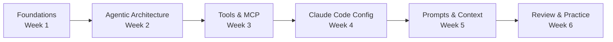

---
tags:
  - CCA-F
  - study-plan
  - roadmap
  - anthropic
  - certification
date: 2026-06-16
status: active
---

# 🗺️ CCA-F Study Roadmap

**Back to:** [[00 - START HERE]] · Course notes: [[C1 - Claude 101]] · [[C2 - Claude Platform 101]] · [[C3 - Introduction to MCP]] · [[C4 - Claude Code 101]] · [[C5 - Introduction to Subagents]] · [[C6 - Building with the Claude API]]

> [!NOTE] About the CCA-F Exam
> **Claude Certified Architect – Foundations** (exam code **CCAR-F**) certifies solution architects who design and implement production applications with Claude. It assumes ~6 months of practical experience.
> - **Items / time:** 60 items · 120 minutes
> - **Format:** Multiple-choice and multiple-response; each item states how many responses to select
> - **Structure:** **4 scenarios drawn at random from a bank of 6**
> - **Passing score:** **720** scaled, on a 100–1,000 scale (criterion-referenced)
> - **Delivery:** **Pearson VUE** — online-proctored or test center; register via the Anthropic Partner Academy
> - **Fee / validity:** $125 USD · credential valid **12 months**
> - **Retakes:** 14 / 30 / 90-day waits after attempts 1 / 2 / 3; max 4 attempts per rolling 12 months
>
> Full facts, all 30 task statements, and the out-of-scope list: [[Official Exam Blueprint]].

---

## 📌 Official Exam Domains

| #   | Domain                                          | Weight  | Items (of 60) |
| --- | ----------------------------------------------- | ------- | ------------- |
| 1   | [[D1 - Agentic Architecture & Orchestration]]   | **27%** | ~16           |
| 2   | [[D2 - Tool Design & MCP Integration]]          | **18%** | ~11           |
| 3   | [[D3 - Claude Code Configuration & Workflows]]  | **20%** | ~12           |
| 4   | [[D4 - Prompt Engineering & Structured Output]] | **20%** | ~12           |
| 5   | [[D5 - Context Management & Reliability]]       | **15%** | ~9            |

*Weights are from the official exam guide v1.0 (July 2026) — see [[Official Exam Blueprint]]. Item counts are approximate: the blueprint states percentages of scored items, not fixed counts.*

> [!TIP] Where to spend the remaining time
> **D1 + D3 = 47%** of the exam. D5 is the lightest at 15%. Section percentages appear on your score report but **do not** determine pass/fail — only the total scaled score does.

---

## 🧭 Learning Path

---

## 📚 Study Resources Map

| Resource                                    | Best For     | Link                                                                  |
| ------------------------------------------- | ------------ | --------------------------------------------------------------------- |
| **SkillJar – Building with the Claude API** | Domains 1, 4 | https://anthropic.skilljar.com/claude-with-the-anthropic-api          |
| **SkillJar – Claude Platform 101**          | Domains 1, 2 | https://anthropic.skilljar.com/claude-platform-101                    |
| **SkillJar – Intro to MCP**                 | Domain 2     | https://anthropic.skilljar.com/introduction-to-model-context-protocol |
| **SkillJar – Claude Code 101**              | Domain 3     | https://anthropic.skilljar.com/claude-code-101                        |
| **SkillJar – Intro to Subagents**           | Domain 1     | https://anthropic.skilljar.com/introduction-to-subagents              |
| **Claude Code Official Docs**               | Domains 1–5  | https://code.claude.com/docs/en/overview                              |
| **Claude Code Best Practices**              | Domain 3, 5  | https://code.claude.com/docs/en/best-practices                        |
| **FlorianBruniaux Ultimate Guide**          | All domains  | https://github.com/FlorianBruniaux/claude-code-ultimate-guide         |
| **Anthropic Cookbooks**                     | Domains 2, 4 | https://github.com/anthropics/claude-cookbooks                        |
| **CertSafari Practice Questions**           | All domains  | https://www.certsafari.com/anthropic/claude-certified-architect       |
| **Preporato Practice Tests**                | All domains  | https://preporato.com/exams/cca-f                                     |
| **Peace Of Code — YouTube Course**          | All domains  | 20 episodes + bonus in `06 - Youtube Course/`, start at [[EP01 - Agentic Loops & stop_reason]] |

---

## 📅 Weekly Study Plan

---

### Week 1 — Foundations

> **Goal:** Build the mental model of Claude Code, API, and the agentic loop before diving into domains.

- [ ] **SkillJar:** Claude 101 (https://anthropic.skilljar.com/claude-101) → note: [[C1 - Claude 101]]
- [ ] **SkillJar:** Claude Platform 101 — modules: "What is the Platform?", "Your first API call", "Choosing the right model" → note: [[C2 - Claude Platform 101]]
- [ ] [[00 - Claude Model Family & API Fundamentals]]
  - Model tiers (current): Fable 5, Opus 4.8/4.7, Sonnet 5, Haiku 4.5 (Mythos 5 = Project Glasswing only; Sonnet 4.6 = previous gen)
  - Context windows (1M except Haiku 200k), pricing, latency trade-offs — *background only: model comparison and pricing are **out of scope**, see [[Official Exam Blueprint]] § 6*
  - Messages API request/response structure: `role`, `content`, `model`, `max_tokens`, `stop_reason`
  - Adaptive thinking vs Extended thinking vs Standard (fixed-`budget_tokens` "extended thinking" is **legacy** on current models — deprecated on Opus 4.6/Sonnet 4.6, and rejected with HTTP 400 on Fable 5, Opus 4.8/4.7, and Sonnet 5; adaptive thinking — `thinking: {type: "adaptive"}` + `output_config.effort` — is the current mechanism)
- [ ] **Read:** https://code.claude.com/docs/en/overview — understand what Claude Code is

---

### Week 2 — Domain 1: Agentic Architecture & Orchestration

> **Goal:** Master multi-agent systems, the agentic loop, session management, and task decomposition.

**Primary Resource:** SkillJar Claude Platform 101 (Agent Loop modules) + Intro to Subagents course · Course notes: [[C2 - Claude Platform 101]], [[C5 - Introduction to Subagents]]

**Companion episodes (folder 06):** [[EP01 - Agentic Loops & stop_reason]] · [[EP02 - Multi-Agent Systems & Coordinator Patterns]] · [[EP03 - Subagent Context Passing & Session Management]] · [[EP04 - Multi-Agent System in Python (Claude SDK)]] · [[EP05 - PreToolUse, PostToolUse Hooks & Task Decomposition]]

- [ ] [[D1 - Agentic Architecture & Orchestration]]
  - **1.1 Agentic Loop Lifecycle**
    - `stop_reason: "tool_use"` → execute tool → return result → next iteration
    - `stop_reason: "end_turn"` → loop terminates
    - Anti-patterns: arbitrary iteration caps, parsing natural language for termination
  - **1.2 Multi-Agent: Coordinator–Subagent Pattern**
    - Hub-and-spoke: coordinator manages all inter-subagent comms
    - Subagents have isolated context (no auto-inherit from coordinator)
    - Coordinator roles: decompose, delegate, aggregate, route
  - **1.3 Subagent Invocation & Context Passing**
    - `Task` tool to spawn subagents; `allowedTools` must include `"Task"`
    - Context must be explicitly passed — subagents don't share memory
    - `AgentDefinition`: descriptions, system prompts, tool restrictions
    - Parallel subagents: multiple `Task` calls in one response
    - `fork_session` for branching from a shared baseline
  - **1.4 Multi-Step Workflows & Handoff Patterns**
    - Programmatic enforcement (hooks, prerequisite gates) > prompt-based
    - Structured handoff summaries for human escalation
    - Decompose multi-concern requests; investigate in parallel
  - **1.5 Agent SDK Hooks**
    - `PostToolUse` hooks: intercept tool results before model processes them
    - Tool call interception hooks for compliance rules (e.g., block refunds >$500)
    - Hooks > prompt instructions for deterministic guarantees
  - **1.6 Task Decomposition Strategies**
    - Prompt chaining (fixed sequential) vs dynamic adaptive decomposition
    - Per-file analysis passes + cross-file integration pass
  - **1.7 Session State, Resumption & Forking**
    - `--resume <session-name>` to continue named sessions
    - `fork_session` for parallel exploration branches
    - Fresh session + structured summary > resuming with stale tool results

**Hands-on:** Read https://code.claude.com/docs/en/agent-sdk/agent-loop.md and https://code.claude.com/docs/en/agent-sdk/subagents.md

---

### Week 3 — Domain 2: Tool Design & MCP Integration

> **Goal:** Design reliable tool interfaces, implement MCP, configure built-in tools.

**Primary Resource:** SkillJar MCP course + Claude Platform 101 MCP module + Claude Cookbooks (tool_use/) · Course note: [[C3 - Introduction to MCP]]

**Companion episodes (folder 06):** [[EP06 - Tool Descriptions & Tool Misrouting]] · [[EP07 - Agent Error Handling & tool_choice]] · [[EP08 - MCP Servers, Config & Cline]] · [[EP09 - Claude Built-in Tools]]

- [ ] [[D2 - Tool Design & MCP Integration]]
  - **2.1 Effective Tool Interface Design**
    - Tool description = primary LLM selection mechanism
    - Include: input formats, example queries, edge cases, boundaries
    - Avoid ambiguous/overlapping descriptions → misrouting
    - Rename tools to eliminate functional overlap
  - **2.2 Structured Error Responses for MCP Tools**
    - `isError` flag pattern for communicating failures
    - Error categories: transient / validation / business / permission
    - Include: `errorCategory`, `isRetryable` boolean, human-readable description
    - Distinguish access failures from valid empty results
  - **2.3 Tool Distribution Across Agents**
    - Too many tools (18 vs 4-5) degrades selection reliability
    - Give agents only tools needed for their role
    - `tool_choice` options (always an object): `{"type": "auto"}`, `{"type": "any"}`, forced `{"type": "tool", "name": "..."}`
  - **2.4 MCP Server Integration**
    - Project-level scoping: `.mcp.json` (shared via version control)
    - User-level: `~/.claude.json` (personal/experimental)
    - Environment variable expansion: `${GITHUB_TOKEN}` in `.mcp.json`
    - MCP resources: expose content catalogs to reduce exploratory tool calls
  - **2.5 Built-In Tools**
    - `Grep`: search file contents by pattern
    - `Glob`: find files by name pattern (`**/*.test.tsx`)
    - `Read`/`Write`: full file operations
    - `Edit`: targeted modifications using unique text matching
    - Fallback: when Edit fails (non-unique text) → Read + Write

**Hands-on:** Explore https://github.com/anthropics/claude-cookbooks (tool_use/ folder)

---

### Week 4 — Domain 3: Claude Code Configuration & Workflows

> **Goal:** Master CLAUDE.md hierarchy, slash commands, skills, path-scoped rules, plan mode, CI/CD.

**Primary Resource:** FlorianBruniaux Ultimate Guide (architecture + configuration sections) + SkillJar Claude Code 101 · Course note: [[C4 - Claude Code 101]]

**Companion episodes (folder 06):** [[EP10 - CLAUDE.md Hierarchy & Config Rules]] · [[EP11 - Custom Slash Commands & Skills]] · [[EP12 - Plan Mode vs Execute]] · [[EP13 - Claude Code CI-CD Pipelines]]

- [ ] [[D3 - Claude Code Configuration & Workflows]]
  - **3.1 CLAUDE.md Hierarchy & Modular Organization**
    - User-level: `~/.claude/CLAUDE.md` (personal, NOT version-controlled)
    - Project-level: `.claude/CLAUDE.md` or root `CLAUDE.md` (shared)
    - Directory-level: subdirectory `CLAUDE.md` files
    - `@import` syntax for modular external file references
    - `.claude/rules/` for topic-specific rule files
    - `/memory` command: verify which memory files are loaded
  - **3.2 Custom Slash Commands & Skills**
    - Project-scoped: `.claude/commands/` (versioned, team-shared)
    - User-scoped: `~/.claude/commands/` (personal)
    - Skills in `.claude/skills/` with `SKILL.md` + frontmatter
    - `context: fork` — run skill in isolated subagent context
    - `allowed-tools` in frontmatter restricts tool access
    - `argument-hint` to prompt for required parameters
  - **3.3 Path-Specific Rules**
    - `.claude/rules/` files with YAML frontmatter `paths:` glob patterns
    - Conditional loading: rules activate only when editing matching files
    - Glob patterns span multiple directories (better than subdirectory CLAUDE.md)
  - **3.4 Plan Mode vs Direct Execution**
    - Plan mode: complex tasks, large-scale changes, multiple valid approaches
    - Direct execution: simple well-scoped single-file changes
    - Explore subagent: isolates verbose discovery, returns summaries
  - **3.5 Iterative Refinement Techniques**
    - Concrete input/output examples > prose descriptions
    - Test-driven iteration: write tests first, share failures to guide improvement
    - Interview pattern: have Claude ask questions before implementing
    - Interacting problems → single message; independent problems → sequential
  - **3.6 CI/CD Pipeline Integration**
    - `-p` / `--print` flag: non-interactive mode for CI pipelines
    - `--output-format json` + `--json-schema`: structured output for automated parsing
    - CLAUDE.md provides project context (testing standards, conventions) to CI Claude
    - Independent review instance > self-review for catching subtle issues

**Hands-on:** https://code.claude.com/docs/en/best-practices + FlorianBruniaux guide sections

---

### Week 5 — Domains 4 & 5: Prompt Engineering + Context Management

> **Goal:** Master structured outputs, few-shot prompting, batch processing, and context reliability patterns.

**Primary Resource:** SkillJar "Building with the Claude API" (Prompt Engineering + Structured Output + RAG modules) · Course note: [[C6 - Building with the Claude API]]

**Companion episodes (folder 06):** [[EP14 - Prompt Engineering - Explicit Criteria & False Positives]] · [[EP15 - Few-Shot Prompting]] · [[EP16 - Structured Output & JSON Schema]] · [[EP17 - Batch API & Multi-Pass Review]] · [[EP18 - Why AI Agents Forget (Context Engineering)]] · [[EP19 - Subagent Error Propagation & Context Management]] · [[EP20 - When AI Needs a Human]]

- [ ] [[D4 - Prompt Engineering & Structured Output]]
  - **4.1 Explicit Criteria to Reduce False Positives**
    - Specific categorical criteria > vague instructions ("be conservative")
    - Define what to report vs skip with code examples per severity level
  - **4.2 Few-Shot Prompting**
    - 2-4 examples for ambiguous scenarios showing reasoning
    - Demonstrate specific output format (location, issue, severity, fix)
    - Show acceptable patterns vs genuine issues to calibrate
  - **4.3 Structured Output via Tool Use + JSON Schemas**
    - `tool_use` with JSON schema = most reliable structured output
    - `tool_choice: {"type": "any"}` = guarantees a tool is called (not conversational text)
    - Forced selection: `{"type": "tool", "name": "extract_metadata"}`
    - Optional/nullable fields when source may not contain data
    - Enum with `"other"` + detail string for extensible categorization
  - **4.4 Validation, Retry & Feedback Loops**
    - Retry with error feedback: append specific errors to prompt
    - Retries ineffective when data is simply absent (not a format issue)
    - `detected_pattern` field to track false positive dismissal patterns
  - **4.5 Batch Processing Strategies**
    - Message Batches API: 50% cost, up to 24h window, no latency SLA
    - Use for: nightly reports, weekly audits — NOT pre-merge blocking checks
    - Multi-turn conversations & server-side tool use ARE supported in a batch (same agentic loop as sync Messages); only an interactive *client-executed* tool round-trip can't happen mid-request — and that's true of any single Messages call, not batch-specific
    - `custom_id` for correlating request/response pairs
  - **4.6 Multi-Instance & Multi-Pass Review**
    - Self-review limitation: model retains generation reasoning context
    - Independent instance (no prior context) catches more subtle issues
    - Per-file passes for local issues + separate cross-file integration passes

- [ ] [[D5 - Context Management & Reliability]]
  - **5.1 Conversation Context Across Long Interactions**
    - Avoid progressive summarization of numerical values, dates, amounts
    - "Lost in the middle" effect: reliable at beginning + end, weak in middle
    - Trim verbose tool outputs to only relevant fields
    - Extract transactional facts into persistent "case facts" block
  - **5.2 Escalation & Ambiguity Resolution**
    - Escalation triggers: explicit customer request, policy gaps, no progress
    - Honor explicit human agent requests immediately — don't attempt resolution first
    - Multiple customer matches → request additional identifiers
  - **5.3 Error Propagation in Multi-Agent Systems**
    - Return structured errors: failure type, attempted query, partial results
    - Distinguish access failures from valid empty results
    - Subagents recover transient errors locally; propagate only unresolvable ones
  - **5.4 Context in Large Codebase Exploration**
    - Context degradation: model starts referencing "typical patterns" vs specifics
    - Scratchpad files for persisting key findings across context boundaries
    - `/compact` command to reduce context during extended sessions
    - Structured state persistence for crash recovery (manifest files)
  - **5.5 Human Review Workflows & Confidence Calibration**
    - Aggregate accuracy metrics (97%) may mask poor performance on specific types
    - Stratified random sampling for measuring error rates
    - Field-level confidence scores calibrated on labeled validation sets
  - **5.6 Information Provenance in Multi-Source Synthesis**
    - Preserve claim-source mappings through summarization steps
    - Conflicting statistics → annotate with source attribution, don't resolve arbitrarily
    - Include publication/collection dates to prevent temporal misinterpretation

---

### Week 6 — Review & Exam Simulation

> **Goal:** Measure readiness on **unseen** items under real time pressure, then close what that measurement exposes.

> [!IMPORTANT] Readiness is first-pass accuracy on unseen items at under 2 minutes each
> Every bank in this vault is *worked* — the keys were written here — so re-answering one measures recall of your own key, not architectural judgment. Do not set a target like "95% on a bank I have already keyed"; that number is near-guaranteed and predicts nothing. A passer who drove Anthropic's own practice exam from the 700s to 930 across three runs described the climb as "memorization wearing the costume of mastery," then found the real exam shared **no questions** with it.

> [!WARNING] Two failure modes reported by people who passed
> - **Wording, not concepts, is the gap.** Real stems bury the disqualifying qualifier mid-sentence. "On the mock I could move fast, but on the real exam reading carefully was the whole game." Drill dense phrasing, not more facts.
> - **D3 is where points leak.** One passer's score report flagged **Claude Code Configuration & Workflows as their weakest domain at 69%** despite using Claude Code daily; another found "quite a few questions on git pipeline commands, more than I expected from the mock." Daily use produces fluency with the parts you reach for and blind spots around the rest — which is exactly what this vault's own [[Answer Patterns Index]] already records about the CyberSkill sittings.
>
> Sources: [Very Good Ventures — 738](https://verygood.ventures/blog/passing-the-claude-certified-architect-exam/) · [re:cinq — study guide and how I passed](https://re-cinq.com/blog/claude-certified-architect-foundations-exam) · [Udacity — explained by someone who passed](https://www.udacity.com/blog/the-claude-certified-architect-exam-explained-by-someone-who-passed-it/)

> [!NOTE] 🔒 marks material kept out of the shared repo
> Personal sitting records and mistake notes are `.gitignore`d and exist **only in your local clone**. Teammates who clone this vault will not have them, and the links to them below will not resolve on their machines.

#### Step 1 — Cold diagnostic, official material only

- [ ] **Official sample questions:** `05 - Practice/Exam Guide - Sample Questions/` — 12 items from § 9 of the exam guide, with Anthropic's own rationales rebutting every distractor. **The only officially-sourced questions in the vault — sit these first**, they calibrate you to the real house style.
- [ ] **Official Anthropic practice exam — run 1.** Sit it **cold**, full 120 minutes, without studying for it. It grades each item the moment you answer and explains why the key is the key, and the score report breaks down by domain — that breakdown is what drives Steps 3 and 4. It is retakeable, but it **reuses a fixed question pool**, so budget exactly **two runs** and hold the second for Step 6.
  - Certification track entry: https://anthropic.skilljar.com/claude-certified-architect-foundations-access-request

> [!WARNING] Unverified
> The practice exam is delivered inside the certification track rather than at a standalone public URL, so the link above is the track entry point, not the exam itself. Confirm the exact location when you register.

#### Step 2 — Spaced repetition, daily from day 1 (runs in parallel with every step below)

- [ ] **`paullarionov/claude-certified-architect` Anki decks** — 15–20 min/day, starting immediately. Spaced repetition only works spread across weeks; saved for the final block it degrades into just another question bank.
  - https://github.com/paullarionov/claude-certified-architect
- [ ] [[Flashcards]] and [[Critical Terms Glossary]]
  - Key CLI flags: `--resume`, `--print`, `--output-format json`, `--json-schema`
  - Key commands: `/memory`, `/compact`
  - Key patterns: `stop_reason`, `isError`, `tool_choice`, `custom_id`, `AgentDefinition`, `PostToolUse`, `fork_session`

#### Step 3 — Close D3 first, driven by Step 1's weak domains

- [ ] **Connectry `architect-cert` MCP** — `npm install -g connectry-architect-mcp`, then register it with your MCP client. 390 scenario questions mapped to **all 30 task statements**, which makes it the only source indexed the same way [[Official Exam Blueprint]] is — so it can prove D3 coverage rather than assert it. Runs locally, MIT, no account.
  - https://github.com/Connectry-io/connectrylab-architect-cert-mcp
- [ ] **Claude Code scenario drills:** `05 - Practice/Vault-authored - Claude Code Scenario Drills/` — 20 items covering official **scenarios 2 and 5**, the two Claude-Code frames no sourced bank tests (~93% chance at least one appears). Vault-authored: exam-accurate topics, uncalibrated difficulty.
- [ ] **In-vault question bank:** [[CCA-F-practice-exam-questions]] (60 Qs, certificationpractice.com) — ✅ worked answer key added 2026-08-25 (vault-reasoned, not grader-confirmed). **A quarter of it is D3** — the best sourced Claude Code drilling in the vault.

#### Step 4 — Volume on unfamiliar phrasing

- [ ] **CertSafari practice:** do all 614 questions by domain — https://www.certsafari.com/anthropic/claude-certified-architect
- [ ] **Preporato practice tests:** https://preporato.com/exams/cca-f
- [ ] **FlorianBruniaux 271-question quiz:** https://github.com/FlorianBruniaux/claude-code-ultimate-guide/blob/main/quiz

#### Step 5 — Review the CyberSkill material, do not re-answer it (timebox ~2h)

> [!TIP] Read these sideways, not front-to-back
> The signal in the three CyberSkill sittings has already been extracted into the two notes below. Re-sitting them to chase a percentage spends hours to confirm something you know.

- [ ] [[Answer Patterns Index]] — 180 explanations grouped into recurring principles, each tied to a trigger row in [[00-golden-rules-cheatsheet]].
- [ ] 🔒 [[Weak Areas Deep Dive]] — notes from practice-test mistakes. **Local only.**
- [ ] **In-vault unified bank:** `05 - Practice/CyberSkill CCAF - Unified Bank/` — the three CyberSkill sittings **deduplicated**: 180 question-slots resolved into the **80 distinct items** behind them, 20 per domain exactly. `U1`–`U60` are full multiple choice, `U61`–`U80` open-response. **69/80 grader-verified.** Use this for *coverage without repetition* — it is the only CyberSkill folder in the shared repo.
- [x] 🔒 **Timed mock, sat 2026-08-24:** `05 - Practice/CyberSkill CCAF - Timed Mock 2026-08-24/` — **scored 43/60 (71.67%), one mark below CyberSkill's 72% bar** (the site's threshold — the exam scores 720 scaled on 100–1,000, see [[Official Exam Blueprint]] § 1). All 60 answers grader-authoritative; stems captured but not the options. **Local only.**
- [ ] 🔒 **New Mock Exam:** `05 - Practice/CyberSkill CCAF - New Mock Exam/` — 60 Qs with a matched worked key by scenario domain (**57/60** verified against the source grader). The one complete set. **Local only.**
- [ ] 🔒 **Mock Exam:** `05 - Practice/CyberSkill CCAF - Mock Exam/` — worked answers by scenario, question file never captured. A second sitting of the *same* bank as New Mock Exam (42/60 overlap, different numbering). **Local only.**

#### Step 6 — Final week: the honesty check

- [ ] **Official Anthropic practice exam — run 2.** Cold and timed, held back since Step 1. Everything else you have drilled is warm by now, so this is the only reading that still means anything. Watch the clock from question 1: 60 items in 120 minutes is under two minutes each, and the scenarios are dense.
- [ ] Rehearse the mechanics: four blocks of fifteen questions, each on its own production scenario, drawn from **four of the six** official scenarios at random. Flag and move rather than grinding — one passer flagged 7 of the first 10 and still passed, changing about half of those answers on the second read.
- [ ] **YouTube course wrap-up:** [[Bonus - Exam Questions Solved & Exam Traps]] (folder 06)

> [!WARNING] The stakes are asymmetric
> Fail and you cannot retake for **six months**. Pass and the credential expires **six months** later anyway. Over-preparing on unseen items is cheap; being fooled by a warm bank is not.

---

## ✅ Domain Progress Tracker

| Domain                        | Subdomains                            | Status |
| ----------------------------- | ------------------------------------- | ------ |
| **D1: Agentic Architecture**  | 1.1 Agentic loop                      | ⬜      |
|                               | 1.2 Multi-agent coordinator           | ⬜      |
|                               | 1.3 Subagent invocation & context     | ⬜      |
|                               | 1.4 Multi-step workflows & handoffs   | ⬜      |
|                               | 1.5 Agent SDK hooks                   | ⬜      |
|                               | 1.6 Task decomposition                | ⬜      |
|                               | 1.7 Session state, resume & fork      | ⬜      |
| **D2: Tool Design & MCP**     | 2.1 Tool interface design             | ⬜      |
|                               | 2.2 Structured error responses        | ⬜      |
|                               | 2.3 Tool distribution & `tool_choice` | ⬜      |
|                               | 2.4 MCP server integration            | ⬜      |
|                               | 2.5 Built-in tools (Grep/Glob/Edit)   | ⬜      |
| **D3: Claude Code Config**    | 3.1 CLAUDE.md hierarchy               | ⬜      |
|                               | 3.2 Slash commands & skills           | ⬜      |
|                               | 3.3 Path-specific rules               | ⬜      |
|                               | 3.4 Plan mode vs direct execution     | ⬜      |
|                               | 3.5 Iterative refinement              | ⬜      |
|                               | 3.6 CI/CD pipeline integration        | ⬜      |
| **D4: Prompt Engineering**    | 4.1 Explicit criteria & precision     | ⬜      |
|                               | 4.2 Few-shot prompting                | ⬜      |
|                               | 4.3 Structured output & JSON schemas  | ⬜      |
|                               | 4.4 Validation & retry loops          | ⬜      |
|                               | 4.5 Batch processing                  | ⬜      |
|                               | 4.6 Multi-instance review             | ⬜      |
| **D5: Context & Reliability** | 5.1 Long conversation context         | ⬜      |
|                               | 5.2 Escalation & ambiguity            | ⬜      |
|                               | 5.3 Error propagation                 | ⬜      |
|                               | 5.4 Large codebase exploration        | ⬜      |
|                               | 5.5 Human review & confidence         | ⬜      |
|                               | 5.6 Information provenance            | ⬜      |

> [!TIP] Status key
> ⬜ Not started · 🔵 In progress · ✅ Done · ❌ Needs review

---

## 🔑 Critical Terms to Know

| Term | Domain | What It Does |
|------|--------|--------------|
| `stop_reason: "tool_use"` | D1 | Loop continues — tool execution required |
| `stop_reason: "end_turn"` | D1 | Loop terminates |
| `fork_session` | D1 | Create independent branch from shared baseline |
| `--resume <name>` | D1 | Resume a named session |
| `PostToolUse` hook | D1 | Intercept tool result before model sees it |
| `AgentDefinition` | D1 | Config object: description, system prompt, tools |
| `isError` flag | D2 | MCP tool failure signaling |
| `tool_choice: "any"` | D2/D4 | Guarantees tool call over conversational text |
| `.mcp.json` | D2 | Project-scoped MCP config (versioned) |
| `~/.claude.json` | D2 | User-scoped MCP config (personal) |
| `CLAUDE.md` | D3 | Agent instructions hierarchy file |
| `@import` | D3 | Modular file reference in CLAUDE.md |
| `context: fork` | D3 | Runs skill in isolated subagent context |
| `--print` / `-p` | D3 | Non-interactive CI mode |
| `--output-format json` | D3 | Machine-parseable CI output |
| `/memory` | D3 | View which memory files are loaded |
| `/compact` | D5 | Reduce context usage in long sessions |
| `custom_id` | D4 | Correlates batch API request/response pairs |
| Message Batches API | D4 | 50% cost savings, async, 24h window |

---

## 📚 Official Resources

| Resource | URL |
|----------|-----|
| Claude Code Docs | https://code.claude.com/docs/en/overview |
| Claude Code Best Practices | https://code.claude.com/docs/en/best-practices |
| Agent SDK Overview | https://code.claude.com/docs/en/agent-sdk/overview |
| Agent Loop Docs | https://code.claude.com/docs/en/agent-sdk/agent-loop.md |
| Hooks Docs | https://code.claude.com/docs/en/agent-sdk/hooks.md |
| MCP Integration | https://code.claude.com/docs/en/agent-sdk/mcp.md |
| Anthropic API Docs | https://platform.claude.com/docs/en/home |
| Anthropic SkillJar (all courses) | https://anthropic.skilljar.com |
| Claude Cookbooks | https://github.com/anthropics/claude-cookbooks |
| Ultimate Guide (FlorianBruniaux) | https://github.com/FlorianBruniaux/claude-code-ultimate-guide |

---

*Last updated: 2026-08-25 · Exam facts from [[Official Exam Blueprint]] (official exam guide v1.0, July 2026). CertSafari is third-party practice material, not a spec source.*
