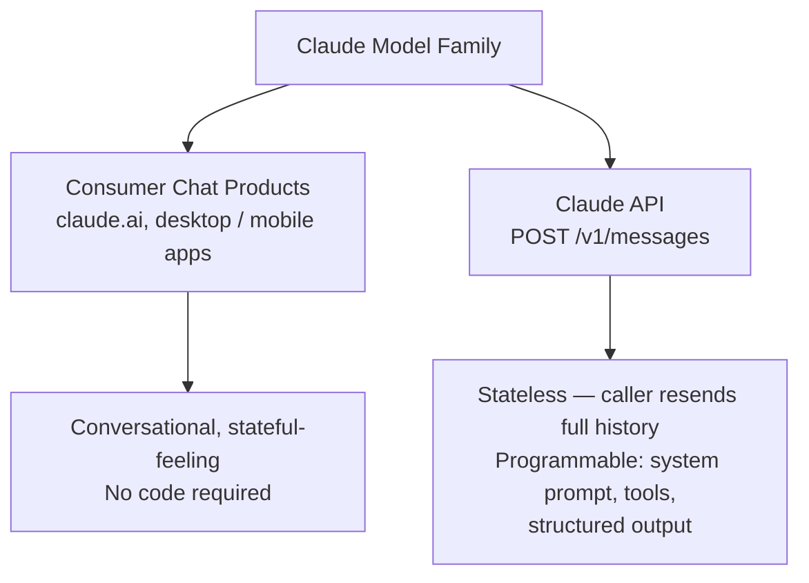
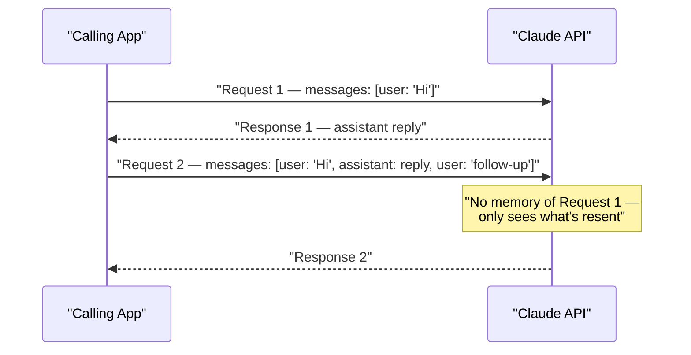
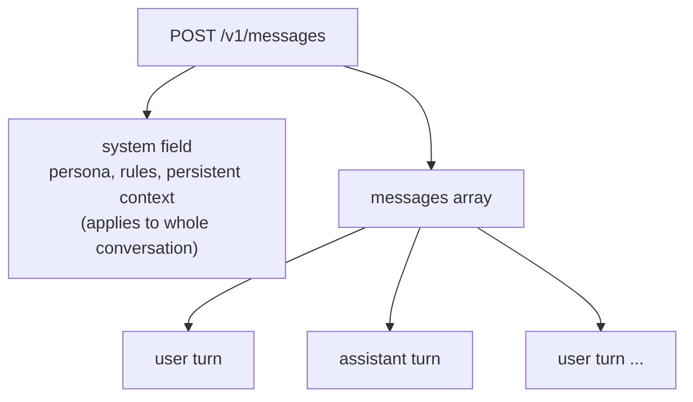
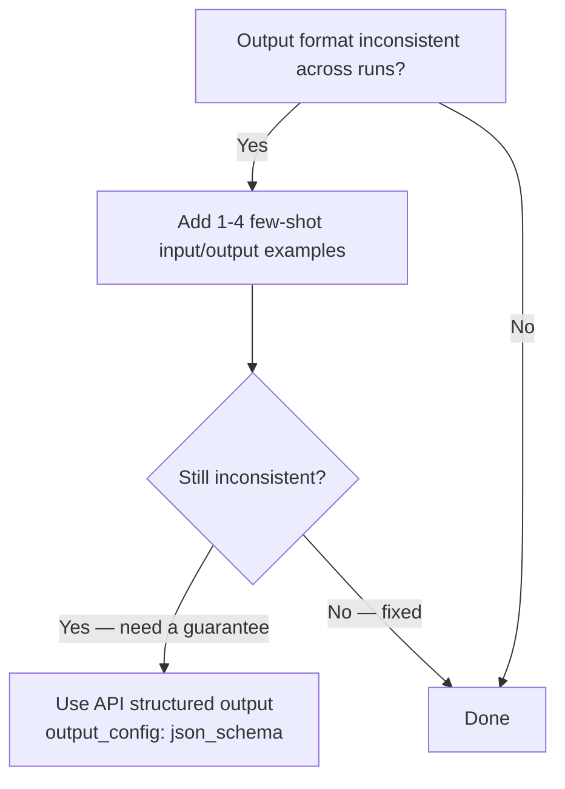

---
tags:
  - CCA-F
  - course
  - domain-4
  - fundamentals
  - prompt-engineering
date: 2026-07-11
status: done
---

# 🎓 Claude 101

**Back to:** [[CCA-F Study Roadmap]]
https://anthropic.skilljar.com/claude-101

> [!NOTE] What this course teaches
> Claude 101 is the entry-level orientation course: what Claude is, how the model family is organized, the core mechanics of prompting (instructions, roles, examples, output formatting), and the most common tasks people use Claude for (summarization, extraction, classification, Q&A, generation). It feeds the **CCA-F fundamentals** (model family/API basics) and **Domain 4 — Prompt Engineering & Structured Output**.

---

## What this course covers

- **What Claude is** — a family of large language models built by Anthropic, accessed either through consumer chat products (claude.ai, desktop/mobile apps) or programmatically through the API.
- **The model family at a glance** — different model tiers trade off capability, speed, and cost; picking a model is itself a design decision (see [[00 - Claude Model Family & API Fundamentals]] for the authoritative lineup and IDs).
- **Chat product vs. API** — the same underlying models power both, but they are different products with different capabilities and audiences.
- **Core prompting concepts:**
  - Clear, direct instructions — saying exactly what you want, including what "done" looks like.
  - **Roles** — the `system` field sets persistent context/persona/rules for the whole conversation; `messages` carry the turn-by-turn `user`/`assistant` exchange.
  - **Examples (few-shot)** — showing 1–4 input/output pairs to pin down format and tone instead of describing it in the abstract.
  - **Output formatting** — asking for a specific shape of answer (bullets, a fixed template, XML-ish tags, or in the API a formal `output_config` schema).
- **Common use cases:**
  - Summarization — condensing long text to key points.
  - Extraction — pulling structured fields (names, dates, entities) out of unstructured text.
  - Classification — sorting input into a fixed set of categories/labels.
  - Q&A — answering questions grounded in provided context or general knowledge.
  - Generation — drafting new text (emails, code, copy) from a description.

---

## 🧠 What to know & memorize after completing it

> [!IMPORTANT] Chat product vs. API are different surfaces
> claude.ai (and the desktop/mobile apps) is the **consumer chat product** — conversational, stateful-feeling, no code required. The **API** (`POST /v1/messages`) is what developers integrate into their own applications — it is stateless (you resend the full `messages` history every call), programmable, and exposes controls (system prompts, tools, structured output, `output_config`) that the chat UI does not expose directly.

*The API itself holds no conversation state — the calling app must resend the full `messages` history on every call.*

> [!IMPORTANT] The `system` prompt sets persistent context, not just "tone"
> The `system` field is where you put persona, rules, constraints, and background the model should hold across the whole conversation. It is separate from the `messages` array, which alternates `user`/`assistant` turns. Confusing "put it in the system prompt" with "put it in the first user turn" is a common early mistake — both work, but `system` is the conventional place for instructions that should apply to every turn.

> [!IMPORTANT] Few-shot examples fix format problems that instructions alone can't
> If detailed written instructions still produce inconsistent output shape, the fix is to **add 1–4 concrete input/output examples**, not to write a longer paragraph of instructions. This is the seed of the Domain 4 few-shot pattern — see [[D4 - Prompt Engineering & Structured Output]].

*Escalation path: clearer instructions → few-shot examples → enforced `output_config` schema (the last is the only one that **guarantees** valid structure; covered fully in Domain 4).*

> [!IMPORTANT] Model choice is a real design decision, not an afterthought
> Models in the current lineup differ across dimensions like capability, context window (1M for most, 200K for Haiku 4.5), max output (128K for most, 64K for Haiku 4.5), and $/1M token price (see [[00 - Claude Model Family & API Fundamentals]]). Claude 101 introduces the idea that choosing a model = trading off capability vs. latency vs. cost for the task at hand — this is expanded fully in Domain 1/fundamentals, not decided here.

> [!WARNING] Anti-patterns from this course
> - ❌ Vague instruction: "Summarize this well." ✅ Explicit instruction: "Summarize in 3 bullets, each under 20 words, covering only the decision and its rationale."
> - ❌ Treating the chat product and the API as interchangeable — code you write against the API (system prompts, `tools`, `output_config`) has no direct equivalent typed into the claude.ai chat box.
> - ❌ Assuming the API "remembers" prior turns on its own — it does not; statelessness means the calling application must resend the conversation history each request.
> - ❌ Relying only on natural-language format requests ("reply in JSON") when the task needs guaranteed-valid structure — that's a job for the API's structured-output features (`output_config: {format: {type: "json_schema", ...}}`), covered in Domain 4, not this intro course.

---

## 🔗 Related domain notes

- [[00 - Claude Model Family & API Fundamentals]] — the authoritative model lineup, IDs, context windows, and pricing referenced when this course talks about "the Claude models."
- [[D4 - Prompt Engineering & Structured Output]] — deepens the "clear instructions + examples + output formatting" ideas from this course into explicit criteria, few-shot design rules, and enforced structured output.
- [[Critical Terms Glossary]] — look up terms like `system` prompt, `messages`, few-shot, and stateless as they first appear here.
- [[Flashcards]] — drill the chat-vs-API distinction and the four core prompting levers (instructions, roles, examples, formatting).

---

## 🃏 Quick self-check

**Q:** What is the fundamental architectural difference between claude.ai and the API?
**A:** claude.ai is a consumer chat product; the API (`POST /v1/messages`) is a stateless, programmable interface — every call must resend the full conversation history, and it exposes controls (system prompts, tools, structured output) not available in the chat UI.

**Q:** Where do persistent instructions/persona for a conversation belong in an API request?
**A:** In the `system` field, separate from the `messages` array of alternating `user`/`assistant` turns.

**Q:** Your prompt has detailed written instructions but the model's output format is still inconsistent across runs. What should you add?
**A:** Few-shot examples (1–4 concrete input/output pairs) — showing the format works better than describing it further in prose.

**Q:** Name the five common use-case categories this course introduces.
**A:** Summarization, extraction, classification, Q&A, and generation.

**Q:** Why is picking a specific model an active design decision rather than a default choice?
**A:** Because models differ in context window, max output tokens, and input/output price per 1M tokens — the right choice depends on the task's required capability, latency tolerance, and budget.

**Q:** True/false: asking the model to "reply in JSON" in plain language is the same guarantee as the API's `output_config` structured-output feature.
**A:** False — a plain-language request is only a probabilistic instruction; `output_config: {format: {type: "json_schema", schema: {...}}}` (or a `strict: true` tool definition) is what guarantees schema-valid output.
