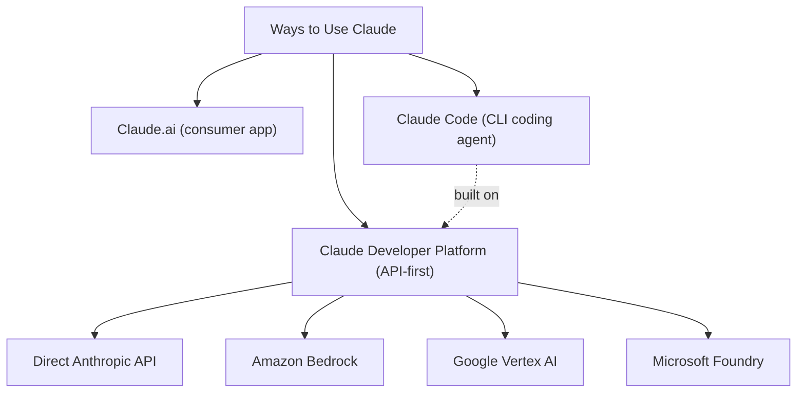
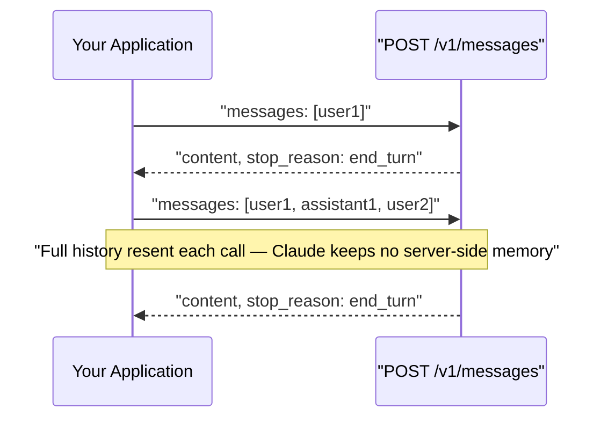
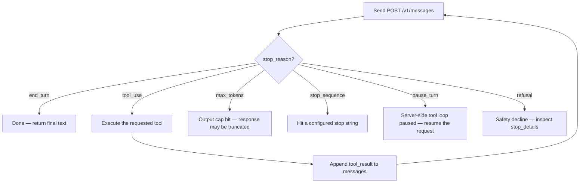
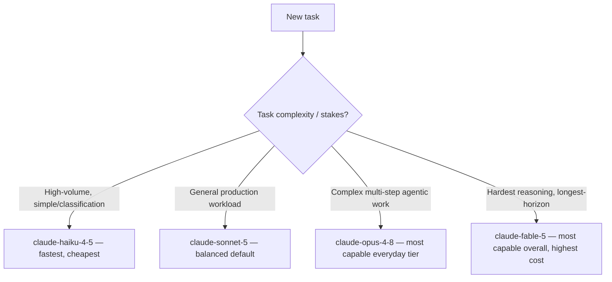

---
tags:
  - CCA-F
  - course
  - domain-1
  - domain-2
  - platform-fundamentals
date: 2026-07-11
status: not-started
---

# 🎓 Claude Platform 101

**Back to:** [[CCA-F Study Roadmap]]
https://anthropic.skilljar.com/claude-platform-101

> [!NOTE] What this course teaches
> This is the on-ramp to the **Claude Developer Platform** — what it is, how to make your first `POST /v1/messages` call, how to read the request/response shape, and how to pick between Opus, Sonnet, and Haiku. It also gives a first look at the agent loop and tools/MCP. Feeds **Domain 1 (Agentic Architecture & Orchestration)** and **Domain 2 (Tool Design & MCP Integration)**, plus general exam fundamentals covered in [[00 - Claude Model Family & API Fundamentals]].

---

## What this course covers

- **What is the Platform?** — the Claude Developer Platform as the API-first surface for building with Claude (distinct from the Claude.ai consumer app and from Claude Code); access via direct API, Amazon Bedrock, Google Vertex AI, Microsoft Foundry
- **Your first API call** — authenticating, constructing a minimal `POST /v1/messages` request, and reading the JSON response back
- **Request/response structure** — the core fields: `model`, `max_tokens`, `messages`, optional `system`; response fields `content`, `stop_reason`, `usage`
- **Choosing the right model** — the intelligence/speed/cost tradeoff across the model family; matching model tier to task complexity
- **The agent loop (first look)** — how a single request/response pair becomes a loop when `tools` are involved: Claude responds, you execute, you feed results back
- **Tools & MCP (first look)** — that Claude can request actions via `tools` in the same `/v1/messages` call, and that MCP is the standard way to plug in external tool servers rather than hand-rolling every integration

---

## 🧠 What to know & memorize after completing it

> [!IMPORTANT] Everything goes through one endpoint
> The Claude Developer Platform is built around a single core endpoint: **`POST /v1/messages`** (the Messages API). Tool use, structured output, and multi-turn chat are all *features of this one endpoint* — there is no separate "chat API" vs "tools API" vs "structured output API".

> [!IMPORTANT] Minimum required request fields
> A valid `/v1/messages` request needs `model`, `max_tokens`, and `messages` (an array of `{role, content}` objects). `system` is optional and is a **top-level parameter**, not a message with `role: "system"` — there is no `system` role in the Messages API.

> [!IMPORTANT] The API is stateless
> Every call resends the *full* conversation history in `messages`. Claude does not remember prior turns server-side — your application (or Claude Code's session state) is responsible for keeping and resending context.

> [!IMPORTANT] `stop_reason` drives the agent loop
> `stop_reason` is how your code decides what to do next, never the model's prose:
> - `end_turn` — Claude is done; terminate the loop
> - `tool_use` — Claude wants to call a tool; execute it, return the result, continue the loop
> - `max_tokens` — hit the output cap; response may be truncated
> - `pause_turn` — a server-side tool loop paused mid-way; resume the request
> - `stop_sequence` — hit a configured stop string
> - `refusal` — a safety decline; inspect `stop_details`

> [!WARNING] Anti-pattern: loop termination
> ❌ Terminating the agent loop by parsing Claude's text for words like "done" or "finished"
> ❌ Treating any `text` content block as a completion signal
> ✅ Only terminate when `stop_reason` is exactly `end_turn`; only continue and execute a tool when `stop_reason` is `tool_use`

> [!IMPORTANT] Model selection is an intelligence/speed/cost tradeoff
> - `claude-opus-4-8` — most capable of the everyday tiers; complex multi-step agentic work; default/most-used model for demanding tasks
> - `claude-sonnet-5` — balanced intelligence and speed; strong default for general production workloads
> - `claude-haiku-4-5` — fastest and cheapest; near-frontier intelligence; ideal for simple/high-volume subagent or classification tasks
> - `claude-fable-5` — the most capable model overall, for the hardest reasoning/long-horizon agentic work (highest cost)
> There is no single "best" model — the exam expects you to justify a choice by task complexity, latency needs, and cost, not just pick the newest one.

> [!WARNING] Anti-pattern: model choice
> ❌ Defaulting to the most powerful model for every task "to be safe" — wastes cost/latency on tasks a cheaper model handles fine
> ❌ Defaulting to the cheapest model for everything to save cost — causes silent quality failures on complex reasoning
> ✅ Match model tier to task complexity; route simple/high-volume steps (e.g. Explore-style subagents) to `claude-haiku-4-5`, reserve `claude-opus-4-8` / `claude-fable-5` for the hard steps

> [!IMPORTANT] The agent loop, in one sentence
> The agent loop is what happens when you keep calling `/v1/messages` in a cycle: Claude reads the current state → responds with either final text (`stop_reason: end_turn`) or a tool request (`stop_reason: tool_use`) → your code executes the tool and appends a `tool_result` message → the cycle repeats. This is the same primitive underlying single API calls, Claude Code, and multi-agent systems.

> [!IMPORTANT] Tools and MCP, first look
> - `tools` is a request field: an array of tool definitions Claude can choose to call, controlled by `tool_choice` (`auto`, `any`, `tool`, `none`)
> - **MCP (Model Context Protocol)** is the standardized way to expose external tools/servers to Claude rather than writing bespoke integration code per tool — this course only introduces the concept; deep MCP mechanics are covered in Domain 2 material

> [!WARNING] Unverified — confirm against official docs
> This course's exact module names/order beyond "What is the Platform?", "Your first API call", and "Choosing the right model" (as scoped in [[CCA-F Study Roadmap]]) should be confirmed against the live SkillJar course, since course content can change over time.

---

## 🔗 Related domain notes

- [[00 - Claude Model Family & API Fundamentals]] — the full model comparison table (context windows, pricing, thinking modes) and API request/response anatomy this course introduces at a high level
- [[D1 - Agentic Architecture & Orchestration]] — the agent loop lifecycle and `stop_reason` semantics this course gives a "first look" at
- [[D2 - Tool Design & MCP Integration]] — full depth on tool interface design, MCP servers, and error handling that this course only previews
- [[Critical Terms Glossary]] — canonical definitions for `stop_reason`, Messages API, MCP, and other terms introduced here
- [[Flashcards]] — spaced-repetition cards covering model selection and API fundamentals

---

## 🃏 Quick self-check

**Q: What is the single endpoint that the entire Claude Developer Platform is built around?**
A: `POST /v1/messages` (the Messages API). Tools, structured output, and multi-turn chat are all features of this one endpoint.

**Q: What are the three required fields in a minimal `/v1/messages` request?**
A: `model`, `max_tokens`, and `messages`. `system` is optional and top-level (not a message role).

**Q: Why must you resend the full `messages` array on every API call?**
A: The API is stateless — Claude does not retain conversation history server-side between calls.

**Q: Your loop-control code checks `stop_reason`. What value means "stop", and what value means "execute a tool and continue"?**
A: `end_turn` means stop; `tool_use` means execute the requested tool, append the result, and continue the loop.

**Q: A high-volume, low-complexity classification task needs to run on thousands of inputs cheaply. Which model tier fits best, and why?**
A: `claude-haiku-4-5` — fastest and cheapest tier with near-frontier intelligence, appropriate when task complexity is low and volume/cost/latency dominate the decision.

**Q: What does MCP let you do that hand-written `tools` definitions alone don't solve well?**
A: MCP standardizes how external tool servers are exposed to Claude, so you can plug in shared/reusable tool integrations instead of custom-building and maintaining bespoke tool code for every external system.
