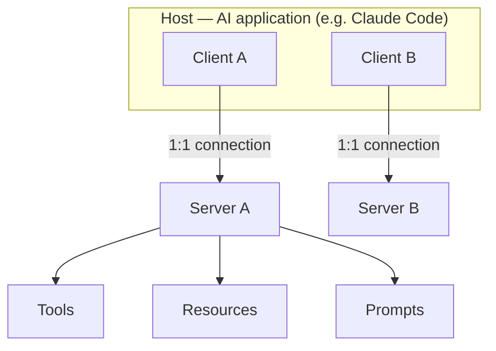
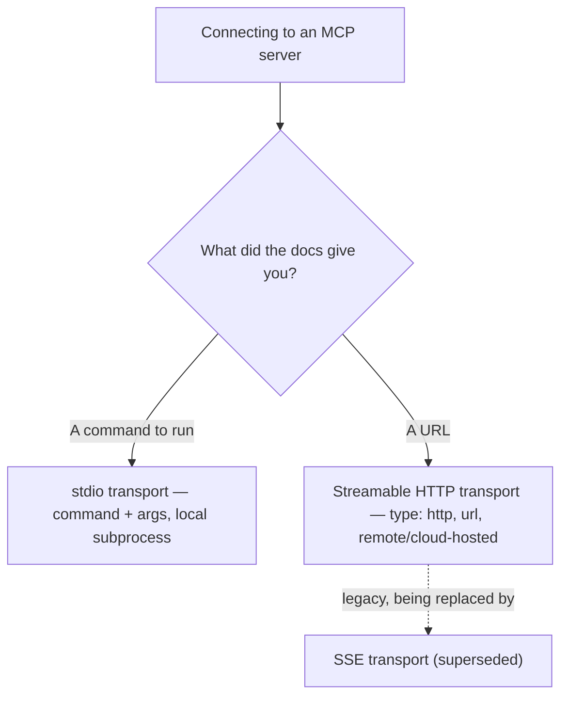
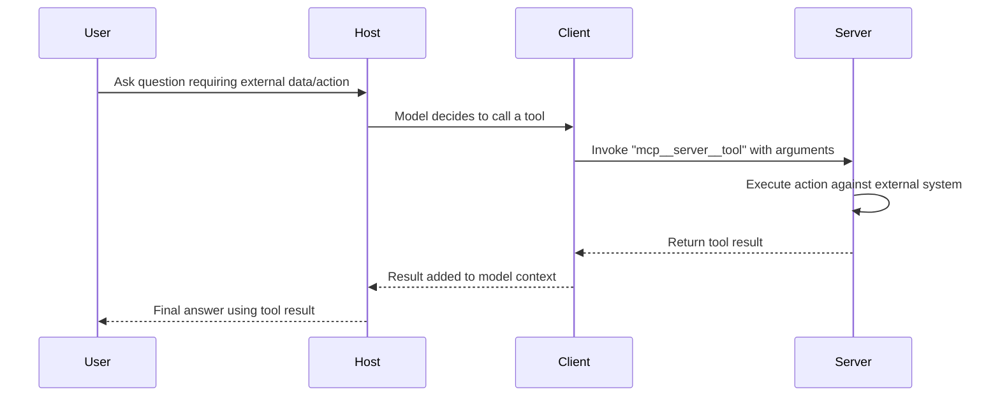

---
tags:
  - CCA-F
  - course
  - domain-2
  - mcp
date: 2026-07-11
status: done
---

# 🎓 Introduction to Model Context Protocol (MCP)

**Back to:** [[CCA-F Study Roadmap]]
**Official course:** https://anthropic.skilljar.com/introduction-to-model-context-protocol

> [!NOTE] What this course teaches
> This SkillJar course explains **MCP (Model Context Protocol)** — the open standard that connects AI applications to external tools and data sources — and how it's structured (hosts/clients/servers, transports, configuration scopes). It feeds primarily **Domain 2 (Tool Design & MCP Integration)**, with light grounding for **Domain 3 (Claude Code Configuration & Workflows)** since scoping decisions (`.mcp.json` vs `~/.claude.json`) also affect project setup.

---

## What this course covers

- **The problem MCP solves** — before MCP, every AI app needed a bespoke integration per tool/data source (an "M×N" integration problem). MCP standardizes the connection so any MCP-compliant client can talk to any MCP-compliant server.
- **Core architecture** — three roles:
  - **Host** — the AI application itself (e.g., Claude Code, Claude Desktop, a custom agent built on the API/SDK)
  - **Client** — the connector inside the host that maintains a 1:1 connection to a given server
  - **Server** — the external process/service that exposes capabilities to the host

- **What a server can expose:**
  - **Tools** — callable functions the model can invoke (actions with side effects or lookups)
  - **Resources** — read-only content the host can attach to context (files, schemas, catalogs) without the model needing to call a tool to discover them
  - **Prompts** — reusable, server-defined prompt templates a user/host can invoke
- **Transports** — how the client physically talks to the server:
  - `stdio` — server runs as a local subprocess; communication over stdin/stdout
  - **Streamable HTTP** — server is remote/cloud-hosted; communication over HTTP (the modern recommended remote transport, superseding the older SSE transport)

- **Connecting a host to an MCP server** — how Claude Code (and API-based agents via the Agent SDK) discover, authorize, and call MCP tools, including the `mcp__{server}__{tool}` naming convention used once a server is connected.

- **Configuration scoping** — where server definitions live and who they're shared with:
  - Project scope: `.mcp.json` at the project root (version-controlled, team-wide)
  - User scope: `~/.claude.json` (personal, not shared)
- **Environment variable expansion** — using `${VAR_NAME}` syntax in server config so credentials/tokens are never hardcoded or committed.
- **Managing servers** via the `claude mcp` CLI (`add`, `list`, `get`, `remove`) and the in-session `/mcp` status check.

---

## 🧠 What to know & memorize after completing it

> [!IMPORTANT] MCP's purpose
> MCP is an **open standard** for connecting AI applications ("hosts") to external tools, data, and prompts through a uniform protocol — replacing one-off, custom integrations per data source with a single reusable interface.

> [!IMPORTANT] Host / Client / Server architecture
> - **Host** = the AI application (e.g. Claude Code)
> - **Client** = lives inside the host, manages one connection to one server
> - **Server** = external process exposing tools/resources/prompts
> A single host can run many clients, each connected to a different server.

> [!IMPORTANT] Three things a server can expose
> - **Tools** — actions the model can call
> - **Resources** — read-only content attached to context (no tool call needed to "see" it)
> - **Prompts** — server-defined reusable prompt templates
> Exam framing: if a data source is mostly static reference material the agent should have visibility into without spending a tool call, that's a **resource**, not a tool.

> [!IMPORTANT] Transport selection
> - Docs give you a **command to run** → use `stdio` (`command` + `args` in config)
> - Docs give you a **URL** → use **Streamable HTTP** (`type: "http"`, `url`) — this is the recommended transport for remote/cloud-hosted servers
> - SSE is a legacy transport being superseded by Streamable HTTP

> [!IMPORTANT] Configuration scope = sharing boundary
> - **Project scope** → `.mcp.json` — version-controlled, shared with the whole team
> - **User scope** → `~/.claude.json` — personal only, never shared via version control

> [!WARNING] Anti-pattern: hardcoded secrets
> ❌ Writing a raw API token/credential directly into `.mcp.json`
> ✅ Use `${VAR_NAME}` environment variable expansion (e.g. `"GITHUB_TOKEN": "${GITHUB_TOKEN}"`) so the value is pulled from the environment at runtime and never committed to version control.

> [!WARNING] Diagnosing a "missing MCP server" teammate issue
> ❌ Assuming a server that works for you but not a teammate is broken
> ✅ First check whether it was configured at **user scope** (`~/.claude.json`, personal) instead of **project scope** (`.mcp.json`, shared) — that's the most common cause of "it works on my machine."

> [!IMPORTANT] Tool naming convention once connected
> MCP tools surface to the model as `mcp__{server-name}__{tool-name}` (e.g. `mcp__github__list_issues`). This matters for `allowedTools` allow-listing and for understanding tool-call traces.

---

## 🔗 Related domain notes

- [[D2 - Tool Design & MCP Integration]] — the primary domain note; covers MCP configuration scopes, transports, env var expansion, `claude mcp` CLI, and MCP resources in full exam depth.
- [[D3 - Claude Code Configuration & Workflows]] — project-level configuration conventions (like `.mcp.json` placement) overlap with how Claude Code projects are set up.
- [[00 - Claude Model Family & API Fundamentals]] — MCP tools are surfaced to the model as part of the same `tools` array used in the Messages API tool-use loop.
- [[Critical Terms Glossary]] — look up MCP, host, client, server, transport, resource, and stdio/Streamable HTTP definitions here.
- [[Flashcards]] — drill the scope/transport/tool-naming facts from this course.

---

## 🃏 Quick self-check

**Q: What problem does MCP solve?**
A: It replaces bespoke, one-off integrations between each AI application and each external tool/data source with a single standardized protocol — any MCP host can talk to any MCP server.

**Q: What are the three roles in MCP architecture?**
A: Host (the AI application), Client (inside the host, one per server connection), and Server (the external process exposing capabilities).

**Q: What three things can an MCP server expose?**
A: Tools (callable actions), Resources (read-only content attached to context), and Prompts (reusable server-defined templates).

**Q: You're given a URL to connect to an MCP server — which transport do you use?**
A: Streamable HTTP (`type: "http"`, `url`) — the recommended transport for remote/cloud-hosted servers. `stdio` is for a local command you run as a subprocess.

**Q: A teammate says an MCP server "isn't there" on their machine even though it works for you. What's the first thing to check?**
A: Whether the server was configured at user scope (`~/.claude.json`, personal, not version-controlled) instead of project scope (`.mcp.json`, shared with the team).

**Q: How do you avoid committing a raw API token in `.mcp.json`?**
A: Use environment variable expansion syntax, e.g. `"GITHUB_TOKEN": "${GITHUB_TOKEN}"`, so the value comes from the environment rather than the file.
