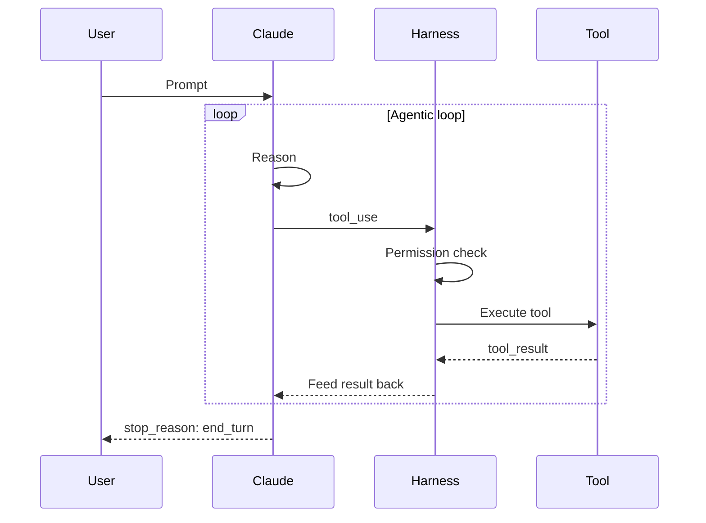
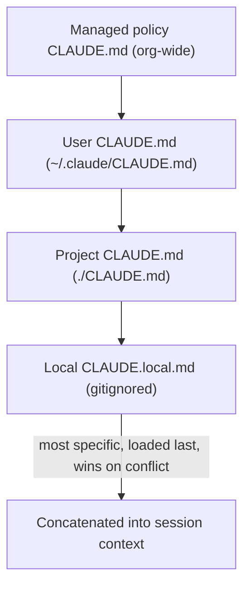
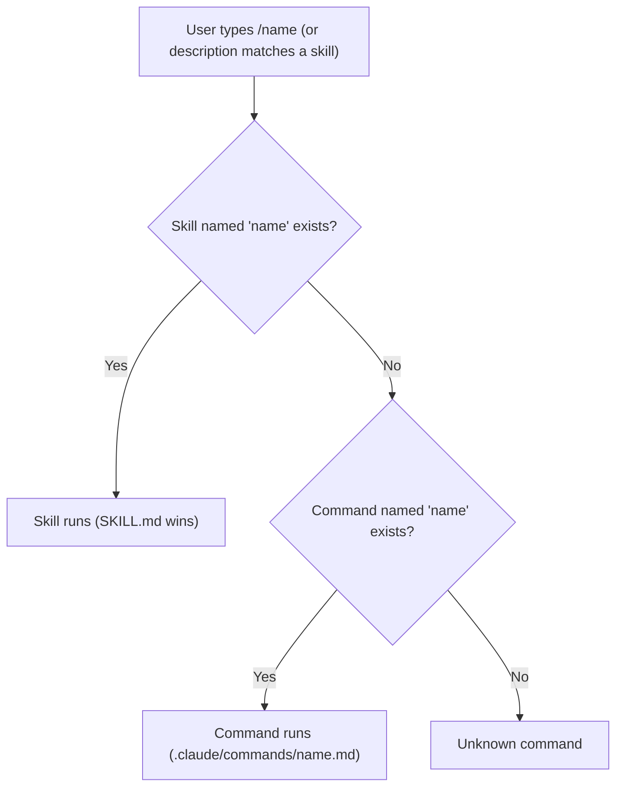
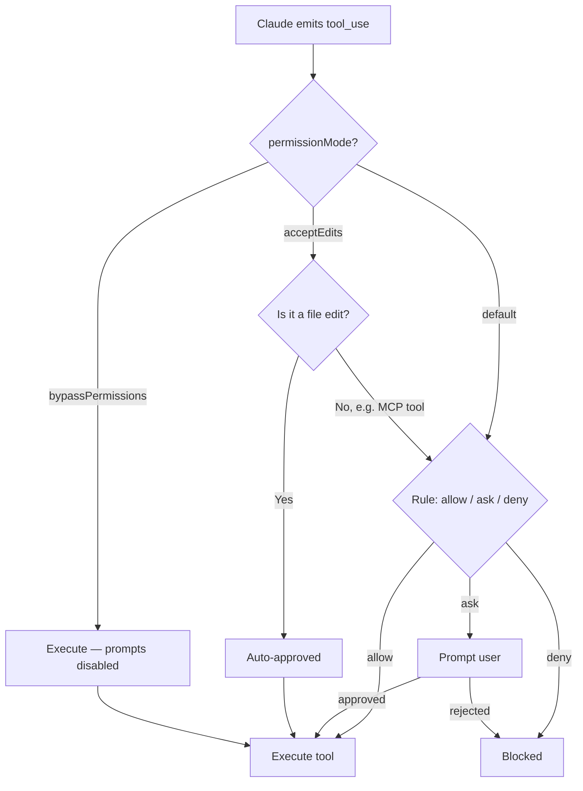

---
tags:
  - CCA-F
  - course
  - claude-code
  - domain-3
date: 2026-07-11
status: not-started
---

# 🎓 Claude Code 101

**Back to:** [[CCA-F Study Roadmap]]
https://code.claude.com/docs/en/overview

> [!NOTE] What this course teaches
> Claude Code is Anthropic's agentic CLI — it runs an autonomous loop of reasoning, tool calls, and file edits directly in your terminal/repo, instead of a chat window that just returns text. This course covers the agentic loop as it plays out in Claude Code specifically, the `CLAUDE.md` memory hierarchy, custom slash commands, skills (`SKILL.md`), plan mode vs direct execution, the built-in tool set (`Read`/`Write`/`Edit`/`Grep`/`Glob`/`Bash`), permissions, and everyday developer workflows. It primarily feeds **Domain 3 (Claude Code Configuration & Workflows)**, with the underlying loop mechanics shared with **Domain 1 (Agentic Architecture & Orchestration)**.

---

## What this course covers

- **What Claude Code is**: an agentic coding CLI that reads/writes files, runs shell commands, and iterates — not a single-shot code generator. Runs locally in your project directory with direct filesystem and shell access.
- **The agentic loop in Claude Code**: user prompt → Claude reasons → emits `tool_use` → harness executes the tool (with permission checks) → `tool_result` returned → Claude continues → loop repeats until `stop_reason: "end_turn"`. Same `POST /v1/messages` mechanics as the general agent loop, just wrapped in a CLI harness that owns tool execution.
- **`CLAUDE.md` memory system**: what it is (persistent project/user context auto-loaded into every session), the 4-tier hierarchy (managed policy → user → project → local), load order, `@import` syntax, `.claude/rules/` for topic-specific and path-scoped conventions, and the `/memory` command to inspect what's loaded.
- **Custom slash commands**: `.claude/commands/<name>.md` (project) and `~/.claude/commands/<name>.md` (personal) — reusable prompt templates invoked as `/name`.
- **Skills**: `SKILL.md` files with YAML frontmatter (`description`, `argument-hint`, `context: fork`, `allowed-tools`, `disallowed-tools`, `disable-model-invocation`, `user-invocable`, `model`, `paths`) that package on-demand procedures; how they differ from always-loaded `CLAUDE.md` content and from ad hoc slash commands.
- **Plan mode vs direct execution**: when to pause and design first (multi-file changes, ambiguous scope, architectural decisions) vs when to just execute (single-file, unambiguous fixes).
- **Built-in tools**: `Read`, `Write`, `Edit`, `Grep`, `Glob`, `Bash` — what each is for, and how Claude composes them during exploration and editing.
- **Permissions model**: how tool calls are gated (ask/allow/deny), `permissionMode` settings (e.g. `acceptEdits`, `bypassPermissions`), and why MCP tools need explicit `allowedTools` entries.
- **Everyday workflows**: exploring an unfamiliar codebase, making a scoped code change, iterative refinement with feedback, and using Claude Code non-interactively (`-p` / `--print`) for scripted or CI use.

---

## 🧠 What to know & memorize after completing it

> [!IMPORTANT] The agentic loop is tool-call driven
> Claude Code's loop is the standard Messages API loop: Claude emits `stop_reason: "tool_use"`, the harness executes the requested tool, feeds back a `tool_result`, and the loop continues until `stop_reason: "end_turn"`. Claude Code's contribution is the **harness** — it owns permission checks, tool execution, and context assembly (`CLAUDE.md`, hooks, skills) around that loop.

> [!IMPORTANT] `CLAUDE.md` hierarchy — broad to specific, concatenated
> Four scopes, loaded root → working directory: **managed policy** (org-wide, e.g. `/Library/Application Support/ClaudeCode/CLAUDE.md`) → **user** (`~/.claude/CLAUDE.md`, personal, not version-controlled) → **project** (`./CLAUDE.md` or `./.claude/CLAUDE.md`, version-controlled, shared with the team) → **local** (`./CLAUDE.local.md`, gitignored, personal sandbox data). More specific instructions load later in context. Subdirectory `CLAUDE.md` files are **not** loaded at launch — only on demand when Claude reads files in that subdirectory.

> [!WARNING] Exam trap: user scope vs project scope
> ❌ Writing team-wide conventions into `~/.claude/CLAUDE.md` — new teammates never receive them because it's not version-controlled.
> ✅ Put shared standards in project-scoped `./CLAUDE.md` so they travel with the repo.

> [!IMPORTANT] Commands vs skills
> Both `.claude/commands/<name>.md` and `.claude/skills/<name>/SKILL.md` create a `/name` invocation. If a command and a skill share a name, **the skill wins**. Skills carry richer frontmatter (auto-invocation via `description`, tool restriction, isolation) — commands are simpler reusable prompt templates.

> [!IMPORTANT] `SKILL.md` frontmatter — know every field
> `description` (drives auto-invocation), `argument-hint` (autocomplete hint), `context: fork` (runs the skill in an **isolated subagent** so verbose output doesn't pollute the main session — only the summary returns), `allowed-tools` (usable without a permission prompt during the skill), `disallowed-tools` (removed from the pool while active), `disable-model-invocation: true` (manual `/name` only, no auto-trigger), `user-invocable: false` (hidden from the `/` menu), `model` (override for the skill's turn), `paths` (glob-scoped auto-invocation).

> [!WARNING] Skills vs `CLAUDE.md` — don't conflate them
> ❌ Stuffing an on-demand, rarely-used procedure into `CLAUDE.md` — it bloats every session's context even when unused.
> ✅ Always-loaded universal standards → `CLAUDE.md`. On-demand procedures (deploy steps, commit checklists, verbose analysis) → a skill, so context is only spent when invoked.

> [!IMPORTANT] Plan mode vs direct execution
> Use **plan mode** for multi-file/architectural changes, ambiguous scope, or open-ended investigation — it lets Claude explore and propose an approach before touching files, preventing costly rework. Use **direct execution** for simple, well-scoped, unambiguous fixes (e.g., one validation check in one function). A strong pattern: plan mode to investigate and choose an approach, then direct execution to implement it.

> [!IMPORTANT] Built-in tools — know what each does
> `Read` (view file contents), `Write` (create/overwrite a file), `Edit` (targeted find-and-replace edit to an existing file), `Grep` (search file contents by pattern), `Glob` (find files by name/path pattern), `Bash` (run shell commands — tests, builds, git, etc.). Claude composes these during codebase exploration (`Glob`/`Grep`/`Read`) and during implementation (`Edit`/`Write`/`Bash`).

> [!IMPORTANT] Permissions gate every tool call
> Each tool call is checked against the permission system before executing (ask, allow, or deny). `permissionMode: "acceptEdits"` auto-approves file edits but does **not** auto-approve MCP tools; `permissionMode: "bypassPermissions"` approves MCP tools too but disables other safety prompts — use narrow `allowedTools` wildcards for MCP instead of reaching for `bypassPermissions`.

> [!WARNING] Exam trap: CI flag name
> ❌ Assuming a `--non-interactive` flag exists for CI.
> ✅ The correct flag is `-p` / `--print` — required in CI/scripted use so Claude Code exits after completing instead of hanging on an input prompt. Combine with `--output-format json` for machine-parseable, structured CI output.

> [!IMPORTANT] Everyday workflow shape
> A typical session: explore (read/grep/glob to understand the code) → plan if scope is unclear → edit (small, verifiable steps) → verify (run tests/build via `Bash`) → iterate on feedback (concrete examples or test failures beat vague prose descriptions).

---

## 🔗 Related domain notes

- [[D3 - Claude Code Configuration & Workflows]] — the primary domain note: full detail on the `CLAUDE.md` hierarchy, `SKILL.md` frontmatter, path-scoped rules, plan mode, iterative refinement, and CI/CD flags covered in this course.
- [[D1 - Agentic Architecture & Orchestration]] — the underlying agentic loop mechanics (`tool_use` → execute → `tool_result` → continue) that Claude Code's harness implements.
- [[D2 - Tool Design & MCP Integration]] — built-in tool design principles and the permission/`allowedTools` model referenced here, plus how MCP tools plug into the same permission system.
- [[00 - Claude Model Family & API Fundamentals]] — the `POST /v1/messages` request/response cycle and `stop_reason` values that drive the loop Claude Code wraps.

---

## 🃏 Quick self-check

**Q:** A team's coding standards were added to `~/.claude/CLAUDE.md`, but new hires never see them. Why, and what's the fix?
**A:** User-scope `CLAUDE.md` is personal and not version-controlled — it never leaves the original author's machine. Move the standards to project-scope `./CLAUDE.md` so they're committed and shared via version control.

**Q:** What does `context: fork` do in a `SKILL.md`'s frontmatter?
**A:** Runs the skill in an isolated subagent context — verbose intermediate output stays inside that subagent, and only the final summary is returned to the main session, keeping the main context clean.

**Q:** A skill and a slash command are both named `/deploy`. Which one runs?
**A:** The skill takes precedence over the command when names collide.

**Q:** When should you reach for plan mode instead of direct execution?
**A:** When the task spans multiple files, has architectural implications, or the right approach is ambiguous — plan mode lets Claude explore and propose a design before any files are touched, avoiding costly rework.

**Q:** Why does Claude Code hang when run in a CI pipeline without the right flag, and what's the fix?
**A:** Without `-p` / `--print`, Claude Code runs interactively and waits for input, which hangs in CI. Pass `-p` (optionally with `--output-format json`) for non-interactive, structured output.

**Q:** Which built-in tool would Claude use to locate all files matching `**/*.test.tsx`, versus the tool used to search inside file contents for a pattern?
**A:** `Glob` finds files by name/path pattern; `Grep` searches within file contents for a text/regex pattern.
