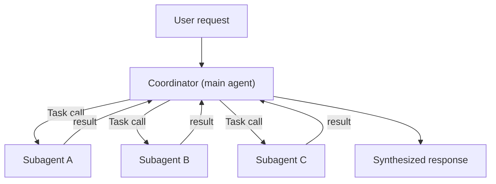
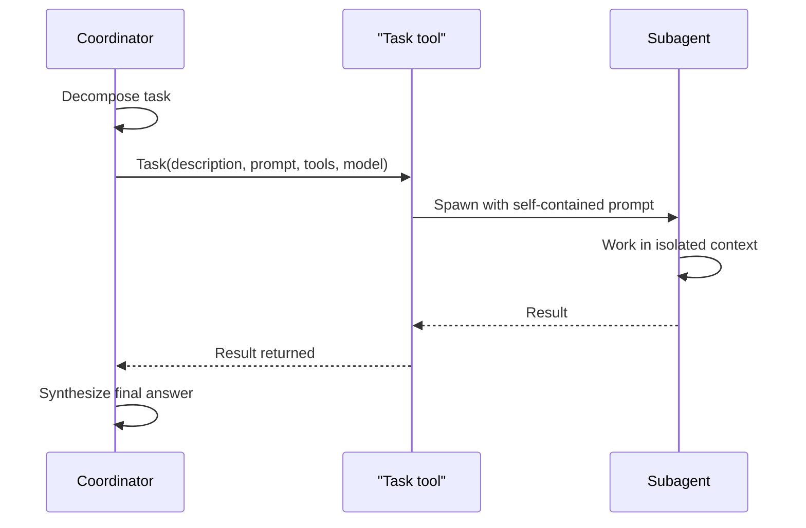
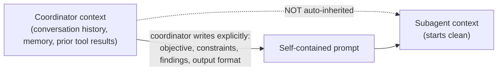
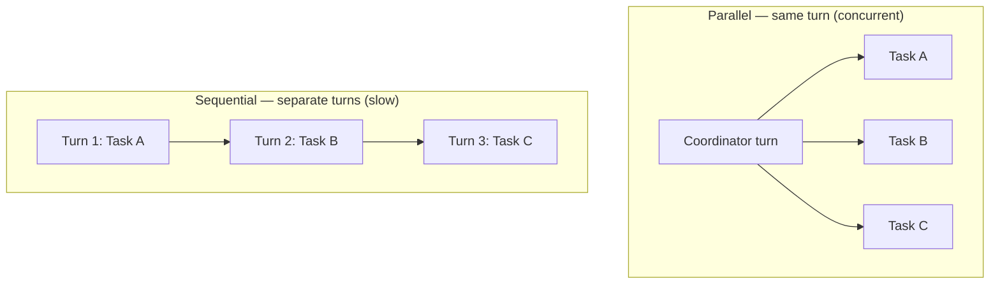

---
tags:
  - CCA-F
  - course
  - domain-1
  - subagents
  - orchestration
date: 2026-07-11
status: not-started
---

# 🎓 Introduction to Subagents

**Back to:** [[CCA-F Study Roadmap]]
https://anthropic.skilljar.com/introduction-to-subagents

> [!NOTE] What this course teaches
> This course covers **multi-agent orchestration**: why and when to delegate work from a main "coordinator" agent to specialized **subagents**, the hub-and-spoke architecture that keeps delegation observable, how to spawn subagents with the `Task` tool, how to define a subagent's behavior and tool access via `AgentDefinition`, why context must be explicitly passed (subagents don't inherit the coordinator's conversation), and how to run subagents in parallel. It feeds **Domain 1: Agentic Architecture & Orchestration**.

---

## What this course covers

- **Why delegate to subagents**
  - Context isolation — each subagent gets a clean context window, avoiding pollution of the coordinator's context with verbose intermediate work
  - Parallelism — independent subtasks can run concurrently instead of sequentially
  - Specialization — a subagent can be scoped to a narrow role with only the tools/prompt it needs, improving reliability over one "god agent" juggling everything
- **The coordinator / hub-and-spoke pattern**
  - One coordinator (main agent) receives the task, decomposes it, delegates to subagents, and synthesizes results
  - Subagents are context-isolated: they don't know about each other and never talk directly — all communication routes through the coordinator
  - The coordinator dynamically decides which subagents to invoke and how many, rather than following a fixed static script

*Hub-and-spoke: subagents never talk to each other — every result routes back through the coordinator, which alone decides fan-out and synthesizes the final answer.*

- **Spawning subagents via the `Task` tool**
  - Subagents are invoked programmatically through the `Task` tool
  - `allowedTools` (or `allowed_tools`) must include `Task` — otherwise the coordinator can *narrate* delegation in text but nothing actually executes (no subagent runs, no error is raised)

*Delegation sequence: the coordinator never talks to the subagent directly — every call and result passes through the `Task` tool.*

> [!NOTE] Terminology update — Unverified against course date, confirmed against current docs
> As of Claude Code v2.1.63, the `Task` tool was renamed to `Agent`; `Task(...)` still works as a backward-compatible alias in permission rules and agent definitions. Course material and this note use `Task` throughout — that terminology remains valid, but be aware `Agent` is the current canonical name if you see it elsewhere.

- **Defining a subagent: `AgentDefinition`**
  - `description` — required; tells the coordinator *when* to invoke this subagent
  - `prompt` / system prompt — required; the subagent's role, expertise, and constraints
  - `tools` — optional; restricts the subagent to a specific tool set (omit to inherit all)
  - `model` — optional; override the model for this subagent (e.g. a cheaper/faster model for a narrow task)
- **Explicit context passing**
  - Subagents do **not** automatically inherit the coordinator's conversation history or memory
  - The coordinator must explicitly write into each subagent's prompt: the objective, constraints, any relevant findings from other subagents, and the desired output format
  - Each subagent's prompt must be self-contained — understandable without access to the coordinator's context

*Context isolation: the only channel into a subagent is the prompt the coordinator writes — nothing else crosses the boundary automatically.*

- **Running subagents in parallel**
  - Emit multiple `Task` calls within a single coordinator turn/response to fan out work concurrently
  - Splitting parallel calls across separate turns makes execution sequential, losing the parallelism benefit

*Same three subagents, two execution shapes: one coordinator response with multiple `Task` calls runs concurrently; spreading them across turns forces them to run one after another.*

- **When NOT to use subagents**
  - Simple tasks the coordinator can already answer from its own context (e.g. a quick follow-up summary) — spawning a subagent here just re-sends context and wastes tokens
  - Multi-agent orchestration costs roughly 15× the tokens of a single-agent chat (confirmed against Anthropic's "How we built our multi-agent research system" engineering post), so it should be reserved for tasks that genuinely need parallelism or exceed a single context window

---

## 🧠 What to know & memorize after completing it

> [!IMPORTANT] `Task` must be in `allowedTools`
> To let the coordinator spawn subagents at all, `allowedTools` must include `"Task"`. If it's missing, the coordinator can still *reason about* or *describe* delegating — but no subagent actually runs, and no error is thrown. This "silent no-op" behavior is a favorite exam trap.

> [!IMPORTANT] Subagents do not inherit context
> Subagents are context-isolated by design. They receive **only** what the coordinator explicitly writes into their prompt — none of the coordinator's prior conversation, tool results, or memory carry over automatically.

> [!IMPORTANT] The 4 things a coordinator must pass to a subagent
> 1. Overall objective/goal
> 2. Constraints/requirements
> 3. Relevant findings from other subagents (forwarded by the coordinator)
> 4. Desired output format
>
> Skipping any of these is the root cause of a subagent reporting "no findings were provided."

> [!IMPORTANT] `AgentDefinition` required vs optional fields
> Required: `description` (routing — when to use this subagent), `prompt` (the subagent's role/behavior). Optional: `tools` (restrict access), `model` (override).

> [!IMPORTANT] Parallel subagents = same response, multiple `Task` calls
> To actually run subagents in parallel, the coordinator must emit multiple `Task` tool calls **within one response/turn**. Calling them one at a time across separate turns is sequential execution, not parallel.

> [!WARNING] Anti-patterns (exam traps)
> ❌ Expecting subagents to share context or memory automatically
> ✅ Explicitly write all needed context into each subagent's prompt
>
> ❌ Subagents calling each other directly
> ✅ All inter-subagent communication routes through the coordinator (hub-and-spoke)
>
> ❌ Spawning a subagent to redo a simple summary the coordinator already has in context
> ✅ Handle it directly in the coordinator — multi-agent is ~15× the token cost of single-agent
>
> ❌ Nested/recursive subagent spawning or message-queue-based fan-out
> ✅ Flat fan-out from a single coordinator hub — keeps execution observable and debuggable
>
> ❌ Giving every subagent the full tool set "just in case"
> ✅ Scope `tools` to only what each subagent's role needs

---

## 🔗 Related domain notes

- [[D1 - Agentic Architecture & Orchestration]] — primary domain note; covers the coordinator–subagent pattern, `AgentDefinition`, context passing, parallelization, and `fork_session` in depth (section 1.2–1.3)
- [[00 - Claude Model Family & API Fundamentals]] — background on the agentic loop and `stop_reason` values that underpin how any single agent (coordinator or subagent) decides to stop or call a tool
- [[D5 - Context Management & Reliability]] — covers how errors from subagents should propagate (structured failures, not silent drops) and how to preserve provenance across multi-agent synthesis

---

## 🃏 Quick self-check

**Q:** What must be in `allowedTools` for a coordinator to actually spawn subagents?
**A:** `"Task"`. Without it, the coordinator may narrate delegation in text, but no subagent executes and no error is raised.

**Q:** Do subagents automatically see the coordinator's conversation history?
**A:** No. Subagents are context-isolated — the coordinator must explicitly pass objective, constraints, relevant findings, and desired output format into each subagent's prompt.

**Q:** Which `AgentDefinition` fields are required?
**A:** `description` (when to invoke) and `prompt` (the subagent's role/behavior). `tools`, `disallowedTools`, and `model` are optional.

**Q:** How do you actually run subagents in parallel instead of sequentially?
**A:** Emit multiple `Task` tool calls within a single coordinator response/turn — spreading them across separate turns makes them run sequentially.

**Q:** When should you NOT spawn a subagent?
**A:** When the coordinator can already handle the task from its own context (e.g. a quick follow-up summary) — multi-agent orchestration costs roughly 15x the tokens of a single-agent exchange, so it should be reserved for genuinely parallel or context-exceeding work.

**Q:** Why must all inter-subagent communication route through the coordinator?
**A:** That's the hub-and-spoke rule — subagents never talk to each other directly; keeping the coordinator as the sole hub preserves observability and centralized error handling.
