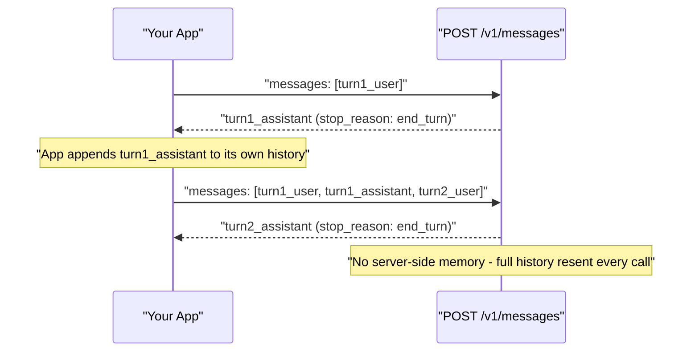
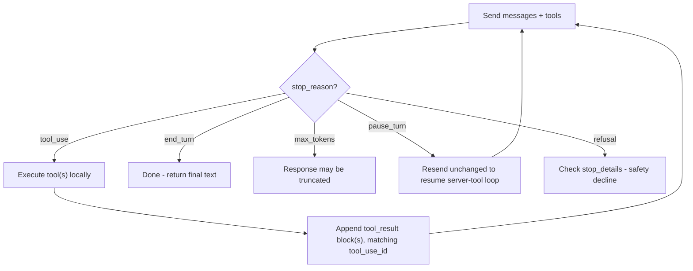

---
tags:
  - CCA-F
  - course
  - domain-4
  - domain-2
  - api-fundamentals
date: 2026-07-11
status: done
---

# 🎓 Building with the Claude API

**Back to:** [[CCA-F Study Roadmap]]
https://anthropic.skilljar.com/claude-with-the-anthropic-api

> [!NOTE] What this course teaches
> This course is the hands-on companion to the Messages API: multi-turn conversations, prompt engineering technique, the tool-use loop, structured output (`output_config.format`, strict tool use), and the Message Batches API. It feeds **Domain 4 (Prompt Engineering & Structured Output)** and **Domain 2 (Tool Design & MCP Integration)**, plus the API fundamentals covered in [[00 - Claude Model Family & API Fundamentals]].

---

## What this course covers

- **Messages API basics** — `POST /v1/messages` request shape: `model`, `max_tokens`, `messages`, optional `system`, `tools`, `tool_choice`, `output_config`.
- **Multi-turn conversations** — the API is **stateless**; every turn resends the full `messages` history (no server-side session state).
- **Prompt engineering techniques** — explicit criteria over vague instructions, few-shot examples (2–4 targeted), system prompts vs user turns, chain-of-thought style reasoning.
- **The tool use loop** — defining `tools`, receiving `stop_reason: tool_use`, executing the tool locally, returning a `tool_result` content block, and continuing the loop until `stop_reason: end_turn`.
- **`tool_choice` options** — `{"type":"auto"}`, `{"type":"any"}`, `{"type":"tool","name":...}`, `{"type":"none"}`.
- **Structured output** — `output_config: {format: {type: "json_schema", schema: {...}}}` for guaranteed-schema responses, and `strict: true` on individual tool definitions for guaranteed-valid tool inputs.
- **The Message Batches API** — `POST /v1/messages/batches`, async processing, **50% cost** discount, `custom_id` to correlate requests and results, results returned in any order.

> [!NOTE] Three of this course's modules are out of scope and are deliberately not covered here
> The SkillJar course also teaches **prompt caching**, **streaming**, and **RAG basics**. All three are on the official out-of-scope list — *"prompt caching implementation details (beyond knowing it exists)"*, *"streaming API implementation or server-sent events"*, and *"embedding models or vector database implementation details"*. See [[Official Exam Blueprint]] § 6. Take the modules if you build with the API; don't revise them for the exam.

---

## 🧠 What to know & memorize after completing it

> [!IMPORTANT] The API is stateless
> There is no server-side conversation memory. Every request resends the **entire** message history. If you drop a turn, the model loses that context — this is the mechanism, not an implementation detail.

> [!IMPORTANT] The tool use loop, exactly
> 1. Send `messages` + `tools` → model responds with `stop_reason: tool_use` and one or more `tool_use` content blocks.
> 2. Your code executes the tool(s) locally.
> 3. You append a `tool_result` content block (matching `tool_use_id`) to the conversation and send the whole thing back.
> 4. Repeat until `stop_reason: end_turn` (or another terminal reason).

> [!IMPORTANT] `stop_reason` values
> `end_turn` (done), `max_tokens` (hit output cap — response may be truncated), `tool_use` (execute tool, continue loop), `pause_turn` (server-tool loop paused, resume), `stop_sequence`, `refusal` (safety decline — check `stop_details`).

> [!IMPORTANT] Structured output has two mechanisms — know which to reach for
> - `output_config: {format: {type: "json_schema", schema: {...}}}` — constrains the **final response** to a JSON schema. Use this when you want a schema-conformant answer, not a tool call.
> - `strict: true` on a **tool definition** — guarantees the tool's `input` conforms to its schema. Use this when the model is calling a tool and you need guaranteed-valid arguments.
> - The old top-level `output_format` field is **deprecated** — use `output_config.format`.

> [!IMPORTANT] Message Batches API
> `POST /v1/messages/batches` — asynchronous, **50% cost** of standard requests, up to 100K requests per batch, most complete in under an hour (max 24h). Each request carries a `custom_id`; results come back **in any order**, so you must key results by `custom_id`, not by position.

> [!WARNING] Anti-pattern: batch for latency-sensitive work
> ❌ Using the Message Batches API for a pre-merge CI gate or any check blocking a user-facing action — batch latency (up to 24h) makes it unsuitable.
> ✅ Use Batches for bulk, non-latency-sensitive work (large-scale classification, evaluation sweeps, offline analysis); use synchronous `/v1/messages` calls for anything blocking.

> [!IMPORTANT] `tool_choice` semantics
> `{"type":"auto"}` (default — model decides whether to call a tool), `{"type":"any"}` (must call *some* tool), `{"type":"tool","name":"X"}` (force a specific tool), `{"type":"none"}` (no tool calls allowed).

> [!WARNING] Prefill is removed
> ❌ Relying on a prefilled last-assistant-turn to force output format — this returns a `400` on current-generation models (`claude-fable-5`, `claude-opus-4-6`/`4-7`/`4-8`, `claude-sonnet-4-6`/`5`).
> ✅ Use `output_config.format` (JSON schema) or explicit system-prompt instructions instead.

---

## 🔗 Related domain notes

- [[00 - Claude Model Family & API Fundamentals]] — the `/v1/messages` request/response shape, `stop_reason` values, and model lineup this course builds on.
- [[D4 - Prompt Engineering & Structured Output]] — deep dive on explicit criteria, few-shot design, `output_config.format`, `strict` tool use, batch strategy, and validation/retry loops.
- [[D2 - Tool Design & MCP Integration]] — the tool-use loop, `tool_choice`, tool interface/error-response design that this course's tool-use module exercises hands-on.
- [[D5 - Context Management & Reliability]] — stateless-history management directly informs long-context and reliability strategies.

---

## 🃏 Quick self-check

**Q:** Why must you resend the entire `messages` array on every API call?
**A:** The Messages API is stateless — the server holds no conversation memory between requests; the full history must be included each time or context is lost.

**Q:** What `stop_reason` tells you the model wants to execute a tool, and what do you do next?
**A:** `stop_reason: tool_use` — execute the requested tool(s) locally, then send a `tool_result` content block (matched by `tool_use_id`) back in the next request.

**Q:** What's the difference between `output_config.format` with `json_schema` and `strict: true` on a tool?
**A:** `output_config.format` constrains the model's final text response to a JSON schema; `strict: true` on a tool definition guarantees that tool's `input` arguments conform to its schema when the model calls it.

**Q:** When should you use the Message Batches API instead of a standard request?
**A:** For large-scale, non-latency-sensitive bulk work (50% cost, async, up to 100K requests/batch) — never for latency-sensitive or blocking checks like a pre-merge gate, since batches can take up to 24h.

**Q:** How do you correlate a batch result back to its original request?
**A:** By `custom_id` — results are returned in any order, not in submission order, so you must key lookups by `custom_id`, not position.
