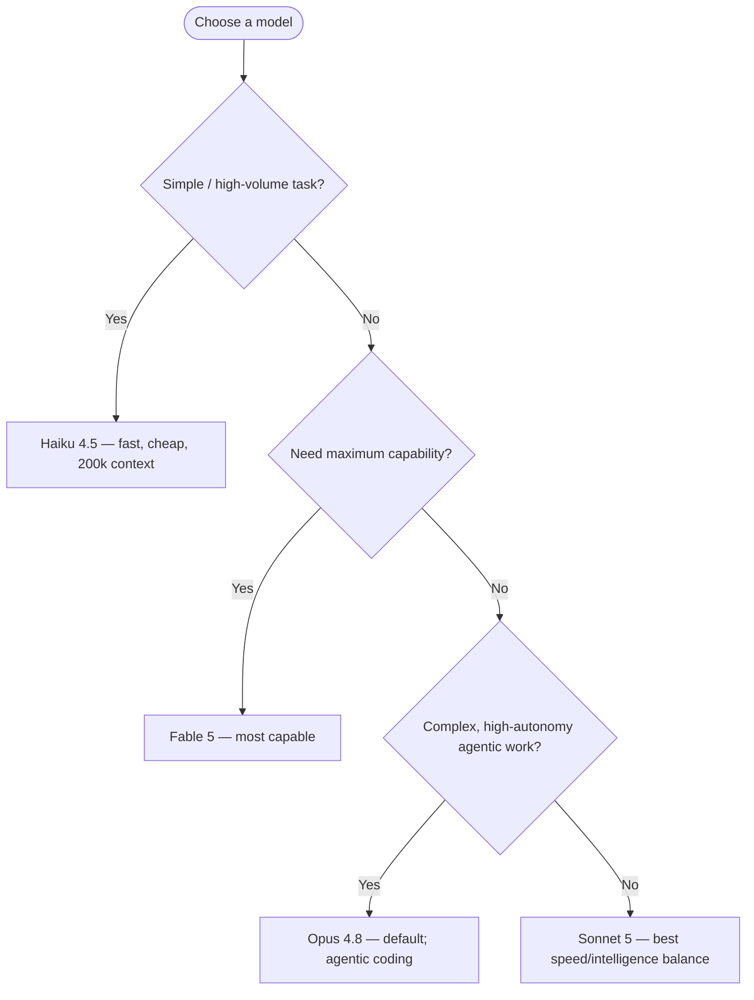
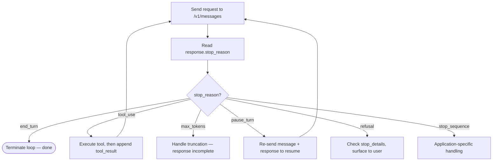
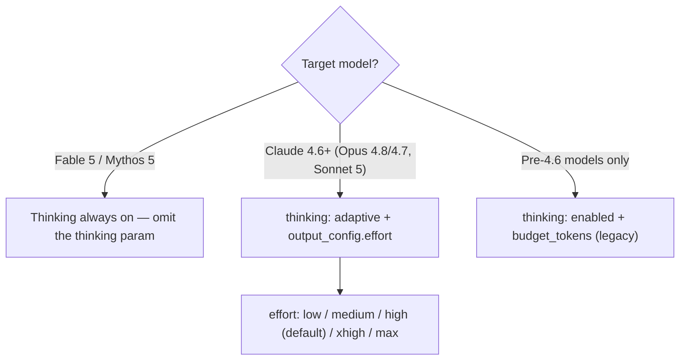

---
tags:
  - CCA-F
  - foundations
  - api
  - models
date: 2026-06-16
status: done
domain: "Week 1 Foundations"
---

# 🏗️ 00 — Claude Model Family & API Fundamentals

> [!NOTE] Purpose
> This note builds the foundational mental model needed before diving into the 5 exam domains. It covers model selection, API request anatomy, stop reasons, thinking modes, and permission modes — concepts that appear implicitly throughout D1–D5.

> [!WARNING] Three sections here are officially **out of scope** — read them for context, don't revise them
> The official blueprint excludes *"performance benchmarking or model comparison metrics"*, *"rate limiting, quotas, or API pricing calculations"*, and *"prompt caching implementation details (beyond knowing it exists)"*. That makes **The Claude Model Family (2026)**, **Cost & Rate Limits: Team Sizing Reference**, and **Prompt Caching** background, not exam material. Useful for building real systems; zero marks on exam day.
> The rest — including **API Request Anatomy**, **Response Structure**, **Thinking Modes**, **Permission Modes**, **Claude Code: Key Surfaces**, and **Subagent Types** — *is* in scope and feeds D1–D5. Full list: [[Official Exam Blueprint]] § Out of scope.

**Back to:** [[CCA-F Study Roadmap]] · [[Official Exam Blueprint]]

---

## The Claude Model Family (2026)

> [!IMPORTANT] Current lineup as of 2026-07
> The newest generations are the **Claude 5 family** (Fable 5, Sonnet 5), **Opus 4.8/4.7**, and **Haiku 4.5**. Sonnet **5** is now the current Sonnet tier — Sonnet 4.6 is the previous generation. Use exact model ID strings; never append date suffixes to aliases.

### Tier Overview

| Tier | Current model | Use Case |
|------|--------------|----------|
| **Most capable** | Claude Fable 5 (`claude-fable-5`) | Most demanding reasoning, long-horizon agentic work |
| **Opus** | Claude Opus 4.8 (`claude-opus-4-8`) | Complex reasoning, agentic coding, high-autonomy work |
| **Sonnet** | Claude Sonnet 5 (`claude-sonnet-5`) | Best speed ↔ intelligence balance; near-Opus quality |
| **Haiku** | Claude Haiku 4.5 (`claude-haiku-4-5`) | Fastest, cheapest, for simple/high-volume tasks |

### Model Comparison Table (authoritative)

| Model | Model ID | Context | Max output | Input $/1M | Output $/1M |
|-------|----------|---------|-----------|-----------|------------|
| Claude Fable 5 | `claude-fable-5` | 1M | 128k | $10 | $50 |
| Claude Mythos 5 *(Project Glasswing only)* | `claude-mythos-5` | 1M | 128k | $10 | $50 |
| Claude Opus 4.8 | `claude-opus-4-8` | 1M | 128k | $5 | $25 |
| Claude Opus 4.7 | `claude-opus-4-7` | 1M | 128k | $5 | $25 |
| Claude Sonnet 5 | `claude-sonnet-5` | 1M | 128k | $3 ($2 intro → 2026-08-31) | $15 ($10 intro) |
| Claude Sonnet 4.6 | `claude-sonnet-4-6` | 1M | 128k | $3 | $15 |
| Claude Haiku 4.5 | `claude-haiku-4-5` | 200k | 64k | $1 | $5 |

> [!IMPORTANT] Exam Rule: Model Selection
> - **`claude-opus-4-8`** is the default/most-used model; **`claude-fable-5`** is the most capable.
> - **Sonnet 5** — best cost ↔ intelligence balance for most production workloads.
> - **Haiku** for subagents doing simple tasks (cost optimization).
> - **Opus / Fable 5** for complex, multi-step agentic work with high accuracy requirements.

### Model Selection Decision Tree



### Availability Notes
- **Fable 5**: Generally available via Claude API, Bedrock, Vertex AI, Foundry
- **Mythos 5**: Limited availability — invitation-only via Project Glasswing
- **Mythos Preview**: Offered only for defensive cybersecurity workflows (invitation-only)

---

## API Request Anatomy

### Core Messages API Request

```json
POST /v1/messages

{
  "model": "claude-sonnet-5",
  "max_tokens": 4096,
  "system": "You are a helpful assistant.",
  "messages": [
    {
      "role": "user",
      "content": "Explain the agentic loop."
    }
  ]
}
```

### Required Fields

| Field        | Type   | Description                                               |
| ------------ | ------ | --------------------------------------------------------- |
| `model`      | string | Model API ID (e.g., `claude-opus-4-8`, `claude-sonnet-5`) |
| `max_tokens` | number | Max tokens to generate; **models may stop before this**   |
| `messages`   | array  | Array of `{role, content}` objects                        |

### Optional Fields

| Field | Type | Description |
|-------|------|-------------|
| `system` | string | System prompt — **NOT a role in the messages array** |
| `temperature` | float | 0–1; lower = more deterministic |
| `stop_sequences` | array | Custom stop strings |
| `stream` | boolean | Enable streaming responses |
| `tools` | array | Tool definitions for function calling |
| `tool_choice` | object | Controls how Claude uses tools |

> [!IMPORTANT] System Prompt Rule
> The system prompt is a **top-level parameter** (`"system": "..."`), NOT a message with `role: "system"`.
> There is no `"system"` role in the Messages API. This is a common trap.

> [!WARNING] Sampling params are removed on current models
> `temperature`, `top_p`, and `top_k` are **rejected with a 400** on the current generation — **Fable 5, Opus 4.8/4.7, and Sonnet 5**. Steer behavior with prompting instead. They remain valid only on older models (Opus 4.6 / Sonnet 4.6 and earlier), where you may set at most one of `temperature` or `top_p`.

### Multi-Turn Conversation Structure

```json
{
  "messages": [
    {"role": "user",      "content": "Hello"},
    {"role": "assistant", "content": "Hi there!"},
    {"role": "user",      "content": "What is MCP?"}
  ]
}
```

- Roles must **alternate** user/assistant (consecutive same-role turns get merged)
- If the last message has `role: "assistant"`, the response **continues from that content** (prefill)
- **Prefilled responses are deprecated in Claude 4.6+** — returns 400 error (see D4)

---

## Response Structure

### Core Response Object

```json
{
  "id": "msg_01XFDUDYJgAACTU3VRZuAKZP",
  "type": "message",
  "role": "assistant",
  "model": "claude-sonnet-5",
  "content": [
    {
      "type": "text",
      "text": "The agentic loop is..."
    }
  ],
  "stop_reason": "end_turn",
  "stop_sequence": null,
  "usage": {
    "input_tokens": 14,
    "output_tokens": 284
  }
}
```

### `stop_reason` Values — Exam Critical!

| `stop_reason` | Meaning | Action |
|---------------|---------|--------|
| `"end_turn"` | Model finished naturally | **Terminate loop** |
| `"tool_use"` | Model wants to use a tool | **Execute tool → return `tool_result` → continue loop** |
| `"max_tokens"` | Hit `max_tokens` limit | Handle truncation — response may be incomplete |
| `"stop_sequence"` | Hit a custom stop sequence | Application-specific handling |
| `"pause_turn"` | Server-tool loop paused (e.g. long web search) | Re-send message + response to **resume** — do not add a "continue" message |
| `"refusal"` | Model declined for safety | Check `stop_details`; surface to user, don't blindly retry |

> [!WARNING] Exam Trap: `stop_reason` Logic
> ❌ **Never terminate the loop based on `stop_reason: "text"`** — this is not valid
> ❌ **Never terminate based on content type alone** — `text` content can appear mid-loop before a tool call
> ✅ **Only terminate when `stop_reason: "end_turn"`**
> ✅ **Only continue when `stop_reason: "tool_use"`** (execute tool → append `tool_result` → next request)

### The Agentic Loop (keyed on `stop_reason`)



---

## Thinking Modes

### Standard Mode

- Normal response generation
- No special thinking visible

### Adaptive Thinking — the current standard (Claude 4.6+)

- On Claude 4.6+ models, use `"thinking": {"type": "adaptive"}` — Claude decides when and how much to think.
- Depth is controlled by **`effort`** inside `output_config`: `"low"` / `"medium"` / `"high"` (default) / `"xhigh"` / `"max"`. `xhigh` is best for coding/agentic work.
- On **Fable 5 / Mythos 5**, thinking is always on (omit the `thinking` param; `{"type":"disabled"}` returns 400).

### Extended Thinking (legacy — older models only)

- The old form `"thinking": {"type": "enabled", "budget_tokens": N}` set a fixed thinking-token budget.
- **Deprecated on Opus 4.6 / Sonnet 4.6 and returns a 400 on Fable 5 / Opus 4.7 / 4.8 / Sonnet 5.** Only pre-4.6 models still use `budget_tokens`.

> [!WARNING] Exam trap: `budget_tokens` vs adaptive
> ❌ `thinking: {type: "enabled", budget_tokens: N}` on a current model → **400 error**.
> ✅ `thinking: {type: "adaptive"}` + `output_config: {effort: "..."}` on Claude 4.6+.

### Thinking Config by Model



---

## Permission Modes (Claude Code)

Claude Code sessions operate under a permission mode that controls what Claude can do without asking.

### Permission Mode Table

| Mode | Auto-Approves | Best For |
|------|--------------|---------|
| `default` | Reads only | Getting started, sensitive work |
| `acceptEdits` | Reads + file edits + filesystem commands | Iterating on code you're reviewing |
| `plan` | Reads only | Exploring codebase before changing it |
| `auto` | Everything (with safety checks) | Long tasks, reducing prompt fatigue |
| `dontAsk` | Only pre-approved tools | CI and scripts |
| `bypassPermissions` | Everything | **Isolated containers/VMs only** |

> [!NOTE] `default` Mode: CLI Convenience vs Agent SDK Semantics
> The "Reads only" auto-approve for `default` reflects interactive-CLI convenience. In the **Agent SDK**, `default` = **no auto-approvals**; any unmatched tool call triggers the `canUseTool` callback instead of being silently approved.

### Switching Modes

```bash
# Set at startup
claude --permission-mode plan

# settings.json default
{
  "permissions": {
    "defaultMode": "acceptEdits"
  }
}

# Cycle with Shift+Tab in terminal (default → acceptEdits → plan)
```

> [!WARNING] `bypassPermissions` Safety Rule
> `bypassPermissions` mode is for **isolated containers and VMs only**.
> In every mode except `bypassPermissions`, writes to **protected paths** are never auto-approved.
>
> Permission rules layered on top of modes:
> - **Deny rules** apply in every mode, including `bypassPermissions`
> - **Allow rules** have no effect in `bypassPermissions` (everything already approved)
> - **Explicit ask rules** apply in every mode

### `acceptEdits` and MCP Tools

> [!WARNING] Critical Distinction
> `permissionMode: "acceptEdits"` does **NOT** auto-approve MCP tools.
> File edits are approved; MCP tool calls still require explicit permission.
> Use `allowedTools` wildcards (e.g., `"mcp__myserver__*"`) to pre-approve specific MCP tools.

---

## Claude Code: Key Surfaces

### Installation

```bash
# macOS / Linux / WSL
curl -fsSL https://claude.ai/install.sh | bash

# Then start in any project
cd your-project
claude
```

### Non-Interactive (CI) Mode

```bash
# -p / --print required to avoid hanging for user input
claude -p "fix the failing tests"
echo "refactor auth module" | claude -p
```

> [!IMPORTANT] CI Flag Rule
> In automated pipelines and CI, always use `-p` (or `--print`).
> Without it, Claude Code waits for interactive input and **hangs**.

### Key Slash Commands

| Command | Purpose |
|---------|---------|
| `/clear` | Wipe context, start fresh |
| `/compact` | Summarize conversation (reduces tokens) |
| `/usage` | Show token usage and costs for current session |
| `/model` | Switch model mid-session |
| `/config` | Configure settings |
| `/init` | Generate starter CLAUDE.md from project structure |
| `/mcp` | Manage MCP server connections |
| `/permissions` | Manage permission rules |
| `/rename` | Rename session (before clearing) |
| `/resume <name>` | Resume a named session |

---

## Claude Code: Subagent Types (Built-in)

| Subagent | Model | Tools | When Used |
|----------|-------|-------|-----------|
| **Explore** | Haiku | Read-only | Codebase search/analysis (keeps exploration out of main context) |
| **Plan** | Inherits | Read-only | Research during plan mode |
| **General-purpose** | Inherits | All | Complex multi-step tasks requiring both exploration and action |

> [!NOTE] Explore Skips CLAUDE.md
> The **Explore** and **Plan** built-in subagents skip your CLAUDE.md files and parent session git status to keep exploration fast and cheap.
> Custom subagents **do** load CLAUDE.md.

---

## Prompt Caching

Prompt caching reduces cost for repeated content in system prompts, CLAUDE.md files, and long documents.

```json
{
  "type": "text",
  "text": "[long repeated content]",
  "cache_control": {
    "type": "ephemeral",
    "ttl": "5m"   ← or "1h"
  }
}
```

- Default TTL: **5 minutes**
- Extended TTL: **1 hour** (explicit setting)
- Cache hits reduce input token costs
- Claude Code applies prompt caching **automatically** for startup content (system prompt, CLAUDE.md, etc.)

---

## Cost & Rate Limits: Team Sizing Reference

> [!WARNING] Unverified — confirm against official study guide
> The per-team-size TPM/RPM figures and the `~$13/developer/active day` cost below could not be verified against the Claude API reference or current Anthropic docs. Treat as directional; confirm exact numbers before relying on them for the exam.

| Team Size | TPM per User | RPM per User |
|-----------|-------------|-------------|
| 1–5 users | 200k–300k | 5–7 |
| 5–20 users | 100k–150k | 2.5–3.5 |
| 20–50 users | 50k–75k | 1.25–1.75 |
| 50–100 users | 25k–35k | 0.62–0.87 |
| 100–500 users | 15k–20k | 0.37–0.47 |
| 500+ users | 10k–15k | 0.25–0.35 |

> [!NOTE] Why TPM Decreases with Team Size
> Rate limits are per **organization**, not per user. In larger organizations, fewer users are active concurrently, so per-user allocations can be lower while still meeting peak demand.

Average enterprise cost: **~$13/developer/active day** (~$150–250/month).

---

## ✅ Practice Checklist

> [!WARNING] Struck-through items are officially out of scope
> They stay for real-world context. Don't revise them for the exam — see the scope callout at the top of this note and [[Official Exam Blueprint]] § 6.

- [ ] ~~Know the 5 model tiers and their API IDs~~ — **out of scope**, context only
- [ ] ~~Know the context window for each model (1M for Opus/Sonnet; 200k for Haiku)~~ — **out of scope**, context only
- [ ] Know the 4 required/optional core API parameters
- [ ] Know that `system` is a top-level param, NOT a message role
- [ ] Know the `stop_reason` values (`end_turn`, `tool_use`, `max_tokens`, `stop_sequence`, `pause_turn`, `refusal`) and the action each triggers
- [ ] Know that `end_turn` terminates the loop; `tool_use` continues it
- [ ] Know adaptive thinking (`type: "adaptive"` + `effort`) is current; `budget_tokens` is legacy/400 on Claude 4.6+
- [ ] Know all 6 permission modes and their auto-approve scope
- [ ] Know that `acceptEdits` does NOT auto-approve MCP tools
- [ ] Know that `bypassPermissions` deny/explicit-ask rules still apply
- [ ] Know that `-p` / `--print` is required for CI non-interactive runs
- [ ] Know that `Explore` and `Plan` built-in subagents skip CLAUDE.md
- [ ] ~~Know the prompt cache TTL options (5m default, 1h extended)~~ — **out of scope** beyond knowing caching exists
- [ ] Know that prefilled assistant responses are deprecated in Claude 4.6+

---

## 🃏 Quick-Reference Flash Cards

**Q: What are the `stop_reason` values and what does each mean?**
A: `"end_turn"` = natural finish (terminate loop); `"tool_use"` = model wants tool (execute → return result → continue); `"max_tokens"` = hit token limit (handle truncation); `"stop_sequence"` = hit custom stop string; `"pause_turn"` = server-tool loop paused (resume); `"refusal"` = safety decline (check `stop_details`).

**Q: Where does the system prompt go in the Messages API?**
A: Top-level parameter (`"system": "..."`). There is **no** `"system"` role in the messages array.

**Q: How is thinking configured on current (Claude 4.6+) models?**
A: `thinking: {type: "adaptive"}` with depth set by `output_config: {effort: "low".."max"}`. The old `budget_tokens` form is deprecated and returns 400 on Fable 5 / Opus 4.7·4.8 / Sonnet 5. On Fable 5, thinking is always on.

**Q: What does `acceptEdits` permission mode NOT auto-approve?**
A: MCP tool calls. `acceptEdits` auto-approves file edits and filesystem commands — but **not MCP tools**. Those need explicit `allowedTools` rules.

**Q: What is required to run Claude Code non-interactively in CI?**
A: The `-p` or `--print` flag. Without it, Claude Code waits for interactive input and hangs.

**Q: Which built-in subagent model is Explore? What does it skip?**
A: Explore uses **Haiku** (fast, low-cost). It skips CLAUDE.md files and parent session git status to keep exploration lightweight.

---

*Next: [[D1 - Agentic Architecture & Orchestration]] · [[CCA-F Study Roadmap]]*
