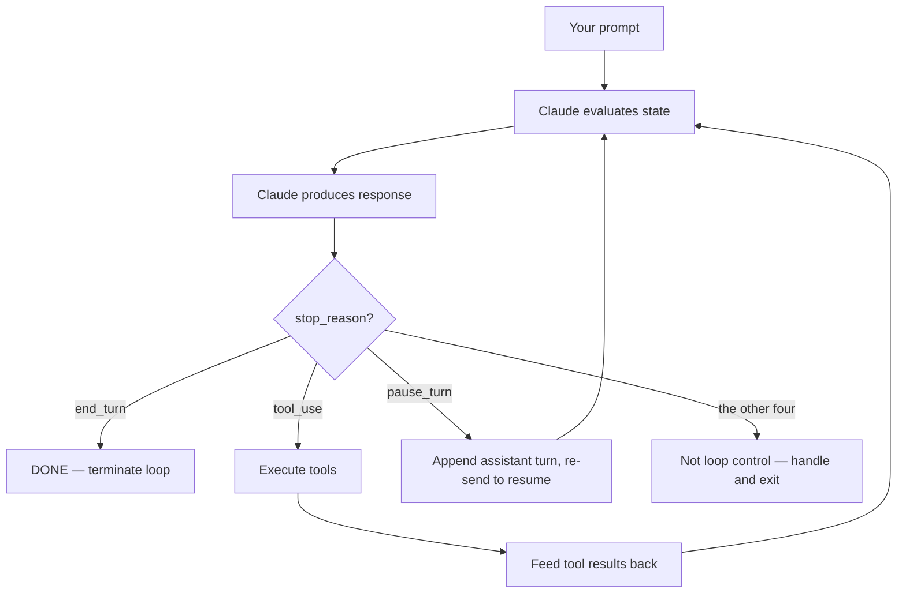
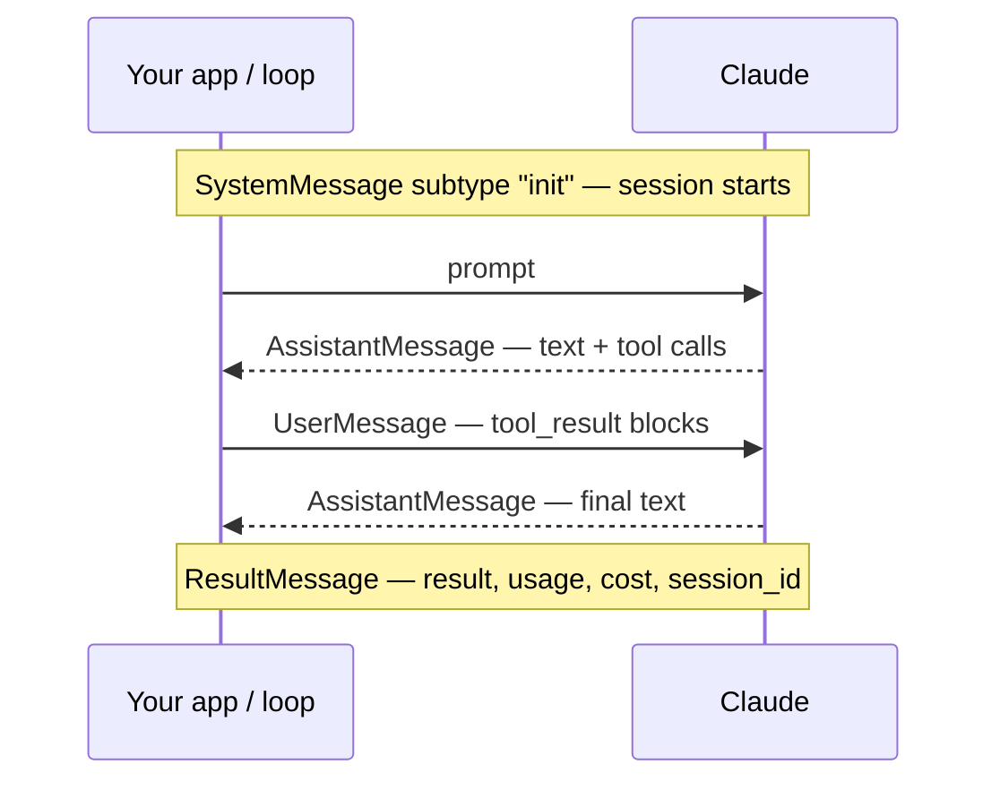
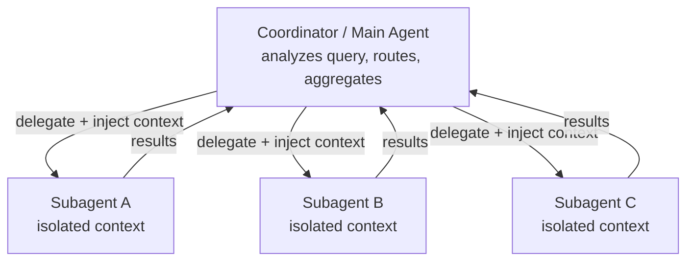
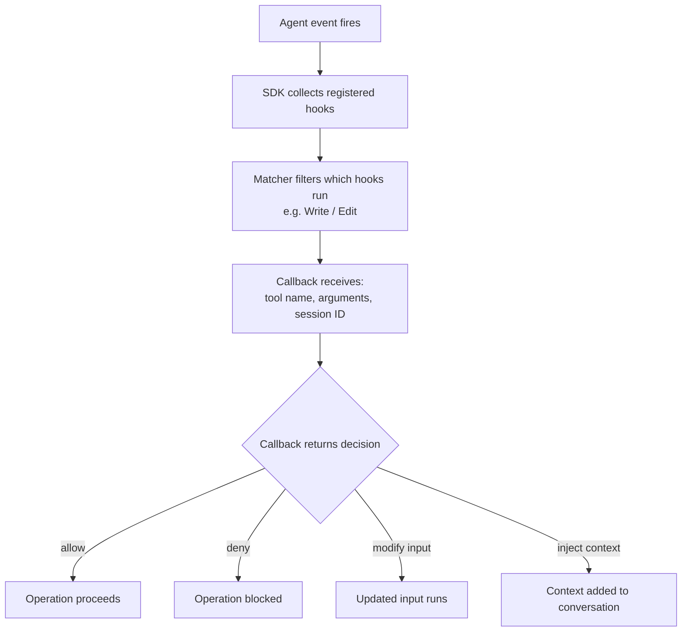
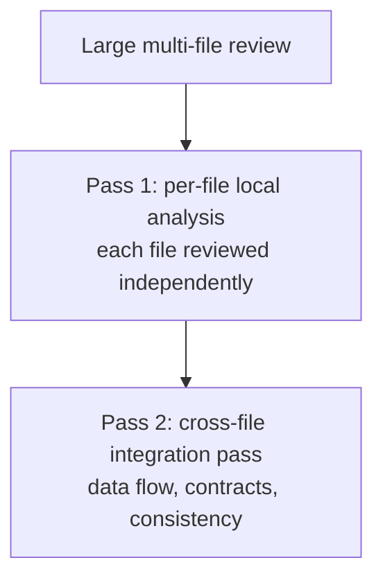

---
tags:
  - CCA-F
  - domain-1
  - agentic-architecture
  - orchestration
date: 2026-06-16
status: done
domain: "1 of 5"
---

# 🤖 Domain 1: Agentic Architecture & Orchestration

> [!NOTE] Exam Coverage
> This domain covers how Claude autonomously executes multi-step tasks via the agentic loop, how to build multi-agent systems with coordinator–subagent patterns, session management, and task decomposition strategies.

**Back to:** [[CCA-F Study Roadmap]]
**Key resources:**
- https://code.claude.com/docs/en/agent-sdk/agent-loop.md
- https://code.claude.com/docs/en/agent-sdk/subagents.md
- https://code.claude.com/docs/en/agent-sdk/sessions.md
- https://code.claude.com/docs/en/agent-sdk/hooks.md

---

## 1.1 — The Agentic Loop Lifecycle

### How it Works



The loop continues on **three** stop reasons only: `tool_use` and `pause_turn` re-enter it, `end_turn` leaves it cleanly. The remaining four each need their own handling — see the table below.

### stop_reason Values

**Seven** values exist in the docs. **↻** marks the **three a production loop continues on**. *For the exam, only `tool_use` and `end_turn` are on the blueprint — see the callout below.*

| `stop_reason`                     | Meaning                                               | Action                                                                                              |
| --------------------------------- | ----------------------------------------------------- | --------------------------------------------------------------------------------------------------- |
| ↻ `"tool_use"`                    | Claude wants to call a tool                           | Execute tool, return result, continue loop                                                          |
| ↻ `"end_turn"`                    | Claude finished; no more tool calls                   | Terminate loop                                                                                      |
| ↻ `"pause_turn"`                  | A **server-side tool** paused a long-running turn     | Append the assistant turn and re-send to resume — do **not** add a "Continue." message              |
| `"max_tokens"`                    | Output token limit reached                            | Handle truncation; raise `max_tokens` or stream                                                     |
| `"stop_sequence"`                 | Hit a configured stop sequence                        | Terminate                                                                                           |
| `"refusal"`                       | Declined for safety reasons                           | **`content` may be empty** — check `stop_reason` *before* reading `content`. Inspect `stop_details` |
| `"model_context_window_exceeded"` | Context window exhausted (distinct from `max_tokens`) | Compact or split the conversation                                                                   |

> [!IMPORTANT] What the exam tests vs what production needs
> **The official blueprint names only two values** — `"tool_use"` and `"end_turn"` — under task statement 1.1 and in its Technologies appendix. `pause_turn` and the rest are **not** on the syllabus. On exam day, the loop-control answer is `stop_reason: "end_turn"` terminates, `"tool_use"` continues; the anti-patterns below are what's actually being tested.
> **In production the seven-value table still matters.** A loop that branches only on `end_turn` and `tool_use` is the classic tutorial shape and it **fails silently**: `pause_turn` matches neither branch, so a `while True` loop spins forever; `refusal` returns empty `content`, so extracting the final text raises. Handle all seven; continue on three.
> Scope: [[Official Exam Blueprint]] · Source: [Handling stop reasons](https://platform.claude.com/docs/en/build-with-claude/handling-stop-reasons) · checked 2026-08-03 · see [[EP04 - Multi-Agent System in Python (Claude SDK)]] §3.5 for a worked failure trace

> [!WARNING] Anti-Patterns (Exam Trap!)
> ❌ **Arbitrary iteration caps** as the PRIMARY stopping mechanism
> ❌ **Parsing natural language signals** to determine loop termination (e.g., checking if Claude says "done")
> ❌ **Checking for assistant text content** as a completion indicator
> ✅ Always use `stop_reason: "end_turn"` as the loop termination signal

### Loop Control Parameters

| Parameter | Purpose |
|-----------|---------|
| `max_turns` / `maxTurns` | Cap tool-use turns (counts only turns with tool calls, not final text turn) |
| `max_budget_usd` / `maxBudgetUsd` | Cap by spend threshold — good default for production |

**Example:** `max_turns=2` on a 4-turn task stops before turn 3 (the edit step).

### Message Types in the Loop

| Message Type | Subtype | When Emitted |
|-------------|---------|-------------|
| `SystemMessage` | `"init"` | Session start — contains session metadata (session ID lives in `SystemMessage.data` in Python; a direct field in TS) |
| `AssistantMessage` | — | Claude's response (text + optional tool calls) |
| `UserMessage` | — | Tool execution results fed back to Claude |
| `ResultMessage` | `"success"` / `"error_*"` | Final message: result text, token usage, cost, session ID. Error subtypes include `error_max_turns` and `error_max_budget_usd` |

### Message Flow in a Single Turn



---

## 1.2 — Multi-Agent: Coordinator–Subagent Pattern

### Architecture



All inter-subagent communication routes **through** the coordinator — subagents never talk to each other directly.

### Rules

| Rule                      | Detail                                                                                  |
| ------------------------- | --------------------------------------------------------------------------------------- |
| **Context isolation**     | Subagents do NOT inherit coordinator's conversation history automatically               |
| **Context injection**     | You must explicitly pass context into subagent prompts                                  |
| **Communication routing** | All inter-subagent comms route through coordinator (for observability + error handling) |
| **Coordinator roles**     | Decompose task → Delegate → Aggregate results → Decide next subagent                    |

> [!WARNING] Anti-Pattern
> ❌ Overly narrow task decomposition → incomplete coverage of broad research topics
> ✅ Coordinator dynamically selects which subagents to invoke based on query complexity

### Parallelization

- Emit **multiple `Task` tool calls in a single response** to run subagents in parallel
- Don't route parallel calls across separate turns — that's sequential

> [!IMPORTANT] Tool rename: `Task` → `Agent`
> This vault uses **`"Task"`** as the primary term — the CCA-F exam and its practice bank use `Task`. Note that the subagent-invocation tool was renamed to `"Agent"` in Claude Code v2.1.63: current SDK responses emit `"Agent"` in `tool_use` blocks and accept `"Agent"` in `allowedTools`, while `"Task"` still works as a backward-compatible alias (it also still appears in the `system:init` tools list and in `permission_denials`). If the exam asks, answer **`"Task"`**; recognize `"Agent"` as the newer canonical name if you see it elsewhere.

---

## 1.3 — Subagent Invocation, Context Passing & Spawning

### `AgentDefinition` Configuration

```python
AgentDefinition(
    description="When to use this subagent",  # Required — Claude uses this to route
    prompt="System prompt / expertise / constraints",  # Required
    tools=["Read", "Grep", "Glob"],  # Optional — restricts tool access (read-only example)
    disallowedTools=["Write", "Bash"],  # Optional — remove specific tools
    model="sonnet",  # Optional — override default model (aliases: fable, opus, sonnet, haiku, inherit; or a full model ID)
    skills=["skill-name"],  # Optional — preload skills into agent context
    memory="project",  # Optional — memory source: 'user' | 'project' | 'local'
)
```

| Field | Required | Purpose |
|-------|----------|---------|
| `description` | ✅ | How Claude decides WHEN to invoke this subagent |
| `prompt` | ✅ | The subagent's role, behavior, expertise |
| `tools` | ❌ | Restrict to these tools only (if omitted → inherits all) |
| `disallowedTools` | ❌ | Remove specific tools from set |
| `model` | ❌ | Override model (e.g., use Haiku for speed) |

> [!IMPORTANT] Critical: Enabling Subagent Invocation
> `allowedTools` (TS) / `allowed_tools` (Python) must include **`"Task"`** for the coordinator to invoke subagents without permission prompts. (Renamed to `"Agent"` in Claude Code v2.1.63; `"Task"` remains a valid alias — see §1.2.)

### Two Creation Methods

| Method | Where Defined | Use Case |
|--------|--------------|---------|
| **Programmatic** (`agents` param) | Code | Recommended for SDK applications |
| **Filesystem-based** | `.claude/agents/` markdown files | Declarative, version-controlled |

### Context Passing Best Practices

- ✅ Include **complete findings** from prior agents directly in the subagent's prompt
- ✅ Use **structured data formats** to separate content from metadata (source URLs, page numbers)
- ✅ Pass web search results, document analysis outputs to synthesis subagents
- ❌ Don't assume subagents can access parent context or shared memory

### `fork_session`

- Creates independent branch from shared analysis baseline
- Explore divergent approaches without losing the original
- Original session remains unchanged

---

## 1.4 — Multi-Step Workflows with Enforcement & Handoff Patterns

### Enforcement: Programmatic vs Prompt-Based

| Approach | Reliability | Use When |
|----------|------------|---------|
| **Programmatic enforcement** (hooks, prerequisite gates) | Deterministic — 100% | Identity verification before financial ops, compliance |
| **Prompt-based guidance** | Probabilistic — non-zero failure rate | General workflow ordering without strict compliance needs |

> [!IMPORTANT] Exam Key Point
> When deterministic compliance is required → **always use programmatic enforcement**, not prompt instructions

### Prerequisite Gates

Block downstream tool calls until prerequisite steps complete:
- Example: Block `process_refund` until `get_customer` returns a verified customer ID
- Implemented via hook interception (see Section 1.5)

### Structured Handoff to Human Agents

When escalating to humans who lack conversation transcript access, compile:
1. Customer ID
2. Root cause analysis
3. Refund amount / action details
4. Recommended action

### Parallel Investigation Pattern

For multi-concern customer requests:
1. Decompose into distinct items
2. Investigate each in parallel using **shared context**
3. Synthesize unified resolution

---

## 1.5 — Agent SDK Hooks

### Hook Lifecycle



### Available Hook Events

| Hook | Python | TS | Trigger | Exam Use Case |
|------|--------|----|---------|--------------|
| `PreToolUse` | ✅ | ✅ | Before tool executes | Block dangerous ops (e.g., `.env` writes, refunds >$500) |
| `PostToolUse` | ✅ | ✅ | After tool result | Normalize data formats; audit logging |
| `PostToolUseFailure` | ✅ | ✅ | Tool failure | Error handling |
| `PostToolBatch` | ❌ | ✅ | Full batch of tool calls resolves | Inject conventions once per batch |
| `UserPromptSubmit` | ✅ | ✅ | Prompt submitted | Inject additional context |
| `Stop` | ✅ | ✅ | Agent stops | Save session state |
| `SubagentStart` | ✅ | ✅ | Subagent init | Track parallel spawning |
| `SubagentStop` | ✅ | ✅ | Subagent completes | Aggregate results |
| `PreCompact` | ✅ | ✅ | Before context compaction | Archive full transcript |
| `PermissionRequest` | ✅ | ✅ | Permission dialog would show | Custom permission handling |

### Key Pattern: `PostToolUse` for Data Normalization

Use `PostToolUse` to normalize heterogeneous data before the model processes it:
- Unix timestamps → ISO 8601
- Numeric status codes → human-readable strings
- Different field names → standardized schema

```python
# PostToolUse hook normalizes tool results before the model sees them
async def normalize_timestamps(input_data, tool_use_id, context):
    result = input_data["tool_result"]
    if "unix_timestamp" in result:
        result["iso_date"] = convert_unix_to_iso(result["unix_timestamp"])
    return {
        "hookSpecificOutput": {
            "hookEventName": "PostToolUse",
            "updatedToolOutput": result,   # REPLACES the result before Claude sees it
        }
    }
```

> [!IMPORTANT] `PostToolUse` output fields — replace vs append
> - **`updatedToolOutput`** — *replaces* the tool's output before Claude sees it. Works for **any** tool in **both** SDKs.
> - **`additionalContext`** — *appends* information to the tool result instead of replacing it.
> - **`updatedMCPToolOutput`** — the older field, replaces **MCP tool output only**, and is **deprecated**.
> - Return **`{}`** to pass through unchanged.
>
> Both live inside `hookSpecificOutput`, tagged with `hookEventName`. There is no bare `modifiedToolResult` return value.
> Source: [Hooks in the SDK](https://code.claude.com/docs/en/agent-sdk/hooks) → *Outputs* · checked 2026-08-03 · see [[EP05 - PreToolUse, PostToolUse Hooks & Task Decomposition]] §3.4

### Key Pattern: `PreToolUse` for Compliance Enforcement

```python
# Block refunds above $500 threshold — deterministic guarantee
async def check_refund_limit(input_data, tool_use_id, context):
    if input_data["tool_name"] == "process_refund":
        amount = input_data["tool_input"].get("amount", 0)
        if amount > 500:
            return {
                "hookSpecificOutput": {
                    "hookEventName": "PreToolUse",
                    "permissionDecision": "deny",
                    "permissionDecisionReason": "Refunds >$500 require human approval"
                }
            }
    return {}
```

> [!IMPORTANT] Hooks vs Prompt Instructions
> **Hooks** = deterministic guarantee (blocking is absolute)
> **Prompt instructions** = probabilistic (non-zero failure rate)
> → Choose hooks when business rules **require** guaranteed compliance

---

## 1.6 — Task Decomposition Strategies

### Two Decomposition Patterns

| Pattern | When to Use | Example |
|---------|------------|---------|
| **Prompt chaining** (fixed sequential) | Predictable multi-aspect tasks with known steps | Code review: per-file → cross-file integration pass |
| **Dynamic adaptive decomposition** | Open-ended investigation tasks | "Add tests to legacy codebase": map → identify → plan |

### Splitting Large Code Reviews



**Why:** Avoids attention dilution and contradictory findings when reviewing 10+ files simultaneously.

### Open-Ended Task Decomposition Example

Task: "Add comprehensive tests to a legacy codebase"
1. **Map structure** — identify all modules, dependencies
2. **Identify high-impact areas** — coverage gaps, critical paths
3. **Create prioritized plan** — adapt as dependencies are discovered

---

## 1.7 — Session State, Resumption & Forking

### Session Concepts

| Operation | Python | TypeScript | When to Use |
|-----------|--------|-----------|-------------|
| **Continue** (most recent) | `continue_conversation=True` | `continue: true` | Multi-turn chat; most recent session is the one you want |
| **Resume** (specific session) | `resume=session_id` | `resume: sessionId` | Multiple sessions / multi-user apps |
| **Fork** | `resume=session_id` + `fork_session=True` | `resume: sessionId` + `forkSession: true` | Try alternative approach without losing original |

> [!WARNING] Anti-Pattern (Exam Trap!)
> ❌ There is **no** standalone `fork=session_id` option — forking is `resume` (point at the source session) **plus** `fork_session=True` / `forkSession: true`.
> ✅ The fork gets a **new** session ID; the original's ID and history are untouched.

### Getting the Session ID

Session ID lives on the `ResultMessage`:
```python
async for message in query(prompt="..."):
    if isinstance(message, ResultMessage):
        session_id = message.session_id  # Capture this!
```

### CLI Session Flags

| Flag | Purpose |
|------|---------|
| `--resume <session-name>` | Resume a named session from CLI |
| `--continue` | Resume most recent session |

### When to Resume vs Start Fresh

| Scenario                                      | Recommendation                                                                            |
| --------------------------------------------- | ----------------------------------------------------------------------------------------- |
| Prior context is mostly still valid           | Resume the session                                                                        |
| Files have been modified since last session   | Inform agent about specific changes, then resume                                          |
| Prior tool results are stale / session is old | **Start fresh + inject structured summary** — more reliable than resuming with stale data |

> [!TIP] Exam Key Point
> Starting a new session with a structured summary **>** resuming with stale tool results

### `fork_session` Use Cases

- Compare two testing strategies from a shared codebase analysis
- Explore two refactoring approaches from a shared baseline
- Branch without losing the original investigation

---

## ✅ Domain 1 Practice Checklist

- [x] Can explain the agentic loop step-by-step with correct message types
- [x] Know all `stop_reason` values and what action each triggers
- [x] Know the anti-patterns for loop termination
- [x] Can describe coordinator–subagent architecture and isolation rules
- [x] Know `AgentDefinition` fields (required vs optional)
- [x] Know why `"Task"` must be in `allowedTools` (renamed to `"Agent"` in v2.1.63; `"Task"` still valid)
- [x] Can distinguish `continue` vs `resume` vs `fork`
- [x] Know all hook events + their Python/TS availability
- [x] Can explain `PostToolUse` normalization pattern
- [x] Can explain `PreToolUse` compliance enforcement pattern
- [x] Know when to use hooks vs prompt instructions
- [x] Can distinguish prompt chaining vs dynamic decomposition

---

## 🃏 Quick-Reference Flash Cards

**Q: What happens when `stop_reason` is `"tool_use"`?**
A: Execute the requested tools and return results to Claude. Loop continues.

**Q: What is the anti-pattern for loop termination?**
A: Using arbitrary iteration caps, parsing natural language signals, or checking for text content as loop completion indicators.

**Q: Do subagents automatically inherit the coordinator's context?**
A: No. Subagents have isolated context. You must explicitly inject context into their prompts.

**Q: What must be in `allowedTools` to enable subagent invocation?**
A: `"Task"` (renamed to `"Agent"` in Claude Code v2.1.63, but `"Task"` remains a backward-compatible alias — so it stays the exam-safe answer).

**Q: Hooks vs prompt instructions for compliance rules?**
A: Hooks = deterministic guarantee. Prompts = probabilistic, non-zero failure rate. Use hooks for required compliance.

**Q: What does `PostToolUse` enable that `PreToolUse` doesn't?**
A: `PostToolUse` intercepts tool **results** (for normalization). `PreToolUse` intercepts tool **calls before execution** (for blocking/modifying).

**Q: When should you start fresh instead of resuming a session?**
A: When prior tool results are stale. A new session + structured summary is more reliable than resuming with stale data.

**Q: What is `fork_session` used for?**
A: Creating an independent branch from a shared analysis baseline to explore divergent approaches without losing the original.

---

*Next: [[D2 - Tool Design & MCP Integration]]*
