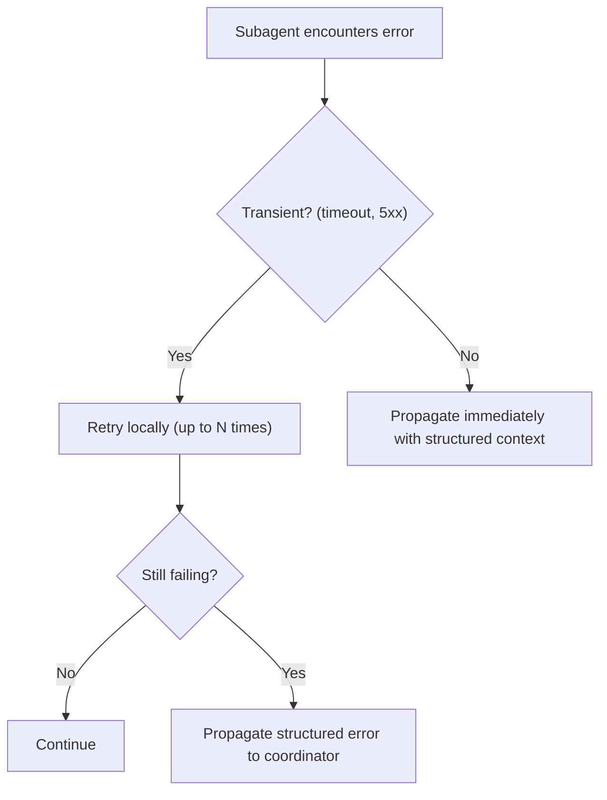
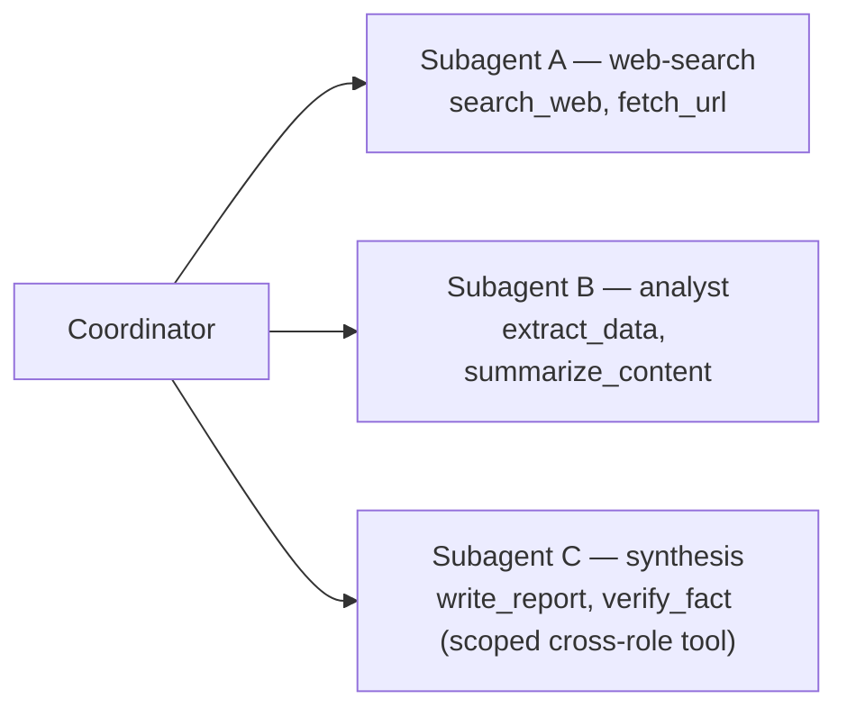
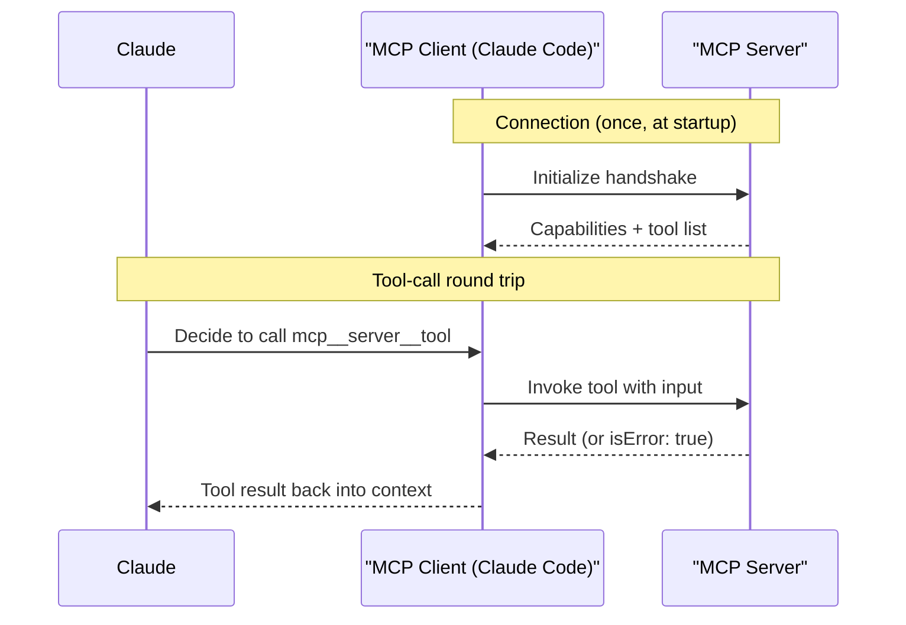
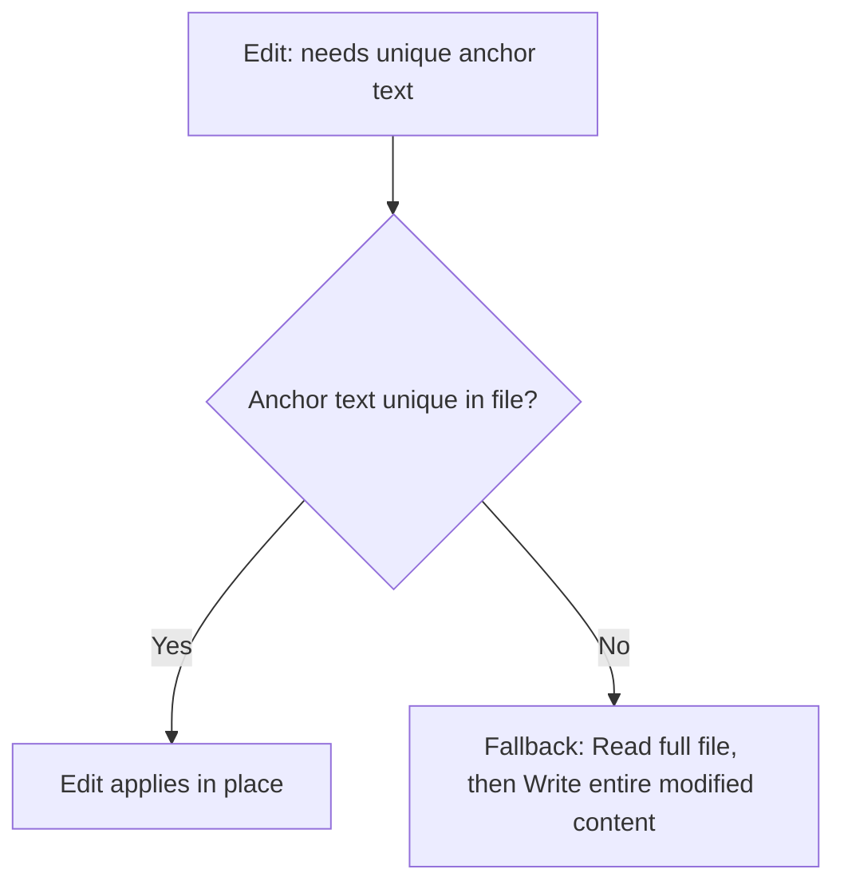

---
tags:
  - CCA-F
  - domain-2
  - tool-design
  - mcp
date: 2026-06-16
status: needs-review
domain: "2 of 5"
---

# 🔧 Domain 2: Tool Design & MCP Integration

> [!NOTE] Exam Coverage
> This domain covers designing reliable tool interfaces, implementing MCP servers (configuration scopes, transports, error handling), distributing tools across agents, and using Claude Code's built-in tools effectively.

**Back to:** [[CCA-F Study Roadmap]]
**Key resources:**
- https://code.claude.com/docs/en/mcp
- https://code.claude.com/docs/en/agent-sdk/mcp.md
- https://code.claude.com/docs/en/agent-sdk/custom-tools.md

---

## 2.1 — Designing Effective Tool Interfaces

### The Core Rule

> The **tool description** is the primary mechanism an LLM uses to select which tool to call.

Minimal or vague descriptions → unreliable tool selection, especially among similar tools.

### What a Good Tool Description Includes

| Element | Why It Matters |
|---------|----------------|
| **Purpose** — what the tool does | Baseline disambiguation |
| **Input formats** — expected data types, units, constraints | Prevents invalid calls |
| **Example queries** | Calibrates model intuition for edge cases |
| **Edge cases and boundaries** | Tells model what this tool does NOT handle |
| **When to use vs alternatives** | Resolves ambiguity when tools overlap |

### Anti-Patterns

> [!WARNING] Anti-Patterns (Exam Trap!)
> ❌ Near-identical descriptions for similar tools → misrouting
> ❌ Generic names like `analyze_content` and `analyze_document` with overlapping descriptions
> ❌ System prompt keywords that inadvertently override tool descriptions
> ❌ Splitting one tool into many without updating descriptions to reflect new boundaries

### Fixing Ambiguity

- **Rename** tools to make purpose obvious (e.g., `analyze_content` → `extract_web_results`)
- **Split** generic tools into purpose-specific variants with defined input/output contracts
  - Example: `analyze_document` → `extract_data_points`, `summarize_content`, `verify_claim_against_source`
- **Review system prompt** for keyword-sensitive instructions that might create unintended tool associations

---

## 2.2 — Structured Error Responses for MCP Tools

### The `isError` Flag Pattern

MCP tools communicate failures by returning `isError: true` in their response — **not** by throwing exceptions.

```python
# ✅ Return structured error — Claude can reason about this
return {
    "isError": True,
    "content": [{"type": "text", "text": "Service unavailable (timeout)"}]
}

# ❌ Throwing an exception — Claude cannot reason about recovery
raise Exception("Service unavailable")
```

### Error Categories

| Category | Description | `isRetryable` |
|----------|-------------|--------------|
| **Transient** | Timeouts, service unavailability | `true` |
| **Validation** | Invalid input format or value | `false` |
| **Business** | Policy violation (e.g., refund limit exceeded) | `false` |
| **Permission** | Insufficient access rights | `false` |

### What to Include in a Structured Error

```json
{
  "isError": true,
  "errorCategory": "transient",
  "isRetryable": true,
  "description": "Database timeout after 30s. Retrying may succeed.",
  "attemptedQuery": "SELECT * FROM orders WHERE id=...",
  "partialResults": []
}
```

> [!IMPORTANT] Why This Matters for the Exam
> **Uniform errors** ("Operation failed") prevent the agent from making appropriate recovery decisions.
> **Structured errors** with `isRetryable`, `errorCategory`, and `attemptedQuery` let the coordinator decide: retry, escalate, or use alternate approach.

### Access Failure vs Valid Empty Result

> [!WARNING] Critical Distinction
> ❌ `isError: true` — something went **wrong** accessing the data
> ✅ Empty results array with `isError: false` — query succeeded but **no matching data exists**
>
> Conflating these causes the coordinator to retry valid empty results unnecessarily.

### Local Recovery vs Propagation



---

## 2.3 — Distributing Tools Across Agents & `tool_choice`

### Tool Count Affects Reliability

| Tool Count per Agent | Effect |
|---------------------|--------|
| 4–5 tools | Reliable selection |
| 10+ tools | Degraded selection reliability |
| 18+ tools | Significant misuse / wrong tool selection |

> [!IMPORTANT] Exam Rule
> Give each agent **only the tools needed for its role**. Agents with tools outside their specialization tend to misuse them (e.g., a synthesis agent attempting web searches).

### Scoped Tool Access Pattern



For high-frequency cross-role needs: provide a **scoped constrained tool** instead of the full generic one.
- Example: replace `fetch_url` (generic) with `load_document` (validates document URLs only)

### `tool_choice` Configuration

| Value | Behavior | Use When |
|-------|---------|---------|
| `{"type": "auto"}` | Model decides whether to call a tool or respond with text | Default; flexible |
| `{"type": "any"}` | Model **must** call a tool (any available) | Need guaranteed tool use, not text |
| `{"type": "tool", "name": "..."}` | Model **must** call this specific tool | Force a specific extraction step before others |
| `{"type": "none"}` | Model **cannot** call any tool | Force a text-only turn while tools stay defined |

> [!NOTE] `tool_choice` Is Always an Object
> The API requires **object form** for `tool_choice` — bare strings like `"auto"` are not valid. Use `{"type": "auto"}`, `{"type": "any"}`, `{"type": "none"}`, or `{"type": "tool", "name": "..."}`. (Matches D4 §4.3.)

Add `"disable_parallel_tool_use": true` to any `tool_choice` value to cap the model at one tool call per turn (parallel tool use is on by default).

> [!IMPORTANT] Exam Scenarios
> - **Guarantee structured output** → `tool_choice: {"type": "any"}`
> - **Ensure metadata extraction before enrichment** → `tool_choice: {"type": "tool", "name": "extract_metadata"}`
> - **Then process follow-up steps** → subsequent turns with `tool_choice: {"type": "auto"}`

---

## 2.4 — MCP Server Integration

### MCP Overview

MCP (Model Context Protocol) is an open standard for connecting AI agents to external tools and data sources. The **host** (e.g. Claude Code) runs an MCP **client** that connects to each MCP **server**; the server advertises its tools, and Claude calls them through the client.



**MCP tool naming convention:**
```
mcp__{server-name}__{tool-name}
```
Example: server `"github"` + tool `"list_issues"` → `mcp__github__list_issues`

### Configuration Scopes

| Scope | File Location | Shared? | Use For |
|-------|--------------|---------|---------|
| **Project** | `.mcp.json` at project root | ✅ Version-controlled, team-wide | Shared team tooling |
| **User** | `~/.claude.json` | ❌ Personal only | Personal/experimental servers |

> [!WARNING] Exam Trap
> User-level (`~/.claude.json`) settings are NOT shared via version control.
> If a new team member doesn't have an MCP server, check whether it was configured at user scope instead of project scope.

### Environment Variable Expansion

Credentials in `.mcp.json` use `${VAR_NAME}` syntax — never commit secrets directly:

```json
{
  "mcpServers": {
    "github": {
      "command": "npx",
      "args": ["-y", "@modelcontextprotocol/server-github"],
      "env": {
        "GITHUB_TOKEN": "${GITHUB_TOKEN}"
      }
    }
  }
}
```

### Transport Types

| Transport | Config Key | Use For |
|-----------|-----------|---------|
| **stdio** | `command` + `args` | Local processes on same machine |
| **HTTP** (`streamable-http`) | `type: "http"`, `url` | Cloud-hosted / remote servers (recommended) |
| **SSE** | `type: "sse"`, `url` | Legacy; SSE is deprecated — prefer HTTP |
| **WebSocket** | `type: "ws"`, `url` | Bidirectional / event-pushing servers |

> [!TIP] How to pick transport
> - Docs give you a **command to run** → `stdio`
> - Docs give you a **URL** → `http` (or `sse` if legacy)
> - Building your own in-process tools → SDK MCP server (Python: `create_sdk_mcp_server`, TS: `createSdkMcpServer`)

### Allowing MCP Tools

MCP tools require explicit permission. Use `allowedTools` with the naming convention:

```python
# Specific tool
allowed_tools=["mcp__github__list_issues"]

# All tools from a server (wildcard)
allowed_tools=["mcp__github__*"]

# Multiple servers
allowed_tools=["mcp__github__*", "mcp__db__query"]
```

> [!WARNING] Permission Mode Trap
> - `permissionMode: "acceptEdits"` does **NOT** auto-approve MCP tools
> - `permissionMode: "bypassPermissions"` approves MCP tools but also disables other safety prompts
> - ✅ Best practice: use `allowedTools` with wildcards for precise MCP access

### MCP Resources

MCP **resources** expose read-only content catalogs (e.g., issue summaries, doc hierarchies, database schemas) to the agent.

- **Benefit:** Agent gets visibility into available data without needing exploratory tool calls
- **Example:** Expose a `document-catalog` resource listing all available PDFs → agent can pick the right one without `list_files` calls

### Choosing Community vs Custom MCP Servers

| Situation | Recommendation |
|-----------|---------------|
| Standard integrations (Jira, GitHub, Slack) | Use existing community MCP servers |
| Team-specific internal workflows | Build custom MCP server |

> [!TIP] Enhancing MCP Tool Descriptions
> If Claude keeps preferring built-in tools (like `Grep`) over a capable MCP tool, **enhance the MCP tool's description** to explain its capabilities and outputs more clearly.

### `claude mcp` CLI Commands

```bash
claude mcp add --transport http notion https://mcp.notion.com/mcp   # Add HTTP server
claude mcp add --transport stdio myserver -- npx my-server           # Add stdio server
claude mcp list          # List all configured servers
claude mcp get github    # Details for a specific server
claude mcp remove github # Remove a server
/mcp                     # Check server status inside a Claude Code session
```

### `--scope` Flag

| Scope | Stored In | Who Can Use |
|-------|-----------|------------|
| `local` (default) | Current project, current user only | You only |
| `project` | `.mcp.json` (version-controlled) | Whole team |
| `user` | `~/.claude.json` | You, all projects |

---

## 2.5 — Built-In Tools: Grep, Glob, Read, Write, Edit, Bash

### Tool Selection Guide

| Tool | Use For | Example |
|------|---------|---------|
| `Grep` | Search **file contents** by pattern | Find all callers of a function; find error messages |
| `Glob` | Find **files by name/path pattern** | `**/*.test.tsx`, `src/**/*.ts` |
| `Read` | Load **full file contents** | Read a known file |
| `Write` | Write **full file contents** | Create or fully replace a file |
| `Edit` | **Targeted in-place modification** using unique text anchor | Change a specific function body |
| `Bash` | Run shell commands | `npm test`, `git log`, `grep` etc. |

> [!WARNING] Key Distinction: Grep vs Glob
> - `Grep` → searches **inside** files (content pattern matching)
> - `Glob` → searches **file paths** (name/extension pattern matching)

### Edit vs Read+Write Fallback



> [!IMPORTANT] Exam Rule
> When `Edit` fails due to non-unique text matches → use `Read` + `Write` as the fallback.

### Incremental Codebase Exploration Pattern

✅ Recommended approach (token-efficient):
1. `Grep` to find entry points (function names, imports, error strings)
2. `Read` to follow specific imports and trace flows
3. Repeat — don't read all files upfront

❌ Anti-pattern: reading all files upfront before knowing what's relevant

### `readOnlyHint` for Parallel Calls

In custom tool definitions, `readOnlyHint: true` signals the tool has no side effects:
- This allows the model to call multiple read-only tools **in parallel**
- Default is `false` (tool may have side effects → called sequentially)

---

## ✅ Domain 2 Practice Checklist

- [ ] Can explain why tool descriptions are the primary LLM tool-selection mechanism
- [ ] Know what to include in a tool description (5 elements)
- [ ] Can describe the `isError` flag pattern for MCP error responses
- [ ] Know the 4 error categories and whether each is `isRetryable`
- [ ] Can distinguish access failure from valid empty result
- [ ] Know why too many tools degrades agent reliability (4-5 optimal)
- [ ] Know the `tool_choice` values (`auto`, `any`, specific `tool`, `none`) and when to use each
- [ ] Know the 2 MCP configuration scopes and their file locations
- [ ] Know `${VAR_NAME}` expansion syntax in `.mcp.json`
- [ ] Know the 4 MCP transport types and when to use each
- [ ] Know the MCP tool naming convention (`mcp__{server}__{tool}`)
- [ ] Know why `allowedTools` wildcards are preferred over permission modes for MCP
- [ ] Can distinguish `Grep` (content search) from `Glob` (file path matching)
- [ ] Know the `Edit` failure fallback pattern

---

## 🃏 Quick-Reference Flash Cards

**Q: What is the primary mechanism an LLM uses to select a tool?**
A: The tool's description. Minimal or ambiguous descriptions lead to unreliable selection, especially among similar tools.

**Q: How do MCP tools signal failure without throwing exceptions?**
A: Return `isError: true` in the response, along with `errorCategory`, `isRetryable` flag, and a human-readable description.

**Q: What's the difference between a transient error and a validation error in MCP?**
A: Transient errors (timeouts, unavailability) are `isRetryable: true`. Validation errors (bad input) are `isRetryable: false`.

**Q: An MCP tool returns an empty results array. Is this an error?**
A: No — an empty result array with `isError: false` means the query succeeded but no matching data was found. Only set `isError: true` when something actually went wrong.

**Q: What `tool_choice` value guarantees the model calls a tool instead of responding with text?**
A: `{"type": "any"}` — forces the model to call at least one available tool. (`tool_choice` is always an object, never a bare string.)

**Q: What are the two MCP configuration scopes and their file locations?**
A: Project scope → `.mcp.json` (version-controlled, team-shared). User scope → `~/.claude.json` (personal, not version-controlled).

**Q: How do credentials get injected into `.mcp.json` without committing secrets?**
A: Environment variable expansion syntax: `"GITHUB_TOKEN": "${GITHUB_TOKEN}"`.

**Q: Grep vs Glob — which searches file contents, which searches file paths?**
A: `Grep` searches file **contents** by pattern. `Glob` searches file **paths** by name/extension pattern.

**Q: When does Edit fail, and what's the fallback?**
A: Edit fails when the anchor text is not unique in the file. Fallback: `Read` the full file, then `Write` the entire modified content.

**Q: Why should you use `allowedTools` wildcards instead of `permissionMode: "bypassPermissions"` for MCP?**
A: `bypassPermissions` disables other safety prompts broadly. `allowedTools` with a wildcard grants exactly the MCP server you want and nothing more.

---

*Previous: [[D1 - Agentic Architecture & Orchestration]] · Next: [[D3 - Claude Code Configuration & Workflows]]*
