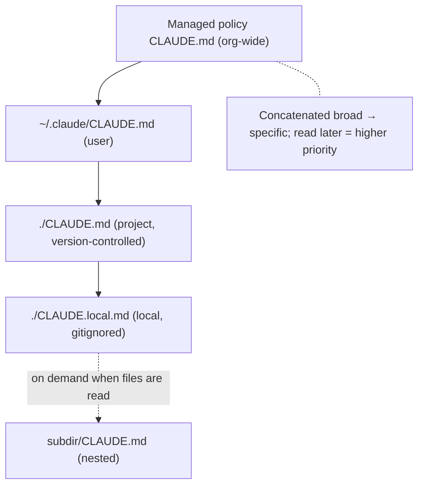
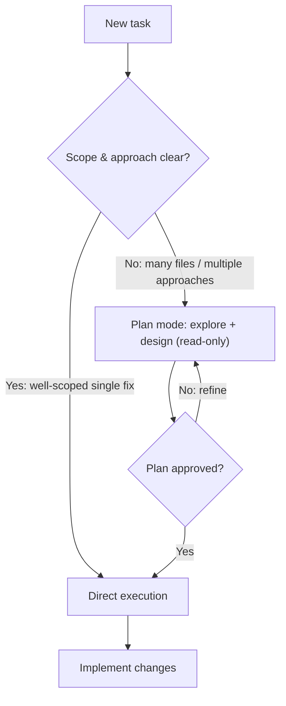
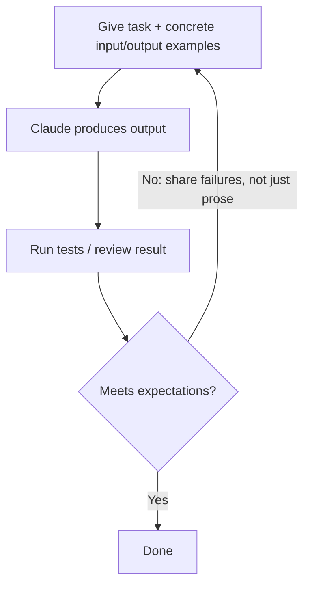
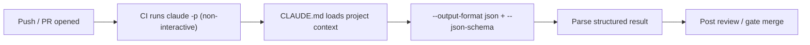

---
tags:
  - CCA-F
  - domain-3
  - claude-code
  - configuration
  - workflows
date: 2026-06-16
status: in-progress
domain: "3 of 5"
---

# ⚙️ Domain 3: Claude Code Configuration & Workflows

> [!NOTE] Exam Coverage
> This domain covers the CLAUDE.md hierarchy and scoping, custom slash commands and skills, path-specific rules, when to use plan mode vs direct execution, iterative refinement, and CI/CD pipeline integration.

**Back to:** [[CCA-F Study Roadmap]]
**Key resources:**
- https://code.claude.com/docs/en/memory
- https://code.claude.com/docs/en/skills
- https://code.claude.com/docs/en/best-practices
- https://code.claude.com/docs/en/cli-reference

---

## 3.1 — CLAUDE.md Hierarchy, Scoping & Modular Organization

### The CLAUDE.md Hierarchy (Load Order: Broad → Specific)

| Scope | Location | Shared? | Purpose |
|-------|----------|---------|---------|
| **Managed policy** | macOS: `/Library/Application Support/ClaudeCode/CLAUDE.md` · Linux: `/etc/claude-code/CLAUDE.md` · Win: `C:\Program Files\ClaudeCode\CLAUDE.md` | All users on machine | Company-wide: security policies, compliance |
| **User** | `~/.claude/CLAUDE.md` | ❌ You only, all projects | Personal preferences, tooling shortcuts |
| **Project** | `./CLAUDE.md` or `./.claude/CLAUDE.md` | ✅ Team via version control | Architecture, coding standards, workflows |
| **Local** | `./CLAUDE.local.md` | ❌ You only, current project (gitignored) | Sandbox URLs, personal test data |

> [!IMPORTANT] Load Order Rule
> Files are concatenated in order from **root → working directory**. More specific instructions appear later in context. `CLAUDE.local.md` is appended after `CLAUDE.md` at each level.
>
> Subdirectory `CLAUDE.md` files are **NOT loaded at launch** — they load **on demand** when Claude reads files in those subdirectories.



> [!WARNING] Exam Trap: User vs Project Scope
> **User-level** (`~/.claude/CLAUDE.md`) = NOT in version control → new team members won't get it.
> **Project-level** (`./CLAUDE.md`) = version-controlled → shared with the whole team.
> If a new team member isn't receiving instructions, check whether they were written to user scope instead of project scope.

### AGENTS.md vs CLAUDE.md

Claude Code reads `CLAUDE.md`, **not** `AGENTS.md`. To use an existing `AGENTS.md`:

```markdown
<!-- In CLAUDE.md -->
@AGENTS.md

## Claude Code-specific instructions
Use plan mode for changes under `src/billing/`.
```

Or use a symlink: `ln -s AGENTS.md CLAUDE.md`

### `@import` Syntax for Modular Files

```text
See @README for project overview.

# Additional Instructions
- git workflow: @docs/git-instructions.md
```

- Both relative and absolute paths are allowed
- Imported files are **expanded and loaded at launch** (same token cost as inline)
- Maximum import chain depth: **4 hops**
- Circular imports are handled gracefully

> [!WARNING] Import Approval
> First time Claude encounters external imports, it shows an approval dialog. If declined, imports stay disabled.

### `.claude/rules/` — Topic-Specific Rule Files

An alternative to a monolithic CLAUDE.md for large projects:

```text
.claude/
├── CLAUDE.md               ← Main project instructions
└── rules/
    ├── testing.md          ← Testing conventions
    ├── api-design.md       ← API standards
    └── security.md         ← Security requirements
```

- Rules are discovered recursively — you can use subdirectories (`frontend/`, `backend/`)
- Rules without `paths:` frontmatter load at launch with same priority as `.claude/CLAUDE.md`
- Rules with `paths:` frontmatter are **path-scoped** (see Section 3.3)

### `/memory` Command

Use `/memory` to verify which memory files are currently loaded and diagnose inconsistent behavior across sessions.

### CLAUDE.md Size Guidelines

| Recommendation | Detail |
|---------------|--------|
| Target size | Under 200 lines per file |
| Instructions are context, not config | More specific + concise = more reliably followed |
| HTML comments stripped | `<!-- notes -->` are removed before injection — use for maintainer notes without spending tokens |

---

## 3.2 — Custom Slash Commands & Skills

### Commands vs Skills

> [!NOTE] Key Fact
> Custom commands (`.claude/commands/`) and skills (`.claude/skills/`) both create `/name` invocations. If a skill and command share the same name, the **skill takes precedence**.

### Where They Live

| Location | Path | Scope |
|----------|------|-------|
| **Project skill** | `.claude/skills/<name>/SKILL.md` | This project (version-controlled) |
| **Personal skill** | `~/.claude/skills/<name>/SKILL.md` | All your projects |
| **Enterprise skill** | Managed settings | All org users |
| **Project command** | `.claude/commands/<name>.md` | This project (version-controlled) |
| **Personal command** | `~/.claude/commands/<name>.md` | All your projects |

### SKILL.md Structure

```yaml
---
description: "Summarizes changes and flags risks. Use when user asks what changed."
argument-hint: "[branch-name]"
context: fork
allowed-tools: Read Grep
disable-model-invocation: true
---

## Current changes
!`git diff HEAD`    ← Dynamic context injection: runs command, inlines output

## Instructions
Summarize changes in 2-3 bullets, flag risks (missing error handling, hardcoded values, tests needed).
```

### SKILL.md Frontmatter Fields

| Field | Required | Description |
|-------|----------|-------------|
| `description` | Recommended | When to use this skill — Claude uses this to auto-invoke |
| `argument-hint` | No | Shown during autocomplete: `[issue-number]`, `[filename] [format]` |
| `context: fork` | No | Run skill in **isolated subagent context** — output doesn't pollute main session |
| `allowed-tools` | No | Tools Claude can use without permission during this skill |
| `disallowed-tools` | No | Tools **removed** from Claude's pool while skill is active |
| `disable-model-invocation` | No | `true` = Claude never auto-triggers; manual `/name` only |
| `user-invocable` | No | `false` = hidden from `/` menu (background knowledge only) |
| `model` | No | Override model for this skill's turn |
| `paths` | No | Glob patterns — only auto-invoked when working with matching files |

> [!IMPORTANT] `context: fork` — Key Exam Concept
> Running a skill with `context: fork` creates an **isolated subagent** for the skill:
> - Verbose output (e.g., codebase analysis, brainstorming) stays isolated → main context stays clean
> - Only the final summary returns to the main session
> - Use for skills that produce a lot of intermediate output

### Dynamic Context Injection

```markdown
!`git diff HEAD`          ← Runs bash command, output inlined before Claude sees it
!`cat package.json`       ← Inlines file contents
!`npm test 2>&1 | tail`   ← Inlines command output
```

### Skills vs CLAUDE.md — When to Use Each

| Use | For |
|-----|-----|
| `CLAUDE.md` | Always-loaded universal standards (build commands, coding conventions) |
| **Skills** | On-demand procedures (deploy workflow, commit checklist, test generation) |
| **Skills** | Content that would bloat CLAUDE.md — loads only when invoked |
| **Path-scoped rules** | File-type specific conventions (see Section 3.3) |

---

## 3.3 — Path-Specific Rules for Conditional Convention Loading

### Syntax

```markdown
---
paths:
  - "src/api/**/*.ts"
  - "**/*.test.tsx"
---

# API Development Rules
- All endpoints must include input validation
- Use standard error response format
```

### Path Pattern Examples

| Pattern | Matches |
|---------|---------|
| `**/*.ts` | All TypeScript files anywhere |
| `src/**/*` | All files under `src/` |
| `*.md` | Markdown files in project root |
| `src/**/*.{ts,tsx}` | All TS/TSX in `src/` (brace expansion) |
| `**/*.test.tsx` | All test files regardless of directory |
| `terraform/**/*` | All files under Terraform directory |

> [!IMPORTANT] Exam: Path-Scoped Rules vs Subdirectory CLAUDE.md
> **Path-scoped rules** (`.claude/rules/` with `paths:`) are better than subdirectory `CLAUDE.md` when:
> - Conventions apply to files **spread across multiple directories** (e.g., `*.test.tsx` files can be in any package)
> - You want a single authoritative rule file for a cross-cutting concern
> - You want reduced context noise (rules only load when working with matching files)

### Triggering Behavior

Path-scoped rules trigger when Claude **reads** a matching file — not on every tool use.

---

## 3.4 — Plan Mode vs Direct Execution

### Decision Framework

| Scenario | Use |
|----------|-----|
| Complex task with multiple valid approaches | **Plan mode** |
| Large-scale changes affecting many files | **Plan mode** |
| Architectural decisions with infrastructure implications | **Plan mode** |
| Library migrations affecting 45+ files | **Plan mode** |
| Open-ended investigation before committing | **Plan mode** |
| Simple, well-scoped single-file bug fix (clear stack trace) | **Direct execution** |
| Adding a single validation check to one function | **Direct execution** |
| Changes where scope and approach are unambiguous | **Direct execution** |

> [!IMPORTANT] Plan Mode Purpose
> Plan mode enables **safe codebase exploration and design** before committing to changes.
> This prevents costly rework when the wrong approach is chosen upfront.

### Combining Both

Effective pattern:
1. **Plan mode** → investigate scope, choose approach
2. **Direct execution** → implement the planned approach



### Explore Subagent

When a task involves verbose discovery (e.g., scanning all files to understand architecture):
- Use the **Explore subagent** to isolate discovery output
- The subagent returns a concise summary to the main session
- Prevents context window exhaustion during multi-phase tasks

---

## 3.5 — Iterative Refinement Techniques for Progressive Improvement

### Technique 1: Concrete Input/Output Examples

> When prose descriptions are interpreted inconsistently → provide 2-3 concrete examples instead.

```text
# ❌ Vague
"Summarize the customer complaint"

# ✅ Concrete example
Input: "My order #12345 arrived broken and I've been waiting 3 weeks"
Expected output: {issue: "damaged goods", order_id: "12345", wait_days: 21, priority: "high"}
```

### Technique 2: Test-Driven Iteration

1. Write test suite covering expected behavior, edge cases, performance requirements
2. Share test **failures** (not just description) to guide improvement
3. Iterate until tests pass

### Technique 3: Interview Pattern

Before implementing — especially in unfamiliar domains — ask Claude to **surface questions first**:
- Cache invalidation strategies?
- Failure modes?
- Edge cases in data formats?

This prevents discovering design problems after implementation.

### The Refinement Loop



### Providing Multiple Issues

| Situation | Approach |
|-----------|---------|
| Issues that interact with each other | Single message with all issues (fixes may interfere) |
| Independent issues | Sequential iteration (one fix at a time) |

---

## 3.6 — CI/CD Pipeline Integration

### Non-Interactive Mode

```bash
# Run Claude Code in CI without interactive input
claude -p "Review this PR for security issues"

# With structured output for automated processing
claude -p "Review src/" --output-format json --json-schema '{"type":"object","properties":{"issues":{"type":"array"}},"required":["issues"]}'
```

| Flag | Purpose |
|------|---------|
| `-p` / `--print` | Non-interactive mode; exits after completing. **Required for CI** (prevents hanging on input prompts) |
| `--output-format json` | Machine-parseable JSON output |
| `--json-schema <schema>` | Enforce a specific JSON structure on output |

> [!WARNING] Exam Trap: `--json-schema` Takes Inline JSON, Not a File Path
> `--json-schema` accepts an **inline JSON Schema string**, not a file path — `--json-schema schema.json` does not load a file. Pass the schema directly, e.g. `--json-schema '{"type":"object", ...}'`. Source: `code.claude.com/docs/en/cli-reference`.

> [!WARNING] Exam Trap: CI Flag Name
> The flag is `-p` or `--print` (not `--non-interactive`). Without it, Claude Code waits for input and **hangs in CI**.



### CLAUDE.md in CI Context

CLAUDE.md provides project context to the CI-invoked Claude Code session:
- Testing standards and fixture conventions
- Review criteria (which issues to flag, which to ignore)
- Available test utilities

### Independent Review Instance for PRs

> [!IMPORTANT] Self-Review Limitation
> A model **retains its generation reasoning context** in the same session → less likely to question its own decisions.
> Solution: spin up an **independent Claude Code instance** (without prior reasoning context) to review generated code — it catches more subtle issues.

### Including Prior Review Findings

When re-running reviews after new commits:
- Pass **prior review findings** in context
- Instruct Claude to report **only new or still-unaddressed** issues
- Prevents duplicate comments on already-known issues

### Test Generation in CI

To avoid generating duplicate test cases:
- Provide **existing test files in context** so Claude knows what's already covered
- Document testing standards and available fixtures in `CLAUDE.md`

---

## ✅ Domain 3 Practice Checklist

- [ ] Know all 4 CLAUDE.md scopes and their file locations
- [ ] Know the load order (broad → specific, files concatenated)
- [ ] Know that subdirectory CLAUDE.md files load on demand, not at launch
- [ ] Know the difference between user-level and project-level scope (version control)
- [ ] Know the `@import` syntax and its 4-hop limit
- [ ] Know `.claude/rules/` structure and purpose
- [ ] Know all SKILL.md frontmatter fields (especially `context: fork`, `allowed-tools`, `argument-hint`)
- [ ] Know what `context: fork` does (isolated subagent, output stays contained)
- [ ] Know `disable-model-invocation: true` prevents auto-triggering
- [ ] Know dynamic context injection syntax (`` !`command` ``)
- [ ] Know path-specific rules syntax (`paths:` frontmatter with glob patterns)
- [ ] Know when path-scoped rules > subdirectory CLAUDE.md
- [ ] Know when to use plan mode vs direct execution
- [ ] Know the `-p` / `--print` flag for CI and why it's required
- [ ] Know `--output-format json` + `--json-schema` for structured CI output
- [ ] Know self-review limitation and the independent instance solution

---

## 🃏 Quick-Reference Flash Cards

**Q: A new team member isn't getting the project's CLAUDE.md instructions. What's the likely cause?**
A: The instructions were written to user scope (`~/.claude/CLAUDE.md`) instead of project scope (`./CLAUDE.md`). User-level files are not version-controlled.

**Q: What does `context: fork` do in a SKILL.md frontmatter?**
A: Runs the skill in an isolated subagent context. Verbose output stays inside the subagent — only the final summary returns to the main session, keeping the main context clean.

**Q: What's the difference between `allowed-tools` and `disallowed-tools` in skill frontmatter?**
A: `allowed-tools` — tools Claude can use without a permission prompt during the skill. `disallowed-tools` — tools completely removed from Claude's pool while the skill is active.

**Q: When should you use path-specific `.claude/rules/` files instead of subdirectory CLAUDE.md?**
A: When conventions apply to files spread across multiple directories (e.g., all `*.test.tsx` files), path-scoped rules are better since they can target files by type regardless of location.

**Q: What flag is required for Claude Code in CI pipelines?**
A: `-p` or `--print`. Without it, Claude Code waits for user input and hangs in automated pipelines.

**Q: How do you produce machine-parseable structured output from Claude Code in CI?**
A: Use `--output-format json` with `--json-schema '<inline schema>'` — the flag takes an inline JSON Schema string, not a file path.

**Q: Why is an independent Claude Code instance better than self-review for catching bugs?**
A: A model retains its generation reasoning context within the same session, making it less likely to question its own decisions. An independent instance with no prior context catches more subtle issues.

**Q: What does `/memory` do?**
A: Shows which CLAUDE.md and memory files are currently loaded — used to diagnose inconsistent behavior across sessions.

**Q: What is `disable-model-invocation: true` in SKILL.md used for?**
A: Prevents Claude from automatically triggering the skill based on context. The skill only runs when explicitly invoked with `/skill-name`.

**Q: What's the import depth limit for CLAUDE.md `@import` chains?**
A: 4 hops maximum.

---

*Previous: [[D2 - Tool Design & MCP Integration]] · Next: [[D4 - Prompt Engineering & Structured Output]]*
