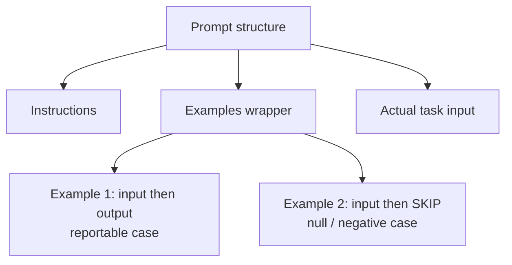
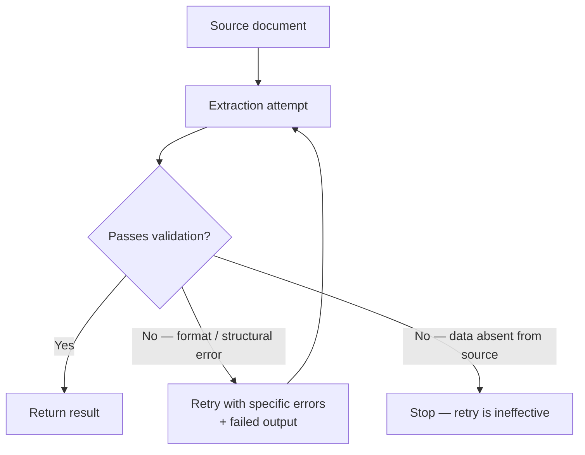
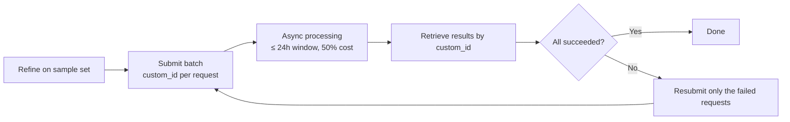
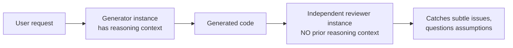
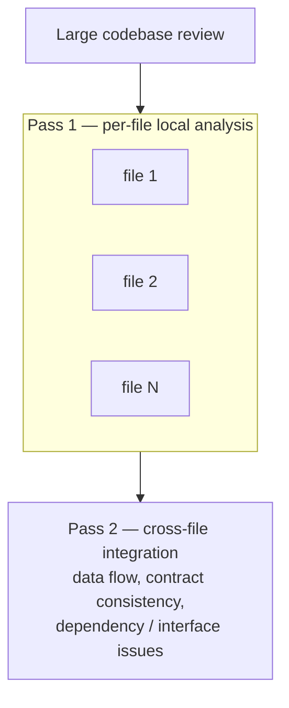

---
tags:
  - CCA-F
  - domain-4
  - prompt-engineering
  - structured-output
  - batch-processing
date: 2026-06-16
status: in-progress
domain: "4 of 5"
---

# 📝 Domain 4: Prompt Engineering & Structured Output

> [!NOTE] Exam Coverage
> This domain covers designing precise prompts with explicit criteria, few-shot prompting, enforcing structured output via tool use and JSON schemas, validation/retry loops, batch processing strategies, and multi-instance review architectures.

**Back to:** [[CCA-F Study Roadmap]]
**Key resources:**
- https://docs.anthropic.com/en/docs/build-with-claude/prompt-engineering/claude-prompting-best-practices
- https://docs.anthropic.com/en/docs/build-with-claude/structured-outputs
- https://docs.anthropic.com/en/docs/build-with-claude/batch-processing

---

## 4.1 — Design Prompts with Explicit Criteria to Reduce False Positives

### The Core Problem

Vague instructions produce inconsistent results. "Be conservative" or "only report high-confidence findings" are not actionable — they don't tell the model *what category* of issue to skip.

### Explicit Criteria vs Vague Instructions

| ❌ Vague | ✅ Explicit |
|---------|-----------|
| "Check that comments are accurate" | "Flag comments **only** when the claimed behavior **contradicts** the actual code behavior" |
| "Be conservative in what you flag" | "Report: bugs, security issues. Skip: minor style, local patterns, test-only logic" |
| "Only report high-confidence findings" | "Severity High: null pointer deref, SQL injection. Severity Medium: missing error handling" |

> [!IMPORTANT] Exam Rule
> General confidence-based filters ("only high-confidence findings") **fail to improve precision**. Specific categorical criteria with code examples are what actually reduce false positives.

### Handling High False Positive Categories

When a review category has too many false positives:
1. **Temporarily disable** that category → restores developer trust in the other categories
2. **Improve the prompt** for that category before re-enabling it
3. Never keep a noisy category active — it poisons trust in accurate categories

### Severity Classification

Define explicit severity criteria with **concrete code examples** per level:
- Severity High: examples of critical security/correctness issues
- Severity Medium: examples of maintainability issues
- Severity Low: examples of style issues (or "skip entirely")

---

## 4.2 — Few-Shot Prompting for Output Consistency

### What Few-Shot Prompting Solves

When detailed instructions alone produce inconsistent results → **add examples**.

Few-shot examples:
- Demonstrate exact output format (location, issue, severity, suggested fix)
- Show reasoning for ambiguous cases (why one action was chosen over alternatives)
- Enable generalization to novel patterns (not just pattern-matching to pre-specified cases)
- Reduce hallucination in extraction tasks with varied document structures

### How Many Examples

**2–4 targeted examples** for ambiguous scenarios is the recommended range.

> [!TIP] Example Design
> For ambiguous classification scenarios, show the reasoning:
> "Tool selected: `search_web`. Reason: query contains a URL fragment — `analyze_content` is for uploaded files, not web resources."

### Few-Shot Example Structure (Anthropic Recommended)

Wrap examples in `<example>` / `<examples>` tags to distinguish them from instructions:

```xml
<examples>
  <example>
    <input>Loaded file: auth.py — contains JWT validation logic</input>
    <output>
    {
      "location": "auth.py:47",
      "issue": "JWT signature not verified before decoding payload",
      "severity": "HIGH",
      "suggested_fix": "Call verify() before decode()"
    }
    </output>
  </example>
  <example>
    <input>Loaded file: utils.py — helper functions, no security-critical logic</input>
    <output>SKIP — no reportable issues in this file</output>
  </example>
</examples>
```



### Few-Shot for Extraction Tasks

For extraction from documents with varied formats:
- Show correct extraction from different document structures (inline citations vs bibliographies)
- Include examples of **null/empty** correct outputs (when a field simply isn't present)
- Demonstrate how to handle ambiguous or informal measurements

---

## 4.3 — Enforce Structured Output via Tool Use and JSON Schemas

### Two Mechanisms for Structured Output

| Mechanism | Reliability | What It Guarantees |
|-----------|-------------|-------------------|
| **Tool use** (`tool_use`) with JSON schema | Highest | Schema-compliant output, no JSON syntax errors |
| **`output_config.format`** JSON schema (API) | High | Constrained decoding, schema-valid response |
| Plain prompt ("respond as JSON") | Low | No guarantees — still prone to syntax errors |

> [!IMPORTANT] Exam Rule
> **Tool use with JSON schema = most reliable approach** for guaranteed schema-compliant structured output, eliminating JSON syntax errors.
>
> However: strict schemas prevent syntax errors but do **NOT** prevent semantic errors (e.g., line items that don't sum to total, values in wrong fields).

### `tool_choice` for Structured Output

`tool_choice` is an **object**, not a bare string:

| Value | Effect |
|-------|--------|
| `{"type": "auto"}` | Default — model may return text instead of calling a tool |
| `{"type": "any"}` | Model **must** call a tool — guarantees structured output |
| `{"type": "tool", "name": "extract_metadata"}` | Model **must** call this specific tool |
| `{"type": "none"}` | Model **cannot** call any tool |

Any value may add `"disable_parallel_tool_use": true` to force at most one tool call per response.

**Typical patterns:**
- Multiple extraction schemas exist, document type unknown → `{"type": "any"}`
- Ensure metadata extraction runs before enrichment steps → forced specific tool → then `{"type": "auto"}` for follow-up

### JSON Schema Design for Extraction

```json
{
  "type": "object",
  "properties": {
    "customer_name": {"type": "string"},
    "order_id": {"type": ["string", "null"]},   ← nullable when field may be absent
    "status": {
      "enum": ["pending", "shipped", "delivered", "unclear"]  ← "unclear" for ambiguous cases
    },
    "status_detail": {"type": "string"}         ← "other" + detail string pattern
  },
  "required": ["customer_name", "status"]       ← only truly required fields
}
```

> [!IMPORTANT] Schema Design Rules
> - Use **optional (nullable) fields** when the source may not contain the data — prevents fabrication
> - Add `"unclear"` / `"other"` enum values for ambiguous cases
> - Add `"other"` + detail string pattern for extensible categorization
> - Only mark fields `required` that will truly always be present

### `output_config.format` (Messages API)

```python
response = client.messages.create(
    model="claude-opus-4-8",
    messages=[...],
    output_config={
        "format": {
            "type": "json_schema",
            "schema": {
                "type": "object",
                "properties": {"name": {"type": "string"}, ...},
                "required": ["name"],
                "additionalProperties": False
            }
        }
    }
)
```

> [!NOTE] Migration Note
> `output_format` parameter has moved to `output_config.format`. Old beta header (`structured-outputs-2025-11-13`) still works during transition.
> Starting with Claude 4.6+: **prefilled responses on the last assistant turn are no longer supported** (returns 400 error). Use structured outputs or tool use instead.

---

## 4.4 — Validation, Retry & Feedback Loops for Extraction Quality



### Retry with Error Feedback

When extraction fails validation, don't just retry blindly — **include the specific errors**:

```python
# Second attempt includes the failed result AND validation errors
retry_prompt = f"""
Original document:
{document}

Previous extraction attempt:
{failed_extraction}

Validation errors found:
- calculated_total ({calc}) does not match stated_total ({stated})
- order_date format should be ISO 8601, got: {raw_date}

Please correct these specific errors and return a valid extraction.
"""
```

### When Retries Work vs When They Don't

| Scenario | Retry Effective? |
|----------|----------------|
| Output format mismatch (wrong date format, wrong field name) | ✅ Yes |
| Structural output errors | ✅ Yes |
| Required information **absent from source document** | ❌ No — data isn't there |
| Model chose wrong value from ambiguous source | ✅ Sometimes — with clarification |

> [!IMPORTANT] Exam Rule
> Retries are **ineffective** when the required information simply doesn't exist in the source document. This is a fundamental limitation, not a formatting issue.

### Self-Correction Validation Flows

Design extractions to include **cross-check fields**:
```json
{
  "line_items": [...],
  "stated_total": 150.00,
  "calculated_total": 145.00,    ← model calculates this
  "conflict_detected": true       ← model flags the discrepancy
}
```

### `detected_pattern` Field for False Positive Analysis

When developers dismiss review findings, include a `detected_pattern` field:
```json
{
  "finding": "Possible SQL injection",
  "severity": "HIGH",
  "detected_pattern": "string_concatenation_in_query"  ← enables dismissal pattern analysis
}
```

This enables you to systematically analyze which patterns produce false positives.

---

## 4.5 — Batch Processing Strategies

### Message Batches API — Key Facts

| Fact | Detail |
|------|--------|
| **Cost** | 50% of standard API pricing |
| **Processing window** | Results available after all complete OR after **24 hours**, whichever is first |
| **Latency SLA** | ❌ None — no guaranteed latency |
| **Batch size limit** | 100,000 requests OR 256 MB, whichever is first |
| **Result availability** | 29 days after creation |
| **Multi-turn conversations & tool use** | ✅ Supported — batch runs the same server-side agentic loop as the synchronous Messages API |
| **ZDR eligible** | ❌ Not eligible for Zero Data Retention |

> [!IMPORTANT] Exam Rule: What Batch Actually Can't Do
> Multi-turn conversations and server-side tool use (e.g., web search, code execution) work fine inside a single batch request — the batch runs the same agentic loop as a sync `messages.create` call.
> What you *cannot* do is an interactive, **client-executed** tool round-trip mid-request (model calls a tool → your code executes it → you send the result back — all within one "turn"). That limitation is true of **any single Messages API call**, sync or batch — it isn't something batch uniquely lacks.



> [!IMPORTANT] Exam Rule: Batch API vs Synchronous API
> - **Batch API** → non-blocking, latency-tolerant work: overnight reports, weekly audits, nightly test generation
> - **Synchronous API** → blocking workflows: pre-merge checks, interactive user-facing features
> Never use Batch API where timing matters for the user or pipeline.

### `custom_id` Field

Every batch request requires a `custom_id` to correlate responses:
```python
Request(
    custom_id="document-analysis-42",   ← 1-64 chars, alphanumeric + hyphens + underscores
    params=MessageCreateParamsNonStreaming(
        model="claude-opus-4-8",
        ...
    )
)
```

### Batch Failure Handling

When individual requests fail:
1. Identify failed requests by `custom_id` in the results
2. Resubmit **only the failed documents** (not the whole batch)
3. If failed due to context limit → **chunk the document** and resubmit

### SLA Calculation Pattern

Example: 30-hour SLA + 24-hour batch window → must submit within **6-hour** windows (30 - 24 = 6 hours maximum delay before batch start).

### Optimize Before Batch Submission

Run prompt refinement on a **sample set first** before batch-processing large volumes:
- Maximize first-pass success rate
- Reduces iterative resubmission costs significantly

---

## 4.6 — Multi-Instance & Multi-Pass Review Architectures

### Self-Review Limitation

> A model **retains the reasoning context** from its generation within the same session → less likely to question its own decisions.

This is **not** solvable by:
- ❌ Adding "review your own work" instructions
- ❌ Extended thinking
- ✅ **Independent review instance** (new session, no prior reasoning context)

### Independent Review Instance Pattern



- **Generator** retains its own reasoning → less likely to find its own errors.
- **Reviewer** starts fresh → more likely to catch subtle issues.

### Multi-Pass Review Architecture

For large multi-file reviews:



**Why:** Reviewing 10+ files simultaneously causes attention dilution and contradictory findings. Splitting maintains focus.

### Running Verification Passes

Add `confidence` alongside each finding to enable **calibrated review routing**:
```json
{
  "finding": "Missing null check before dereference",
  "severity": "HIGH",
  "confidence": 0.95,
  "reasoning": "Pattern matches known NPE scenario at line 47"
}
```

Low-confidence findings → route to human review first.

---

## 📋 General Prompt Engineering Best Practices

These apply across all domains and are fair exam territory:

### Be Clear and Direct

> Think of Claude as a brilliant but **new employee** who lacks context on your norms.

- Be specific about desired output format and constraints
- Provide sequential steps as numbered lists when order matters
- "Show, don't tell" — concrete examples beat abstract instructions

### Context Improves Performance

Explaining **why** a constraint exists helps Claude generalize:
```
❌ "NEVER use ellipses"
✅ "Never use ellipses — the text-to-speech engine can't pronounce them"
```

### XML Tags for Complex Prompts

Use XML tags to separate instruction types in complex prompts:
```xml
<instructions>Your task is to extract contact information</instructions>
<context>Documents may be in English, French, or Spanish</context>
<documents>
  <document index="1">...</document>
</documents>
```

### Long Context: Document Placement

For 20k+ token inputs:
- **Put long documents at the top**, query/instructions at the bottom
- Queries at the end can improve response quality by up to 30%
- Use `<document>` tags with `<source>` metadata for multiple documents

---

## ✅ Domain 4 Practice Checklist

- [ ] Know why explicit categorical criteria beat confidence-based filtering
- [ ] Know the strategy for handling high false positive categories
- [ ] Know what `<examples>` tag wrapping accomplishes in few-shot prompts
- [ ] Know how many few-shot examples are recommended (2-4)
- [ ] Know what few-shot examples prevent (inconsistency, hallucination in extraction)
- [ ] Know tool use + JSON schema = most reliable structured output mechanism
- [ ] Know that strict schemas prevent syntax errors, NOT semantic errors
- [ ] Know all 3 `tool_choice` values and exam scenarios for each
- [ ] Know schema design rules (nullable fields, `"unclear"` enum, `"other"` + detail)
- [ ] Know when retries work vs don't work
- [ ] Know the self-correction cross-check field pattern
- [ ] Know Batch API: 50% cost, 24h window, no latency SLA; multi-turn conversations & tool use ARE supported (same agentic loop as sync Messages)
- [ ] Know the `custom_id` format and purpose
- [ ] Know when to use batch vs synchronous API
- [ ] Know the self-review limitation and independent instance solution
- [ ] Know the per-file pass + cross-file integration pass architecture

---

## 🃏 Quick-Reference Flash Cards

**Q: Why don't "only report high-confidence findings" instructions reduce false positives?**
A: They're too vague — they don't specify what category of issue to skip. Explicit categorical criteria (e.g., "flag only when claimed behavior contradicts actual code") are what actually improve precision.

**Q: How many few-shot examples are recommended, and what should they demonstrate?**
A: 2–4 examples. They should demonstrate exact output format, reasoning for ambiguous cases, and how to handle edge cases — not just correct outputs.

**Q: What's the most reliable way to get schema-compliant structured output from Claude?**
A: Tool use (`tool_use`) with a JSON schema. This eliminates JSON syntax errors via constrained decoding.

**Q: Tool use eliminates syntax errors in structured output. What does it NOT prevent?**
A: Semantic errors — e.g., line items that don't sum to the stated total, or values placed in the wrong fields.

**Q: What `tool_choice` value guarantees the model calls a tool instead of returning text?**
A: `{"type": "any"}` — forces the model to call at least one available tool. (`tool_choice` is always an object, never a bare string.)

**Q: Why should extraction schema fields be nullable?**
A: When source documents may not contain a field's data, making it optional (nullable) prevents the model from fabricating values to satisfy a required field.

**Q: When are retries ineffective in extraction feedback loops?**
A: When the required information simply doesn't exist in the source document. Retrying won't make the data appear.

**Q: What are the Batch API's three key characteristics?**
A: 50% cost savings, up to 24-hour processing window, no guaranteed latency SLA.

**Q: Can you do multi-turn conversations and tool use within a single Batch API request?**
A: Yes — batch runs the same server-side agentic loop as the synchronous Messages API, so multi-turn conversations and tool use (including server-side tools) are supported. What's not possible is an interactive, client-executed tool round-trip mid-request — but that's true of any single Messages call, not something specific to batch.

**Q: Why is an independent review instance better than self-review?**
A: The model retains its generation reasoning context in the same session, making it biased toward its own decisions. An independent instance with no prior context catches more subtle issues.

---

*Previous: [[D3 - Claude Code Configuration & Workflows]] · Next: [[D5 - Context Management & Reliability]]*
