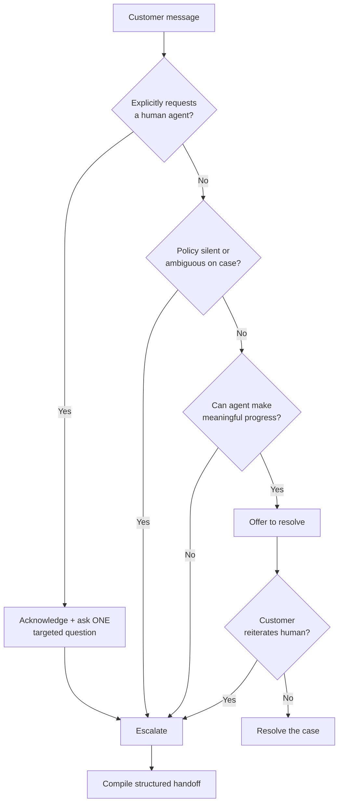
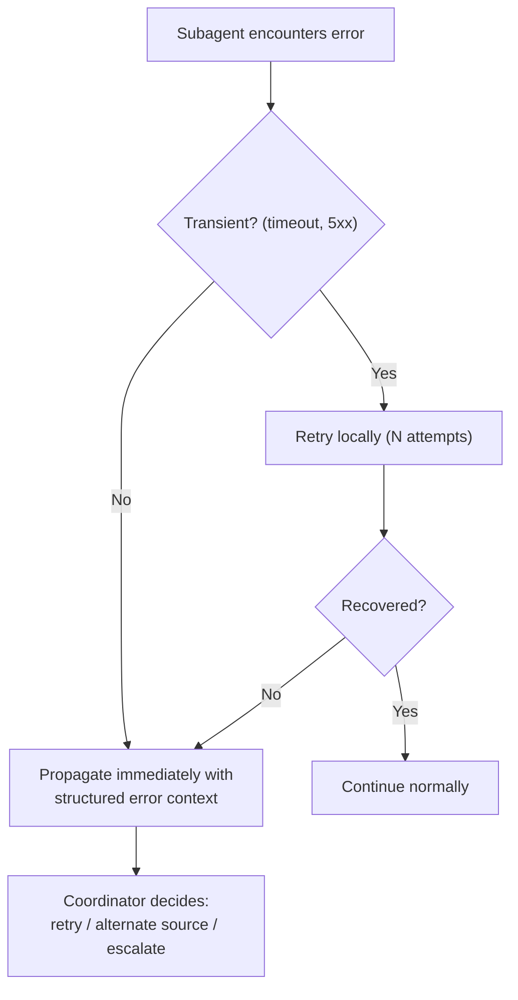
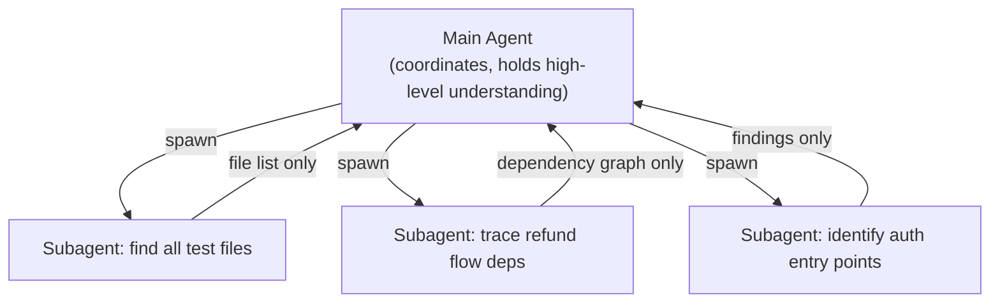
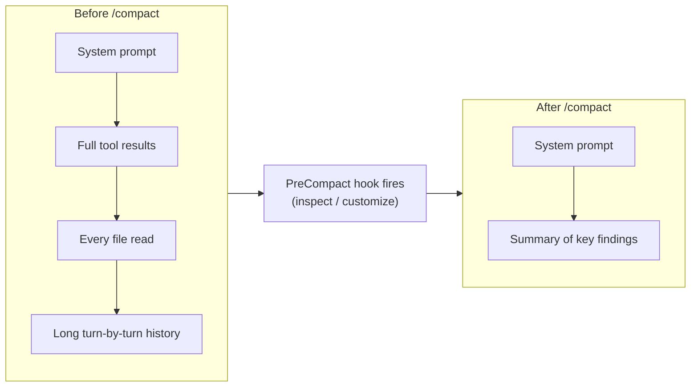
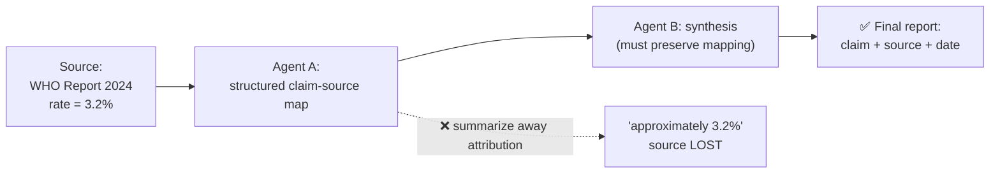

---
tags:
  - CCA-F
  - domain-5
  - context-management
  - reliability
date: 2026-06-16
status: done
domain: "5 of 5"
---

# 🧩 Domain 5: Context Management & Reliability

> [!NOTE] Exam Coverage
> This domain covers preserving critical information across long interactions, escalation patterns, error propagation in multi-agent systems, large codebase exploration strategies, human review workflows, and information provenance in multi-source synthesis.

**Back to:** [[CCA-F Study Roadmap]]
**Key resources:**
- https://code.claude.com/docs/en/best-practices
- https://code.claude.com/docs/en/costs
- https://code.claude.com/docs/en/context-window
- https://code.claude.com/docs/en/agent-sdk/agent-loop.md

---

## 5.1 — Manage Conversation Context Across Long Interactions

### The Core Constraint

> Claude's context window holds **everything**: your prompt, every tool call, every file read, every tool result. It fills up fast, and **performance degrades as it fills**.

When context fills:
- Claude may "forget" earlier instructions
- Claude starts referencing "typical patterns" rather than specific findings from earlier in the session
- Answers become inconsistent

### Progressive Summarization Risks

> [!WARNING] Exam Trap: Progressive Summarization
> Condensing conversation into summaries **destroys precision** for:
> - Numerical values (amounts, percentages, measurements)
> - Specific dates and timestamps
> - Order IDs, customer IDs, reference numbers
> - Customer-stated expectations
>
> ✅ Solution: Extract transactional facts into a **persistent "case facts" block** included in every prompt, **outside** summarized history.

### The "Lost in the Middle" Effect

Models reliably process information at the **beginning and end** of long inputs, but may omit or deprioritize findings from the **middle** sections.

**Mitigation strategies:**
- Place **key findings summaries at the beginning** of aggregated inputs
- Use **explicit section headers** to organize detailed results
- Put **long documents at the top** of prompts, queries at the bottom (up to 30% quality improvement)

### Tool Result Accumulation

Tool results accumulate in context and consume tokens disproportionately to their relevance.

> [!IMPORTANT] Exam Rule
> Trim verbose tool outputs to only **relevant fields** before they accumulate:
> - Example: an order lookup returns 40+ fields → keep only the 5 return-relevant fields
> - This can be done via `PostToolUse` hooks (see [[D1 - Agentic Architecture & Orchestration]])

### Persistent "Case Facts" Block Pattern

For multi-issue customer service sessions:

```
[Every prompt includes this block — NOT summarized away]
CASE FACTS:
- Customer ID: C-88221
- Order #: 12345
- Reported: 2026-06-12
- Claimed amount: $149.99
- Return status: approved
---
[Conversation summary below — may be condensed]
```

### Passing Complete Conversation History

For multi-turn conversations via the API: always pass the **complete conversation history** in subsequent requests to maintain conversational coherence.

### Context Management Commands

| Command | Purpose |
|---------|---------|
| `/clear` | Start fresh — clears context completely |
| `/compact` | Summarize conversation, reducing tokens while preserving key info |
| `/usage` | Show API usage stats and costs for the current session (aliases: `/cost`, `/stats`) |
| `/rename` | Rename the current session so it's findable later |

> [!NOTE] Confirmed Commands
> `/usage` and `/rename` are confirmed Claude Code commands (source: `code.claude.com/docs/en/commands`). `/usage` displays API usage statistics and cost; `/cost` and `/stats` are aliases for it. `/rename` renames the current session.

---

## 5.2 — Escalation & Ambiguity Resolution Patterns

### When to Escalate

| Trigger | Action |
|---------|--------|
| Customer **explicitly requests a human agent** | Acknowledge the request, ask **one** targeted question to scope the issue, then escalate — never a cold handoff, never silent investigation |
| Policy is **ambiguous or silent** on customer's specific case | Escalate (policy gap, not just complexity) |
| Unable to make **meaningful progress** | Escalate |
| Complex case but agent **can resolve it** | Offer to resolve first; escalate only if customer reiterates |

### Escalation Decision Tree



> [!WARNING] Do not gate escalation on sentiment or self-reported confidence scores — branch only on the explicit conditions above.

> [!IMPORTANT] Exam Rule: Honor the request — but scope the issue in one question first
> An explicit request for a human is a **real escalation trigger**; never talk the customer out of it, and never quietly investigate instead. But the graded behaviour is **not** a cold handoff: acknowledge the frustration and ask **one** targeted question to establish what the issue actually is, then escalate with that context.
>
> One question does not override the request — it is what makes the handoff useful, because the human receives a scoped problem rather than a transcript. Two failure modes flank the right answer:
> - ❌ **Cold handoff** — escalate with nothing known, so the human restarts from zero.
> - ❌ **Silent investigation** — fire `get_customer` / `lookup_order` before you know what you are looking for. The tool calls have no target, and the customer waits while the agent works on the wrong thing.
> - ✅ **Acknowledge → one targeted question → escalate with a structured summary.**
>
> Offer to *resolve* rather than escalate only if the issue is straightforwardly solvable AND the customer has not explicitly demanded a human.
>
> Corrected 2026-08-24: this note previously read "escalate immediately — do NOT investigate or resolve — non-negotiable," which contradicted [[04-customer-support]] and is the keyed-wrong answer in the CyberSkill bank. See [[Weak Areas Deep Dive]].

### Unreliable Escalation Triggers

> [!WARNING] These proxies are unreliable for escalation decisions:
> ❌ **Sentiment analysis** — frustrated tone ≠ case complexity
> ❌ **Self-reported confidence scores** — model confidence ≠ actual case complexity
> ✅ Use **explicit business rules** with few-shot examples in system prompt

### Multiple Customer Match Pattern

When tool results return **multiple matching customers**:
- ❌ Don't select based on heuristics (most recent, highest spend, etc.)
- ✅ **Request additional identifiers** (email, order number, phone) to disambiguate

### Structured Handoff to Human Agents

Human agents receiving escalated cases often lack access to the conversation transcript. Always compile:

```
ESCALATION HANDOFF:
- Customer ID: [verified ID]
- Root cause: [specific technical finding]
- Amount at stake: $[exact amount]
- What was attempted: [steps taken]
- Recommended action: [specific next step]
```

---

## 5.3 — Error Propagation Strategies Across Multi-Agent Systems

### Structured Error Context

When a subagent fails, return **structured context** — not just a status:

```json
{
  "status": "error",
  "failure_type": "transient_timeout",
  "attempted_query": "SELECT * FROM orders WHERE customer_id=C88221",
  "partial_results": [...],
  "retry_attempted": true,
  "retry_count": 3,
  "alternative_approaches": ["try read replica", "try cached data"]
}
```

> [!IMPORTANT] Why Structured Errors Matter
> Generic errors ("search unavailable") hide context from the coordinator.
> The coordinator needs: **failure type + attempted query + partial results + retry history** to make intelligent recovery decisions (retry, use alternate source, synthesize with gap annotation).

### Access Failure vs Valid Empty Result

> [!WARNING] Critical Distinction (Exam Trap!)
> **Access failure** → something went wrong retrieving data → coordinator should consider retry/escalation
> **Valid empty result** → query succeeded, no matching data exists → coordinator should NOT retry
>
> Conflating these wastes retry attempts on valid empty results.

### Anti-Patterns

| Anti-Pattern | Problem |
|-------------|---------|
| Silently suppress errors (return empty = success) | Coordinator can't distinguish failure from "no data" |
| Terminate entire workflow on single subagent failure | Wastes all completed work; partial results are still valuable |
| Return generic "operation failed" | Coordinator can't decide: retry? use cache? escalate? |

### Local Recovery Pattern



### Synthesis with Coverage Annotations

When a subagent can't retrieve some data, the synthesis output should **annotate gaps**:

```
FINDINGS SUMMARY:
- Section A (well-supported): 3 independent sources agree...
- Section B (gap — data unavailable): search agent timed out; coverage incomplete
- Section C (conflicting): Sources X and Y disagree on [stat]; see both values below
```

---

## 5.4 — Context Management in Large Codebase Exploration

### Context Degradation Signs

You're experiencing context degradation when Claude:
- References "typical patterns" instead of specific classes/functions found earlier
- Gives inconsistent answers about the same component
- "Forgets" decisions made earlier in the session

### Subagent Delegation for Codebase Exploration

Spawn focused subagents to isolate verbose discovery:



Each subagent's verbose intermediate tool calls stay **inside** the subagent; only the compact final summary returns to the main agent's context.

**Why:** Subagents' intermediate tool calls stay inside the subagent — only the final summary returns to the main agent's context.

### Scratchpad Files

Maintain scratchpad files to persist key findings **across context boundaries**:

```markdown
# scratchpad-exploration.md
## Auth Module (explored 2026-06-16)
- Entry point: src/auth/index.ts
- Token refresh: src/auth/tokens.ts:47
- Known issue: JWT not verified before decode

## Database Layer
- ORM: Prisma
- Migration path: prisma/migrations/
```

When context resets, reference the scratchpad to restore key findings without re-exploring.

### Session Summarization Before Subagent Spawn

Before spawning a subagent for the next phase:
1. **Summarize key findings** from the current exploration phase
2. **Inject that summary** into the subagent's initial prompt
3. The subagent starts with context, not from scratch

### Structured State Persistence for Crash Recovery

For long-running multi-agent workflows:
- Each agent exports state to a known location (manifest file)
- Coordinator loads the manifest on resume
- Injects agent states into prompts on restart

```json
{
  "session_id": "refactor-auth-2026-06-16",
  "completed_agents": ["auth-explorer", "test-finder"],
  "pending_agents": ["refactor-planner"],
  "key_findings": {
    "auth_entry": "src/auth/index.ts",
    "jwt_bug": "src/auth/tokens.ts:47"
  }
}
```

### `/compact` Command

Use `/compact` to reduce context usage during extended sessions:
- Summarizes conversation history
- Preserves key findings



The `PreCompact` hook runs before compaction, letting you inspect or customize what is preserved. Compaction can trigger automatically as context fills, or manually via `/compact`.

> [!IMPORTANT] Post-Compaction Skill Re-Injection (Confirmed)
> After `/compact`, the full skill catalog is **not** re-injected. Only skills that were actually **invoked** before compaction get their content re-attached — each truncated to roughly **5,000 tokens**, with the **oldest invoked skill dropped first** once the budget is exceeded. Source: `code.claude.com/docs/en/context-window`.

---

## 5.5 — Human Review Workflows & Confidence Calibration

### The Aggregate Accuracy Trap

> [!WARNING] Exam Trap: Aggregate Accuracy Metrics
> "97% overall accuracy" may mask **poor performance on specific document types or fields**.
> Example: 99% accurate on English documents, 60% on French documents → overall metric hides the problem.
> Always break down accuracy by **document type** and **field** before reducing human review.

### Stratified Random Sampling

For ongoing quality monitoring of high-confidence extractions:
- Don't sample uniformly — sample **proportionally by document type and field category**
- This detects novel error patterns that aggregate metrics miss

### Field-Level Confidence Scores

The model outputs confidence per field:
```json
{
  "customer_name": {"value": "John Smith", "confidence": 0.98},
  "order_date": {"value": "2026-06-12", "confidence": 0.72},    ← route to review
  "total_amount": {"value": 149.99, "confidence": 0.61}          ← route to review
}
```

**Calibration:** Set routing thresholds using **labeled validation sets** (not just model-reported scores). A model's "0.7 confidence" may correspond to different accuracy levels depending on field type.

### When to Route to Human Review

| Condition | Action |
|-----------|--------|
| Low model confidence on a field | Human review |
| Source document is ambiguous or contradictory | Human review |
| Novel document structure (not in training distribution) | Human review |
| High aggregate accuracy but new document category | Validate with stratified sampling before automating |

> [!IMPORTANT] Validate Before Automating
> Always validate accuracy **by document type and field** before reducing human review for any category — even if overall accuracy looks excellent.

---

## 5.6 — Information Provenance & Multi-Source Synthesis

### The Attribution Loss Problem

Summarization steps strip attribution. When Agent B summarizes Agent A's findings:
```
Agent A output: "According to WHO Report 2024: mortality rate = 3.2%"
Agent B summary: "mortality rate is approximately 3.2%"
                                                    ↑ Source attribution LOST
```

> [!IMPORTANT] Exam Rule
> Require subagents to output **structured claim-source mappings** that downstream agents must preserve through synthesis steps.

### Provenance Chain



Every hop that summarizes is a point where attribution can be dropped — the structured mapping must survive each synthesis step, not just the first.

### Structured Claim-Source Mapping

```json
{
  "claim": "Mortality rate is 3.2%",
  "sources": [
    {
      "document": "WHO Global Report 2024",
      "url": "https://who.int/...",
      "excerpt": "...global mortality rate stands at 3.2% as of Q3 2024...",
      "date": "2024-09-15"
    }
  ],
  "confidence": "high"
}
```

### Handling Conflicting Statistics

When credible sources disagree:
- ❌ Don't arbitrarily select one value
- ❌ Don't average without noting the conflict
- ✅ **Annotate the conflict with source attribution**:

```
Mortality rate estimates differ across sources:
- WHO Report (2024-09): 3.2% [link]
- CDC Study (2024-07): 2.8% [link]
Note: methodological differences may explain the discrepancy.
```

### Temporal Data Handling

Include **publication/collection dates** in structured outputs to prevent temporal misinterpretation:

```json
{
  "statistic": "unemployment_rate",
  "value": "4.2%",
  "collection_date": "2024-Q2",   ← required
  "publication_date": "2024-09-01" ← required
}
```

Without dates, a 2022 statistic and a 2024 statistic can appear as contradictions when they simply reflect different time periods.

### Rendering Multi-Source Synthesis

Different content types deserve appropriate rendering in synthesis outputs:

| Content Type | Render As |
|-------------|-----------|
| Financial data | Tables |
| News / narrative | Prose paragraphs |
| Technical findings | Structured lists |
| Conflicting claims | Annotated side-by-side comparison |

❌ Don't convert everything to a uniform format — tables for news, prose for financial data all lose information.

### Report Structure for Multi-Source Synthesis

```markdown
## Well-Established Findings
[Claims supported by 3+ independent sources with consistent methodology]

## Contested Findings
[Claims where credible sources disagree — with source attribution and explanation]

## Coverage Gaps
[Topics where data was unavailable, search failed, or sources are insufficient]
```

---

## ✅ Domain 5 Practice Checklist

- [ ] Know the progressive summarization risk (numerical values, dates, IDs lost)
- [ ] Know the "lost in the middle" effect and mitigation strategies
- [ ] Know the "case facts" persistent block pattern
- [ ] Know `/clear`, `/compact`, `/usage`, `/rename` commands and when to use each
- [ ] Know the 3 reliable escalation triggers
- [ ] Know that explicit human agent requests must be honored immediately
- [ ] Know that sentiment/confidence scores are unreliable escalation proxies
- [ ] Know the structured handoff summary format
- [ ] Know the multiple customer match resolution (request more identifiers)
- [ ] Know what to include in structured error propagation context
- [ ] Know the access failure vs valid empty result distinction
- [ ] Know the 3 error propagation anti-patterns
- [ ] Know the local recovery pattern (transient errors → retry locally first)
- [ ] Know scratchpad files and their role in cross-context persistence
- [ ] Know subagent delegation for isolating verbose exploration output
- [ ] Know the aggregate accuracy trap and stratified sampling solution
- [ ] Know field-level confidence calibration using labeled validation sets
- [ ] Know the structured claim-source mapping requirement
- [ ] Know the conflicting statistics annotation pattern
- [ ] Know why temporal dates must be included in structured outputs

---

## 🃏 Quick-Reference Flash Cards

**Q: What types of information are most at risk during progressive summarization?**
A: Numerical values, specific dates, order/customer IDs, amounts, and customer-stated expectations. These get condensed into vague summaries. Solution: maintain a persistent "case facts" block outside the summarized history.

**Q: What is the "lost in the middle" effect?**
A: Models reliably process information at the beginning and end of long inputs but may omit findings from the middle. Mitigation: place key summaries at the beginning, use explicit section headers.

**Q: When a customer explicitly requests a human agent, what should the agent do?**
A: Honor the request — but acknowledge it and ask **one** targeted question to scope the issue first, then escalate with that context. One question is not investigation-instead-of-escalation; it is what stops the human receiving a cold handoff. Never fire tool calls before you know what the issue is.

**Q: When should a multi-agent system escalate due to policy, vs due to complexity?**
A: Escalate when the policy is ambiguous or silent on the customer's specific request (a policy gap). Don't escalate just because a case is complex — if the agent can resolve it, offer resolution first.

**Q: What should a subagent return when it can't recover from an error?**
A: Structured error context: failure type, attempted query, partial results, retry history, and potential alternative approaches — NOT just "operation failed".

**Q: What is the difference between an access failure and a valid empty result?**
A: Access failure = something went wrong (timeout, 5xx) — consider retry/escalation. Valid empty result = query succeeded, no matching data exists — do not retry.

**Q: What are scratchpad files used for in large codebase exploration?**
A: Persisting key findings (entry points, known bugs, module mappings) across context boundaries so that when context degrades, findings can be restored by referencing the file rather than re-exploring.

**Q: What is the aggregate accuracy trap?**
A: A high overall accuracy metric (e.g., 97%) may mask poor performance on specific document types or fields. Always validate accuracy by category before automating and reducing human review.

**Q: How should conflicting statistics from credible sources be handled in synthesis?**
A: Annotate the conflict with source attribution from both sources — don't arbitrarily select one value or average without noting the disagreement.

**Q: Why must structured outputs include temporal/publication dates?**
A: Without dates, statistics from different time periods (e.g., 2022 vs 2024) can appear as contradictions when they simply reflect temporal differences.

---

*Previous: [[D4 - Prompt Engineering & Structured Output]] · You've completed all 5 domains! → [[CCA-F Study Roadmap]]*
