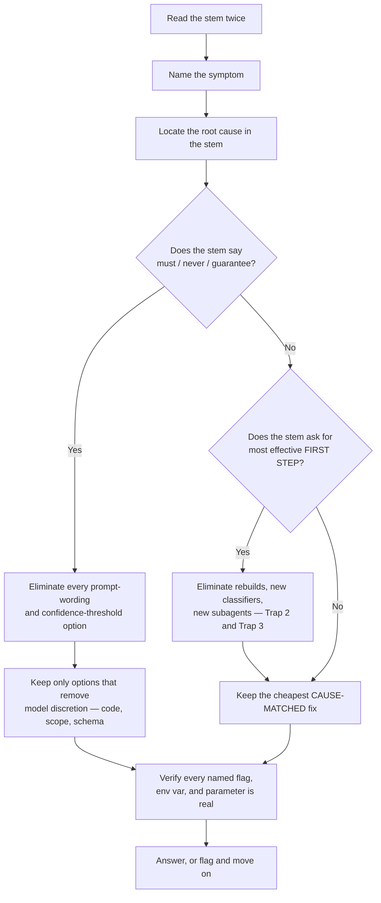
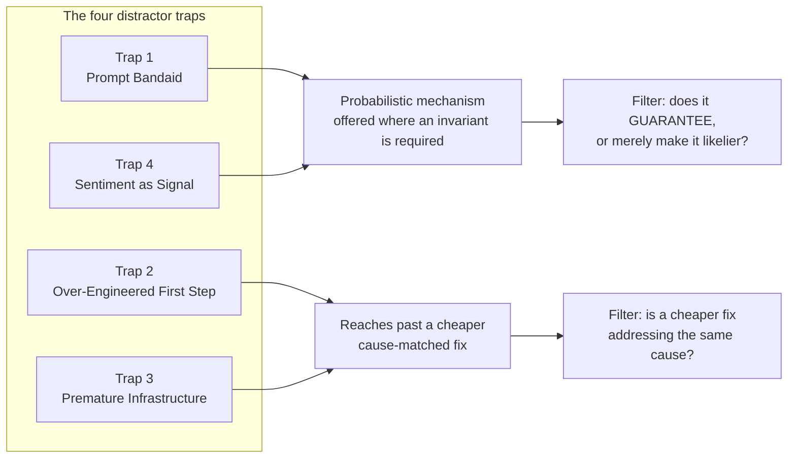
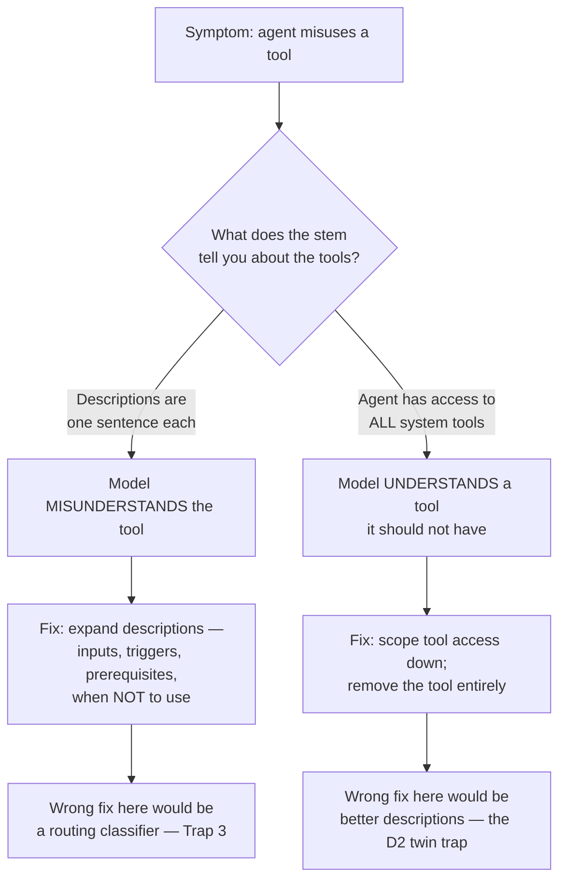

---
tags:
  - CCA-F
  - exam-strategy
  - exam-traps
  - practice-questions
  - distractors
  - youtube-course
date: 2026-08-24
status: done
source: "Peace Of Code — Claude Certified Architect Bonus Episode"
---

# 🎯 Bonus — Exam Questions Solved & Exam Traps

> [!NOTE] Exam Coverage
> **Cross-domain** — this episode spans all five domains and adds no new technical material. What it adds is *question mechanics*: the four distractor patterns the exam reuses, worked eliminations for all **12 official sample questions**, four new questions covering the two official scenarios the syllabus leaves untested, and an exam-day playbook. Treat it as the bridge between knowing the concepts and picking the right option under time pressure. The single highest-value idea here is the **guarantee-vs-probability filter**, which resolves a large share of two-plausible-options standoffs.

**Back to:** [[CCA-F Study Roadmap]] · **Domain notes:** [[D1 - Agentic Architecture & Orchestration]] · [[D2 - Tool Design & MCP Integration]] · [[D3 - Claude Code Configuration & Workflows]] · [[D4 - Prompt Engineering & Structured Output]] · [[D5 - Context Management & Reliability]] · **Deck:** [[Bonus - Flashcards]]
**Source:** [Peace Of Code — Bonus Episode (61 min)](https://www.youtube.com/watch?v=-NymqBcFy6E) · Level: college / professional-certification · Question mix calibrated MCQ-heavy (40 / 40 / 20)
**Previous:** [[EP20 - When AI Needs a Human]]

---

## 1. Outline

- [1. Outline](#1-outline)
- [2. Key Terms](#2-key-terms)
- [3. Concept Summaries](#3-concept-summaries)
  - [3.1 Why This Episode Is Different](#31-why-this-episode-is-different)
  - [3.2 Domain Weighting and Triage Order](#32-domain-weighting-and-triage-order)
  - [3.3 Trap 1 — The Prompt Bandaid](#33-trap-1--the-prompt-bandaid)
  - [3.4 Trap 2 — Over-Engineering a First-Step Question](#34-trap-2--over-engineering-a-first-step-question)
  - [3.5 Trap 3 — Premature Infrastructure](#35-trap-3--premature-infrastructure)
  - [3.6 Trap 4 — Sentiment as Signal](#36-trap-4--sentiment-as-signal)
  - [3.7 The One-Line Filter](#37-the-one-line-filter)
  - [3.8 Domain 1 — Prerequisite Gates and Decomposition](#38-domain-1--prerequisite-gates-and-decomposition)
  - [3.9 Domain 2 — Description Quality vs Tool Scope](#39-domain-2--description-quality-vs-tool-scope)
  - [3.10 Domain 3 — Placement, Mode, Rules, and the Headless Flag](#310-domain-3--placement-mode-rules-and-the-headless-flag)
  - [3.11 Domain 4 — Batch SLA and Multi-Pass Review](#311-domain-4--batch-sla-and-multi-pass-review)
  - [3.12 Domain 5 — Observable Criteria and Structured Errors](#312-domain-5--observable-criteria-and-structured-errors)
  - [3.13 The Gap Questions — Extraction and Codebase Navigation](#313-the-gap-questions--extraction-and-codebase-navigation)
  - [3.14 Parallel Spawning and the False-Positive Trust Spiral](#314-parallel-spawning-and-the-false-positive-trust-spiral)
  - [3.15 The Exam-Day Playbook](#315-the-exam-day-playbook)
- [4. Diagrams](#4-diagrams)
- [5. Worked Examples](#5-worked-examples)
- [6. Practice Questions](#6-practice-questions)
- [7. Cheat Sheet](#7-cheat-sheet)
- [✅ Practice Checklist](#-practice-checklist)

---

## 2. Key Terms

| Term | Definition | Source |
|------|-----------|--------|
| **Distractor** | A wrong answer option engineered to look right — usually by being *technically true but irrelevant*, or *correct for a different question*. The exam's difficulty lives here, not in the concepts. | [05:28] |
| **Prompt Bandaid** (Trap 1) | Offering a prompt improvement — stronger wording, a few-shot example, clearer instructions — when the scenario demands a **guarantee**. Prompts shift probability; they never enforce. | [05:51] |
| **Over-Engineered First Step** (Trap 2) | Offering the *complete* solution to a question that asks for the **most effective first step**. The right answer is the cheapest fix that addresses the root cause. | [07:12] |
| **Premature Infrastructure** (Trap 3) | Proposing a new classifier, router, microservice, or subagent before the cheap optimization — better tool descriptions, scoped tool access, a config change — has been tried. | [08:08] |
| **Sentiment as Signal** (Trap 4) | Using a model's self-reported confidence as a control-flow decision input. A model can be 100% confident and wrong. | [09:17] |
| **The one-line filter** | *"Does this guarantee the outcome, or just make it more likely?"* When the stem contains **must**, **never**, or **guarantee**, the guaranteeing option wins. | [10:09] |
| **Prerequisite gate** | A `PreToolUse` hook that blocks a tool call until a required prior state exists — the enforcement answer to an ordering guarantee. | [13:30] |
| **Tool scoping** | Removing a tool from an agent's available set entirely, so it cannot be called regardless of how the model reasons. Distinct from describing the tool better. | [22:02] |
| **Structured error context** | An error payload that distinguishes *transient failure* from *genuine empty result*, naming what was attempted and whether a retry is sensible — so a coordinator can decide. | [44:23] |
| **Observable escalation criteria** | Explicit, externally checkable escalation triggers (customer asks for a human; policy gap; no progress after N attempts) that replace a confidence threshold. | [39:45] |
| **Fabricated specific** | A confidently-named flag, env var, or parameter that does not exist — e.g. `CLAUDE_HEADLESS`, `--batch`. A recurring distractor shape. | [58:39] |
| **Scenario coverage map** | The exam's six named scenarios. The official sample questions exercise only four; scenarios 4 and 6 are untested by the samples. | [45:10] |

> [!TIP] Transcription artifacts in this episode
> The auto-captions mangle nearly every identifier. Read past these:
> - **"Cloud" / "Claw" / "claw. md" / "cloud. md"** → `CLAUDE.md` — pervasive throughout; also **"Cloud Certified Architect"** → *Claude* Certified Architect
> - **"the prompt banded"** [05:51] → the prompt **bandaid**
> - **"guest customer"** [13:30] → `get_customer`; **"look up order"** → `lookup_order`; **"process refund"** → `process_refund`
> - **"a new verify factor"** [19:27] and **"verify a fact"** → `verify_fact`
> - **"tool choice to any"** → `tool_choice: "any"`
> - **"the P flag or the print flag"** [30:03] → `-p` / `--print`
> - **"cloud headless equals to true"** [30:37] → `CLAUDE_HEADLESS=true`; **"hyphen hyphen batch"** → `--batch` (both are fabricated distractors — see §3.10)
> - **"Use at the rate import"** [27:17] → the `@` import syntax (`@path/to/file`)
> - **"YAML format or path fields"** [28:34] → YAML **frontmatter** with a `paths` field
> - **"claude dot claude {slash} rules"** → `.claude/rules/`
> - **"run the app to above authentication at runtime"** [50:42] → to **observe** authentication at runtime
> - **"increasing the breadth and increasing the um length"** [36:52] → breadth then **depth** (per-file pass, then cross-file pass)
> - **"Validation for fails on 4%"** [46:26] → validation **fails** on 4%
> - **"you shouldn't fake na ni over there"** [48:39] → Hinglish filler; the host means *don't bluff an answer you don't have*
> - `[snorts]`, **"escalates escalates"**, **"resolvable resolvable"**, **"valid valid verifying"** → caption noise and stutters, not distinct terms

---

## 3. Concept Summaries

### 3.1 Why This Episode Is Different

*Question: You have watched all twenty episodes and can define every term. Why is that still not enough?*

Because the exam never asks you to define anything. Every item is a scenario: a system misbehaving in a specific way, followed by four options that all reference real, correct Claude concepts. The failure mode for a well-prepared candidate is not ignorance — it is picking an option that is *true* but does not address the described symptom.

The host frames this as the gap between having "mugged up the concepts" and being able to relate them to a problem [02:43]. Concretely: in the Domain 2 synthesis question (§3.9), *"add more detailed tool descriptions"* is a genuinely good practice, sits squarely in Domain 2, and is the correct answer to a *different* question in the same episode. Here it is the distractor. Nothing about the option is false; it is simply aimed at a root cause the scenario has ruled out.

This is why the elimination discipline matters more than recall. You are not searching for a true statement. You are searching for the one option whose mechanism matches the failure the stem actually describes.

**In your own words:** The exam tests diagnosis, not definition. Four true statements are on offer; exactly one is the *cause-matched* fix.

*See PQ 1, 10.*

### 3.2 Domain Weighting and Triage Order

*Question: If revision time runs out, which domains do you protect?*

The weighting the host works from: **Domain 1 alone is 27%** — over a quarter of the score from agentic loops and subagents [03:38]. **Domain 2 is 18%** [04:20]. And **Domains 1, 3, and 4 together are 67%** of the exam [03:53]. That fixes the remainder by arithmetic: Domains 3 and 4 sum to $67\% - 27\% = 40\%$, and Domain 5 accounts for $100\% - 67\% - 18\% = 15\%$.

The triage order that follows is: multi-agent orchestration first, then Claude Code configuration and prompt engineering, then tool design, and context management last [04:20].

The host immediately argues against actually doing this [04:52] — and the arithmetic backs him up. If the passing bar is 720/1000, a perfect score on Domains 1, 3, and 4 with nothing from 2 and 5 yields 67%, which **fails**. Selective study is not a shortcut to a pass; it is a way to run out of margin. See [Worked Example 1](#5-worked-examples).

**In your own words:** D1 is 27%, the D1+D3+D4 trio is 67%, and that trio alone is mathematically insufficient to pass — the weighting tells you what to revise *first*, not what to skip.

> [!WARNING] Unverified — exam logistics, not technical fact
> The percentage weights, the 720/1000 passing score [59:01], the count of twelve official sample questions, and the six-scenario map are all **exam-administration details** taken from the lecture's reading of the official syllabus. They cannot be verified against Anthropic's technical documentation, which does not describe the certification's scoring. The D1 = 27% figure is at least internally consistent with the rest of this vault's episode notes. Confirm all of these against the official CCA-F exam guide before relying on them.

*See PQ 3, 15.*

### 3.3 Trap 1 — The Prompt Bandaid

*Question: The stem says a rule "must never be violated." Three options improve the prompt. What is the tell?*

Prompt instructions are **probabilistic**. They raise the likelihood of a behaviour; they cannot exclude its complement. So the moment a stem uses absolute language — *must*, *never*, *guarantee*, *always* — every option whose mechanism is "say it more clearly" is eliminated in one pass, regardless of how well-worded the proposed prompt is [06:26].

The host's shorthand is "the answer always revolves around a hook" [06:46]. That is the most common instance, but it is too narrow as a rule — and the narrowing will cost you a question.

> [!IMPORTANT] Sharpen the rule: guarantee → deterministic code, not specifically → hook
> The invariant is that enforcement must live in **code that runs regardless of what the model decides**. A `PreToolUse` hook is the most common form, but this same episode contains two guarantee-shaped questions whose answers are *not* hooks:
> - **Tool scoping** — remove the tool from the agent's set, so no reasoning path can reach it (§3.9)
> - **A nullable schema field plus a human-review route** — make the honest answer representable, so fabrication is not the only option (§3.13)
>
> A candidate who pattern-matches "guarantee → hook" gets both wrong. Ask instead: *which option removes the model's discretion?* Consistent with [[00 - START HERE]], which frames this as the **code/hook** answer — code first, hook as the usual shape.

**In your own words:** Absolute language kills every prompt-improvement option. The winner is whatever takes the decision away from the model — usually a hook, sometimes a scope or schema change.

*See PQ 2, 8, 16.*

### 3.4 Trap 2 — Over-Engineering a First-Step Question

*Question: The stem asks for the "most effective first step." Why is the most thorough option usually wrong?*

Because "first step" is a scoping constraint, not decoration. It asks for the **cheapest change that addresses the root cause** — not the most complete remediation [07:37]. An option proposing an architectural rebuild may genuinely fix the problem and still be wrong, because it fails the constraint the stem imposed.

The discriminator is cost-to-benefit at the margin: if a config change or a description rewrite addresses the same root cause, the rebuild is over-engineering. Note the subtlety — a cheap option that addresses the *wrong* cause is still wrong. Cheapness is a tie-breaker among cause-matched options, not a substitute for diagnosis.

**In your own words:** "Most effective first step" means cheapest cause-matched fix. Completeness is not the criterion, and cheap-but-off-target still loses.

*See PQ 4, 14.*

### 3.5 Trap 3 — Premature Infrastructure

*Question: An option offers a new routing classifier. What should you check before accepting it?*

Whether the existing implementation has been optimized at all [08:08]. New infrastructure — a routing layer, a classifier, a microservice, an extra subagent — is offered *before* the simpler fix: better tool descriptions, scoped tool access, a config change.

The host's diagnostic question is the useful one: if the agent cannot tell which tool to use, and the tool descriptions are one sentence each, what does a new subagent accomplish [08:31]? The new component inherits the same ambiguity. You have added a hop, not removed a cause.

This trap is the mirror of Trap 2 — both punish reaching past a cheap available fix — but the tell differs. Trap 2 is about *scope* ("first step"); Trap 3 is about *sequence* (optimize before you build).

**In your own words:** New components before existing optimization is a distractor. A router built on the same ambiguous descriptions routes just as badly.

*See PQ 5, 17.*

### 3.6 Trap 4 — Sentiment as Signal

*Question: Why can a confidence threshold never be the reliable fix?*

Because self-reported confidence is not calibrated against correctness. A model can report 99% confidence on a hallucinated answer [39:27]. Any control flow keyed to that number inherits its unreliability, so *every* variant of the option fails: raising the threshold, lowering it, averaging two independent scores, or waiting for a better model.

The host's line on averaging two scores — "jack of all trades, master of none" [39:06] — is a memorable dismissal but understates the reason. Averaging two miscalibrated signals does not produce a calibrated one; it produces a smoother miscalibrated one. The defect is categorical, not a matter of precision.

The replacement is always **observable criteria** — conditions checkable from outside the model. This vault's [[D5 - Context Management & Reliability]] §5.2 lists exactly these triggers, and explicitly warns against gating escalation on sentiment or self-reported confidence.

**In your own words:** Confidence is uncalibrated, so every threshold-tuning option fails together. Replace the signal, don't tune it.

*See PQ 6, 12.*

### 3.7 The One-Line Filter

*Question: Two options both look defensible. What single question breaks the tie?*

> *Does this guarantee the outcome, or just make it more likely?* [10:09]

When the stem contains **must**, **never**, or **guarantee**, the guaranteeing option wins — and it wins even when the probabilistic option is better-written, more detailed, or more idiomatic [10:34]. A fix that works "five out of ten times" is not a partial answer; it is a wrong answer to a question about invariants.

This filter is doing most of the work across the four traps. Traps 1 and 4 are both cases of a probabilistic mechanism (prompt wording, confidence score) offered where an invariant is required. Learn the filter and you get both traps for free.

**In your own words:** Absolute language in the stem promotes any option that removes model discretion, and demotes every option that merely improves odds.

*See PQ 2, 8.*

### 3.8 Domain 1 — Prerequisite Gates and Decomposition

*Question: Two official D1 questions, two different root causes. What separates them?*

**Official sample question 1** [11:57]. A support agent with `get_customer`, `lookup_order`, and `process_refund`; the system prompt says always verify identity before a refund; under load the agent occasionally calls `process_refund` before `get_customer` returns a verified ID. The stem asks for the most reliable way to **guarantee** the ordering.

Elimination: `tool_choice: "any"` forces *a* tool call every turn, which is not the problem — the agent is already calling tools, just in the wrong order [12:46]. A few-shot example and stronger system-prompt wording are both Trap 1. The answer is a **`PreToolUse` prerequisite gate in code** that blocks `process_refund` unless a verified `get_customer` result exists [13:30].

**Official sample question 7** [14:12]. A research coordinator decomposes "analyze the competitive landscape for EV batteries" into exactly three subagent tasks — chemistry, market share, pricing. The synthesized report omits regulatory policy and supply-chain risk, *even though the source documents the subagents pulled discuss both at length*.

That clause is the whole question. The information was retrieved; it was never *assigned*. So: a synthesis context limit would show as truncation or thin coverage of researched topics, not clean absence of unresearched ones [14:44]. Subagents messaging each other directly is an explicit anti-pattern — all inter-subagent communication routes through the coordinator [15:12], consistent with [[D1 - Agentic Architecture & Orchestration]]. Larger per-subagent token budgets change nothing if no subagent was ever asked [16:24]. The answer is that **the initial decomposition was too narrow, before any research began** [15:40].

> [!IMPORTANT] The timing discriminator
> Ask *when* in the pipeline the information was lost. Never assigned → decomposition defect, and no downstream fix (bigger context, multi-pass synthesis, peer messaging) can recover it. Assigned and retrieved but missing from the output → a synthesis or context defect. Q7's "the source documents discuss both at length" is the clause that places the failure upstream.

**In your own words:** Ordering guarantees are gates in code. Coverage gaps that predate retrieval are decomposition failures, and nothing downstream repairs them.

*See PQ 9, 16, 17.*

### 3.9 Domain 2 — Description Quality vs Tool Scope

*Question: Two D2 questions about tool misuse. Why do they have opposite answers?*

**Question A** [17:09]. A support agent with four MCP tools escalates cases it should resolve and sometimes refunds before verifying identity. *All four tool definitions use single-sentence descriptions.* Most effective first step? The stem hands you the root cause. Answer: **expand the tool descriptions** to include input formats, triggering conditions, prerequisites, and *when not to use this tool* boundaries [18:10]. The distractor is a tool-routing classifier — Trap 3, "plain over-engineering" [18:36].

**Question B** [19:27]. A synthesis agent whose only job is combining already-gathered findings **has access to all system tools** — `web_search`, document analysis, database lookup, `verify_fact`. It triggers fresh searches mid-synthesis and fact-checks claims that need no checking. Most effective fix?

Here *"add more detailed descriptions"* is the distractor [21:01], and this is the most instructive elimination in the episode. The model is **not confused about what `web_search` does** — it understands the tool perfectly and calls it for a plausible reason: mid-synthesis it decides a claim is worth re-verifying [21:42]. Better descriptions cannot fix correct understanding. Even explicit prompt guardrails only shift the odds. The answer is to **scope the synthesis agent's tool access down** to what synthesis needs, removing `web_search` and the rest [22:32].

> [!IMPORTANT] The discriminator that separates these two questions
> Ask: **does the model misunderstand the tool, or does it correctly understand a tool it should not have?**
> - Misunderstands → *describe* it better (input formats, triggers, prerequisites, when-not-to-use)
> - Understands correctly but shouldn't have it → *remove* it from the tool set
>
> Signal to watch for in the stem: an explicit statement about *what tools the agent has access to* points at scope. An explicit statement about *description quality* points at descriptions. The exam tells you which, if you read for it.

**In your own words:** Bad descriptions are a knowledge problem, fixed by describing. Wrong tool availability is an access problem, fixed by scoping — and no amount of description fixes access.

*See PQ 10, 18.*

### 3.10 Domain 3 — Placement, Mode, Rules, and the Headless Flag

*Question: Four D3 questions, four different config mechanisms. Which mechanism does each symptom point to?*

**Command distribution** [22:52]. A `/review-pr` command every developer gets on clone, with no per-person setup → **`.claude/commands/` at the project root**, because it ships with the repository. The home-directory option requires manually messaging every developer [24:12]. *Verified:* a file at `.claude/commands/deploy.md` creates `/deploy`; user-level lives at `~/.claude/commands/`.

**Plan mode** [24:42]. Migrating a 40,000-line monolith into three microservices with **no predefined service boundaries** → **plan mode**. Direct execution edits files as it goes; "direct execution but require permission" still edits, and stopping midway leaves you without knowing what plan produced the edits already made [26:07]. Three parallel subagents from the start is Trap 3. *Verified:* the official guidance is that planning "is most useful when you're uncertain about the approach, when the change modifies multiple files, or when you're unfamiliar with the code being modified" — all three conditions hold here.

**Official sample question 6 — path-scoped rules** [26:26]. One repo holds Terraform and a React front end; strict infra-security review rules should apply only under the Terraform path, separate testing conventions only under the test path, without cluttering `CLAUDE.md`. The "without cluttering `CLAUDE.md`" phrasing is bait — the question is about **enforcing rules conditionally**, not about tidying memory files [27:55]. Answer: **separate rule files in `.claude/rules/` with YAML frontmatter carrying a `paths` field**, so each rule set loads conditionally by file pattern [28:34].

**CI hang** [29:19]. Claude Code wired into GitHub Actions; the first CI run hangs until the job times out. Interactive Claude Code waits for a human response, and CI has no human → run non-interactively with the **`-p` / `--print`** flag [30:03]. Raising the job timeout changes nothing about a process waiting forever [31:00].

> [!IMPORTANT] Both CI distractors are fabricated — verified
> `CLAUDE_HEADLESS=true` and `--batch` **do not exist**. Neither appears in the environment-variable reference or the CLI reference. This is the *fabricated specific* pattern (§3.15) in its purest form: a plausible name, invented. The lecture is correct to dismiss both.
> Source: [CLI reference](https://code.claude.com/docs/en/cli-reference.md) · [Environment variables](https://code.claude.com/docs/en/env-vars.md) · checked 2026-08-24

> [!NOTE] `.claude/rules/` and the `paths` field — exact syntax verified
> Rules can be scoped to specific files using YAML frontmatter with the **`paths`** field — that exact key, not `globs` or `path`. The captions garble this to "YAML format or path fields" [28:34], so learn the spelling from here, not from the audio. The `@path/to/file` import syntax in `CLAUDE.md` is real but **unconditional** — imports expand at session launch, which is precisely why it cannot express "only when touching Terraform."
> Source: [Memory & rules](https://code.claude.com/docs/en/memory.md) · checked 2026-08-24 · consistent with [[D3 - Claude Code Configuration & Workflows]]

**In your own words:** Team-wide → project root. Ambiguous large refactor → plan mode. Conditional rules → `.claude/rules/` with `paths`. CI hang → `-p`. And a confidently-named flag you have never seen is probably invented.

*See PQ 5, 7, 11.*

### 3.11 Domain 4 — Batch SLA and Multi-Pass Review

*Question: Why is the batch API wrong for a pre-merge CI check even though it is cheaper and functionally identical?*

**Official sample question 11** [21:13 → 33:19]. A team wants all workloads on the Message Batches API for the 50% saving, *including a pre-merge CI check that currently blocks every pull request until review feedback returns*.

The batch API has **no latency guarantee**: results may arrive in minutes or take up to 24 hours [32:00]. A blocking gate on an unbounded-latency dependency is the architectural defect — the plan is wrong at the idea level, not fixable by a parameter. Hence the host's joke about the "higher priority flag": set it to Mount Everest and it still fails [33:29], because no such flag exists. Batch is right for overnight and non-blocking work; wrong wherever a human or a pipeline waits [32:51]. *Verified:* 50% cost reduction, results within 24 hours, consistent with [[D4 - Prompt Engineering & Structured Output]] §4.5.

**Multi-pass review** [33:42]. A code-review agent reviews a 14-file PR in one prompt, one pass. Some files get real feedback, others get skimmed, and cross-file issues — a renamed function breaking a caller elsewhere — are frequently missed.

Two mechanisms compound. Relevant signal is diluted by irrelevant context, so genuine findings get lost in bulk [34:28]. And once developers see false positives, they discount the whole report, including the true findings — the trust problem [35:13]. Reviewing twice and averaging inherits both defects [35:31]. "Be thorough" is Trap 1, and may simply produce more false positives [35:54]. Raising `max_tokens` adds volume to an output already too diluted [36:22]. The answer: **split into focused per-file passes, then a separate cross-file integration pass** that specifically checks cross-references [36:35] — breadth first, then depth.

**In your own words:** Batch trades latency for cost, so it cannot sit on a blocking path. One-pass review over many files dilutes signal and destroys trust; per-file passes plus a dedicated cross-file pass restores both.

*See PQ 6, 13.*

### 3.12 Domain 5 — Observable Criteria and Structured Errors

*Question: Both D5 questions describe a system that cannot tell two situations apart. What is the shared fix?*

**Confidence escalation** [37:45]. A support agent self-reports confidence and escalates below 70%. Easy cases escalate needlessly; genuinely complex billing disputes do not escalate and get resolved wrongly. Both failure directions at once is the tell that the *signal* is broken, not the threshold. Removing escalation entirely is unacceptable — an agent with no exit hallucinates a resolution [38:43]. Averaging a second score is Trap 4 again. Lowering the threshold moves the same broken signal [39:27].

The answer replaces the signal with **explicit observable criteria** [39:45]: the customer explicitly requests a human; the case falls into a known policy gap or exception; the agent cannot make progress after a defined number of attempts. Each is checkable without asking the model how it feels. This matches [[D5 - Context Management & Reliability]] §5.2 exactly, including its warning against sentiment-based gating.

**Empty result vs failure** [40:49]. A document-analysis subagent sometimes fails to retrieve a document and sometimes retrieves it fine but finds nothing relevant. Both return **the same empty result**, so the coordinator reports "no information found" when the real cause was a retryable network failure.

The host's library analogy [41:26] is worth keeping: a librarian saying "we don't have that book" is a valid, actionable answer. A librarian who *has* the book but cannot find it, and says the same sentence, has caused a loss. A librarian who says "it's here, I can't locate it, come back in half an hour" has preserved your ability to act.

Eliminations: assuming empty means nonexistent *is* the bug [43:04]. Terminating the whole research task on any failure is the opposite anti-pattern [43:35]. **Silent** retry three times is the sharpest distractor — retrying is reasonable, but returning an empty result afterwards leaves the coordinator exactly as blind as before [43:59]. The answer is **structured error context** distinguishing failure category (transient vs genuine empty), what was attempted, and whether a retry makes sense — so the coordinator can retry, try an alternative, or correctly report a real empty result [44:23].

> [!IMPORTANT] The shared shape of both D5 answers
> Both replace an **ambiguous signal** with a **discriminating one**. A confidence number conflates "easy" with "confidently wrong"; a bare empty result conflates "nothing exists" with "lookup failed." In each case the fix is not tuning the signal but making the distinction representable — the same principle behind the nullable field in §3.13.

**In your own words:** When a system cannot distinguish two situations, the answer is never a better threshold — it is a representation that tells them apart.

*See PQ 6, 12, 13, 18.*

### 3.13 The Gap Questions — Extraction and Codebase Navigation

*Question: The official samples cover four of six scenarios. What do the untested two look like?*

The syllabus names six scenarios: customer support, code generation, multi-agent research, developer productivity, CI/CD, and structured data extraction. The twelve official samples exercise only the first three and CI/CD — **scenarios 4 (developer productivity) and 6 (structured extraction) have no official sample question** [45:10]. The host's bonus questions fill exactly those gaps.

**Structured extraction** [45:59]. An extraction pipeline pulls vendor, amount, due date, and line items from scanned invoices using tool use with a strict JSON schema. Validation fails on 4%: the model returns syntactically valid JSON, but the due date is **fabricated** — a plausible date appearing nowhere in the source. The current fix is a retry loop.

Retries repair *structural* faults — malformed JSON, schema violations. This is not structural: the JSON is valid and the schema passes. There is simply no due date visible in the scan, and each retry re-fabricates [46:48]. Raising retries from three to ten only asks the model to hallucinate more times [48:00]. Lowering `max_tokens` does not make invention shorter or truer [47:19]. The answer: **make the field nullable so the model can return `null` instead of inventing a value, and route those documents to human review** [48:19].

The host's framing is the memorable one: in an interview, if you do not know, say "I don't know" [49:03]. A schema that cannot express *absent* forces fabrication — the model has no legal way to be honest.

**Codebase navigation** [49:28]. A developer asks Claude Code to find where user authentication happens in a 200,000-line legacy monorepo it has never seen. Claude starts calling `Read` on every `.py` file, one at a time, to build a mental model.

Reading the repo exhausts the context window before any useful work begins [50:02] — and the "read it all in one batch, more context is better" option fails for the same reason [50:57]. The `Edit`-and-instrument option is unrelated to the question asked [50:42]. One distractor states that **`Glob` searches file contents** — it does not. The answer: **`Grep` searches contents; `Glob` matches paths by pattern** [51:42], and together they narrow 200,000 lines to a handful of candidate files before a single `Read`.

> [!NOTE] Grep vs Glob — verified, and the distractor is the point
> Official descriptions: `Grep` "searches for patterns within file contents using ripgrep regex syntax"; `Glob` "finds files by name pattern matching." The lecture states this correctly. Note the *documented guidance* to narrow with `Grep`/`Glob` before `Read` is implied by context-efficiency best practice rather than stated as a rule — but the tool capabilities themselves, which is what the question actually tests, are explicit.
> Source: [Tools reference](https://code.claude.com/docs/en/tools-reference.md) · checked 2026-08-24 · consistent with [[EP09 - Claude Built-in Tools]]

**In your own words:** Retries fix syntax, never missing information — make absence representable and route it to a human. And search before you read: `Grep` for contents, `Glob` for paths.

*See PQ 11, 19.*

### 3.14 Parallel Spawning and the False-Positive Trust Spiral

*Question: A coordinator calls `Task`, waits, calls `Task` again, waits, calls a third time. What is wrong?*

**Parallel subagents** [52:38]. That implementation is **sequential, not parallel** — one full turn at a time. True parallel spawning means emitting **multiple `Task` tool calls within a single coordinator response**, not issuing them across separate turns [53:18]. Adding subagent tool names to the coordinator's allowed-tools list addresses nothing [53:40].

> [!NOTE] Vault-corroborated; official docs are silent on the mechanism
> [[D1 - Agentic Architecture & Orchestration]] states this directly — emit multiple `Task` calls in a single response, and do not route parallel calls across separate turns, because that is sequential. The Agent SDK docs confirm subagents "run concurrently by default" but do **not** explicitly document the single-response requirement. Video and vault agree; treat the single-response rule as the exam answer.
> Also note: the spawn tool was renamed **`Task` → `Agent`** in Claude Code v2.1.63, with `Task` remaining a valid alias and the **exam-safe answer**.
> Source: [Subagents](https://code.claude.com/docs/en/agent-sdk/subagents.md) · checked 2026-08-24

**False-positive trust spiral** [53:57]. A PR review agent flags too many false positives. The first fix was a prompt instruction — "only flag issues you are highly confident about, be conservative." The rate barely moved, and developers now ignore *all* the bot's comments, including genuinely useful security findings.

Three options are prompt-engineering variants: adding "strict" before "conservative," lowering temperature, disabling until a better model ships [54:43]. All are Trap 1, and the confidence framing is Trap 4 on top. The answer is **explicit categorical criteria** — specifying exactly which issue types to report versus skip — plus **temporarily disabling the specific high-false-positive category**, rather than lowering an overall threshold [55:40].

Note what makes this answer structurally different: it converts a vague magnitude ("be confident") into an enumerable set (these categories, not those). That is the same move as §3.12's observable criteria and §3.13's nullable field — replacing a fuzzy signal with a discrete, checkable one.

**In your own words:** Parallel means multiple `Task` calls in one response. And a broken-trust review bot is fixed by naming reportable categories and muting the noisy one, never by asking the model to be more careful.

*See PQ 17, 20.*

### 3.15 The Exam-Day Playbook

*Question: What procedure survives contact with a question you have never seen?*

The host's sequence [57:32]:

1. **Read the setup twice.** Identify constraints and distractors before looking at options.
2. **Trace symptom → root cause → fix, in that order.** The answer is usually identifiable from the stem before you read the options; the stem often names the root cause outright (the single-sentence descriptions in §3.9, the "has access to all system tools" clause, "no predefined service boundaries").
3. **Most effective first step ≠ most complete solution** (§3.4).
4. **Guarantee beats probability** whenever *must*, *never*, or *guarantee* appears (§3.7).
5. **Watch for fabricated-sounding specifics.** Confidently named flags, env vars, and parameters that do not exist are a recurring distractor shape [58:39] — `CLAUDE_HEADLESS`, `--batch`, and the batch "priority flag" are all verified inventions.
6. **Flag and move on.** Do not let one hard question consume the time that would have banked several easy ones [59:01].

On point 6 the host adds the scoring perspective: you need roughly 720, not 1000 [59:01] — so a handful of genuinely hard items can be surrendered without risk, provided you actually reach the rest of the paper. (See the caveat in §3.2 on this figure.)

**In your own words:** Read twice, diagnose before eliminating, prefer the cheap cause-matched fix, promote guarantees, distrust unfamiliar identifiers, and protect your time budget.

*See PQ 14, 15.*

---

## 4. Diagrams

*The elimination pipeline: diagnose from the stem, then let the stem's own wording — absolute language, or "first step" — decide which trap family to cut first.*

*The four traps collapse into two underlying filters — which is why learning the guarantee test disposes of Traps 1 and 4 together.*

*The Domain 2 discriminator. Both questions describe tool misuse; the stem's clause about descriptions versus access decides which fix is correct.*

---

## 5. Worked Examples

### Example 1 — Does studying only Domains 1, 3, and 4 pass the exam?

The host gives a triage order but warns against acting on it [04:52]. Quantify the warning, taking the lecture's own figures: Domains 1, 3, 4 total 67%, Domain 2 is 18%, Domain 1 alone is 27%.

**Step 1.** Establish the untaught remainder.
*(why: the triage plan abandons Domains 2 and 5, so their combined weight is the exposure.)*

$$w_{2} + w_{5} = 100\% - 67\% = 33\%$$

**Step 2.** Score the best case for the plan — perfect on the studied trio, zero on the rest.
*(why: an upper bound. If the ceiling fails, every realistic outcome fails.)*

$$S_{\max} = 1.00 \times 67\% + 0.00 \times 33\% = 67\%$$

**Step 3.** Compare against the pass mark of 720/1000 stated at [59:01].
*(why: 720 on a 1000-point scale is 72%.)*

$$67\% < 72\% \quad \Rightarrow \quad \text{fail}$$

**Step 4.** Find the minimum needed from the abandoned domains.
*(why: turns "study everything" into a concrete floor.)*

Let $x$ be the fraction earned across Domains 2 and 5:

$$67\% + 33x \geq 72\% \;\Longrightarrow\; x \geq \frac{5}{33} \approx 15.2\%$$

**Answer:** The triage plan **cannot pass even executed perfectly** — 67% falls 5 points short of 72%. Because perfection on the trio is unattainable in practice, the real requirement on Domains 2 and 5 is well above the 15.2% floor. The weighting is a guide to revision *order*, not a licence to skip: Domain 1 first because it is the largest single block at 27%, but every domain must be covered. *(Conditional on the 720 pass mark — see the §3.2 caveat.)*

### Example 2 — Costing the batch API on a blocking CI gate

Official sample question 11 says the plan is wrong in principle [32:18]. Price the trade to see how lopsided it is. Assume 20 PRs/day and a standard-API review cost of \$0.40 per PR.

**Step 1.** Compute the daily saving from the 50% batch discount.
*(why: the saving is the plan's entire motivation, so it sets the value of the upside.)*

$$\text{saving} = 20 \times \$0.40 \times 0.50 = \$4.00 \text{ per day}$$

**Step 2.** Bound the latency the gate inherits.
*(why: batch guarantees only that results arrive within the 24-hour window — the worst case is the design constraint, not the average.)*

$$t_{\text{block}} \in (0,\, 24]\ \text{hours per PR}$$

**Step 3.** Translate to engineering time lost.
*(why: converts an abstract SLA into the units the decision is actually made in.)*

At the SLA limit, a PR opened at 09:00 cannot merge until 09:00 the next day. Twenty PRs/day against a worst case of 24h means the merge queue can stall for a full working day.

**Step 4.** Compare the two sides.
*(why: makes the anti-pattern quantitative rather than a matter of taste.)*

$$\$4.00\ \text{per day} \quad \text{vs.} \quad \text{up to } 24\text{h of merge latency per PR}$$

**Answer:** \$4/day of savings against a potential full-day merge stall. The defect is structural, not a matter of tuning — there is no priority parameter, and the "higher priority flag" option is a fabricated specific [33:29]. **Batch suits overnight and non-blocking work; a pre-merge gate needs the standard API.** Note the trap: the stem's "50% cost savings" is true and tempting, and the plan is still wrong.

### Example 3 — Eliminating on the synthesis-agent question

The subtlest elimination in the episode [19:27], because the distractor is the correct answer to its twin question. Work it by the pipeline in §4.

**Step 1.** Name the symptom. *(why: symptom before cause, per the playbook.)*
A synthesis agent triggers fresh `web_search` calls mid-synthesis and calls `verify_fact` on claims needing no verification.

**Step 2.** Extract the root-cause clause from the stem. *(why: the stem usually states it outright.)*
"...whose only job is to combine already gathered findings ... **has access to all system tools**." The stem volunteers the tool *inventory*, not description quality.

**Step 3.** Test each option against that cause.
*(why: an option must match the named cause, not merely be good practice.)*

| Option | Verdict | Reason |
|---|---|---|
| Turn `verify_fact` into its own subagent spawned via `Task` | ✗ | Trap 3 — new component, cause untouched [20:26] |
| Set `tool_choice: "any"` | ✗ | Forces *more* tool calls; the problem is unwanted calls [20:43] |
| Add more detailed descriptions to the four tools | ✗ | The model already understands `web_search`; better description of a correctly-understood tool changes nothing [21:01] |
| Scope tool access down to only `verify_fact` | ✓ | Removes the capability, so no reasoning path reaches it [22:32] |

**Step 4.** Confirm with the guarantee filter. *(why: distinguishes a probabilistic fix from an enforced one.)*
Prompt guardrails would still permit occasional calls; removing the tool makes them impossible.

**Answer:** **Scope the synthesis agent's tool access down.** The general lesson: an option can be best practice, on-domain, and correct elsewhere in the same exam, and still be the distractor here. Match the mechanism to the *stated* cause.

---

## 6. Practice Questions

**1.** *(Recall)* Name the four distractor traps.

Answer

**(1) Prompt Bandaid** — a prompt improvement offered where a guarantee is required. **(2) Over-Engineered First Step** — the complete solution offered to a "most effective first step" question. **(3) Premature Infrastructure** — a new classifier, router, microservice, or subagent before the cheap optimization. **(4) Sentiment as Signal** — self-reported confidence used as a control-flow input.
*(§3.3–3.6 / Distractor)*

**2.** *(Recall)* State the one-line filter, and the three stem keywords that trigger it.

Answer

*"Does this guarantee the outcome, or just make it more likely?"* Triggered by **must**, **never**, or **guarantee** — when present, the guaranteeing option wins even if a probabilistic option is better written.
*(§3.7 / The one-line filter)*

**3.** *(Recall)* What share of the exam is Domain 1, and which three domains total 67%?

Answer

Domain 1 is **27%** — the largest single block. Domains **1, 3, and 4** together are **67%**. Domain 2 is 18%, leaving Domain 5 at roughly 15%. *(Exam-logistics figures from the lecture — see the §3.2 caveat.)*
*(§3.2 / Domain weighting)*

**4.** *(Recall)* What does "most effective first step" require, and what does it not?

Answer

It requires the **cheapest change that addresses the root cause**. It does *not* require the most complete or most thorough remediation — an architectural rebuild can genuinely fix the problem and still be wrong for failing the scoping constraint.
*(§3.4 / Over-Engineered First Step)*

**5.** *(Recall)* Which directory and which YAML frontmatter field scope a Claude Code rule set to a file pattern?

Answer

Rule files in **`.claude/rules/`** with a **`paths`** field in YAML frontmatter — that exact key, not `globs` or `path`. Each rule set then loads conditionally by file pattern.
*(§3.10 / path-scoped rules)*

**6.** *(Recall)* Give the two operational facts about the Message Batches API that decide sample question 11.

Answer

**50% cost reduction** versus the standard API, and **no latency guarantee** — results may take up to **24 hours**. The second fact disqualifies it from any blocking path.
*(§3.11 / Batch SLA)*

**7.** *(Recall)* What does `Grep` search, what does `Glob` match, and which flag runs Claude Code non-interactively in CI?

Answer

`Grep` searches **file contents** (ripgrep regex); `Glob` matches **file paths** by name pattern. CI uses **`-p`** (or `--print`) for non-interactive mode.
*(§3.13, §3.10 / built-in tools, headless flag)*

**8.** *(Comprehension)* A stem says a rule "must never be violated," and one option proposes a well-crafted few-shot example plus explicit system-prompt wording. Why is it eliminated without evaluating its quality?

Answer

Because prompt instructions are **probabilistic** — they raise the likelihood of a behaviour but cannot exclude its complement. "Never" demands an invariant, and no wording quality converts a probabilistic mechanism into an enforced one. The option's craft is irrelevant to the category error.
*(§3.3 / Prompt Bandaid)*

**9.** *(Comprehension)* In sample question 7, a synthesized report omits two topics whose source documents the subagents *did* pull. Why does that clause rule out every context-window and synthesis fix?

Answer

It places the failure **before retrieval**. The topics were never assigned during decomposition, so no subagent was tasked with them. A synthesis token limit would show as truncation or thin coverage of *researched* topics, not clean absence; larger per-subagent budgets cannot help an unasked question. Information never assigned cannot be recovered downstream.
*(§3.8 / decomposition)*

**10.** *(Comprehension)* One D2 question is answered by expanding tool descriptions; its twin is answered by scoping tool access. What single question separates them?

Answer

**Does the model misunderstand the tool, or correctly understand a tool it should not have?** Misunderstanding → describe better (inputs, triggers, prerequisites, when-not-to-use). Correct understanding plus wrong availability → remove the tool. Watch the stem: a clause about *description quality* points at descriptions; a clause about *what tools the agent has access to* points at scope.
*(§3.9 / Tool scoping)*

**11.** *(Comprehension)* An extraction model returns valid JSON that passes schema validation, but one field is fabricated. Why does raising the retry count from 3 to 10 not help?

Answer

Retries repair **structural** faults — malformed JSON, schema violations. Nothing structural is wrong here: the JSON is valid and the schema passes. The underlying cause is that the value is absent from the source, so each retry re-fabricates. More attempts buy more hallucinations, not a correct value.
*(§3.13 / structured extraction)*

**12.** *(Comprehension)* Why does adding a second independent confidence score and averaging the two fail?

Answer

Because self-reported confidence is **uncalibrated against correctness** — a model can report 99% on a hallucination. Averaging two miscalibrated signals yields a smoother miscalibrated signal, not a calibrated one. The defect is categorical, so every threshold variant fails together: raising, lowering, averaging, or awaiting a better model. Replace the signal with observable criteria.
*(§3.6, §3.12 / Sentiment as Signal)*

**13.** *(Comprehension)* A subagent silently retries a failed retrieval three times, then returns an empty result. Why is this still wrong?

Answer

Retrying is reasonable; **returning an empty result afterwards** is not. The coordinator still cannot distinguish "no information exists" from "retrieval failed," so it will report "no information found" for a transient network fault. The fix is **structured error context** naming the failure category, what was attempted, and whether a retry makes sense — so the coordinator can retry, try an alternative, or correctly report a real empty result.
*(§3.12 / structured error context)*

**14.** *(Comprehension)* Traps 2 and 3 both punish reaching past a cheap fix. How do their tells differ?

Answer

**Trap 2** is about **scope** — triggered by "most effective first step," where the *complete* solution violates the stem's constraint. **Trap 3** is about **sequence** — new infrastructure proposed before existing optimization was attempted, where the new component inherits the same unfixed cause (a router built on one-sentence descriptions routes just as badly).
*(§3.4, §3.5 / Trap 2 and Trap 3)*

**15.** *(Application)* A colleague plans to revise only Domains 1, 3, and 4 the night before, reasoning that 67% coverage is "comfortably above" what they need. Evaluate the plan.

Answer

The plan **cannot pass even under perfect execution**. Scoring 100% on the trio and 0% elsewhere yields exactly 67%, below the 720/1000 (72%) bar — a 5-point shortfall. Because perfection is unattainable, real coverage of Domains 2 and 5 must exceed the $5/33 \approx 15.2\%$ floor by a wide margin. The weighting prescribes revision *order* (Domain 1 first, at 27%), never omission.
*(§3.2, Worked Example 1 / Domain weighting)*

**16.** *(Application)* An agent must never write to the production database before a dry-run has succeeded. Under load it occasionally writes first. Options: (a) add a `PostToolUse` hook that logs violations, (b) add "ALWAYS dry-run first" to the system prompt in capitals, (c) a `PreToolUse` gate blocking the write until a successful dry-run is recorded, (d) lower temperature. Choose and justify.

Answer

**(c).** "Never" demands an invariant, so (b) and (d) are Prompt Bandaids — capitals and temperature shift probability only. (a) is the sharpest distractor: a `PostToolUse` hook fires *after* the write, so it detects violations without preventing them — it delivers an audit trail, not a guarantee. Only (c) removes the model's discretion before the irreversible action.
*(§3.3, §3.8 / prerequisite gate)*

**17.** *(Application)* A coordinator must research four independent subtopics. It calls `Task`, awaits the full result, calls `Task` again, and so on. A teammate proposes adding a routing classifier to decide subagent order. Diagnose both the implementation and the proposal.

Answer

The implementation is **sequential, not parallel** — one full turn per subagent. True parallel spawning emits **multiple `Task` calls within a single coordinator response**. The proposal is **Trap 3**: a classifier ordering sequential calls optimizes the wrong thing entirely, since the subtopics are independent and ordering is irrelevant. Fix the response shape, add nothing. (`Task` was renamed `Agent` in v2.1.63; `Task` remains the exam-safe answer.)
*(§3.14 / parallel spawning)*

**18.** *(Application)* A support agent resolves refund disputes but has `process_refund`, `issue_credit`, `escalate_to_human`, and `delete_account` available. It has twice called `delete_account` while "cleaning up" a closed dispute. The team proposes adding "never call `delete_account` unless explicitly asked" to the prompt. Assess, and give the correct fix.

Answer

The proposal is a **Prompt Bandaid** — the destructive action needs an invariant, not a probability shift. Applying the §3.9 discriminator: the agent is not confused about what `delete_account` does; it correctly understands a tool it should never have had. So the fix is **tool scoping** — remove `delete_account` from this agent's set entirely. If some flow genuinely needs it, gate it behind a `PreToolUse` prerequisite check as well.
*(§3.9, §3.3 / tool scoping)*

**19.** *(Application)* Claude Code is asked to locate the rate-limiting logic in an unfamiliar 500,000-line repo and begins `Read`-ing every `.go` file. One option says "use `Glob` to search for the keyword `ratelimit` across file contents." Diagnose the behaviour and the option.

Answer

The behaviour exhausts the context window before any analysis begins — and "read it all in one batch" fails identically. The option is **factually wrong about the tool**: `Glob` matches **paths** by name pattern, not contents. The correct approach is **`Grep`** for the keyword across contents, optionally with `Glob` to constrain paths, narrowing to a handful of files before the first `Read`.
*(§3.13 / Grep vs Glob)*

**20.** *(Comprehension)* A review bot's false positives have destroyed developer trust; "be conservative, only flag high-confidence issues" barely moved the rate. Why does the winning answer name *categories* rather than adjust a threshold?

Answer

Because "be conservative" is a **vague magnitude** the model cannot act on consistently — Trap 1 plus Trap 4. Naming **explicit categorical criteria** (which issue types to report versus skip) converts it into a discrete, checkable set, and **temporarily disabling the specific high-false-positive category** removes the noise source directly. This is the same move as replacing a confidence score with observable criteria and making an absent field nullable: replace a fuzzy signal with a discriminating one.
*(§3.14, §3.12 / false-positive trust spiral)*

---

## 7. Cheat Sheet

| Cue | Note |
|-----|------|
| **must / never / guarantee** | Kill prompt-wording and confidence options. Keep what removes discretion: **code**, **scope**, **schema**. |
| **"most effective first step"** | Cheapest **cause-matched** fix — not the most complete. Cheap-but-off-target still loses. |
| **New classifier / router / subagent** | Trap 3. Was the cheap optimization tried? |
| **Any confidence number** | Trap 4. Uncalibrated, so *all* threshold variants fail together. |
| **Descriptions are one sentence** | Misunderstands → expand descriptions (inputs, triggers, prerequisites, when-not-to-use). |
| **"has access to all system tools"** | Understands a tool it shouldn't have → **scope access down**. |
| **Topics missing that sources covered** | Decomposition defect, upstream of retrieval. Nothing downstream recovers it. |
| **Same result for two situations** | Make the distinction representable: structured error, or nullable field. |
| **Team-wide command** | `.claude/commands/` at project root; user-level `~/.claude/commands/`. |
| **Rules per file path** | `.claude/rules/` + frontmatter **`paths`**. `@` imports are unconditional. |
| **Large / ambiguous refactor** | Plan mode. Direct execution edits as it goes. |
| **CI hangs forever** | `-p` / `--print`. Raising the timeout changes nothing. |
| **Batch API** | 50% cheaper, up to **24h**, no SLA. Never on a blocking path. |
| **Valid JSON, invented value** | Retries fix syntax, not absence. Nullable + human review. |
| **Parallel subagents** | Multiple `Task` calls in **one response**. Across turns = sequential. |
| **Unfamiliar identifiers** | `Grep` = contents, `Glob` = paths. `CLAUDE_HEADLESS`, `--batch` **don't exist**. |

**Top 5 terms:** Prompt Bandaid · Premature Infrastructure · Sentiment as Signal · Structured error context · Tool scoping

> [!WARNING] Anti-patterns that are always wrong
> ❌ Stronger wording, capitals, or few-shot examples against a **must/never** requirement
> ❌ Any confidence threshold — raised, lowered, averaged, or awaiting a better model
> ❌ Subagents messaging each other instead of routing through the coordinator
> ❌ A bare empty result for both a genuine empty and a retrieval failure
> ❌ A blocking gate on the batch API
> ❌ Sequential `Task` calls presented as parallel execution
> ❌ Reading every file to model an unfamiliar repo
> ❌ Trusting a confidently-named flag you have never seen — verify it exists
> ✅ Diagnose the root cause from the stem *before* reading the options

> **Synthesis:** Every question reduces to one move — match the mechanism to the cause the stem states, and prefer the mechanism that **removes** the model's discretion over the one that improves its odds. The four traps are two filters wearing four hats: *guarantee vs probability* disposes of Traps 1 and 4; *is a cheaper cause-matched fix available* disposes of Traps 2 and 3. Note how often the winning answer swaps a fuzzy signal for a discriminating one — a gate not an instruction, observable triggers not a confidence score, structured errors not an empty result, a nullable field not a fabrication. The exam's thesis: **make the right thing structurally enforced and the honest answer representable**.

---

## ✅ Practice Checklist

- [ ] Name all four distractor traps and the stem signal that reveals each
- [ ] State the one-line filter verbatim and the three keywords that trigger it
- [ ] Explain why "guarantee → hook" is too narrow, with two non-hook counterexamples from this episode
- [ ] Give the discriminator between "expand tool descriptions" and "scope tool access"
- [ ] Explain why a coverage gap predating retrieval cannot be fixed downstream
- [ ] Recall the batch API's two decisive facts and why they bar a blocking CI gate
- [ ] Recall `.claude/commands/` vs `~/.claude/commands/`, and `.claude/rules/` with the `paths` field
- [ ] Recall `-p` / `--print`, and that `CLAUDE_HEADLESS` and `--batch` are fabricated
- [ ] State what `Grep` searches versus what `Glob` matches
- [ ] Explain why retries cannot fix a fabricated field, and what can
- [ ] Explain why parallel subagent spawning requires one response, not several turns
- [ ] Identify the shared shape of the D5 answers and the nullable-field answer
- [ ] Work Example 1 unaided and state why the 67% triage plan fails
- [ ] Run the §4 elimination pipeline on an unseen question without consulting the options first

---

*Next: [[CCA-F Study Roadmap]] — final review, then exam day. This is the last episode of the Peace Of Code course; the host mentions further bonus question walkthroughs may follow.*
