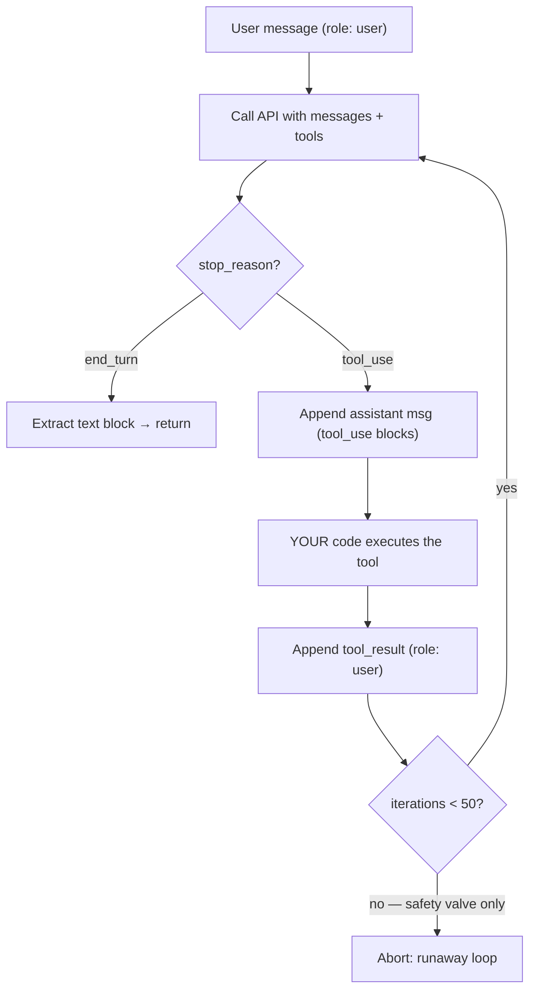
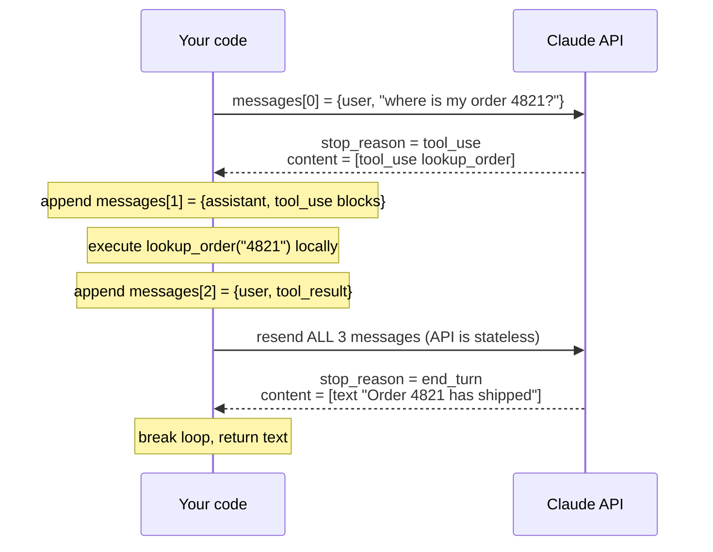
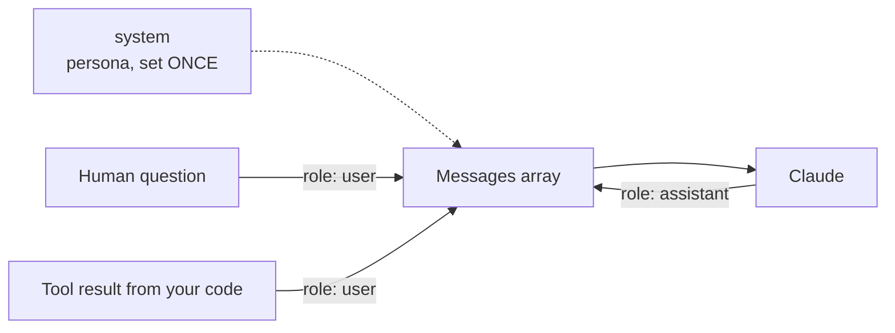

---
tags:
  - CCA-F
  - domain-1
  - agentic-architecture
  - youtube-course
date: 2026-08-02
status: done
domain: "1 of 5"
source: "Peace Of Code — Claude Certified Architect Full Course Ep 01"
---

# 🔁 EP01 — Agentic Loops & `stop_reason`

> [!NOTE] Exam Coverage
> Maps to **Domain 1 — Agentic Architecture & Orchestration**, subdomain 1.1 (the agent loop). Covers message roles, the request → `stop_reason` → tool-execution cycle, why the Claude API's statelessness forces you to resend full history, and the three loop-termination anti-patterns the exam tests directly.

**Back to:** [[CCA-F Study Roadmap]] · **Domain note:** [[D1 - Agentic Architecture & Orchestration]] · **Deck:** [[EP01 - Flashcards]]
**Source:** [Peace Of Code — Ep 01 (49 min)](https://www.youtube.com/watch?v=ldqOnljDINc) · Level: college / professional-certification · Question mix calibrated MCQ-heavy (40 / 40 / 20)

---

## 1. Outline

- [1. Outline](#1-outline)
- [2. Key Terms](#2-key-terms)
- [3. Concept Summaries](#3-concept-summaries)
  - [3.1 Environment Setup and the SDK](#31-environment-setup-and-the-sdk)
  - [3.2 The Three Message Roles](#32-the-three-message-roles)
  - [3.3 Chat vs Agent](#33-chat-vs-agent)
  - [3.4 The Loop Lifecycle and stop_reason](#34-the-loop-lifecycle-and-stop_reason)
  - [3.5 The Messages Array and Statelessness](#35-the-messages-array-and-statelessness)
  - [3.6 Code Walkthrough — the Order-Lookup Agent](#36-code-walkthrough--the-order-lookup-agent)
  - [3.7 The Three Anti-Patterns](#37-the-three-anti-patterns)
- [4. Diagrams](#4-diagrams)
- [5. Worked Examples](#5-worked-examples)
- [6. Practice Questions](#6-practice-questions)
- [7. Cheat Sheet](#7-cheat-sheet)

---

## 2. Key Terms

| Term | Definition | Source |
|---|---|---|
| **Agentic loop** | The repeating cycle in which Claude reasons, requests a tool, your code executes it, the result is appended to history, and Claude reasons again — until Claude signals it is finished. | [19:02] |
| **`stop_reason`** | The field on the API response that states *why* Claude stopped generating. It is the single authoritative signal for whether to continue or terminate the loop. | [22:38] |
| **`tool_use`** | `stop_reason` value meaning "Claude wants to act." The response contains one or more tool-use blocks; you must execute them and feed results back. | [23:04] |
| **`end_turn`** | `stop_reason` value meaning "Claude is finished." The response contains text blocks. **The only valid primary loop exit.** | [23:04] |
| **System role** | The "who you are" instruction — persona, constraints, sources. Set **once** at the start of a conversation, not per message. | [14:28] |
| **User role** | Role attached to anything sent *into* Claude from your side — the end user's question **and** tool results. | [11:47] |
| **Assistant role** | Role attached to anything coming *out of* Claude, including its tool-use blocks. | [14:06] |
| **Messages array** | The ordered list of role-tagged messages sent on every API call. It grows monotonically as the loop runs. | [27:16] |
| **Statelessness** | The Claude API remembers nothing between calls. Every request must carry the complete conversation history. | [28:11] |
| **Tool definition** | A tool's three required fields: `name` (what Claude calls it), `description` (how Claude decides *when* to use it), `input_schema` (JSON Schema for its parameters). | [29:33] |
| **`input_schema`** | JSON Schema describing a tool's parameters — `type`, `properties`, per-property `type` and `description`. | [32:05] |
| **Tool result** | The output your code produces after running a requested tool, appended back to the messages array **with the `user` role**. | [38:25] |
| **`tool_use_id`** | The identifier linking a tool result back to the specific tool-use block that requested it. Must match exactly. | [48:46] |
| **Iteration cap** | A maximum loop count (e.g. 50) used purely as a runaway-safety valve — **never** as the termination condition. | [34:07] |
| **Model-driven tool selection** | The model decides *which* tool to call and *when*; your code only executes and reports. Contrast with hard-coded if/else sequences. | [42:54] |
| **Anti-pattern** | A tempting-but-wrong implementation. This lesson names three, all about how you decide to stop the loop. | [44:34] |
| **`ANTHROPIC_API_KEY`** | Environment variable the SDK reads automatically. Exact name matters. | [07:13] |

---

## 3. Concept Summaries

### 3.1 Environment Setup and the SDK

*Question: What do you need in place before you can run a single line of this course's code?*

Three things: an account at `platform.claude.com` (formerly `console.anthropic.com`), a credit balance, and an API key exported as `ANTHROPIC_API_KEY`. The minimum top-up is **$5**, which the instructor considers sufficient for the whole course provided you use the cheapest model.

The key must live in the environment under that exact name — the SDK reads it automatically with no explicit argument. On macOS/Linux, put `export ANTHROPIC_API_KEY=...` in `~/.zshrc` or `~/.bashrc` and `source` it; on Windows, set it via PowerShell. A project-level `.env` file works on either platform.

Model naming follows a fixed pattern: `claude-haiku-4-5`, `claude-opus-4-5`. The course uses **Haiku 4.5** deliberately to keep costs down. One hard constraint: the Claude SDK only calls Anthropic models — models fronted by other providers (e.g. AWS Nova) are out of scope.

**In your own words:** Account + credits + a correctly named env var, and use Haiku so the $5 lasts.

*See PQ 1, 15.*

---

### 3.2 The Three Message Roles

*Question: Why does every message need a role, and who owns which one?*

A **role** defines what an entity does. The lecture's analogy: a student and a teacher have different roles, and roles are transferable — hand the teacher's role to the student and the student now teaches. Roles are labels on behaviour, not on people.

In the API there are exactly three. The **system** role is the persona instruction — "you are a top-class social media marketer, gather information from these sources." You set it **once**, at the start. The **user** role belongs to whoever is asking. The **assistant** role belongs to Claude's replies.

The critical distinction is GUI vs SDK. In claude.ai or ChatGPT you never type a role — the interface tags your message as `user` silently. Through the SDK there is no interface to do it for you, so **you** must attach the role explicitly on every message.

> [!IMPORTANT] The non-obvious rule
> **Tool results are tagged `user`, not `assistant`.** The role tracks *direction of travel*, not authorship: anything flowing **into** Claude is `user`, anything flowing **out of** Claude is `assistant`. A tool result is data your code is sending in, so it is a `user` message — even though no human typed it.

**In your own words:** Into Claude = `user`. Out of Claude = `assistant`. Persona = `system`, set once.

*See PQ 2, 6, 11, 16.*

---

### 3.3 Chat vs Agent

*Question: What structurally separates a chatbot from an agent?*

A standard chat interface is one round trip: user sends a message, Claude responds, done. An agent inserts a **loop** between those two events. The user sends a message; Claude reasons and decides to act; a tool executes; Claude receives the result and reasons *again*; and only then does it either finish or go around once more.

The lecture's framing: **the LLM is the brain of the agent, and tools are its hands.** The brain decides which hand to use and when. Given "book me a flight from India to Australia," a travel agent's LLM recognises it needs the flight-booking tool, that tool runs, and the result comes back for evaluation.

If the result satisfies the request, the agent reaches a finish state. If it does not — say the tool reports ambiguous dates — the agent asks the user for clarification and the cycle restarts. An agent therefore **acts, observes, and decides autonomously**, whereas a chatbot only responds.

**In your own words:** Chat = one round trip. Agent = reason → act → observe → reason, repeating until done.

*See PQ 3, 7, 12.*

---

### 3.4 The Loop Lifecycle and `stop_reason`

*Question: Mechanically, what makes the loop go around one more time or stop?*

Every iteration is the same four beats: **call the API** with the messages array plus available tools → **read `stop_reason`** → **branch** → repeat.

`stop_reason` is exactly what its name says: the reason Claude stopped generating. The lecture treats it as a two-valued branch. `tool_use` means Claude wants to act — the response carries tool-use blocks, you execute them, append the results, and loop. `end_turn` means Claude is done — the response carries text blocks, you break out and return the text.

Walk the order-lookup case both ways. Happy path: the query arrives, Claude returns `tool_use`, your code runs the lookup, the result "order 4821 shipped" is appended, Claude sees a satisfying answer and returns `end_turn` with the final text. Unhappy path: the tool fails to find the order, that failure is appended honestly, and Claude returns `tool_use` again — possibly after asking the user for more input. The loop keeps turning until the tool output actually satisfies the request.

> [!WARNING] Where the lecture is incomplete — verified against official docs
> The instructor states `stop_reason` "is of two types only." True *for this lesson's scenario*, but the Messages API defines **seven**:
>
> | Value | Meaning | Loop action |
> |---|---|---|
> | `end_turn` | Finished naturally | **Exit** |
> | `tool_use` | Wants to call a tool | **Execute + continue** |
> | `pause_turn` | Server-tool loop hit its iteration limit (default 10) | **Re-send as-is + continue** |
> | `max_tokens` | Hit your `max_tokens` cap | Truncated — raise cap or continue |
> | `stop_sequence` | Emitted a custom stop sequence | Terminate |
> | `refusal` | Declined on safety policy | Read `stop_details`; retry/fallback |
> | `model_context_window_exceeded` | Filled the model's context window | Truncated — restructure conversation |
>
> **Three values drive loop control flow, not two** — `pause_turn` continues the loop and appears whenever *server-side* tools (web search, code execution) are in play. Re-send the response as-is; do **not** append a "Continue." user message. The demo agent uses only client-side tools, so it never sees it. Source: [Handling stop reasons](https://platform.claude.com/docs/en/api/handling-stop-reasons) · see also [[D1 - Agentic Architecture & Orchestration]] §1.1. **(expansion — not from the transcript)**

> [!TIP] Transcription artifact
> The speaker repeatedly says "**enter**" where the field value is `end_turn`. Mentally substitute `end_turn` throughout the video.

**In your own words:** One API call per iteration; `stop_reason` alone decides continue-vs-stop; `end_turn` is the exit.

*See PQ 4, 5, 8, 13, 17.*

---

### 3.5 The Messages Array and Statelessness

*Question: Why does the messages array keep growing, and what breaks if it doesn't?*

The Claude API is **100% stateless**. Tell it "my name is Akash" and it will acknowledge; call it again and it has no idea who you are. There is no server-side session storing your conversation.

The consequence is structural: **every** request must include the entire conversation history from the start. Nothing is implied, nothing is remembered. This is why the messages array grows on every iteration rather than being replaced — each turn appends the assistant's tool-use blocks and then the corresponding tool results, so the next call carries the complete record of what has happened.

This also explains the append ordering. Within a turn you append the **assistant** message first (it contains the tool-use blocks Claude produced), then the **user** message carrying the tool results. That ordering mirrors the actual sequence of events, and Claude reads it as a coherent narrative. The very first message in the array is always `user` — the original question.

**In your own words:** No server memory, so the array is the memory; append assistant-then-user, every turn, forever.

*See PQ 9, 10, 14, 18.*

---

### 3.6 Code Walkthrough — the Order-Lookup Agent

*Question: What does a minimal agentic loop actually look like in Python?*

The demo agent answers "where is my order 4821?" against hard-coded mock orders. Its single tool, `lookup_order`, carries the three required fields — `name`, a `description` telling Claude to use it "when the customer asks where their order is or when it will arrive," and an `input_schema` declaring one string property, `order_id`.

The loop lives in `run_agent(query)`. It seeds `messages` with a single `user` message, then iterates up to **50** times as a safety valve. Each pass calls `client.messages.create(...)` with the model (`claude-haiku-4-5`), `max_tokens=4096`, the tool metadata, and the current messages. It then inspects `response.stop_reason`.

If `end_turn`, it walks the content blocks, returns the text from the first `text` block, and exits — the lecture notes an `end_turn` with no text block is rare but possible, hence the empty-string fallback. If `tool_use`, it appends the assistant message (`content=response.content`, which holds the tool-use blocks), executes each requested tool through `execute_tool`, collects the outputs into a tool-results array, and appends that array as a `user` message.

> [!IMPORTANT] Claude never executes anything
> Claude only *requests* a tool call. Your code runs the function and returns the result. In this demo `execute_tool` reads a dict of mock orders; in production it would query a database. The model chooses; your runtime executes.

> [!IMPORTANT] Parallel tool use — the rule the demo doesn't reach
> One assistant message may contain **multiple** `tool_use` blocks (parallel tool use is on by default). Execute them concurrently, then return **all** `tool_result` blocks in a **single** user message — splitting them across separate messages silently trains Claude to stop making parallel calls. If a tool fails, return its `tool_result` with `is_error: true` rather than dropping it; omitting a result for any `tool_use` id makes the follow-up request invalid. The demo's one-tool loop never exercises this, but the exam does. **(expansion — verified against official tool-use docs)**

The live run prints: *"Calling tool: lookup_order"* → *"Final answer: your order 4821 has been shipped."* One `tool_use` turn, one `end_turn` turn, done.

**In your own words:** Seed with `user`, loop on `stop_reason`, append assistant-then-user, cap iterations as a fuse.

*See PQ 10, 14, 16, 18.*

---

### 3.7 The Three Anti-Patterns

*Question: What are the three wrong ways to end an agentic loop, and why does each fail?*

All three share one root error: **substituting something else for `stop_reason`.**

**1 — Parsing natural language.** Scanning Claude's text for "I have completed" or "done" and breaking on a match. It fails because Claude's wording varies between calls, and because on a `tool_use` turn there may be **no text block at all** — indexing into one raises a fatal `IndexError` and crashes the agent.

**2 — Iteration caps as the primary exit.** Treating "50 iterations reached" as the definition of finished. The cap is a *backup* against runaway loops, nothing more. Ending on the cap means ending mid-task, with no signal that the work was actually completed.

**3 — Content-type checking.** Branching on whether the content is text, boolean, or JSON, and treating that as a completion indicator. Content type and `stop_reason` **measure entirely different things** — the shape of a payload says nothing about whether Claude considers the task finished.

The same principle rules out the hard-coded variant the exam likes to test: an if/else chain or regex that dictates a rigid fixed sequence of tool calls. That is preconfigured, not agentic. **The model must drive tool selection.**

> [!WARNING] Anti-Pattern Summary (exam trap)
> ❌ Parsing Claude's words to detect completion
> ❌ Using an iteration cap as the primary stop condition
> ❌ Inspecting content types instead of `stop_reason`
> ❌ Hard-coding a fixed tool sequence with if/else
> ✅ Branch on `stop_reason` — `end_turn` exits, `tool_use` continues

**In your own words:** Three flavours of the same mistake — trusting anything other than `stop_reason`.

*See PQ 5, 8, 12, 13, 17.*

---

## 4. Diagrams

### 4.1 The agentic loop



*The only green exit is `end_turn`. The iteration check is a fuse, not a door — reaching it means something went wrong.*

### 4.2 How the messages array grows



*Every arrow to the right resends the full array. Nothing is stored server-side.*

### 4.3 Role assignment by direction of travel



*A tool result is a `user` message. Role follows direction, not authorship.*

---

## 5. Worked Examples

### Example 1 — Trace the messages array through a two-turn loop

**Problem:** A user asks "Where is my order 4821?". The tool finds the order on the first attempt. Write out the messages array after every append, and give the `stop_reason` at each API call.

1. **Seed the array.** `messages = [{role: "user", content: "Where is my order 4821?"}]`
   *(The loop always begins with a `user` message — nothing else has happened yet. Length = 1.)*
2. **API call #1.** Send `messages` + tool metadata + `model="claude-haiku-4-5"`.
   *(Tools must be sent every call; Claude cannot see functions in your file.)*
3. **Read `stop_reason` → `tool_use`.** Claude's brain matched the query against `lookup_order`'s description.
   *(Branch: do NOT exit. Content holds tool-use blocks, likely no text block.)*
4. **Append the assistant message.** `{role: "assistant", content: response.content}` → length = 2.
   *(Assistant first. This preserves Claude's own request in the history it will re-read next call.)*
5. **Execute locally.** `execute_tool("lookup_order", {"order_id": "4821"})` → `{"status": "shipped", ...}`.
   *(Claude requested; your runtime performs. This step never happens inside the API.)*
6. **Append the tool result.** `{role: "user", content: [tool_result blocks]}` → length = 3.
   *(`user`, because this data is travelling *into* Claude. Each block carries the matching `tool_use_id`.)*
7. **API call #2.** Resend **all three** messages.
   *(Statelessness — omit any one and Claude loses the thread.)*
8. **Read `stop_reason` → `end_turn`.** Content holds a text block.
   *(The tool output satisfied the request, so Claude has nothing left to do.)*
9. **Extract and return** the text; break the loop.

**Answer:** Two API calls, final array length 3 (`user` → `assistant` → `user`), `stop_reason` sequence `tool_use` → `end_turn`. Iterations used: 2 of the 50 available.

---

### Example 2 — Predict the loop for an ambiguous request

**Problem:** The user asks "Where's my order?" with no order ID. `lookup_order` requires `order_id`. Predict the `stop_reason` sequence and the final array length, assuming the user supplies "4821" when prompted.

1. **Call #1 → `end_turn`.** Claude has no `order_id` to fill the schema, so it cannot form a valid tool call; it replies asking for the number.
   *(Note the counter-intuitive result: `end_turn` does **not** mean "task complete," it means "Claude has nothing further to emit this turn." The loop exits and control returns to the user.)*
2. **User supplies "4821."** A new `user` message is appended to the *same* array — history is preserved across the human turn.
   *(Because the API is stateless, the array is the only place that history exists.)*
3. **Call #2 → `tool_use`.** The schema can now be satisfied.
4. **Append assistant, execute, append tool result** — the standard three-step turn.
5. **Call #3 → `end_turn`** with the final text.

**Answer:** `end_turn` → (human turn) → `tool_use` → `end_turn`. Array length 5: `user`, `assistant`, `user`, `assistant`, `user`… plus the final assistant text if you choose to store it.

> [!IMPORTANT] Exam-relevant subtlety
> `end_turn` means **"Claude has finished this turn,"** not **"the task succeeded."** Clarification requests also end with `end_turn`. Never infer success from the stop reason alone. **(expansion)**

---

### Example 3 — Diagnose and fix an anti-pattern

**Problem:** An engineer writes the loop below. Name the anti-patterns and give the corrected control flow.

```python
for i in range(50):
    response = client.messages.create(...)
    if "completed" in response.content[0].text.lower():   # (a)
        break
    if isinstance(response.content[0], TextBlock):         # (b)
        break
# (c) falls out of the for-loop and returns
```

1. **Line (a) — parsing natural language.** Two failures at once. Claude's phrasing varies run to run, so the substring may never appear. Worse, on a `tool_use` turn `response.content[0]` is a tool-use block with **no `.text` attribute** — a fatal crash, not a missed match.
   *(The lecture calls out exactly this "fatal index error" scenario.)*
2. **Line (b) — content-type checking.** Content type describes payload shape; `stop_reason` describes intent. They measure entirely different things, so one can never stand in for the other.
   *(A turn can carry a text block *and* still be `tool_use` — Claude often narrates before acting.)*
3. **Line (c) — iteration cap as primary exit.** Falling out of `range(50)` returns whatever state exists, with no evidence the work finished.
   *(The cap should raise or log a runaway condition, not silently succeed.)*
4. **The fix:** branch on `stop_reason` and nothing else.

```python
for i in range(50):                       # safety valve only
    response = client.messages.create(...)
    if response.stop_reason == "end_turn":
        return extract_text(response)      # the ONLY valid exit
    if response.stop_reason == "tool_use":
        messages.append({"role": "assistant", "content": response.content})
        results = [execute_tool(b) for b in response.content if b.type == "tool_use"]
        messages.append({"role": "user", "content": results})
raise RuntimeError("Iteration cap hit — runaway loop")   # not a success path
```

**Answer:** All three anti-patterns are present. Correct control flow reads `response.stop_reason`; `end_turn` returns, `tool_use` appends assistant-then-user and continues, and exhausting the cap raises rather than returns.

---

## 6. Practice Questions

1. What is the exact environment-variable name the Claude SDK reads for authentication, and what is the minimum credit top-up the lecture recommends? *(§3.1 / Term: `ANTHROPIC_API_KEY`)*

   <details><summary>Answer</summary>
   `ANTHROPIC_API_KEY`, read automatically with no explicit argument. Minimum top-up: <strong>$5</strong>, which the instructor considers enough for the full course when using Haiku.
   </details>

2. Name the three message roles and state which one is set only once per conversation. *(§3.2 / Term: system role)*

   <details><summary>Answer</summary>
   <code>system</code>, <code>user</code>, <code>assistant</code>. The <strong>system</strong> role is set once at the start — it defines the persona ("you are a top-class social media marketer").
   </details>

3. True or False: in a standard chat interface, Claude executes tools between the user's message and its reply. *(§3.3 / Concept: chat vs agent)*

   <details><summary>Answer</summary>
   <strong>False.</strong> Standard chat is a single round trip — message in, response out. The tool-execution cycle is what an <em>agent</em> adds.
   </details>

4. List the two `stop_reason` values that participate in agentic-loop control flow, and state what each instructs you to do. *(§3.4 / Terms: `tool_use`, `end_turn`)*

   <details><summary>Answer</summary>
   <code>tool_use</code> — Claude wants to act; execute the requested tools, append results, continue the loop. <code>end_turn</code> — Claude has finished this turn; extract the text blocks and break. <code>end_turn</code> is the only valid primary exit.
   </details>

5. Which of the following is a valid primary loop-termination condition? *(§3.7 / Concept: anti-patterns)*
   (a) `response.content[0].text` contains "done"  (b) iteration counter reaches its cap  (c) `stop_reason == "end_turn"`  (d) the content block type is `text`

   <details><summary>Answer</summary>
   <strong>(c).</strong> (a) is natural-language parsing, (b) is the iteration-cap anti-pattern, (d) is content-type checking — all three are the anti-patterns named in the lesson.
   </details>

6. When you append a tool result to the messages array, which role do you use — and why is that counter-intuitive? *(§3.2 / Term: tool result)*

   <details><summary>Answer</summary>
   <code>user</code>. Counter-intuitive because no human wrote it — but role tracks <em>direction of travel</em>, not authorship. Data flowing <strong>into</strong> Claude is <code>user</code>; data flowing <strong>out</strong> is <code>assistant</code>.
   </details>

7. Explain the lecture's brain/hands analogy and what it implies about who selects a tool. *(§3.3 / Concept: model-driven selection)*

   <details><summary>Answer</summary>
   The LLM is the agent's brain; tools are its hands. The brain decides which hand to use and when — so <strong>the model drives tool selection</strong>, and your code only executes what it requests. Hard-coding the sequence in if/else makes the system preconfigured rather than agentic.
   </details>

8. Why is parsing Claude's text for a completion phrase not merely unreliable but actively crash-prone? *(§3.7 / Anti-pattern 1)*

   <details><summary>Answer</summary>
   Two reasons. Claude's wording varies between calls, so the phrase may never match. More severely, on a <code>tool_use</code> turn there may be <strong>no text block at all</strong>, so indexing into <code>content[0].text</code> raises a fatal index/attribute error and crashes the agent.
   </details>

9. The Claude API is described as "100% stateless." Explain the concrete consequence for every request you send. *(§3.5 / Term: statelessness)*

   <details><summary>Answer</summary>
   Nothing is stored server-side between calls — tell it your name and the next call has forgotten. So every request must carry the <strong>entire conversation history</strong> from the first message onward. The messages array <em>is</em> the memory.
   </details>

10. Within a single tool-use turn, in what order do you append the two messages, and what does each contain? *(§3.5, §3.6 / Concept: append order)*

    <details><summary>Answer</summary>
    <strong>Assistant first, then user.</strong> The assistant message carries <code>response.content</code> (Claude's tool-use blocks); the user message carries the tool results your code produced. The very first message in the array overall is always <code>user</code>.
    </details>

11. Compare how roles are assigned in claude.ai versus through the SDK. *(§3.2 / Concept: GUI vs SDK)*

    <details><summary>Answer</summary>
    In a GUI the interface tags your message <code>user</code> silently — you never think about roles. Through the SDK there is no interface doing that for you, so you must attach the role explicitly on every message you construct.
    </details>

12. An engineer builds an agent as a fixed sequence: always call `search`, then `filter`, then `format`, gated by if/else on the response text. Which principle from this lesson does this violate? *(§3.7 / Concept: preconfigured vs agentic)*

    <details><summary>Answer</summary>
    Model-driven tool selection. A rigid preconfigured sequence is not agentic — the model must choose which tool to call and when, signalled through <code>stop_reason: tool_use</code>. Regex/if-else gating on response text is the natural-language-parsing anti-pattern.
    </details>

13. Describe the relationship between the iteration cap and `stop_reason`. What role should each play? *(§3.4, §3.7 / Term: iteration cap)*

    <details><summary>Answer</summary>
    <code>stop_reason</code> is the primary control: <code>end_turn</code> exits, <code>tool_use</code> continues. The iteration cap (50 in the demo) is a <strong>backup safety valve</strong> against a runaway loop. Hitting the cap is an error condition, not a success path.
    </details>

14. Given the order-lookup demo where the tool succeeds on the first attempt, how many API calls occur and what is the final messages-array length? *(§3.6 / Worked Example 1)*

    <details><summary>Answer</summary>
    <strong>Two API calls.</strong> Final array length <strong>3</strong>: <code>user</code> (question) → <code>assistant</code> (tool-use blocks) → <code>user</code> (tool result). <code>stop_reason</code> sequence: <code>tool_use</code> → <code>end_turn</code>.
    </details>

15. What are the three required fields of a tool definition, and which one determines *when* Claude reaches for that tool? *(§3.6 / Term: tool definition)*

    <details><summary>Answer</summary>
    <code>name</code>, <code>description</code>, <code>input_schema</code>. The <strong><code>description</code></strong> is what Claude reads to decide when the tool applies — e.g. "use this when the customer asks where their order is."
    </details>

16. You inherit an agent that appends tool results with `role: "assistant"`. Predict what goes wrong and give the fix. *(§3.2 / Application)*

    <details><summary>Answer</summary>
    Claude reads the history as if it had itself produced the tool output rather than receiving it, corrupting the request/response pairing and likely breaking <code>tool_use_id</code> matching — so it may re-request the same tool or hallucinate around the malformed turn. Fix: tool results are appended with <code>role: "user"</code>.
    </details>

17. Your agent hits its 50-iteration cap on a simple query that should resolve in two turns. Give two plausible causes grounded in this lesson. *(§3.4, §3.7 / Application)*

    <details><summary>Answer</summary>
    (1) The tool keeps returning an unsatisfying result — e.g. the order isn't found — so Claude keeps returning <code>tool_use</code> and never reaches <code>end_turn</code>. (2) Tool results are not being appended back to the messages array (or are appended with the wrong role), so Claude never sees the output and re-requests the same tool indefinitely.
    </details>

18. Design a minimal test that distinguishes a correctly-implemented loop from one that relies on an iteration cap to terminate. *(§3.7 / Application)*

    <details><summary>Answer</summary>
    Run a query answerable in one tool call and assert on the <strong>iteration count at exit</strong>, not just the output. A correct loop exits at iteration 2 with <code>stop_reason == "end_turn"</code>; a cap-reliant loop runs all 50. Strengthen it by setting the cap to a large number — a correct loop's runtime is unchanged, a cap-reliant one's is not. Additionally assert the loop exits via the <code>end_turn</code> branch rather than by falling out of the <code>for</code>.
    </details>

---

## 7. Cheat Sheet

| Cue | Note |
|---|---|
| `stop_reason` | The **only** valid loop control signal. Read it, branch on it, trust nothing else. |
| `end_turn` | Claude finished this turn → extract text blocks, break. Only valid primary exit. |
| `tool_use` | Claude wants to act → execute tools, append results, loop again. |
| Append order | **Assistant first, then user.** Assistant = tool-use blocks; user = tool results. |
| First message | Always `user`. |
| Tool result role | `user` — direction of travel, not authorship. |
| System role | Persona. Set **once** at conversation start. |
| Statelessness | API is 100% stateless → resend the **full** history every call. |
| Tool definition | `name` + `description` + `input_schema`. Description drives *when*. |
| Who executes | **You do.** Claude only *requests* a tool call. |
| `tool_use_id` | Must match exactly between the request block and the result block. |
| Iteration cap | Safety valve only (demo: 50). Never the termination condition. |
| Model-driven | The model picks the tool. Fixed if/else sequences are not agentic. |
| Model naming | `claude-haiku-4-5`, `claude-opus-4-5`. Env var: `ANTHROPIC_API_KEY`. |

**Top 5 terms:** `stop_reason` · `end_turn` · `tool_use` · messages array · statelessness.

> [!WARNING] The three anti-patterns — memorise verbatim
> ❌ **1. Parsing natural language** — wording varies; a `tool_use` turn may have no text block → fatal index error.
> ❌ **2. Iteration caps as primary exit** — the cap is a backup, not a definition of "done."
> ❌ **3. Content-type checking** — content type and `stop_reason` measure entirely different things.
> ✅ Branch on `stop_reason`, always.

> **Synthesis:** An agentic loop is one API call per iteration whose outcome is decided entirely by `stop_reason` — `tool_use` means execute-and-continue, `end_turn` means stop. Because the API is stateless, the growing messages array is the agent's only memory, appended assistant-then-user each turn with tool results carrying the `user` role. Every anti-pattern on the exam is the same mistake wearing a different hat: letting something other than `stop_reason` decide when to stop.

---

## ✅ Practice Checklist

- [ ] I can name the three roles and say which one tool results use — and why
- [ ] I can recite both loop-relevant `stop_reason` values and their required actions
- [ ] I can explain why the messages array grows every turn
- [ ] I can state the append order within a tool-use turn without hesitating
- [ ] I can name all three anti-patterns and the failure mode of each
- [ ] I can write the `run_agent` loop skeleton from memory
- [ ] I know that `end_turn` means "turn finished," not "task succeeded"

---

*Next: [[EP02 - Multi-Agent Systems & Coordinator Patterns]]*
