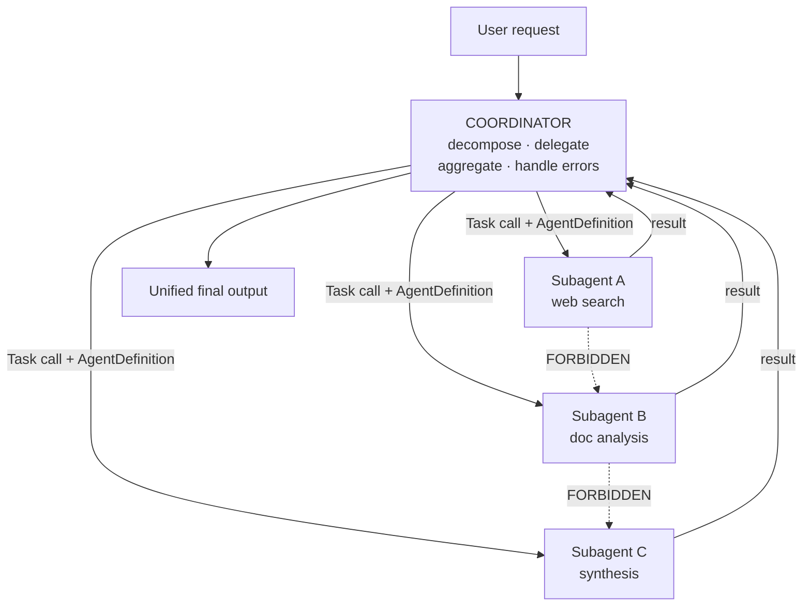
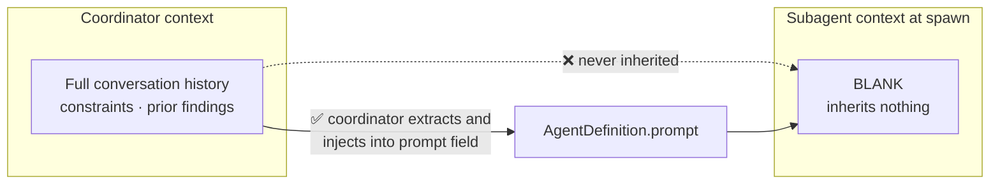

---
tags:
  - CCA-F
  - domain-1
  - agentic-architecture
  - multi-agent
  - youtube-course
date: 2026-08-02
status: not-started
domain: "1 of 5"
source: "Peace Of Code — Claude Certified Architect Ep 02"
---

# 🕸️ EP02 — Multi-Agent Systems & Coordinator Patterns

> [!NOTE] Exam Coverage
> Maps to **Domain 1 — Agentic Architecture & Orchestration** (27% of the exam), task statements **1.2** and **1.3**. Covers why single agents hit a wall, hub-and-spoke topology, the four coordinator responsibilities, the `Task` tool and `AgentDefinition` payload, parallel vs sequential spawning, and context isolation — the lesson's headline gotcha.

**Back to:** [[CCA-F Study Roadmap]] · **Domain note:** [[D1 - Agentic Architecture & Orchestration]] · **Deck:** [[EP02 - Flashcards]]
**Source:** [Peace Of Code — Ep 02 (33 min)](https://www.youtube.com/watch?v=ejPWvBcc_DU) · Level: college / professional-certification · Question mix calibrated MCQ-heavy (40 / 40 / 20)
**Previous:** [[EP01 - Agentic Loops & stop_reason]]

---

## 1. Outline

- [1. Outline](#1-outline)
- [2. Key Terms](#2-key-terms)
- [3. Concept Summaries](#3-concept-summaries)
  - [3.1 Why a Single Agent Fails](#31-why-a-single-agent-fails)
  - [3.2 Hub-and-Spoke Topology](#32-hub-and-spoke-topology)
  - [3.3 The Four Coordinator Responsibilities](#33-the-four-coordinator-responsibilities)
  - [3.4 The Task Tool and the AgentDefinition](#34-the-task-tool-and-the-agentdefinition)
  - [3.5 The Task Tool Permission Matrix](#35-the-task-tool-permission-matrix)
  - [3.6 Parallel vs Sequential Spawning](#36-parallel-vs-sequential-spawning)
  - [3.7 Context Isolation — the Gotcha](#37-context-isolation--the-gotcha)
  - [3.8 Good vs Bad Subagent Prompting](#38-good-vs-bad-subagent-prompting)
- [4. Diagrams](#4-diagrams)
- [5. Worked Examples](#5-worked-examples)
- [6. Practice Questions](#6-practice-questions)
- [7. Cheat Sheet](#7-cheat-sheet)

---

## 2. Key Terms

| Term | Definition | Source |
|---|---|---|
| **Hub-and-spoke topology** | Multi-agent pattern where one coordinator sits at the centre and every subagent communicates **only** with it — never with each other. | [03:54] |
| **Coordinator** | The central agent that decomposes work, spawns subagents, aggregates their results, and handles their failures. Also called the coordinator node. | [03:55] |
| **Subagent** | A specialized worker agent spawned by the coordinator for one scoped piece of work. Does **not** produce the final output. | [05:21] |
| **Routing mandate** | The rule that *all* communication routes exclusively through the coordinator. Subagents don't know each other exist. | [04:11] |
| **Context ceiling** | The point at which accumulated tool results exhaust the context window — often before the task is finished. The primary single-agent failure mode. | [01:19] |
| **Sequential bottleneck** | A single agent can hold many tools but calls them one at a time, so independent subtasks queue and latency compounds. | [02:11] |
| **Specialization gap** | One agent doing research + writing + coordination yields generic results — "jack of all trades, master of none." | [02:57] |
| **Task decomposition** | Coordinator responsibility #1 — break the overarching request into scoped, assignable pieces. | [06:03] |
| **Delegation** | Coordinator responsibility #2 — spawn the right specialized subagent for each piece. | [06:39] |
| **Result aggregation** | Coordinator responsibility #3 — collect independent outputs and synthesize one unified result. | [07:16] |
| **Error handling** | Coordinator responsibility #4 — handle subagent failures gracefully rather than propagating them. | [07:43] |
| **`Task` / `Agent` tool** | The SDK mechanism by which a coordinator spawns a subagent. Must appear in the coordinator's `allowedTools`. **Renamed `Task` → `Agent` in Claude Code v2.1.63** — see §3.4. | [08:35] |
| **`AgentDefinition`** | The object defining a subagent. **Required: `description` + `prompt` only.** The lecture's other two (`allowedTools`, `model`) are optional — and the field is `tools`, not `allowedTools`. See §3.4. | [12:48] |
| **Parallel spawning** | Emitting **multiple `Task` calls in a single coordinator response**. The exam-critical mechanism. | [18:34] |
| **Sequential anti-pattern** | Spawning subagents across separate turns, so runtimes add instead of overlapping. Diagnostic: system runs ~3× slower than expected. | [20:37] |
| **Context isolation** | Subagents start with a **blank context** and inherit none of the coordinator's conversation history. | [22:56] |
| **Context injection** | The coordinator explicitly placing needed information into the subagent's `prompt` field. The only cure for context isolation. | [25:46] |
| **Siloed outputs** | Fragmented final results, usually caused by overly narrow decomposition plus weak aggregation. | [31:09] |

---

## 3. Concept Summaries

### 3.1 Why a Single Agent Fails

*Question: What three walls does a single agent hit, and which is the primary one?*

**Context ceiling.** One agent doing everything must remember everything. Tool results accumulate rapidly across many calls, and the context window is exhausted — often *before the task completes*. Since the Claude API is stateless and you resend the whole history each turn (see [[EP01 - Agentic Loops & stop_reason]] §3.5), that history is exactly what fills the window.

**Sequential bottlenecks.** A single agent can be given many tools, but it calls them one at a time. Independent subtasks that could have run simultaneously get queued instead, and latency compounds across the pipeline.

**Specialization gap.** An agent that researches, writes, *and* coordinates is a jack of all trades and master of none. Its output is generic because no part of its instruction set is sharply scoped.

The fix the lecture names: multi-agent architecture deploys **specialized agents in parallel, each with a scoped context** — which addresses all three walls at once.

**In your own words:** One agent runs out of context, runs serially, and runs generic. Splitting the work fixes all three.

*See PQ 1, 8, 14.*

---

### 3.2 Hub-and-Spoke Topology

*Question: Why must subagents be forbidden from talking to each other?*

One coordinator sits at the hub. Every subagent is a spoke. The **routing mandate** is absolute: all communication routes exclusively through the coordinator. Subagent A cannot message subagent B — it does not even know B exists.

This is deliberate, not a limitation. Direct subagent-to-subagent links would create dependencies between workers, and dependent workers cannot be spawned in parallel. By keeping every subagent dependent *only* on the coordinator, they stay mutually independent and can all run at once.

The lecture's analogy: a development team. Developers each do their piece and report to the architect. The architect assembles the work and presents it. **Subagents are not responsible for the final output** — only the coordinator synthesizes.

A side benefit the cheat sheet calls out: routing everything through one node gives **absolute observability**. There is exactly one place to inspect what the system is doing.

**In your own words:** Isolation isn't a restriction — it's what makes parallelism possible, and it hands you one observation point.

*See PQ 2, 9, 15.*

---

### 3.3 The Four Coordinator Responsibilities

*Question: What exactly is the coordinator accountable for?*

**1 — Task decomposition.** Break the overarching complex request into scoped, assignable pieces. The coordinator answers: do I need a subagent at all? How many? Which one, when?

**2 — Delegation.** Spawn the exact specialized subagent for each piece. In a research architecture that might mean one deep-research specialist and one article-writing specialist, with the writer invoked on the researcher's output.

**3 — Result aggregation.** Collect the independent outputs and synthesize them into a unified final result. This is the step that prevents siloed output.

**4 — Error handling.** When a subagent fails its assigned task, the coordinator must handle it gracefully — intelligently, not by crashing or silently dropping the piece.

> [!TIP] Memorise as a verb chain
> **Decompose → Delegate → Aggregate → Handle errors.** The exam asks these as a set, so losing one loses the question. **(expansion)**

**In your own words:** Split the work, hand it out, put it back together, cope when a piece fails.

*See PQ 3, 10, 16.*

---

### 3.4 The `Task` Tool and the `AgentDefinition`

*Question: Mechanically, how does a coordinator spawn a subagent?*

Spawning is a **tool call**. A subagent is invoked as a tool, and you grant the ability by adding that tool to the coordinator's `allowedTools`. **Without it, the coordinator cannot delegate anything at all** — invocations fall through to a permission prompt or are denied outright.

When the coordinator calls it, it passes an **`AgentDefinition`** — the object describing the subagent being created. The lecture names four fields. **Only two are required:**

| Field | Required? | Purpose |
|---|---|---|
| `description` | ✅ **Yes** | When to use this subagent — Claude reads it to decide delegation |
| `prompt` | ✅ **Yes** | The subagent's system prompt — role, behavior, **and the injected context** |
| `tools` | ❌ No | Allowed tool names. Omit → inherits every tool available to subagents |
| `model` | ❌ No | Model override (`'opus'`, `'sonnet'`, `'haiku'`, `'inherit'`, or a full ID) |

> [!IMPORTANT] Verified corrections to the lecture
> **1 — The field is `tools`, not `allowedTools`.** `allowedTools` is the *coordinator-level* permission list passed to `query()`; `tools` is the field inside an `AgentDefinition`. The lecture conflates them.
> **2 — Only `description` and `prompt` are required.** Treat the lecture's four as "the four the exam asks you to name," but know the split.
> **3 — The full optional set is larger than four:** `tools`, `disallowedTools`, `model`, `skills`, `memory`, `mcpServers`, `initialPrompt`, `maxTurns`, `background`, `effort`, `permissionMode`.
> Source: [Subagents in the SDK](https://code.claude.com/docs/en/agent-sdk/subagents) → *AgentDefinition configuration*.

> [!WARNING] The tool was renamed: `Task` → `Agent`
> The lecture (and older exam material) calls it the **`Task`** tool. It was **renamed to `Agent` in Claude Code v2.1.63**. Current SDK releases emit `"Agent"` in `tool_use` blocks, but `"Task"` still appears in the `system:init` tools list and in `result.permission_denials[].tool_name`.
>
> ❌ Don't assume one name is universally correct
> ✅ Current docs put **`"Agent"`** in `allowedTools`
> ✅ Detection code should match **both**: `block.name in ("Task", "Agent")`
>
> For the exam, expect `Task` — the certification material predates the rename. For real code, use `Agent` and match both when parsing. The host's on-camera casing fumble ("capital T-A-S-K… this is the type, which will be small t-a-s-k") is noise either way: both names are capitalized. **(verified — consistent with [[D1 - Agentic Architecture & Orchestration]] §1.2, which already records this rename)**

**In your own words:** Put `Task` in the coordinator's `allowedTools`; each `Task` call carries an `AgentDefinition` describing the worker.

*See PQ 4, 5, 11, 17.*

---

### 3.5 The `Task` Tool Permission Matrix

*Question: Who is allowed to hold the `Task` tool, and who must not be?*

| Role | `Task` access | Why |
|---|---|---|
| **Coordinator** | ✅ Required | Without it, it cannot spawn anything |
| **Standard worker subagent** | ❌ Must not have it | A worker that spawns workers breaks hub-and-spoke and can recurse indefinitely |
| **Hierarchical sub-coordinator** | ✅ Allowed | Only if that node is *explicitly designed* to delegate to a deeper tertiary layer |

The middle row is the exam-relevant one. If ordinary workers can spawn, "everyone becomes a coordinator" — the topology degenerates and there is no longer a single observation point or a single aggregator.

The third row is the sanctioned exception. A deliberate hierarchical pattern — main coordinator → sub-coordinator → workers — is legitimate architecture, and its middle tier legitimately needs the tool. The distinction is *designed to delegate* versus *accidentally able to*.

> [!WARNING] The SDK default contradicts the lecture's "must not"
> The lecture presents "workers must never spawn" as a hard rule. In the current Claude Agent SDK it is a **design principle, not an enforced constraint**: by default, subagents **can** spawn their own subagents, up to **three layers** below the main conversation (Claude Code v2.1.219+). Set `CLAUDE_CODE_MAX_SUBAGENT_SPAWN_DEPTH` to the depth you want, or to `1` to turn nesting off entirely.
>
> Version history, because the default has moved twice: v2.1.172–2.1.216 nested up to **five** layers with no way to change it; v2.1.217–2.1.218 defaulted to **1** (no nesting); v2.1.219 raised it to **3**.
>
> So the lecture's rule is sound *architectural advice* — uncontrolled nesting does degrade hub-and-spoke and multiply cost — but "the SDK forbids it" is false. If you want the lecture's topology enforced, you must set the env var. Answer exam questions with the design principle; write code with the env var. **(verified — [Subagents in the SDK](https://code.claude.com/docs/en/agent-sdk/subagents))**

**In your own words:** Only nodes whose job is delegating *should* delegate — but nesting is allowed by default, so enforce it deliberately.

*See PQ 6, 12, 18.*

---

### 3.6 Parallel vs Sequential Spawning

*Question: What is the one mechanical detail that makes spawning parallel rather than sequential?*

**You emit multiple `Task` tool calls in a single coordinator response.** Not across separate turns. One response, many tool-use blocks. That is the whole mechanism, and the lecture flags it explicitly as an exam fact.

The timing consequence is the point of the entire architecture. With three subagents taking $S_1$, $S_2$, $S_3$:

$$T_{\text{parallel}} = \max(S_1, S_2, S_3) \qquad T_{\text{sequential}} = S_1 + S_2 + S_3$$

Sequential execution defeats the purpose — if the runtimes add up anyway, a single agent could have done the work and you gained nothing for the added complexity.

> [!IMPORTANT] Exam diagnostic alert
> **If the system runs ~3× slower than expected, the coordinator is committing the sequential anti-pattern.** The exam won't say "this is wrong" — it gives a latency scenario and expects you to inspect the payload for whether one response carries multiple `Task` calls.

Concretely, a parallel coordinator response has `role: "assistant"` and a `content` array holding three sibling `tool_use` blocks, each with its own `id`, `name: "Task"`, and `AgentDefinition` input.

**In your own words:** Many `Task` blocks in one response = parallel. One per turn = the anti-pattern.

*See PQ 7, 13, 14, 18.*

---

### 3.7 Context Isolation — the Gotcha

*Question: What does a freshly spawned subagent know?*

**Effectively nothing of the parent's.** Subagents start with a fresh context. They do not inherit the coordinator's conversation history, they don't know what the coordinator is doing, and they don't know other subagents exist.

> [!NOTE] Precisely what a subagent starts with — verified
> "Blank" is the right instinct but not literally true. The official breakdown:
>
> | Receives | Does **not** receive |
> |---|---|
> | Its own system prompt (`AgentDefinition.prompt`) | The parent's conversation history or tool results |
> | The **tool call's `prompt` string** (the per-invocation task) | The parent's system prompt |
> | Project `CLAUDE.md` (via `settingSources`) | Preloaded skill content, unless listed in `skills` |
> | Tool definitions (inherited, or the subset in `tools`) | |
>
> The exam's point survives intact: **nothing task-specific crosses the boundary unless the coordinator puts it there.** **(verified — [Subagents in the SDK](https://code.claude.com/docs/en/agent-sdk/subagents) → *What subagents inherit*)**

The lecture's analogy: a project manager three weeks into a project knows the constraints, the client's preferences, and everything already tried. A newly hired contractor knows none of it. They work on their specific piece and report back — and they can only do that piece well if someone *tells* them what they need to know.

This is the root cause the exam tests. **If a subagent produces irrelevant, duplicated, or context-unaware output, the answer is missing explicit context injection.** The instructor puts it at "99.99%" — and warns the exam may not even show you the `AgentDefinition`, leaving you to infer it from symptoms.

The cure is the coordinator's job: extract whatever the subagent needs and put it in the prompt, programmatically, at spawn time. There is no other channel.

> [!IMPORTANT] Two different "prompts" — the lecture blurs them
> The official wording is exact: *"The only content you pass from parent to subagent is the Agent tool's prompt string, so include any file paths, error messages, or decisions the subagent needs directly in that prompt."*
>
> | Surface | What it is | When it's set |
> |---|---|---|
> | `AgentDefinition.prompt` | The subagent's **system prompt** — its persona, expertise, standing constraints | Once, at definition time |
> | The **tool call's `prompt`** | The **per-invocation task** — and the injected context | Every spawn |
>
> Per-task context injection belongs in the **tool call's prompt string**, not the static `AgentDefinition.prompt`. The lecture says "the prompt field of the agent definition" and means the former. Getting this backwards means baking one task's context into every future invocation of that subagent. **(verified)**

**In your own words:** Fresh slate by default. Duplicated or off-target subagent output = the coordinator failed to inject context — into the *tool call's* prompt.

*See PQ 8, 12, 15, 16.*

---

### 3.8 Good vs Bad Subagent Prompting

*Question: Why is a step-by-step subagent prompt an anti-pattern?*

**Give goals and constraints, not procedures.** A good research subagent prompt states the objective — find studies contradicting a given finding, meeting stated criteria — plus guardrails on scope and quality.

The bad version dictates steps: "go to Google Scholar, find the information there, then generate a report." It fails the moment reality shifts. If Scholar is down, or the URL changed, or the results are thin, a procedurally-bound agent cannot adapt — it follows the instruction and fails. A goal-bound agent searches other sources.

The balance the lecture draws: goals alone risk hallucination or irrelevant findings, so you add **constraints and guardrails** in the prompt — not steps. Constraints bound *what counts as acceptable*; steps dictate *how to move*, and only the former survives a changing environment.

> [!WARNING] Two things must go in the `prompt` field
> ✅ The **goal** + constraints/guardrails
> ✅ The **injected context** the subagent cannot otherwise have (§3.7)
> ❌ Step-by-step procedural instructions

**In your own words:** Say what "done and good" looks like, and what it needs to know. Never say which buttons to press.

*See PQ 11, 13, 17.*

---

## 4. Diagrams

### 4.1 Hub-and-spoke topology

*Dotted edges are the links that must not exist. Subagents are mutually invisible — that isolation is what permits parallel spawning and gives one observation point.*

### 4.2 Parallel vs sequential timing

```mermaid
gantt
    title Three subagents - 4s, 7s, 3s
    dateFormat X
    axisFormat %ss
    section Parallel - one response
    S1 web    :0, 4
    S2 docs   :0, 7
    S3 synth  :0, 3
    section Sequential - anti-pattern
    S1 web    :0, 4
    S2 docs   :4, 11
    S3 synth  :11, 14
```

*Parallel finishes at $\max(4,7,3)=7$s; sequential at $4+7+3=14$s — the 2× gap the "3× slower" exam diagnostic points at.*

### 4.3 Context isolation and injection

*The dotted arrow is the assumption that burns people. The solid path is the only channel.*

---

## 5. Worked Examples

### Example 1 — Diagnose a latency scenario

**Problem:** A research coordinator spawns four subagents taking 6s, 9s, 5s, and 4s. Expected wall-clock is ~9s but the system takes 24s. Identify the fault and prove it arithmetically.

1. **Compute the parallel expectation.** $T_{\text{parallel}} = \max(6, 9, 5, 4) = 9$s.
   *(Under parallel spawning, total time is the slowest single subagent — the others finish inside its window.)*
2. **Compute the sequential prediction.** $T_{\text{sequential}} = 6 + 9 + 5 + 4 = 24$s.
   *(If each spawn waits for the previous to return, runtimes add.)*
3. **Compare against the observed 24s.** It matches $T_{\text{sequential}}$ exactly.
   *(The ratio $24/9 \approx 2.7\times$ — the lecture's "~3× slower" diagnostic.)*
4. **Inspect the payload for the root cause.** Look at the coordinator's `content` array: does **one** assistant response carry four sibling `tool_use` blocks named `Task`, or do four separate turns each carry one?
   *(This is the only thing that distinguishes the two modes — nothing about the `AgentDefinition` itself changes.)*
5. **The fix.** Emit all four `Task` calls in a **single** coordinator response.

**Answer:** The sequential spawning anti-pattern. Observed time equals $\sum S_i$ rather than $\max S_i$; the coordinator is spreading `Task` calls across separate turns instead of emitting them in one response.

---

### Example 2 — Diagnose a duplicated-output scenario

**Problem:** A coordinator spawns three research subagents on offshore wind energy. All three return substantially the same five papers, and none reflect the user's stated constraint "published after 2024." No `AgentDefinition` is shown. Diagnose it.

1. **Rule out the topology.** Subagents cannot see each other by design, so "they should have coordinated" is not a valid fix — the routing mandate forbids it.
   *(Duplication between isolated workers is expected unless something differentiates their assignments.)*
2. **Note the missing constraint.** The "after 2024" filter lived in the coordinator's conversation with the user. Subagents start **blank** and inherit none of it.
   *(§3.7 — context isolation. The constraint never reached them.)*
3. **Identify the single root cause.** Missing explicit context injection. The coordinator did not extract the constraint (or a distinct scope per worker) into each subagent's `prompt`.
   *(The lecture: irrelevant, duplicated, or context-unaware output → this cause, ~always.)*
4. **Derive the fix.** In each `Task` call's `AgentDefinition.prompt`, inject the shared constraint **and** a differentiated scope — e.g. worker A: academic papers post-2024; worker B: government reports post-2024; worker C: industry news post-2024.
   *(This also addresses decomposition: identical assignments guarantee identical results.)*

**Answer:** Missing context injection. Fix by writing both the shared constraints and a distinct scope into each subagent's `prompt` field at spawn time.

---

### Example 3 — Rewrite a bad subagent prompt

**Problem:** Convert this `AgentDefinition.prompt` into the goal-oriented form, given the coordinator knows the user wants peer-reviewed sources published after 2024.

> `"Open Google Scholar. Search 'offshore wind energy'. Take the first 5 results. Summarize each in 2 sentences. Return as a list."`

1. **Name the anti-pattern.** Pure step-by-step procedure. Every clause dictates *how to move*, not *what counts as done*.
   *(If Scholar is down, the URL changed, or the top 5 are irrelevant, the agent has no basis to adapt.)*
2. **Extract the actual goal.** Recent, credible literature on offshore wind energy, summarized.
   *(The goal survives changes to any particular source.)*
3. **Convert the steps into constraints.** "First 5 results" → *5–8 sources*. "Google Scholar" → *peer-reviewed*. Add the injected constraint: *published after 2024*.
   *(Constraints bound acceptable output; steps bound behaviour. Only the former is robust.)*
4. **Inject the context the subagent cannot have.** The post-2024 requirement exists only in the coordinator's history.
   *(§3.7 — without this the worker cannot satisfy a constraint it has never seen.)*
5. **Write the result:**
   > `"Research goal: identify 5-8 peer-reviewed studies on offshore wind energy published after 2024. Context: the user is comparing efficiency against onshore installations and has already reviewed pre-2024 literature. Constraints: peer-reviewed only; prefer primary studies over reviews; note methodology for each. Return title, year, and a 2-sentence finding summary."`

**Answer:** Replace the procedure with goal + constraints + injected context. Keep *what good looks like*; drop *which site to visit*.

---

## 6. Practice Questions

1. Name the three failure modes of a single-agent system. *(§3.1 / Concept: why single agents fail)*

   

Answer

   <strong>Context ceiling</strong> (tool results accumulate and exhaust the window before the task finishes), <strong>sequential bottlenecks</strong> (tools are called one at a time, so independent subtasks queue), and the <strong>specialization gap</strong> (an agent doing everything produces generic output).
   

2. In hub-and-spoke topology, may subagent A send a result directly to subagent B? *(§3.2 / Term: routing mandate)*

   

Answer

   <strong>No.</strong> All communication routes exclusively through the coordinator. Subagent A does not know B exists — the isolation is deliberate.
   

3. List the four coordinator responsibilities. *(§3.3 / Concept: coordinator responsibilities)*

   

Answer

   <strong>Task decomposition</strong>, <strong>delegation</strong>, <strong>result aggregation</strong>, and <strong>error handling</strong>. Mnemonic: decompose → delegate → aggregate → handle errors.
   

4. What must appear in a coordinator's `allowedTools` for it to spawn subagents — and what changed about that name? *(§3.4 / Term: spawn tool)*

   

Answer

   The spawn tool. <strong>Exam answer: <code>"Task"</code></strong> (capital T). <strong>Current SDK: <code>"Agent"</code></strong> — renamed in Claude Code v2.1.63; <code>"Task"</code> still appears in the <code>system:init</code> tools list and in <code>permission_denials[].tool_name</code>, so detection code should match both. Without the tool, the coordinator cannot delegate at all.
   

5. Which `AgentDefinition` fields are strictly required, and where does the lecture's four-field list go wrong? *(§3.4 / Term: `AgentDefinition`)*

   

Answer

   <strong>Required: <code>description</code> and <code>prompt</code> only.</strong> The lecture's other two are optional, and it names the wrong field — inside an <code>AgentDefinition</code> it is <code>tools</code>; <code>allowedTools</code> is the separate coordinator-level permission list. The full optional set also includes <code>disallowedTools</code>, <code>skills</code>, <code>memory</code>, <code>mcpServers</code>, <code>initialPrompt</code>, <code>maxTurns</code>, <code>background</code>, <code>effort</code>, and <code>permissionMode</code>.
   

6. Should a standard worker subagent be able to spawn subagents? Distinguish the design principle from the SDK's actual default. *(§3.5 / Concept: permission matrix)*

   

Answer

   <strong>Design principle (and exam answer): no</strong> — a worker that spawns workers breaks hub-and-spoke, removes the single aggregation and observation point, and multiplies cost. The sanctioned exception is a <strong>hierarchical sub-coordinator</strong> explicitly designed to delegate to a deeper tier. <strong>But the SDK does not enforce this:</strong> subagents can nest up to three layers by default (v2.1.219+). Set <code>CLAUDE_CODE_MAX_SUBAGENT_SPAWN_DEPTH=1</code> to actually forbid it.
   

7. What single mechanical detail makes subagent spawning parallel rather than sequential? *(§3.6 / Term: parallel spawning)*

   

Answer

   Emitting <strong>multiple <code>Task</code> tool calls in one coordinator response</strong>, not one per turn. One response, many <code>tool_use</code> blocks.
   

8. True or False: a subagent inherits the coordinator's conversation history. *(§3.7 / Term: context isolation)*

   

Answer

   <strong>False.</strong> Subagents start with a completely blank context and inherit nothing — not the history, not the other subagents' existence.
   

9. Explain why forbidding subagent-to-subagent communication is an enabler rather than a restriction. *(§3.2 / Comprehension)*

   

Answer

   Direct links would create dependencies between workers, and dependent workers cannot run simultaneously. Keeping each subagent dependent only on the coordinator keeps them mutually independent, which is precisely what permits parallel spawning. It also yields one central point of observability.
   

10. Which coordinator responsibility, if neglected, produces siloed output — and why? *(§3.3, §3.7 / Comprehension)*

    

Answer

    <strong>Result aggregation.</strong> Subagents deliberately never produce the final output; if the coordinator doesn't synthesize their independent results into a unified whole, the user receives four disconnected fragments. The lecture pairs this with overly narrow decomposition as the usual root cause.
    

11. Compare what belongs in an `AgentDefinition.prompt` versus what does not. *(§3.4, §3.8 / Comprehension)*

    

Answer

    <strong>Belongs:</strong> the goal / success criteria, constraints and guardrails, and the context injected by the coordinator that the subagent cannot otherwise have. <strong>Does not belong:</strong> step-by-step procedural instructions, which make the agent brittle when the environment changes.
    

12. A subagent returns output that duplicates another subagent's and ignores a user constraint. State the root cause and the fix. *(§3.7 / Comprehension)*

    

Answer

    Root cause: <strong>missing explicit context injection</strong>. The constraint lived in the coordinator's history and the subagent started blank. Fix: the coordinator extracts the constraint and a differentiated scope into each subagent's <code>prompt</code> field at spawn time.
    

13. Explain why "go to Google Scholar, take the first 5 results" is an anti-pattern even when the site is up. *(§3.8 / Comprehension)*

    

Answer

    It binds the agent to a procedure rather than an outcome. Even when Scholar is reachable, "the first 5 results" may be irrelevant or off-constraint, and the agent has no criteria to recognise that or search elsewhere. Goals plus constraints let it adapt; steps do not.
    

14. A coordinator spawns subagents taking 5s, 8s, and 3s. Give the expected wall-clock under each mode, and state what an observed 16s implies. *(§3.6 / Application)*

    

Answer

    Parallel: $\max(5,8,3) = 8$s. Sequential: $5+8+3 = 16$s. An observed 16s matches the sequential sum exactly — the coordinator is committing the <strong>sequential spawning anti-pattern</strong>, emitting one <code>Task</code> call per turn instead of all three in one response.
    

15. You must add a fourth research subagent to an existing three-agent system. What must you change so it doesn't duplicate the others' work? *(§3.2, §3.7 / Application)*

    

Answer

    Give it a <strong>distinct scope in its <code>prompt</code></strong>, injected by the coordinator — it cannot see what the other three were assigned. Add its <code>Task</code> call to the <em>same</em> coordinator response as the others to preserve parallelism, and extend the coordinator's aggregation step to synthesize four inputs.
    

16. Design the minimum diagnostic checklist for "our multi-agent system returns fragmented, off-target results." *(§3.3, §3.7 / Application)*

    

Answer

    (1) Check whether each <code>AgentDefinition.prompt</code> carries injected context and a distinct scope — missing injection is the ~99% cause of off-target output. (2) Check whether the coordinator actually aggregates rather than concatenating — fragmentation points at aggregation or overly narrow decomposition. (3) Confirm no subagent holds <code>Task</code>, which would mean rogue spawning outside the coordinator's view.
    

17. You inherit a coordinator whose subagents each receive a 40-step procedural prompt and no background. Give the two independent changes required. *(§3.7, §3.8 / Application)*

    

Answer

    (1) <strong>Replace procedures with goals plus constraints</strong> so workers can adapt when a source or tool is unavailable. (2) <strong>Inject the coordinator's relevant context</strong> into each <code>prompt</code> — constraints, prior findings, client preferences — since the workers start blank. These are separate faults: fixing the prompting style alone still leaves the agent ignorant, and injecting context alone still leaves it brittle.
    

18. An architect proposes giving every subagent `Task` access "for flexibility." Give two concrete failure modes. *(§3.5, §3.6 / Application)*

    

Answer

    (1) <strong>Topology collapse / unbounded recursion</strong> — workers spawning workers means "everyone becomes a coordinator," there is no single aggregator, and spawning can recurse indefinitely. (2) <strong>Loss of observability and parallelism control</strong> — spawns happen outside the coordinator's single response, so nothing guarantees they're emitted together, and the central inspection point disappears. The sanctioned exception remains a sub-coordinator explicitly designed to delegate.
    

---

## 7. Cheat Sheet

| Cue | Note |
|---|---|
| Single-agent walls | Context ceiling · sequential bottlenecks · specialization gap |
| Hub-and-spoke | All comms route through the coordinator; subagents never talk to each other |
| Why isolate | Independence is what allows parallel spawning + one observability point |
| Coordinator's 4 jobs | **Decompose · Delegate · Aggregate · Handle errors** |
| Final output | **Coordinator only.** Subagents never produce it |
| Spawn tool | Must be in the coordinator's `allowedTools`. No tool → no delegation. **Exam: `Task`. Current SDK: `Agent`** (renamed v2.1.63; match both when parsing) |
| `AgentDefinition` | Exam answer: `description` · `prompt` · `allowedTools` · `model`. **Truth: only `description` + `prompt` required; the field is `tools`, not `allowedTools`** |
| Permission matrix | Coordinator ✅ · worker ❌ · hierarchical sub-coordinator ✅ (if designed to delegate). **Design principle — the SDK actually allows 3 layers of nesting by default** |
| **Parallel spawning** | **Multiple `Task` calls in ONE response** — not one per turn |
| Timing | $T_{\text{parallel}} = \max(S_i)$ vs $T_{\text{sequential}} = \sum S_i$ |
| Latency diagnostic | ~3× slower than expected → sequential anti-pattern; inspect the payload |
| **Context isolation** | **Subagents start BLANK.** Inherit no history, no peer awareness |
| Off-target/duplicated output | → missing explicit **context injection** (~99% of exam cases) |
| Injection channel | The **spawn tool call's `prompt` string** — not the static `AgentDefinition.prompt`. There is no other |
| Prompting | ✅ goal + constraints/guardrails ❌ step-by-step procedure |
| Siloed output | Overly narrow decomposition + weak aggregation |

**Top 5 terms:** hub-and-spoke · `Task` tool · `AgentDefinition` · parallel spawning · context isolation.

> [!WARNING] The two headline exam traps
> ❌ Spawning subagents across **separate turns** → sequential anti-pattern, ~3× latency
> ❌ Assuming subagents **inherit** coordinator context → irrelevant / duplicated / context-unaware output
> ✅ All `Task` calls in one response; all needed context written into each `prompt`

> **Synthesis:** A multi-agent system is one coordinator surrounded by mutually blind specialists, and both of that sentence's halves are load-bearing. Blindness is what lets every subagent run at once — but it also means the coordinator must hand each worker its context explicitly, in the `prompt` field, at spawn time. Nearly every exam scenario in this domain reduces to one of two failures: `Task` calls that didn't share a response, or context that was never injected.

---

## ✅ Practice Checklist

- [ ] I can name the three single-agent failure modes without prompting
- [ ] I can state the routing mandate and explain *why* isolation enables parallelism
- [ ] I can recite the four coordinator responsibilities as a chain
- [ ] I know what goes in `allowedTools` vs what goes in the `AgentDefinition`
- [ ] I can name all four `AgentDefinition` fields — and which two are strictly required
- [ ] I can fill in the `Task` permission matrix from memory, including the exception
- [ ] I can compute $\max$ vs $\sum$ timing and diagnose a latency scenario
- [ ] I answer "subagent produced irrelevant/duplicate output" with *missing context injection* reflexively
- [ ] I can rewrite a procedural subagent prompt into goal + constraints + context

---

*Next: [[EP03 - Subagent Context Passing & Session Management]]*
