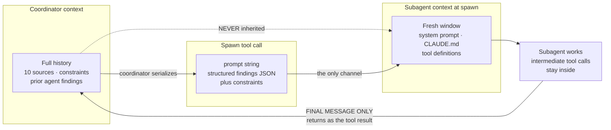
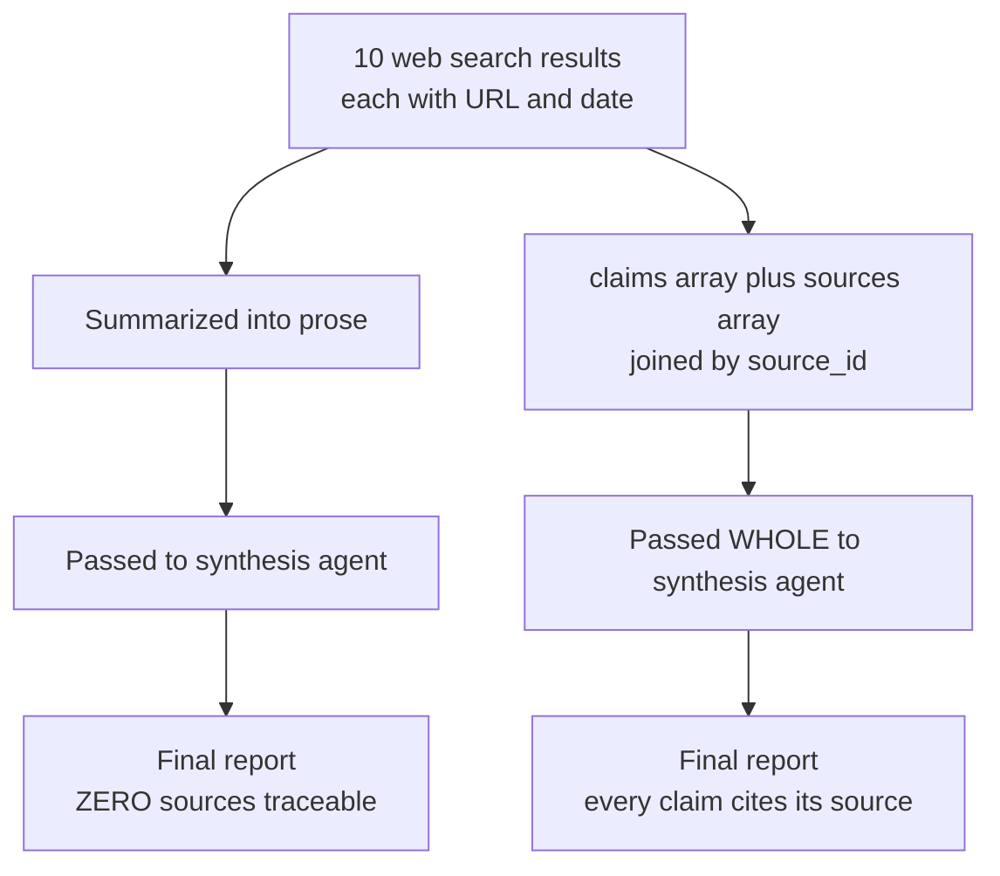
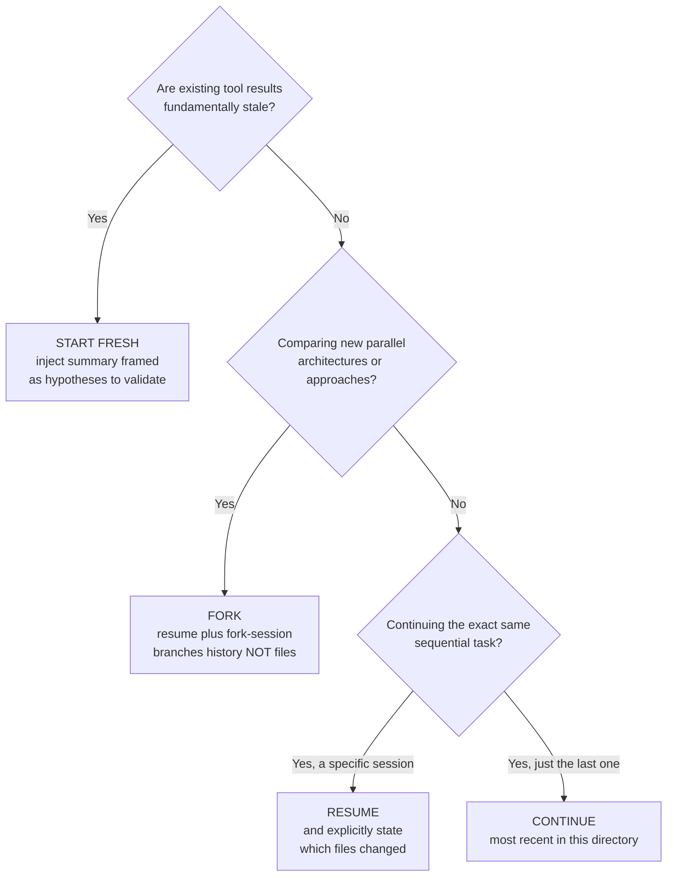

---
tags:
  - CCA-F
  - domain-1
  - domain-5
  - agentic-architecture
  - context-passing
  - session-management
  - youtube-course
date: 2026-08-02
status: done
domain: "1 of 5"
source: "Peace Of Code — Claude Certified Architect Ep 03"
---

# 🔗 EP03 — Subagent Context Passing & Session Management

> [!NOTE] Exam Coverage
> Maps to **Domain 1 — Agentic Architecture & Orchestration** (27% of the exam), task statements **1.3** (subagent invocation) and **1.7** (session state), with a substantial overlap into **Domain 5 — Context Management & Reliability**, task statement **5.6** (information provenance). Covers why a spawned subagent knows nothing, the single channel that carries context into it, structured finding objects, claim-source mappings, conflict escalation, and the resume / fork / fresh-start decision.

**Back to:** [[CCA-F Study Roadmap]] · **Domain note:** [[D1 - Agentic Architecture & Orchestration]] · **Deck:** [[EP03 - Flashcards]]
**Source:** [Peace Of Code — Ep 03 (34 min)](https://www.youtube.com/watch?v=a2N6vKdQUfE) · Level: college / professional-certification · Question mix calibrated MCQ-heavy (40 / 40 / 20)
**Previous:** [[EP02 - Multi-Agent Systems & Coordinator Patterns]]

---

## 1. Outline

- [1. Outline](#1-outline)
- [2. Key Terms](#2-key-terms)
- [3. Concept Summaries](#3-concept-summaries)
  - [3.1 Why Every Subagent Starts Blank](#31-why-every-subagent-starts-blank)
  - [3.2 The Only Channel Into a Subagent](#32-the-only-channel-into-a-subagent)
  - [3.3 Structured vs Unstructured Context](#33-structured-vs-unstructured-context)
  - [3.4 How Attribution Gets Lost in Transit](#34-how-attribution-gets-lost-in-transit)
  - [3.5 Claim-Source Mappings](#35-claim-source-mappings)
  - [3.6 Conflict Objects and Escalation](#36-conflict-objects-and-escalation)
  - [3.7 Session Management — Continue, Resume, Fork](#37-session-management--continue-resume-fork)
  - [3.8 Named Session Resumption](#38-named-session-resumption)
  - [3.9 Fork Sessions for Parallel Exploration](#39-fork-sessions-for-parallel-exploration)
  - [3.10 When to Start Fresh](#310-when-to-start-fresh)
- [4. Diagrams](#4-diagrams)
- [5. Worked Examples](#5-worked-examples)
- [6. Practice Questions](#6-practice-questions)
- [7. Cheat Sheet](#7-cheat-sheet)

---

## 2. Key Terms

| Term | Definition | Source |
|---|---|---|
| **Context passing** | The coordinator's act of explicitly placing needed information into a subagent's spawn payload. Without it the subagent has nothing task-specific. | [01:24] |
| **Blank slate principle** | Every spawned subagent starts a fresh conversation; its entire world is what the coordinator wrote into the spawn prompt. | [05:27] |
| **Context contamination** | The failure the blank slate *prevents* — one agent's irrelevant history polluting another's reasoning. Isolation is a feature, not a bug. | [05:39] |
| **Structured context** | Passing findings as machine-readable objects (JSON arrays of records) rather than prose. The lesson's central prescription. | [08:02] |
| **Finding object** | One record per discovered fact: `finding` text, `source_url`, `source_title`, `page`, `retrieved_at`, `confidence`. | [08:46] |
| **Synthesis subagent** | The downstream worker that turns collected findings into a final report. The canonical victim of bad context passing. | [04:03] |
| **Attribution loss** | Source provenance disappearing during a summarization hop — 10 sources go in, prose comes out, zero remain traceable. | [10:46] |
| **Claim-source mapping** | The fix: an array pairing every claim with an explicit `source_id`, plus a parallel sources array. Never pass claims without sources. | [12:16] |
| **`source_id`** | The join key between a claim record and its source record. Two claims citing different `source_id` values is what *makes* a conflict inspectable. | [13:19] |
| **Intermediate output** | The instructor's name for the whole claims + sources envelope handed between agents. Pass the **whole object**, never just the claims. | [13:31] |
| **Conflict object** | A record with `conflict_id`, `topic`, both claims, both `source_id`s, and `resolution: unresolved`. | [16:31] |
| **Escalation to coordinator** | Subagents annotate conflicts; **only the coordinator resolves them.** A subagent silently picking a winner is an anti-pattern. | [15:46] |
| **Session** | The persisted conversation history — prompts, tool calls, tool results, responses — written to disk so you can return to it. | [18:29] |
| **`--continue` / `-c`** | Loads the **most recent** conversation in the current directory. No ID or name needed. | *(correction — §3.8)* |
| **`--resume`** | Resumes a **specific** session by ID or name; with no argument it opens an interactive picker. | [20:57] |
| **`--name` / `-n`** | Sets a session's display name at launch so `--resume <name>` can find it. `/rename` does the same mid-session. | *(correction — §3.8)* |
| **`--fork-session`** | Used **with** `--resume`/`--continue`: branch a new session from a shared baseline, leaving the original untouched. | [24:27] |
| **Stale context** | Prior tool results that no longer describe reality. The trigger for abandoning a session rather than resuming it. | [27:22] |
| **Hypothesis framing** | When starting fresh with an injected summary, the prompt must label it *hypotheses to validate*, not established fact. | [29:32] |

---

## 3. Concept Summaries

### 3.1 Why Every Subagent Starts Blank

*Question: What does a freshly spawned subagent know about the work already done?*

Nothing task-specific. The lecture's analogy is a research team: you brief analyst one, they dig up ten sources and killer insights, and you tell them to hand it all to analyst two. Analyst two looks at you blankly — *"What findings? I just got here."*

This is exactly what happens by default. The coordinator may have been running for ten minutes, called three tools, and read four documents. When it spawns a synthesis subagent, **none of that accumulated context crosses the boundary.** The subagent does not inherit the coordinator's conversation history, and — per [[EP02 - Multi-Agent Systems & Coordinator Patterns]] §3.2 — it cannot ask a peer either, because subagents don't communicate with each other.

The instructor is emphatic that this is a **feature**. Isolation prevents context contamination: a fresh window means the subagent reasons only over what is relevant to its scoped task, and it is what allows subagents to run in parallel at all.

> [!NOTE] "Zero memory, zero context" is the right instinct but not literally true — verified
> The lecture says the subagent starts with "zero memory. Zero context. Zero history." Officially, the context window starts **fresh but not empty**:
>
> | The subagent **receives** | The subagent **does not receive** |
> |---|---|
> | Its own system prompt (`AgentDefinition.prompt`) | The parent's conversation history or tool results |
> | The **spawn tool's `prompt` string** | The parent's system prompt |
> | Project `CLAUDE.md` (via `settingSources`) | Preloaded skill content, unless listed in `skills` |
> | Tool definitions (inherited, or the subset in `tools`) | |
>
> **Exam answer: the lecture's framing.** Nothing *task-specific* crosses unless the coordinator puts it there — which is the point the exam tests.
> Source: [Subagents in the SDK](https://code.claude.com/docs/en/agent-sdk/subagents) → *What subagents inherit* · consistent with [[D1 - Agentic Architecture & Orchestration]] §1.3

> [!TIP] Subagents *can* now message each other — but the exam answer is unchanged **(expansion)**
> Current Claude Code ships a **`SendMessage`** tool that sends a message to an **agent team** teammate, or resumes a subagent by its agent ID or name. So peer-to-peer messaging exists in the SDK. It does not change the exam answer: hub-and-spoke routing through the coordinator remains the design principle, and a receiver never treats a message from another agent as user consent or approval. Source: [Tools reference](https://code.claude.com/docs/en/tools-reference) · see [[EP02 - Multi-Agent Systems & Coordinator Patterns]] §3.5 for the parallel case on subagent nesting.

**In your own words:** The worker is a brand-new hire with no handover notes. Whatever you don't write down, it doesn't know.

*See PQ 1, 8.*

---

### 3.2 The Only Channel Into a Subagent

*Question: Mechanically, where does injected context go?*

Into the **spawn tool call's `prompt` string**. There is no second channel — no shared memory, no message bus, no inherited scratchpad.

The lecture repeats this several times and it is the load-bearing fact of the whole episode: *"Only the sub agent will get whatever text you put in the task tool call."* Everything else in the lesson — structured objects, claim-source maps, conflict arrays — is about **what** you write into that string. The mechanism never changes.

> [!IMPORTANT] Verified against official docs — the wording is nearly identical
> *"The only content you pass from parent to subagent is the Agent tool's prompt string, so include any file paths, error messages, or decisions the subagent needs directly in that prompt."*
> Source: [Subagents in the SDK](https://code.claude.com/docs/en/agent-sdk/subagents) → *What subagents inherit*

Two adjacent facts the lecture states loosely and the exam may test precisely:

**The tool is `Task` for the exam, `Agent` in current code.** The host says "task tool call" throughout. The spawn tool was **renamed `Task` → `Agent` in Claude Code v2.1.63**; current SDK releases emit `"Agent"` in `tool_use` blocks, while `"Task"` survives in the `system:init` tools list and in `result.permission_denials[].tool_name`. Detection code should match both. **Exam answer: `Task`.**

**Two different "prompts" exist.** `AgentDefinition.prompt` is the subagent's *system* prompt, fixed at definition time. The **spawn tool call's `prompt`** is the *per-invocation* task, written fresh every time. Per-task context belongs in the latter — putting it in the former bakes one task's context into every future invocation of that subagent.

**In your own words:** One string, written at spawn time, is the entire pipe. Design the payload; the plumbing is fixed.

*See PQ 2, 9, 15.*

---

### 3.3 Structured vs Unstructured Context

*Question: Why is a prose handoff the number-one mistake in multi-agent architecture?*

Because it *looks* reasonable. The lecture's bad prompt is one most people would write without hesitation:

> ❌ `"Here are some research findings from the previous agents. Please synthesize them into a final report."`

The subagent's reaction: *what* findings? It has no previous agents to ask and no history to consult. It does one of two things, both bad — **hallucinate** plausible findings, or emit a **generic report** that says nothing. The instructor calls this subtle precisely because you assume the model is "intelligent enough to get it," and it isn't; there is nothing to get.

The fix is a structured array serialized into the prompt. The lecture's shape, one object per finding:

```python
research_findings = [
    {
        "finding": "Claude's tool_use stop reason requires the full assistant "
                   "message to be appended before tool results",
        "source_url": "https://platform.claude.com/docs/en/api/...",
        "source_title": "Tool use — Messages API",
        "page": 1,
        "retrieved_at": "2026-04-10",
        "confidence": "high",
    },
    {
        "finding": "Using an iteration cap as a primary stop condition is an anti-pattern",
        "source_url": "https://code.claude.com/docs/en/agent-sdk/agent-loop",
        "source_title": "How the agent loop works",
        "retrieved_at": "2026-04-10",
        "confidence": "high",
    },
]

synthesis_prompt = f"""You are a synthesis agent. Your task is to produce a
structured research report.

FINDINGS TO SYNTHESIZE:
{json.dumps(research_findings, indent=2)}

REQUIREMENTS:
- Every claim in the report must cite its source URL.
- Preserve the retrieved_at date for temporal accuracy.
- Flag any conflicting findings rather than resolving them yourself.
"""
# Pass synthesis_prompt as the spawn tool call's prompt string.
```

Three things make this work and are worth separating, because the exam can test any of them independently:

1. **The data is machine-readable** — `json.dumps(..., indent=2)`, not a paragraph.
2. **Metadata rides alongside the content** — URL, title, date, confidence travel *with* each finding rather than being summarized away.
3. **Constraints are stated in the prompt** — cite sources, preserve dates, flag conflicts. Constraints tell the subagent what "done and correct" looks like, which is the same principle as [[EP02 - Multi-Agent Systems & Coordinator Patterns]] §3.8: goals and constraints, never step-by-step procedure.

The instructor's summary is worth memorising verbatim: *"We are doing the same task tool call. Nothing like we are using a separate concept... We are doing the same thing, but we are doing it properly."*

**In your own words:** Same pipe, better payload. Serialize objects, carry the metadata, state the constraints.

*See PQ 3, 10, 16.*

---

### 3.4 How Attribution Gets Lost in Transit

*Question: What exactly breaks when a summarization step sits between search and synthesis?*

Provenance. The lecture's slide traces the decay in four steps: **10 web sources → summarized into a paragraph → passed to the synthesis agent → final report written → zero sources remain traceable.**

Every hop that summarizes is a place attribution can be dropped, and prose is the format that guarantees it. The vault's canonical example makes the mechanism obvious:

```
Agent A output:  "According to WHO Report 2024: mortality rate = 3.2%"
Agent B summary: "mortality rate is approximately 3.2%"
                                                 ↑ source attribution LOST
```

The number survived; the accountability didn't. The instructor's framing is the one that matters for the exam: these outputs are model-generated, and *"how will you know that they haven't hallucinated?"* Without a traceable source you cannot distinguish a real finding from a fabricated one — the report reads identically either way.

He is explicit that this is not a nice-to-have: *"preserving the source attribution is very, very necessary. And it comes in the exam."*

> [!IMPORTANT] This is a full exam subdomain, not an aside
> Information provenance is **Domain 5, task statement 5.6**. See [[D5 - Context Management & Reliability]] §5.6 for the verified treatment, including temporal-data handling and multi-source report structure — material the video only gestures at.

**In your own words:** Summarization is where sources go to die. Every prose hop is a lossy hop.

*See PQ 4, 11, 17.*

---

### 3.5 Claim-Source Mappings

*Question: What is the structural fix, and what is the rule for passing it downstream?*

Stop passing summaries as plain text. Pass an object where **every claim is explicitly paired with its source** through a join key.

The lecture's shape uses two parallel arrays joined by `source_id`:

```json
{
  "intermediate_output": {
    "claims": [
      {
        "claim_id": "C001",
        "text": "Subagents do not inherit coordinator conversation history",
        "source_id": "S001",
        "confidence": "high"
      }
    ],
    "sources": [
      {
        "source_id": "S001",
        "title": "Subagents in the SDK",
        "url": "https://code.claude.com/docs/en/agent-sdk/subagents",
        "retrieved_at": "2026-04-10"
      }
    ]
  }
}
```

The name `intermediate_output` is arbitrary — the instructor says so directly: *"you can name this anything... I just named it as intermediate output because we need to pass it on to the agent."* Don't memorise the key name; memorise the **shape** and the **rule**:

> [!IMPORTANT] The transit rule
> **When passing to the next agent, pass the whole object. Never extract just the claims and drop the sources.** The next agent needs both to produce accurate output — a claim without its source cannot be cited, and once dropped it cannot be recovered downstream.

Two equivalent shapes exist and both are correct; know that they're the same idea:

| Shape | Where it appears | Trade-off |
|---|---|---|
| Parallel `claims[]` + `sources[]` joined by `source_id` | This lecture | Sources deduplicated — one source cited by ten claims is stored once |
| Each claim carries a nested `sources: [...]` array inline | [[D5 - Context Management & Reliability]] §5.6 | Self-contained per claim — a record survives being moved alone |

> [!TIP] The vault's shape is the one to recognise on the exam
> D5 §5.6's verified structure nests sources inside the claim, with `document`, `url`, `excerpt`, `date`, and `confidence`. If a question shows one shape and you learned the other, they are testing the *principle* — explicit claim-to-source binding that survives synthesis — not the key names.

**In your own words:** Claims and sources travel together or the report is unauditable. The join key is what makes attribution survive a hop.

*See PQ 5, 12, 16, 17.*

---

### 3.6 Conflict Objects and Escalation

*Question: Two credible sources disagree. Who decides, and what gets recorded?*

**The coordinator decides. The subagent records.**

The instructor's analogy is a manager and a team of analysts: the analysts find the contradiction and bring it up; they do not quietly pick a winner. *"They will not take the final decision, by the way. The manager is responsible to take the final decision."*

The procedure has three steps, and the exam tests them as a set:

1. **Annotate both claims** with full attribution — never silently discard one source.
2. **Mark the resolution state `unresolved`.**
3. **Escalate to the coordinator** for the final call.

```json
{
  "conflicts": [
    {
      "conflict_id": "CONF001",
      "topic": "Parallel subagent invocation",
      "claim_a": { "text": "...", "source_id": "S001" },
      "claim_b": { "text": "...", "source_id": "S004" },
      "resolution": "unresolved"
    }
  ]
}
```

Note the structural dependency the instructor flags: **a conflict object is only meaningful if the two claims cite two different `source_id` values.** That is what makes the disagreement inspectable rather than a self-contradiction — and it only works because §3.5's mapping preserved the source IDs in the first place. The conflict machinery is built on top of claim-source mapping; it cannot exist without it.

> [!IMPORTANT] The instructor's confidence call
> *"In the exam, if a question asks about handling conflicting sources in a multi-agent pipeline, always annotate them both with attribution and pass it to the coordinator. Never let a sub agent silently resolve conflicts. This is a direct exam pattern and I'm 100% sure this question will come."*
> This one is corroborated — [[D5 - Context Management & Reliability]] §5.6 records the same rule independently: ❌ don't arbitrarily select one value, ❌ don't average without noting the conflict, ✅ annotate the conflict with source attribution from both sides.

> [!WARNING] Averaging is the trap answer
> A plausible-sounding distractor is "average the two values" or "prefer the more recent source." Both **destroy information**. The correct move is always to surface the disagreement with both attributions attached. Methodological differences — not error — often explain the gap, and only a human or the coordinator can weigh that.

**In your own words:** Workers report contradictions; the coordinator adjudicates them. Silent resolution is the anti-pattern.

*See PQ 6, 12, 18.*

---

### 3.7 Session Management — Continue, Resume, Fork

*Question: What is a session, and what are the mechanisms for returning to one?*

A **session** is the conversation history the SDK accumulates while an agent works: your prompt, every tool call, every tool result, every response. It is written to disk automatically, so returning to it means the agent has full context from before — files it already read, analysis it already performed, decisions it already made.

The lecture presents "three core patterns." The official set is slightly different, and the difference is worth knowing:

| Official mechanism | What it does | How it finds the session |
|---|---|---|
| **Continue** | Picks up an existing session and adds to it | The **most recent** session in the current directory — you track nothing |
| **Resume** | Picks up an existing session and adds to it | A **specific** session by ID or name — you track the identifier |
| **Fork** | Creates a **new** session starting from a copy of the original's history | Points at a source session; the original stays unchanged |

> [!WARNING] The lecture's "three patterns" omits `continue` — verified against official docs
> The lecture names **named session resumption, fork session, and fresh start**. Officially the three session mechanisms are **continue, resume, and fork**; "fresh start" is a *decision about whether to use any of them*, not a fourth API surface.
>
> ❌ Treating "start fresh" as a session mechanism
> ✅ Three mechanisms — `continue` · `resume` · `fork` — plus the separate judgement call of *abandoning* the session entirely
>
> **Exam answer: continue / resume / fork.** The lecture's fresh-start material (§3.10) is still exam-relevant — it's just a different kind of question. Source: [Work with sessions](https://code.claude.com/docs/en/agent-sdk/sessions) · consistent with [[D1 - Agentic Architecture & Orchestration]] §1.7

The SDK parameter names, which the video never shows:

| Operation | Python | TypeScript |
|---|---|---|
| Continue | `continue_conversation=True` | `continue: true` |
| Resume | `resume=session_id` | `resume: sessionId` |
| Fork | `resume=session_id` **+** `fork_session=True` | `resume: sessionId` **+** `forkSession: true` |

The session ID lives on the `ResultMessage` — capture it or you cannot resume by ID later.

**In your own words:** Continue finds the latest, resume finds a named one, fork branches from either. Fresh start is the decision not to use any of them.

*See PQ 7, 14.*

---

### 3.8 Named Session Resumption

*Question: How do you start a session you can come back to by name — and what does bare `--resume` actually do?*

This is where the lecture's on-camera terminal work goes wrong twice. Both errors are the kind the exam can punish, so learn the corrected commands.

> [!WARNING] Two wrong CLI commands — verified against official docs
> **1. `claude --session-name <name>` does not exist.** The lecture demonstrates it as the way to start a named session. Officially the flag is **`--name`** (short form `-n`): *"Set a display name for the session, shown in `/resume` and the terminal title. You can resume a named session with `claude --resume <name>`."* Mid-session, `/rename` changes it.
>
> **2. Bare `claude --resume` does not resume the most recent session.** The lecture says *"if you just want to resume the recent session, you can omit the name and just say claude hyphen hyphen resume."* Officially, `--resume` with no argument **opens an interactive picker**. The flag that loads the most recent conversation without prompting is **`--continue`** (short form `-c`).
>
> ❌ `claude --session-name analysis` · `claude --resume` for "most recent"
> ✅ `claude --name analysis` · `claude --resume analysis` · `claude --continue`
>
> **Exam answer: the corrected forms.** Real code: the same. There is no version in which `--session-name` was valid.
> Source: [CLI reference](https://code.claude.com/docs/en/cli-reference) · consistent with [[D1 - Agentic Architecture & Orchestration]] §1.7, which already records `--resume <session-name>` and `--continue` correctly

The corrected workflow:

```bash
claude --name payments-analysis
```

```bash
claude --resume payments-analysis
```

**The part the lecture gets exactly right — and stresses hardest — is what you must say on resume.** Never resume without explicitly stating what changed, because **the agent cannot detect changes automatically.** Its memory is the transcript, not the filesystem. Files may have been modified, deleted, or added; dependencies updated; requirements changed. The session knows none of it.

> [!IMPORTANT] Critical from the exam perspective
> *"Never resume a session without explicitly stating what has changed, because the agent cannot detect automatically."* This is the single most repeated instruction in the session half of the lecture, and it is correct. A well-formed resume prompt:
>
> > *"Resuming from the previous analysis session. Changes since last session: `auth/middleware.py` was modified and `requirements.txt` was updated. Please re-analyse only the changed files and continue from your prior findings."*

> [!TIP] A gotcha the video doesn't mention **(expansion)**
> Sessions are stored **per working directory**, under `~/.claude/projects/<encoded-cwd>/*.jsonl`, where `<encoded-cwd>` is the absolute path with every non-alphanumeric character replaced by `-`. If a `resume` call runs from a *different* directory, the SDK looks in the wrong place and you silently get a **fresh session instead of an error**. Session files are also local to the machine that created them. Source: [Work with sessions](https://code.claude.com/docs/en/agent-sdk/sessions).

**In your own words:** `--name` to label it, `--resume <name>` to return, `--continue` for the latest — and always tell it what moved while it was away.

*See PQ 7, 19.*

---

### 3.9 Fork Sessions for Parallel Exploration

*Question: When do you branch a session, and what does the branch actually isolate?*

You fork when you have an expensive baseline and want to explore **two divergent approaches** without losing either. The lecture's scenario: a baseline analysis that took a long time to build, and two refactoring approaches you'd like to try. Fork A explores approach A; fork B explores approach B; both start from the same accumulated context, and the original is untouched.

The mechanism is **not** a standalone operation:

> [!WARNING] There is no standalone fork — verified
> Forking is **`resume` (pointing at the source session) plus a fork flag**. CLI: `claude --resume <id> --fork-session`, described officially as *"When resuming, create a new session ID instead of reusing the original (use with `--resume` or `--continue`)."* SDK: `resume=session_id` + `fork_session=True` / `forkSession: true`. There is **no** `fork=<session_id>` option.
> The fork receives a **new** session ID; the original's ID and history stay unchanged, and you end up with two independently resumable sessions.
> Source: [Work with sessions](https://code.claude.com/docs/en/agent-sdk/sessions) · [CLI reference](https://code.claude.com/docs/en/cli-reference) · this is already flagged as an exam trap in [[D1 - Agentic Architecture & Orchestration]] §1.7

Now the correction that matters most in practice:

> [!WARNING] The GitHub-fork analogy is misleading — forking does **not** isolate files
> The lecture leans hard on repository forking: *"If someone forks that repository... It is not affecting me, which is my repository."* For conversation history that holds. For **files it does not.**
>
> Officially: *"Forking branches the conversation history, not the filesystem. If a forked agent edits files, those changes are real and visible to any session working in the same directory."*
>
> ❌ Assuming fork A and fork B can safely edit the same files in parallel
> ✅ Fork isolates **context only**. To snapshot and revert file changes, use **file checkpointing** — a separate mechanism.
>
> **Exam answer: fork branches conversation history.** Real code: the same, and plan for filesystem collisions when running forks concurrently. Source: [Work with sessions](https://code.claude.com/docs/en/agent-sdk/sessions).

The lecture's scoping rule for fork is sound and worth keeping:

| Situation | Right tool |
|---|---|
| Comparing two parallel architectures or approaches from a shared baseline | **Fork** |
| A few targeted files changed; same sequential task continues | **Resume** + state the changes |
| Prior tool results are fundamentally stale | **Fresh session** + injected summary |

**In your own words:** Fork is for *comparing alternatives*, never for handling file updates — and it branches the transcript, not the working tree.

*See PQ 13.*

---

### 3.10 When to Start Fresh

*Question: The instinct is never to throw away work. When is resuming the wrong call?*

When the prior context is no longer **valid**. The lecture's rule is a clean binary:

> **Resume when prior context is valid. Start fresh when tool results are stale, or when extended context degrades model reasoning.**

The distinction is one of degree, and the lecture makes it concrete. A couple of files changed since last time? Resume and name them. **Eighty percent of the codebase changed?** *"Can you resume the same session? No, right?"* — the transcript is now a body of confident, wrong beliefs about a codebase that no longer exists, and every one of them will contaminate the new work.

Starting fresh does **not** mean starting from nothing. You inject a prior-findings summary — and here is the part the exam tests:

> [!IMPORTANT] The critical framing rule
> **The prompt must frame the injected summary as hypotheses to validate, not established facts.**
>
> > *"Prior analysis summary: [findings]. This analysis is 2 days old and the codebase has changed since. Treat these as hypotheses to validate, not established facts."*
>
> Framing them as facts recreates the exact problem you started fresh to escape — stale conclusions treated as ground truth. The framing sentence is what makes a fresh start *better* than a resume rather than merely different.

This aligns with the vault's verified guidance: *starting a new session with a structured summary **>** resuming with stale tool results.* Note the two halves — **structured** summary and **hypothesis** framing. A fresh start with an unstructured, confidently-worded brain dump is no improvement.

The lecture closes with two scenario walkthroughs (the host numbers them inconsistently — see the artifacts note):

| Scenario | Situation | Fix |
|---|---|---|
| Multi-agent research | Claim attribution lost because web results were summarized into prose before synthesis | Pass a **structured object with explicit claim-to-source mappings** |
| Code generation | Codebase analysis ran 3 days ago; the payments module was just refactored | **`--resume`** and name the specific changed files to trigger targeted re-analysis |
| *(variant)* | Analysis ran a month ago; four or five modules changed | **Start fresh** and inject the summary as hypotheses |

**In your own words:** Validity, not effort, decides. And a fresh start is only better if the summary is structured *and* labelled as unverified.

*See PQ 14, 20.*

---

## 4. Diagrams

### 4.1 The single channel — what crosses the boundary, in each direction



*The dotted arrow is the assumption that breaks systems. Note the return path is equally narrow — only the subagent's **final message** comes back as the spawn tool's result; every intermediate tool call stays inside the subagent, which is exactly why context isolation saves the coordinator's window.*

### 4.2 Attribution decay vs. a preserved claim-source mapping



*Both paths start from identical data. The only difference is the format of the hop in the middle — and that format decides whether the report is auditable.*

### 4.3 Session decision flowchart



*The lecture's cheat-sheet flowchart, with the `continue` branch restored and the fork caveat noted.*

---

## 5. Worked Examples

### Example 1 — Convert a broken handoff into a structured payload

**Problem:** A coordinator has run three web searches and is about to spawn a synthesis subagent with the prompt `"Here are some research findings from the previous agents. Please synthesize them into a final report."` The report comes back generic and cites nothing. Diagnose and rewrite.

1. **Name the failure.** The prompt references findings that exist only in the coordinator's history. The subagent starts with a fresh window and receives nothing but this string.
   *(§3.1 — nothing task-specific crosses the boundary unless the coordinator writes it there.)*
2. **Predict both failure modes.** The subagent will either hallucinate plausible findings or emit a generic report. Both are consistent with the observed symptom.
   *(The lecture names exactly these two; a generic report is the *quieter* failure and therefore the more dangerous one.)*
3. **Serialize the findings as objects.** One record per finding, each carrying `finding`, `source_url`, `source_title`, `retrieved_at`, and `confidence`.
   *(Metadata must ride alongside the content — that is what survives the hop. §3.3.)*
4. **Interpolate with a JSON serializer, not string concatenation.** `json.dumps(research_findings, indent=2)` inside an f-string.
   *(Machine-readable structure is the point; a hand-formatted paragraph re-introduces the original problem.)*
5. **Add the constraint block.** Every claim must cite its source URL; preserve `retrieved_at`; flag conflicts rather than resolving them.
   *(Constraints define "done and correct" — and the third one is what prevents the subagent from silently resolving a conflict. §3.6.)*
6. **Write it into the spawn tool call's `prompt`**, not into `AgentDefinition.prompt`.
   *(§3.2 — the definition prompt is the persona and is fixed; per-task context belongs in the per-invocation string.)*

**Answer:** The root cause is unstructured context passing. Rewrite as a serialized array of finding objects with source metadata, plus an explicit constraint block, placed in the spawn tool call's `prompt` string.

---

### Example 2 — Build a conflict object and route it correctly

**Problem:** A research subagent finds two credible sources on the same topic giving different answers. Source `S001` (dated 2026-02) says one thing; source `S004` (dated 2025-11) says another. What does the subagent emit, and who resolves it?

1. **Rule out silent resolution.** The subagent must not discard the older source, must not prefer the newer one on its own authority, and must not average.
   *(§3.6 — all three destroy information; methodological differences, not error, may explain the gap.)*
2. **Confirm the two claims cite different sources.** `claim_a.source_id = "S001"`, `claim_b.source_id = "S004"`.
   *(A "conflict" between two claims sharing one `source_id` is a self-contradiction inside one source, which is a different problem.)*
3. **Emit the conflict object** with `conflict_id`, `topic`, both annotated claims, and `resolution: "unresolved"`.
   *(The `unresolved` marker is the signal to the coordinator that a decision is outstanding.)*
4. **Keep both sources in the `sources` array.** Neither is dropped from the payload.
   *(§3.5's transit rule — pass the whole object; a dropped source cannot be recovered downstream.)*
5. **Escalate to the coordinator**, which holds the full picture and makes the final call.
   *(The manager/analyst split — workers report, the coordinator adjudicates.)*

**Answer:** The subagent emits a `conflicts[]` entry annotating both claims with their distinct `source_id`s and `resolution: "unresolved"`, keeps both sources in the payload, and escalates. Only the coordinator resolves.

---

### Example 3 — Choose the session strategy for three scenarios

**Problem:** For each scenario, name the mechanism and the exact command or option.

**(a) A codebase analysis ran three days ago; the payments module was just refactored. Everything else is unchanged.**

1. **Test validity.** One module changed out of many — the bulk of the prior analysis still describes reality.
   *(§3.10 — validity, not age, is the criterion.)*
2. **Choose resume**, since this is the same sequential task continuing on a specific session.
3. **Name the changes explicitly.** `claude --resume payments-analysis`, then a prompt stating that the payments module was refactored and requesting targeted re-analysis of those files.
   *(The agent cannot detect filesystem changes — the transcript is its only memory.)*

**Answer (a):** Resume, and explicitly declare the changed files.

**(b) The same analysis ran a month ago; four or five modules have changed since.**

1. **Test validity.** A large fraction of the prior tool results now describe code that no longer exists.
2. **Choose a fresh session.** Resuming would carry confident, wrong beliefs into the new work.
3. **Inject a structured summary framed as hypotheses.** *"Prior analysis summary: [...]. This is one month old and 4–5 modules have changed. Treat these as hypotheses to validate, not established facts."*
   *(§3.10 — the framing sentence is what makes fresh-plus-summary better than resume-with-stale-data.)*

**Answer (b):** Start fresh with an injected summary, explicitly framed as hypotheses to validate.

**(c) You have an expensive baseline analysis and want to trial two different refactoring architectures without losing either.**

1. **Recognise the shape.** Two independent approaches diverging from one shared baseline — the textbook fork case.
2. **Fork twice from the same source session.** `claude --resume baseline-id --fork-session`, run once per approach. Each fork gets a **new** session ID; the baseline is untouched.
   *(§3.9 — no standalone fork exists; it is resume + the fork flag.)*
3. **Guard the filesystem.** Fork branches conversation history only. If both forks edit the same files in the same directory, those edits collide for real.
   *(The correction in §3.9 — use separate directories or file checkpointing.)*

**Answer (c):** Fork — `--resume <baseline> --fork-session` per approach — while isolating file writes separately, because fork does not branch the filesystem.

---

## 6. Practice Questions

1. What does a subagent inherit from its coordinator's conversation? *(§3.1 / Term: blank slate principle)*

   <details><summary>Answer</summary>
   <strong>Nothing task-specific.</strong> No conversation history, no tool results, no parent system prompt. It does receive its own system prompt, the spawn tool's <code>prompt</code> string, project <code>CLAUDE.md</code> via <code>settingSources</code>, and tool definitions — but nothing about the work already done.
   </details>

2. Name the one channel by which a coordinator passes context into a subagent. *(§3.2 / Term: context passing)*

   <details><summary>Answer</summary>
   The <strong>spawn tool call's <code>prompt</code> string</strong>. There is no other channel — no shared memory, no message bus, no inherited scratchpad. (Exam tool name: <code>Task</code>; current SDK: <code>Agent</code>.)
   </details>

3. List the fields of a well-formed finding object. *(§3.3 / Term: finding object)*

   <details><summary>Answer</summary>
   <code>finding</code>, <code>source_url</code>, <code>source_title</code>, <code>page</code>, <code>retrieved_at</code>, and <code>confidence</code>. The metadata must travel <em>with</em> the finding, not be summarized away.
   </details>

4. Complete the attribution-decay chain: 10 web sources → ? → ? → ? *(§3.4 / Term: attribution loss)*

   <details><summary>Answer</summary>
   10 sources → <strong>summarized into a paragraph</strong> → <strong>passed to the synthesis agent</strong> → <strong>final report written, zero sources traceable</strong>.
   </details>

5. In a claim-source mapping, what is the rule when handing the object to the next agent? *(§3.5 / Term: claim-source mapping)*

   <details><summary>Answer</summary>
   <strong>Pass the whole object.</strong> Never extract just the claims and drop the sources — the next agent needs both to produce accurate, citable output, and a dropped source cannot be recovered downstream.
   </details>

6. What three things must a subagent do when it finds two conflicting sources? *(§3.6 / Term: conflict object)*

   <details><summary>Answer</summary>
   (1) <strong>Annotate both claims</strong> with their source attribution, (2) mark the resolution state <strong><code>unresolved</code></strong>, and (3) <strong>escalate to the coordinator</strong> for the final decision. Never silently resolve.
   </details>

7. Give the CLI commands to start a session named `audit` and later return to it, plus the command to load the most recent session. *(§3.7, §3.8 / Term: session flags)*

   <details><summary>Answer</summary>
   Start: <code>claude --name audit</code> (short form <code>-n</code>). Return: <code>claude --resume audit</code>. Most recent: <code>claude --continue</code> (short form <code>-c</code>). <strong>Note:</strong> <code>--session-name</code> does not exist, and bare <code>--resume</code> opens an interactive picker rather than loading the most recent session.
   </details>

8. Explain why the blank-slate behaviour is described as a feature rather than a limitation. *(§3.1 / Comprehension)*

   <details><summary>Answer</summary>
   It prevents <strong>context contamination</strong> — the subagent reasons only over what is relevant to its scoped task instead of inheriting a polluted window. It is also what keeps subagents mutually independent, which is the precondition for spawning them in parallel. Isolation additionally saves the coordinator's own context, because the subagent's intermediate tool calls stay inside it and only the final message returns.
   </details>

9. Distinguish `AgentDefinition.prompt` from the spawn tool call's `prompt`, and say which carries injected context. *(§3.2 / Comprehension)*

   <details><summary>Answer</summary>
   <code>AgentDefinition.prompt</code> is the subagent's <strong>system prompt</strong> — persona, expertise, standing constraints — fixed once at definition time. The <strong>spawn tool call's <code>prompt</code></strong> is the <strong>per-invocation task</strong>, written fresh at every spawn. <strong>Injected context belongs in the tool call's prompt.</strong> Putting it in the definition bakes one task's context into every future invocation of that subagent.
   </details>

10. Why does a prose handoff produce a *generic* report rather than an obvious error? *(§3.3 / Comprehension)*

    <details><summary>Answer</summary>
    Because the subagent has nothing to fail against. It received a coherent-looking instruction referencing findings it cannot see, so it produces the only thing it can — plausible generic prose, or hallucinated findings. Nothing raises an exception, which is why the lecture calls this the subtlest and most common multi-agent mistake.
    </details>

11. Why is attribution loss specifically a *reliability* problem, not just a formatting one? *(§3.4 / Comprehension)*

    <details><summary>Answer</summary>
    Because the output is model-generated. Without a traceable source you cannot distinguish a real finding from a hallucinated one — a fabricated claim and a sourced claim read identically in prose. Attribution is the only mechanism that makes the report auditable.
    </details>

12. A conflict object's two claims cite the same `source_id`. What is wrong? *(§3.5, §3.6 / Comprehension)*

    <details><summary>Answer</summary>
    A genuine conflict is a disagreement <strong>between two sources</strong>, so the two claims must cite <strong>different</strong> <code>source_id</code> values. Identical IDs mean either a self-contradiction inside one source (a different problem) or a broken mapping. The join key is what makes the disagreement inspectable at all.
    </details>

13. Explain why the lecture's GitHub-fork analogy is misleading. *(§3.9 / Comprehension)*

    <details><summary>Answer</summary>
    The analogy implies full isolation. <strong>Forking branches the conversation history, not the filesystem.</strong> A forked agent's file edits are real and visible to any session working in the same directory, so two forks editing the same files will collide. Use <strong>file checkpointing</strong> to snapshot and revert file changes.
    </details>

14. State the rule for choosing between resuming and starting fresh, and the criterion behind it. *(§3.10 / Comprehension)*

    <details><summary>Answer</summary>
    <strong>Resume when prior context is valid; start fresh when tool results are stale or when extended context degrades reasoning.</strong> The criterion is <strong>validity, not age or effort invested</strong> — a month-old analysis of unchanged code is fine, while a two-day-old analysis of an 80%-rewritten codebase is not.
    </details>

15. What is the name of the spawn tool, and what changed about it? *(§3.2 / Recall)*

    <details><summary>Answer</summary>
    <strong>Exam answer: <code>Task</code>.</strong> It was <strong>renamed to <code>Agent</code> in Claude Code v2.1.63</strong>. Current SDK releases emit <code>"Agent"</code> in <code>tool_use</code> blocks, while <code>"Task"</code> still appears in the <code>system:init</code> tools list and in <code>result.permission_denials[].tool_name</code> — detection code should match both.
    </details>

16. You are handed a synthesis prompt containing a JSON findings array but no requirements block. Name two constraints that must be added and why. *(§3.3, §3.5 / Application)*

    <details><summary>Answer</summary>
    (1) <strong>"Every claim must cite its source URL"</strong> — without it the synthesis step can summarize attribution away, recreating the exact decay the structured payload was built to prevent. (2) <strong>"Flag conflicting findings rather than resolving them"</strong> — without it the subagent may silently pick a winner, which is the escalation anti-pattern. A third worth adding: <strong>"preserve <code>retrieved_at</code>"</strong>, so a 2024 statistic and a 2026 statistic don't read as a contradiction.
    </details>

17. A pipeline's final reports are accurate but cite nothing. Web search, summarization, and synthesis each run as separate subagents. Locate the fault and fix it. *(§3.4, §3.5 / Application)*

    <details><summary>Answer</summary>
    The fault is the <strong>summarization hop</strong>: it converts sourced results into prose before synthesis ever sees them, so attribution is already gone by the time the synthesis agent runs. Fixing the synthesis prompt alone cannot recover it. <strong>Fix:</strong> require the summarization step to emit a <strong>structured claim-source mapping</strong> — claims joined to sources by <code>source_id</code> — and require every downstream agent to preserve the whole object through its own hop.
    </details>

18. Two research subagents return contradictory figures and the coordinator must ship a report today. Give the correct handling and name two tempting wrong answers. *(§3.6 / Application)*

    <details><summary>Answer</summary>
    <strong>Correct:</strong> present both figures side by side with full source attribution and dates, note that the sources disagree, and let the coordinator (or a human) adjudicate — a "Contested Findings" section is the standard rendering. <strong>Wrong answers:</strong> (1) <strong>averaging</strong> the two values, and (2) <strong>preferring the more recent source</strong> automatically. Both silently destroy information; methodological differences rather than error often explain the gap.
    </details>

19. Write the resume prompt for a session where `auth/middleware.py` changed and `requirements.txt` was updated. Then say what breaks if you omit it. *(§3.8 / Application)*

    <details><summary>Answer</summary>
    <em>"Resuming from the previous analysis session. Changes since last session: <code>auth/middleware.py</code> was modified and <code>requirements.txt</code> was updated. Please re-analyse only the changed files and continue from your prior findings."</em> <strong>If omitted:</strong> the agent proceeds on a transcript describing files as they were, because it <strong>cannot detect filesystem changes</strong> — its memory is the conversation, not the working tree. It will reason confidently about code that no longer exists.
    </details>

20. Why must an injected summary be framed as hypotheses rather than facts? *(§3.10 / Comprehension)*

    <details><summary>Answer</summary>
    Because framing them as facts recreates the problem you started fresh to escape — stale conclusions treated as ground truth. The framing sentence is what makes fresh-plus-summary <em>better</em> than resuming with stale data rather than merely different.
    </details>

---

## 7. Cheat Sheet

| Cue | Note |
|---|---|
| Subagent at spawn | Fresh window. No parent history, no tool results, no peer awareness |
| The only channel | The **spawn tool call's `prompt` string**. Not `AgentDefinition.prompt` |
| Return channel | Only the subagent's **final message** comes back; intermediate tool calls stay inside |
| Bad handoff | Prose → subagent hallucinates or emits a generic report. The #1 multi-agent mistake |
| Good handoff | Serialized JSON objects + metadata + explicit constraints |
| Finding object | `finding` · `source_url` · `source_title` · `page` · `retrieved_at` · `confidence` |
| Attribution decay | 10 sources → prose summary → synthesis → **zero traceable** |
| **Claim-source mapping** | Claims joined to sources by **`source_id`**. **Pass the whole object — never drop sources** |
| Conflict handling | Annotate **both** · mark **`unresolved`** · **escalate to the coordinator**. Never resolve silently |
| Conflict trap | ❌ average · ❌ auto-prefer the newer source |
| **3 session mechanisms** | **`continue`** (most recent) · **`resume`** (specific ID/name) · **`fork`** (branch). Fresh start is a *decision*, not a mechanism |
| Name a session | **`--name` / `-n`**, or `/rename` mid-session. **`--session-name` does not exist** |
| Resume | `--resume <id-or-name>`. **Bare `--resume` = interactive picker**, not "most recent" |
| Fork | **`--resume <id> --fork-session`** — no standalone fork. SDK: `resume=id` + `fork_session=True` |
| Fork isolates | **Conversation history only — not the filesystem.** Fork edits are real and shared |
| On every resume | **State what changed.** The agent cannot detect file changes — its memory is the transcript |
| Resume vs fresh | Resume if prior context is **valid**; fresh if tool results are **stale** |
| Fresh start | Inject a **structured** summary **framed as hypotheses to validate** |

**Top 5 terms:** claim-source mapping · conflict object · `--fork-session` · stale context · hypothesis framing.

> [!WARNING] The four headline exam traps
> ❌ Passing **prose** between agents → hallucination or a generic report
> ❌ Letting a **subagent resolve a conflict** → escalate to the coordinator instead
> ❌ **Resuming without stating what changed** → the agent cannot detect it
> ❌ Using **fork for targeted file updates** → fork is for parallel exploration only

> **Synthesis:** Both halves of this lesson are one defence applied twice. Between agents it is *structure* — claims bound to sources, passed whole, so provenance survives a summarization hop that prose would have erased. Across time it is *explicitness* — a resumed session can't see what changed on disk and a fresh one can't see anything, so you either declare the diff or label the summary unverified. The failure mode is identical: an agent reasoning confidently over information it has no way to check.

---

## ✅ Practice Checklist

- [ ] I can state what a subagent does and does not receive at spawn, without prompting
- [ ] I answer "where does injected context go?" with *the spawn tool call's `prompt` string*, reflexively
- [ ] I can distinguish `AgentDefinition.prompt` from the spawn tool call's `prompt`
- [ ] I can write a finding object from memory, with all six fields
- [ ] I can trace the four-step attribution decay chain
- [ ] I can build a claim-source mapping and state the pass-the-whole-object rule
- [ ] I can build a conflict object and name who resolves it
- [ ] I know averaging and auto-preferring-the-newer-source are both trap answers
- [ ] I can name the three session mechanisms — and know "fresh start" isn't one of them
- [ ] I know `--name`, `--resume`, `--continue`, and `--fork-session` and what each takes
- [ ] I know fork branches conversation history, **not** the filesystem
- [ ] I never answer a resume scenario without adding "and state what changed"
- [ ] I can apply the stale-context rule to decide resume vs fresh in a given scenario
- [ ] I can explain why an injected summary must be framed as hypotheses

---

> [!TIP] Transcription artifacts in this episode's captions
> The auto-generated captions mangle several terms. Don't second-guess yourself during video review:
> - **"Cloud" / "Cloud Code"** → *Claude* / *Claude Code* (pervasive, including in every CLI command)
> - **"Cloud hyphen hyphen resume"** → `claude --resume`
> - **"attribute preservation"** [03:17] → *attribution* preservation
> - **"iteration gap"** [09:08] → *iteration cap* — as a primary stop condition, the anti-pattern from [[EP01 - Agentic Loops & stop_reason]]
> - **"both sources annotated"** [09:50] → the constraint means *flag conflicts where sources disagree*
> - **"agent tick flow"** [23:45] → *agentic* flow
> - **"refracting approaches"** [25:00] → *refactoring* approaches
> - **"if you see the fly… I'm sorry, I'm talking about the flight"** [23:13] → the host means *the slide*
> - **Scenario numbering** [32:11 → 32:35]: the host says "Scenario number three" first and "Scenario two" second. There is no scenario one — the numbering is simply wrong, not a missing segment.

---

*Next: [[EP04 - Multi-Agent System in Python (Claude SDK)]]*
