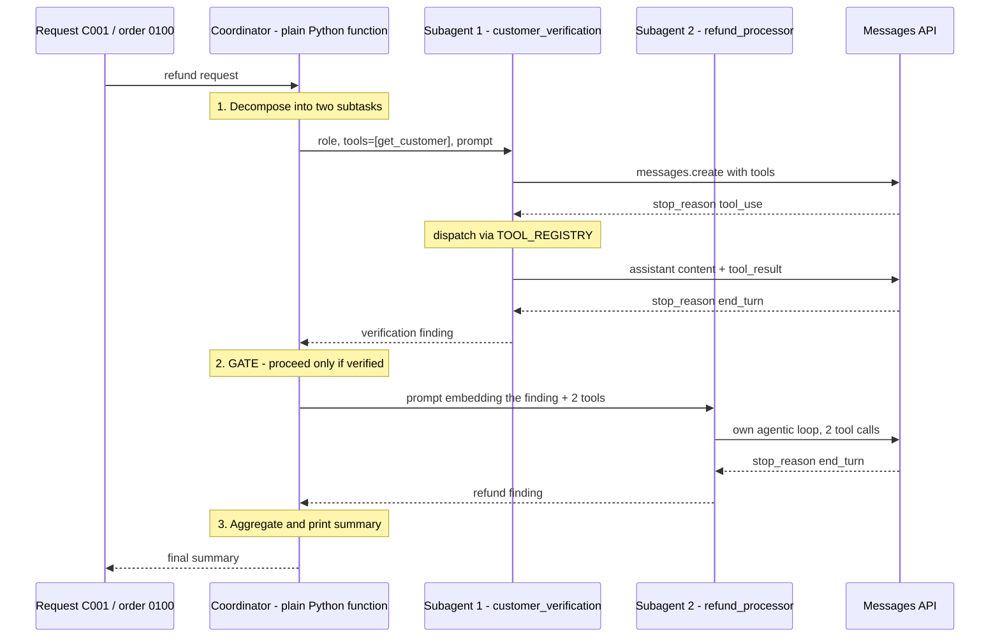
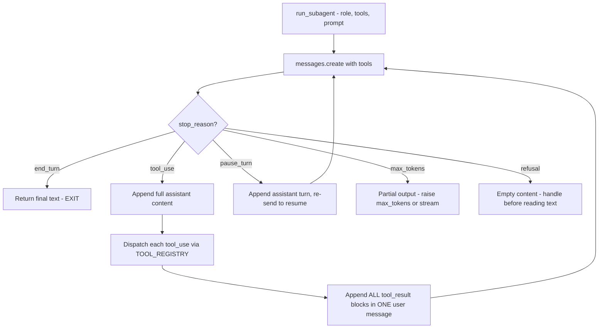

---
tags:
  - CCA-F
  - domain-1
  - domain-2
  - agentic-architecture
  - multi-agent
  - tool-design
  - youtube-course
date: 2026-08-03
status: done
domain: "1 of 5"
source: "Peace Of Code — Claude Certified Architect Ep 04"
---

# 🐍 EP04 — Multi-Agent System in Python (Claude SDK)

> [!NOTE] Exam Coverage
> The **capstone** for episodes 01–03: the theory turned into runnable code. Maps to **Domain 1 — Agentic Architecture & Orchestration** (27% of the exam), task statements **1.1** (agentic loop), **1.2** (multi-agent systems), **1.3** (subagent invocation) and **1.6** (task decomposition), with an overlap into **Domain 2 — Tool Design & MCP Integration**, task statement **2.1** (tool interfaces). Covers coordinator decomposition, tool schemas and the tool registry, the hand-rolled `stop_reason` loop, least-privilege tool scoping per subagent, sequential gating on a prior finding, and the episode's most valuable moment — the instructor retracting his own `Task`-tool claim on camera.

**Back to:** [[CCA-F Study Roadmap]] · **Domain note:** [[D1 - Agentic Architecture & Orchestration]] · **Deck:** [[EP04 - Flashcards]]
**Source:** [Peace Of Code — Ep 04 (13 min)](https://www.youtube.com/watch?v=e7ijjK173zI) · Level: college / professional-certification · Question mix calibrated MCQ-heavy (40 / 40 / 20)
**Previous:** [[EP03 - Subagent Context Passing & Session Management]]

---

## 1. Outline

- [1. Outline](#1-outline)
- [2. Key Terms](#2-key-terms)
- [3. Concept Summaries](#3-concept-summaries)
  - [3.1 The Capstone Scenario](#31-the-capstone-scenario)
  - [3.2 Coordinator Decomposition in Code](#32-coordinator-decomposition-in-code)
  - [3.3 Tool Schemas and the Tool Registry](#33-tool-schemas-and-the-tool-registry)
  - [3.4 One Function, Many Subagents](#34-one-function-many-subagents)
  - [3.5 The Hand-Rolled Agentic Loop](#35-the-hand-rolled-agentic-loop)
  - [3.6 Least-Privilege Tool Scoping](#36-least-privilege-tool-scoping)
  - [3.7 Sequential Gating and the C99 Failure](#37-sequential-gating-and-the-c99-failure)
  - [3.8 The Retraction — No Task Tool in the Raw SDK](#38-the-retraction--no-task-tool-in-the-raw-sdk)
  - [3.9 What the Raw API Offers Now](#39-what-the-raw-api-offers-now)
- [4. Diagrams](#4-diagrams)
- [5. Worked Examples](#5-worked-examples)
- [6. Practice Questions](#6-practice-questions)
- [7. Cheat Sheet](#7-cheat-sheet)

---

## 2. Key Terms

| Term | Definition | Source |
|---|---|---|
| **Capstone project** | The instructor's name for this episode: episodes 01–03 (agentic loop, coordinator/multi-agent, context and sessions) combined into one runnable Python program. | [00:07] |
| **Coordinator function** | A plain Python function that decomposes the request, calls each subagent in order, and aggregates. In the raw API SDK the coordinator is **your code**, not a model-driven tool call. | [01:10] |
| **Subtask** | One unit of decomposed work assigned to exactly one subagent. Here: *verify the customer*, then *process the refund*. | [02:38] |
| **`run_subagent`** | The helper that runs one subagent. Takes a **role**, a **tool list**, and a **prompt** — the three things that distinguish one subagent from another. | [05:15] |
| **Tool schema** | The JSON contract that tells Claude a tool exists: `name`, `description`, and `input_schema` (with `properties` and `required`). Claude selects tools from these strings alone. | [03:25] |
| **Tool registry** | A dict mapping each tool **name** to the Python **function** that implements it. The raw loop needs it to dispatch a `tool_use` block to real code. | [05:04] |
| **`get_customer`** | Subagent 1's only tool. Looks up a customer by ID; `customer_id` is the required property. | [03:46] |
| **`lookup_order` / `process_refund`** | Subagent 2's two tools — confirm the order belongs to the customer, then issue the refund if eligible. | [03:59] |
| **Fake DB** | Hard-coded customer and order dicts standing in for a datastore, so the demo runs with no external dependency. Customer `C001`, order `0100`, status `delivered`. | [04:14] |
| **Verification finding** | Subagent 1's return value, passed forward into subagent 2's prompt. The concrete instance of *context passing* from [[EP03 - Subagent Context Passing & Session Management]]. | [05:57] |
| **Sequential gating** | Running subagent 2 **only** on the strength of subagent 1's finding, so a failed verification stops the pipeline instead of feeding it garbage. | [11:07] |
| **Hallucinated results** | What subagent 2 produces if it runs without a real finding — the failure the gating prevents. The instructor's stated reason the structure matters. | [11:07] |
| **`stop_reason`** | The response field that drives the loop: `end_turn` exits with the final text, `tool_use` means execute and continue. **Seven** values exist — see §3.5. | [08:12] |
| **Claude Agent SDK** | The package (`claude-agent-sdk`) that owns the `Task`/`Agent` spawn tool, `AgentDefinition`, hooks, and sessions. **A different library** from the `anthropic` API SDK. | [11:56] |
| **Anthropic API SDK** | The `anthropic` package — Messages API only. Has no subagent-spawn tool; multi-agent structure is code you write. | [11:56] |
| **Architecturally correct** | The instructor's verdict on his own code: the *patterns* match the exam's model even though the `Task` tool never appears. | [11:56] |

---

## 3. Concept Summaries

### 3.1 The Capstone Scenario

*Question: what problem is small enough to code in one file but big enough to need two subagents?*

A refund request. Customer `C001` wants a refund for order `0100`. That single sentence decomposes cleanly into two dependent subtasks, which is exactly what makes it a good teaching scenario: **verify the customer exists**, and then **process the refund for their order**.

The dependency is the interesting part. Subtask 2 is meaningless if subtask 1 fails — you cannot refund a customer who does not exist. So the scenario forces the pattern the exam cares about: a coordinator that decomposes, delegates, **passes the first result into the second prompt**, and aggregates. Strip the dependency out and you have two parallel jobs that teach nothing about context passing.

The instructor is explicit that everything in the file is a combination of the three prior lessons: the agentic loop (EP01), coordinator and multi-agent patterns (EP02), and context and sessions (EP03). Nothing new is introduced conceptually — the value is seeing where each concept physically lives in code.

**In your own words:** One request, two dependent subtasks, one coordinator holding them together. The dependency is the lesson.

*See PQ 1, 11.*

---

### 3.2 Coordinator Decomposition in Code

*Question: in the raw Anthropic SDK, what **is** the coordinator?*

A Python function. That is the whole answer, and it surprises people who arrive expecting a special SDK construct.

The coordinator function does four things in sequence, and the instructor walks them in order:

1. **Decompose** — break the request into subtasks. Here it is hard-coded: verify, then refund.
2. **Delegate** — call `run_subagent` with a role, a tool list, and a prompt.
3. **Pass context forward** — take subagent 1's finding and write it into subagent 2's prompt.
4. **Aggregate** — collect both results and print the final summary.

Those are the same four coordinator responsibilities from [[EP02 - Multi-Agent Systems & Coordinator Patterns]], and the exam tests them as a named set. What this episode adds is the realisation that in the raw API they are *ordinary control flow* — an `if`, a variable, an f-string. There is no orchestration framework doing it for you.

```python
def coordinator(customer_id: str, order_id: str) -> str:
    # 1. Decompose + delegate: subtask one
    verification_task = (
        f"Look up customer {customer_id} and confirm that they exist."
    )
    verification_finding = run_subagent(
        role="customer_verification",
        tools=[TOOLS[0]],                     # get_customer only
        prompt=verification_task,
    )

    # 2. Pass the finding forward — this string IS the context channel
    refund_task = f"""Prior verification finding:
{verification_finding}

If the customer is verified, look up order {order_id}, confirm it belongs to
that customer, and process the refund. If verification failed, stop and report
why — do not process a refund."""
    refund_finding = run_subagent(
        role="refund_processor",
        tools=[TOOLS[1], TOOLS[2]],           # lookup_order + process_refund
        prompt=refund_task,
    )

    # 3. Aggregate
    return f"VERIFICATION: {verification_finding}\n\nREFUND: {refund_finding}"
```

> [!IMPORTANT] The coordinator is not an agent here
> In the **Agent SDK**, the coordinator is a model — Claude decides when to spawn a subagent via the `Task`/`Agent` tool. In the **raw API SDK**, the coordinator is deterministic Python: *you* decide the order, *you* decide the gating. Both are legitimate coordinator implementations, and the exam's coordinator responsibilities apply to both. Know which one a question is describing.

**In your own words:** The coordinator is a function with four jobs. In raw Python those jobs are just statements.

*See PQ 2, 12.*

---

### 3.3 Tool Schemas and the Tool Registry

*Question: why does the same tool need to be declared twice — once as schema and once as code?*

Because Claude and Python need different things. Claude needs **a description it can reason over**; Python needs **a function it can call**. The two are joined by the tool's `name`.

The schema is what goes into the API request. Its shape is fixed by the Messages API:

```python
TOOLS = [
    {
        "name": "get_customer",
        "description": "Verify a customer exists by looking them up by ID.",
        "input_schema": {                       # snake_case — Messages API
            "type": "object",
            "properties": {
                "customer_id": {
                    "type": "string",
                    "description": "The customer ID, e.g. C001",
                },
            },
            "required": ["customer_id"],
        },
    },
    # ... lookup_order, process_refund
]
```

The registry is what the loop uses to dispatch:

```python
TOOL_REGISTRY = {
    "get_customer":   get_customer,       # name  ->  Python callable
    "lookup_order":   lookup_order,
    "process_refund": process_refund,
}
```

The instructor makes the load-bearing point twice: the schema exists **so Claude will know "these are the tools that are available, and these are the tools I need to use."** Tool selection is driven entirely by the `name` and `description` strings — a vague description is a routing bug, which is the whole subject of [[EP06 - Tool Descriptions & Tool Misrouting]].

> [!IMPORTANT] Field-name precision the exam checks literally
> - Messages API tool definition: **`input_schema`** (snake_case), containing `type`, `properties`, `required`.
> - Agent SDK `AgentDefinition`: the tool-restriction field is **`tools`**, *not* `allowedTools`. `allowedTools` / `allowed_tools` is a **top-level option** on `query()`, a different thing at a different level.
>
> Mixing these up is a classic distractor. Source: [Tool use overview](https://platform.claude.com/docs/en/agents-and-tools/tool-use/overview) · [Subagents in the SDK](https://code.claude.com/docs/en/agent-sdk/subagents) · consistent with [[D2 - Tool Design & MCP Integration]] §2.1

**In your own words:** Schema is the advert Claude reads; registry is the phone number the loop dials. `name` is the only thing linking them.

*See PQ 3, 4, 13.*

---

### 3.4 One Function, Many Subagents

*Question: what actually differs between two subagents?*

Three arguments. The instructor's `run_subagent` takes a **role**, a **list of tools**, and a **prompt** — and that is the complete difference between the customer-verification subagent and the refund-processor subagent. Same function, same loop, same model.

This is the episode's cleanest insight, and the instructor states it directly:

> *"The sub agent is just another agentic loop. It is nothing different from a normal agent. It's just we name it as a sub agent because it is being spawned by the coordinator."*

That is exactly right, and it is worth holding onto because it demystifies the whole subject. "Subagent" is a **role in an architecture**, not a class in a library. Every subagent runs the same `stop_reason` loop as any other agent — a point the instructor also makes at [02:00]: *"even though they are sub agents, they are still agents, right? So obviously they will be running their own agentic loops."*

Note how the three arguments map onto the Agent SDK's own vocabulary, because the exam may test either surface:

| `run_subagent` argument | Agent SDK equivalent | Fixed at |
|---|---|---|
| `role` | The agent's key in the `agents` dict + its `description` | Definition time |
| `tools` | `AgentDefinition.tools` | Definition time |
| `prompt` | The **spawn tool call's `prompt`** string | Invocation time |

The last row is the one people get backwards. Per-task context belongs in the *invocation* prompt, never baked into the definition — see [[EP03 - Subagent Context Passing & Session Management]] §3.2.

**In your own words:** Role, tools, prompt. Change those three and you have a different specialist running identical machinery.

*See PQ 5, 6.*

---

### 3.5 The Hand-Rolled Agentic Loop

*Question: what does the loop inside `run_subagent` do on each pass?*

Exactly what EP01 described, now in code. The instructor narrates it at [08:12–09:05]: keep going while the stop reason is not `end_turn`; when it is `end_turn`, return the final text and exit; when it is `tool_use`, append the assistant message, append the tool result, and send it back to Claude.

```python
def run_subagent(role: str, tools: list[dict], prompt: str) -> str:
    messages = [{"role": "user", "content": prompt}]

    while True:
        response = client.messages.create(
            model="claude-opus-5",
            max_tokens=16000,
            tools=tools,
            messages=messages,
        )

        if response.stop_reason == "end_turn":
            print(f"[{role}] done")
            return next(b.text for b in response.content if b.type == "text")

        if response.stop_reason == "tool_use":
            # 1. Append the FULL assistant content — tool_use blocks included
            messages.append({"role": "assistant", "content": response.content})

            # 2. One tool_result per tool_use, ALL in ONE user message
            results = []
            for block in response.content:
                if block.type == "tool_use":
                    print(f"[{role}] calling {block.name}")
                    try:
                        output = TOOL_REGISTRY[block.name](**block.input)
                        results.append({
                            "type": "tool_result",
                            "tool_use_id": block.id,      # must match
                            "content": str(output),
                        })
                    except Exception as exc:
                        results.append({
                            "type": "tool_result",
                            "tool_use_id": block.id,
                            "content": f"Error: {exc}",
                            "is_error": True,             # let Claude recover
                        })
            messages.append({"role": "user", "content": results})
```

> [!IMPORTANT] Three mechanics the lecture states correctly and precisely
> The instructor's phrasing — *"append the full tool assistant message... will append it like the tool result. And then will send it back to Claude"* — is right, and the precision matters:
> 1. **Append the full assistant `content`**, not just its text. Dropping the `tool_use` blocks breaks the pairing and the API rejects the next request.
> 2. **Every `tool_result` carries the matching `tool_use_id`.** One result per `tool_use` block, no exceptions.
> 3. **All results go in a single user message.** Splitting parallel results across several messages silently trains Claude to stop making parallel calls.
>
> Source: [Tool use overview](https://platform.claude.com/docs/en/agents-and-tools/tool-use/overview) · consistent with [[D1 - Agentic Architecture & Orchestration]] §1.1

> [!WARNING] The loop's two-value `stop_reason` model is incomplete *for production* — but it is the exam answer
> The lecture treats `stop_reason` as effectively binary: `end_turn` or `tool_use`. Officially there are **seven** values — `end_turn`, `tool_use`, `max_tokens`, `stop_sequence`, `pause_turn`, `refusal`, and `model_context_window_exceeded` — of which **three drive loop control**: `end_turn` (exit), `tool_use` (execute and continue), and **`pause_turn`** (a server-side tool paused mid-turn; re-send the assistant turn to resume).
>
> A `while True` loop that only handles two values will **hang or silently truncate** on the other five: `max_tokens` returns a partial answer, `refusal` returns empty `content` (so `next(... b.text ...)` raises `StopIteration`), and `pause_turn` needs an explicit resume.
>
> **Exam answer: two — `tool_use` continues, `end_turn` terminates.** *(Corrected 2026-08-25.)* The official exam guide names only those two, in task statement 1.1 and in its Technologies appendix; `pause_turn` and `refusal` appear nowhere in it. So the lecture's binary model is what the exam rewards, and the seven-value table is production correctness. **Real code:** branch on all of them, and check `stop_reason` **before** indexing `content`.
> Source: [Handling stop reasons](https://platform.claude.com/docs/en/build-with-claude/handling-stop-reasons) · scope per [[Official Exam Blueprint]] § 5 · consistent with [[D1 - Agentic Architecture & Orchestration]] §1.1.

> [!TIP] Transcription artifacts in this episode
> The auto-captions mangle several terms — recognise them so they don't cost you a re-watch:
> - **"caption project"** [09:20] → *capstone project*
> - **"cloud code"** [11:56] → *Claude Code*
> - **"runs up agent"** / **"run us agentic loop"** [07:45, 08:02] → *`run_subagent`* / *runs its agentic loop*
> - **"process refund processed"** [09:51] → the tool name `process_refund` versus the log text
> - The order ID wobbles between **0100** and **0101** at [04:14–04:47]; the host self-corrects to **0100**.
> - At [09:33] the narration says *"look up customer C99"* while describing the **C001** run — the host is reading the log from the *second* run, shown later at [10:32].

**In your own words:** Call, check the stop reason, dispatch tools, feed results back, repeat. Two branches is the tutorial version; production needs all seven.

*See PQ 7, 8, 12.*

---

### 3.6 Least-Privilege Tool Scoping

*Question: why does subagent 1 get one tool and subagent 2 get two?*

Because a subagent should not be able to do a job that isn't its job. The verification subagent gets `[get_customer]` — it *cannot* issue a refund, because the tool is not in its session at all. The refund processor gets `[lookup_order, process_refund]`.

The instructor frames this as clarity — *"we need to let Claude know, okay, this is the tools available for this particular sub agent"* — and clarity is the immediate benefit: a smaller tool list is a smaller decision space, so misrouting drops. But the stronger reason is containment. A tool you leave out of the list is not merely discouraged; it is **absent from that subagent's session**, with no permission prompt and no error. Claude simply works without it.

That is a property, not an accident, and it generalises to the Agent SDK's `AgentDefinition.tools` field. The canonical combinations:

| Subagent purpose | Tools | Can it mutate anything? |
|---|---|---|
| Read-only analysis / verification | `Read`, `Grep`, `Glob` | No |
| Test execution | `Bash`, `Read`, `Grep` | Only via commands |
| Code modification | `Read`, `Edit`, `Write`, `Grep`, `Glob` | Files, not the shell |
| Full access | *(omit `tools`)* | Everything inherited |

> [!WARNING] Anti-pattern
> ❌ Give every subagent the full tool list "so it has what it needs" — you have deleted the isolation that made the architecture worth building, and a verification agent can now issue refunds.
> ✅ Scope each subagent to the minimum tools its subtask requires. Omitting `tools` inherits everything — that is a deliberate choice, not a default to fall into.

**In your own words:** The tool list is a capability boundary. Leave a tool out and the subagent genuinely cannot do that thing.

*See PQ 9.*

---

### 3.7 Sequential Gating and the C99 Failure

*Question: the demo re-runs with customer `C99`, who does not exist. What happens, and why is that the best moment in the episode?*

The first subagent reports that `C99` has no matching record, the coordinator does not run the second subagent, and the program reports *"Customer support case resolved. Customer C99 does not exist. The lookup returned no matching customer record in the system."*

The instructor's explanation of *why* is the exam-relevant part:

> *"It didn't go into the second sub agent itself because it failed there. So if you are not providing structured inputs and not providing context, then the second sub agent might also execute and that will return some hallucinated results. You don't want that."*

Read that carefully, because it reframes something that sounds like a style guideline into a **reliability control**. Structured context passing is not about tidiness. A refund-processor subagent handed the prose *"the previous agent looked into it"* has nothing to fail against — it has no history to consult and no peer to ask (see [[EP03 - Subagent Context Passing & Session Management]] §3.1). Its most likely behaviour is to invent a plausible verification and proceed. The output looks identical to a real success.

So two mechanisms are doing work here, and it is worth separating them because a question can test either:

| Mechanism | What it prevents |
|---|---|
| **Sequential gating** — coordinator inspects finding 1 before spawning subagent 2 | The bad subagent never runs at all |
| **Structured context** — the finding travels as typed fields, not prose | If it *does* run, it can tell "verified" from "not verified" |

Gating is the coordinator's responsibility; structure is the payload's. Belt and braces.

> [!WARNING] The lecture contradicts itself on whether the code passes structured context — verified against the code it shows
> At [05:57] the instructor says: *"For now, we are not particularly doing much structuring. We're just passing it on to the next sub agent, whatever we find over here."* Then at [06:18], immediately after: *"we are not just saying here's what the last agent found, but we are actually passing in a typed dict with explicit fields."*
>
> These cannot both be true. The **code** passes subagent 1's raw text forward; the **narration** describes the ideal it should be. **Exam answer: the typed-dict version** — a finding object with explicit fields (`verified`, `customer_id`, `customer_name`, `source`), per the prescription in EP03. Real code: the episode's demo is the simplified form, and the instructor flags it as such ("if you have a complicated task, you would do much more than that").
> Source: consistent with [[D1 - Agentic Architecture & Orchestration]] §1.2 and [[D5 - Context Management & Reliability]] §5.6

**In your own words:** Verification failed, so the refund agent never ran. Without the gate it would have run and made something up that reads exactly like success.

*See PQ 10, 11, 13.*

---

### 3.8 The Retraction — No Task Tool in the Raw SDK

*Question: the instructor spends the episode calling this a multi-agent system, then admits at [11:38] that it contains no `Task` tool call. Was the episode wrong?*

No — and the retraction is the single most useful thing in it. Here is what he says:

> *"Now I have told you that whenever the coordinator wants to spawn sub agents it needs to use the task tool call. Now the task tool call is actually not used in this code. I just use normal functions to run the sub agent... The task tool for spawning sub agents is a Claude Code or agent SDK feature. It is not available in the raw Anthropic Python SDK. So my code was architecturally correct but it is not using the task tool call."*

> [!IMPORTANT] Verified — the instructor's correction is right, and this distinction is exam-critical
> These are **two different libraries**, and the boundary is exactly where he draws it:
>
> | | **Anthropic API SDK** (`anthropic`) | **Claude Agent SDK** (`claude-agent-sdk`) |
> |---|---|---|
> | Surface | Messages API — `client.messages.create()` | `query(prompt, options)` — the Claude Code harness as a library |
> | Subagent spawn tool | **None.** No `Task`, no `Agent` | **`Agent`** (renamed from `Task` in Claude Code v2.1.63) |
> | `AgentDefinition` | Does not exist | Yes — required fields `description` + `prompt` |
> | Built-in tools | None; you define and execute every tool | `Read`, `Write`, `Edit`, `Bash`, `Glob`, `Grep`, `WebSearch`, `WebFetch` |
> | Multi-agent structure | **Code you write** — functions, control flow | Model-driven delegation via the spawn tool |
>
> So a raw-SDK "multi-agent system" is a correct implementation of the *pattern* with none of the *plumbing*. **Exam answer: `Task` is the subagent-spawn tool, and it belongs to Claude Code / the Agent SDK — not to the Messages API.**
> Source: [Subagents in the SDK](https://code.claude.com/docs/en/agent-sdk/subagents) → *Detect subagent invocation* · consistent with [[D1 - Agentic Architecture & Orchestration]] §1.3

Two details worth carrying, both from the same doc page:

- **The rename is real but `Task` stays the exam answer.** Current SDK releases emit `"Agent"` in `tool_use` blocks, while `"Task"` survives in the `system:init` tools list and in `result.permission_denials[].tool_name`. Detection code should match **both**.
- **Nesting is allowed by default.** Subagents can spawn subagents up to **three layers** below the main conversation (`CLAUDE_CODE_MAX_SUBAGENT_SPAWN_DEPTH` changes it; `1` turns nesting off). Hub-and-spoke is a *design principle*, not an SDK constraint — see [[EP02 - Multi-Agent Systems & Coordinator Patterns]] §3.5.

His closing framing is also the right study advice: *"for the exam what matters is the concept and the patterns that we discussed."* The exam tests coordinator responsibilities, context passing, isolation, and loop control — not whether you can recall a package name.

**In your own words:** He built the pattern by hand and said so. `Task` lives in the Agent SDK; the raw API has no spawn tool, so the coordinator is your own code.

*See PQ 6, 14.*

---

### 3.9 What the Raw API Offers Now

*Question: is hand-rolling the loop still the only option in the raw SDK?* **(expansion)**

No. Two things have landed on the raw API surface that this episode predates, and both are worth knowing because they change the practical advice without changing the exam answer.

**1. The Tool Runner automates the exact loop the instructor hand-writes.** `client.beta.messages.tool_runner()` with `@beta_tool`-decorated functions does the call → dispatch → append → repeat cycle for you, generating tool schemas from function signatures. The instructor's `TOOLS` list *and* `TOOL_REGISTRY` collapse into one decorated function each:

```python
from anthropic import beta_tool

@beta_tool
def get_customer(customer_id: str) -> str:
    """Verify a customer exists by looking them up by ID.

    Args:
        customer_id: The customer ID, e.g. C001.
    """
    return str(FAKE_CUSTOMERS.get(customer_id, "no matching customer record"))

runner = client.beta.messages.tool_runner(
    model="claude-opus-5",
    max_tokens=16000,
    tools=[get_customer],
    messages=[{"role": "user", "content": verification_task}],
)
for message in runner:
    ...
```

It is still **harness-only** — you host it, and it offers no subagent-spawn tool. So it replaces the loop, not the coordinator.

**2. Managed Agents give the raw API an actual coordinator primitive.** `POST /v1/agents` accepts a top-level `multiagent` field:

```json
{
  "multiagent": {
    "type": "coordinator",
    "agents": ["agent_reviewer", {"type": "agent", "id": "agent_tester", "version": 4}]
  }
}
```

Anthropic runs the loop, hosts a per-session sandbox, and gives each subagent its own **thread** with isolated conversation history. That is a genuine coordinator/subagent roster reachable without Claude Code — which softens, though does not overturn, the instructor's claim: the *Messages API* still has no spawn tool, but the wider Claude platform now does.

> [!WARNING] Unverified for exam purposes — confirm against the official study guide
> The CCA-F blueprint predates Managed Agents, and no published exam objective references `multiagent` rosters or session threads. Treat §3.9 as engineering context, not exam content. If a question asks how a coordinator spawns a subagent, the answer remains **the `Task` tool**.
> Source: [Managed Agents multi-agent](https://platform.claude.com/docs/en/managed-agents/multiagent-orchestration) · [Tool use overview](https://platform.claude.com/docs/en/agents-and-tools/tool-use/overview)

**In your own words:** The Tool Runner kills the hand-written loop; Managed Agents adds a real coordinator to the platform. Neither changes what the exam asks.

*See PQ 14.*

---

## 4. Diagrams


*The capstone's control flow: the coordinator is deterministic code, and each subagent runs its own independent `stop_reason` loop.*


*The loop inside `run_subagent`. The lecture codes only the two green paths; the three on the right are why a two-branch loop hangs in production.*

---

## 5. Worked Examples

### Example 1 — Build one correct `tool_use` round trip

**Problem.** Subagent 1 is asked to verify `C001`. Claude returns `stop_reason: "tool_use"` with a `tool_use` block: `id="toolu_01A"`, `name="get_customer"`, `input={"customer_id": "C001"}`. Construct the next request's `messages` array.

**Step 1 — Keep the existing history.**
*(why: the Messages API is stateless; every request resends the whole conversation.)*
```python
messages = [{"role": "user", "content": "Look up customer C001 and confirm they exist."}]
```

**Step 2 — Append the assistant turn using `response.content` verbatim.**
*(why: the `tool_use` block must survive. Appending only the text drops it, and the API then rejects a `tool_result` with no matching `tool_use`.)*
```python
messages.append({"role": "assistant", "content": response.content})
```

**Step 3 — Execute the tool through the registry.**
*(why: `block.name` is a string; the registry is what turns it into a call. `**block.input` unpacks the model-supplied arguments.)*
```python
output = TOOL_REGISTRY["get_customer"](customer_id="C001")
# -> {"id": "C001", "name": "Alice", "status": "active"}
```

**Step 4 — Append one `tool_result` per `tool_use`, in a single user message.**
*(why: `tool_use_id` is the join key — omit or mistype it and the request 400s. One message keeps parallel tool use working.)*
```python
messages.append({"role": "user", "content": [
    {"type": "tool_result", "tool_use_id": "toolu_01A", "content": str(output)},
]})
```

**Answer:** a three-element array — original user turn, assistant turn carrying the `tool_use` block, user turn carrying the `tool_result` keyed to `toolu_01A`. Resend and Claude will return `stop_reason: "end_turn"` with the verification text.

---

### Example 2 — Trace the `C99` failure to its exit point

**Problem.** The demo re-runs with `customer_id="C99"`, absent from the fake DB. Trace the execution and name the exact line that prevents a hallucinated refund.

**Step 1 — Subagent 1 calls its tool and gets nothing.**
*(why: the tool is a dict lookup; a missing key returns the miss string, not an exception.)*
`get_customer("C99")` → `"no matching customer record"`.

**Step 2 — Subagent 1 completes normally.**
*(why: a *tool* returning "not found" is a successful tool call. The loop sees `end_turn` and exits with text — there is no error to catch.)*
Finding: *"Customer C99 does not exist. The lookup returned no matching customer record."*

**Step 3 — The coordinator inspects the finding before delegating again.**
*(why: this is the gate. It is ordinary control flow in the coordinator, not anything the model does.)*
```python
if not customer_is_verified(verification_finding):
    return f"Case resolved — cannot refund. {verification_finding}"
```

**Step 4 — Consider the counterfactual.**
*(why: this is what the instructor is warning about at [11:07].)* Delete the gate and subagent 2 runs with a prompt saying the customer does not exist. It has `process_refund` in its tool list and no history to check. Its plausible move is to call it anyway, or to narrate a refund it never issued — and that output is indistinguishable from a real success.

**Answer:** the coordinator's conditional return. Subagent 2 is never spawned, so **zero** of its tools can fire. The gate lives in the coordinator, not in the subagent.

---

### Example 3 — Quantify why context isolation is worth the plumbing

**Problem.** Each subagent burns 4 tool-call round trips of roughly 1,200 tokens each. Compare total tokens in the coordinator's context window under two designs: (a) one monolithic agent doing all 8 round trips, versus (b) two isolated subagents returning a 150-token finding each.

**Step 1 — Monolithic.** Every intermediate result accumulates in the single window:

$$T_{\text{mono}} = 8 \times 1200 = 9600 \text{ tokens}$$

*(why: with no boundary, tool results have nowhere to go but the one context.)*

**Step 2 — Isolated.** The coordinator sees only final messages; the round trips stay inside each subagent:

$$T_{\text{coord}} = 2 \times 150 = 300 \text{ tokens}$$

*(why: per [[EP03 - Subagent Context Passing & Session Management]], only the subagent's **final message** crosses back as the spawn tool's result.)*

**Step 3 — Reduction in the coordinator's window.**

$$\frac{9600 - 300}{9600} = \frac{9300}{9600} \approx 96.9\%$$

**Step 4 — Note what is *not* saved.**
*(why: a common exam distractor.)* Total tokens **billed** barely move — the 9,600 tokens are still processed, just inside the subagents. What shrinks is the *coordinator's* window.

**Answer:** roughly a **96.9%** reduction in the coordinator's context, with total spend broadly unchanged. Isolation buys headroom and focus, **not** a smaller bill.

---

## 6. Practice Questions

1. In the capstone scenario, what makes the two subtasks a useful teaching example rather than two unrelated jobs? *(§3.1)*

   <details><summary>Answer</summary>
   They are **dependent**: the refund subtask is meaningless unless customer verification succeeded. That dependency forces the coordinator to pass the first result into the second prompt — the context-passing pattern the exam tests. Two independent subtasks would demonstrate only parallel delegation.
   </details>

2. In the raw Anthropic Python SDK, what is the coordinator? *(§3.2)*

   <details><summary>Answer</summary>
   A **plain Python function**. It decomposes, delegates by calling a helper, passes context forward, and aggregates — all as ordinary control flow. There is no SDK construct for it, and no model decides the sequence.
   </details>

3. Name the three top-level fields of a Messages API tool definition, and the field name inside the schema object. *(§3.3 / Term: tool schema)*

   <details><summary>Answer</summary>
   `name`, `description`, and **`input_schema`** (snake_case). Inside `input_schema`: `type: "object"`, `properties`, and `required`.
   </details>

4. A developer defines all three tool schemas correctly, but the loop crashes with a `KeyError` when Claude calls `lookup_order`. What did they forget? *(§3.3)*

   <details><summary>Answer</summary>
   The **tool registry** entry. Schemas tell Claude the tool exists; the registry maps the tool's `name` to the Python callable so the loop can dispatch it. A tool declared but not registered is advertised and then unreachable.
   </details>

5. What three arguments distinguish one subagent from another in this implementation? *(§3.4 / Term: `run_subagent`)*

   <details><summary>Answer</summary>
   **Role**, **tool list**, and **prompt**. Same function, same loop, same model — only these three change.
   </details>

6. The instructor says a subagent "is nothing different from a normal agent." Explain what that means mechanically, and what the word "subagent" therefore describes. *(§3.4, §3.8)*

   <details><summary>Answer</summary>
   Mechanically, a subagent runs **its own complete agentic loop** — same `stop_reason` cycle, same tool dispatch, as any agent. "Subagent" names a **role in an architecture** (it was spawned by a coordinator), not a distinct class or mechanism.
   </details>

7. In the `tool_use` branch, why must you append `response.content` rather than just the assistant's text? *(§3.5)*

   <details><summary>Answer</summary>
   Because `response.content` holds the **`tool_use` blocks**. Every `tool_result` must pair with a `tool_use` by `tool_use_id`; if the assistant turn contains only text, that pairing is broken and the API rejects the next request.
   </details>

8. Claude returns three `tool_use` blocks in one response. How many user messages should carry the results, and what breaks if you get it wrong? *(§3.5)*

   <details><summary>Answer</summary>
   **One** user message containing all three `tool_result` blocks. Splitting them across multiple messages silently trains Claude to **stop making parallel tool calls**, degrading throughput with no error to signal it.
   </details>

9. A team gives the verification subagent the full tool list "so it has what it needs." What have they given up? *(§3.6)*

   <details><summary>Answer</summary>
   The **capability boundary**. A tool omitted from `tools` is absent from that subagent's session entirely — so with the full list, a read-only verification agent can now call `process_refund`. They also widened its decision space, raising misrouting risk.
   </details>

10. The `C99` run never reaches the refund subagent. Which component prevents it, and why can't the subagent be relied on to refuse on its own? *(§3.7)*

    <details><summary>Answer</summary>
    The **coordinator's gate** — a conditional that inspects finding 1 before delegating. The subagent can't be relied on because it has no parent history and no peer to ask: handed a vague prompt it may **hallucinate** a verification and proceed, producing output indistinguishable from a real success.
    </details>

11. **Application.** You are reviewing a colleague's coordinator. It always spawns both subagents and passes `f"Previous agent said: {finding}"` into the second prompt. Name the two independent defects and the fix for each. *(§3.2, §3.7)*

    <details><summary>Answer</summary>
    **Defect 1 — no sequential gating:** subagent 2 runs even when verification failed. *Fix:* inspect the finding and return early on failure.
    **Defect 2 — unstructured context:** prose gives subagent 2 no field it can branch on. *Fix:* pass a typed finding object with explicit fields (`verified`, `customer_id`, `source`) serialized into the prompt.
    They are independent — fixing the gate still leaves a subagent that can't distinguish verified from unverified if it ever *does* run.
    </details>

12. **Application.** A raw-SDK loop written exactly as the lecture describes runs fine in dev, then in production it occasionally hangs forever and occasionally raises `StopIteration`. Diagnose both. *(§3.5)*

    <details><summary>Answer</summary>
    The loop branches only on `end_turn` and `tool_use`.
    - **Hang:** `pause_turn` (a server-side tool paused mid-turn) matches neither branch, so `while True` spins without progress. *Fix:* append the assistant turn and re-send to resume.
    - **`StopIteration`:** on `refusal`, `content` is empty, so `next(b.text for b in ...)` finds nothing. *Fix:* check `stop_reason` **before** reading `content`.
    Also handle `max_tokens` (partial output) and `model_context_window_exceeded`.
    </details>

13. **Application.** You must add a fraud-check step between verification and refund. It needs a new `check_fraud_score` tool and must block the refund on a high score. What do you change, and what must you *not* change? *(§3.2, §3.6, §3.7)*

    <details><summary>Answer</summary>
    **Change:** add the `check_fraud_score` schema to `TOOLS` **and** its callable to `TOOL_REGISTRY`; add a third `run_subagent` call scoped to `tools=[check_fraud_score]`; extend the coordinator's gate to require both verified *and* low-risk before delegating the refund; include the fraud finding in the refund prompt.
    **Do not change:** `run_subagent` itself. Role, tools, and prompt are its parameters — a new specialist needs no new machinery. Do not add the fraud tool to the refund subagent's list either; keep the capability boundaries separate.
    </details>

14. The instructor admits his code contains no `Task` tool call. Where does that tool actually live, and what is the exam answer for how a coordinator spawns a subagent? *(§3.8)*

    <details><summary>Answer</summary>
    It lives in **Claude Code / the Claude Agent SDK** (`claude-agent-sdk`) — a different package from the `anthropic` API SDK, which has no subagent-spawn tool at all. **Exam answer: the `Task` tool.** (Renamed to `Agent` in Claude Code v2.1.63; `Task` remains valid and is the exam-safe answer. Detection code should match both.)
    </details>

---

## 7. Cheat Sheet

| Cue | Note |
|---|---|
| Coordinator in raw SDK | A **plain Python function**: decompose → delegate → pass context → aggregate |
| Subagent = ? | A **role**, not a class. Runs its own full agentic loop |
| What differs per subagent | **role · tools · prompt** — three arguments, one function |
| Tool definition fields | `name`, `description`, **`input_schema`** → `type` / `properties` / `required` |
| Tool registry | `name` → Python callable. Schema advertises; registry dispatches |
| `stop_reason` count | **Seven** values in the docs; **three** drive a production loop: `end_turn`, `tool_use`, `pause_turn`. **Exam: only `tool_use` + `end_turn`** are on the blueprint |
| `tool_use` branch | Append **full** `response.content` → one `tool_result` per block with `tool_use_id` → **all in ONE** user message |
| Tool error | `is_error: true` in the `tool_result` — let Claude recover, don't crash |
| Tool scoping | Omitted tool = **absent from the session**. No prompt, no error |
| Sequential gating | Coordinator inspects finding 1 **before** spawning subagent 2 |
| Why structure matters | Prevents **hallucinated** downstream results, not untidiness |
| `Task` tool lives in | **Claude Code / Agent SDK** — *not* the `anthropic` Messages API SDK |
| Rename | `Task` → `Agent` (Claude Code v2.1.63). **Exam answer: `Task`.** Match both in code |
| Nesting | **Allowed**, 3 layers deep by default. Hub-and-spoke is design, not constraint |

**Top 5 terms:** `input_schema` · tool registry · `run_subagent` (role/tools/prompt) · sequential gating · Claude Agent SDK vs Anthropic API SDK

> [!WARNING] Anti-patterns
> ❌ Looping on only `end_turn` and `tool_use` — hangs on `pause_turn`, throws on `refusal`
> ❌ Appending only the assistant's **text**, dropping `tool_use` blocks
> ❌ Splitting parallel `tool_result` blocks across multiple user messages
> ❌ Declaring a tool schema without registering its function
> ❌ Handing every subagent the full tool list
> ❌ Spawning subagent 2 unconditionally, then passing prose forward
> ✅ Branch on all seven stop reasons · echo full content · one result message · scope tools per subtask · gate on the prior finding · pass typed findings

> **Synthesis:** This capstone's real lesson is that a multi-agent system is a *shape*, not a library. Strip away the `Task` tool and the coordinator is a function, the subagent is a loop, and delegation is an argument list — which is precisely why the instructor's code is "architecturally correct" without it. What survives the removal is what the exam actually tests: a coordinator that decomposes and aggregates, subagents isolated to their own contexts and their own minimum tools, findings passed explicitly as structure rather than prose, and a gate that stops a broken pipeline before the next agent can invent a plausible success. Get those four right and the SDK you happen to be holding is an implementation detail.

---

## ✅ Practice Checklist

- [ ] Can name the coordinator's four jobs and point to each one in plain Python
- [ ] Can write a Messages API tool definition from memory, with `input_schema` spelled correctly
- [ ] Can explain why the same tool needs both a schema and a registry entry
- [ ] Can state the three arguments that distinguish one subagent from another
- [ ] Can build a correct `tool_use` round trip: full assistant content, `tool_use_id`, one result message
- [ ] Can list all seven `stop_reason` values and name the three that drive loop control
- [ ] Can explain what breaks when a loop handles only `end_turn` and `tool_use`
- [ ] Can justify least-privilege tool scoping in terms of capability, not just clarity
- [ ] Can trace the `C99` run and identify the exact component that blocks the refund
- [ ] Can distinguish sequential gating from structured context passing as two separate controls
- [ ] Can say which SDK owns the `Task`/`Agent` tool, and that the raw API SDK has none
- [ ] Can state the exam-safe answer for the spawn tool and the version of the rename

*Next: [[EP05 - PreToolUse, PostToolUse Hooks & Task Decomposition]]*
