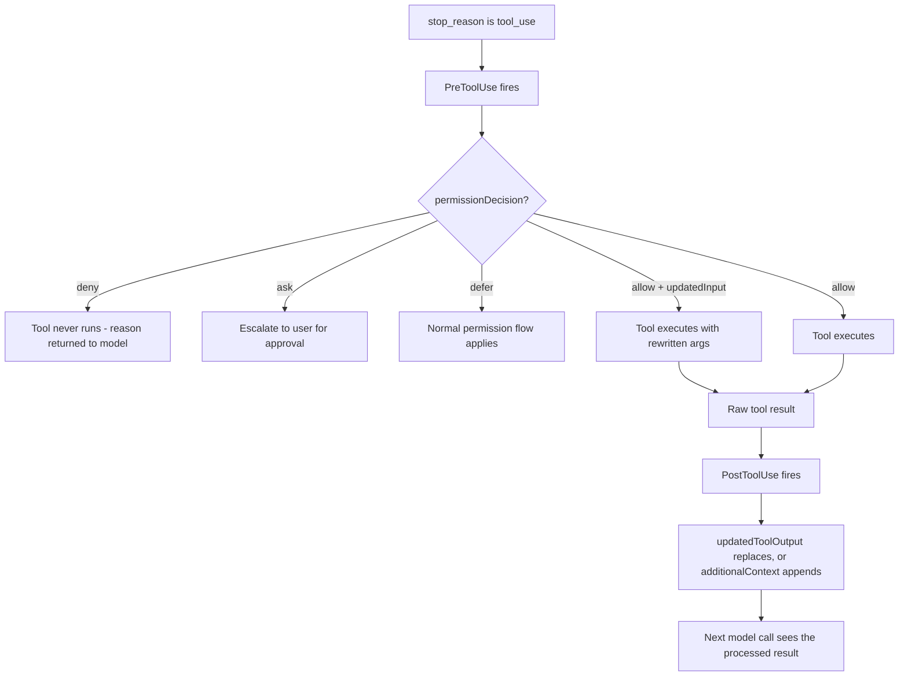
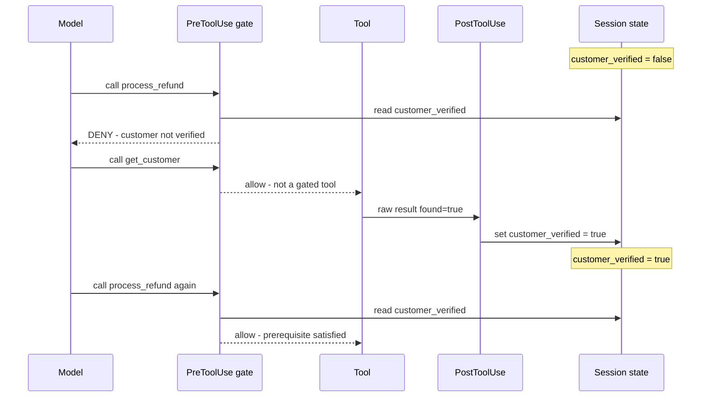
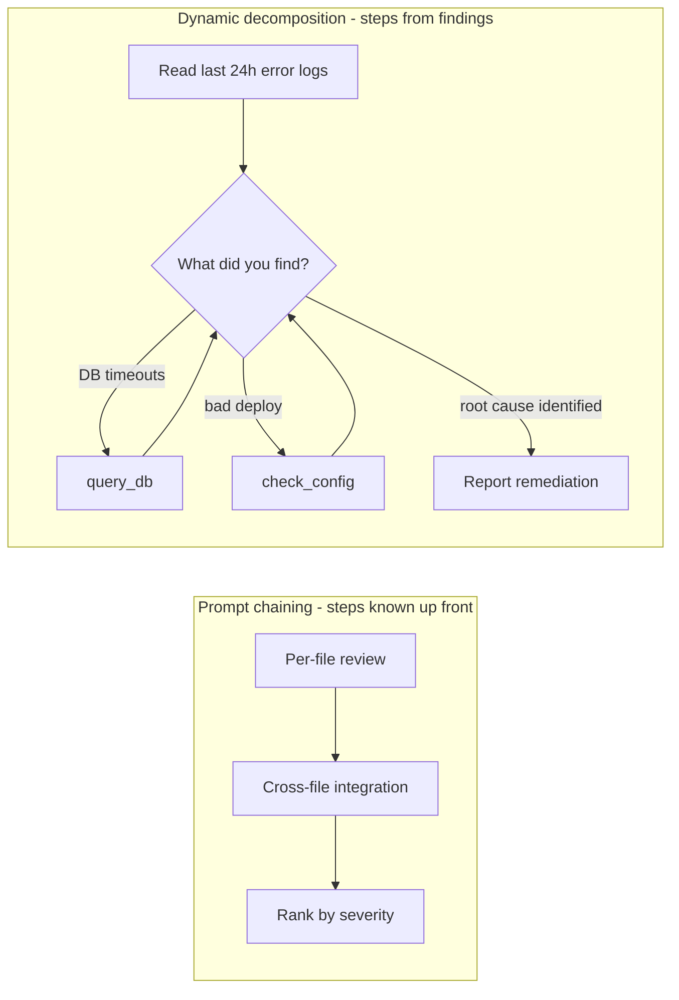

---
tags:
  - CCA-F
  - domain-1
  - hooks
  - agentic-architecture
  - task-decomposition
  - youtube-course
date: 2026-08-03
status: done
domain: "1 of 5"
source: "Peace Of Code — Claude Certified Architect Ep 05"
---

# 🪝 EP05 — PreToolUse, PostToolUse Hooks & Task Decomposition

> [!NOTE] Exam Coverage
> The **closing episode of Domain 1**. Maps to **Domain 1 — Agentic Architecture & Orchestration** (27% of the exam), task statements **1.5** (hooks) and **1.6** (task decomposition), with the escalation material touching **Domain 5 — Context Management & Reliability**, task statements **5.2** (escalation) and **5.6** (provenance). Covers why prompt instructions cannot guarantee compliance, `PreToolUse` as a policy gate, `PostToolUse` as a normalization stage, prerequisite gates as a two-hook state machine, structured handoff summaries, and prompt chaining versus dynamic decomposition — plus the exam's distractor patterns.

**Back to:** [[CCA-F Study Roadmap]] · **Domain note:** [[D1 - Agentic Architecture & Orchestration]] · **Deck:** [[EP05 - Flashcards]]
**Source:** [Peace Of Code — Ep 05 (45 min)](https://www.youtube.com/watch?v=JJBcpwpsKzk) · Level: college / professional-certification · Question mix calibrated MCQ-heavy (40 / 40 / 20)
**Previous:** [[EP04 - Multi-Agent System in Python (Claude SDK)]]

---

## 1. Outline

- [1. Outline](#1-outline)
- [2. Key Terms](#2-key-terms)
- [3. Concept Summaries](#3-concept-summaries)
  - [3.1 Why Prompt Instructions Cannot Guarantee Anything](#31-why-prompt-instructions-cannot-guarantee-anything)
  - [3.2 What a Hook Is](#32-what-a-hook-is)
  - [3.3 Where the Two Hooks Sit in the Loop](#33-where-the-two-hooks-sit-in-the-loop)
  - [3.4 PostToolUse — Normalization Before the Model Sees It](#34-posttooluse--normalization-before-the-model-sees-it)
  - [3.5 PreToolUse — The Policy Gate](#35-pretooluse--the-policy-gate)
  - [3.6 Prerequisite Gates — A Two-Hook State Machine](#36-prerequisite-gates--a-two-hook-state-machine)
  - [3.7 Hand-Rolled Hooks vs the Real Hook System](#37-hand-rolled-hooks-vs-the-real-hook-system)
  - [3.8 Structured Handoff Summaries](#38-structured-handoff-summaries)
  - [3.9 Prompt Chaining vs Dynamic Decomposition](#39-prompt-chaining-vs-dynamic-decomposition)
  - [3.10 Exam Question Patterns and Distractors](#310-exam-question-patterns-and-distractors)
- [4. Diagrams](#4-diagrams)
- [5. Worked Examples](#5-worked-examples)
- [6. Practice Questions](#6-practice-questions)
- [7. Cheat Sheet](#7-cheat-sheet)

---

## 2. Key Terms

| Term | Definition | Source |
|---|---|---|
| **Probabilistic instruction** | A rule written in a prompt. The model *should* comply and usually does, but the failure rate is non-zero. The instructor's framing: writing it in the prompt "is making a **request**". | [03:29] |
| **Deterministic enforcement** | The same rule written in code, where the model has no ability to override it. The answer to any exam stem containing *guarantee*, *must never*, or *policy requires*. | [07:13] |
| **Hook** | Code that intercepts the agentic loop at a defined moment. The instructor's definition: *"pieces of code that intercept the flow at specific moments."* | [07:51] |
| **`PreToolUse`** | Fires **before** a tool call executes. Can allow, deny, ask, defer, or rewrite the tool's input. The policy-enforcement hook. | [08:23] |
| **`PostToolUse`** | Fires **after** a tool call succeeds, still **before** the next model call. Can replace the tool output or append context. The normalization hook. | [10:10] |
| **`permissionDecision`** | The `PreToolUse` output field that decides the call's fate: `"allow"`, `"deny"`, `"ask"`, or `"defer"`. | *(correction — §3.5)* |
| **`updatedToolOutput`** | The `PostToolUse` output field that **replaces** the tool's result before Claude sees it. `additionalContext` appends instead of replacing. | *(correction — §3.4)* |
| **Pass-through** | A hook returning the input untouched for tools it doesn't care about. The instructor: *"a hook should be a pass-through for everything it doesn't care about."* | [14:17] |
| **Hook registry** | The instructor's array of hook functions, iterated on each tool call. In the real SDK this is the `hooks` option keyed by event name with matchers. | [15:07] |
| **Matcher** | The official filter deciding which hooks fire for which tools — `"Bash"`, `"Edit|Write"`, `"mcp__memory__.*"`. Replaces the lecture's hand-written `if tool_name != ...` guard. | *(expansion — §3.7)* |
| **Prerequisite gate** | A `PreToolUse` hook that blocks downstream tools until an upstream tool has succeeded and set a session flag. | [22:21] |
| **Session flag** | The state a prerequisite gate reads — here `session["customer_verified"]`, set by a `PostToolUse` hook after `get_customer` succeeds. | [25:02] |
| **Escalation tier** | Where a blocked operation is routed — the lecture hard-codes `"senior support"`. | [20:37] |
| **Structured handoff summary** | A self-contained package handed to the next agent or human so they need not reconstruct context from the transcript. | [33:42] |
| **Prompt chaining** | Decomposition into a **predefined** sequence; output of step *n* feeds step *n+1*. Use when the steps are known up front. | [38:26] |
| **Dynamic decomposition** | Steps **generated at runtime** from what the agent discovers. Use when the workflow depends on findings. | [38:03] |
| **Attention dilution** | Why a 10-file review is split into per-file then cross-file passes rather than done at once. | *(see [[D1 - Agentic Architecture & Orchestration]] §1.6)* |

---

## 3. Concept Summaries

### 3.1 Why Prompt Instructions Cannot Guarantee Anything

*Question: the system prompt says "only process refunds under $500". Why is that not a control?*

Because it is a **request**, not a constraint. This is the episode's thesis and the instructor states it well: *"When you write a rule in your system prompt, never process refund above $500, you are making a request. It is not written in stone."*

Language models are probabilistic. They follow instructions *most of the time* — and the instructor's emphasis on that phrase is the whole point, because "most of the time" is not a property you can build a payment system on. He is blunt about the business framing too: you cannot ship something that works 98% of the time and write off the other 2%.

His second example is subtler and more valuable than the outright-disobedience one. The prompt says *don't process refunds over $500*. It does **not** say *don't process refunds over $500 even for verified customers*. A capable model may reason that the rule was clearly aimed at unverified customers, decide a verified customer is a different case, and approve $2,000. Nothing malfunctioned — the model **filled a gap in an underspecified rule**, which is exactly what you normally want it to do. Prompt rules fail not only by being ignored but by being *interpreted*.

> [!IMPORTANT] The exam's trigger words
> The instructor's tip is accurate and worth memorising: if the stem contains **"guarantee"**, **"must never"**, **"policy requires"**, **"100%"**, or **"reliably"**, the answer is **programmatic enforcement** — a hook — and never a prompt change. This holds even when the question offers a tempting "make the prompt more explicit" option.
> Consistent with [[D1 - Agentic Architecture & Orchestration]] §1.4 *Enforcement: Programmatic vs Prompt-Based*

**In your own words:** A prompt rule is a request to a probabilistic system. It fails by being ignored *and* by being reasonably reinterpreted. Neither is acceptable for money.

*See PQ 1, 2, 15.*

---

### 3.2 What a Hook Is

*Question: what makes hook enforcement categorically different from prompt enforcement?*

The model is not consulted. A hook is code that runs at a fixed point in the loop and whose decision the model cannot argue with, route around, or reinterpret. The instructor's contrast is exactly right:

| | Prompt instruction | Hook |
|---|---|---|
| Nature | Probabilistic | Deterministic |
| Model can override? | Yes — non-zero failure rate | **No** |
| Expressed as | Natural language | Code |
| Guarantee | "Most of the time" | 100% |

His React analogy lands for anyone with front-end experience — before mount, after mount, before update — with the difference that the lifecycle here is **tool usage** rather than component rendering. Same shape: named moments in someone else's execution flow where you get to inject your own code.

What a `PreToolUse` hook can do, per the instructor: check prerequisites, enforce policies, block the call entirely, or skip it. That list is close to the official capability set, and §3.5 gives the precise version.

**In your own words:** A hook is a point in the loop where your code runs and the model doesn't get a vote.

*See PQ 3, 4.*

---

### 3.3 Where the Two Hooks Sit in the Loop

*Question: given `stop_reason: "tool_use"`, what runs in what order?*

Four steps, and the ordering is the whole exam question:

1. **`PreToolUse`** — the interception window *before* execution. Allow, deny, ask, defer, or rewrite the input.
2. **The tool executes** — assuming step 1 allowed it.
3. **`PostToolUse`** — fires on success, with the raw result available. Still **before** the next model call.
4. **The result reaches the model** — as a `tool_result` block in the next request.

The instructor's mnemonic for exam triage is sound and worth internalising:

> **Policy, permission, ordering, blocking → `PreToolUse`.**
> **Normalization, formatting, conversion, logging → `PostToolUse`.**

He also makes the causal argument for why enforcement *must* be pre and not post: *"It's not like a do-while loop. You execute it and then you check."* If the refund already fired, a post-hook discovering it was out of policy is writing an incident report, not enforcing a policy. For irreversible operations there is no post-hoc enforcement — only post-hoc detection.

> [!TIP] Transcription artifacts in this episode
> The auto-captions mangle a lot here. Recognise these so you don't second-guess yourself on review:
> - **"runs before the model season"** [43:55] → *runs before the model **sees it*** — and this claim is **correct**, see §3.4
> - **"two whole hook approach... Not whole hook approach"** [25:51] → *a **two-hook** approach*
> - **"pre fund processor"** [30:51] → *refund processor*
> - **"each sub agent has its own sub agent group"** / **"it start rate"** [29:43] → *its own **agentic loop*** / *it **starts***
> - **"Answer me."** [16:19] → stray artifact mid-sentence, not an instruction
> - **"cloud certified exam"** [41:42] → *Claude Certified*
> - **"$2,000 rupees"** [02:57] → the host immediately self-corrects to dollars
> - **Order ID drift:** he says he'll test `O102` at [28:33]; the run at [29:24] logs `O100`. The $750 amount is what matters.
> - **"blocked process process refund"** [31:03] → duplication in the log narration

**In your own words:** Pre fires before the call and can stop it. Post fires after the call and can rewrite what the model reads. Irreversible actions can only be governed by pre.

*See PQ 5, 6, 16.*

---

### 3.4 PostToolUse — Normalization Before the Model Sees It

*Question: `lookup_order` returns `{"status": 3, "created": 1735689600}`. Whose job is it to make that presentable?*

Yours, in a `PostToolUse` hook. The instructor's setup is realistic: he deliberately **degraded** his fake DB from the clean version in EP04 to numeric status codes and epoch timestamps, *"because this is how you will receive the data from the database."* Real systems return integers and Unix time, not `"delivered"` and `"3 January 2026"`.

His `normalize_order_result(tool_name, raw_result)` does two things: map the status code to English, and convert the epoch to a date. And it opens with a guard clause he explains well:

```python
def normalize_order_result(tool_name: str, raw_result: dict) -> dict:
    if tool_name != "lookup_order":          # early return
        return raw_result                     # pass-through
    ...
```

> *"A hook should be a pass-through for everything it doesn't care about."*

That is the correct instinct, and in the real hook system it is expressed declaratively by a **matcher** rather than an `if` (see §3.7).

The payoff is that the *model* never sees `status: 3`. It receives `status: "delivered"` and reasons over meaning instead of guessing at an integer — which both improves the final answer and removes a hallucination surface.

> [!WARNING] The result-modification field is `updatedToolOutput`, not a bare return value — verified against official docs
> The lecture's hook returns a plain modified dict, which works only because the lecture calls its own function inside its own loop. In the real SDK, a `PostToolUse` hook returns a defined shape:
>
> ```python
> return {
>     "hookSpecificOutput": {
>         "hookEventName": "PostToolUse",
>         "updatedToolOutput": normalized,   # REPLACES the result before Claude sees it
>     }
> }
> ```
>
> Two fields, two behaviours: **`updatedToolOutput`** *replaces* the output (any tool, both SDKs); **`additionalContext`** *appends* information to it. `updatedMCPToolOutput` is the older MCP-only field and is **deprecated**. Return `{}` to pass through unchanged.
> **Exam answer: `updatedToolOutput` to replace, `additionalContext` to append.** Real code: same.
> Source: [Hooks in the SDK](https://code.claude.com/docs/en/agent-sdk/hooks) → *Outputs* · see also [[D1 - Agentic Architecture & Orchestration]] §1.5

> [!IMPORTANT] The lecture's timing claim is correct
> His summary card says the normalization hook *"runs before the model sees it"* — and that is exactly right. `PostToolUse` fires after the tool **succeeds** but before the **next model call**, which is why it can rewrite what lands in the context. It is "post" relative to the *tool*, not to the *model*.

**In your own words:** Post-tool is where raw becomes readable. The model reads your normalized version, never the database's.

*See PQ 7, 8, 17.*

---

### 3.5 PreToolUse — The Policy Gate

*Question: a $750 refund arrives. Where does it die?*

Before `process_refund` ever runs. The instructor's `enforce_refund_policy` hook is the episode's centrepiece:

```python
def enforce_refund_policy(tool_name: str, tool_params: dict) -> dict:
    if tool_name != "process_refund":
        return {"allowed": True}                      # pass-through
    if tool_params.get("amount", 0) > 500:
        return {
            "allowed": False,                          # lecture's own shape
            "reason": "Refund exceeds $500",
            "action_required": "escalate to human",
            "escalation_tier": "senior support",
        }
    return {"allowed": True}
```

The reasoning he attaches matters as much as the code: *"You don't just leave it to the model to decide if it has to refund or not. You, as the business owner, have the right to block that particular thing because that is what your policy is."* Business-critical rules are not delegated to a probabilistic system — that is the whole lesson of Domain 1's enforcement material.

Notice the block payload carries **four** fields, not one. Denying without a reason, a required action, and a routing tier produces exactly the useless escalation §3.8 is about.

> [!WARNING] `{"allowed": false}` is the lecture's invention — verified against official docs
> The real `PreToolUse` contract is a nested `hookSpecificOutput` object:
>
> ```python
> return {
>     "hookSpecificOutput": {
>         "hookEventName": "PreToolUse",
>         "permissionDecision": "deny",
>         "permissionDecisionReason": "Refunds over $500 require human approval",
>     }
> }
> ```
>
> `permissionDecision` takes **four** values, not two: **`"allow"`** (permit), **`"deny"`** (block), **`"ask"`** (escalate to the user for manual approval), and **`"defer"`** (decline to decide — normal permission flow applies). A shell-command hook can equivalently **exit 2**, which blocks and feeds stderr back to the model as an error. `permissionDecisionReason` is delivered to the model *so it stops retrying* — omit it and the model may loop.
>
> A third capability the lecture doesn't mention: **`updatedInput`** rewrites the tool's arguments before execution. Pair it with `permissionDecision: "allow"` to auto-approve the modified call — so a hook can *sanitize* rather than only *veto*.
>
> **Exam answer: `permissionDecision` with `allow` / `deny` / `ask` / `defer`.** Real code: same.
> Source: [Hooks reference](https://code.claude.com/docs/en/hooks) → *PreToolUse* · consistent with [[D1 - Agentic Architecture & Orchestration]] §1.5

> [!IMPORTANT] Multi-hook precedence — not in the lecture, and testable **(expansion)**
> When several hooks or permission rules apply to one call, the decisions resolve in a fixed order:
>
> $$\texttt{deny} \succ \texttt{defer} \succ \texttt{ask} \succ \texttt{allow}$$
>
> **If any hook returns `deny`, the call is blocked regardless of what every other hook says.** That is what makes layered policy hooks safe to compose: an `allow` can never override a `deny`.
> Source: [Hooks in the SDK](https://code.claude.com/docs/en/agent-sdk/hooks) → *Outputs*

**In your own words:** Pre-tool is the veto. Four decisions, not two, and `deny` always wins.

*See PQ 9, 10, 18.*

---

### 3.6 Prerequisite Gates — A Two-Hook State Machine

*Question: how do you guarantee `process_refund` never runs before `get_customer`?*

Not with one hook — with two, cooperating through session state. This is the episode's most sophisticated pattern and the instructor flags it as high-yield: *"it comes a lot in the exam."*

The definition: **prerequisite gates are `PreToolUse` hooks that track session state and block downstream tools until an upstream tool has successfully completed and set a verified flag.**

The mechanism splits across both hook types, which is what makes it interesting:

| Step | Hook | Action |
|---|---|---|
| 1 | `PostToolUse` on `get_customer` | If the result says `found`, set `session["customer_verified"] = True` |
| 2 | `PreToolUse` on `process_refund` / `lookup_order` | If `not session["customer_verified"]` → **deny** |

```python
# PostToolUse — the flag setter
def update_verification_state(tool_name, raw_result, session):
    if tool_name == "get_customer" and raw_result.get("found"):
        session["customer_verified"] = True     # only on success
    return raw_result

# PreToolUse — the gate
def prerequisite_gate(tool_name, tool_params, session):
    if tool_name in ("process_refund", "lookup_order"):
        if not session.get("customer_verified"):
            return {"allowed": False, "reason": "Customer not verified"}
    return {"allowed": True}
```

The instructor untangles the apparent circularity clearly. *"On what basis are you putting that hard violation? Is that the customer has been verified or not? When will you know if the customer has been verified or not? **After** the get customer tool has been executed."* The gate's *authority* is pre-tool; the gate's *evidence* is post-tool. Hence two hooks.

One detail worth stressing because it is the difference between a gate and a placebo: the flag flips **only if the customer was actually found**. The instructor's comment is *"flip the verification flag only if the customer succeeded."* A flag set merely because the tool *ran* would let a failed lookup unlock the refund path — the exact failure the gate exists to prevent.

> [!IMPORTANT] The canonical exam stem for this pattern
> The instructor quotes it almost verbatim at [43:10]: *"Support agent occasionally calls `process_refund` before `get_customer` despite system prompt instruction. What most reliably guarantees proper execution ordering?"* — Answer: **a prerequisite gate implemented as a `PreToolUse` hook.** The word **"occasionally"** is the tell that a prompt instruction is already in place and already failing.
> Consistent with [[D1 - Agentic Architecture & Orchestration]] §1.4 *Prerequisite Gates*

**In your own words:** One hook records that the prerequisite succeeded; the other refuses to proceed without that record. Authority is pre, evidence is post.

*See PQ 11, 12, 18.*

---

### 3.7 Hand-Rolled Hooks vs the Real Hook System

*Question: the lecture's hooks are Python functions in an array that his own loop iterates. Is that what `PreToolUse` means?*

The **pattern** is right; the **mechanism** is not the one the exam names. This is the same gap EP04 had with the `Task` tool — except here the instructor does not retract it, so you have to draw the line yourself.

What the lecture builds: two module-level arrays (`PRE_TOOL_HOOKS`, `POST_TOOL_HOOKS`), each holding functions with an `if tool_name != ...` guard, called by `apply_pre_tool_hooks()` / `apply_post_tool_hooks()` at the right points in a loop he wrote. Everything is his code, including the dispatch.

> [!IMPORTANT] `PreToolUse` and `PostToolUse` are **named lifecycle events**, not a convention you invent — verified against official docs
> In Claude Code and the Agent SDK, hooks are **registered**, not called. You never write the dispatch:
>
> ```python
> from claude_agent_sdk import query, ClaudeAgentOptions, HookMatcher
>
> async def enforce_refund_policy(input_data, tool_use_id, context):
>     if input_data["tool_input"].get("amount", 0) > 500:
>         return {"hookSpecificOutput": {
>             "hookEventName": "PreToolUse",
>             "permissionDecision": "deny",
>             "permissionDecisionReason": "Refunds over $500 require human approval",
>         }}
>     return {}
>
> options = ClaudeAgentOptions(
>     hooks={"PreToolUse": [HookMatcher(matcher="process_refund", hooks=[enforce_refund_policy])]}
> )
> ```
>
> Four differences that are each individually testable:
>
> | | Lecture | Official |
> |---|---|---|
> | Registration | Append to your own array | `options.hooks` keyed by **event name**, or `.claude/settings.json` |
> | Filtering | `if tool_name != "x": return` | A **`matcher`** — `"Bash"`, `"Edit\|Write"`, `"mcp__memory__.*"` |
> | Callback signature | `(tool_name, params)` — his choice | **`(input_data, tool_use_id, context)`** |
> | Return value | `{"allowed": bool}` — his choice | `hookSpecificOutput` with `permissionDecision` / `updatedToolOutput` |
>
> Shell-command hooks are also first-class: they receive the event as **JSON on stdin** (`tool_name`, `tool_input`, `session_id`, `cwd`, …) and signal a block by **exiting 2**. Handler types include `command`, `http`, `mcp_tool`, `prompt`, and `agent`.
>
> **Exam answer: the named events and their official contract.** The lecture's arrays are a faithful *illustration* of the concept in an SDK that has no hook system — the raw `anthropic` package doesn't, which is why he had to build it.
> Source: [Hooks in the SDK](https://code.claude.com/docs/en/agent-sdk/hooks) · [Hooks reference](https://code.claude.com/docs/en/hooks)

> [!WARNING] There are far more than two hook events — verified against official docs
> The lecture presents `PreToolUse` and `PostToolUse` as *the* two hooks. They are the two the exam leans on hardest, but Claude Code defines roughly **thirty** lifecycle events, and the Agent SDK exposes a large subset **with Python/TypeScript parity gaps**:
>
> | Event | Python | TS |
> |---|---|---|
> | `PreToolUse` · `PostToolUse` · `PostToolUseFailure` | ✅ | ✅ |
> | `UserPromptSubmit` · `Stop` · `PreCompact` · `PermissionRequest` | ✅ | ✅ |
> | `SubagentStart` · `SubagentStop` · `Notification` | ✅ | ✅ |
> | `PostToolBatch` · `SessionStart` · `SessionEnd` · `MessageDisplay` · `PostCompact` · `StopFailure` | ❌ | ✅ |
>
> If a question offers a hook event you don't recognise, it is probably real. **Exam answer: `PreToolUse` for policy, `PostToolUse` for normalization** — but don't reject a stem because it names `SubagentStop` or `PreCompact`.
> Source: [Hooks in the SDK](https://code.claude.com/docs/en/agent-sdk/hooks) → *Available hooks* · matches [[D1 - Agentic Architecture & Orchestration]] §1.5

**In your own words:** He hand-built the mechanism because the raw SDK has none. The concept transfers; the field names and registration do not.

*See PQ 13, 14.*

---

### 3.8 Structured Handoff Summaries

*Question: the $750 refund is blocked and escalated. What does the human receive?*

In the lecture's run, not much — and the instructor is refreshingly harsh about it: a human opening a ticket that says *"customer escalated, please assist"* has to read the entire conversation to reconstruct what happened. *"That is pathetic. That is useless."*

The principle: **escalating without a structured handoff summary forces the receiver to reconstruct context from the transcript, which defeats the purpose of the loop.** It applies identically whether the receiver is a human or the next subagent — and note it is the same failure mode as EP03's prose-handoff problem, one hop further along. A receiver with no context either does the work again or guesses.

> [!WARNING] The lecture never implements this — the shape below is reconstructed
> At [34:39] the instructor starts typing a handoff prompt, then: *"Did I... No, I didn't implement it here. No worries."* He describes the fields verbally and moves on. So treat the code below as the vault's synthesis of his description plus [[D1 - Agentic Architecture & Orchestration]] §1.4 — not as something demonstrated on screen.

A handoff payload should be **self-contained**, meaning the receiver needs nothing else:

```python
escalation_params = {
    "customer_id": "C001",
    "handoff_summary": (
        "Customer C001 (verified) requested a refund for order O100, $750. "
        "Order status: delivered. Refund blocked by policy: agent authorization "
        "limit is $500. No refund has been issued."
    ),
    "root_cause": "Refund amount exceeds agent authorization limit",
    "recommended_action": "Approve or decline the $750 refund",
    "priority": "normal",
    "routing_tier": "senior_support",
}
```

Per [[D1 - Agentic Architecture & Orchestration]] §1.4 the required minimum is four items: **customer ID · root cause · action details · recommended action**. The lecture adds `priority` and `routing_tier`, which is a sensible extension — routing is what makes an escalation actionable rather than merely filed.

Two exam-relevant points the instructor makes almost in passing. First, his blocked-refund payload from §3.5 already carried `reason`, `action_required`, and `escalation_tier` — the handoff *starts* at the hook, not after it. Second, the pretty final message in his demo *"came from the LLM itself"* — the model formatted it nicely, which is precisely the trap: a well-worded escalation is not the same as a complete one, and you cannot rely on the model to invent the fields you never gave it.

**In your own words:** Escalation without a self-contained summary just moves the problem. Build the payload in the hook that blocks the call.

*See PQ 4, 15.*

---

### 3.9 Prompt Chaining vs Dynamic Decomposition

*Question: one question decides which decomposition strategy to use. What is it?*

**Do you know the steps before you start?**

That single test is the instructor's framing and it is the right one. Know the steps → **prompt chaining**. Depends on what you discover → **dynamic decomposition**.

| | Prompt chaining | Dynamic decomposition |
|---|---|---|
| Steps | Predefined, fixed order | Generated at runtime from findings |
| Data flow | Output of step *n* → step *n+1* | Next step chosen from the last result |
| Control | **High** | **Low** |
| Reproducibility | High — good for compliance | Low by nature |
| Analogy | An assembly line; a CI/CD pipeline | An investigation |
| Best for | Code review, migrations | Bug hunts, incident response |

**Prompt chaining** — his example is a PR review: review each changed file, then chain a second prompt (*"given these per-file reviews, identify cross-cutting concerns"*), then a third to rank issues by severity. You knew all three steps before you started. This matches [[D1 - Agentic Architecture & Orchestration]] §1.6's per-file → cross-file split, whose justification is avoiding **attention dilution** across 10+ files at once.

**Dynamic decomposition** — his example is a production incident: *"you don't know anything about the production issue. How would you write the steps when you haven't even debugged it?"* The prompt supplies a **starting point and a stopping condition**, not a sequence:

> *"You are investigating a production incident. Start with error logs from the last 24 hours. Based on what you find, decide your next investigation step. Continue until you identify root cause and remediation."*

Plus **generic** tools — `read_logs`, `query_db`, `check_config`, `trace_request` — because you cannot pre-select specific tools for an unknown problem.

> [!IMPORTANT] The exam's warning, stated by the instructor
> *"Do not use prompt chaining for open-ended tasks. Predefined steps become wrong the moment actual findings diverge from the initial assumptions."* That is the failure mode: chaining doesn't degrade gracefully on an open-ended task, it confidently executes a plan that stopped applying at step 2.

He also notes the two are not exclusive: EP04's capstone was prompt chaining *at the coordinator level* (verification subagent, then refund subagent, in fixed order), and you can chain prompts **inside** a single subagent as well. Decomposition strategy is a per-level choice.

**In your own words:** Known steps, fixed order, high control → chaining. Unknown terrain, steps from findings → dynamic. Chaining an open-ended task fails confidently.

*See PQ 16, 17.*

---

### 3.10 Exam Question Patterns and Distractors

*Question: what wrong answers will the exam offer, and why are they attractive?*

The instructor closes with a distractor list that is worth memorising as distractors — these options *will* appear and each is plausible:

| Distractor | Why it's offered | Why it's wrong |
|---|---|---|
| **"Add a stronger prompt instruction"** | Feels like the direct fix | **Always wrong for a guarantee.** Still probabilistic. The instructor: *"even if the question says so, you have to go for no"* |
| **"Add few-shot examples"** | Genuinely improves behaviour | Improves **consistency**, not **compliance**. You cannot enumerate enough examples to cover every case |
| **"Predefine all the steps"** | Sounds rigorous | Wrong for **open-ended** tasks — that's dynamic decomposition's territory |
| **"Retry on failure"** | Sounds defensive | Detects after the fact. Useless for an irreversible action already taken |

His summary mapping, which doubles as the fastest triage table in the episode:

| Stem says | Answer |
|---|---|
| Guarantee · must never · policy requires | Programmatic enforcement (a hook) |
| Data normalization · format conversion | `PostToolUse` |
| Policy violation · blocking · permission | `PreToolUse` |
| Tool ordering · "occasionally calls X before Y" | Prerequisite gate (`PreToolUse` + session flag) |
| Escalation to human or next agent | Structured handoff summary |
| Steps known up front | Prompt chaining |
| Steps emerge from discoveries | Dynamic decomposition |

> [!NOTE] Domain 1 weight
> The instructor closes: *"we are done with module one, which is around 27 to 30% of the exam."* The vault and the published blueprint put **Domain 1 at 27%** — use that figure.

**In your own words:** Every "improve the prompt" option is a trap when the stem asks for a guarantee. Few-shot buys consistency, never compliance.

*See PQ 2, 14, 18.*

---

## 4. Diagrams


*The two interception windows. Note `PostToolUse` sits **before** the next model call — "post" is relative to the tool, not the model.*


*The prerequisite gate as a two-hook state machine: `PreToolUse` holds the authority, `PostToolUse` supplies the evidence.*


*Chaining is a fixed pipeline; dynamic decomposition is a loop that re-plans on each finding.*

---

## 5. Worked Examples

### Example 1 — Rewrite the lecture's block into the official contract

**Problem.** The lecture's hook returns `{"allowed": False, "reason": "Refund exceeds $500", "escalation_tier": "senior support"}`. Express the same policy as a real Agent SDK `PreToolUse` hook.

**Step 1 — Fix the callback signature.**
*(why: the SDK calls your hook; it passes `(input_data, tool_use_id, context)`, not the two arguments the lecture chose.)*
```python
async def enforce_refund_policy(input_data, tool_use_id, context):
```

**Step 2 — Drop the tool-name guard and use a matcher instead.**
*(why: filtering is declarative. The `if tool_name != ...` early return becomes `matcher="process_refund"` at registration, so the hook only fires for that tool.)*
```python
    amount = input_data["tool_input"].get("amount", 0)
```

**Step 3 — Return the nested decision object.**
*(why: `{"allowed": False}` means nothing to the SDK. The decision must be `permissionDecision` inside `hookSpecificOutput`, tagged with `hookEventName`.)*
```python
    if amount > 500:
        return {"hookSpecificOutput": {
            "hookEventName": "PreToolUse",
            "permissionDecision": "deny",
            "permissionDecisionReason": (
                "Refund of $%d exceeds the $500 agent limit. "
                "Escalate to senior support." % amount
            ),
        }}
    return {}
```
*(why the reason string matters: it is delivered to the model so it stops retrying. Denying silently invites a retry loop.)*

**Step 4 — Register it.**
*(why: the hook must be attached to the **event**, or it never runs — there is no array for your loop to iterate.)*
```python
options = ClaudeAgentOptions(hooks={
    "PreToolUse": [HookMatcher(matcher="process_refund", hooks=[enforce_refund_policy])]
})
```

**Answer:** same policy, four structural changes — SDK signature, matcher-based filtering, `hookSpecificOutput` with `permissionDecision: "deny"`, and registration under the event name. Returning `{}` is the pass-through.

---

### Example 2 — Trace the $750 refund through both hooks

**Problem.** Customer `C001` is verified; order `O100` is $750. The agent limit is $500. Trace the run and identify every point where a hook acts.

**Step 1 — `get_customer` runs, `PostToolUse` sets the flag.**
*(why: the prerequisite gate needs evidence before it can allow anything downstream. The flag flips only because `found` is true.)*
`session["customer_verified"] = True`.

**Step 2 — `lookup_order` passes the gate, then `PostToolUse` normalizes.**
*(why: the gate allows it — the prerequisite is satisfied. Then normalization converts `status: 3` → `"delivered"` and the epoch → a readable date, so the model reads meaning, not integers.)*
The instructor's log at [31:03] shows exactly this: *"calling lookup order... this is the normalized result."*

**Step 3 — `process_refund` is requested; `PreToolUse` denies it.**
*(why: two gates are in play and both are consulted. The prerequisite gate passes (verified), but the policy gate sees $750 > $500 and returns `deny`. Per the precedence rule, one `deny` settles it.)*
Log: *"blocked process refund. The reason being the refund $750 exceeds the $500 agent limit."*

**Step 4 — The loop reaches `end_turn` and the model writes the summary.**
*(why: the denial reason went back to the model as context, so it composes the customer-facing message from the block reason rather than retrying.)*
Output: verification confirmed; refund not processed; escalate to senior support.

**Answer:** three hook firings — `PostToolUse` (flag), `PostToolUse` (normalize), `PreToolUse` (deny) — and **zero** refund executions. The $750 never reached the payment path.

---

### Example 3 — Quantify why 98% compliance is not compliance

**Problem.** A prompt-enforced refund limit is followed 98% of the time. The system processes 10,000 refund decisions a month. Quantify the exposure, and compare with a hook.

**Step 1 — Expected violations per month.**
*(why: turns a vague "non-zero failure rate" into a number a business can react to.)*

$$E[\text{violations}] = N \times (1 - p) = 10{,}000 \times 0.02 = 200$$

**Step 2 — Probability of a clean run of just 100 decisions.**
*(why: shows the failure isn't rare at the margin — it's near-certain at any real volume.)*

$$P(\text{zero violations}) = p^{n} = 0.98^{100} \approx 0.133$$

So even across only 100 decisions there is an ~86.7% chance of at least one policy breach.

**Step 3 — Attach money.**
*(why: the instructor's $500 limit means each violation is unbounded above it; assume a conservative $1,500 average over-refund.)*

$$200 \times \$1{,}500 = \$300{,}000 \text{ per month}$$

**Step 4 — The hook's number.**
*(why: this is the categorical difference, not an incremental improvement.)* A `PreToolUse` hook checks `amount > 500` in code, so $p = 1$ for the amount rule:

$$E[\text{violations}] = 10{,}000 \times 0 = 0$$

**Answer:** ~**200** violations/month and ~**$300k** exposure under prompt enforcement, versus **0** under a hook. The instructor's *"you don't want a payment system that works 98% of the time"* is not rhetoric — at 10,000 decisions, 98% is a monthly six-figure line item.

---

## 6. Practice Questions

1. Why does the instructor call a system-prompt rule "a request" rather than a constraint? *(§3.1)*

   <details><summary>Answer</summary>
   Because language models are **probabilistic**: they comply most of the time but with a **non-zero failure rate**. The rule has no enforcement mechanism behind it — the model can decline, misapply, or reinterpret it, and nothing intervenes.
   </details>

2. Which exam stem keywords mean the answer is programmatic enforcement rather than a prompt change? *(§3.1, §3.10)*

   <details><summary>Answer</summary>
   **"Guarantee", "must never", "policy requires", "100%", "reliably".** Any of these rules out prompt-based options — including the tempting "write a more explicit instruction".
   </details>

3. State the four-row contrast between a prompt instruction and a hook. *(§3.2)*

   <details><summary>Answer</summary>
   **Nature:** probabilistic vs deterministic. **Model override:** possible vs impossible. **Expressed as:** natural language vs code. **Guarantee:** "most of the time" vs 100%.
   </details>

4. A refund is blocked and escalated with the message "customer escalated, please assist." What is wrong, and what does the receiver now have to do? *(§3.8)*

   <details><summary>Answer</summary>
   There is **no structured handoff summary**, so the receiver must **reconstruct context from the conversation transcript** — defeating the purpose of the loop. The handoff should be self-contained: customer ID, root cause, action details, recommended action (plus priority and routing tier).
   </details>

5. Order these four events and say which can still stop the tool: `PostToolUse`, the model seeing the result, tool execution, `PreToolUse`. *(§3.3)*

   <details><summary>Answer</summary>
   **`PreToolUse` → tool execution → `PostToolUse` → model sees the result.** Only **`PreToolUse`** can stop the tool; by `PostToolUse` the tool has already run.
   </details>

6. Why can't a `PostToolUse` hook enforce a refund limit? *(§3.3)*

   <details><summary>Answer</summary>
   Because the refund **already executed**. As the instructor puts it, enforcement isn't a do-while loop — you can't execute and then check. A post-hook on an irreversible action performs **detection**, not enforcement.
   </details>

7. `lookup_order` returns `{"status": 3, "created": 1735689600}`. Which hook fixes this, what does it produce, and what is the benefit to the model? *(§3.4)*

   <details><summary>Answer</summary>
   **`PostToolUse`.** It maps the numeric status to `"delivered"` and converts the epoch to a readable date. The model then reasons over **meaning instead of integers**, which improves the answer and removes a guessing/hallucination surface.
   </details>

8. Name the `PostToolUse` output field that **replaces** a tool's result, the one that **appends** to it, and the deprecated one. *(§3.4)*

   <details><summary>Answer</summary>
   Replace: **`updatedToolOutput`**. Append: **`additionalContext`**. Deprecated: **`updatedMCPToolOutput`** (MCP tools only). All live inside `hookSpecificOutput`; return `{}` to pass through.
   </details>

9. List the four `permissionDecision` values and what each does. *(§3.5)*

   <details><summary>Answer</summary>
   **`allow`** — permit the call. **`deny`** — block it. **`ask`** — escalate to the user for manual approval. **`defer`** — this hook declines to decide; the normal permission flow applies.
   </details>

10. Three hooks fire on one tool call: two return `allow`, one returns `deny`. What happens, and what is the precedence order? *(§3.5)*

    <details><summary>Answer</summary>
    **The call is blocked.** Precedence is **`deny` > `defer` > `ask` > `allow`** — if any hook returns `deny`, the operation is blocked regardless of the others. This is what makes layered policy hooks safe to compose.
    </details>

11. Define a prerequisite gate, and explain why it needs two hooks rather than one. *(§3.6)*

    <details><summary>Answer</summary>
    A **`PreToolUse` hook that tracks session state and blocks downstream tools until an upstream tool has successfully completed and set a verified flag.** It needs two hooks because the **authority** is pre-tool (only pre can block) but the **evidence** is post-tool (you only know verification succeeded *after* `get_customer` ran).
    </details>

12. In a prerequisite gate, why must the flag flip only when the upstream tool **succeeded**, not merely when it ran? *(§3.6)*

    <details><summary>Answer</summary>
    Because a flag set on mere execution would let a **failed** lookup unlock the refund path — the exact failure the gate exists to prevent. The instructor's guard is *"flip the verification flag only if the customer succeeded"* (`raw_result.get("found")`).
    </details>

13. The lecture implements hooks as arrays of functions its own loop iterates. Name three ways the real hook system differs. *(§3.7)*

    <details><summary>Answer</summary>
    Any three of: **registration** via `options.hooks` keyed by event name (or `.claude/settings.json`) instead of a self-iterated array; **filtering** via a declarative `matcher` instead of an `if tool_name != ...` guard; the **callback signature** `(input_data, tool_use_id, context)`; and the **return shape** `hookSpecificOutput` with `permissionDecision` / `updatedToolOutput` instead of `{"allowed": bool}`.
    </details>

14. The lecture presents `PreToolUse` and `PostToolUse` as the two hooks. Is that the complete set? *(§3.7, §3.10)*

    <details><summary>Answer</summary>
    **No.** Claude Code defines roughly **thirty** lifecycle events; the Agent SDK exposes a large subset with Python/TS parity gaps (`PostToolBatch`, `SessionStart`, `SessionEnd`, `MessageDisplay` are TS-only). Those two are the exam's core pair, but don't reject a stem naming `SubagentStop` or `PreCompact`.
    </details>

15. **Application.** A team's audit finds their prompt-enforced $500 limit was violated 40 times in 20,000 refunds. A colleague proposes adding few-shot examples of correct refusals. Evaluate, and give the fix. *(§3.1, §3.8, §3.10)*

    <details><summary>Answer</summary>
    **Reject it.** Few-shot improves **consistency**, not **compliance** — you cannot enumerate enough examples to cover every case, and the rate stays non-zero. The fix is a **`PreToolUse` hook** denying `amount > 500`, which takes the violation rate to zero deterministically. The denial should also carry a structured handoff (reason, action required, routing tier) so each block escalates usefully.
    </details>

16. **Application.** You are asked to build (a) a monolith-to-microservices migration agent and (b) an on-call incident triage agent. Choose a decomposition strategy for each and justify. *(§3.9)*

    <details><summary>Answer</summary>
    **(a) Prompt chaining** — a migration has known steps up front (map modules → identify boundaries → extract service → update callers → verify), needs high control, and benefits from reproducibility.
    **(b) Dynamic decomposition** — an incident's steps depend on findings; you cannot pre-plan a debug sequence for an unknown failure. Supply a starting point, a stopping condition ("continue until root cause and remediation"), and **generic** tools (`read_logs`, `query_db`, `check_config`, `trace_request`).
    </details>

17. **Application.** A code-review agent uses prompt chaining. Mid-run it discovers the change is a security refactor, not the perf tuning assumed. What fails, and what would you change? *(§3.9)*

    <details><summary>Answer</summary>
    **Prompt chaining doesn't degrade gracefully** — its predefined steps became wrong the moment findings diverged from the initial assumptions, so it will confidently execute an irrelevant plan. Either make the **first** step a classification pass that selects among several chains, or switch to **dynamic decomposition** where the next step is chosen from what each pass reveals.
    </details>

18. **Application.** Requirement: "`process_refund` must never run for an unverified customer, and never above $500. Both must be guaranteed." Specify the hooks, and state what happens if a call violates both. *(§3.5, §3.6)*

    <details><summary>Answer</summary>
    Three hooks. **(1) `PostToolUse`** on `get_customer`: set `session["customer_verified"] = True` only if `found`. **(2) `PreToolUse`** prerequisite gate on `process_refund`: `deny` unless the flag is set. **(3) `PreToolUse`** policy gate on `process_refund`: `deny` if `amount > 500`.
    If a call violates both, **both gates return `deny` and the call is blocked** — `deny` beats every other decision, and there is no ordering subtlety to get wrong. Each denial should carry its own `permissionDecisionReason` so the model knows which rule it hit.
    </details>

---

## 7. Cheat Sheet

| Cue | Note |
|---|---|
| Prompt rule = ? | A **request**. Probabilistic, non-zero failure rate |
| Trigger words → hook | guarantee · must never · policy requires · 100% · reliably |
| `PreToolUse` | **Before** execution. Policy, permission, ordering, blocking |
| `PostToolUse` | **After** the tool, **before** the next model call. Normalization, logging |
| Irreversible action | Only **pre** can enforce; post can only detect |
| `permissionDecision` | `allow` · `deny` · `ask` · `defer` |
| Precedence | **`deny` > `defer` > `ask` > `allow`** — any `deny` blocks |
| Rewrite tool args | `updatedInput` + `permissionDecision: "allow"` |
| Replace tool result | **`updatedToolOutput`** · append with `additionalContext` |
| Shell hook block | **exit 2** — stderr goes back to the model |
| Pass through | Return **`{}`** |
| Registration | `options.hooks` by event name + `HookMatcher`, or `.claude/settings.json` |
| Prerequisite gate | `PostToolUse` sets the flag · `PreToolUse` denies without it |
| Flag discipline | Flip **only on success**, never on mere execution |
| Handoff summary | customer ID · root cause · action details · recommended action |
| Prompt chaining | Steps known up front · fixed order · high control · code review |
| Dynamic decomposition | Steps from findings · low control · incident response |

**Top 5 terms:** `permissionDecision` · `updatedToolOutput` · prerequisite gate · structured handoff summary · prompt chaining vs dynamic decomposition

> [!WARNING] Anti-patterns
> ❌ "Make the prompt more explicit" as an answer to *guarantee* — always wrong
> ❌ Few-shot examples for **compliance** — they buy consistency only
> ❌ Enforcing policy in `PostToolUse` — the action already happened
> ❌ Denying without `permissionDecisionReason` — invites a retry loop
> ❌ Setting a prerequisite flag because the tool ran, not because it succeeded
> ❌ Escalating with "please assist" and no self-contained summary
> ❌ Prompt chaining an open-ended investigation
> ✅ Pre for policy · post for normalization · flag on success only · reason on every deny · handoff built in the blocking hook

> **Synthesis:** This episode closes Domain 1 by inverting its premise — after four episodes on making the model do the work, the lesson is what to take away from it. The dividing line is consequence: probabilistic is fine for *interpretation* (which tool fits, how to phrase an answer), unacceptable for *authorization* (may this refund fire). The two hooks map onto it exactly — `PreToolUse` decides whether reality may change, `PostToolUse` shapes what the model believes about it afterwards. A prerequisite gate is that same idea split across two moments, which is why it needs both. Every distractor the exam offers is a variation on trusting the model with a decision that was never its to make.

---

## ✅ Practice Checklist

- [ ] Can explain why a prompt rule fails by *interpretation* as well as by disobedience
- [ ] Can list the stem keywords that force a programmatic-enforcement answer
- [ ] Can order `PreToolUse`, tool execution, `PostToolUse`, and the model seeing the result
- [ ] Can say why an irreversible action can only be governed pre-execution
- [ ] Can list all four `permissionDecision` values and the precedence order
- [ ] Can write a `PreToolUse` deny in the official `hookSpecificOutput` shape from memory
- [ ] Can name `updatedToolOutput` vs `additionalContext` and which replaces vs appends
- [ ] Can define a prerequisite gate and explain why it takes two hooks
- [ ] Can explain why the verification flag must flip only on success
- [ ] Can list the four required fields of a structured handoff summary
- [ ] Can state the one question that chooses between chaining and dynamic decomposition
- [ ] Can explain why prompt chaining fails on open-ended tasks
- [ ] Can reject "stronger prompt" and "few-shot examples" as compliance answers
- [ ] Knows the lecture's hooks are hand-rolled and how the real registration differs

*Next: [[EP06 - Tool Descriptions & Tool Misrouting]]*
