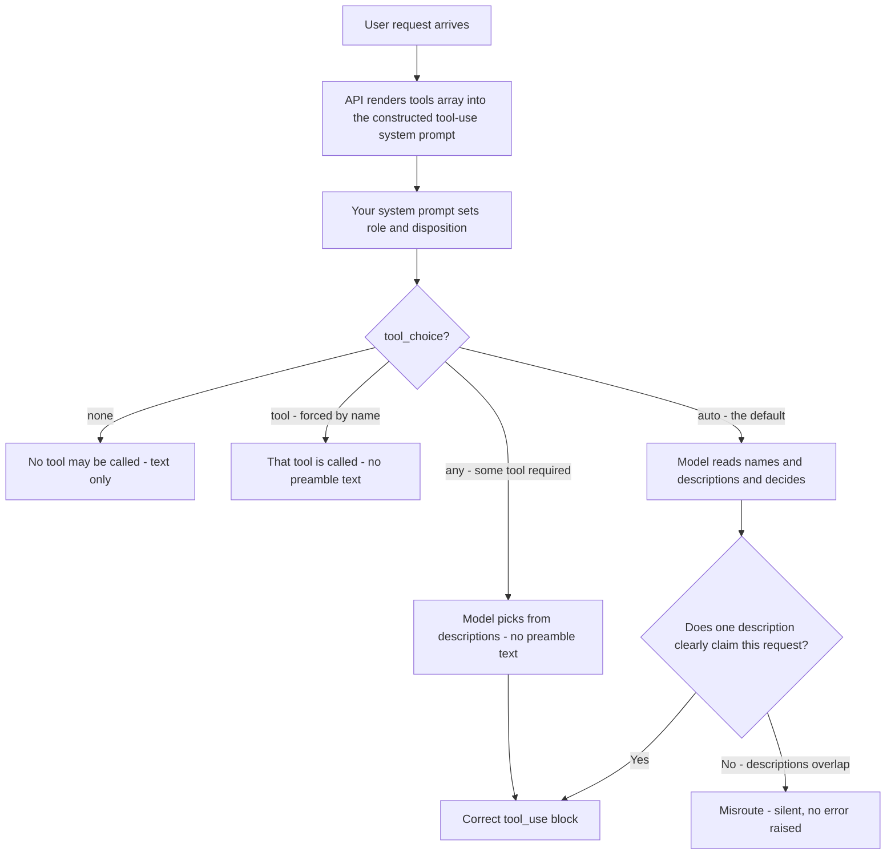
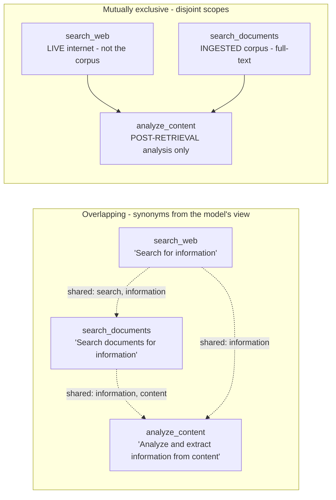
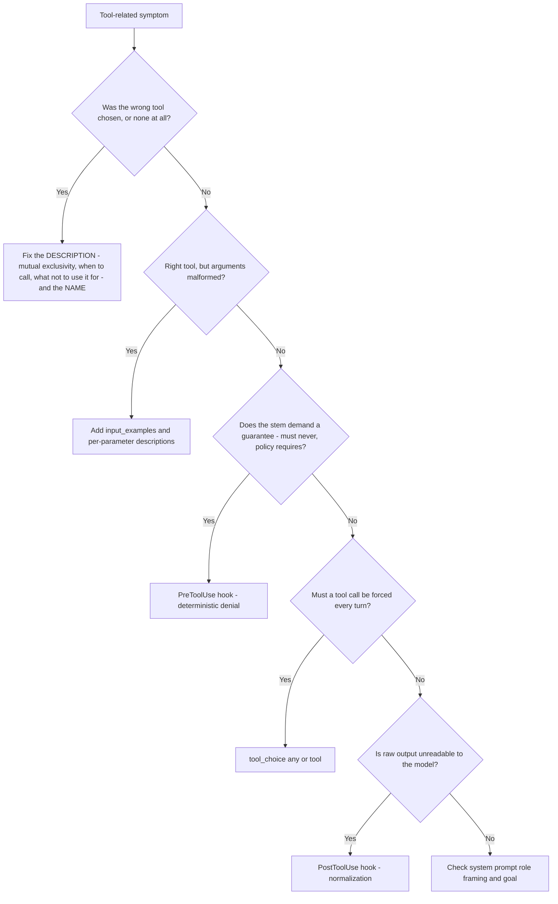

---
tags:
  - CCA-F
  - domain-2
  - tool-design
  - tool-descriptions
  - misrouting
  - youtube-course
date: 2026-08-03
status: done
domain: "2 of 5"
source: "Peace Of Code — Claude Certified Architect Ep 06"
---

# 🧭 EP06 — Tool Descriptions & Tool Misrouting

> [!NOTE] Exam Coverage
> The **opening episode of Domain 2**. Maps to **Domain 2 — Tool Design & MCP Integration**, primarily task statement **2.1** (designing effective tool interfaces), with the naming/splitting material touching **2.3** (distributing tools across agents) and the distractor analysis touching **Domain 4 — Prompt Engineering**, task statement **4.2** (few-shot). Covers why the tool `description` *is* the routing mechanism, the four-part description template, description overlap in multi-agent research scenarios, mutually exclusive scoping, generic-vs-specific tool naming, the troubleshooting decision tree (description vs hook vs `tool_choice`), and how system-prompt role framing biases tool selection.

**Back to:** [[CCA-F Study Roadmap]] · **Domain note:** [[D2 - Tool Design & MCP Integration]] · **Deck:** [[EP06 - Flashcards]]
**Source:** [Peace Of Code — Ep 06 (25 min)](https://www.youtube.com/watch?v=s1j1vTnCKns) · Level: college / professional-certification · Question mix calibrated MCQ-heavy (40 / 40 / 20)
**Previous:** [[EP05 - PreToolUse, PostToolUse Hooks & Task Decomposition]]

---

## 1. Outline

- [1. Outline](#1-outline)
- [2. Key Terms](#2-key-terms)
- [3. Concept Summaries](#3-concept-summaries)
  - [3.1 Why the Description Is the Routing Layer](#31-why-the-description-is-the-routing-layer)
  - [3.2 The Four-Part Description Template](#32-the-four-part-description-template)
  - [3.3 Cross-Referencing — Encoding Call Order in the Description](#33-cross-referencing--encoding-call-order-in-the-description)
  - [3.4 The Description Overlap Problem](#34-the-description-overlap-problem)
  - [3.5 Making Descriptions Mutually Exclusive](#35-making-descriptions-mutually-exclusive)
  - [3.6 Tool Naming and Tool Splitting](#36-tool-naming-and-tool-splitting)
  - [3.7 Troubleshooting — Which Lever for Which Symptom](#37-troubleshooting--which-lever-for-which-symptom)
  - [3.8 System Prompt Role Framing](#38-system-prompt-role-framing)
  - [3.9 The Sample-Question Pattern and Its Distractors](#39-the-sample-question-pattern-and-its-distractors)
- [4. Diagrams](#4-diagrams)
- [5. Worked Examples](#5-worked-examples)
- [6. Practice Questions](#6-practice-questions)
- [7. Cheat Sheet](#7-cheat-sheet)

---

## 2. Key Terms

| Term | Definition | Source |
|---|---|---|
| **Tool misrouting** | Claude calls the wrong tool, or fails to call a tool it should have. The episode's central failure mode — and per official docs, almost always a description problem rather than a model problem. | [00:58] |
| **`description`** | The plaintext field on a tool definition. Officially *"a detailed plaintext description of what the tool does, when it should be used, and how it behaves."* This is what Claude reads to route. | [03:34] |
| **`name`** | The tool's identifier. Must match the regex `^[a-zA-Z0-9_-]{1,64}$`. Carries semantic weight for selection — a generic name degrades routing on its own. | [14:46] · *(expansion — §3.6)* |
| **`input_schema`** | The JSON Schema for the tool's parameters. Per-property `description` fields are part of what Claude reads; `enum` pins fixed value sets. | [07:31] |
| **Four-part template** | The instructor's description anatomy: **what it does** · **when to call** · **what not to use it for** · **what it returns**. Officially near-identical (see §3.2). | [06:30] |
| **Negative prompting** | The instructor's name for the *what not to use it for* clause. Officially phrased as *"when it should be used (and when it shouldn't)."* | [06:43] |
| **Description overlap** | Two or more tools whose descriptions are semantic synonyms from the model's perspective (`search`/`information`/`content`), so selection becomes a coin flip. | [09:48] |
| **Mutually exclusive descriptions** | The fix for overlap: each description claims a disjoint scope, and explicitly disclaims the neighbouring tools' scopes. | [11:41] |
| **Cross-referencing** | Naming the prerequisite tool inside a description (*"call `get_customer` first"*) so call order is encoded in the routing text, not just in a hook. | [14:16] |
| **Generic tool name** | `search`, `get_data`, `fetch_info`, `process`, `handle_request` — names with, in the instructor's phrase, no *"semantic weight."* | [15:24] |
| **Tool splitting** | Breaking one over-broad tool into purpose-specific tools (`get_customer_by_id`, `list_customer_orders`). His DAO/repository analogy. **Bounded by official consolidation guidance — see §3.6.** | [16:30] |
| **Namespacing** | Prefixing tool names by service — `github_list_prs`, `slack_send_message` — to keep selection unambiguous as a tool library grows. | *(expansion — §3.6)* |
| **`input_examples`** | Optional tool-definition field holding schema-validated example inputs. Fixes malformed *arguments*, not wrong *tool choice*. | *(correction — §3.9)* |
| **Tool-use system prompt** | The wrapper prompt the API constructs from your tool definitions on every request. 286 tokens on Claude Opus 5 with `tool_choice: auto`, 406 with `any`/`tool`. | *(correction — §3.1)* |
| **`tool_choice`** | The request-level override: `auto` (default with tools) · `any` · `tool` · `none`. Selection control that bypasses the description entirely. | *(expansion — §3.7)* |
| **Role framing** | The bias a system prompt's stated role creates toward a category of tools — *"customer lookup assistant"* primes lookups over refunds. | [21:03] |
| **Tool use sequence** | An ordered call chain written into the system prompt (`get_customer` → `lookup_order` → `process_refund` → `escalate_to_human`). | [22:43] |

---

## 3. Concept Summaries

### 3.1 Why the Description Is the Routing Layer

*Question: your agent has four tools, hooks, a coordinator, and subagents — and it still looks up the order without processing the refund. Where do you look first?*

At the descriptions. This episode's thesis is that tool selection has no dedicated machinery behind it, and the instructor states it plainly: *"There is no separate routing layer. There is no separate fancy algorithms or nothing. It's just the description that you provide."*

That is the correct instinct, and it is officially backed in the strongest available terms. The Claude API docs' first bullet on tool definitions reads: **"Provide extremely detailed descriptions. This is by far the most important factor in tool performance."** Not one factor among several — the dominant one.

His framing of *what the description is for* is the more valuable half of the lesson, though. Descriptions are **not developer documentation**:

> *"Tool description at are not documentation for developers. Try to understand this concept... These descriptions are for Claude to understand what is the tool is for."*

The restaurant-menu analogy earns its place. A menu listing *dish A, dish B, dish C* is technically complete and operationally useless; *paneer tikka masala* tells you what you are ordering. A one-line `description` is dish A. The reader here is a model choosing under uncertainty, and it can only choose between the descriptions it was handed.

Two consequences follow, and both are exam-relevant. First, the failure is **silent** — a misroute is not an error, it is a plausible wrong answer, so nothing surfaces except the business symptom (in his example, refunds never processed and needless escalations). Second, the fix is **free**: it is plain English in a JSON field, requiring no code change, no retraining, and no new infrastructure.

> [!WARNING] "No separate routing layer" — verified against official docs, with one refinement
> The lecture says there is *nothing* between your descriptions and Claude's choice. Officially, when you pass `tools`, the API **constructs a special system prompt** from your tool definitions, tool configuration, and your own system prompt — it is not a bare hand-off. That wrapper is measurable: on **Claude Opus 5** it costs **286 tokens** with `tool_choice: auto`/`none` and **406 tokens** with `any`/`tool`, on top of your own definitions.
> **Exam answer: the description drives tool selection** — that is what the stem is testing. Real code: there is a constructed tool-use system prompt, and `tool_choice` can override selection outright (§3.7).
> Source: [Define tools → Tool use system prompt](https://platform.claude.com/docs/en/agents-and-tools/tool-use/define-tools) · [Tool use overview → Pricing](https://platform.claude.com/docs/en/agents-and-tools/tool-use/overview) · consistent with [[D2 - Tool Design & MCP Integration]] §2.1

**In your own words:** Tool selection is a reading-comprehension task performed on text you wrote. Bad text, bad routing — and nothing throws.

*See PQ 1, 2, 11.*

---

### 3.2 The Four-Part Description Template

*Question: what has to be in a description before it is safe to ship?*

Four things, and the instructor's list is worth memorising because the official list is nearly the same one:

| His template | Official equivalent |
|---|---|
| What the tool does | What the tool does |
| When to call it | When it should be used **(and when it shouldn't)** |
| What **not** to use it for | *(folded into the above)* |
| What it returns | Caveats and limitations, *including what the tool does not return* |
| *(implicit in `input_schema`)* | **What each parameter means and how it affects behaviour** |

His worked example is his `get_customer` tool, and it maps cleanly onto the template:

```json
{
  "name": "get_customer",
  "description": "Retrieve a verified customer profile by customer ID. Returns name, email, plan tier, and account standing. Always call this first before any other tool — order lookups and refunds require customer verification.",
  "input_schema": {
    "type": "object",
    "properties": {
      "customer_id": { "type": "string", "description": "Customer ID, e.g. C001" }
    },
    "required": ["customer_id"]
  }
}
```

Read it back against the template: *retrieve a verified customer profile* (what it does) · *returns name, email, plan tier, account standing* (what it returns) · *always call this first* (when to call) · *order lookups and refunds require verification* (the constraint). One sentence per job.

His closing line on this is the practical bar: *"You can't go ahead and deploy something in production with a one-line description."*

> [!IMPORTANT] Two official specifics the lecture omits
> - **Length floor:** *"Aim for at least 3–4 sentences for each tool description, more if the tool is complex."* A concrete target beats "be detailed" — count sentences when you audit.
> - **Per-parameter descriptions count too.** The official element list includes *"what each parameter means and how it affects the tool's behavior."* Description quality is not only the top-level `description` string; a bare `{"type": "string"}` property with no `description` is part of the same defect. The docs' own poor-description example fails on exactly this.
> Source: [Define tools → Best practices for tool definitions](https://platform.claude.com/docs/en/agents-and-tools/tool-use/define-tools) · extends [[D2 - Tool Design & MCP Integration]] §2.1

The official good/poor pair is worth internalising alongside his, because it is the shape the exam draws from:

- ❌ `"Gets the stock price for a ticker."` — brief, no when-to-use, no return contract, untyped parameter.
- ✅ `"Retrieves the current stock price for a given ticker symbol. The ticker symbol must be a valid symbol for a publicly traded company on a major US stock exchange like NYSE or NASDAQ. The tool will return the latest trade price in USD. It should be used when the user asks about the current or most recent price of a specific stock. It will not provide any other information about the stock or company."`

That final sentence — *it will not provide any other information* — is the instructor's "negative prompting" clause, written by Anthropic. The two sources agree.

**In your own words:** What it does, when to call it, when not to, what comes back — three to four sentences, plus a real description on every parameter.

*See PQ 3, 4, 5, 13.*

---

### 3.3 Cross-Referencing — Encoding Call Order in the Description

*Question: EP05 built a `PreToolUse` prerequisite gate for exactly this. Why write the ordering into the description as well?*

Because the gate and the description do different jobs, and you want both. The instructor's `process_refund` description names its prerequisites explicitly:

> *"Call `get_customer` first to verify the identity. Call `lookup_order` to confirm the order exists and belongs to the customer. Only call this after both checks pass."*

Compare the two mechanisms:

| | Description cross-reference | `PreToolUse` prerequisite gate |
|---|---|---|
| Nature | Probabilistic guidance | Deterministic enforcement |
| What it changes | Which tool Claude *chooses* | Whether the call *executes* |
| Failure mode | Claude may still call out of order | Nothing — the call is denied |
| Cost of a failure | A wasted turn | A returned denial reason |

The description makes the *right* path the obvious one; the hook makes the *wrong* path impossible. Rely on the hook alone and you get correct behaviour via a stream of denials — every out-of-order attempt burns a turn and a denial reason before the agent reroutes. Rely on the description alone and you have a request, not a constraint — which is exactly the trap EP05 closes on.

> [!TIP] How this connects to EP05
> EP05's rule was: *if the stem says "guarantee", "must never", or "policy requires", the answer is a hook, never a prompt.* That rule is intact. EP06 is the complementary case — when the stem says the agent **calls the wrong tool** or **fails to call a tool**, no guarantee is being demanded, and the answer is the description. Read the verb in the stem: **blocked/allowed → hook; chosen/skipped → description.**
> Consistent with [[D1 - Agentic Architecture & Orchestration]] §1.5 and [[D2 - Tool Design & MCP Integration]] §2.1

**In your own words:** The description tells Claude the order; the hook enforces it. Ship both — one saves turns, the other saves policy.

*See PQ 6, 14.*

---

### 3.4 The Description Overlap Problem

*Question: three tools, three sensible one-line descriptions, and the coordinator picks wrongly about a third of the time. What is wrong?*

Nothing is wrong with any description **individually** — they are wrong **relative to each other**. This is the episode's sharpest idea, and the instructor flags it as high-yield: *"This comes up very often in multi-agent research scenario."*

His example is the research coordinator with three tools:

| Name | Description | Problem |
|---|---|---|
| `search_web` | "Search for information" | *search*, *information* |
| `search_documents` | "Search documents for information" | *search*, *information* |
| `analyze_content` | "Analyze and extract information from content" | *information*, *content* |

His diagnosis is exact: *"From Claude's perspective, these are practically... like synonyms."* Every description is built from the same three words. There is no discriminating signal anywhere in the set, so the model has nothing to route on — and note what this does to the naming layer too: `search_web` versus `search_documents` is a real distinction, but the descriptions actively wash it out by restating the shared verb instead of the distinguishing scope.

The important structural insight is that **overlap is a property of the set, not of any member**. You cannot find it by reviewing tools one at a time, which is exactly how tool definitions get reviewed. It only appears when you lay all the descriptions side by side and ask: *for a given request, could two of these plausibly claim it?* That question is the audit.

> [!WARNING] Anti-pattern — reviewing descriptions in isolation
> ❌ Read each tool definition on its own, judge it complete, ship it
> ✅ Read the whole `tools` array as one document and hunt for shared vocabulary — the defect lives in the gaps between entries
> Consistent with [[D2 - Tool Design & MCP Integration]] §2.1 *"Near-identical descriptions for similar tools → misrouting"*

**In your own words:** Overlap is a set-level defect. Three individually fine descriptions built from the same words give the model nothing to choose on.

*See PQ 7, 8, 15.*

---

### 3.5 Making Descriptions Mutually Exclusive

*Question: how do you rewrite the three research tools so selection becomes deterministic?*

Give each one a disjoint scope, and make each one **disclaim** its neighbours. The instructor's rewrite:

| Name | Rewritten description | Claimed scope |
|---|---|---|
| `search_web` | "Query live pages via the search engine. Use for current events and recent publication URLs not yet in the document corpus. Input: a query string. Returns ranked URLs plus snippets. **Do not use for documents already in the research corpus.**" | Live internet |
| `search_documents` | "Full-text search across the preloaded research corpus." | Ingested corpus |
| `analyze_content` | "Deep analysis of a specific piece of content already retrieved." | Post-retrieval |

His summary of why this works is the line to remember: *"Web search means live internet. Document search means already ingested corpus. And then analyze means post-retrieval processing."*

Three properties make the rewrite work, and it is worth naming them separately because a partial rewrite fixes nothing:

1. **Disjoint scope.** Live · ingested · post-retrieval. No request belongs to two of these.
2. **Explicit disclaimers.** *"Do not use for documents already in the research corpus"* points at the neighbouring tool. Each description now defines its own boundary rather than leaving the model to infer one.
3. **Different vocabulary.** *query live pages* / *full-text search across the corpus* / *deep analysis of retrieved content*. The shared words are gone, so the discriminating signal survives.

There is also a **temporal** ordering hidden in the set — search (live or corpus) precedes analyze — which does the same work as §3.3's cross-referencing without naming a tool. The instructor's phrasing for the effect is good, even through a transcription error: this *"will paint a very clear picture in Claude's memory or context"* about which tool belongs at which point in the loop.

**In your own words:** Disjoint scopes, explicit disclaimers, distinct vocabulary. If two descriptions could claim the same request, one of them is under-specified.

*See PQ 8, 9, 15.*

---

### 3.6 Tool Naming and Tool Splitting

*Question: `search`, `get_data`, `fetch_info`, `process`, `handle_request` — what is wrong with these names?*

They carry, in his words, *"no semantic weight"*, and he presses the point by simply asking the questions the names leave open: *"Search what? Get data for what? Fetch info for what? Process what? Handle request what?"* A name is part of the routing text. `search` competes with every other retrieval tool because it claims everything and specifies nothing.

His renames are the pattern:

| Generic | Specific |
|---|---|
| `search` | `search_live_web` |
| `get_data` | `lookup_customer_profile` |
| `fetch_info` | `retrieve_order_history` |

And his splitting example: one database-query tool becomes `get_customer_by_id` and `list_customer_orders`. The DAO/repository analogy is genuinely useful for anyone with a backend background — *"think about it in a way you would write a DAO function or a DAO class in Java, or a repository"*. A repository method names its resource and its access pattern; so should a tool.

> [!WARNING] "Split generic tools" — bounded by official consolidation guidance
> The lecture pushes splitting as a general remedy. Officially, splitting has a limit, and the docs push the **opposite** way on one axis:
> - **"Consolidate related operations into fewer tools.** Rather than creating a separate tool for every action (`create_pr`, `review_pr`, `merge_pr`), group them into a single tool with an `action` parameter. Fewer, more capable tools reduce selection ambiguity."
> - **"Use meaningful namespacing in tool names"** — prefix by service (`github_list_prs`, `slack_send_message`), *"especially important when using tool search."*
>
> These are not contradictory once you see the axis. **Split when purposes are semantically distinct** (`get_customer_by_id` vs `list_customer_orders` return different shapes for different questions — and it is the split the lecture actually demonstrates). **Consolidate when tools differ only by verb on the same resource** (`create_pr`/`review_pr`/`merge_pr` → one `pr` tool with an `action` parameter). Both moves serve the same goal: *reduce selection ambiguity*. Splitting by verb multiplies near-synonyms and manufactures the §3.4 overlap problem.
> **Exam answer: rename and split generic tools** — that is what the sample question rewards. Real code: split on purpose, consolidate on verb, namespace by service.
> Source: [Define tools → Best practices](https://platform.claude.com/docs/en/agents-and-tools/tool-use/define-tools) · extends [[D2 - Tool Design & MCP Integration]] §2.1, which covers rename/split but not consolidation or namespacing

Two more official specifics belong here:

- **`name` must match `^[a-zA-Z0-9_-]{1,64}$`** — letters, digits, underscore, hyphen; 1–64 characters. No spaces, no dots.
- **Tool responses should return only high-signal information** — semantic, stable identifiers (slugs, UUIDs) rather than opaque internal references, and only the fields Claude needs for its next step. Bloated returns waste context and, per the docs, *"make it harder for Claude to extract what matters."* This is the output-side sibling of a good description: the description promises a return contract, the tool should honour it tightly.

> [!NOTE] On tool count
> [[D2 - Tool Design & MCP Integration]] §2.3 gives numeric reliability thresholds (4–5 reliable · 10+ degraded · 18+ significant misuse). Official docs address scale differently — consolidation, namespacing, and the **tool search tool**, which is built to *"work with thousands of tools"* by discovering and loading definitions on demand via `defer_loading`. The thresholds are vault-sourced and useful as exam heuristics; treat them as guidance about *undifferentiated* tool sets rather than a hard ceiling.

**In your own words:** A name is routing text. Make it say the resource and the access pattern — then stop splitting once the only difference is the verb.

*See PQ 9, 10, 15.*

---

### 3.7 Troubleshooting — Which Lever for Which Symptom

*Question: the agent misbehaves around tools. Which of the four mechanisms you now know is the fix?*

This is the section the exam is built on, and the instructor's rule is sound: *"Whenever there is a trouble with misrouting or tool not executing or there is issue in tools, always check the naming convention and the description of the tool."* Descriptions and names are the **first** check, not the last.

His triage, extended with the official levers:

| Symptom | Lever | Why |
|---|---|---|
| Wrong tool chosen | **Description** (mutual exclusivity) + **name** | Selection is a reading task; disambiguate the text |
| Tool never called when it should be | **Description** (*when to call*) + **system prompt** | Nothing told the model this case belongs to that tool |
| Tool called when it should not be | **Description** (*what not to use it for*) | The negative clause is missing |
| Policy violation must be blocked | **`PreToolUse` hook** | Deterministic enforcement — EP05 |
| Output needs reformatting | **`PostToolUse` hook** | Normalization before the model reads it |
| A tool call must be *guaranteed* | **`tool_choice`** | `any` forces some tool; `tool` forces a named one |
| Arguments malformed / wrong shape | **`input_examples`** + per-parameter descriptions | An input-formatting problem, not a selection problem |

Two official additions worth holding onto:

- **`tool_choice` has four values** — `auto` (default when `tools` are present), `any` (must call some tool), `tool` (must call this one), `none` (default when no tools). Note the side effect: with `any` or `tool`, *"the API prefills the assistant message to force a tool to be used"*, so **the model emits no natural-language text before the `tool_use` block, even if you ask it to.** If you need both a forced call and a spoken preamble, use `auto` and put the instruction in the user turn. This is EP07's territory — see [[EP07 - Agent Error Handling & tool_choice]].
- **Missing required parameters behave differently by model.** Claude Opus is much more likely to notice a missing required parameter and ask for it; Claude Sonnet may **infer a plausible value instead**. A `get_weather` call can come back with `{"location": "New York, NY"}` that the user never mentioned. If your stem features a tool called with invented arguments, this — not the description — is the mechanism.

**In your own words:** Chosen wrongly or skipped → description and name. Blocked or reformatted → hooks. Must-call → `tool_choice`. Malformed args → `input_examples`.

*See PQ 10, 11, 12, 14.*

---

### 3.8 System Prompt Role Framing

*Question: every description is excellent and the agent still under-uses `process_refund`. What is left?*

The system prompt. This is the part of the episode the instructor flags as under-covered elsewhere — *"this thing doesn't come up in a lot of tutorials about this particular certification"* — and he is right that it is worth adding, because it is officially confirmed.

His mechanism: a system prompt of *"You are a customer support assistant"* is a role, and the role primes a **category** of tool. His observation is that Claude *"will be primed to reach for `get_customer` over `process_refund`, even in cases where a refund is clearly needed."* The role says *assist and look things up*; refunding is an action, and nothing in the framing licenses it. His conclusion is the takeaway: **the system prompt and the tool descriptions must be aligned with each other.**

His fix has two parts. First, state the **goal**, not just the identity — the agent's job is resolution of returns and refunds, not lookup. Second, write the **tool use sequence** into the prompt:

```text
You are a customer support assistant. Your goal is the complete resolution of
returns and refunds — not lookup alone.

Tool use sequence:
1. Always call get_customer first to verify the customer.
2. Call lookup_order to retrieve the relevant order.
3. Call process_refund if the order is eligible.
4. Escalate to a human only as a last resort.
```

> [!IMPORTANT] Officially confirmed — and quantified as a steering lever
> The docs state it directly: *"This boundary is steerable through your system prompt. If Claude isn't calling tools when you expect, a light instruction such as `\"Use the tools to investigate before responding.\"` increases tool use. A stronger form such as `\"Always call a tool first before responding.\"` pushes further. Conversely, `\"Use your judgment about whether to call a tool or respond directly.\"` keeps triggering behavior conservative."*
> So there is a **graded dial** here, not a binary. Three registers, weakest to strongest: *use your judgment* → *use the tools to investigate* → *always call a tool first*. And the escalation path is explicit: *"To require a tool call rather than rely on prompting, set `tool_choice`."* Prompt for a tendency; `tool_choice` for a requirement.
> **Exam answer: role framing biases tool selection, and prompt + descriptions must agree.** Real code: same, with `tool_choice` as the hard override.
> Source: [Tool use overview → When Claude uses tools](https://platform.claude.com/docs/en/agents-and-tools/tool-use/overview)

Note the layering across three episodes: the **system prompt** sets the disposition, the **description** decides the specific tool, the **hook** decides whether it may run. Three different questions, three different mechanisms, and a stem that names any one of them is telling you which layer it is testing.

**In your own words:** The role framing decides which *category* of tool feels appropriate. State the goal and the call sequence, or a lookup-flavoured role will quietly suppress the action tools.

*See PQ 12, 13, 14.*

---

### 3.9 The Sample-Question Pattern and Its Distractors

*Question: "A customer support agent frequently calls `escalate_to_human` for auto-resolvable cases. All tool definitions have single-sentence descriptions." What is the answer?*

**Rewrite the tool descriptions.** The stem hands you the diagnosis in its last clause — *single-sentence descriptions* — and the instructor's warning about that is the most practically useful thing he says about the exam: *"The questions are also evolving, and maybe the hints will not be there. You have to figure out the hints by yourself."* Learn the reasoning, not the tell.

Reasoning it without the hint: the symptom is a **selection** error (a tool is chosen when it should not be). Nothing is blocked, nothing is malformed, no guarantee is demanded. So the lever is the description — specifically the missing *what not to use it for* clause on `escalate_to_human`, and the missing *when to call* clause on the tool that should have handled it.

The distractors he flags, and why each fails:

| Distractor | Why it fails |
|---|---|
| Add few-shot examples | Improves consistency of *format*, not correctness of *selection*. See the correction below |
| Add a `PreToolUse` hook | Enforces policy; it cannot make the model *prefer* the right tool. You would be blocking escalations rather than resolving cases |
| Increase `max_tokens` / change model | Nothing about the symptom is capacity-related |
| Make the system prompt more forceful | Partially relevant (§3.8) but secondary — the descriptions are the named defect |

> [!IMPORTANT] "Few-shot examples are just a distractor" — refined against official docs
> For a **misrouting** stem the lecture is right: descriptions are the answer, and few-shot prompting is the trap. But the blanket dismissal is too strong for real code, because tool definitions now have an official example field:
> ```json
> {
>   "name": "get_weather",
>   "description": "...",
>   "input_schema": { "...": "..." },
>   "input_examples": [
>     { "location": "San Francisco, CA", "unit": "fahrenheit" },
>     { "location": "Tokyo, Japan", "unit": "celsius" },
>     { "location": "New York, NY" }
>   ]
> }
> ```
> Official guidance: *"Prioritize descriptions, but consider using `input_examples` for complex tools"* — those with nested objects, optional parameters, or format-sensitive inputs. Each example must validate against `input_schema` (invalid ones return **400**), examples are **not supported on server tools**, and they cost ~20–50 tokens simple / ~100–200 tokens for complex nested objects.
> **The clean split: wrong tool → fix the description. Right tool, wrong arguments → add `input_examples`.**
> **Exam answer: rewrite the descriptions.** Real code: descriptions first, `input_examples` for complex input shapes.
> Source: [Define tools → Providing tool use examples](https://platform.claude.com/docs/en/agents-and-tools/tool-use/define-tools)

> [!WARNING] Unverified — confirm against the official study guide
> The lecture makes three claims about the exam's structure that cannot be checked against Anthropic's published documentation: that this is **"sample question number two"**, that there are **12 official sample questions** in the syllabus PDF, and that the multi-agent research setup is **"scenario number three."** The *content* of both scenarios is verified above and is what matters; treat the **numbering** as unconfirmed. Domain 2's exam **weight percentage** is likewise not published anywhere in this vault — don't memorise a figure for it.

> [!TIP] Transcription artifacts in this episode
> The auto-captions garble several passages. Recognise them so you don't second-guess yourself on review:
> - **"I do not use want to use the tool"** [02:27] → *I do not want to use the tool*
> - **"will print a very clear picture in Claude's memory"** [12:51] → *will **paint** a clear picture*
> - **"Full search across the preloaded research corpus"** [12:22] → *Full-**text** search*
> - **"our customer search agent"** [14:03] → *customer **support** agent*
> - **"contract resolution of returns and refunds"** [22:00] → *complete resolution* — his intent from context
> - **"ambiguous ambiguation of tool handling"** [23:34] → *ambiguity* / *mis-disambiguation*
> - **"web web search"** [10:12] · **"the the the the problem"** [13:17] → stutters, not distinct terms
> - **"escalate to human for auto-resolvable cases to reroute cases"** [18:31] → garbled tail; the stem is *"frequently calls escalate_to_human for auto-resolvable cases"*
> - **`>> [snorts] >>`** [23:34] → stray speaker-change artifact mid-sentence

**In your own words:** Single-sentence descriptions in the stem means rewrite the descriptions. Few-shot, hooks, and bigger models are the three distractors — and only few-shot has a legitimate real-code cousin, in `input_examples`.

*See PQ 5, 12, 14, 15.*

---

## 4. Diagrams


*Selection is a reading task over your `name` + `description` text. `tool_choice` is the only mechanism that bypasses it — and a misroute raises nothing.*


*Overlap is a property of the set, not of any single entry. The rewrite gives each tool a disjoint scope plus an explicit disclaimer of its neighbours.*


*The triage tree. Description and name are the first check for any selection symptom — hooks, `tool_choice`, and `input_examples` each answer a different question.*

---

## 5. Worked Examples

### Example 1 — Rewrite the three overlapping research tools

**Problem.** A research coordinator has `search_web` ("Search for information"), `search_documents` ("Search documents for information"), and `analyze_content` ("Analyze and extract information from content"). It misroutes constantly. Rewrite the set.

**Step 1 — Audit the set as one document, not three entries.**
*(why: overlap is invisible tool-by-tool. Lay the descriptions side by side and list the shared vocabulary.)*
Shared words: **search** (×2), **information** (×3), **content** (×2). Every description is built from the same three tokens — there is no discriminating signal in the set.

**Step 2 — Assign each tool one disjoint scope.**
*(why: if two tools can plausibly claim the same request, selection is a coin flip regardless of wording quality.)*

| Tool | Scope | Test question it owns |
|---|---|---|
| `search_web` | Live internet | "Is this outside the corpus?" |
| `search_documents` | Preloaded corpus | "Is this already ingested?" |
| `analyze_content` | Post-retrieval | "Do I already hold the content?" |

**Step 3 — Write each description to the four-part template, with a disclaimer.**
*(why: the disclaimer is what makes the scopes *mutually* exclusive — it points at the neighbour instead of leaving the boundary implicit.)*
```text
search_web: Query live web pages via the search engine. Use for current events
and recent publications not yet in the document corpus. Takes a query string.
Returns ranked URLs plus snippets. Do not use for documents already in the
research corpus — use search_documents for those.
```

**Step 4 — Strip the shared vocabulary from the other two.**
*(why: reusing "search for information" in tool two re-creates the overlap you just removed from tool one.)*
`search_documents` → *"Full-text search across the preloaded research corpus…"*; `analyze_content` → *"Deep analysis of a specific piece of content already retrieved. Do not use to find content — only to process content you already hold."*

**Answer:** three disjoint scopes (live / ingested / post-retrieval), each description disclaiming its neighbours, no shared vocabulary, and a temporal ordering (search → analyze) that falls out of the scopes for free. Zero code changed.

---

### Example 2 — Diagnose the escalation bug

**Problem.** The capstone support agent has `get_customer`, `lookup_order`, `process_refund`, `escalate_to_human`, and a `PreToolUse` hook denying refunds over \$500. Symptom: refunds **under** \$500 are escalated to a human instead of processed. All four descriptions are one sentence. Diagnose and fix.

**Step 1 — Classify the symptom.**
*(why: this picks the lever. Selection error → description; enforcement → hook; formatting → `PostToolUse`.)*
A tool was **chosen** that should not have been, and a tool that should have run was **skipped**. Nothing was blocked — the hook only fires above \$500, and these are under. This is a **selection** error, so the descriptions own it.

**Step 2 — Rule out the hook explicitly.**
*(why: the hook's presence is a deliberate red herring — it is the most visible mechanism in the system and it is working correctly.)*
A `PreToolUse` hook can only deny; it cannot make Claude *prefer* `process_refund`. Adding hook logic here would block escalations without producing refunds.

**Step 3 — Name the missing clauses.**
*(why: "improve the descriptions" is not an answer — the exam wants the specific defect.)*
- `escalate_to_human` has no *what not to use it for*: nothing says *"do not escalate cases the agent can resolve itself — refunds at or under \$500 are auto-resolvable."*
- `process_refund` has no *when to call*: nothing says *"call this for eligible refunds up to \$500."*
- Neither carries the eligibility boundary, so the model has no basis for deciding which side of \$500 a case falls on.

**Step 4 — Align the system prompt.**
*(why: §3.8 — if the role reads as *lookup assistant*, description fixes get fought by the framing.)*
State the goal (*complete resolution of returns and refunds*) and the sequence (`get_customer` → `lookup_order` → `process_refund` → escalate **last**).

**Answer:** rewrite all four descriptions to the four-part template — adding the \$500 boundary and a *what not to use it for* clause on `escalate_to_human` — and restate the system prompt as goal + tool sequence. The hook stays exactly as it is: it is the policy layer, and the bug was never a policy failure.

---

### Example 3 — What richer descriptions actually cost

**Problem.** Four tools, currently one-line descriptions (~15 tokens each). You upgrade them to the four-part template (~80 tokens each). The agent serves 10,000 tickets/month on Claude Opus 5 (input \$5/MTok) with `tool_choice: auto`. Quantify the added cost.

**Step 1 — Per-request delta from the descriptions.**
*(why: only the description text changes; the schemas and the constructed wrapper prompt do not.)*

$$\Delta_{\text{tokens}} = 4 \times (80 - 15) = 260 \text{ tokens per request}$$

**Step 2 — Add the fixed overhead for context.**
*(why: the tool-use system prompt is charged on every request regardless, so the *relative* increase is smaller than it looks.)* On Claude Opus 5 that wrapper is **286 tokens** at `tool_choice: auto` (it would be 406 at `any`/`tool`). So tool-related input goes from roughly $286 + 60 = 346$ to $286 + 320 = 606$ tokens.

**Step 3 — Monthly cost, uncached.**

$$C = \frac{10{,}000 \times 260}{1{,}000{,}000} \times \$5 = \$13.00 \text{ per month}$$

**Step 4 — Apply prompt caching.**
*(why: this is the decisive detail. Render order is **`tools` → `system` → `messages`**, so tool definitions sit at the very front of the prefix — the most cacheable content in the entire request. Cache reads bill at ~0.1× input.)*

$$C_{\text{cached}} \approx \$13.00 \times 0.1 = \$1.30 \text{ per month}$$

**Answer:** ~**\$13/month** uncached, ~**\$1.30/month** with the tool definitions inside a cached prefix — against a misroute class that was silently mishandling refunds. The token argument against detailed descriptions does not survive contact with arithmetic. One caveat worth knowing: because `tools` renders first, **changing a tool definition invalidates the entire cache** — so batch description rewrites into one deployment rather than trickling them out.

---

## 6. Practice Questions

1. What does Claude read to decide which tool to call, and what does official documentation say about that field's importance? *(§3.1)*

   <details><summary>Answer</summary>
   The tool's **`description`** (together with its `name`). Officially: *"Provide extremely detailed descriptions. This is **by far the most important factor** in tool performance."* There is no dedicated routing algorithm — selection is a reading-comprehension task over text you wrote.
   </details>

2. Why is a tool misroute harder to catch in production than a policy violation? *(§3.1)*

   <details><summary>Answer</summary>
   Because it **raises nothing**. A misroute is a plausible wrong answer, not an exception — so it surfaces only as a business symptom (refunds never processed, needless escalations). A hook denial, by contrast, produces an explicit reason string.
   </details>

3. Name the four parts of a production-grade tool description. *(§3.2)*

   <details><summary>Answer</summary>
   **What the tool does · when to call it · what not to use it for · what it returns.** Official docs fold "when not to" into "when it should be used (and when it shouldn't)" and add **what each parameter means**.
   </details>

4. What is the official minimum length guidance for a tool description? *(§3.2)*

   <details><summary>Answer</summary>
   **At least 3–4 sentences per tool description**, more if the tool is complex.
   </details>

5. A tool definition has a strong four-sentence `description` but its `input_schema` properties are bare `{"type": "string"}` with no per-property descriptions. Is the description work complete? *(§3.2, §3.9)*

   <details><summary>Answer</summary>
   **No.** The official element list includes *"what each parameter means and how it affects the tool's behavior"* — per-parameter descriptions are part of description quality, and their absence is exactly what makes the docs' own "poor description" example poor.
   </details>

6. You already have a `PreToolUse` prerequisite gate. Why also cross-reference the prerequisite inside the description? *(§3.3)*

   <details><summary>Answer</summary>
   They solve different problems. The description changes which tool Claude **chooses**; the hook changes whether the call **executes**. With only the hook, correct behaviour arrives via a stream of denials — each out-of-order attempt burns a turn. With only the description, you have a request, not a constraint.
   </details>

7. Three tools are described as "Search for information", "Search documents for information", and "Analyze and extract information from content". Each reads fine alone. What is the defect? *(§3.4)*

   <details><summary>Answer</summary>
   **Description overlap** — a defect of the **set**, not of any member. All three are built from *search* / *information* / *content*, so from the model's perspective they are synonyms and there is no discriminating signal to route on. It is invisible when definitions are reviewed one at a time.
   </details>

8. State the three properties that make a rewritten description set mutually exclusive. *(§3.5)*

   <details><summary>Answer</summary>
   **Disjoint scope** (live internet / ingested corpus / post-retrieval) · **explicit disclaimers** pointing at the neighbouring tool ("do not use for documents already in the corpus") · **distinct vocabulary** so the shared words are gone.
   </details>

9. Why does `search` route worse than `search_live_web`, independent of the description? *(§3.6)*

   <details><summary>Answer</summary>
   The name carries **no semantic weight** — `search` claims every retrieval request and specifies none, so it competes with every other retrieval tool. `search_live_web` names both the resource and the access pattern. The name is part of the routing text, not just a code identifier.
   </details>

10. Official docs say to *consolidate* related operations into fewer tools; the lecture says to *split* generic tools. Reconcile them. *(§3.6)*

    <details><summary>Answer</summary>
    Different axes, same goal — reduce selection ambiguity. **Split on distinct purpose** (`get_customer_by_id` vs `list_customer_orders` answer different questions and return different shapes). **Consolidate on verb** (`create_pr`/`review_pr`/`merge_pr` → one tool with an `action` parameter), because splitting by verb manufactures near-synonyms and re-creates the overlap problem. Plus **namespace by service** (`github_list_prs`).
    </details>

11. The lecture says "there is no separate routing layer." What does the API actually construct, and how much does it cost? *(§3.1)*

    <details><summary>Answer</summary>
    When `tools` are passed, the API builds a **tool-use system prompt** from the tool definitions, tool configuration, and your system prompt. On **Claude Opus 5** it costs **286 tokens** with `tool_choice: auto`/`none` and **406 tokens** with `any`/`tool`. The exam answer is still that the description drives selection.
    </details>

12. List the four `tool_choice` values, the defaults, and the side effect of forcing a call. *(§3.7)*

    <details><summary>Answer</summary>
    **`auto`** (default when tools are provided) · **`any`** — must call some tool · **`tool`** — must call the named one · **`none`** (default when no tools are provided). With `any` or `tool`, the API **prefills the assistant message**, so Claude emits **no natural-language text before the `tool_use` block**, even if instructed to. For a forced call *plus* a preamble, use `auto` and put the instruction in the user turn.
    </details>

13. A system prompt reads only "You are a customer support assistant." Which tools get under-used, and why? *(§3.8)*

    <details><summary>Answer</summary>
    The **action** tools — `process_refund` in particular — in favour of lookups like `get_customer`. The role primes a *category*: it licenses assisting and looking things up, not acting. The fix is to state the **goal** (complete resolution of returns and refunds) and write the **tool use sequence** into the prompt.
    </details>

14. **Application.** A support agent frequently calls `escalate_to_human` for auto-resolvable cases; all tool definitions have single-sentence descriptions. Give the answer, and say why a `PreToolUse` hook and few-shot examples are both wrong. *(§3.9, §3.7)*

    <details><summary>Answer</summary>
    **Rewrite the tool descriptions** — specifically, add a *what not to use it for* clause to `escalate_to_human` ("do not escalate cases the agent can resolve itself") and a *when to call* clause plus the eligibility boundary to the tool that should have handled it. A **hook** can only deny; it cannot make the model *prefer* the right tool, so you would block escalations without producing resolutions. **Few-shot examples** improve format consistency, not selection correctness — the symptom is a selection error.
    </details>

15. **Application.** A research coordinator misroutes among three tools *and* calls the right tool with malformed nested arguments. Prescribe a fix for each half, and justify the split. *(§3.5, §3.9)*

    <details><summary>Answer</summary>
    **Misrouting → rewrite the descriptions** for mutual exclusivity (disjoint scopes, explicit disclaimers, distinct vocabulary), and make the names specific. **Malformed arguments → add `input_examples`** (schema-validated example inputs; each must validate against `input_schema` or the request 400s, unsupported on server tools, ~20–50 tokens simple / ~100–200 complex) plus per-parameter descriptions. The split is *which tool* vs *what arguments* — descriptions own selection, examples own input shape.
    </details>

16. **Application.** A colleague rejects four-part descriptions as "too many tokens" for a 10,000-request/month agent. Answer them with numbers. *(§5 Example 3)*

    <details><summary>Answer</summary>
    Four tools going from ~15 to ~80 tokens is **260 extra tokens/request** — $\frac{10{,}000 \times 260}{1{,}000{,}000} \times \$5 = \$13$/month on Claude Opus 5 input pricing, and roughly **\$1.30** once the tool definitions sit in a cached prefix (`tools` renders **first**, making them the most cacheable content in the request; cache reads bill ~0.1×). Weigh that against silently mishandled refunds. Caveat: changing any tool definition invalidates the whole cache, so batch rewrites into one deployment.
    </details>

---

## 7. Cheat Sheet

| Cue | Note |
|---|---|
| What routes a call? | The `description` (+ `name`) — *"by far the most important factor"* |
| Routing layer | None dedicated — but a tool-use system prompt is built (286 tok, Opus 5) |
| Template | What it does · when to call · what **not** for · what it returns |
| Length floor | **3–4 sentences** per tool; per-parameter `description`s count too |
| Overlap defect | Property of the **set**, not any entry — audit the whole array |
| Overlap fix | Disjoint scope · explicit disclaimer · distinct vocabulary |
| Generic names | `search`, `get_data`, `process` — no semantic weight. Rename to resource + access pattern |
| Split vs consolidate | Split on **purpose**; consolidate on **verb** (`action` param); namespace by service |
| `name` regex | `^[a-zA-Z0-9_-]{1,64}$` |
| Chosen wrongly / skipped | → **description + name** |
| Blocked / reformatted | → **`PreToolUse`** deny · **`PostToolUse`** normalize |
| Must-call guarantee | → **`tool_choice`** `any`/`tool` — emits no preamble text |
| Malformed arguments | → **`input_examples`** (400 if invalid; not on server tools) |
| `tool_choice` values | `auto` (default w/ tools) · `any` · `tool` · `none` (default w/o) |
| Prompt dial | *use your judgment* < *use the tools to investigate* < *always call a tool first* |
| Role framing | Lookup-flavoured role suppresses action tools — state **goal** + **sequence** |
| Cache note | `tools` renders **first** → most cacheable; edits invalidate all |

**Top 5 terms:** description overlap · mutually exclusive descriptions · the four-part template · cross-referencing · role framing

> [!WARNING] Anti-patterns
> ❌ One-line descriptions in production
> ❌ Reviewing tool definitions one at a time — overlap only shows in the set
> ❌ Generic names: `search`, `get_data`, `process`, `handle_request`
> ❌ Splitting by verb into near-synonyms — that *creates* overlap
> ❌ A hook for a **selection** symptom, or a description for a **guarantee** stem
> ❌ Few-shot examples as the misrouting fix (`input_examples` is for arguments)
> ✅ Four parts · 3–4 sentences · disjoint scopes · disclaimers · specific names

> **Synthesis:** Domain 2 opens by relocating a class of bug: after five episodes of loops, hooks, and coordinators, the agent that ships broken is broken in a JSON string — tool selection is the one part of the stack with no code in it. Hence the organising principle: **three layers govern a tool call, each answering a different question.** The system prompt decides what *kind* of tool feels appropriate; the description decides *which* tool claims the request; the hook decides whether it may *run*. Match the stem's verb to the layer — *chosen*/*skipped* → description, *blocked*/*guaranteed* → hook, *forced* → `tool_choice`. The subtler lesson: description quality is **relative** — a perfect description inside a set of synonyms still misroutes, which is why the audit unit is the whole `tools` array.

---

## ✅ Practice Checklist

- [ ] Can state what Claude reads to select a tool, and quote the "by far the most important factor" claim
- [ ] Can explain why a misroute is silent while a hook denial is loud
- [ ] Can write all four parts of a description template from memory
- [ ] Knows the 3–4 sentence official minimum, and that per-parameter descriptions count
- [ ] Can spot description overlap by auditing a `tools` array as one document
- [ ] Can list the three properties of a mutually exclusive description set
- [ ] Can explain why a generic tool name degrades routing independent of its description
- [ ] Can reconcile "split generic tools" with the official "consolidate related operations"
- [ ] Knows the `name` regex `^[a-zA-Z0-9_-]{1,64}$`
- [ ] Can run the triage tree: description · hook · `tool_choice` · `input_examples` · `PostToolUse`
- [ ] Can list all four `tool_choice` values and the no-preamble side effect of forcing a call
- [ ] Can explain how system-prompt role framing biases tool selection, and the three-register dial
- [ ] Can answer the escalation sample question and reject the hook and few-shot distractors
- [ ] Knows `input_examples` fixes arguments, never selection
- [ ] Knows tool definitions render first in the prompt prefix — most cacheable, and edits invalidate everything

*Next: [[EP07 - Agent Error Handling & tool_choice]]*
