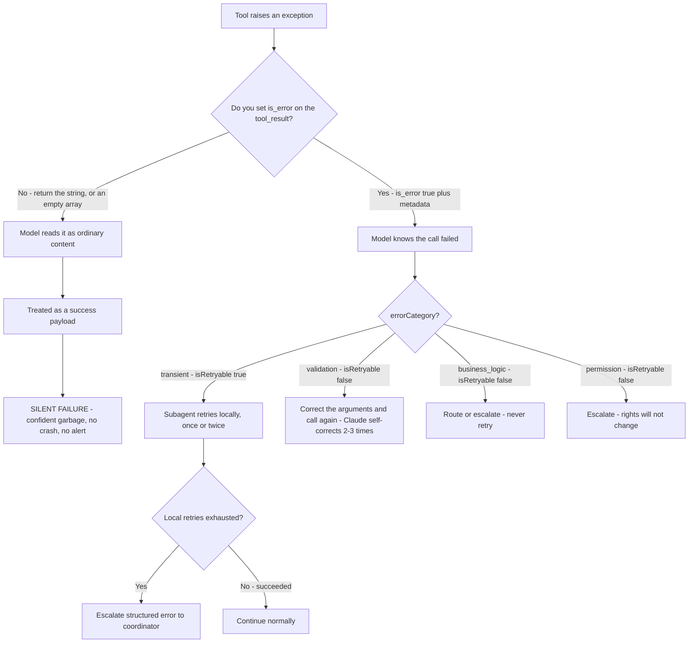
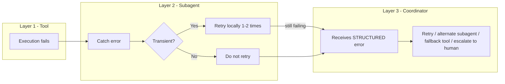
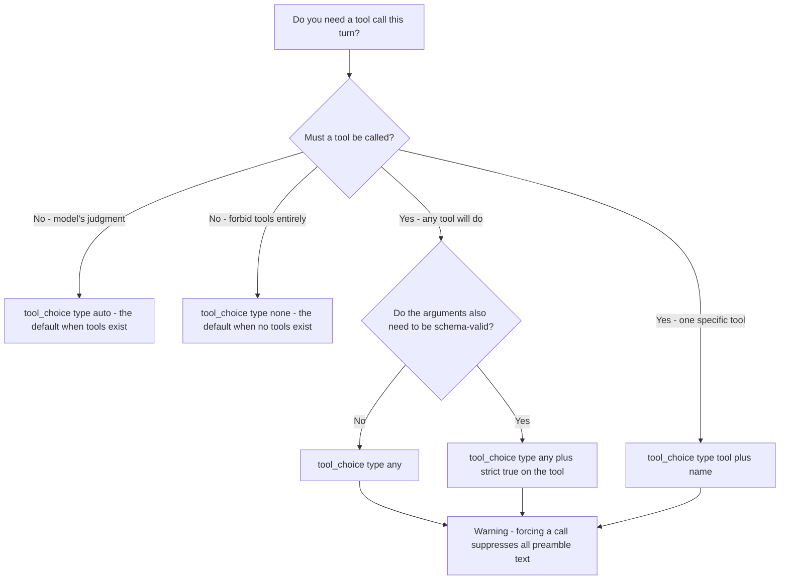

---
tags:
  - CCA-F
  - domain-2
  - tool-design
  - error-handling
  - tool-choice
  - youtube-course
date: 2026-08-03
status: done
domain: "2 of 5"
source: "Peace Of Code — Claude Certified Architect Ep 07"
---

# 🚨 EP07 — Agent Error Handling & tool_choice

> [!NOTE] Exam Coverage
> Maps to **Domain 2 — Tool Design & MCP Integration**, task statements **2.2** (structured error responses) and **2.3** (distributing tools across agents, `tool_choice`), with the escalation ladder touching **Domain 5 — Context Management & Reliability**, task statements **5.2** (escalation) and **5.3** (error propagation). Covers silent failure as the core agentic bug, the `is_error` flag and which protocol layer it belongs to, the four error categories and what `isRetryable` actually asks, structured error metadata, local recovery before escalation, tool overload and scoped access, and all four `tool_choice` values.

**Back to:** [[CCA-F Study Roadmap]] · **Domain note:** [[D2 - Tool Design & MCP Integration]] · **Deck:** [[EP07 - Flashcards]]
**Source:** [Peace Of Code — Ep 07 (38 min)](https://www.youtube.com/watch?v=eZj6FtTVV58) · Level: college / professional-certification · Question mix calibrated MCQ-heavy (40 / 40 / 20)
**Previous:** [[EP06 - Tool Descriptions & Tool Misrouting]]

---

## 1. Outline

- [1. Outline](#1-outline)
- [2. Key Terms](#2-key-terms)
- [3. Concept Summaries](#3-concept-summaries)
  - [3.1 Silent Failure — The Core Agentic Bug](#31-silent-failure--the-core-agentic-bug)
  - [3.2 The is_error Flag — and Which Layer You Are On](#32-the-is_error-flag--and-which-layer-you-are-on)
  - [3.3 The Four Error Categories](#33-the-four-error-categories)
  - [3.4 What "Retryable" Actually Asks](#34-what-retryable-actually-asks)
  - [3.5 Structured Error Metadata](#35-structured-error-metadata)
  - [3.6 Local Recovery Before Escalation](#36-local-recovery-before-escalation)
  - [3.7 The Tool Overload Problem](#37-the-tool-overload-problem)
  - [3.8 Scoped Tool Access](#38-scoped-tool-access)
  - [3.9 tool_choice — Four Values, Not Three](#39-tool_choice--four-values-not-three)
  - [3.10 The Full Picture and the Exam Signals](#310-the-full-picture-and-the-exam-signals)
- [4. Diagrams](#4-diagrams)
- [5. Worked Examples](#5-worked-examples)
- [6. Practice Questions](#6-practice-questions)
- [7. Cheat Sheet](#7-cheat-sheet)

---

## 2. Key Terms

| Term | Definition | Source |
|---|---|---|
| **Silent failure** | A tool fails, the agent is not told, and it *"confidently returns the garbage result."* No crash, no alert. The episode's thesis and, in the host's phrase, *"the silent killer of agentic systems."* | [01:08] |
| **Swallowed error** | An error returned as ordinary content, so the model treats it as a success payload and reasons on top of it. | [02:08] |
| **`is_error`** | The **Claude Messages API** field on a `tool_result` block, set to `true` when the tool failed. Optional; **snake_case**. | *(correction — §3.2)* |
| **`isError`** | The **MCP** protocol's equivalent field on a tool result — **camelCase**. Same idea, different layer. | [03:20] |
| **Error category** | Which *kind* of failure occurred: **transient · validation · business logic · permission**. An application-level convention, not an API field. | [06:10] |
| **Transient error** | Timeouts, network blips, service unavailable, database down. *"It might succeed if you try again in a moment."* The one retryable category. | [07:03] |
| **Validation error** | Malformed or invalid input parameters. Retrying the *same* call never succeeds. | [08:16] |
| **Business-logic error** | A policy violation — the refund above \$500. Not retryable; the rule will fire again identically. | [09:49] |
| **Permission error** | Authorization failure: the agent lacks rights to call the tool or reach the resource. Not retryable. | [11:00] |
| **`isRetryable`** | The flag telling the coordinator whether repeating the **identical** call could succeed. Convention, not API schema. | [07:44] |
| **Structured error metadata** | Category + retryability + human-readable description + optional fallbacks and `retryAfterMs`, so the coordinator can route rather than guess. | [12:38] |
| **Generic error** | *"Operation failed"* with nothing else. The host: *"Generic errors are just a dead end."* | [13:21] |
| **Local recovery** | A subagent retrying a transient failure once or twice **itself** before propagating upward. | [20:10] |
| **All-or-nothing anti-pattern** | Terminating the whole pipeline on a single untried failure. Named by the host as an exam distractor. | [22:29] |
| **Tool overload** | Giving one agent too many tools, degrading selection reliability at inference time. | [23:16] |
| **Scoped tool access** | Role-based tool distribution — each agent sees only the tools its role needs. Least privilege, applied to tools. | [26:40] |
| **`tool_choice`** | Request-level control over whether and which tool is called: `auto` · `any` · `tool` · **`none`**. Always an object. | *(correction — §3.9)* |
| **`strict: true`** | Tool-definition field guaranteeing inputs match the schema exactly — the real fix for validation errors. | *(expansion — §3.4)* |
| **Principle of least privilege** | The host's framing for scoped access: an agent gets the minimum tool surface its role requires. | [11:11] |

---

## 3. Concept Summaries

### 3.1 Silent Failure — The Core Agentic Bug

*Question: a tool starts failing in production. Why is the agent's behaviour worse than a crash?*

Because a crash tells you something. This episode opens on the failure mode that has no signal at all, and the host's framing is exactly right: *"It doesn't crash. It doesn't alert you. It just confidently returns the garbage result because it kind of swallowed the error."*

His diagnosis of the mechanism is the part worth internalising. A tool result is **just content** arriving in the conversation. If you hand back a string describing a database timeout with no error flag, the model has no structural basis for treating it differently from a successful payload:

> *"It doesn't differentiate between an error message because it's the message that it is receiving... If you're not properly propagating the error explicitly telling that this is an error, then the model will hallucinate success value and basically it will carry on."*

His contrast with ordinary programming is well drawn. In imperative code an unhandled exception **propagates by default** — it unwinds the stack until something catches it, and if nothing does, the process dies loudly. In an agentic loop the default is the opposite: an unflagged failure is **absorbed** into context and becomes a premise for subsequent reasoning. The blast radius grows quietly rather than terminating.

That inverts where you must put your effort. In a `try/catch` world you write handlers to *stop* propagation. Here you write handlers to *cause* propagation — to make the failure visible to the one component that decides what happens next. The host states the exam-relevant version cleanly: **the model must explicitly know a failure occurred in order to reason about recovery.**

He also names the opposite extreme, and both are anti-patterns: a failure so unhandled that it *"completely breaks the pipeline."* Silent absorption and total collapse are the two ways to get this wrong; §3.6 is the middle path.

**In your own words:** Exceptions propagate by default; tool failures are absorbed by default. Unless you flag it, an error becomes a premise the model reasons on top of.

*See PQ 1, 2, 16.*

---

### 3.2 The is_error Flag — and Which Layer You Are On

*Question: what actually makes a failure structurally visible to the model?*

One boolean on the tool result. The host is right that this is the mechanism, and right that MCP defines it — but the casing depends on which layer you are writing at, and the exam can test either.

> [!IMPORTANT] Two layers, two spellings — verify which one the stem is describing
> - **Claude Messages API** — the field on a `tool_result` content block is **`is_error`** (snake_case), and it is **optional**:
>   ```json
>   {
>     "role": "user",
>     "content": [{
>       "type": "tool_result",
>       "tool_use_id": "toolu_01A09q90qw90lq917835lq9",
>       "content": "ConnectionError: the weather service API is not available (HTTP 500)",
>       "is_error": true
>     }]
>   }
>   ```
> - **MCP** — the protocol's tool-result field is **`isError`** (camelCase), as documented in [[D2 - Tool Design & MCP Integration]] §2.2.
>
> Same concept, different layer. If a stem shows a `tool_result` block, it is `is_error`; if it shows an MCP server's return value, it is `isError`.
> Source: [Handle tool calls → Handling errors with is_error](https://platform.claude.com/docs/en/agents-and-tools/tool-use/handle-tool-calls)

The host's stated anti-pattern is correct and is the exam's favourite wrong answer: **returning an empty array on failure.** *"Don't return an empty array because that also the agent will treat as a success response."* An empty result is a *valid outcome* — a query that matched nothing — so overloading it to mean "something broke" destroys the only distinction that matters downstream.

> [!WARNING] The distinction the lecture skips, and the exam tests
> The lecture treats "empty array" purely as a wrong way to signal failure. The exam tests the **other direction** too: an empty result with **no** error flag is *correct* when the query genuinely matched nothing.
> - ❌ `is_error: true` → something went **wrong** accessing the data → coordinator may retry or escalate
> - ✅ Empty results, no error flag → query **succeeded**, no matching data exists → **do not retry**
>
> Conflating these makes the coordinator retry valid empty results forever.
> Consistent with [[D2 - Tool Design & MCP Integration]] §2.2 and [[D5 - Context Management & Reliability]] §5.3

Two official specifics the lecture does not cover, both easy exam marks:

- **Write instructive error messages, not labels.** Official guidance: *"Instead of generic errors like `"failed"`, include what went wrong and what Claude should try next, e.g. `"Rate limit exceeded. Retry after 60 seconds."`"* This is the same instinct as §3.5's structured metadata, expressed in prose.
- **Server tools need none of this.** *"When server tools encounter errors... Claude will transparently handle these errors... Unlike client tools, you do not need to handle `is_error` results for server tools."* The whole `is_error` discipline is a **client-tool** obligation. (Web search does surface its own error codes: `too_many_requests`, `invalid_input`, `max_uses_exceeded`, `query_too_long`, `unavailable`.)

> [!WARNING] MCP is not exposed "via the A2A protocol" — verified against official docs
> The lecture says you wrap an API in MCP *"and basically expose it via the A2A protocol. Now agents are intelligent enough to understand the metadata behind the A2A protocol."* That conflates two unrelated protocols. **MCP** connects a host's MCP *client* to MCP *servers* over defined transports — **stdio**, **streamable HTTP**, **SSE** (legacy), or **WebSocket** — configured in `.mcp.json`. **A2A (Agent2Agent)** is a separate agent-to-agent protocol and plays no part in how Claude discovers or calls MCP tools.
> **Exam answer: MCP tools are discovered through the MCP client/server handshake over stdio or HTTP.** A2A is not part of the CCA-F surface.
> Source: consistent with [[D2 - Tool Design & MCP Integration]] §2.4 *Transport Types*

**In your own words:** One optional boolean converts absorbed content into a signalled failure — `is_error` on the Messages API, `isError` in MCP. Empty is not an error, and server tools handle their own.

*See PQ 3, 4, 5, 17.*

---

### 3.3 The Four Error Categories

*Question: the model knows something failed. Why isn't that enough?*

Because *"which type of error has occurred, that also you need to inform, so that each type of error can be handled in a separate manner."* A bare `is_error: true` says *stop trusting this result*; it does not say *what to do next*. Retry, reroute, and escalate are three different responses, and only the category distinguishes them.

The host's analogy to HTTP status classes is apt — 4xx (your request is wrong) versus 5xx (my server is broken) drive completely different client behaviour, and the same split runs through tool failures:

| Category | Trigger | `isRetryable` | Correct response |
|---|---|---|---|
| **Transient** | Timeout, network blip, service unavailable, DB down | **`true`** | Retry locally, with backoff |
| **Validation** | Malformed / invalid input parameters | **`false`** | Correct the arguments and call again |
| **Business logic** | Policy violation (refund > \$500) | **`false`** | Route or escalate — never retry |
| **Permission** | Authorization failure, tool not accessible | **`false`** | Escalate; a retry cannot grant rights |

His reasoning per category is sound. Transient failures are *"an intermittent issue which will resolve on its own"*, so repetition is genuinely the fix. Business-logic failures are the mirror image: *"there is no point in retrying because it is violating some of your business logic — so why will you retry?"* The rule is deterministic, so the second attempt gets the identical denial. Permission is the same shape — rights don't materialise on attempt two.

Note how this joins up with [[EP05 - PreToolUse, PostToolUse Hooks & Task Decomposition]]: the host points out that a `PreToolUse` hook is exactly where a business-logic error gets constructed. The hook denies the call **and** hands back `is_error: true` with `errorCategory: "business_logic"`, so the denial arrives as a routable signal rather than a dead end. EP05's `permissionDecisionReason` is that description field, seen from the hook's side.

**In your own words:** `is_error` says *don't trust this*. The category says *what to do instead* — and only transient failures answer "try again."

*See PQ 6, 7, 8, 18.*

---

### 3.4 What "Retryable" Actually Asks

*Question: is a validation error retryable? The lecture spends two minutes hedging. What is the answer?*

**No** — and the hedge is worth unpicking, because the confusion is instructive rather than careless. Listen to what he actually describes:

> *"When you pass that certain type of string it is accepting, but when you are not passing the certain type of string it is failing. So retry with a different type of string is possible."*

That is not a retry. **A retry is repeating the identical call.** Calling the tool again with *corrected arguments* is a **new call** — the fix was changing the input, not the repetition. Once you hold the definition steady, the flag resolves cleanly:

> `isRetryable` answers exactly one question: **would repeating this same call, unchanged, plausibly succeed?**

- Transient → **yes**, nothing about the call was wrong; the environment was briefly unavailable.
- Validation → **no**, the call itself is malformed; identical input fails identically forever.
- Business logic → **no**, the rule is deterministic.
- Permission → **no**, rights do not change between attempts.

The host does land on the right exam behaviour even while muddling the mechanism — *"retrievable is possible, but we need to fix the issue"* and his own code sets `is_retryable = False` for `ValueError`. Take the code, not the commentary. [[D2 - Tool Design & MCP Integration]] §2.2 records validation as `isRetryable: false`, and that is the exam answer.

> [!IMPORTANT] Officially, Claude already does the corrected-retry loop for you
> Two verified facts turn the lecture's hedging into something crisp:
> - **Claude self-corrects invalid tool calls.** *"If a tool request is invalid or missing parameters, Claude will retry **2-3 times with corrections** before apologizing to the user."* So the "retry with a different value" the host gropes toward is **model behaviour you get for free** when you return `is_error: true` with an instructive message — not something you mark retryable.
> - **`strict: true` prevents the category entirely.** *"To eliminate invalid tool calls entirely, use strict tool use with `strict: true` on your tool definitions. This guarantees that tool inputs will always match your schema exactly, preventing missing parameters and type mismatches."* Requires `additionalProperties: false` plus `required` in the schema, and sits at the **top level** of the tool definition — not inside `tool_choice`.
>
> **Exam answer: validation → `isRetryable: false`, fix the input.** Real code: return an instructive error and let Claude self-correct; add `strict: true` so it never happens.
> Source: [Handle tool calls → Invalid tool name](https://platform.claude.com/docs/en/agents-and-tools/tool-use/handle-tool-calls)

His warning about exam options is genuinely useful, though: *"Retrievable is possible, but it should be fixed. The exam will try to trick you."* Read every option to the end — an option that says "retry" and an option that says "correct the input and call again" are not the same answer, and only one describes what actually resolves a validation failure.

**In your own words:** `isRetryable` asks whether the *identical* call could succeed. Only transient failures qualify. Fixing the arguments and calling again is a new call, not a retry.

*See PQ 7, 8, 9, 18.*

---

### 3.5 Structured Error Metadata

*Question: `is_error: true` with content "Operation failed" reaches the coordinator. What can it do?*

Nothing useful. The host's framing is the memorable one: *"Generic errors are just a dead end."* The coordinator can see that something broke, and it cannot tell whether to retry, reroute to another subagent, try a fallback tool, or escalate to a human. Every recovery path is equally plausible, so it guesses — or gives up.

His prescription is the payload that makes routing mechanical:

```python
metadata = {
    "error_category": "transient",          # which recovery family applies
    "is_retryable": True,                   # may the identical call be repeated?
    "retry_after_ms": 2000,                 # pacing, when retryable
    "description": "Database timeout after 30s",   # human-readable, for debugging
    "alternatives": ["cached_customer_lookup"],     # fallback tools to try instead
}
```

Four jobs, cleanly separated: **category** selects the recovery family, **`is_retryable`** answers the immediate question, **`description`** serves the human reading the logs, and **`alternatives`** gives the coordinator a concrete next move instead of a dead end. His note that `retry_after_ms` appears **only** on retryable errors is a good discipline — a retry delay on a permission error is noise that invites a wrong decision.

> [!IMPORTANT] These field names are *your* convention — the API defines only the boolean
> The lecture presents `error_category`, `is_retryable`, and `retry_after_ms` as though they were protocol. They are not. Officially the **only** error signal in the API is `is_error`; everything else lives inside free-form `content`. The official error examples are plain strings — `"ConnectionError: the weather service API is not available (HTTP 500)"`, `"Error: Missing required 'location' parameter"` — with no structured envelope at all.
> What *is* official is the **principle**: *"Write instructive error messages. Instead of generic errors like `"failed"`, include what went wrong and what Claude should try next... This gives Claude the context it needs to recover or adapt without guessing."*
> **Exam answer: `is_error` + `errorCategory` + `isRetryable` is the complete structured error signal** — the host names this as an exam answer and [[D2 - Tool Design & MCP Integration]] §2.2 records the same pattern. Real code: you design and name these fields yourself; only `is_error` is validated by the API.
> Source: [Handle tool calls → Handling errors with is_error](https://platform.claude.com/docs/en/agents-and-tools/tool-use/handle-tool-calls) · pattern consistent with [[D5 - Context Management & Reliability]] §5.3

> [!WARNING] Tool results are untrusted input — a security note the lecture omits
> Official docs warn that tool results *"often carry content from sources outside your control: web pages, inbound email, user uploads, third-party APIs"*, and that an attacker who can influence them may embed instructions to redirect Claude (**indirect prompt injection**). Keep that content inside `tool_result` blocks rather than promoting it into `system` prompts or plain user `text` blocks. This applies to error `description` fields too — an error string echoing an upstream API's response body is attacker-influenceable content.

Two formatting rules that will fail a request outright, and are pure exam fodder:

- `tool_result` blocks must **immediately follow** their corresponding `tool_use` blocks — no messages in between.
- Within the user message, `tool_result` blocks must come **first** in the `content` array; any text comes **after**. Text before a `tool_result` is a **400**.
- And from parallel tool use: for a failed tool, still return its `tool_result` with `is_error: true` — **never drop it.** A missing result for a `tool_use` id is an error.

**In your own words:** The boolean says *failed*; the metadata says *what to do*. Category, retryability, description, alternatives — and only `is_error` is enforced by the API.

*See PQ 10, 11, 16.*

---

### 3.6 Local Recovery Before Escalation

*Question: a subagent's tool times out. Should it tell the coordinator?*

Not yet. This is the section the host flags as *"very easy to miss, but really separates well-designed multi-agent systems"* from sloppy ones, and his workplace analogy carries it: a junior who hits a slow system and escalates to the architect without trying anything first has skipped their own job. A subagent owes the same diligence.

The three-layer ladder:

| Layer | Owner | Action |
|---|---|---|
| **1** | Tool | Execution fails |
| **2** | Subagent | Catches the error; retries **locally** for transient categories (once or twice) |
| **3** | Coordinator | Receives a **structured** error only after local options are exhausted, then routes: retry, alternate subagent, fallback tool, or human |

Two things make this work, and both come from earlier sections. The retry only happens at layer 2 because the **category** said transient (§3.3) — a subagent that retries a permission error is burning attempts on a deterministic denial. And the escalation to layer 3 carries **structured metadata** (§3.5), so the coordinator's decision is a lookup rather than a guess.

The host names the exam distractor explicitly, and it is the one to memorise: **terminating a pipeline on a single untried failure is an all-or-nothing anti-pattern.** His formulation of the correct option is worth keeping verbatim: *"Sub-agents must handle their own transient failures locally. The coordinator is only involved when local options are exhausted."*

> [!TIP] Two ceilings on retrying, and neither is unlimited
> The bound matters as much as the retry. The host says *"one or two retries"* at layer 2; officially, Claude's own self-correction on invalid tool calls is capped at **2–3 attempts** before it gives up and apologises to the user. Both layers are deliberately shallow — unbounded retry converts a transient blip into a stalled agent, which is the third anti-pattern hiding behind the other two.
> Consistent with [[D5 - Context Management & Reliability]] §5.3 *Local Recovery vs Propagation*

**In your own words:** Retry transient failures where they happen, once or twice, then escalate with structure. Never escalate untried; never terminate on one failure; never retry forever.

*See PQ 12, 13, 17.*

---

### 3.7 The Tool Overload Problem

*Question: one tool works well. Are twenty tools better?*

No, and the host's pause for effect is earned, because the intuition is genuinely wrong: *"Intuitively, you might think yes, because the agent has more options and it is a more capable agent — but no."*

His mechanism is correct: selection happens **at inference time**, over descriptions, under uncertainty. Each additional tool is another candidate the model must discriminate against — and if descriptions overlap or names are near-synonyms, *"the model's confidence in its selection goes down."* This is precisely [[EP06 - Tool Descriptions & Tool Misrouting]]'s overlap problem, now scaled: overlap between three tools is a coin flip, and overlap across twenty is a lottery.

His consequence is the exam-relevant sentence: *"Bloated tool sets result in wrong tools firing and hard-to-debug logic errors."* Note **hard to debug** — this closes the loop with §3.1, because a misroute is silent too. Neither of this episode's two failure classes announces itself.

[[D2 - Tool Design & MCP Integration]] §2.3 gives the numeric heuristics the lecture gestures at: **4–5 tools** reliable · **10+** degraded · **18+** significant misuse.

> [!NOTE] How official docs frame scale — three levers instead of a threshold
> Official guidance addresses tool count without publishing a ceiling:
> - **Consolidate related operations** — group `create_pr`/`review_pr`/`merge_pr` into one tool with an `action` parameter. *"Fewer, more capable tools reduce selection ambiguity."*
> - **Namespace by service** — `github_list_prs`, `slack_send_message`.
> - **Tool search tool** — built to *"work with thousands of tools"* by discovering and loading definitions on demand via `defer_loading`, so schemas stay out of context until needed. Note the constraint: the search tool itself must **not** be deferred, and at least one tool must remain non-deferred, or the API returns **400** (*"All tools have defer_loading set"*).
>
> So the vault's thresholds are best read as guidance about **undifferentiated** tool sets rather than a hard cap — twenty well-namespaced tools behind tool search is a supported architecture; twenty near-synonyms in one flat array is the failure the lecture describes.

**In your own words:** Every extra tool is another candidate to discriminate against at inference time. Twenty overlapping tools is a lottery — and the resulting misroute is as silent as an unflagged error.

*See PQ 14, 15.*

---

### 3.8 Scoped Tool Access

*Question: how do you keep the tool set small without losing capability?*

Distribute it by role. The whole system can own twenty tools as long as **no single agent sees twenty**. The host's name for this is the exam's term — **scoped tool access** — and his framing of *why* is the better half:

> *"It's not about restriction... the main purpose is it's for its own good. It's about giving each agent a clear, unambiguous tool set so it can reliably select the right one."*

That reframe matters. Scoping reads like a security control, and it is one — he correctly invokes the **principle of least privilege**, and a tool the agent cannot see is a permission error that can never occur. But its primary payoff is **accuracy**: a smaller, role-aligned tool set is an easier selection problem. Security and reliability point the same way here, which is rare enough to be worth noticing.

His two worked distributions:

| Support system | Research system |
|---|---|
| Coordinator → `get_customer`, `escalate_to_human` | Research subagent → `search_web`, `fetch_url`, `extract_content` |
| Order subagent → `lookup_order`, `process_refund` | Document subagent → `read_document`, `parse_pdf`, `extract_sections` |
| Comms subagent → `send_email`, `create_ticket` | Synthesis agent → `verify_fact` |

The synthesis agent is the instructive case, and it is the exam scenario verbatim: *"Synthesis agent can have access to a tool known as `verify_fact`, but why does it need web search? It doesn't need web search."* An agent handed a tool outside its specialism tends to **misuse** it — a synthesis agent with `search_web` starts researching instead of synthesising, which is a role failure, not a tool failure.

> [!IMPORTANT] The sample exam scenario, and why each distractor fails
> **Stem:** *"Which tool configuration best improves synthesis agent accuracy?"*
> **Answer: give it a scoped `verify_fact` tool** — one purpose-built verification tool aligned to its role.
> - ❌ *Full web access* — adds selection ambiguity and invites the agent out of its role
> - ❌ *More search tools* — compounds the same error; more candidates, lower confidence
> - ❌ *A more capable model* — the defect is the tool surface, not the reasoning
> Consistent with [[D2 - Tool Design & MCP Integration]] §2.3, which also notes the refinement: for a high-frequency cross-role need, supply a **scoped constrained** tool rather than the full generic one — e.g. `load_document` (validates document URLs only) instead of a general `fetch_url`.

Scoping is enforced two ways, and they are complementary rather than alternatives: **don't pass the tool** in that agent's definition (it becomes unselectable), or **deny it in a `PreToolUse` hook** (it becomes unexecutable). The host mentions both. The first improves selection accuracy; the second is the deterministic guarantee from EP05.

**In your own words:** The system can hold twenty tools; no agent should see twenty. Scope by role — it is least privilege *and* an easier selection problem at once.

*See PQ 15, 18.*

---

### 3.9 tool_choice — Four Values, Not Three

*Question: scoping shapes which tools exist. How do you guarantee one actually gets called?*

With `tool_choice`. The host covers three values well — and the set has four.

> [!WARNING] `tool_choice` has **four** values, not three — verified against official docs
> The lecture says *"tool choice has three types of flags... one is auto, one is any, and one is tool."* Officially there are **four**: `auto`, `any`, `tool`, and **`none`**. `none` prevents Claude from calling any tool while the definitions stay in the request, and it is the **default when no tools are provided** (`auto` is the default when tools *are* provided).
> **Exam answer: four values — `auto`, `any`, `tool`, `none`.** Real code: same.
> Source: [Define tools → Forcing tool use](https://platform.claude.com/docs/en/agents-and-tools/tool-use/define-tools) · consistent with [[D2 - Tool Design & MCP Integration]] §2.3, which lists all four correctly

The full table:

| Value | Behaviour | Use when |
|---|---|---|
| `{"type": "auto"}` | Model decides whether to call a tool or answer in text. **Default when tools are provided** | Default; flexible |
| `{"type": "any"}` | Model **must** call some tool — it picks which | You need a guaranteed tool call, never prose |
| `{"type": "tool", "name": "..."}` | Model **must** call this exact tool | Forcing a specific extraction step |
| `{"type": "none"}` | Model **cannot** call any tool; definitions stay defined. **Default when no tools are provided** | Forcing a text-only turn |

The host's `auto` versus `any` contrast is the one the exam leans on, and he gets it right: *"Auto means Claude has to select one tool, but if Claude doesn't find a tool, then it might not execute the tool. But if you're passing the tool choice as `any`, then Claude has to execute the tool."* Under `auto` a tool call is **permitted**; under `any` it is **required**.

Four official specifics to layer on:

- **`tool_choice` is always an object.** Bare strings like `"auto"` are invalid — per [[D2 - Tool Design & MCP Integration]] §2.3.
- **Forcing a call suppresses the preamble.** With `any` or `tool`, *"the API prefills the assistant message to force a tool to be used"*, so **no natural-language text precedes the `tool_use` block, even if you explicitly ask for it.** For a forced call *plus* an explanation, use `auto` and put the instruction in the user turn (*"Use the `get_weather` tool in your response"*). The host's *"no text response is allowed"* is correct — this is the mechanism.
- **`disable_parallel_tool_use: true`** can be added to any `tool_choice` value to cap the model at one tool call per turn. Parallel tool use is **on by default**.
- **Manual extended thinking blocks forced tool use.** With `thinking: {type: "enabled"}`, `any` and `tool` **error** — only `auto` and `none` are compatible. **Adaptive thinking** (`{type: "adaptive"}`, including models where thinking is on by default such as Claude Opus 5) *does* support forced tool use. On **Amazon Bedrock** with Claude Sonnet 5, forced `tool_choice` additionally requires `thinking: {type: "disabled"}`.

> [!IMPORTANT] "`any` for guaranteed structured output" — the exam answer, with a real-code caveat
> The host's exam signal is *"select `any` when the requirement is guaranteed structured output generation"*, matching [[D2 - Tool Design & MCP Integration]] §2.3. Keep that for the exam. But be precise about what `any` guarantees: it guarantees **that a tool is called**, not that the arguments are schema-valid. Officially there are two purpose-built mechanisms:
> - **`strict: true`** on the tool definition — guarantees inputs match the schema exactly. Docs: *"Combine `tool_choice: {"type": "any"}` with strict tool use to guarantee **both** that one of your tools will be called AND that the tool inputs strictly follow your schema."*
> - **`output_config: {format: {"type": "json_schema", "schema": {...}}}`** — constrains the *response* to a JSON schema, with no tool involved at all. The older top-level `output_format` parameter is deprecated.
>
> **Exam answer: `tool_choice: {"type": "any"}`.** Real code: `any` + `strict: true` for a guaranteed schema-valid call, or `output_config.format` when you want structured output rather than a tool call.
> Source: [Define tools → Forcing tool use](https://platform.claude.com/docs/en/agents-and-tools/tool-use/define-tools)

One caching note that bites in production: **changing `tool_choice` invalidates cached message blocks.** Tool definitions and the system prompt stay cached, but message content must be reprocessed — so don't vary `tool_choice` per request inside a long cached conversation without expecting the cost.

**In your own words:** `auto` permits, `any` requires some tool, `tool` requires one named tool, `none` forbids all. Always an object; forcing a call silences the preamble.

*See PQ 4, 9, 11, 18.*

---

### 3.10 The Full Picture and the Exam Signals

*Question: how do the five mechanisms in this episode compose into one execution flow?*

As a pipeline where each stage answers a different question — and the host's closing recap sequences them correctly:

1. **Scoped tool access** narrows *which tools exist* for this agent → selection is reliable.
2. **`tool_choice`** decides *whether a call is required* → `any` forces execution.
3. **`is_error` + metadata** makes a failure *visible and routable* → no silent absorption.
4. **Local recovery** resolves what can be resolved *where it happened* → transient blips don't travel.
5. **Coordinator escalation** routes what genuinely needs deciding → retry, reroute, fallback, or human.

His three exam takeaways, restated precisely:

| Signal | Answer |
|---|---|
| Complete structured error signal | **`is_error` + `errorCategory` + `isRetryable`** |
| Improving tool selection reliability | **Scoped tool access** — adding tools actively degrades selection |
| Guaranteed structured output generation | **`tool_choice: {"type": "any"}"`** |

And his three elimination targets — options that are wrong on sight:

- ❌ Silently returning **empty arrays** on failure
- ❌ **Terminating a pipeline** on a single untried failure
- ❌ Escalating to the coordinator **without attempting local recovery**

> [!WARNING] Unverified — confirm against the official study guide
> The host attributes this material to *"task 2.2, 2.3, whatever — it is taken from the syllabus itself."* The **domain and subdomain mapping is sound** (error responses and tool distribution are D2's 2.2 and 2.3 in this vault's own map), but the precise task-statement numbering in Anthropic's published syllabus cannot be checked against public documentation. Domain 2's **exam weight percentage** is likewise not published anywhere in this vault — do not memorise a figure. His *"you would pass the exam 100%"* is promotional, not a claim about content.

> [!TIP] Transcription artifacts in this episode
> The auto-captions garble a lot here. Recognise these so you don't second-guess yourself on review:
> - **"is retrievable" / "retrievable"** throughout → **`isRetryable`** / *retryable*. This is the episode's most frequent and most confusing artifact — it appears dozens of times and has nothing to do with retrieval
> - **"Cloud Certified Architect"** [00:03] → *Claude Certified Architect*
> - **"mod x model context protocol"** [03:52] → stumble over *MCP / model context protocol*
> - **"the com sub-agent... tools should only be visible to the tools"** [26:40] → *visible to the **com sub-agent***
> - **"role-based distribution of tools should be the way forward"** — correct as spoken; the slide term is *scoped tool access*
> - **"if a sub agent is fall failing with transient transient error"** [35:53] → stutters
> - **"here only it is true"** [33:22] → garbled while reading code aloud
> - **"tool choice is type it sort of"** [33:52] → *type is `auto`*
> - **"post hook tool, post-tool hook, whatever you want to call"** [16:08] → *`PostToolUse`*
> - **`>> [snorts] >>`** [14:18] · [18:56] · [27:07] → stray speaker-change artifacts mid-sentence
> - **"And these are taken this task 2. 2 2. 3 2. 3, whatever"** [36:45] → *task statements 2.2 and 2.3*

**In your own words:** Scope narrows, `tool_choice` forces, `is_error` reveals, local recovery absorbs, the coordinator decides. Five stages, five different questions.

*See PQ 16, 17, 18.*

---

## 4. Diagrams


*The fork that defines the episode. Without `is_error`, every branch below it is unreachable and the failure becomes a premise for further reasoning.*


*The recovery ladder. Escalating from layer 1 straight to layer 3 is the untried-escalation anti-pattern; killing the pipeline at layer 1 is the all-or-nothing anti-pattern.*


*All four `tool_choice` values. `any` guarantees a call; `strict: true` guarantees the arguments; `output_config.format` is the alternative when you want structured output without a tool.*

---

## 5. Worked Examples

### Example 1 — Turn a bare exception into a routable error result

**Problem.** A `lookup_order` tool raises `TimeoutError` after 30 seconds. The current handler returns `{"orders": []}`. Rewrite it so the coordinator can act.

**Step 1 — Name why the current return is the worst possible one.**
*(why: it is not merely unhelpful — it is actively misleading. An empty array is a **valid** outcome meaning "no matching orders", so the agent will report "you have no orders" for a customer who does.)*
It silently converts an infrastructure failure into a confident factual claim.

**Step 2 — Set the flag that changes the block's structural meaning.**
*(why: this is the only field the API validates. On the Messages API it is `is_error`, snake_case, on the `tool_result` block.)*
```json
{
  "type": "tool_result",
  "tool_use_id": "toolu_01A09q90qw90lq917835lq9",
  "is_error": true
}
```

**Step 3 — Write an instructive `content`, not a label.**
*(why: official guidance — include what went wrong **and what Claude should try next**. `"failed"` gives the model nothing to reason with.)*
```json
"content": "Database timeout after 30s querying orders. This is transient — retry in 2 seconds."
```

**Step 4 — Add the structured envelope your coordinator reads.**
*(why: category selects the recovery family, `is_retryable` answers the immediate question, `alternatives` gives a concrete fallback. These names are **your** convention — the API only enforces `is_error`.)*
```python
metadata = {
    "error_category": "transient",
    "is_retryable": True,
    "retry_after_ms": 2000,
    "description": "Database timeout after 30s querying orders",
    "alternatives": ["cached_order_lookup"],
}
```

**Step 5 — Check placement.**
*(why: two rules 400 the request. The `tool_result` must immediately follow its `tool_use`, and it must come **first** in the user message's `content` array — any text after.)*

**Answer:** `is_error: true`, an instructive `content` string, and a metadata envelope carrying category + retryability + delay + alternatives. The coordinator now retries after 2 s rather than reporting "no orders found" — and note that only **one** of those five fields is API schema.

---

### Example 2 — Classify four failures and decide retry for each

**Problem.** In one run: (a) the orders DB times out, (b) `process_refund` is called with `amount: "fifty"`, (c) a \$750 refund hits the \$500 policy gate, (d) the comms subagent calls `process_refund`, which it was never granted. Classify each and set `is_retryable`.

**Step 1 — Apply the retryability question, not intuition.**
*(why: the single test is **"would repeating this identical call plausibly succeed?"** — this is where the lecture's hedging goes wrong.)*

| # | Category | `is_retryable` | Why |
|---|---|---|---|
| a | `transient` | **`true`** | Nothing about the call is wrong; the DB was briefly unavailable |
| b | `validation` | **`false`** | `"fifty"` is malformed; identical input fails identically forever |
| c | `business_logic` | **`false`** | The gate is deterministic — attempt two gets the same denial |
| d | `permission` | **`false`** | Rights do not materialise between attempts |

**Step 2 — Note what "fix it and call again" really is for (b).**
*(why: correcting `"fifty"` → `50` is a **new call**, not a retry. Officially Claude does this itself — it *"will retry 2-3 times with corrections"* when handed an instructive error.)*
So `is_retryable: false` is correct **and** the failure still self-heals.

**Step 3 — Prevent (b) structurally.**
*(why: `strict: true` with `additionalProperties: false` + `required` guarantees inputs match the schema, eliminating the category rather than handling it.)*

**Step 4 — Route the three non-retryable cases distinctly.**
*(why: same flag, three different destinations — which is exactly why `is_error` alone is insufficient.)* (b) self-corrects · (c) escalates to a human with the policy reason · (d) is a **configuration** defect — fix the comms subagent's tool scope so the call becomes unmakeable.

**Answer:** one retryable, three not — and the three non-retryables demand three different responses (self-correct, escalate, re-scope). Only (a) may be retried locally; only (d) is fixed by changing the architecture rather than handling the error.

---

### Example 3 — Why two local retries are worth it

**Problem.** A subagent's tool fails transiently on 30% of calls; each attempt succeeds independently with $p = 0.7$. The system runs 10,000 calls/day. Compare escalation volume with 0, 1, and 2 local retries.

**Step 1 — Probability that all attempts fail.**
*(why: independent attempts, so the failure probabilities multiply. This is what reaches the coordinator.)*

$$P(\text{escalate}) = (1 - p)^{n+1} = 0.3^{\,n+1}$$

**Step 2 — Evaluate for each retry budget.**
*(why: turns a design choice into a number.)*

| Local retries | $P(\text{escalate})$ | Escalations/day |
|---|---|---|
| 0 | $0.3^1 = 0.300$ | **3,000** |
| 1 | $0.3^2 = 0.090$ | **900** |
| 2 | $0.3^3 = 0.027$ | **270** |

**Step 3 — Read the marginal return.**
*(why: this is why the host says "one or two", not "keep trying".)* The first retry removes 2,100 escalations/day; the second removes 630; a third would remove ~189. Returns decay geometrically while latency cost accrues linearly.

$$\text{Success after 2 retries} = 1 - 0.3^3 = 0.973$$

**Step 4 — Bound the worst case.**
*(why: a retry budget is also a latency budget. With `retry_after_ms = 2000`, two retries add up to 4 s of delay before escalation.)*

$$t_{\max} = 2 \times 2000\,\text{ms} = 4\,\text{s}$$

**Answer:** two local retries cut coordinator escalations from **3,000/day to 270** — a **91%** reduction — at a worst-case cost of 4 s added latency, taking end-to-end success from 70% to **97.3%**. This is the arithmetic behind *"the coordinator is only involved when local options are exhausted"*, and behind stopping at two: the third retry buys 0.8 percentage points for another 2 s.

---

## 6. Practice Questions

1. Why is an unflagged tool failure more dangerous in an agentic loop than an unhandled exception in ordinary code? *(§3.1)*

   <details><summary>Answer</summary>
   Because the **defaults are inverted**. An unhandled exception propagates until something catches it, and kills the process loudly if nothing does. An unflagged tool failure is **absorbed into context** as ordinary content and becomes a premise for further reasoning — no crash, no alert, just confident wrong output.
   </details>

2. What does the model do with an error string returned without an error flag, and why? *(§3.1)*

   <details><summary>Answer</summary>
   It treats it as a **success payload** and reasons on top of it. A tool result is just content; without a structural marker there is nothing distinguishing "the DB timed out" from "here is your data", so the model hallucinates a success value and continues.
   </details>

3. Give the exact field name and casing that flags a failed tool result on the **Claude Messages API**, and the MCP equivalent. *(§3.2)*

   <details><summary>Answer</summary>
   Messages API: **`is_error`** (snake_case), an optional field on the `tool_result` content block. MCP: **`isError`** (camelCase) on the tool result. Same concept, different protocol layer.
   </details>

4. Which of `is_error` and `tool_choice` is required by the API, and what is each one's default behaviour if omitted? *(§3.2, §3.9)*

   <details><summary>Answer</summary>
   **Neither is required.** Omitting `is_error` means the result is treated as a success. Omitting `tool_choice` gives `auto` when tools are provided, and `none` when no tools are provided.
   </details>

5. A search tool finds no matching records. Should it set the error flag? *(§3.2)*

   <details><summary>Answer</summary>
   **No.** An empty result with **no** error flag means the query **succeeded** and no matching data exists — a valid outcome the coordinator must not retry. Reserve the error flag for something going wrong *accessing* the data. Conflating the two causes endless retries of valid empty results.
   </details>

6. Name the four error categories and the trigger for each. *(§3.3)*

   <details><summary>Answer</summary>
   **Transient** — timeout, network blip, service unavailable. **Validation** — malformed or invalid input parameters. **Business logic** — policy violation (refund over \$500). **Permission** — authorization failure or inaccessible tool.
   </details>

7. Which of the four categories is retryable, and give the one-sentence reason for each of the other three. *(§3.3, §3.4)*

   <details><summary>Answer</summary>
   Only **transient**. Validation — the call itself is malformed, so identical input fails identically. Business logic — the rule is deterministic, so attempt two gets the same denial. Permission — rights do not change between attempts.
   </details>

8. State precisely what the `isRetryable` flag asks. *(§3.4)*

   <details><summary>Answer</summary>
   **Would repeating this same call, unchanged, plausibly succeed?** Not "could this ever be made to work" — calling again with *corrected* arguments is a **new call**, not a retry, which is why validation errors are `isRetryable: false`.
   </details>

9. Officially, how many times does Claude self-correct an invalid tool call, and which tool-definition field eliminates the problem entirely? *(§3.4)*

   <details><summary>Answer</summary>
   Claude retries **2–3 times with corrections** before apologising to the user. **`strict: true`** on the tool definition (with `additionalProperties: false` and `required` in the schema) guarantees inputs match the schema exactly, preventing missing parameters and type mismatches.
   </details>

10. The coordinator receives `is_error: true` with content "Operation failed". Name the three decisions it cannot make. *(§3.5)*

    <details><summary>Answer</summary>
    Whether to **retry**, whether to **reroute** to a different subagent or fallback tool, and whether to **escalate** to a human. As the host puts it, generic errors are a dead end — every recovery path looks equally plausible.
    </details>

11. Which fields in a structured error payload are API schema, and which are your own convention? *(§3.5)*

    <details><summary>Answer</summary>
    **Only `is_error`** is defined and validated by the API. `errorCategory`, `isRetryable`, `retryAfterMs`, `description`, and `alternatives` are **application-level conventions** you design, carried inside the free-form `content`. Official error examples are plain instructive strings with no envelope.
    </details>

12. Describe the three-layer recovery ladder and who owns each layer. *(§3.6)*

    <details><summary>Answer</summary>
    **Layer 1 — tool:** execution fails. **Layer 2 — subagent:** catches the error and retries locally (once or twice) for transient categories only. **Layer 3 — coordinator:** receives a structured error once local options are exhausted, then routes — retry, alternate subagent, fallback tool, or human.
    </details>

13. Name the three error-handling anti-patterns this episode flags as exam eliminations. *(§3.6, §3.10)*

    <details><summary>Answer</summary>
    **Silently returning empty arrays** on failure · **terminating the pipeline** on a single untried failure (all-or-nothing) · **escalating to the coordinator without attempting local recovery.** A fourth lurks behind them: **unbounded retry**, which stalls the agent instead of failing it.
    </details>

14. Why does giving one agent twenty tools reduce accuracy rather than increase capability? *(§3.7)*

    <details><summary>Answer</summary>
    Selection happens **at inference time** over descriptions. Each extra tool is another candidate to discriminate against, and with overlapping descriptions or near-synonym names the model's selection confidence drops — producing wrong tools firing and, in the host's words, hard-to-debug logic errors.
    </details>

15. **Application.** Stem: "Which tool configuration best improves synthesis agent accuracy?" Give the answer and reject each distractor. *(§3.8)*

    <details><summary>Answer</summary>
    **Give it a scoped `verify_fact` tool** — one purpose-built verification tool aligned to its role. *Full web access* adds selection ambiguity and invites the agent out of its role (it starts researching instead of synthesising). *More search tools* compounds that error. *A more capable model* misdiagnoses the defect, which is the tool surface, not the reasoning.
    </details>

16. **Application.** A subagent's DB tool times out. Trace the correct handling end to end, naming the mechanism at each step. *(§3.2, §3.3, §3.5, §3.6)*

    <details><summary>Answer</summary>
    (1) Return the `tool_result` with **`is_error: true`** and an instructive `content` string — never an empty array. (2) Tag **`error_category: "transient"`**, **`is_retryable: true`**, `retry_after_ms: 2000`. (3) The **subagent retries locally** once or twice — layer 2. (4) If still failing, **escalate the structured error** to the coordinator. (5) The coordinator routes on the metadata: retry, alternate subagent, fallback tool, or human. Never terminate the pipeline on the first failure.
    </details>

17. **Application.** Your team is debating `tool_choice: {"type": "any"}` versus `{"type": "tool", "name": "extract_order"}` for a step that must always produce schema-valid structured data. Advise them. *(§3.9)*

    <details><summary>Answer</summary>
    **`any`** guarantees *some* tool is called; **`tool`** guarantees *that* tool is called — use `tool` when exactly one extraction shape is valid. Neither guarantees the **arguments** are schema-valid: add **`strict: true`** to the tool definition for that. If you want structured output without a tool call at all, use **`output_config: {format: {...}}`** instead. Also warn them that forcing a call suppresses all preamble text, and that changing `tool_choice` invalidates cached message blocks.
    </details>

18. **Application.** A comms subagent is calling `process_refund`, which is outside its role. Two mechanisms could stop this — name both, and say which fixes the root cause. *(§3.8, §3.3)*

    <details><summary>Answer</summary>
    **(1) Scoped tool access** — don't pass `process_refund` in that subagent's definition, making the call **unselectable**. **(2) A `PreToolUse` hook** denying it with `is_error: true` and `error_category: "permission"`, making it **unexecutable**. Scoping fixes the root cause: it removes the selection ambiguity entirely and improves accuracy, whereas the hook catches an attempt that should never have been possible. Use the hook as the deterministic backstop, not the primary fix.
    </details>

---

## 7. Cheat Sheet

| Cue | Note |
|---|---|
| Silent failure | Unflagged error absorbed as content → confident garbage, no crash |
| Messages API flag | **`is_error`** (snake_case), optional, on `tool_result` |
| MCP flag | **`isError`** (camelCase) |
| Empty array on failure | ❌ Anti-pattern. Empty + **no** flag = valid "no data" |
| Server tools | Handle their own — `is_error` is a **client-tool** job |
| Four categories | transient · validation · business_logic · permission |
| Retryable | **Transient only** |
| What `isRetryable` asks | Would the **identical** call succeed if repeated? |
| Validation fix | Correct the args (**new** call); Claude self-corrects **2–3×**; `strict: true` prevents |
| Complete error signal | **`is_error` + `errorCategory` + `isRetryable`** — but only `is_error` is API-defined |
| Recovery ladder | tool → subagent retry (1–2, transient) → coordinator |
| Tool overload | More tools → lower confidence (4–5 ok · 10+ degraded · 18+ misuse) |
| Scoped access | Role-based tools — least privilege **and** easier selection |
| Synthesis-agent stem | Scoped `verify_fact`, **not** web access or more search tools |
| `tool_choice` values | **Four:** `auto` (default w/ tools) · `any` · `tool` · `none` (default w/o) |
| `auto` vs `any` | `auto` **permits** a call; `any` **requires** one |
| Forced call side effect | `any`/`tool` prefill the turn → **no preamble text** |
| Guaranteed schema | `any` + **`strict: true`**, or `output_config.format` without a tool |
| Thinking conflict | Manual `thinking: enabled` errors with `any`/`tool`; adaptive is fine |

**Top 5 terms:** `is_error` · error category · `isRetryable` · local recovery before escalation · scoped tool access

> [!WARNING] Anti-patterns
> ❌ Returning an empty array (or bare string) when a tool fails
> ❌ `is_error: true` with content "Operation failed" — a dead end
> ❌ Marking validation or permission errors retryable
> ❌ Escalating without attempting local recovery
> ❌ Terminating the pipeline on one untried failure
> ❌ Retrying without a bound — stalls the agent instead of failing it
> ✅ Flag + category + retryability + description → retry locally → escalate structured

> **Synthesis:** This episode is about **making failure legible**. It pairs two bugs sharing one property: neither announces itself. An unflagged error is absorbed as fact; a misrouted call returns the wrong answer confidently. Both are silent, so both are handled *before* they happen — by structuring what a failure looks like, and narrowing what the model may choose from. The organising insight: agentic error handling **inverts** ordinary error handling. You don't write handlers to stop propagation, you write them to *cause* it, because the component deciding what happens next is a language model that only knows what you tell it. Everything follows: categories because "failed" isn't actionable, local recovery because not every failure deserves the coordinator, scoping because the cheapest failure was never selectable.

---

## ✅ Practice Checklist

- [ ] Can explain why tool failures are absorbed by default while exceptions propagate by default
- [ ] Knows `is_error` (Messages API, snake_case) vs `isError` (MCP, camelCase)
- [ ] Can explain why an empty array is both a bad failure signal and a valid success outcome
- [ ] Knows the `is_error` discipline applies to client tools, not server tools
- [ ] Can name all four error categories and their triggers
- [ ] Knows transient is the only retryable category, with a reason for each of the other three
- [ ] Can state precisely what `isRetryable` asks, and why "fix and call again" isn't a retry
- [ ] Knows Claude self-corrects invalid tool calls 2–3 times, and that `strict: true` prevents them
- [ ] Can list the fields of a structured error payload — and which single one the API defines
- [ ] Knows tool results are untrusted input (indirect prompt injection)
- [ ] Can describe the three-layer recovery ladder and who owns each layer
- [ ] Can name all four error-handling anti-patterns, including unbounded retry
- [ ] Can explain why more tools degrades selection reliability
- [ ] Can answer the synthesis-agent scoped-tool stem and reject all three distractors
- [ ] Can list all four `tool_choice` values and both defaults
- [ ] Knows `auto` permits vs `any` requires, and that forcing a call suppresses preamble text
- [ ] Knows `any` guarantees a call but not schema-valid arguments — `strict: true` does that
- [ ] Knows manual extended thinking is incompatible with forced `tool_choice`

*Next: [[EP08 - MCP Servers, Config & Cline]]*
