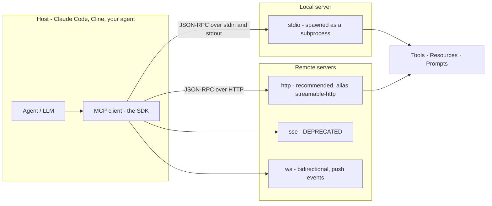
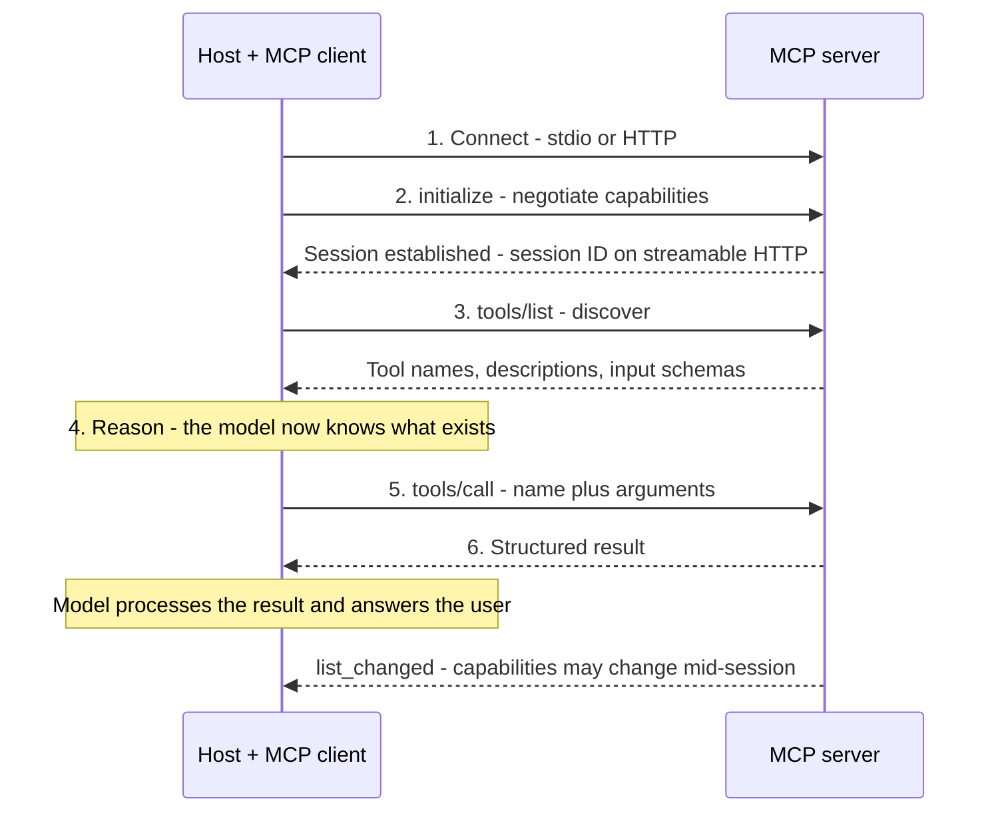
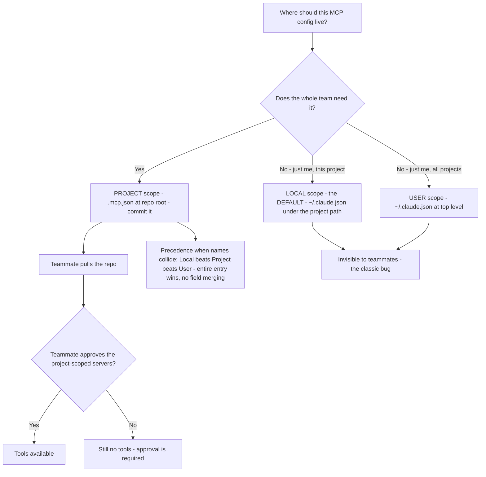

---
tags:
  - CCA-F
  - domain-2
  - mcp
  - configuration
  - youtube-course
date: 2026-08-03
status: done
domain: "2 of 5"
source: "Peace Of Code — Claude Certified Architect Ep 08"
---

# 🔌 EP08 — MCP Servers, Config & Cline

> [!NOTE] Exam Coverage
> Maps to **Domain 2 — Tool Design & MCP Integration**, primarily task statement **2.4** (MCP server integration — configuration scopes, transports, environment variables, resources), with the description material touching **2.1** (tool interfaces) and the tool-loading material touching **2.3** (tool distribution) and **Domain 5** task statement **5.1** (long-context management). Covers why MCP exists, the host/client/server architecture, the connect→initialize→discover→invoke lifecycle, the **three** configuration scopes, `.mcp.json` structure and all four transports, `${VAR}` expansion, MCP resources, community vs custom servers, and how MCP tools compete with Claude's built-ins.

**Back to:** [[CCA-F Study Roadmap]] · **Domain note:** [[D2 - Tool Design & MCP Integration]] · **Deck:** [[EP08 - Flashcards]]
**Source:** [Peace Of Code — Ep 08 (89 min)](https://www.youtube.com/watch?v=IVUxGTxSuH8) · Level: college / professional-certification · Question mix calibrated MCQ-heavy (40 / 40 / 20)
**Previous:** [[EP07 - Agent Error Handling & tool_choice]]

---

## 1. Outline

- [1. Outline](#1-outline)
- [2. Key Terms](#2-key-terms)
- [3. Concept Summaries](#3-concept-summaries)
  - [3.1 Why MCP Exists — Embedded Tools Do Not Compose](#31-why-mcp-exists--embedded-tools-do-not-compose)
  - [3.2 MCP Architecture — Host, Client, Server](#32-mcp-architecture--host-client-server)
  - [3.3 The Communication Lifecycle](#33-the-communication-lifecycle)
  - [3.4 MCP vs REST APIs](#34-mcp-vs-rest-apis)
  - [3.5 The Three Configuration Scopes](#35-the-three-configuration-scopes)
  - [3.6 mcp.json Structure and the Four Transports](#36-mcpjson-structure-and-the-four-transports)
  - [3.7 Environment Variable Expansion](#37-environment-variable-expansion)
  - [3.8 MCP Resources — Catalog Instead of Search](#38-mcp-resources--catalog-instead-of-search)
  - [3.9 Community vs Custom Servers](#39-community-vs-custom-servers)
  - [3.10 Competing With Claude's Built-in Tools](#310-competing-with-claudes-built-in-tools)
  - [3.11 Tool Loading — Deferred by Default](#311-tool-loading--deferred-by-default)
  - [3.12 The Decision Framework and Exam Signals](#312-the-decision-framework-and-exam-signals)
- [4. Diagrams](#4-diagrams)
- [5. Worked Examples](#5-worked-examples)
- [6. Practice Questions](#6-practice-questions)
- [7. Cheat Sheet](#7-cheat-sheet)

---

## 2. Key Terms

| Term | Definition | Source |
|---|---|---|
| **MCP** | **Model Context Protocol** — an open standard for how AI applications discover and use external capabilities. The host's analogy: *"MCP is like a USB-C for AI."* | [01:44] |
| **Host** | The application running the agent — Claude Code, Cline, your own agent. It owns the MCP **client**. | [08:36] |
| **MCP client** | The SDK inside the host that speaks MCP to a server. One client per connected server. | [09:04] |
| **MCP server** | The provider — exposes **tools**, **resources**, and **prompts**. The host's framing: *"MCP server is just a provider."* | [10:30] |
| **JSON-RPC 2.0** | MCP's wire format. Over stdio for local servers, over HTTP for remote ones. | [09:41] |
| **Stateful session** | MCP maintains a session across calls, not one-shot requests. *"MCP means stateful. Keep that in mind."* | [14:02] |
| **`tools/list`** | The discovery method — asks a server what tools it offers. Siblings: `resources/list`, `prompts/list`. | [16:08] |
| **`tools/call`** | The invocation method — executes a named tool with arguments. | [34:53] |
| **`.mcp.json`** | **Project-scope** config at the repo root. Version-controlled, shared with the team. | [01:01:06] |
| **`~/.claude.json`** | Home-directory config holding **both** local-scope (per-project) and user-scope (all-projects) servers. Never shared. | *(correction — §3.5)* |
| **Local scope** | **The default.** Server loads only in the project where you added it, stored in `~/.claude.json` under that project's path. The real cause of the "teammate has no tools" bug. | *(correction — §3.5)* |
| **Project scope** | `.mcp.json` at the repo root — the only scope shared via version control. | [01:23:10] |
| **User scope** | `~/.claude.json` at top level — available across all your projects, private to you. | [01:02:27] |
| **`type`** | The transport field on a server entry: `http` (alias `streamable-http`) · `sse` (deprecated) · `stdio` · `ws`. A `url` with no `type` is a config error. | *(correction — §3.6)* |
| **stdio server** | A local MCP server Claude spawns as a **subprocess**, communicating over standard input/output. | [01:05:11] |
| **Environment variable expansion** | `${VAR}` and `${VAR:-default}` inside `.mcp.json`, so secrets stay out of version control. | [01:07:30] |
| **MCP resource** | Content a server exposes directly as a browsable catalog, referenced with `@server:protocol://path`. Removes exploratory tool calls. | [01:11:20] |
| **Community server** | A public, ready-made MCP server (GitHub, Notion, Asana). Start here. | [01:15:08] |
| **Custom server** | One you build — e.g. with **FastMCP** — for internal, authenticated capabilities. | [01:15:08] |
| **Tool search** | Claude Code's **default** behaviour: MCP tool definitions are **deferred** and loaded on demand. | *(correction — §3.11)* |
| **`alwaysLoad`** | `.mcp.json` field exempting a server from deferral, so its tools load at session start. | *(expansion — §3.11)* |
| **Context pollution** | Too many tool definitions in context degrading selection and crowding out conversation. | [01:20:58] |

---

## 3. Concept Summaries

### 3.1 Why MCP Exists — Embedded Tools Do Not Compose

*Question: you already know how to write tools as functions in your agent. What problem does MCP solve that this doesn't?*

Reuse. The host's motivation is concrete and drawn from his own project: he built `send_notification` and `store_incident` as functions **inside** his incident agent, and then noticed the obvious limitation:

> *"If agent number two wants to access that particular tool, it is not possible, because it is kind of very closely coupled in the particular agent code itself. Only that agent knows about those tools... So, every agent integration becomes custom and very brittle."*

That is the whole argument. A tool defined inside an agent is a **private method**; the capability is real but unshareable. MCP moves it behind a protocol so **any** host can discover it — your agent, Claude Code, Cline, Codex, Cursor. His USB-C analogy carries the point: standardise the port and every peripheral works with every device, instead of one custom cable per pairing.

Three things follow, and the second is easy to miss:

1. **Runtime discovery.** The host doesn't need compile-time knowledge of the tools; it asks.
2. **Decoupled change.** His best example: if a wrapped API moves from `/v1/` to `/v2/`, you change the **server**, and every agent keeps working. With an embedded HTTP call you edit and redeploy each agent.
3. **Not just tools.** MCP exposes **tools**, **resources**, and **prompts**. The host is right to stress this — *"It is not just for tools"* — and §3.8 shows why resources matter as much.

**In your own words:** A tool inside an agent is a private method. MCP turns it into a service any host can discover, so capability and consumer version independently.

*See PQ 1, 2.*

---

### 3.2 MCP Architecture — Host, Client, Server

*Question: what are the moving parts, and where does each live?*

Three, and the host walks them cleanly. The **host** is the agent or application. Inside it sits the **client** — an SDK, available in Python, TypeScript, Java and more, so *"it is generic, you don't have to worry about that."* The client connects to an **MCP server**, which holds the tools, resources, and prompts.

His demystification is the useful part, and it is accurate: *"MCP is nothing like a rocket science kind of a thing. It is just a JSON-RPC server. It is just JSON-RPC over HTTP."* MCP is **JSON-RPC 2.0** — a request/response envelope with `jsonrpc`, `id`, `method`, and `params`. His REST-client comparison is apt: just as you need an HTTP client to call an API, you need an MCP client to call an MCP server, and the SDK is that client.

One precision worth holding: **JSON-RPC is the message format; the transport varies.** Remote servers carry JSON-RPC over HTTP; local **stdio** servers carry the same JSON-RPC over standard input/output, with no HTTP involved. The host mostly gets this right — he introduces stdio separately — but the flat claim *"it is just JSON-RPC over HTTP"* is true only of the remote case.

His session point is correct and exam-relevant: **MCP is stateful.** *"MCP is not just random request, like a stateless request. It has a life cycle."* A streamable-HTTP server issues a session ID at initialize, and subsequent calls carry it. His live demo against OpenAI's public docs server shows the caveat too — some public servers skip session IDs because they need no per-client state.

**In your own words:** Host owns the client; the client speaks JSON-RPC to a server that owns the capabilities. Stateful, with a session, not one-shot requests.

*See PQ 3, 4.*

---

### 3.3 The Communication Lifecycle

*Question: what actually happens between an agent and an MCP server, in order?*

Six phases. The host is right that this is under-explained elsewhere, and he does the genuinely useful thing of driving it by hand with `curl` so the sequence is visible rather than abstract:

| # | Phase | What happens |
|---|---|---|
| 1 | **Connect** | Host opens a transport to the server — stdio or HTTP |
| 2 | **Initialize** | Client and server negotiate capabilities; a session is established (session ID on streamable HTTP) |
| 3 | **Discover** | Client calls **`tools/list`** — *"What does the MCP server offer?"* |
| 4 | **Reason** | The model now has context: what tools exist, what they do, what arguments they expect |
| 5 | **Invoke** | Client calls **`tools/call`** with a tool name and arguments |
| 6 | **Return** | Server returns a structured result; the model processes it and answers the user |

The method names are correct and worth memorising literally — **`tools/list`** and **`tools/call`**, with `resources/list` and `prompts/list` as the siblings for the other two capability kinds.

His framing of phase 3 versus the previous episodes is the conceptual payoff: *"Instead of hardcoding tool knowledge... here, the client can dynamically ask the server, what are your capabilities?"* That inverts where tool knowledge lives. In EP06 the descriptions were text you wrote into your own `tools` array; here they arrive from the server at runtime — which is exactly why §3.10's problem exists, because you no longer control that text.

> [!TIP] Two lifecycle refinements worth knowing **(expansion)**
> - **Capability lists can change mid-session.** Claude Code supports MCP `list_changed` notifications, so a server can add or remove tools, prompts, and resources without a reconnect — Claude Code refreshes automatically. If a refresh fails, it keeps the previously discovered capabilities rather than emptying the list.
> - **Discovery calls retry.** `tools/list`, `prompts/list`, and `resources/list` retry transient network and server errors up to **three times** with short backoff. Authentication errors, 4xx responses, and request timeouts are **not** retried — which connects to [[EP07 - Agent Error Handling & tool_choice]] §3.3: transient is retryable, permission is not, all the way down at the protocol layer.
> Source: [Connect Claude Code to tools via MCP](https://code.claude.com/docs/en/mcp)

**In your own words:** Connect, initialize a session, `tools/list` to discover, reason, `tools/call` to invoke, return. Tool knowledge arrives at runtime instead of being written in.

*See PQ 3, 5, 17.*

---

### 3.4 MCP vs REST APIs

*Question: will MCP servers replace APIs?*

No, and the host's answer is well argued: *"It will not get rid of APIs because still APIs are a way where microservices communicate."* His comparison holds up:

| | REST API | MCP server |
|---|---|---|
| Exposes | Backend business logic | Tools and context to AI applications |
| Audience | User-facing endpoints, other services | AI-facing discovery |
| Interface | HTTP + your contract | JSON-RPC over HTTP or stdio |
| Discovery | Client must know routes up front | Agent discovers capabilities at runtime |

His resolution — *"APIs stay. MCP standardizes AI integration and discovery"* — is the right one, and the practical consequence is that MCP usually **wraps** an API rather than replacing it: *"If an API is to be used for an agent, it will just be wrapped in an MCP server."*

> [!IMPORTANT] The lecture uses A2A correctly here — unlike EP07
> In EP08 he says: *"You can use the A2A protocol to connect your chatbot to the agent, and the agent then can connect with the MCP server using the MCP protocol."* That separation is right — **A2A (Agent2Agent)** is agent-to-agent; **MCP** is agent-to-capability. In [[EP07 - Agent Error Handling & tool_choice]] §3.2 he wrongly claimed MCP servers are *"exposed via the A2A protocol"*; this episode implicitly corrects it. **Exam answer: MCP is how an agent reaches tools; A2A is not part of the MCP transport story.**

He also lists real integration surfaces — Claude Code, Codex, Cursor, Cline — and the strongest enterprise case: an **internal** MCP server exposing company-private systems that a public model can't know about, *"well protected and authenticated by your tokens."* His security caveat deserves quoting because it is the correct instinct: *"MCP is not magic... your base security and authentication always remains the same. If you're using OAuth, keep using OAuth."* MCP standardises the shape of the conversation, not the authorisation model. He also flags **prompt injection and tool poisoning** — consistent with [[EP07 - Agent Error Handling & tool_choice]] §3.5's warning that tool results are untrusted input.

**In your own words:** APIs serve services and UIs; MCP serves agents. MCP wraps APIs for AI-facing discovery — and inherits none of your auth for free.

*See PQ 6, 18.*

---

### 3.5 The Three Configuration Scopes

*Question: your agent works locally, your teammate clones the repo, and the MCP tools are gone. What went wrong?*

**The config was written at the wrong scope** — and this is the episode's centrepiece, correctly identified by the host as near-certain exam material. His diagnosis is directionally right: project-level config belongs in a version-controlled file, personal config belongs in your home directory, and putting the former in the latter breaks everybody else. But the official scope model has **three** levels, not two, and the missing one is both the default *and* the actual culprit in his scenario.

> [!WARNING] There are **three** MCP scopes, not two — and **local is the default** — verified against official docs
> The lecture teaches *"two types of configurations: project level and user level."* Officially:
>
> | Scope | Loads in | Shared with team | Stored in |
> |---|---|---|---|
> | **Local** *(the default)* | Current project only | **No** | `~/.claude.json`, under that project's path |
> | **Project** | Current project only | **Yes**, via version control | **`.mcp.json`** in project root |
> | **User** | **All** your projects | No | `~/.claude.json`, at top level |
>
> Note what this does to his scenario. `claude mcp add` **defaults to local scope** — so a developer who adds a server without `--scope project` gets an entry in `~/.claude.json` nested under `projects."/path/to/your/project"`. It works perfectly for them, in that project only, and is invisible to everyone else. That is a sharper answer than "you put it in `.claude.json`": both local and user scope live in `~/.claude.json`, and **local is what you get by accident.**
> **Exam answer: move the config to `.mcp.json` at the project root (project scope) and commit it.** Real code: same, and pass `--scope project` explicitly so you don't land in local by default.
> Source: [MCP installation scopes](https://code.claude.com/docs/en/mcp) · [[D2 - Tool Design & MCP Integration]] §2.4 lists all three under its `--scope` section, though its *Configuration Scopes* table shows only project and user

The scope-selection question the host poses is the right one to carry into the exam: *"Just ask yourself, what the project needs, and what you need."* Database endpoints, which APIs the agent calls, which MCP servers the project depends on → **project**. Your personal API key, your SSH credentials, your preferences → **user** (or local).

> [!IMPORTANT] Precedence, and the fact that scopes do not merge
> When the same server name is defined at multiple scopes, Claude Code connects **once**, using the highest-precedence definition — and **the entire entry from that source is used; fields are not merged across scopes.** So a local-scope entry with a stale URL silently wins over a correct project-scope entry, and you cannot "override just the token" from a higher scope.
> Order: **1. Local → 2. Project → 3. User → 4. Plugin-provided → 5. claude.ai connectors.** The three scopes match duplicates by **name**; plugins and connectors match by **endpoint**.
> Source: [Scope hierarchy and precedence](https://code.claude.com/docs/en/mcp)

> [!WARNING] Committing `.mcp.json` is necessary but **not sufficient** — the half the lecture omits
> *"For security reasons, Claude Code prompts for approval before using project-scoped servers from `.mcp.json` files."* So your teammate pulls the committed file and still sees no tools until they **approve** the servers. If approval choices need resetting, run:
> ```bash
> claude mcp reset-project-choices
> ```
> A complete answer to the teammate scenario is therefore **two** steps: correct the scope, then have the teammate approve. Project-scoped servers awaiting approval are surfaced in the session rather than silently ignored.
> Source: [Project scope](https://code.claude.com/docs/en/mcp)

**In your own words:** Three scopes, one shared file. `.mcp.json` at the repo root is the only one your team gets; `~/.claude.json` holds both local *and* user, and local is the default you fall into.

*See PQ 7, 8, 9, 19.*

---

### 3.6 mcp.json Structure and the Four Transports

*Question: what goes inside `.mcp.json`, and how does Claude know how to reach each server?*

A top-level `mcpServers` object keyed by server name, with each entry declaring how to reach it. The host's framing is right — *"you name each server, and you tell Claude how to run or connect to it"* — and so is his advice that you needn't memorise particular servers, only the **structure**, since Claude Code can generate entries for you.

His transport split is the useful mental model: **stdio servers are local** and Claude *"spawns them as sub processes,"* communicating over standard input/output; **remote servers** are reached over the network. And his rule for choosing is exactly right and worth memorising: **"the choice is driven by where the server lives, not what the server does."**

> [!WARNING] Four transports, not two — and SSE is deprecated — verified against official docs
> The lecture says *"two flavors: STDIO servers and remote servers."* Officially there are **four** `type` values:
>
> | `type` | Use | Notes |
> |---|---|---|
> | **`http`** | Remote servers | **Recommended.** Accepts `streamable-http` as an alias, since that's the MCP spec's name |
> | **`sse`** | Remote, legacy | **Deprecated** — *"Use HTTP servers instead, where available"* |
> | **`stdio`** | Local subprocess | The default when no `type` is given |
> | **`ws`** | Remote, bidirectional | For servers that push events unprompted. Configurable only in `.mcp.json` / `claude mcp add-json` — `--transport` does **not** accept `ws`, and auth is header-only (no OAuth) |
>
> **The gotcha worth an exam mark:** an entry with a `url` but **no `type`** is a configuration error, because Claude Code reads a typeless entry as **stdio**. It skips the server and reports: `MCP server "<name>" has a "url" but no "type"; add "type": "http" (or "sse" / "ws") to this entry`.
> **Exam answer: stdio for local, HTTP for remote.** Real code: all four, with SSE deprecated and `type` always explicit on remote entries.
> Source: [Connect Claude Code to tools via MCP](https://code.claude.com/docs/en/mcp) · consistent with [[D2 - Tool Design & MCP Integration]] §2.4, which lists all four correctly — **the vault beats the video here**

The full field set for a server entry: `type`, `command`, `args`, `env` (stdio) · `url`, `headers`, `headersHelper` (remote) · plus `timeout` (per-server tool-execution timeout in ms, e.g. `"timeout": 600000`) and `alwaysLoad` (§3.11).

> [!TIP] The `--` separator on `claude mcp add` **(expansion)**
> For stdio servers, `--` separates Claude's own flags from the command that runs the server: `claude mcp add --transport stdio myserver -- npx -y airtable-mcp-server`. Everything after `--` is passed through untouched. Without it, Claude Code tries to parse the server's own flags (like `--port`) as its own.

**In your own words:** `mcpServers` keyed by name; `command`/`args` for local, `url` for remote. Pick the transport by where the server lives — and always set `type` on a remote entry.

*See PQ 10, 11, 20.*

---

### 3.7 Environment Variable Expansion

*Question: `.mcp.json` must be committed, but it needs your GitHub token. How?*

You don't put the token in it. The host states the tension precisely: *"You want `.mcp.json` to be in version control because it will be shared across your team, but your GitHub API token, your database password, your Slack webhook URL — those should never be in version control."*

The resolution is **environment variable expansion**: write `${GITHUB_TOKEN}` in the JSON, and Claude reads the value from the shell environment when it starts the server. His summary is the one to memorise — **"values stay local, variables ship to Git."**

His point that *how* you set the variable is environment-specific is a good one: `export` or `.zshrc` locally; container environment variables or a Dockerfile for ECS; and the Spring Boot comparison lands — the app resolves placeholders at startup and fails if they're unset.

> [!IMPORTANT] The syntax, completely — one form the lecture misses
> Two supported forms:
> - **`${VAR}`** — expands to the value of `VAR`
> - **`${VAR:-default}`** — expands to `VAR` if set, **otherwise uses `default`**
>
> The lecture teaches only the first, and its warning is correct: bare `$VAR` and `%VAR%` are **not** supported.
> Expansion works in exactly five places: **`command`**, **`args`**, **`env`**, **`url`**, and **`headers`**.
> ```json
> {
>   "mcpServers": {
>     "api-server": {
>       "type": "http",
>       "url": "${API_BASE_URL:-https://api.example.com}/mcp",
>       "headers": { "Authorization": "Bearer ${API_KEY}" }
>     }
>   }
> }
> ```
> Source: [Environment variable expansion in .mcp.json](https://code.claude.com/docs/en/mcp) · consistent with [[D2 - Tool Design & MCP Integration]] §2.4

> [!TIP] A `${VAR:-default}` gotcha worth knowing **(expansion)**
> Claude Code sets **`CLAUDE_PROJECT_DIR`** in the *spawned server's* environment — not in its own. So referencing it from a `.mcp.json` `command` or `args` requires the default form, **`${CLAUDE_PROJECT_DIR:-.}`**, because the variable isn't set in the environment doing the expansion. This is the clearest practical reason the `:-default` form exists.

**In your own words:** `${VAR}` in the file, value in the shell. Variables ship to Git; values never do — and `${VAR:-default}` covers what the shell might not have set.

*See PQ 12, 20.*

---

### 3.8 MCP Resources — Catalog Instead of Search

*Question: a documentation server holds 500 articles. What does Claude do without resources, and what does it cost?*

It searches blindly. The host's trace of the expensive path is the right setup: *"It calls a search tool, gets some results, calls it again with some different terms, reads a few articles, calls more tools. So by the time it finds the right content, it's burned through all of the tokens."*

**Resources** replace that with a catalog. A resource is content the server exposes directly, so *"it shows up in Claude's context as a structured catalog — Claude can see what's available up front."* His summary of the shift is the exam-grade sentence: **stop forcing Claude to burn five exploratory tool calls when exposing a catalog requires one.**

Two consequences he draws correctly. First, this is a **server-side** decision: *"it depends on the creator of the MCP server"* — you can't add resources to someone else's server, though major public servers (GitHub, OpenAI docs) generally do expose them. Second, when you build a custom server, deciding what to expose as resources versus tools is a design choice, not an afterthought.

> [!IMPORTANT] How resources are actually referenced in Claude Code
> The lecture describes the *benefit* but not the mechanism. Officially, MCP resources are referenced with **`@` mentions**, like files:
> ```text
> @github:issue://123
> @docs:file://api/authentication
> ```
> The format is **`@server:protocol://resource/path`**. Typing `@` lists available resources from all connected servers alongside files in the autocomplete; paths are fuzzy-searchable; referenced resources are **automatically fetched and included as attachments**. Claude Code also *"automatically provides tools to list and read MCP resources when servers support them"* — so the catalog is reachable both by your explicit `@` reference and by Claude itself.
> Source: [Use MCP resources](https://code.claude.com/docs/en/mcp) · extends [[D2 - Tool Design & MCP Integration]] §2.4 *MCP Resources*

The mental model worth carrying: **tools are verbs, resources are nouns.** A tool is something the agent *does*; a resource is something the agent *reads*. When content is static and enumerable — docs, templates, schemas, a source tree — a resource turns discovery from a search problem into a lookup.

**In your own words:** A tool makes Claude search for content; a resource hands it a catalog. Verbs are tools, nouns are resources — and only the server author can decide.

*See PQ 13, 14.*

---

### 3.9 Community vs Custom Servers

*Question: build your own MCP server, or use one that exists?*

Use what exists, until you can't. The host's split is the standard one and matches [[D2 - Tool Design & MCP Integration]] §2.4: **community servers** for standard integrations (GitHub, Notion, Asana, filesystem, fetch, memory), **custom servers** for capabilities only your organisation has.

His custom-server case is the right one: internal documentation and internal tools that a public model cannot know about, *"hosted in your own company's internal network, and it will not be a public MCP server,"* with authentication enabled. He names **FastMCP** as the Python route — a real library, and the pragmatic choice for a first custom server.

> [!WARNING] "Enhance a community server's tool descriptions via overrides in `.mcp.json`" — no such field exists
> The host recommends this twice: *"start with a community server, then enhance its generic tools descriptions via overrides in your `.mcp.json` file"*, and later points at *"some tool override over here."* **`.mcp.json` has no tool-override or description-override field.** A server entry accepts only: `type`, `command`, `args`, `env`, `url`, `headers`, `headersHelper`, `timeout`, and `alwaysLoad`.
> Tool descriptions come from the **server**, which is why §3.10's problem is real. Your consumer-side levers are:
> - **`alwaysLoad`** — force a server's tools into context at session start (§3.11)
> - **Permission rules** — `deny` a tool by its full `mcp__<server>__<tool>` name
> - **`enabledMcpServers` / `disabledMcpServers`** — allow/deny whole servers
> - **Fork or wrap the server** — the only way to actually change its descriptions
>
> **Exam answer: improving tool descriptions is the first fix for wrong-tool selection** — that principle is correct and officially supported (§3.10). But the *mechanism* named here is invented; don't reach for a `.mcp.json` override in real code, and be wary of an exam option that describes one.
> Source: field list per [Connect Claude Code to tools via MCP](https://code.claude.com/docs/en/mcp)

**In your own words:** Community first, custom when the capability is yours alone. But you cannot patch a community server's descriptions from `.mcp.json` — that lever doesn't exist.

*See PQ 15, 16.*

---

### 3.10 Competing With Claude's Built-in Tools

*Question: you connect a semantic code-search MCP server and Claude keeps using `Grep` instead. Why?*

Because your description lost. This is the episode's sharpest practical insight, and it is correct: Claude Code ships built-ins — `Grep`, `Glob`, `Bash`, `Read` — that the model knows intimately. The host's framing: *"When you add an MCP server, your tools have to compete with those built-ins for Claude's attention."*

And the tiebreaker is the description, exactly as in [[EP06 - Tool Descriptions & Tool Misrouting]]:

> *"If your description is very vague or minimal, then Claude will default to the built-in because it understands it better. But if your description is rich, specific, and clearly explains when to use a tool and when to use the alternative, then your tool wins."*

His before/after is the pattern:

- ❌ `"Tool to search the code base"` — Claude uses `Grep`; the description claims nothing `Grep` doesn't already do better
- ✅ `"Vector semantic search. Use instead of grep when the query describes intent or concept rather than an exact string. Returns ranked file paths with relevance scores."`

The winning version does three things: it names the **capability built-ins lack** (semantic vs literal), states **when to prefer it over the named alternative**, and declares its **return contract**. That is EP06's four-part template applied against a competitor.

His exam rule is well put and matches [[D2 - Tool Design & MCP Integration]] §2.4's own tip: **enhanced tool description is the first, highest-leverage fix for a wrong-tool-selection scenario.** Note the consistency across three episodes now — EP06 for overlap between your own tools, EP07 for scoped access, EP08 for competition with built-ins. Same lever, three settings.

> [!IMPORTANT] Where that description has to be written — and a 2KB ceiling
> Since descriptions come from the server (§3.9), improving them means changing the server. Official docs add a second lever specifically for the deferred-loading world: the **server instructions** field. *"Server instructions help Claude understand when to search for your tools, similar to how skills work"* — explain what category of tasks your tools handle, when Claude should search for them, and the key capabilities.
> **Claude Code truncates tool descriptions and server instructions at 2KB each** — so put critical details near the start.
> Source: [For MCP server authors](https://code.claude.com/docs/en/mcp)

**In your own words:** Your MCP tool competes with `Grep`, and the description is the tiebreaker. Name what the built-in can't do, say when to prefer yours, declare what it returns — in under 2KB.

*See PQ 16, 18.*

---

### 3.11 Tool Loading — Deferred by Default

*Question: you connect five MCP servers with fifty tools between them. What lands in Claude's context?*

The host's answer was true once and is now the opposite of current behaviour, which makes this the episode's most consequential correction.

> [!WARNING] "There is no lazy loading of tools in Claude" — reversed, verified against official docs
> The lecture is emphatic: *"There is no lazy loading of tools in Claude... Claude actually loads all the tools at once. If your agent has 50 tools, you are giving the 50 tools at once and Claude has everything at context."*
> Officially, in current Claude Code: **"Tool search is enabled by default. MCP tools are deferred rather than loaded into context upfront, and Claude uses a search tool to discover relevant ones when a task needs them. Only the tools Claude actually uses enter context."** At session start, **only tool names and server instructions** load — *"so adding more MCP servers has minimal impact on your context window."*
> Control it with `ENABLE_TOOL_SEARCH`:
>
> | Value | Behaviour |
> |---|---|
> | *(unset)* | **All MCP tools deferred**, loaded on demand — the default |
> | `true` | All deferred, forced even through proxies |
> | `auto` | Threshold: load upfront if they fit within **10%** of the context window, defer the overflow |
> | `auto:N` | Threshold with a custom percentage, e.g. `auto:5` |
> | `false` | **All loaded upfront** — the lecture's model, now opt-in |
>
> Requires a model supporting `tool_reference` blocks (Sonnet 4.5, Haiku 4.5, Opus 4.5, and later). *"Claude Code doesn't impose a fixed per-server tool cap; the practical limit is your context window budget."*
> **Exam answer: be careful.** The lecture's *conclusion* — don't overload an agent with tools — is still right, and is what the exam tests (see [[D2 - Tool Design & MCP Integration]] §2.3). But its *premise*, that no deferral mechanism exists, is now false. If a stem asks how to keep many MCP tools from polluting context, **tool search / deferred loading** is a correct answer.
> Source: [Scale with MCP tool search](https://code.claude.com/docs/en/mcp)

The host's **trade-off analysis remains valid**, and is worth keeping because it explains why both modes exist. Upfront loading buys **lower latency** — *"as Claude has everything in memory, it knows when to execute which tool"* — at the cost of **context pollution**: *"if we have too many tools, Claude's tool selection capability might get hampered because it has too much to go through."* Deferral inverts that: a search step costs a round trip, and buys context back. That is precisely why `auto` exists as a middle setting.

> [!IMPORTANT] Exempting a server from deferral — `alwaysLoad`
> For the handful of tools Claude needs on **every** turn, a search step is pure overhead. Set `alwaysLoad: true` on the server entry and all its tools load at session start regardless of `ENABLE_TOOL_SEARCH`:
> ```json
> { "mcpServers": { "core-tools": { "type": "http", "url": "https://mcp.example.com/mcp", "alwaysLoad": true } } }
> ```
> Available on all server types, Claude Code **v2.1.121+**. A server can also mark **individual** tools always-loaded with `"anthropic/alwaysLoad": true` in the tool's `_meta`.
> One cost: `alwaysLoad: true` **blocks startup** until that server connects (capped at the 5-second connect timeout), because the tools must exist when the first prompt is built. Other servers keep connecting in the background.
> Source: [Exempt a server from deferral](https://code.claude.com/docs/en/mcp)

His remedies are still the right ones and now compose with deferral: **scope tools per subagent** (EP07 §3.8) and **gate execution with hooks** (EP05). Deferral manages *context*; scoping manages *selection*; hooks manage *permission*. Three different problems.

**In your own words:** Claude Code defers MCP tool definitions by default and searches on demand — only names load at start. The lecture's "no lazy loading" is now backwards, but its warning against tool bloat still stands.

*See PQ 17, 19, 20.*

---

### 3.12 The Decision Framework and Exam Signals

*Question: how does this episode compress into something you can apply under exam pressure?*

Into a lookup from symptom to lever. The host's framework, restated with the official corrections folded in:

| Situation | Answer |
|---|---|
| Config must be **shared** with the team | **`.mcp.json`** at repo root (project scope), committed — **not** `~/.claude.json` |
| Config is **personal** | `~/.claude.json` — user scope for all projects, local for one |
| **Secrets** | **`${VAR}`** expansion; never hardcode. Values stay local, variables ship |
| **Static content** the agent reads | Expose as **MCP resources**, not a search tool |
| A **standard** service integration | **Community server** first; custom only for internal capability |
| **Wrong tool** chosen | **Improve the tool description** — server-side |
| Many tools **polluting context** | Deferred loading (default) · scope per agent · `alwaysLoad` only for always-needed tools |

His three headline exam scenarios:

1. **Teammate missing the tools** → move config from `~/.claude.json` to project-root `.mcp.json`. *(Plus: the teammate must approve the project-scoped servers — §3.5.)*
2. **Committing database passwords** → environment variable expansion, resolved from the local shell.
3. **Agent defaults to built-in `Grep`** → enhance the custom tool's description before trying anything else.

> [!WARNING] Unverified — confirm against the official study guide
> The host presents these as *"some key exam questions"* and describes the scope scenario as near-certain. The **content** of all three is verified above against official docs; whether they appear in Anthropic's published sample set, and in what form, cannot be checked against public documentation. Domain 2's **exam weight percentage** is likewise not published anywhere in this vault — do not memorise a figure for it. Also unverified: his aside that MCP was released *"in 2024, towards the beginning of 2025"* — the release date isn't in the docs fetched here and isn't exam-critical.

> [!TIP] Transcription artifacts in this episode
> The auto-captions garble a lot across 89 minutes. Recognise these so you don't second-guess yourself on review:
> - **"cloud.json" / "dot cloud.json"** throughout → **`.claude.json`**. The single most frequent artifact — every occurrence means the Claude config file
> - **"Klein" / "Klein, we tell it as Klein"** [23:54] → **Cline** (the VS Code extension)
> - **"fast A2A, uh sorry, fast MCP client"** [01:15:17] → **FastMCP** — he self-corrects
> - **"NCP MCP server"** [32:07] → *MCP server*
> - **"STIO streams"** [22:49] · **"STDIO"** elsewhere → **stdio**
> - **"MCP hub or something, MCP tester or something. I forgot the name"** [28:14] → **MCP Inspector**, which he demos later at [36:42]
> - **"percentile"** [01:10:33] → *percent sign* (`%VAR%`), in the list of syntaxes **not** to use
> - **"Value stay local, variable ship to get variables"** [01:10:49] → *values stay local, variables ship to **Git***
> - **"Claude rolled Claude kind of loads all the tools"** [01:20:06] → stutter; and the claim itself is corrected in §3.11
> - **"lazy loading not loading my bad lazy loading"** [01:19:51] → self-correction stumble
> - **"there might be, you know, um a local MCP server"** — long filler passages throughout; the slides carry the content
> - **`>> [snorts] >>`** at [15:19] · [19:05] · [34:53] · [01:17:51] and elsewhere → stray speaker-change artifacts

**In your own words:** Shared → `.mcp.json`. Secret → `${VAR}`. Static → resource. Standard → community. Wrong tool → description. Context bloat → deferral plus scoping.

*See PQ 18, 19, 20.*

---

## 4. Diagrams


*Host owns the client; the client speaks JSON-RPC to servers that own the capabilities. Transport is chosen by **where the server lives**, not what it does.*


*The six phases. `tools/list` and `tools/call` are the literal method names; `resources/list` and `prompts/list` are the siblings.*


*Three scopes, two files. Local is the default and shares nothing — which is why the teammate scenario happens. Committing `.mcp.json` is necessary but not sufficient.*

---

## 5. Worked Examples

### Example 1 — Diagnose "the teammate has no MCP tools"

**Problem.** Your agent uses GitHub, internal docs, and Jira MCP servers. It works for you. A teammate clones the repo and has none of them. Give the complete diagnosis and fix.

**Step 1 — Rule out the code.**
*(why: nothing about the agent changed between machines. The repo is identical, so the difference must be in a file that **isn't** in the repo.)*
That immediately points at `~/.claude.json`, which lives in your home directory and is never committed.

**Step 2 — Identify which scope you actually used.**
*(why: this is the step the lecture skips. `claude mcp add` **defaults to local scope**, so you probably never chose a scope at all.)*
Look in `~/.claude.json` for your entry nested under the project path:
```json
{ "projects": { "/Users/you/incident-agent": { "mcpServers": { "github": { "type": "http", "url": "..." } } } } }
```
Present there → **local scope**. Present at the top level instead → **user scope**. Either way it is outside the repo.

**Step 3 — Re-add at project scope.**
*(why: project scope is the **only** scope shared via version control. `--scope project` is required — omitting it repeats the original mistake.)*
```bash
claude mcp add --transport http --scope project github https://api.githubcopilot.com/mcp/
```

**Step 4 — Keep the secret out of the commit.**
*(why: `.mcp.json` is about to enter version control, so any literal token in it is now a leaked credential.)*
```json
{ "mcpServers": { "github": { "type": "http", "url": "https://api.githubcopilot.com/mcp/",
  "headers": { "Authorization": "Bearer ${GITHUB_TOKEN}" } } } }
```

**Step 5 — Commit, and tell the teammate to approve.**
*(why: **the half most answers miss.** Claude Code prompts for approval before using project-scoped servers from `.mcp.json`. A correctly committed file still yields no tools until the teammate approves.)*
They approve on first use; `claude mcp reset-project-choices` resets the choices if needed. They also need `GITHUB_TOKEN` exported in their own shell.

**Answer:** the config was at **local scope** (the default) in `~/.claude.json`, not project scope. Move it to `.mcp.json` at the repo root with `--scope project`, replace the token with `${GITHUB_TOKEN}`, commit — and have the teammate **approve** the servers and export their own token. Scope alone is the exam answer; scope **plus approval plus their env var** is the working fix.

---

### Example 2 — Write a production `.mcp.json` with all three server flavours

**Problem.** Configure: a local filesystem community server, the remote GitHub community server, and your own local semantic-search server. Nothing secret may be committed.

**Step 1 — Local community server over stdio.**
*(why: it runs on the developer's machine, so transport is stdio and Claude spawns it as a subprocess. `npx` means every teammate gets it without a manual install.)*
```json
"filesystem": {
  "type": "stdio",
  "command": "npx",
  "args": ["-y", "@modelcontextprotocol/server-filesystem", "${CLAUDE_PROJECT_DIR:-.}"]
}
```
*(note the `:-.` default: `CLAUDE_PROJECT_DIR` is set in the **server's** environment, not the one doing the expansion.)*

**Step 2 — Remote community server over HTTP, with the token externalised.**
*(why: it's hosted elsewhere, so `type: "http"`. `type` is mandatory here — a `url` with no `type` is read as stdio and the server is skipped with an error.)*
```json
"github": {
  "type": "http",
  "url": "https://api.githubcopilot.com/mcp/",
  "headers": { "Authorization": "Bearer ${GITHUB_TOKEN}" }
}
```

**Step 3 — Your custom local server.**
*(why: this is the community-vs-custom distinction made concrete. Both this and step 1 are local, but only this one is code you own.)*
```json
"semantic-search": {
  "type": "stdio",
  "command": "node",
  "args": ["${CLAUDE_PROJECT_DIR:-.}/mcp/semantic-search-server.js"],
  "env": { "EMBEDDING_API_KEY": "${EMBEDDING_API_KEY}" },
  "alwaysLoad": true
}
```
*(why `alwaysLoad`: Claude needs semantic search on nearly every turn, so paying a tool-search round trip each time is waste. Cost: it blocks startup until this server connects, up to 5 s.)*

**Step 4 — Verify no literal secret survives.**
*(why: this is the test that matters before committing. Every credential is a `${VAR}`; the values live in the shell.)*
```bash
rg '(sk-|ghp_|Bearer [A-Za-z0-9])' .mcp.json   # must return nothing
```

**Answer:** one `mcpServers` object, three entries — stdio community, HTTP community, stdio custom — every secret as `${VAR}`, `type` explicit on the remote entry, `${CLAUDE_PROJECT_DIR:-.}` for project-relative paths, and `alwaysLoad` on the one server needed every turn. Safe to commit; teammates supply their own values and approve on first use.

---

### Example 3 — What deferred tool loading actually saves

**Problem.** Five MCP servers, 50 tools total, averaging 350 tokens per tool definition. Context window is 200,000 tokens. Compare upfront loading against the default deferred loading, and evaluate `ENABLE_TOOL_SEARCH=auto`.

**Step 1 — Cost of loading everything upfront.**
*(why: this is the lecture's model, now `ENABLE_TOOL_SEARCH=false`.)*

$$T_{\text{upfront}} = 50 \times 350 = 17{,}500 \text{ tokens}$$

$$\frac{17{,}500}{200{,}000} = 8.75\% \text{ of the context window, on every request}$$

**Step 2 — Cost under the default, deferred.**
*(why: only tool **names** and server instructions load at session start. Estimate ~15 tokens per name plus ~200 per server's instructions.)*

$$T_{\text{deferred}} = (50 \times 15) + (5 \times 200) = 750 + 1{,}000 = 1{,}750 \text{ tokens}$$

$$\text{Saving} = 1 - \frac{1{,}750}{17{,}500} = 90\%$$

**Step 3 — Add the on-demand cost of what Claude actually uses.**
*(why: deferral isn't free — a task that needs 4 tools pays a search round trip plus those 4 definitions.)*

$$T_{\text{total}} = 1{,}750 + (4 \times 350) = 3{,}150 \text{ tokens}$$

Still **82%** below upfront, and the gap widens as the tool count grows while per-task usage stays flat.

**Step 4 — Check what `auto` would decide.**
*(why: `auto` loads upfront if definitions fit within **10%** of the context window, else defers.)*

$$0.10 \times 200{,}000 = 20{,}000 \text{ tokens} > 17{,}500$$

So `auto` **loads all 50 upfront** here — it fits. Add a sixth server (~10 more tools, 3,500 tokens) and the total reaches 21,000, exceeding the threshold, and `auto` starts deferring.

**Answer:** deferral cuts baseline tool overhead from **17,500 to 1,750 tokens (90%)**, or ~3,150 (82%) once a task's tools load. `auto` sits at 20,000 tokens for a 200K window — it would keep all 50 upfront today and flip to deferral on the next server added. This is the arithmetic behind tool search being the default, and the reason the lecture's "Claude loads all the tools at once" no longer describes Claude Code.

---

## 6. Practice Questions

1. What problem with agent-embedded tools does MCP solve? *(§3.1)*

   <details><summary>Answer</summary>
   **Reuse.** A tool written as a function inside an agent is effectively a private method — another agent cannot call it, so *"every agent integration becomes custom and very brittle."* MCP puts the capability behind a protocol so any host can discover and call it.
   </details>

2. Name the three capability kinds an MCP server can expose. *(§3.1)*

   <details><summary>Answer</summary>
   **Tools**, **resources**, and **prompts**. MCP is not tools-only — the discovery methods are `tools/list`, `resources/list`, and `prompts/list`.
   </details>

3. Name the three architectural components and say which contains which. *(§3.2)*

   <details><summary>Answer</summary>
   **Host** (the agent/application) contains the **MCP client** (an SDK), which connects to an **MCP server** holding the tools, resources, and prompts.
   </details>

4. Is MCP stateless or stateful, and what does the answer imply? *(§3.2)*

   <details><summary>Answer</summary>
   **Stateful.** A session is established at initialize and maintained across calls — on streamable HTTP via a session ID. It has a lifecycle, not one-shot requests. Some public servers skip session IDs when they need no per-client state.
   </details>

5. List the six lifecycle phases in order, with the method name for each that has one. *(§3.3)*

   <details><summary>Answer</summary>
   **Connect** → **Initialize** (session established) → **Discover** (`tools/list`) → **Reason** → **Invoke** (`tools/call`) → **Return** structured result.
   </details>

6. Will MCP replace REST APIs? Give the distinction. *(§3.4)*

   <details><summary>Answer</summary>
   **No.** APIs expose backend business logic to services and UIs, with clients knowing routes up front. MCP exposes tools and context to AI applications, with runtime discovery. In practice MCP **wraps** an API rather than replacing it.
   </details>

7. Name all three MCP configuration scopes, the file each uses, and which is the default. *(§3.5)*

   <details><summary>Answer</summary>
   **Local** (the **default**) — `~/.claude.json` under that project's path, private. **Project** — `.mcp.json` at the repo root, shared via version control. **User** — `~/.claude.json` at top level, all your projects, private.
   </details>

8. Your teammate clones the repo and has no MCP tools. Give the most likely scope-level cause and the fix. *(§3.5)*

   <details><summary>Answer</summary>
   The server was added at **local scope** — the default — so it lives in **`~/.claude.json`** under your project path and is never committed. Fix: re-add with **`--scope project`** so it lands in **`.mcp.json`** at the repo root, then commit that file.
   </details>

9. State the MCP scope precedence order, and what happens to fields when the same server is defined at two scopes. *(§3.5)*

   <details><summary>Answer</summary>
   **Local → Project → User → Plugin-provided → claude.ai connectors.** Claude Code connects **once**, using the entire entry from the highest-precedence source — **fields are not merged across scopes**, so you cannot override just one field from a higher scope.
   </details>

10. Name all four `type` values for an MCP server entry, and say which is deprecated and which is recommended for remote. *(§3.6)*

    <details><summary>Answer</summary>
    **`http`** (recommended for remote; accepts `streamable-http` as an alias) · **`sse`** (**deprecated**) · **`stdio`** (local subprocess) · **`ws`** (bidirectional, `.mcp.json`/`add-json` only, header-only auth).
    </details>

11. What happens if a `.mcp.json` entry has a `url` but no `type`? *(§3.6)*

    <details><summary>Answer</summary>
    It is a **configuration error**. Claude Code reads a typeless entry as a **stdio** server, skips it, and reports that the entry has a `url` but no `type`, telling you to add `"type": "http"` (or `"sse"` / `"ws"`).
    </details>

12. Give both supported environment-variable expansion forms in `.mcp.json`, and the fields where expansion works. *(§3.7)*

    <details><summary>Answer</summary>
    **`${VAR}`** and **`${VAR:-default}`**. Expansion works in **`command`**, **`args`**, **`env`**, **`url`**, and **`headers`**. Bare `$VAR` and `%VAR%` are **not** supported.
    </details>

13. What does an MCP resource change about how Claude finds content, versus a search tool? *(§3.8)*

    <details><summary>Answer</summary>
    A search tool makes Claude **explore** — repeated calls with different terms, burning tokens before finding the right content. A resource exposes a **structured catalog up front**, so discovery becomes a lookup instead of a search. The shift: stop burning five exploratory calls where a catalog needs one.
    </details>

14. Give the syntax for referencing an MCP resource in Claude Code. *(§3.8)*

    <details><summary>Answer</summary>
    **`@server:protocol://resource/path`** — e.g. `@github:issue://123` or `@docs:file://api/authentication`. Typing `@` lists available resources alongside files; referenced resources are fetched automatically as attachments.
    </details>

15. When should you build a custom MCP server instead of using a community one? *(§3.9)*

    <details><summary>Answer</summary>
    When the capability is **specific to your organisation** — internal documentation, internal tools, private systems a public model cannot know about — typically hosted on your own network with authentication. Use community servers for standard integrations (GitHub, Notion, Asana).
    </details>

16. Your semantic-search MCP server is ignored in favour of built-in `Grep`. What is the first fix, and where must it be made? *(§3.9, §3.10)*

    <details><summary>Answer</summary>
    **Improve the tool's description** — name the capability `Grep` lacks (semantic vs literal matching), state when to prefer it over the named alternative, and declare the return contract. It must be made **server-side**: `.mcp.json` has **no** description-override field, so you change the server (or its `_meta`/server instructions), fork it, or wrap it.
    </details>

17. Does Claude Code load all MCP tool definitions into context at session start? *(§3.11)*

    <details><summary>Answer</summary>
    **No** — not by default. **Tool search is enabled by default**: tool definitions are **deferred**, only **tool names and server instructions** load at session start, and Claude searches for what a task needs. `ENABLE_TOOL_SEARCH=false` restores upfront loading.
    </details>

18. **Application.** A stem asks how to stop 60 MCP tools from crowding out conversation context. Give the primary answer and two complementary mechanisms. *(§3.11, §3.10)*

    <details><summary>Answer</summary>
    Primary: **deferred loading via tool search** — the default; only names load upfront, definitions arrive on demand. Tune with `ENABLE_TOOL_SEARCH=auto` (upfront if within 10% of the context window) or `auto:N`. Complementary: **scope tools per subagent** so no agent sees all 60, and **`alwaysLoad: true`** on only the servers needed every turn — noting it blocks startup until that server connects.
    </details>

19. **Application.** You commit a correct `.mcp.json` with `${GITHUB_TOKEN}`. Your teammate pulls it and still has no GitHub tools. Give two reasons and how to check each. *(§3.5, §3.7)*

    <details><summary>Answer</summary>
    (1) **They haven't approved the server** — Claude Code prompts for approval before using project-scoped servers from `.mcp.json`; reset with `claude mcp reset-project-choices`. (2) **`GITHUB_TOKEN` isn't set in their shell** — expansion resolves from their environment at server start, so they must export it themselves. A third possibility: a **local-scope entry of the same name** in their `~/.claude.json` wins on precedence, and the whole entry is used without merging.
    </details>

20. **Application.** Write the `.mcp.json` entry for a remote server at `https://mcp.example.com/mcp` whose base URL varies by environment, needs a bearer token, must be available on every turn, and allows 10 minutes per tool call. *(§3.6, §3.7, §3.11)*

    <details><summary>Answer</summary>
    ```json
    { "mcpServers": { "example": {
      "type": "http",
      "url": "${MCP_BASE_URL:-https://mcp.example.com}/mcp",
      "headers": { "Authorization": "Bearer ${MCP_TOKEN}" },
      "timeout": 600000,
      "alwaysLoad": true
    } } }
    ```
    `type` is mandatory (a `url` with no `type` is read as stdio and skipped); `${VAR:-default}` handles the varying base URL; `${MCP_TOKEN}` keeps the secret out of Git; `timeout` is in **milliseconds**; `alwaysLoad` exempts it from deferral at the cost of blocking startup until it connects.
    </details>

---

## 7. Cheat Sheet

| Cue | Note |
|---|---|
| MCP | **Model Context Protocol** — "USB-C for AI". Exposes **tools · resources · prompts** |
| Architecture | Host → MCP client (SDK) → MCP server |
| Wire format | **JSON-RPC 2.0** over HTTP or stdio. **Stateful** — session at initialize |
| Lifecycle | connect → initialize → **`tools/list`** → reason → **`tools/call`** → return |
| **Three scopes** | **Local (default)** `~/.claude.json` per project · **Project** `.mcp.json` root, shared · **User** `~/.claude.json` all projects |
| Teammate has no tools | Local/user scope → move to **`.mcp.json`** at repo root |
| …second half | Teammate must **approve** (`claude mcp reset-project-choices`) |
| Precedence | Local > Project > User > Plugin > connectors — **no field merging** |
| Transports | **`http`** (rec., alias `streamable-http`) · `sse` (**deprecated**) · `stdio` · `ws` |
| `url` without `type` | **Config error** — read as stdio, skipped |
| Transport choice | Driven by **where the server lives** |
| Env vars | **`${VAR}`** · **`${VAR:-default}`** in `command`/`args`/`env`/`url`/`headers`. Not `$VAR`, `%VAR%` |
| Secrets rule | **Values stay local, variables ship to Git** |
| Resources | Catalog up front, `@server:protocol://path`. Tools are verbs, resources nouns |
| Community vs custom | Community first; custom for internal capability (FastMCP) |
| Beats built-in `Grep` | **Richer description** — server-side; **no** `.mcp.json` override field |
| Tool loading | **Deferred by default** — only names + instructions load at start |
| `ENABLE_TOOL_SEARCH` | unset/`true` defer · `auto`/`auto:N` threshold (10%) · `false` upfront |
| `alwaysLoad: true` | Exempt from deferral; **blocks startup** until connected |

**Top 5 terms:** the three scopes · `.mcp.json` · `${VAR}` expansion · MCP resources · tool search / deferred loading

> [!WARNING] Anti-patterns
> ❌ MCP config in `~/.claude.json` when the team needs it — the core bug
> ❌ `claude mcp add` without `--scope project` for a shared server
> ❌ Hardcoding tokens in `.mcp.json` — it is version-controlled
> ❌ `$VAR` or `%VAR%`; a remote entry with `url` but no `type`
> ❌ Expecting a `.mcp.json` field to override a server's tool descriptions
> ❌ Forcing a search tool where a resource catalog would do
> ✅ Project scope + commit + approve · `${VAR}` · explicit `type` · resources for static content

> **Synthesis:** This episode splits into a protocol half and a configuration half, and the second is where the exam lives. The protocol half's real consequence is that **tool descriptions now arrive from someone else's server** — which is why an MCP tool can lose to `Grep`, and why you can't patch it from your own config. The configuration half is one question in three costumes: **who needs this?** The team → `.mcp.json`, committed. Only you → `~/.claude.json`, where you land by *default*. Nobody, ever → an environment variable. Get that triage right and the scope scenario, the secrets scenario, and the decision framework collapse into one reflex.

---

## ✅ Practice Checklist

- [ ] Can explain why an agent-embedded tool cannot be shared, and what MCP changes
- [ ] Knows MCP exposes tools, resources, **and** prompts
- [ ] Can name host, client, server and say which contains which
- [ ] Knows MCP is stateful and JSON-RPC 2.0, over HTTP or stdio
- [ ] Can list the six lifecycle phases and the `tools/list` / `tools/call` method names
- [ ] Can state the MCP-vs-API distinction and that MCP wraps rather than replaces
- [ ] Can name all **three** scopes, their files, and that **local is the default**
- [ ] Can diagnose the teammate-has-no-tools bug **and** name the approval step
- [ ] Knows the precedence order and that entries never merge across scopes
- [ ] Can name all four transports, which is deprecated, and which is recommended
- [ ] Knows a `url` without `type` is a config error read as stdio
- [ ] Can write both `${VAR}` forms and name the five fields expansion works in
- [ ] Knows `$VAR` and `%VAR%` are unsupported
- [ ] Can explain what resources save and reference one with `@server:protocol://path`
- [ ] Knows when to build custom vs use community, and that FastMCP is a route
- [ ] Can explain why an MCP tool loses to `Grep`, and that the fix is server-side
- [ ] Knows `.mcp.json` has no tool-description override field
- [ ] Knows tool definitions are **deferred by default** and all `ENABLE_TOOL_SEARCH` values
- [ ] Knows `alwaysLoad` exempts a server and blocks startup until it connects
- [ ] Can run the decision framework: shared · secret · static · standard · wrong tool · bloat

*Next: [[EP09 - Claude Built-in Tools]]*
