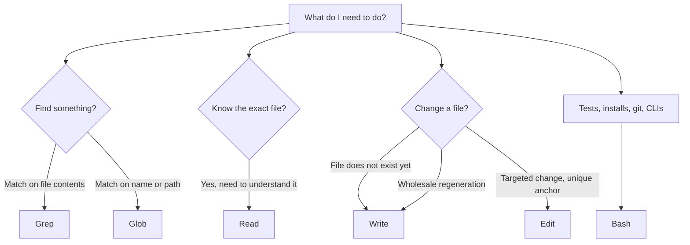
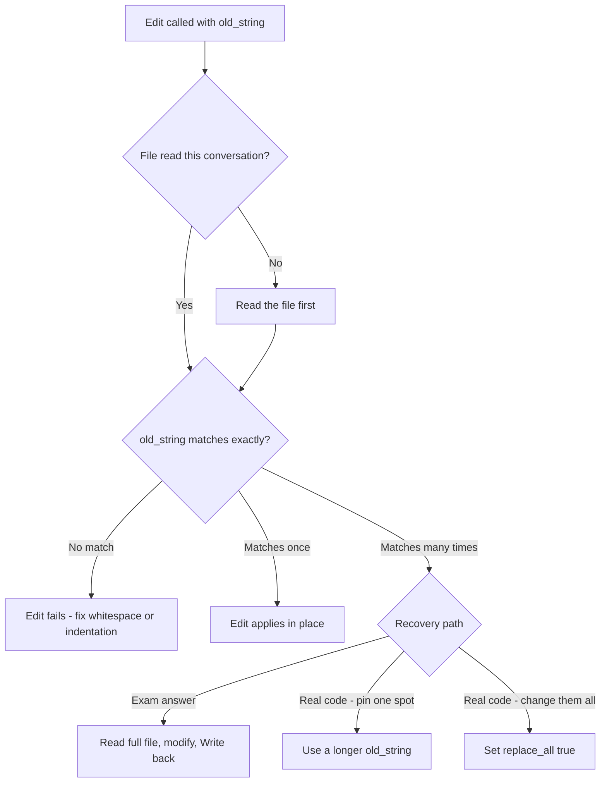
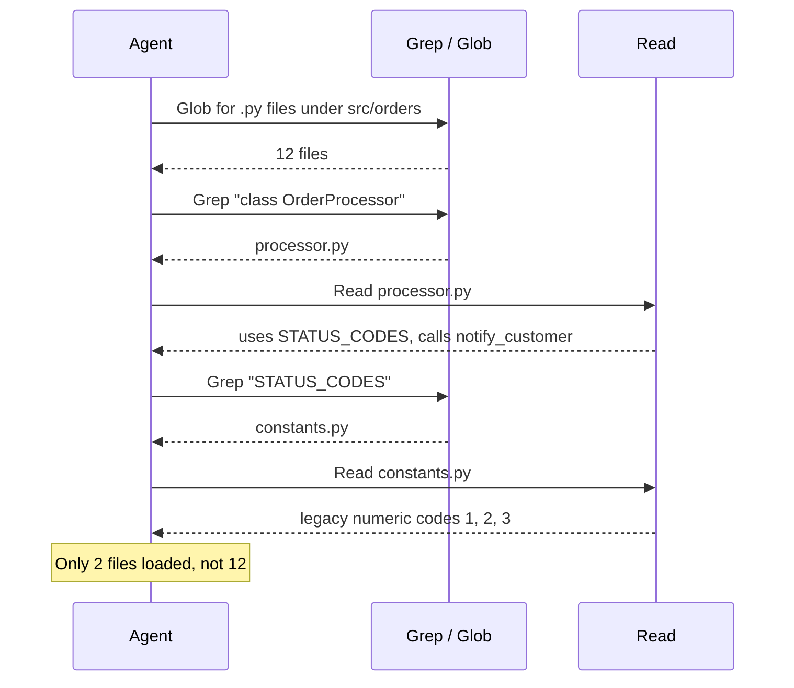

---
tags:
  - CCA-F
  - domain-2
  - built-in-tools
  - codebase-exploration
  - youtube-course
date: 2026-08-04
status: done
domain: "2 of 5"
source: "Peace Of Code — Claude Certified Architect Ep 09"
---

# 🧰 EP09 — Claude Built-in Tools

> [!NOTE] Exam Coverage
> Maps to **Domain 2 — Tool Design & MCP Integration**, task statement **2.5** (built-in tools), and overlaps **Domain 5** task statement **5.4** (codebase exploration) — the incremental-exploration pattern in §3.10 is the same material D5 covers. Six tools are in exam scope: `Grep`, `Glob`, `Read`, `Write`, `Edit`, `Bash`. Covers the content-vs-path split, why the dedicated search tools beat `grep` through `Bash`, the `Edit` uniqueness requirement and its recovery path, the read-then-write fallback, and the bulk-reading anti-pattern.

**Back to:** [[CCA-F Study Roadmap]] · **Domain note:** [[D2 - Tool Design & MCP Integration]] · **Deck:** [[EP09 - Flashcards]]
**Source:** [Peace Of Code — Ep 09 (36 min)](https://www.youtube.com/watch?v=eh-xxQpfBBY) · Level: college / professional-certification · Question mix calibrated MCQ-heavy (40 / 40 / 20)
**Previous:** [[EP08 - MCP Servers, Config & Cline]]

---

## 1. Outline

- [1. Outline](#1-outline)
- [2. Key Terms](#2-key-terms)
- [3. Concept Summaries](#3-concept-summaries)
  - [3.1 Six Tools, Six Lanes](#31-six-tools-six-lanes)
  - [3.2 Grep — The Content Detective](#32-grep--the-content-detective)
  - [3.3 Glob — The Path Hunter](#33-glob--the-path-hunter)
  - [3.4 Grep vs Glob — The Classic Mix-Up](#34-grep-vs-glob--the-classic-mix-up)
  - [3.5 Why Not Just Run grep Through Bash](#35-why-not-just-run-grep-through-bash)
  - [3.6 Read — Targeted Loading, Not Free Loading](#36-read--targeted-loading-not-free-loading)
  - [3.7 Write — Create and Overwrite](#37-write--create-and-overwrite)
  - [3.8 Edit — Surgical Precision and the Uniqueness Rule](#38-edit--surgical-precision-and-the-uniqueness-rule)
  - [3.9 The Read-Then-Write Fallback](#39-the-read-then-write-fallback)
  - [3.10 Incremental Exploration Beats Bulk Reading](#310-incremental-exploration-beats-bulk-reading)
  - [3.11 The Exam Scenario — Discovery, Understanding, Action](#311-the-exam-scenario--discovery-understanding-action)
  - [3.12 Bash — The Escape Hatch](#312-bash--the-escape-hatch)
- [4. Diagrams](#4-diagrams)
- [5. Worked Examples](#5-worked-examples)
- [6. Practice Questions](#6-practice-questions)
- [7. Cheat Sheet](#7-cheat-sheet)

---

## 2. Key Terms

| Term | Definition | Source |
|---|---|---|
| **Built-in tool** | A tool Claude Code ships with — no MCP server, no API key, no config. The host's framing: *"you just need to know where to use which tool."* | [02:24] |
| **`Grep`** | Searches **file contents** by pattern. Ignores filenames entirely. Built on **ripgrep**, so it uses ripgrep regex, not POSIX grep. | [05:53] · *(correction — §3.2)* |
| **`Glob`** | Finds **files by name or path pattern** (`**/*.test.ts`). Never opens a file. | [08:49] |
| **`Read`** | Loads a specific file into context, returned **with line numbers**. Paginates via `offset` / `limit` on large files. | [12:16] · *(correction — §3.6)* |
| **`Write`** | Creates a new file or **completely replaces** an existing one. Atomic — no append, no merge. | [15:26] |
| **`Edit`** | Exact string replacement at one spot in a file — `old_string` → `new_string`. No regex, no fuzzy matching. | [17:30] |
| **`Bash`** | Runs shell commands: tests, installs, CLIs, git. The escape hatch for anything the other five don't cover. | [04:20] |
| **Anchor text** | The `old_string` an `Edit` searches for. Must appear in the file **exactly once**, byte for byte. | [20:15] |
| **Uniqueness requirement** | `Edit` fails when `old_string` matches zero times or more than once — it can't know which occurrence you meant. | [20:48] |
| **Read-then-write fallback** | The recovery when `Edit` can't find a unique anchor: `Read` the whole file → modify in memory → `Write` it back. Always works; costs more tokens. | [21:30] |
| **Read-before-edit** | Claude Code requires the file to have been read in the current conversation before `Edit` or an overwriting `Write` applies. A truncated `PARTIAL view` read does not count. | *(expansion — §3.8)* |
| **`replace_all`** | `Edit` parameter that replaces **every** occurrence instead of failing on a non-unique anchor. The real-code answer to a duplicate anchor. | *(correction — §3.9)* |
| **Longer-anchor pro tip** | Widen `old_string` with surrounding context (`const max = 10`, not `max`) until exactly one occurrence matches. | [23:35] |
| **Incremental exploration** | `Grep` → `Read` → trace → `Grep` again. Each search informs the next read; each read reveals the next thing to search for. | [24:26] |
| **Bulk reading** | The anti-pattern: reading every file in a directory up front. Burns the context window before any reasoning happens. | [32:18] |
| **Output mode** | `Grep` parameter controlling what comes back: `files_with_matches` (default), `content`, or `count`. | *(expansion — §3.2)* |
| **`.gitignore` asymmetry** | `Grep` **skips** gitignored files; `Glob` **does not** — it returns them alongside tracked files by default. | *(expansion — §3.3)* |
| **Discovery → Understanding → Action** | The three-phase scenario shape: `Glob` maps structure, `Grep` + `Read` build understanding, `Write` + `Edit` change things. | [27:29] |
| **Checkpoint** | Claude Code snapshots a file before editing it, so `Write` and `Edit` are reversible with `Esc` `Esc` / `/rewind` — separate from git. | *(expansion — §3.7)* |
| **Read-only tool** | `Read`, `Grep`, and `Glob` don't prompt for permission inside the working directory; `Write`, `Edit`, and `Bash` do. | *(expansion — §3.5)* |

---

## 3. Concept Summaries

### 3.1 Six Tools, Six Lanes

*Question: why does an exam bother testing tool selection at all, when several tools could technically get the job done?*

Because "technically works" and "correct" are different answers, and the exam grades the second one. The host's framing is the whole lesson in one sentence: *"Every tool has a clear lane. Using the wrong tool wastes tokens and produces unreliable results."* His example is deliberately mundane — using `Write` to change three lines in a 500-line file. It succeeds. It also rewrites 497 lines you didn't touch, spends the tokens to do it, and puts every one of those lines at risk of being subtly altered on the way through.

The six tools split cleanly into three pairs:

| Pair | Tools | What they do |
|---|---|---|
| **Finders** | `Grep`, `Glob` | Locate things — by content, or by name |
| **Loader / saver** | `Read`, `Write` | Move whole files in and out of context |
| **Surgeon + escape hatch** | `Edit`, `Bash` | Change one spot; do anything else |

The host makes an aside worth keeping: *"These are not the actual names of the tools, by the way"* — referring to a slide of nicknames ("content detective", "path navigator"). The nicknames are memory aids. The **exam-checkable strings** are the capitalised tool names: `Grep`, `Glob`, `Read`, `Write`, `Edit`, `Bash`. Those exact strings are also what you write in permission rules, subagent `tools` lists, and hook matchers, so they are worth memorising literally.

> [!WARNING] "Claude Code has six built-in tools" — verified against official docs
> The lecture says *"we're going to go deep on the six tools… Read, write, edit, bash, grep, and glob."* Officially, Claude Code's built-in tool set is **much larger** — the tools reference lists roughly forty, including `Agent` (subagents), `Skill`, `WebFetch`, `WebSearch`, `NotebookEdit`, `LSP`, `TaskCreate`, and more. **Exam answer: the six.** They are what task statement 2.5 scopes, and a "which built-in tool would you use to…" question will draw from them. Real code: assume many more, and check the reference before asserting a count.
> Source: https://code.claude.com/docs/en/tools-reference · consistent with [[D2 - Tool Design & MCP Integration]] § 2.5

**In your own words:** Six tools, three jobs — find, load/save, modify. Picking the wrong one still works and still costs you.

*See PQ 1.*

---

### 3.2 Grep — The Content Detective

*Question: what does `Grep` actually look at, and what does it deliberately ignore?*

Contents, and filenames respectively. The host's mental model is the right one: `Grep` is Ctrl+F across the whole codebase. *"Grep opens files and searches inside them. It doesn't care about the file names at all. It cares about what's written in those files."*

His worked case is a customer-support agent that needs to understand refund handling. The agent doesn't know which file holds the logic, so it searches for the pattern `process_refund` and learns the answer is `refunds.py`. Note the direction of the arrow: `Grep` **discovers** the filename as an output. You do not need to know it going in — that is precisely the situation `Grep` exists for.

Three details the lecture skips that the official reference spells out, and all three are the kind of thing a scenario question can hinge on:

1. **It is ripgrep, not POSIX grep.** Regex metacharacters need escaping in ripgrep's dialect — finding `interface{}` in Go takes the pattern `interface\{\}`.
2. **Three output modes.** `files_with_matches` (the default — paths only, cheapest), `content` (matching lines with file and line number), and `count` (matches per file). The default returning *paths only* is the token-efficient behaviour, and it is why `Grep` → `Read` is such a natural pairing: the search hands you the file to open.
3. **It respects `.gitignore`.** Ignored files are skipped unless you pass a path directly. Results can also be scoped with `glob` (`**/*.tsx`) or `type` (`py`, `rust`), and `multiline: true` lets a pattern cross line boundaries.

> [!WARNING] "You know the grep Linux command" — verified against official docs
> The lecture repeatedly equates the tool with shell `grep`: *"grep normal Linux command only, right?"* Officially, the `Grep` tool is **built on ripgrep and uses ripgrep's regex syntax, not POSIX grep**. The conceptual model (search contents by pattern) transfers fine; the regex dialect does not. **Exam answer: `Grep` searches file contents** — that is what 2.5 tests, and the shell analogy is safe for that. Real code: escape metacharacters the ripgrep way, and expect gitignored files to be skipped.
> Source: https://code.claude.com/docs/en/tools-reference#grep-tool-behavior

**In your own words:** `Grep` opens files to search text and hands back where it found it. Filenames are its output, never its input.

*See PQ 2, 6.*

---

### 3.3 Glob — The Path Hunter

*Question: `Glob` finds files too — so what makes it a different tool rather than a variant of `Grep`?*

It never opens anything. The host's filing-cabinet analogy carries the whole distinction and is worth memorising exactly as he tells it:

> *"Grep is the person who opens each drawer, pulls out the folders, and reads through the documents looking for a specific word. Glob is the person who looks at the labels on the folders… It will not open any of them."*

`Glob` matches **naming patterns**: every Python file under `src/orders/`, every `*.test.tsx`, every Terraform file, every Markdown doc. It answers *"what exists and where"*, which is why it belongs at the very start of an exploration — before you know what to search for, you need to know what there is.

> [!TIP] The mangled glob pattern in the audio
> At [09:57] the auto-transcript renders the pattern as *"star star {slash} star.test… you're going to go dot tsx."* He is dictating **`**/*.test.ts`** (or `**/*.test.tsx`). `**` matches directories at any depth, `*` matches within a name segment. Don't second-guess yourself when reviewing the video.

Three official behaviours the lecture doesn't mention, and the third is the one most likely to bite:

1. **Results are sorted by modification time**, not alphabetically — recently-touched files surface first, which is usually what you want when investigating a change.
2. **Results cap at 100 files.** When the cap is hit Claude sees a truncation flag and can narrow the pattern. A `Glob` that returns exactly 100 hits is a signal, not an answer.
3. **`Glob` does *not* respect `.gitignore` by default** — it returns gitignored files alongside tracked ones. This is the exact opposite of `Grep`.

> [!IMPORTANT] The `.gitignore` asymmetry — expansion, not in the lecture
> `Grep` **skips** gitignored files. `Glob` **includes** them. Same codebase, same conceptual question ("which files match?"), opposite default. So `Glob "**/*.js"` can surface `node_modules/` and `dist/` output that a `Grep` over the same tree would never touch. Set `CLAUDE_CODE_GLOB_NO_IGNORE=false` before launching Claude Code to make `Glob` respect `.gitignore` too.
> Source: https://code.claude.com/docs/en/tools-reference#glob-tool-behavior

**In your own words:** `Glob` reads the labels on the folders. It tells you what exists; it can't tell you what's inside.

*See PQ 3, 7.*

---

### 3.4 Grep vs Glob — The Classic Mix-Up

*Question: given a plain-English request, what single test tells you which tool it needs?*

**Ask where the evidence lives.** If the thing you are matching is *written inside a file*, it's `Grep`. If it's part of a *filename or directory path*, it's `Glob`. The host walks six scenarios; here they are with the deciding evidence made explicit:

| Scenario | Tool | Where the evidence lives |
|---|---|---|
| Find every file that imports React | `Grep` | `import React` is a line of code |
| Find all TypeScript files in `/src` | `Glob` | The `.ts` extension is part of the name |
| Find every test file in the project | `Glob` | `.test.` / `.spec.` is a naming convention |
| Find all calls to `process_refund` | `Grep` | A function call is source text |
| List all Terraform files | `Glob` | `.tf` is an extension |
| Find all TODO comments | `Grep` | A comment is file content |

Two of these are traps because the English sounds identical. "Find every **file** that imports React" and "find all TypeScript **files**" both ask for files — but the first *filters on content* and merely reports filenames, while the second filters on the names themselves. The word "file" in the question tells you nothing. The **criterion** does.

> [!WARNING] Anti-pattern — letting the noun decide
> ❌ *"The question says 'find files', so it's `Glob`."* The output being a list of files is true of both tools.
> ✅ Ask what you are matching **on**. Content → `Grep`. Name or path → `Glob`.

**In your own words:** Don't read what's being returned; read what's being matched.

*See PQ 4, 10.*

---

### 3.5 Why Not Just Run grep Through Bash

*Question: `Bash` can run `grep`. Why is there a separate `Grep` tool at all?*

The host flags this as a question he gets constantly and warns it can cost you a mark: *"You can use that, yes, it is possible, but there is a dedicated grep tool for a reason… Why would you use grep via the bash tool?"* He is right about the exam answer — **use the dedicated tool** — but he leaves the *why* as an appeal to obviousness. The official docs supply three concrete reasons, and they turn a memorised rule into an understood one:

1. **Permissions.** `Grep`, `Glob`, and `Read` require **no permission prompt** for paths inside the working directory. `Bash` **does** prompt — it is marked permission-required, and only a built-in set of read-only commands runs without asking. So `Bash("grep -r foo .")` can stall waiting on a human where `Grep` just runs.
2. **Structured output.** `Grep` returns results in defined modes (`files_with_matches` / `content` / `count`) with a `head_limit` and truncation handling. Raw shell output is unbounded text that has to be parsed, and `Bash` output is truncated at 30,000 characters by default.
3. **Consistent semantics.** `Grep` is ripgrep everywhere, with known `.gitignore` behaviour. Shell `grep` differs between GNU and BSD, and behaves differently again depending on the user's aliases — Claude Code sources your shell startup file, so your `alias grep='grep --color'` is in play.

The same reasoning applies to `find` versus `Glob`, and to `cat` versus `Read`.

> [!IMPORTANT] Exam signal
> "Use `Bash` to grep the codebase" is a **wrong answer** in a tool-selection question, even though it works in practice. The dedicated tool exists; reach for it. `Bash` is for what the other five genuinely cannot do — running tests, installing packages, git operations, invoking CLIs.
> Source: https://code.claude.com/docs/en/tools-reference

**In your own words:** The dedicated search tools don't prompt, return structured results, and behave identically everywhere. Shell `grep` gives up all three.

*See PQ 5, 11.*

---

### 3.6 Read — Targeted Loading, Not Free Loading

*Question: if `Grep` already found the code, why read the file at all?*

Because finding is not understanding. `Grep` tells you `process_refund` lives in `refunds.py` at line 42. It does not tell you that the function calls `validate_customer` from the auth module, or that it branches on a status-code dictionary defined elsewhere. The host is precise on the sequencing: *"Grep just told you the refunds.py file at line 42 is relevant. Now you read that file to actually see the code and understand it fully."*

So `Read` is for the case where **you already know which file you want**. That precondition is the whole discipline. Reading a file you merely suspect is relevant is how you end up in §3.10's anti-pattern.

His cost warning is the exam-relevant half, and he says it twice: *"Read is great for targeted file loading, but it is expensive if you do it blindly at scale. If you read 50 files at the start of a task, you have probably burned through most of your tokens… You haven't even started working on it."*

> [!IMPORTANT] "Read loads the full contents of a specific file" — refined against official docs
> Close enough for the exam, imprecise in practice. Officially, `Read` returns the file **with line numbers**, starting from the top. When a whole-file read would exceed the token limit, it returns the **first page plus a `PARTIAL view` notice** telling Claude how to continue with the `offset` and `limit` parameters. So a very large file is *not* silently loaded whole — and a `PARTIAL view` read does **not** satisfy the read-before-edit requirement in §3.8. `Read` also handles images, PDFs (via a `pages` parameter, in ranges of up to 20 pages), and Jupyter notebooks — and it reads **files only**, not directories; listing a directory means `ls` through `Bash`.
> Source: https://code.claude.com/docs/en/tools-reference#read-tool-behavior · [[D2 - Tool Design & MCP Integration]] § 2.5 summarises this as "load full file contents", which is the right one-line gloss for the exam

**In your own words:** `Read` is what you do *after* something told you which file matters. Used before that, it's just spending context.

*See PQ 8, 12.*

---

### 3.7 Write — Create and Overwrite

*Question: when is replacing an entire file the right call rather than a lazy one?*

Two situations, and the host names both. **First: the file doesn't exist yet.** *"You are creating a brand new file that doesn't exist yet. Write is the only option here."* No other tool creates files. **Second: the change is so extensive that patching is theatre.** *"You need to make changes so extensive that editing just feels silly… it is cleaner in this scenario, we just regenerate the whole file."*

There is a third, covered in §3.9: `Write` is the second half of the fallback when `Edit` can't apply.

`Write` takes a path and the complete content, and what you pass is exactly what lands on disk. The host's phrasing — *"It's an atomic operation"* — is the right instinct: there is no append mode and no merge. Anything in the old file that isn't in your new content is gone.

> [!IMPORTANT] Two official constraints the lecture doesn't mention
> **Overwriting requires a prior read.** If the target path already exists, Claude must have read that file at least once in the current conversation before `Write` succeeds; a `Write` to an unread existing file **fails with an error**. Brand-new files are exempt. This is not a footnote — it is why the fallback pattern in §3.9 is literally named *read*-then-write. The read isn't optional politeness; the tool enforces it.
> **Edits are checkpointed.** Claude Code snapshots a file's contents before changing it, so a `Write` or `Edit` can be undone with `Esc` `Esc` or `/rewind`, independently of git. So "old contents are lost" is true of the file on disk but not of the session — recovery exists.
> Source: https://code.claude.com/docs/en/tools-reference#write-tool-behavior · https://code.claude.com/docs/en/how-claude-code-works

**In your own words:** `Write` is create-or-replace, never merge. Use it for new files, wholesale regeneration, and the tail end of the fallback.

*See PQ 9, 13.*

---

### 3.8 Edit — Surgical Precision and the Uniqueness Rule

*Question: `Edit` is find-and-replace. What could possibly go wrong?*

Ambiguity. `Edit` takes a file path, an `old_string`, and a `new_string`, and swaps the first for the second — *"targeted modifications to a specific section of a file… without rewriting the entire thing."* For a 500-line file where three lines change, that is dramatically cheaper and safer than regeneration: 497 lines are never touched, so they can't be accidentally altered.

The catch is the exam material, and the host flags it harder than anything else in the lesson: *"This is exam material, and I'm telling you again and again, this will come in the exam."*

> [!IMPORTANT] The uniqueness requirement
> `old_string` must appear in the file **exactly once**. If the text appears more than once, `Edit` cannot know which occurrence you meant, so it refuses rather than guessing. If it appears zero times — including when a single space or tab differs — it also fails. There is no regex and no fuzzy matching: the match is byte-exact.

His pro tip is the first-line fix, and it is the one the official docs recommend too: **make the anchor longer.** Searching for `max` in a file full of `max` variables is hopeless; searching for `const max = 10` is probably unique. Widen the anchor with surrounding context until exactly one occurrence matches.

Officially, three checks must all pass before an edit applies — the lecture covers only the third:

| Check | What it requires |
|---|---|
| **Read-before-edit** | Claude must have read the file in this conversation. A `PARTIAL view` read doesn't count. Newer models may edit an unread file when reading it wouldn't need a permission prompt. |
| **Match** | `old_string` must appear exactly as written — one character of whitespace or indentation difference is enough to miss. |
| **Uniqueness** | It must appear exactly once, unless `replace_all` is set. |

> [!IMPORTANT] Read-before-edit — expansion, not in the lecture
> Viewing the file with `Bash` also satisfies the requirement, but only for `cat`, `head`, `tail`, `sed -n 'X,Yp'`, `grep`, `egrep`, or `fgrep` on a **single file with no pipes or redirects**. Piped output doesn't count. This matters for the mental model: Claude Code will not let an agent blind-edit a file it has never looked at, which is a large part of why `Grep` → `Read` → `Edit` is the canonical order rather than just good manners.
> Source: https://code.claude.com/docs/en/tools-reference#edit-tool-behavior

The same rule exists on the Claude API side, which is good evidence it's a design principle rather than a Claude Code quirk: the Anthropic-defined text editor tool (`str_replace_based_edit_tool`) requires `str_replace` to match **exactly one location**, and reference implementations return an error on multiple matches. **(expansion)**

**In your own words:** `Edit` refuses to guess. A duplicate anchor isn't a bug — it's the tool declining to pick for you.

*See PQ 14, 15.*

---

### 3.9 The Read-Then-Write Fallback

*Question: the anchor isn't unique and you can't make it unique. Now what?*

You stop patching and regenerate. The host calls this *"the canonical fallback pattern that you need to know"*, and it is three steps:

1. **Read** — load the full file into context.
2. **Reason** — the agent modifies the code in memory, with the whole file visible.
3. **Write** — overwrite the file with the updated content.

The trade is explicit: *"Read plus write is less elegant than edit. You are rewriting the whole file instead of just a fragment. But it always works. There is no unique requirement."* You pay tokens proportional to file size, and you accept that every line passes back through the model, in exchange for a path that cannot fail on ambiguity.

Two things make this more than a memorised sequence. First, the ordering is **enforced**, not stylistic — §3.7 established that `Write` to an existing file requires a prior `Read` in the same conversation. You could not do write-then-read even if you wanted to. Second, having the whole file in context is what makes the "reason" step trustworthy: the model can see all four occurrences of the ambiguous string and decide correctly which to change, which is exactly the judgement `Edit` refused to make.

> [!WARNING] The fallback isn't the only recovery — verified against official docs
> The lecture presents `Read` + `Write` as *the* answer to a non-unique anchor. Officially there are **two** documented remedies: supply a longer `old_string` with enough surrounding context to pin one occurrence (the host's own pro tip), **or set `replace_all: true`** to replace every occurrence at once. `replace_all` is not mentioned anywhere in the lecture, and it is the natural real-code answer to *"rename this variable everywhere in the file."*
> **Exam answer: read the full file, make the change, write it back.** That is the pattern task statement 2.5 tests and the one [[D2 - Tool Design & MCP Integration]] § 2.5 records. Real code: reach for a longer anchor first, `replace_all` when you genuinely want all occurrences, and read-then-write when the change is too structural for either.
> Source: https://code.claude.com/docs/en/tools-reference#edit-tool-behavior

**In your own words:** When `Edit` can't disambiguate, load the whole file, change it in memory, and write it back. Slower, bigger, never ambiguous.

*See PQ 15, 16.*

---

### 3.10 Incremental Exploration Beats Bulk Reading

*Question: an agent is told "understand the billing system." What does the naive one do, and why is it wrong?*

It reads everything. *"It might just read every file in `/src/billing`, all at once. Twenty files, thirty files. The entire context window is gone before any real reasoning happens."* The failure is not that reading is bad — it's the **ordering**. Context spent before you know what's relevant is context spent on files that mostly aren't.

The disciplined alternative is a loop, not a phase:

1. **`Grep`** for an entry point — a function name, an import, an error string.
2. **`Read`** the specific file that search surfaced.
3. **Trace** what that file references — a call, an import, a constant.
4. **`Grep`** for that next thing, and repeat.

The host's formulation of why it compounds is the line to remember: *"Each grep call informs the next read. Each read reveals the next thing to grep for."* Understanding grows outward from one confirmed anchor point, and every file that enters context earned its place by being referenced by something you already verified matters.

> [!WARNING] Anti-pattern — bulk reading
> ❌ Read all files in the module up front, then start reasoning. Context fills with irrelevant files; agent quality degrades as it fills; nothing has been accomplished yet.
> ✅ `Grep` → `Read` → trace → `Grep`. Load only what a previous step pointed at.
> The host's exam heuristic: *"If an exam answer says 'read all files first', it is almost certainly wrong."* Treat that phrasing as a distractor marker.

> [!TIP] Transcription artifact at [34:56]
> The closing tip is captioned *"incremental exploration always beats bulk reasoning."* He means **bulk reading** — the term he uses correctly everywhere else, including in the section heading. Nothing in the lesson is about "bulk reasoning."

**In your own words:** Don't front-load the context window. Let each search decide what the next read is allowed to be.

*See PQ 17, 18.*

---

### 3.11 The Exam Scenario — Discovery, Understanding, Action

*Question: the exam presents a "developer productivity tool" scenario. What shape is the expected answer?*

Three phases, and the host is explicit that this is one of the two scenarios this material is tested in:

| Phase | Tools | What it produces |
|---|---|---|
| **1 — Discovery** | `Glob` | The folder and file layout. *"Use glob to map out the entire folder structure."* |
| **2 — Understanding** | `Grep` → `Read` → trace | Where the logic lives and how it connects |
| **3 — Action** | `Write` (new) · `Edit` (existing) | New boilerplate created; specific defects patched |

His walkthrough, condensed: `Glob` finds the Python files in the orders module → `Grep` locates `class OrderProcessor` → `Read` opens `processor.py`, which reveals a status-code dictionary and a call to `notify_customer` → trace the status codes to `constants.py` → `Read` that, which exposes legacy numeric codes `1, 2, 3` → **`Write`** a brand-new `order_status.py` endpoint → **`Edit`** `constants.py` to fix the legacy issue in place.

Notice how cleanly the tool choice falls out of the *nature* of each change, not its size. The new endpoint uses `Write` because **the file doesn't exist** — that's §3.7's first situation, and file creation has exactly one tool. The constants fix uses `Edit` because it's a targeted change to an existing file with a unique anchor. Neither choice required judgement about token counts; each followed from a property of the target.

The host also frames this as interview material, and the framing is fair: *"how does Claude Code work?"* is answered well by walking this loop. The phases are not rigid — a bug found mid-action sends you back to discovery for that bug.

**In your own words:** Map the structure, pinpoint and read what matters, then create with `Write` and patch with `Edit`. Which of the two you use follows from whether the file already exists.

*See PQ 19.*

---

### 3.12 Bash — The Escape Hatch

*Question: the lecture spends thirty seconds on `Bash`. Is there anything exam-relevant there?*

The host's coverage is honest but thin: *"Bash is for shell commands. I didn't explain bash in detail because bash is just like you are running commands in the terminal."* For the exam that's nearly sufficient — `Bash` is the answer when the task is running tests, installing packages, invoking a CLI, or doing git work, and it is the **wrong** answer for searching, reading, and editing (§3.5).

The official behaviours are worth a skim, because two of them shape how agents are designed around it: **(expansion)**

| Behaviour | Detail |
|---|---|
| **Process isolation** | Each command runs in a separate process. Environment variables **do not persist** — an `export` in one call is gone by the next. |
| **Working directory** | A `cd` *does* carry over to later commands, as long as it stays inside the project or an added directory. |
| **Timeout** | Two minutes by default, up to ten via the `timeout` parameter. On timeout the command is **moved to the background**, not killed. |
| **Output limit** | 30,000 characters by default; longer output is saved to a file and Claude gets the path plus a preview. |
| **Background execution** | `run_in_background: true` for dev servers and watch builds, so the agent keeps working. |

The env-var behaviour is the one that catches people: an agent that runs `export API_KEY=…` and then a command that needs it will fail, and the failure looks like a credentials problem rather than a tool-semantics problem.

> [!TIP] Transcription artifact at [33:48]
> The quick-reference card is captioned *"Bash is for cell commands."* Read: **shell commands**. Related homophone throughout the episode: every *"right tool"* and *"the right fallback"* is **`Write`** — see the artifact list in §7.

**In your own words:** `Bash` runs what the other five can't. Each call is a fresh process, so nothing but the working directory survives between them.

*See PQ 20.*

---

## 4. Diagrams

*Tool selection: the question you are answering determines the lane, not the size of the change.*

*The three `Edit` checks and every documented recovery. Only the `Read` + `Write` branch is the exam-safe answer.*

*Incremental exploration: each search picks the next read, so context holds only what was proven relevant.*

---

## 5. Worked Examples

### Example 1 — Choosing between Grep and Glob under time pressure

**Task:** For each request, name the tool and state the deciding evidence.
*(a)* "Find every file that imports `React`." *(b)* "Find all TypeScript files in `/src`." *(c)* "Find all TODO comments."

1. **Locate the matching criterion in each request.** *(why: the output is "files" in all three, so the noun tells you nothing — only the criterion discriminates.)*
   - (a) criterion = the text `import React`
   - (b) criterion = the `.ts` / `.tsx` extension
   - (c) criterion = the text `TODO`
2. **Ask where that criterion physically lives.** *(why: this is the single test from §3.4 — inside the file, or in its name?)*
   - (a) inside the file → contents
   - (b) in the filename → path
   - (c) inside the file → contents
3. **Map contents → `Grep`, path → `Glob`.** *(why: the tools are defined by what they open, and `Glob` never opens anything.)*

**Answer:** (a) `Grep` · (b) `Glob` · (c) `Grep`. Two of three are `Grep` despite all three saying "find files" — the word "file" is noise.

---

### Example 2 — Recovering from a failed Edit

**Task:** An agent must change one timeout constant in `config.py`. It calls `Edit` with `old_string = "timeout = 30"`. The file contains that exact line four times — in `DatabaseConfig`, `CacheConfig`, `HttpConfig`, and `QueueConfig`. Only the `HttpConfig` one should change. Walk the recovery.

1. **Recognise the failure class.** *(why: the anchor matched four times, so this is a uniqueness failure, not a typo or whitespace failure — the fix differs.)* `Edit` refuses because it cannot know which of the four you meant.
2. **Try the cheapest fix first — widen the anchor.** *(why: the host's pro tip, and the official first recommendation; it keeps the surgical edit and costs almost nothing.)* If `HttpConfig`'s block reads `class HttpConfig:\n    timeout = 30`, then that two-line string is unique and `Edit` applies.
3. **If no unique anchor exists, fall back to read-then-write.** *(why: this is the canonical exam pattern, and it removes the uniqueness constraint entirely.)*
   - `Read config.py` — the whole file enters context, all four occurrences visible.
   - Modify in memory — with the full file visible, the agent can tell which block is `HttpConfig`.
   - `Write config.py` — overwrite with the corrected content.
4. **Do not reach for `replace_all` here.** *(why: it would change all four timeouts; the requirement was one. `replace_all` fits "rename this variable everywhere", not "change this one instance".)*

**Answer:** Widen `old_string` to include the enclosing `class HttpConfig:` line. If that still isn't unique, `Read` → modify in memory → `Write` the whole file back. `replace_all` is wrong for this requirement because only one of the four occurrences should change.

---

### Example 3 — Costing bulk reading against incremental exploration

**Task:** A billing module holds $30$ files averaging $400$ lines each, roughly $13$ tokens per line. The agent must trace one function through $3$ files. Compare the context cost of bulk reading against incremental exploration, assuming each `Grep` call costs about $200$ tokens.

1. **Cost one file.** *(why: establishes the unit both strategies are measured in.)*
   $$\text{tokens per file} = 400 \times 13 = 5{,}200$$
2. **Cost the bulk-read strategy — every file, up front.** *(why: this is the naive agent from §3.10.)*
   $$C_{\text{bulk}} = 30 \times 5{,}200 = 156{,}000 \text{ tokens}$$
3. **Cost the incremental strategy — 3 reads, each preceded by a search.** *(why: the loop is `Grep` → `Read`, three times through.)*
   $$C_{\text{incr}} = 3 \times (200 + 5{,}200) = 16{,}200 \text{ tokens}$$
4. **Express the saving as a ratio.** *(why: a ratio generalises past these specific numbers — the advantage scales with how many files are irrelevant.)*
   $$\frac{C_{\text{bulk}}}{C_{\text{incr}}} = \frac{156{,}000}{16{,}200} \approx 9.6$$

**Answer:** Bulk reading costs $156{,}000$ tokens; incremental exploration costs $16{,}200$ — roughly **$9.6\times$ cheaper**, and the search overhead is only $600$ tokens of that. The key insight is that $27$ of the $30$ files were never relevant, and the bulk strategy pays full price for all of them **before** discovering that.

---

## 6. Practice Questions

**1.** Which set correctly names the six built-in tools that task statement 2.5 covers? *(§3.1 / Built-in tool)*

Answer

`Grep`, `Glob`, `Read`, `Write`, `Edit`, `Bash`.

Note that Claude Code's actual built-in tool set is much larger (`Agent`, `Skill`, `WebFetch`, `WebSearch`, `LSP`, and more) — but these six are the file/search/execution core that 2.5 scopes.

**2.** What does `Grep` match against, and what does it ignore? *(§3.2 / `Grep`)*

Answer

It matches against **file contents** and ignores filenames entirely. Filenames are its *output* — the thing it tells you — never its input.

**3.** What does `Glob` match against, and what does it never do? *(§3.3 / `Glob`)*

Answer

It matches **file names and paths** by pattern. It never opens a file, so it can say nothing about what is inside one.

**4.** "Find every file that imports React." Which tool, and why is the word "file" in the question misleading? *(§3.4)*

Answer

`Grep`. The request returns a list of files, but the **criterion** is `import React` — a line of source code. Both tools return files; only the matching criterion tells you which tool applies.

**5.** Why is "use `Bash` to run `grep`" the wrong answer in a tool-selection question? *(§3.5)*

Answer

A dedicated `Grep` tool exists and should be used. Concretely: `Grep` needs no permission prompt inside the working directory while `Bash` does, it returns structured output in defined modes rather than unbounded text, and its ripgrep semantics are identical everywhere — shell `grep` varies by platform and by the user's aliases.

**6.** `Grep`'s default output mode returns only file paths rather than matching lines. Why is that the right default for an exploration workflow? *(§3.2 / Output mode)*

Answer

Because the next step is almost always a `Read` of one specific file. Returning paths is the cheapest possible result that still identifies the read target, so the search costs almost nothing and the tokens go to the file that actually matters. Returning full matching lines for every hit would spend context on files you're about to discard.

**7.** A `Glob` for `**/*.js` in a Node project returns hundreds of files from `node_modules/`, but a `Grep` over the same tree never touches them. What explains the difference? *(§3.3 / `.gitignore` asymmetry)*

Answer

`Grep` respects `.gitignore` and skips ignored files; `Glob` does **not** by default and returns them alongside tracked files. Same tree, opposite default. Set `CLAUDE_CODE_GLOB_NO_IGNORE=false` to make `Glob` respect it too.

**8.** State the precondition for using `Read` correctly. *(§3.6)*

Answer

You must already know which file you want — typically because a `Grep` or `Glob` just told you. Reading a file you only suspect is relevant is the bulk-reading anti-pattern in miniature.

**9.** Name the two situations in which `Write` is the correct choice over `Edit`. *(§3.7)*

Answer

1. The file does not exist yet — `Write` is the only tool that creates files.
2. The changes are so extensive that regenerating the file is cleaner than patching it.

(A third, from §3.9: `Write` is the second half of the read-then-write fallback.)

**10.** "Find every test file in the project" — `Grep` or `Glob`, and what is the deciding evidence? *(§3.4)*

Answer

`Glob`. Test files are identified by a **naming convention** (`.test.ts`, `.spec.js`, a `tests/` directory) — a path property, not file content. Contrast with "find every file containing a skipped test", which would be `Grep`.

**11.** An agent is configured with a permission rule denying `Bash`, but `Grep`, `Glob`, and `Read` are allowed. What can it still do, and what breaks? *(§3.5 / Read-only tool)*

Answer

It can still fully explore the codebase — search contents, find files by pattern, and read them — because those three are read-only tools that don't require permission inside the working directory. What breaks is everything `Bash` uniquely covers: running tests, installing packages, git operations, invoking CLIs. Exploration is unaffected; verification and execution are gone.

**12.** A `Read` of a very large file returns a `PARTIAL view` notice. What has happened, and what is the consequence for a subsequent `Edit`? *(§3.6 / §3.8)*

Answer

The whole-file read would have exceeded the token limit, so `Read` returned the first page plus instructions to continue with `offset` and `limit`. The consequence: a `PARTIAL view` read does **not** satisfy the read-before-edit requirement, so an `Edit` on that file will still require a proper read first.

**13.** Why is the fallback pattern ordered `Read` → modify → `Write`, and not some other sequence? *(§3.7 / §3.9)*

Answer

Two reasons, one enforced and one practical. **Enforced:** overwriting an existing file requires that Claude has read it in the current conversation — a `Write` to an unread existing file fails outright, so the read is mandatory. **Practical:** having the whole file in context is what lets the agent correctly pick among the ambiguous occurrences that defeated `Edit` in the first place.

**14.** `Edit` is called with `old_string = "return None"`, which appears seven times in the file. What happens, and why is that behaviour correct rather than a limitation? *(§3.8 / Uniqueness requirement)*

Answer

The edit fails. It's correct behaviour because the tool has no way to infer which of the seven you meant, and silently picking one — the first, say — would corrupt the file in a way that's hard to notice. Refusing surfaces the ambiguity to whoever can actually resolve it.

**15.** An `Edit` fails on a non-unique anchor. Give the exam-safe recovery, then name the two additional remedies the official docs describe. *(§3.9 / `replace_all`)*

Answer

**Exam answer:** `Read` the full file → modify it in memory → `Write` the whole updated file back.

**Also documented:** supply a longer `old_string` with enough surrounding context to pin exactly one occurrence (the host's pro tip), or set `replace_all: true` to replace every occurrence at once. `replace_all` is not mentioned in the lecture — use it in real code when you genuinely want all occurrences changed.

**16.** What is the trade-off of the read-then-write fallback versus a successful `Edit`? *(§3.9)*

Answer

You spend tokens proportional to the whole file rather than the fragment, and every line passes back through the model. In exchange you get a path that cannot fail on ambiguity, since there is no uniqueness requirement to satisfy.

**17.** An agent is told "explore this codebase and understand the billing system," and immediately reads all 25 files in `/src/billing`. Diagnose the failure. *(§3.10 / Bulk reading)*

Answer

Bulk reading. The context window is consumed before any reasoning happens, most of the loaded files turn out to be irrelevant, and agent quality degrades as context fills. The fix is incremental exploration: `Grep` for an entry point, `Read` only that file, trace what it references, `Grep` again.

**18.** Why does incremental exploration compound in effectiveness, rather than just being cheaper per step? *(§3.10)*

Answer

Because each step produces the input for the next: every `Grep` names the file worth reading, and every `Read` reveals the next symbol worth searching for. Understanding grows outward from one confirmed anchor, so each file that enters context was referenced by something already verified as relevant. Bulk reading has no such filter — relevance is only discovered after the tokens are spent.

**19.** A scenario question describes building a code-generator agent: it must map an unfamiliar module, understand how orders are processed, scaffold a new endpoint, and fix a legacy constant. Assign tools to each phase and justify the `Write` versus `Edit` split. *(§3.11)*

Answer

**Discovery:** `Glob` to map the folder structure. **Understanding:** `Grep` to locate the entry point, `Read` to load it, then trace references and repeat. **Action:** `Write` for the new endpoint, `Edit` for the constant.

The split follows from a property of the target, not the size of the change: the endpoint file **does not exist**, and `Write` is the only tool that creates files. The constant is a targeted change to an existing file with a unique anchor, which is exactly `Edit`'s lane.

**20.** An agent runs `export API_TOKEN=abc123` via `Bash`, then a second `Bash` command that reads `$API_TOKEN` — and it comes back empty. Why? *(§3.12)*

Answer

Each `Bash` call runs in a **separate process**, and environment variables do not persist between them. (A `cd` does carry over, as long as it stays inside the project directory — which makes the inconsistency easy to trip over.) The failure looks like a credentials problem but is really tool semantics.

---

## 7. Cheat Sheet

| Cue | Note |
|---|---|
| Six tools | `Grep` · `Glob` · `Read` · `Write` · `Edit` · `Bash` — the 2.5 scope |
| Grep | Contents. Ripgrep regex. Respects `.gitignore`. Default output = paths only |
| Glob | Names and paths. Never opens files. Sorted by mtime, capped at 100. **Ignores** `.gitignore` |
| Grep vs Glob | Ask what you match **on**, not what comes back |
| Read | Known file only. Line-numbered. Paginates; `PARTIAL view` on oversize |
| Write | Create or fully replace. No append. Overwrite needs a prior `Read` |
| Edit | Unique anchor, byte-exact, file must have been read |
| Edit fails | Exam: `Read` → modify → `Write`. Real: longer anchor, or `replace_all` |
| Bash | Tests, installs, git, CLIs. Fresh process each call; env vars don't persist |
| Exploration | `Grep` → `Read` → trace → `Grep`. Never read everything first |
| Scenario shape | Discovery (`Glob`) → Understanding (`Grep`+`Read`) → Action (`Write`/`Edit`) |

**Top 5 terms:** anchor text · uniqueness requirement · read-then-write fallback · incremental exploration · bulk reading

> [!WARNING] Exam traps
> ❌ "Read all files first" in an answer option → almost certainly the distractor.
> ❌ Running `grep` or `find` through `Bash` when `Grep` / `Glob` exist.
> ❌ Choosing by change *size*. `Write` vs `Edit` is decided by whether the file exists and whether an anchor is unique.
> ❌ Assuming "find files" means `Glob` — `Grep` returns files too.
> ✅ `Edit` needs a **unique** anchor; on failure, `Read` the whole file and `Write` it back.

> [!TIP] Transcription artifacts in this episode
> **"right" = `Write`** throughout — *"instead of edit you use right"*, *"the right fallback"*, *"you would use the right tool"*. Most frequent artifact in the episode.
> **"cell commands" = shell commands** [33:48] · **"bulk reasoning" = bulk reading** [34:56] · **"star star slash star.test… dot tsx" = `**/*.test.tsx`** [09:57] · **"def process refund" = `process_refund`** · **"bolke"** [04:20] is a Hindi filler word, not a term.
> The video **description** says *"In Episode 08 of the Claude Certified Architect Full Course"* — this is **Ep 09**. An off-by-one in the description text only; the title and content are Ep 09.

> **Synthesis:** Every one of the six tools answers a different question — *what exists* (`Glob`), *where is this text* (`Grep`), *what does this file say* (`Read`), *make this file be this* (`Write`), *change this one spot* (`Edit`), *do the thing none of the above covers* (`Bash`). Tool selection is never about how big the change is; it is about which question you are actually asking. The same discipline scaled up is the incremental-exploration loop: ask a narrow question, let the answer choose the next question, and let context hold only what a previous step proved relevant.

---

## ✅ Practice Checklist

- [ ] Can name all six tools and the question each one answers
- [ ] Can classify any "find X" request as `Grep` or `Glob` by locating the matching criterion
- [ ] Can explain why the dedicated search tools beat `grep` through `Bash` — permissions, structured output, consistent semantics
- [ ] Know that `Grep` respects `.gitignore` and `Glob` does not
- [ ] Can state the `Edit` uniqueness requirement and both failure modes (zero matches, many matches)
- [ ] Know all three `Edit` checks: read-before-edit, exact match, uniqueness
- [ ] Can give the read-then-write fallback as the exam answer, and name `replace_all` and the longer-anchor fix as the real-code alternatives
- [ ] Know that overwriting an existing file with `Write` requires a prior `Read` in the same conversation
- [ ] Can explain why bulk reading degrades agent quality, and spot "read all files first" as a distractor
- [ ] Can walk the Discovery → Understanding → Action scenario and justify each tool choice
- [ ] Know that `Bash` env vars don't persist between calls but the working directory does

---

*Next: [[EP10 - CLAUDE.md Hierarchy & Config Rules]]*
