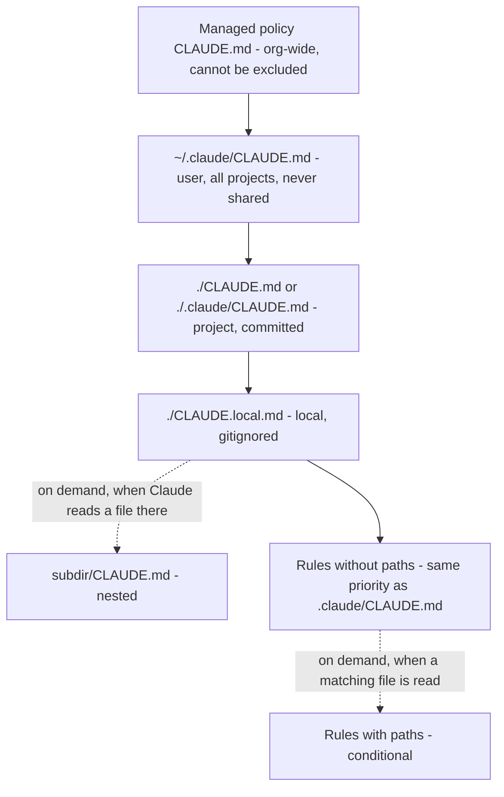
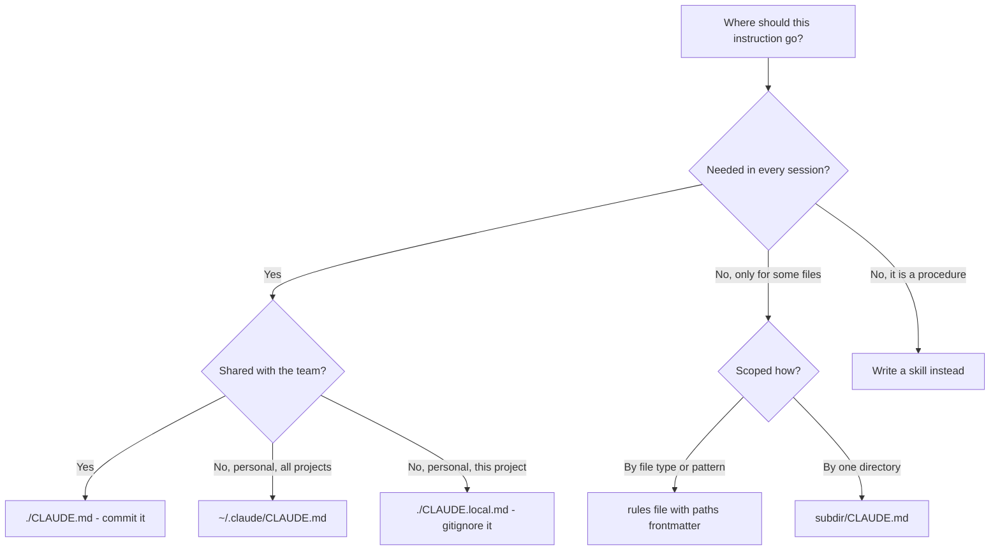
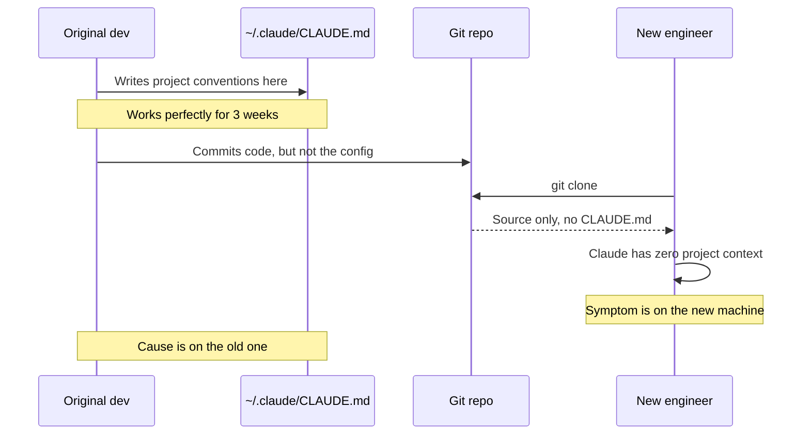

---
tags:
  - CCA-F
  - domain-3
  - claude-md
  - configuration
  - youtube-course
date: 2026-08-04
status: done
domain: "3 of 5"
source: "Peace Of Code — Claude Certified Architect Ep 10"
---

# 📜 EP10 — CLAUDE.md Hierarchy & Config Rules

> [!NOTE] Exam Coverage
> Maps to **Domain 3 — Claude Code Configuration & Workflows**, task statements **3.1** (`CLAUDE.md` hierarchy and scoping) and **3.3** (path-specific rules for conditional convention loading). Covers the missing-instructions problem, every `CLAUDE.md` location and its load order, the two valid project locations, on-demand subdirectory loading, `@import` for modularity, `.claude/rules/` with `paths` frontmatter, glob pattern targeting, and how to verify what actually loaded.

**Back to:** [[CCA-F Study Roadmap]] · **Domain note:** [[D3 - Claude Code Configuration & Workflows]] · **Deck:** [[EP10 - Flashcards]]
**Source:** [Peace Of Code — Ep 10 (32 min)](https://www.youtube.com/watch?v=qIee1aqSAwY) · Level: college / professional-certification · Question mix calibrated MCQ-heavy (40 / 40 / 20)
**Previous:** [[EP09 - Claude Built-in Tools]]

---

## 1. Outline

- [1. Outline](#1-outline)
- [2. Key Terms](#2-key-terms)
- [3. Concept Summaries](#3-concept-summaries)
  - [3.1 The Missing Instructions Problem](#31-the-missing-instructions-problem)
  - [3.2 CLAUDE.md Is Persistent Context](#32-claudemd-is-persistent-context)
  - [3.3 The Hierarchy — Three Levels, or Four?](#33-the-hierarchy--three-levels-or-four)
  - [3.4 Project Level — Two Valid Locations](#34-project-level--two-valid-locations)
  - [3.5 Directory Level — Loaded On Demand](#35-directory-level--loaded-on-demand)
  - [3.6 The Classic Team Bug](#36-the-classic-team-bug)
  - [3.7 @import — Modularity, Not Context Savings](#37-import--modularity-not-context-savings)
  - [3.8 The .claude/rules Directory](#38-the-clauderules-directory)
  - [3.9 Path-Scoped Rules and Glob Patterns](#39-path-scoped-rules-and-glob-patterns)
  - [3.10 Choosing Between CLAUDE.md, Rules, and Skills](#310-choosing-between-claudemd-rules-and-skills)
  - [3.11 Verifying What Actually Loaded](#311-verifying-what-actually-loaded)
- [4. Diagrams](#4-diagrams)
- [5. Worked Examples](#5-worked-examples)
- [6. Practice Questions](#6-practice-questions)
- [7. Cheat Sheet](#7-cheat-sheet)

---

## 2. Key Terms

| Term | Definition | Source |
|---|---|---|
| **`CLAUDE.md`** | **Persistent context** — a Markdown file Claude reads at the start of every session, before your first message. The host's two-word definition. | [03:01] |
| **Missing instructions problem** | A teammate clones the repo and Claude behaves as though it has never seen the project, because the conventions were never committed. | [00:02] |
| **User scope** | `~/.claude/CLAUDE.md` — your personal preferences, applied to **all** your projects, **never** shared. | [06:08] |
| **Project scope** | `./CLAUDE.md` **or** `./.claude/CLAUDE.md` — team-shared via version control. Both locations are valid. | [09:26] |
| **Directory scope** | A `CLAUDE.md` inside a subdirectory. Loads **on demand** when Claude reads files in that subtree. | [12:43] |
| **Managed policy scope** | Org-wide `CLAUDE.md` deployed by IT at a fixed OS path. Cannot be excluded by individual settings. | *(correction — §3.3)* |
| **`CLAUDE.local.md`** | Project-root file for **your** private preferences; gitignored. Appended after `CLAUDE.md` at that level. | *(correction — §3.3)* |
| **Concatenation** | Discovered `CLAUDE.md` files are **combined**, not overridden — ordered filesystem root → working directory, so specific instructions are read last. | *(expansion — §3.3)* |
| **`@import`** | `@path/to/file` inside a `CLAUDE.md`, which expands that file into context **at launch**. Max chain depth **four hops**. | [16:49] · *(expansion — §3.7)* |
| **`.claude/rules/`** | Directory of topic-specific rule files, discovered recursively. Without `paths`, they load at launch at the same priority as `.claude/CLAUDE.md`. | [19:14] |
| **`paths` frontmatter** | The YAML field that makes a rule **conditional** — it loads only when Claude reads a file matching one of its glob patterns. | [21:37] |
| **Path-scoped rule** | A `.claude/rules/` file with `paths` — the mechanism for conditional, file-type-targeted conventions. | [22:38] |
| **Glob pattern** | The path-matching syntax in `paths`. `**` = any number of directories; `*` = any name within one level. | [24:04] |
| **Brace expansion** | `src/**/*.{ts,tsx}` — one pattern matching multiple extensions. Budget-capped at 1,000 expanded patterns. | *(expansion — §3.9)* |
| **User-level rules** | `~/.claude/rules/` — personal rules for every project, loaded **before** project rules, so project rules win. | *(expansion — §3.8)* |
| **`/memory`** | Lists memory-file **locations** across user and project scope and opens one in your editor. **Not** a check of what loaded. | [27:30] · *(correction — §3.11)* |
| **`/context`** | The command that shows what **actually loaded** this session, under a **Memory files** heading. | *(correction — §3.11)* |
| **`claudeMdExcludes`** | Setting that skips specific `CLAUDE.md` files by glob — the monorepo escape hatch. Cannot exclude managed policy. | *(expansion — §3.3)* |
| **200-line target** | Official size guidance per `CLAUDE.md` file; longer files consume more context and reduce adherence. | *(expansion — §3.7)* |

---

## 3. Concept Summaries

### 3.1 The Missing Instructions Problem

*Question: Claude has learned your project's conventions over three weeks. A teammate clones the repo and gets none of it. What actually went wrong?*

Nothing was learned in the first place — it was **written down somewhere private**. The host opens with the scenario deliberately, because it's the exam's framing too: you have Claude "dialed in", it knows your TypeScript conventions and that you always want JSDoc comments. A new engineer joins, clones the same repo, starts their own session, and *"Claude is acting like it has never heard of your project."*

Their instinct is the expensive one: ask Claude to read the whole project and infer the conventions. The host's list of consequences is accurate and worth internalising — *"Claude will run out of context, too many tokens will get utilized, lot of cost to the company."* That's the same bulk-reading failure [[EP09 - Claude Built-in Tools]] covered in its § 3.10, arriving from a different direction: instead of an agent reading too much by choice, a *human* forces it to because the cheap source of truth doesn't exist.

The diagnosis matters more than the symptom. Claude never "learned" anything across sessions — every session starts with a fresh context window. What worked for three weeks was a file the original developer had put somewhere that only their machine could see. The behaviour was never portable, and nobody noticed because the person who wrote it was the only one testing it.

**In your own words:** Sessions don't accumulate knowledge; files do. If the file isn't in the repo, the knowledge isn't in the team.

*See PQ 1.*

---

### 3.2 CLAUDE.md Is Persistent Context

*Question: what is `CLAUDE.md`, in the smallest number of words that stays true?*

*"Persistent context."* The host gives exactly that, and it's the right compression: *"It's like the stuff that Claude reads before your conversation even starts."* Concretely, at session start — around the point Claude asks whether you trust the folder — the file is read and injected, so you never have to re-explain the tech stack, the conventions, or the build commands.

His briefing-document analogy is the one to keep: it's what you'd hand a new consultant so they don't need a knowledge transfer session. And the payoff is per-session, not one-time — start a new session tomorrow and the file loads again, so the tokens you would have spent re-explaining are never spent at all.

One precision the lecture doesn't make, and it changes how you should write the file: **`CLAUDE.md` is context, not configuration.** Officially it is delivered as a user message after the system prompt, so Claude reads it and tries to follow it, but *there is no guarantee of strict compliance* — especially for vague or conflicting instructions. That's why the docs push specificity: "Use 2-space indentation" outperforms "format code properly."

> [!IMPORTANT] When an instruction *must* hold, `CLAUDE.md` is the wrong tool — expansion
> If something has to happen at a fixed point — before every commit, after each file edit — write it as a **hook**, which executes as a shell command at a lifecycle event regardless of what Claude decides. To block an action outright, use `permissions.deny` or a `PreToolUse` hook. `CLAUDE.md` shapes behaviour; settings and hooks enforce it. This is the same enforcement-vs-guidance split [[EP05 - PreToolUse, PostToolUse Hooks & Task Decomposition]] covers.
> Source: https://code.claude.com/docs/en/memory · consistent with [[D1 - Agentic Architecture & Orchestration]]

**In your own words:** A briefing document re-read at every session start. Persuasive, not binding.

*See PQ 2, 3.*

---

### 3.3 The Hierarchy — Three Levels, or Four?

*Question: how many places can a `CLAUDE.md` live, and why does the number matter?*

The host teaches **three**: user, project, directory. Each has *"different scope, different visibility, and different purpose"*, and he's right that getting them wrong is exactly how you land in § 3.1's bug. His user-level walkthrough is correct and useful — `~/.claude/CLAUDE.md`, applied to all your projects, and he draws the parallel to MCP config from [[EP08 - MCP Servers, Config & Cline]]: same split, `.mcp.json` in the project versus `~/.claude.json` at home, and for the same reason.

His warning about user scope is the sharpest line in the lesson: *"If anybody else clones your repo, it will not automatically come into their home directory. It's pretty much common sense."* Common sense that costs teams weeks anyway.

But the count is incomplete, and the vault note already had this right.

> [!WARNING] "There are three levels" — verified against official docs
> The lecture teaches **three** (user, project, directory). Officially there are **four documented scopes**, listed in load order from broadest to most specific:
>
> | Scope | Location | Shared with |
> |---|---|---|
> | **Managed policy** | macOS `/Library/Application Support/ClaudeCode/CLAUDE.md` · Linux/WSL `/etc/claude-code/CLAUDE.md` · Windows `C:\Program Files\ClaudeCode\CLAUDE.md` | Everyone on the machine — **cannot** be excluded by individual settings |
> | **User** | `~/.claude/CLAUDE.md` | Just you, all projects |
> | **Project** | `./CLAUDE.md` or `./.claude/CLAUDE.md` | The team, via source control |
> | **Local** | `./CLAUDE.local.md` | Just you, this project — gitignored |
>
> Subdirectory files are then loaded **on demand** (§3.5) rather than being a fifth scope. **Exam answer: name the three the lecture teaches if a question asks for "the hierarchy", but recognise managed policy and `CLAUDE.local.md` as real, and expect the enterprise scope in any question about org-wide standards or compliance.** Real code: all four.
> Source: https://code.claude.com/docs/en/memory · already recorded correctly in [[D3 - Claude Code Configuration & Workflows]] § 3.1 — **the vault note wins over the video here**

Two mechanics the lecture leaves out, both of which decide questions:

1. **Files concatenate; they do not override.** Claude walks *up* the directory tree from your working directory, collects every `CLAUDE.md` and `CLAUDE.local.md`, and combines them — ordered filesystem root → working directory, so the most specific content is read **last**. There is no "the nearest file wins" rule to memorise, because nothing is discarded. Within a directory, `CLAUDE.local.md` is appended after `CLAUDE.md`.
2. **Conflicts are resolved arbitrarily.** If two files contradict each other, Claude *"may pick one arbitrarily"*. That makes periodic review a real maintenance task, and in a monorepo it's what `claudeMdExcludes` exists for — a glob list of `CLAUDE.md` files to skip, configurable at any settings layer. Managed policy files can never be excluded.

**In your own words:** Four scopes, broad to specific, all concatenated. The video's three are the middle of the list, not the whole of it.

*See PQ 4, 5, 12.*

---

### 3.4 Project Level — Two Valid Locations

*Question: `./CLAUDE.md` or `./.claude/CLAUDE.md` — which one is correct?*

Both. The host is careful here and correct: *"There are actually two valid locations for project level config… I mean both the paths work."* His tie-breaker is a reasonable team convention rather than a technical rule — the project root is **more discoverable** (a newcomer sees it immediately on clone), while `.claude/` **keeps things organized** alongside commands, skills, and settings.

What makes project scope the important one is not the path, it's the consequence: the file is **committed**. *"You commit it, you push it, your teammates pull it, and your CI pipeline loads it."* That last clause is easy to skim past and worth holding — the same file that configures your local session configures Claude in automation, which is why project scope is where standards belong and personal preferences don't.

His example file contents are a good model of what earns its place, and they double as a review of earlier episodes: pin the model (*"all examples use Claude Haiku 4.5… don't bump that to Sonnet or Opus without asking"*), name the error-category schema — the four categories from [[EP07 - Agent Error Handling & tool_choice]] — and record the loop-exit rule that `stop_reason == "end_turn"` is the primary exit with max-iterations as a safety valve, from [[EP01 - Agentic Loops & stop_reason]].

That is exactly the right *kind* of content: decisions a reader could not derive from the code. The official guidance is the same test — write down what you'd otherwise re-explain, and add to the file when Claude makes the same mistake twice or a review catches something it should have known.

> [!TIP] `/init` writes the first draft
> Running `/init` generates a starting `CLAUDE.md` by analysing the codebase for build commands, test instructions, and conventions. If one already exists, `/init` **suggests improvements rather than overwriting**. It also reads existing Cursor rules (`.cursor/rules/`, `.cursorrules`) and Copilot instructions (`.github/copilot-instructions.md`) and folds the relevant parts in. **(expansion)**

**In your own words:** Either path works; committing is the point. Project scope reaches teammates *and* CI.

*See PQ 6, 13.*

---

### 3.5 Directory Level — Loaded On Demand

*Question: why put a `CLAUDE.md` in a subdirectory when the project already has one?*

Because different parts of a codebase need genuinely different guidance, and paying for all of it all the time is waste. The host calls this *"the most surgical"* level and his examples land: `infrastructure/` needs Terraform guidance, an API package needs NestJS patterns, the frontend needs React conventions. Cramming all three into one root file gives every session all three.

His load claim is right, and it's the mechanically interesting part: *"It only loads when Claude Code is working in that directory itself."* Officially — subdirectory `CLAUDE.md` and `CLAUDE.local.md` files are **not** loaded at launch; they are included **when Claude reads files in those subdirectories**. Everything at or above your working directory loads in full up front; everything below loads lazily.

He also closes the section with a line worth quoting because it prevents a wrong mental model: *"the way `CLAUDE.md` works doesn't change. You're just specializing it more."* Directory level is not a different feature — it's the same file discovered later.

> [!IMPORTANT] Nested files do not survive compaction — expansion
> Project-root `CLAUDE.md` is **re-read from disk and re-injected** after `/compact`. Nested subdirectory files are **not** re-injected automatically — they reload only the next time Claude reads a file in that subdirectory. So an instruction that "disappeared" mid-session was either given only in conversation or lives in a nested file that hasn't reloaded yet.
> Source: https://code.claude.com/docs/en/memory · https://code.claude.com/docs/en/context-window

**In your own words:** Above your working directory loads eagerly; below it loads lazily, when a file there is read.

*See PQ 7, 14.*

---

### 3.6 The Classic Team Bug

*Question: the opening scenario, diagnosed. What was the actual root cause and the actual fix?*

The host flags this as exam material explicitly — *"this will come in the exam"* — and the causal chain is short:

1. The original developer wrote a genuinely good `CLAUDE.md` — architecture notes, conventions, all of it.
2. They put it in their **home directory** (`~/.claude/CLAUDE.md`).
3. It worked perfectly, for them, for three weeks.
4. It was **never committed**, because it was never in the repo to commit.
5. The new engineer cloned the repo and there simply was no `CLAUDE.md` in it.

The fix: move it to project scope — `./CLAUDE.md` or `./.claude/CLAUDE.md` — and commit. *"Every teammate gets the same context on pull."*

His exam heuristic is the transferable part: *"If you get questions like 'teammate not following conventions', check the config location first."* Note what makes this a good trap — every symptom points at the *new* machine (fresh clone, missing setup, different environment), while the cause is on the *original* machine. Nothing is broken on the newcomer's side; something was never shared from the other side.

> [!WARNING] Anti-pattern — project knowledge in user scope
> ❌ `~/.claude/CLAUDE.md` holding project architecture and team conventions. Invisible to everyone else and to CI, by design.
> ✅ `~/.claude/CLAUDE.md` for things that are genuinely about **you** — your commit-message style, your personal tooling shortcuts. Project standards go in `./CLAUDE.md` and get committed.
> The diagnostic question is not "what's missing on the new machine?" but "where did the working config live?"

**In your own words:** Right file, wrong scope. The symptom appears on the new clone; the cause sits in the original developer's home directory.

*See PQ 8, 15.*

---

### 3.7 @import — Modularity, Not Context Savings

*Question: your `CLAUDE.md` is heading toward a thousand lines. What does `@import` actually fix?*

Ownership and merge conflicts. The host's problem statement is real: as a project grows, `CLAUDE.md` accumulates architecture docs, testing conventions, API patterns, deployment rules, glossaries, until it becomes *"a 5,000 line monster."* `@import` lets you split it into focused files — `api-patterns.md`, `testing-conventions.md` — and compose them from the root file.

His argument for *why* is the strongest part and is genuinely about team dynamics rather than tokens: the backend team edits only `api-patterns.md`, the test owners edit only `testing-conventions.md`, *"so there are no merge conflicts"* and the root file stops being a contention point. **Clean PRs, clean ownership.** His analogy to importing services and utils in Angular is apt — same modularity instinct, applied to configuration.

The critical thing the lecture never states, and it is the difference between two exam answers:

> [!IMPORTANT] `@import` does **not** reduce context — verified against official docs
> Imported files are *"expanded and loaded into context at launch alongside the `CLAUDE.md` that references them."* Splitting a 5,000-line file into ten 500-line imports gives you the same token cost, organised better. The official guidance is explicit: *"Splitting into `@path` imports helps organization but doesn't reduce context, since imported files load at launch."*
> To actually **reduce** what loads, you need **path-scoped rules** (§3.9), which load only when Claude touches matching files. The host gets this right where it counts — his sample exam question at [29:08] correctly rejects *"@import for conditional loading"* as the wrong answer — but the mechanism is never spelled out, and the distinction is precisely what a question will test.
> Source: https://code.claude.com/docs/en/memory · consistent with [[D3 - Claude Code Configuration & Workflows]] § 3.1

Four mechanics worth knowing: paths may be **relative or absolute**, and relative resolves against **the file containing the import**, not the working directory; chains may nest to a **maximum of four hops**; import parsing **skips code spans and fenced blocks**, so `` `@README` `` in backticks stays literal text while `@README` imports; and an import resolving **outside** your working directory triggers a one-time **approval dialog** the first time — a deliberate guard against files other people commit to a shared repo. Imports in user-scope files skip the dialog, since you wrote them.

**In your own words:** `@import` buys you clean ownership and clean PRs, at identical token cost. Conditional loading is a different mechanism.

*See PQ 9.*

---

### 3.8 The .claude/rules Directory

*Question: you can already scope a `CLAUDE.md` to a directory. What does `.claude/rules/` add?*

Targeting by **pattern** instead of by location. The host asks the right question himself — *"What is the difference between `CLAUDE.md` and these rules files? I can create `CLAUDE.md` files specific to a directory as well"* — and answers it correctly: *"There is something known as front matter, and that is where the magic lies."*

Mechanically, `.claude/rules/` holds one Markdown file per topic — `code-style.md`, `testing.md`, `security.md` — discovered **recursively**, so you can nest them under `frontend/` and `backend/`. A rule **without** `paths` frontmatter loads at launch with the same priority as `.claude/CLAUDE.md`; a rule **with** `paths` becomes conditional (§3.9).

His framing of the distinction is the exam-relevant one: `CLAUDE.md` *"cannot be applied to specific file types or a specific pattern."* It is scoped by **where it sits in the tree**. A rule is scoped by **what the file looks like**, which is why it can target `**/*.test.tsx` files scattered across twenty packages — something no single subdirectory `CLAUDE.md` can reach.

> [!WARNING] "The description field is always present in the front matter" — verified against official docs
> The host names this as an exam signal at [23:35]. The official documentation for `.claude/rules/` documents **one** frontmatter field: **`paths`**. Every example in the docs shows `paths` alone, and the text says rules are scoped *"using YAML frontmatter with the `paths` field"* — `description` is never mentioned as a rules field, let alone a required one.
> This looks like a conflation with **skill** frontmatter, where `description` genuinely *is* required and is what Claude matches against to decide whether to load the skill. **Exam answer: `paths` is the field that matters for rules — it's what makes them conditional.** Treat "rules require a `description`" as unsupported; if a question offers it, prefer an option about `paths`.
> Source: https://code.claude.com/docs/en/memory · [[D3 - Claude Code Configuration & Workflows]] § 3.3 also shows `paths` alone — **the vault note agrees with the docs, not the video**

Two expansions the lecture omits: **`~/.claude/rules/`** gives you personal rules across every project, loaded **before** project rules so project rules take priority; and the directory **supports symlinks**, so a company-standards repo can be linked into many projects (`ln -s ~/company-standards/security.md .claude/rules/security.md`), with circular symlinks detected and handled. **(expansion)**

**In your own words:** `CLAUDE.md` is scoped by where it lives. A rule is scoped by what the file matches — and `paths` is the field that does it.

*See PQ 10, 16.*

---

### 3.9 Path-Scoped Rules and Glob Patterns

*Question: how do you express "these conventions apply to test files, wherever they are"?*

A `paths` list of glob patterns. The host calls globs the *"file targeting superpower"* and connects them to something everyone already knows: *"if you've used `.gitignore`… where we specify which file patterns, which folders to exclude."* Same syntax family, opposite purpose — include rather than exclude.

His two building blocks are correct, though the captions mangle them (see §7): **`**` matches any number of directories, at any depth**, and **`*` matches any name within a single level**. Everything else composes from those two.

| Pattern | Matches |
|---|---|
| `**/*.ts` | Every TypeScript file, any directory |
| `src/**/*` | Every file under `src/`, at any depth |
| `*.md` | Markdown files in the **project root only** |
| `src/components/*.tsx` | React components **directly** in that one directory |
| `terraform/**/*` | Every file under `terraform/`, any depth |
| `src/**/*.{ts,tsx}` | Both extensions, one pattern — brace expansion |

The row that catches people is `src/api/*.ts`, which the host reads correctly as *"any TS file directly in `src/api` only"* — a single `*` does **not** descend. Swap it for `src/api/**/*.ts` and it does.

The trigger semantics are the other exam-relevant precision, and the lecture doesn't state them: a path-scoped rule fires when Claude **reads** a matching file — not on every tool use, and not at launch. So the rule's content stays out of context entirely until it's relevant, which is exactly the property `@import` lacks.

> [!TIP] Brace expansion has a budget — expansion
> Each brace group multiplies the pattern count: `src/*.{ts,tsx}` expands to two, `{a,b}/{c,d}/*.{ts,tsx}` to eight. A rule's whole `paths` list shares a budget of **1,000 expanded patterns and 4 MiB**; any pattern that would exceed it is used **unexpanded**, whereupon its literal braces match nothing. Also: `[` starts a bracket expression, so a path like `photos [2024/**` is invalid and matches nothing — escape it as `photos \[2024/**`.
> Source: https://code.claude.com/docs/en/memory#path-specific-rules

**In your own words:** `**` crosses directories, `*` doesn't. The rule enters context only when Claude reads a file it matches.

*See PQ 11, 17, 18.*

---

### 3.10 Choosing Between CLAUDE.md, Rules, and Skills

*Question: three mechanisms can hold instructions. What decides which one?*

**How often the content needs to be in context.** The host covers two of the three and gives the right heuristic for the pair: *"whenever something comes as conditional application, then in that case you would use rules."* The official guidance completes the ladder, and it's a clean three-way split:

| Mechanism | Loads | Use for |
|---|---|---|
| **`CLAUDE.md`** | Every session, in full | Facts needed every time — build commands, conventions, layout, "always do X" |
| **`.claude/rules/` + `paths`** | When Claude reads a matching file | Conventions that only matter for part of the codebase or one file type |
| **Skill** | Only when invoked, or when Claude judges it relevant | Multi-step procedures and workflows |

The official phrasing of the boundary is the useful test: *"If an entry is a multi-step procedure or only matters for one part of the codebase, move it to a skill or a path-scoped rule instead."* Two different escape hatches for two different reasons — **procedure** goes to a skill, **partial applicability** goes to a rule.

This is also the honest answer to "my `CLAUDE.md` is too large." The official remedies are ranked: use path-scoped rules to move content out of every-session context, or trim what isn't needed every session. `@import` is explicitly *not* on that list (§3.7). Skills are covered next in [[EP11 - Custom Slash Commands & Skills]].

**In your own words:** Always-needed → `CLAUDE.md`. Sometimes-needed, by file type → a path-scoped rule. A procedure → a skill.

*See PQ 19.*

---

### 3.11 Verifying What Actually Loaded

*Question: Claude is ignoring your conventions. What do you run to find out whether it ever saw them?*

This is where the lecture — and, it turns out, this vault — had it wrong, so the distinction is worth getting exactly right.

The host's instinct is correct: before debugging behaviour, confirm the file loaded. *"If Claude doesn't list down a particular file that you want Claude to load, then that is your problem that you need to fix."* Perfect diagnostic order. He then names `/memory` as the command for it, and lists it among his three exam-winning facts: *"/memory means a diagnostic command for config debugging."*

> [!WARNING] "`/memory` shows what's loaded" — verified against official docs
> Officially the two commands do different jobs:
> - **`/memory`** *lists memory-file **locations*** across user and project scope — **including entries for files that don't exist yet** — lets you toggle auto memory, and opens a selected file in your editor (creating it if absent). It is a **browse-and-edit** command.
> - **`/context`** is what verifies what **actually loaded** into the current session: run it and check the list under **Memory files**. The docs say this twice, including in the troubleshooting steps — *"If a file is missing there, Claude can't see it."*
>
> The distinction matters precisely in the failure case the host describes: `/memory` will happily list a path whose file was never loaded — or never existed — so it cannot tell you loading failed. **Exam answer: `/context` to verify what loaded; `/memory` to browse and edit memory files.** Real code: same.
> Source: https://code.claude.com/docs/en/memory#view-and-edit-with-memory
>
> **This also corrected two places in this vault** — [[D3 - Claude Code Configuration & Workflows]] § 3.1 and the `/memory` card in the vault-wide [[Flashcards]] both described `/memory` as verifying loaded files. Both have been fixed against this source (checked 2026-08-04).

Two further diagnostics the lecture doesn't mention: the **`InstructionsLoaded` hook** logs exactly which instruction files load, when, and why — the precise tool for debugging path-scoped rules and lazily-loaded nested files. And **`/doctor`** proposes trims for a checked-in `CLAUDE.md`, cutting content Claude can derive from the codebase (directory layouts, dependency lists) while keeping pitfalls, rationale, and conventions that differ from tool defaults. **(expansion)**

**In your own words:** `/context` answers "did it load?". `/memory` answers "where does it live and let me edit it." Only the first is a load check.

*See PQ 20.*

---

## 4. Diagrams


*Load order, broadest to most specific. Solid arrows load at launch; dotted arrows load on demand.*


*The routing decision. Note that "too long" is never an answer here — `@import` reorganises without reducing context.*


*The classic team bug: right file, wrong scope. Nothing broke on the newcomer's side.*

---

## 5. Worked Examples

### Example 1 — Diagnosing "my teammate's Claude ignores our conventions"

**Task:** A teammate reports Claude doesn't follow the project's TypeScript conventions. On your machine it works. Produce a diagnosis in order.

1. **Ask where the working config lives, before touching the broken machine.** *(why: the symptom appears on the new clone but §3.6 shows the cause is almost always on the machine where it works.)* Check whether the file is `~/.claude/CLAUDE.md` (user scope, never shared) or `./CLAUDE.md` (project scope, committed).
2. **Confirm it's tracked, not merely present.** *(why: a file at the project root that's gitignored or never added behaves exactly like user scope from a teammate's perspective.)* `git ls-files CLAUDE.md .claude/CLAUDE.md` — no output means it was never committed.
3. **Have the teammate run `/context` and read the Memory files list.** *(why: this is the only command that reports what actually loaded — `/memory` would list the path even if nothing loaded, per §3.11.)*
4. **If the file loaded but is still ignored, look for a conflict.** *(why: contradictory instructions across files are resolved arbitrarily, so both people can see the same file and get different behaviour.)* Check ancestor `CLAUDE.md` files and `.claude/rules/`.
5. **Move to project scope and commit.** *(why: this is the actual fix — it reaches teammates on pull and CI on the next run.)*

**Answer:** The config was written to user scope and never committed, so the repo contains no `CLAUDE.md`. Move it to `./CLAUDE.md` (or `./.claude/CLAUDE.md`), commit, and have the teammate confirm with `/context` — **not** `/memory`, which lists locations regardless of whether anything loaded.

---

### Example 2 — The exam's own sample question

**Task:** You need different rules for TypeScript files under `src/` and for Terraform files under `terraform/`. Which mechanism, and write it.

1. **Classify the requirement: conditional, by file pattern.** *(why: this rules out `CLAUDE.md` at any level — it is scoped by tree position, never by file type.)*
2. **Reject `@import`.** *(why: imports expand at launch, so both rule sets would be in context for every session — §3.7. The host's own answer key rejects this option too.)*
3. **Reject directory-level `CLAUDE.md`.** *(why: it would work here only because these two happen to be separate directories; it breaks the moment a pattern spans directories, like `**/*.test.tsx`.)*
4. **Use `.claude/rules/` with `paths` frontmatter — one file per concern.** *(why: purpose-built for glob-based conditional loading, and each rule enters context only when Claude reads a matching file.)*

```markdown
---
paths:
  - "src/**/*.ts"
---
# TypeScript Rules
- Never use `any`; prefer `unknown` with type narrowing
- Annotate all parameter and return types explicitly
```

```markdown
---
paths:
  - "terraform/**/*"
---
# Terraform Rules
- Pin every provider version
- No hardcoded region strings
```

**Answer:** `.claude/rules/` plus YAML `paths` frontmatter — two files, `typescript.md` and `terraform.md`. The distractors fail for distinct reasons: `@import` can't be conditional at all, and directory-level `CLAUDE.md` can't target by pattern.

---

### Example 3 — Costing a monolith against path-scoped rules

**Task:** A `CLAUDE.md` is $1{,}200$ lines: $200$ lines of universal conventions, $500$ of frontend rules, $500$ of Terraform rules. Assume $12$ tokens per line. Compare per-session context cost for a backend session that touches neither frontend nor Terraform files.

1. **Cost the monolith.** *(why: every line loads at launch regardless of relevance — the whole file enters context.)*
   $$C_{\text{mono}} = 1{,}200 \times 12 = 14{,}400 \text{ tokens}$$
2. **Confirm `@import` changes nothing.** *(why: §3.7 — imported files expand into context at launch, so splitting into three files preserves the total.)*
   $$C_{\text{import}} = (200 + 500 + 500) \times 12 = 14{,}400 \text{ tokens}$$
3. **Cost path-scoped rules — only the universal part loads.** *(why: rules with `paths` enter context only when Claude reads a matching file, and this session reads none.)*
   $$C_{\text{rules}} = 200 \times 12 = 2{,}400 \text{ tokens}$$
4. **Express the reduction.** *(why: a ratio generalises beyond these numbers — the saving scales with how much of the file is conditional.)*
   $$1 - \frac{2{,}400}{14{,}400} = \frac{5}{6} \approx 83\%$$

**Answer:** The monolith and the `@import` version both cost $14{,}400$ tokens; path-scoped rules cost $2{,}400$ — an **83% reduction** for this session. The point isn't the arithmetic but which mechanism moved the number: reorganising with `@import` saved nothing, and only `paths` made the loading conditional.

---

## 6. Practice Questions

**1.** A teammate clones the repo and Claude has no knowledge of the project's conventions, which have worked for the original developer for weeks. What is the root cause? *(§3.1 / Missing instructions problem)*

<details><summary>Answer</summary>

The conventions live in a `CLAUDE.md` that was never committed to the repo — almost always because it was written at user scope (`~/.claude/CLAUDE.md`) instead of project scope. Nothing was "learned" across sessions; a private file was doing the work.
</details>

**2.** Define `CLAUDE.md` in two words, and say when it is read. *(§3.2 / `CLAUDE.md`)*

<details><summary>Answer</summary>

**Persistent context.** It is read at the start of every session, before your first message — so a new session tomorrow gets the same context without re-explaining anything.
</details>

**3.** An instruction must run before every commit, without exception. Why is `CLAUDE.md` the wrong place for it? *(§3.2)*

<details><summary>Answer</summary>

`CLAUDE.md` is context, not enforced configuration — it's delivered as a user message after the system prompt, so Claude reads it and tries to comply but there's no guarantee. For something that must happen at a fixed lifecycle point, write a **hook**; to block an action outright, use `permissions.deny` or a `PreToolUse` hook.
</details>

**4.** Name the four documented `CLAUDE.md` scopes in load order, broadest first. *(§3.3 / Managed policy scope)*

<details><summary>Answer</summary>

**Managed policy** (org-wide, at a fixed OS path, cannot be excluded) → **User** (`~/.claude/CLAUDE.md`) → **Project** (`./CLAUDE.md` or `./.claude/CLAUDE.md`) → **Local** (`./CLAUDE.local.md`, gitignored).

The lecture teaches three (user, project, directory); subdirectory files are on-demand loading rather than a separate scope.
</details>

**5.** Two `CLAUDE.md` files are discovered — one in a parent directory, one in your working directory. Does the nearer one override the other? *(§3.3 / Concatenation)*

<details><summary>Answer</summary>

No. All discovered files are **concatenated**, ordered filesystem root → working directory, so nothing is discarded. The nearer file is simply read **last**, which is why more specific instructions tend to win in practice. Within a directory, `CLAUDE.local.md` is appended after `CLAUDE.md`.
</details>

**6.** Give both valid project-level locations, and the practical trade-off between them. *(§3.4 / Project scope)*

<details><summary>Answer</summary>

`./CLAUDE.md` and `./.claude/CLAUDE.md` — both work. The project root is more **discoverable** (visible immediately on clone); `.claude/` is more **organized** (sits with commands, skills, and settings). It's a team convention, not a technical difference.
</details>

**7.** When is a subdirectory `CLAUDE.md` loaded? *(§3.5 / Directory scope)*

<details><summary>Answer</summary>

**On demand** — when Claude reads a file in that subdirectory. Files at or above the working directory load in full at launch; files below it load lazily.
</details>

**8.** An exam question says "a teammate isn't following the project's conventions." What should you check first, and why is the obvious place to look wrong? *(§3.6)*

<details><summary>Answer</summary>

Check the **config location** — specifically on the machine where things *work*. The symptoms all appear on the new clone, which pulls attention to the newcomer's setup, but the cause is that the working config was never in a shared location to begin with.
</details>

**9.** Your `CLAUDE.md` is 4,000 lines. Does splitting it into `@import`ed files reduce the tokens loaded per session? *(§3.7 / `@import`)*

<details><summary>Answer</summary>

**No.** Imported files are expanded and loaded into context at launch, so the token cost is unchanged. `@import` buys modularity — clean ownership, clean PRs, fewer merge conflicts. To actually reduce what loads, use path-scoped rules.
</details>

**10.** What single capability do `.claude/rules/` files have that no `CLAUDE.md` has, at any level? *(§3.8)*

<details><summary>Answer</summary>

Scoping by **file pattern** rather than by tree position. A rule with `paths` can target `**/*.test.tsx` files scattered across twenty packages; a `CLAUDE.md` is bound to wherever it sits in the directory tree.
</details>

**11.** What do `**` and `*` each match in a `paths` glob? *(§3.9 / Glob pattern)*

<details><summary>Answer</summary>

`**` matches **any number of directories**, at any depth. `*` matches **any name within a single level** and does not descend.
</details>

**12.** Your organization needs a coding standard that applies to every repository on every developer's machine and cannot be switched off locally. Which scope, and what makes it non-optional? *(§3.3 / `claudeMdExcludes`)*

<details><summary>Answer</summary>

**Managed policy** scope — `/Library/Application Support/ClaudeCode/CLAUDE.md` on macOS, `/etc/claude-code/CLAUDE.md` on Linux/WSL, `C:\Program Files\ClaudeCode\CLAUDE.md` on Windows, deployed via MDM or Group Policy. It's non-optional because `claudeMdExcludes` can skip any other `CLAUDE.md` but explicitly cannot exclude a managed policy file.
</details>

**13.** Why does it matter that project-scope `CLAUDE.md` is committed, beyond teammates getting it? *(§3.4)*

<details><summary>Answer</summary>

**CI loads it too.** The same file that configures your interactive session configures Claude in automation, so project scope is the only place standards can apply consistently across humans and pipelines.
</details>

**14.** After running `/compact`, an instruction from a subdirectory `CLAUDE.md` seems to have been forgotten, while the root one still applies. Explain. *(§3.5)*

<details><summary>Answer</summary>

Project-root `CLAUDE.md` is re-read from disk and re-injected after compaction. Nested subdirectory files are **not** re-injected automatically — they reload only the next time Claude reads a file in that subdirectory.
</details>

**15.** A developer keeps their project's architecture notes in `~/.claude/CLAUDE.md` and says it works fine. Under what circumstances does that claim hold, and when does it break? *(§3.6)*

<details><summary>Answer</summary>

It holds as long as they are the only person and the only machine working on the project — user scope applies to all of *their* projects. It breaks the moment anyone else clones the repo, or CI runs, or they work from a second machine: none of those see their home directory.
</details>

**16.** A rule file's frontmatter contains only a `description` field and no `paths`. What happens? *(§3.8)*

<details><summary>Answer</summary>

It loads **unconditionally at launch**, with the same priority as `.claude/CLAUDE.md` — because `paths` is what makes a rule conditional, and it's absent. `description` is not a documented rules field (it's required for *skills*, which is the likely source of that confusion), so it has no scoping effect.
</details>

**17.** Distinguish what `src/api/*.ts` matches from `src/api/**/*.ts`. *(§3.9)*

<details><summary>Answer</summary>

`src/api/*.ts` matches `.ts` files **directly** in `src/api/` only — a single `*` does not descend. `src/api/**/*.ts` matches `.ts` files at **any depth** beneath `src/api/`.
</details>

**18.** When exactly does a path-scoped rule enter the context window? *(§3.9 / Path-scoped rule)*

<details><summary>Answer</summary>

When Claude **reads a file matching one of its `paths` patterns** — not at launch, and not on every tool use. Until then its content costs nothing, which is the property that makes rules a real context-reduction mechanism.
</details>

**19.** You have a five-step release procedure currently bloating `CLAUDE.md`. Where should it go, and why not a path-scoped rule? *(§3.10)*

<details><summary>Answer</summary>

A **skill**. The official split turns on *why* the content isn't universal: content that only matters for **part of the codebase** becomes a path-scoped rule; content that is a **multi-step procedure** becomes a skill, loading only when invoked or when Claude judges it relevant. A release procedure isn't tied to a file pattern, so no `paths` glob would describe it.
</details>

**20.** Claude appears to be ignoring your `CLAUDE.md`. Which command tells you whether it loaded, and why is the other one insufficient? *(§3.11 / `/context`)*

<details><summary>Answer</summary>

**`/context`** — check the list under **Memory files**; if a file is missing there, Claude cannot see it. **`/memory`** is a browse-and-edit command that lists memory-file *locations* across user and project scope, **including files that don't exist yet**, so it will show you a path whether or not anything loaded — which makes it useless for exactly this diagnosis.
</details>

---

## 7. Cheat Sheet

| Cue | Note |
|---|---|
| What it is | Persistent context, re-read every session. Guidance, **not** enforcement |
| Managed policy | Fixed OS path, org-wide, **cannot** be excluded |
| User | `~/.claude/CLAUDE.md` — all your projects, **never** shared |
| Project | `./CLAUDE.md` **or** `./.claude/CLAUDE.md` — committed; team **and** CI |
| Local | `./CLAUDE.local.md` — yours, this project, gitignored |
| Directory | Subdir file, loaded **on demand** when a file there is read |
| Load order | Concatenated root → cwd. Nothing overrides; specific is read last |
| `@import` | Modularity only. Expands at launch — **no** token saving. Max 4 hops |
| `.claude/rules/` | One topic per file, recursive. No `paths` → loads at launch |
| `paths` frontmatter | The field that makes a rule **conditional**. Fires when a match is **read** |
| Globs | `**` crosses directories · `*` stays in one level |
| Verify | **`/context`** = what loaded · `/memory` = browse & edit locations |
| Too long? | Path-scoped rules or trim. Never `@import` |

**Top 5 terms:** persistent context · project scope · `paths` frontmatter · path-scoped rule · `/context`

> [!WARNING] Exam traps
> ❌ Project conventions in `~/.claude/CLAUDE.md` — invisible to teammates and CI. **The** trap of this episode.
> ❌ "`@import` for conditional loading" — imports always expand at launch. Conditional means `paths`.
> ❌ "`/memory` shows what loaded" — it lists locations, including nonexistent files. Use `/context`.
> ❌ Directory-level `CLAUDE.md` for a cross-cutting file type — it can't target `**/*.test.tsx` across packages.
> ❌ Assuming the nearest `CLAUDE.md` overrides the others — they concatenate.
> ✅ "Teammate not following conventions" → check the config **location**, on the machine where it works.

> [!TIP] Transcription artifacts in this episode
> **"cloud" / "cloud md" = `CLAUDE.md`** — pervasive from about [09:51] on, and the captions also split the filename as *"Claude."* + *"md"* throughout. By far the dominant artifact.
> **"Directly level config" = Directory level** (the ToC heading itself) · **"formatter" = frontmatter** [23:35], self-corrected live at [20:44] · **"TypeScript script script mode" = strict mode** [21:05] · **"Terraform/star star /star" = `terraform/**/*`** · **"test. tsx" = `.test.tsx`**.

> **Synthesis:** Every mechanism here answers one of two questions — *who needs to see this instruction, and how often does it need to be in context?* Scope answers the first: user scope is private by design, which is the whole of the classic team bug, and only committed project scope reaches teammates and CI. Loading answers the second, and it's where the look-alike mechanisms diverge — `@import` reorganises a file without changing what loads, while `paths` frontmatter genuinely defers content until a matching file is read. Get those two axes right and the rest is glob syntax. Then verify with `/context`, because a config you believe loaded and one that actually loaded are different things.
---

## ✅ Practice Checklist

- [ ] Can name all four documented `CLAUDE.md` scopes, their paths, and who sees each
- [ ] Know both valid project-level locations and that neither is technically preferred
- [ ] Can explain that discovered files **concatenate** root → cwd rather than override
- [ ] Know that subdirectory files load **on demand**, and don't survive `/compact` re-injection
- [ ] Can diagnose the classic team bug and state the fix in one sentence
- [ ] Can explain why `@import` does **not** reduce context, and what does
- [ ] Know the `@import` max depth (4 hops) and that backticked paths aren't imported
- [ ] Know that `paths` — not `description` — is the field that makes a rule conditional
- [ ] Can read `**` vs `*` correctly, including why `src/api/*.ts` doesn't descend
- [ ] Know a path-scoped rule fires when Claude **reads** a matching file
- [ ] Can route an instruction to `CLAUDE.md` vs a rule vs a skill and justify it
- [ ] Know `/context` verifies what loaded and `/memory` does not

---

*Next: [[EP11 - Custom Slash Commands & Skills]]*
