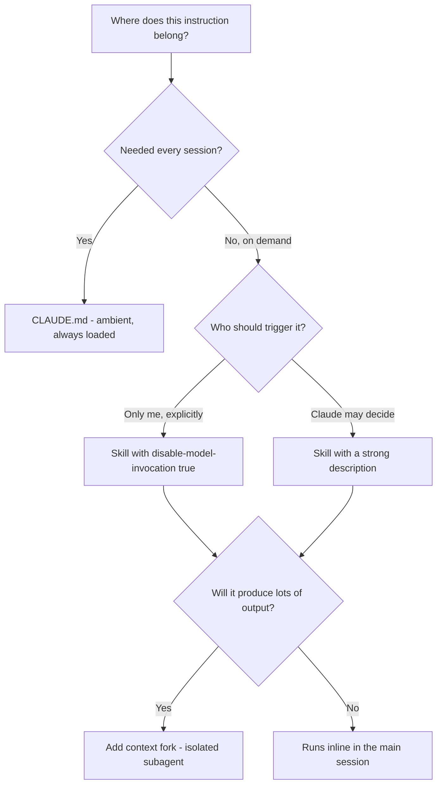
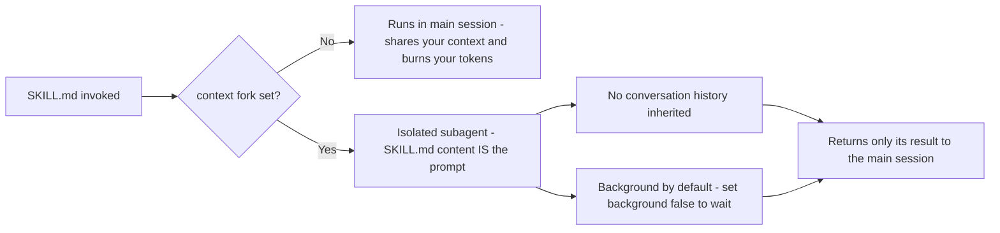
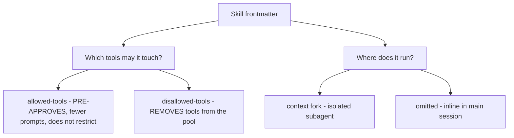

---
tags:
  - CCA-F
  - domain-3
  - skills
  - slash-commands
  - youtube-course
date: 2026-08-04
status: done
domain: "3 of 5"
source: "Peace Of Code — Claude Certified Architect Ep 11"
---

# ⚡ EP11 — Custom Slash Commands & Skills

> [!NOTE] Exam Coverage
> Maps to **Domain 3 — Claude Code Configuration & Workflows**, task statement **3.2** (custom slash commands and skills), with the `context: fork` material touching **Domain 1** task statement **1.3** (subagent invocation) and **Domain 5** task statement **5.1** (context management). Covers command scoping, `SKILL.md` anatomy and frontmatter, `context: fork` isolation, tool pre-approval versus restriction, supporting files, and the selection matrix across `CLAUDE.md`, skills, and commands.

**Back to:** [[CCA-F Study Roadmap]] · **Domain note:** [[D3 - Claude Code Configuration & Workflows]] · **Deck:** [[EP11 - Flashcards]]
**Source:** [Peace Of Code — Ep 11 (33 min)](https://www.youtube.com/watch?v=v3tMqTmgg2Q) · Level: college / professional-certification · Question mix calibrated MCQ-heavy (40 / 40 / 20)
**Previous:** [[EP10 - CLAUDE.md Hierarchy & Config Rules]]

---

## 1. Outline

- [1. Outline](#1-outline)
- [2. Key Terms](#2-key-terms)
- [3. Concept Summaries](#3-concept-summaries)
  - [3.1 The Command That Only Worked on One Machine](#31-the-command-that-only-worked-on-one-machine)
  - [3.2 What a Slash Command Actually Is](#32-what-a-slash-command-actually-is)
  - [3.3 User Scope vs Project Scope](#33-user-scope-vs-project-scope)
  - [3.4 Commands vs CLAUDE.md](#34-commands-vs-claudemd)
  - [3.5 Skills — More Than a Static Prompt](#35-skills--more-than-a-static-prompt)
  - [3.6 SKILL.md Anatomy and the Missing Field](#36-skillmd-anatomy-and-the-missing-field)
  - [3.7 context fork — Isolation, Not Inheritance](#37-context-fork--isolation-not-inheritance)
  - [3.8 Pre-Approving Tools vs Restricting Them](#38-pre-approving-tools-vs-restricting-them)
  - [3.9 Supporting Files Beyond SKILL.md](#39-supporting-files-beyond-skillmd)
  - [3.10 The Selection Matrix](#310-the-selection-matrix)
  - [3.11 Commands Have Merged Into Skills](#311-commands-have-merged-into-skills)
- [4. Diagrams](#4-diagrams)
- [5. Worked Examples](#5-worked-examples)
- [6. Practice Questions](#6-practice-questions)
- [7. Cheat Sheet](#7-cheat-sheet)

---

## 2. Key Terms

| Term | Definition | Source |
|---|---|---|
| **Slash command** | A Markdown file whose contents become a reusable prompt, triggered by `/name`. The host's analogy: *"like a macro in Excel"* — but richer, because it holds a full prompt, not text expansion. | [02:11] |
| **Project scope** | `.claude/commands/<name>.md` · `.claude/skills/<name>/SKILL.md` — committed, so everyone who clones the repo gets it. | [04:40] |
| **User scope** | `~/.claude/commands/` · `~/.claude/skills/` — yours across **all** projects, never shared. | [05:28] |
| **Skill** | A directory containing `SKILL.md` plus optional supporting files. Invocable by you *or* auto-loaded by Claude when relevant. | [11:20] |
| **`SKILL.md`** | The required entrypoint of a skill. Everything else in the folder is optional. | [15:41] |
| **`description`** | The frontmatter field Claude uses to **decide when to apply a skill**. The one field the docs recommend — and the one the lecture omits. | *(correction — §3.6)* |
| **`name`** | Frontmatter **display label** only, for project and personal skills. The invocation name comes from the **directory name**. | [16:05] · *(correction — §3.6)* |
| **`context: fork`** | Runs the skill in an isolated subagent whose prompt *is* the `SKILL.md` content. **No access to your conversation history.** | [18:34] · *(correction — §3.7)* |
| **`background`** | Only meaningful with `context: fork`. Defaults to **`true`** — forked skills run in the background. `false` waits in-turn. | *(expansion — §3.7)* |
| **`agent`** | Which subagent type executes a `context: fork` skill — `Explore`, `Plan`, `general-purpose`, or a custom one. Defaults to `general-purpose`. | *(expansion — §3.7)* |
| **`allowed-tools`** | **Pre-approves** tools so they run without a permission prompt during the invoking turn. Does **not** restrict anything. | [17:55] · *(correction — §3.8)* |
| **`disallowed-tools`** | The field that actually **removes** tools from Claude's pool while the skill is active. | *(correction — §3.8)* |
| **`argument-hint`** | Hint text shown during **autocomplete**. It does **not** prompt a user who forgot an argument. | [18:15] · *(correction — §3.6)* |
| **`disable-model-invocation`** | `true` = Claude never auto-triggers the skill; manual `/name` only. Use for anything with side effects. | *(expansion — §3.6)* |
| **`$ARGUMENTS`** | Placeholder replaced by whatever follows the skill name. `$0`, `$1` access positions. | *(expansion — §3.6)* |
| **Supporting files** | Templates, `reference.md`, scripts in the skill folder — loaded only when `SKILL.md` points Claude at them. | [19:54] |
| **Dynamic context injection** | `` !`command` `` in a skill body — runs the shell command first and inlines its output. | *(expansion — §3.9)* |
| **Skill content lifecycle** | Once invoked, rendered `SKILL.md` **stays in context for the rest of the session**; Claude does not re-read the file. | *(expansion — §3.5)* |
| **Model invocation** | Claude loading a skill on its own because the request matches its `description` — no `/` typed. | [19:54] |
| **Skill precedence** | Enterprise → personal → project (personal **overrides** project). A skill also beats a command of the same name. | *(expansion — §3.3)* |

---

## 3. Concept Summaries

### 3.1 The Command That Only Worked on One Machine

*Question: Sarah clones the repo, sets up Claude Code, types `/review`, and gets nothing. It works for you. Why?*

Because `/review` was never in the repo. The host's framing is precise: *"That is a command that Claude Code doesn't provide. It's a custom slash command that you have created for your own."* The file lives in **your home directory** — `~/.claude/commands/review.md` — so `git clone` could never deliver it.

If this feels familiar, it should: it is structurally the same bug as [[EP10 - CLAUDE.md Hierarchy & Config Rules]] § 3.6, with a different file. Something that works is written to a private scope, nobody notices because the author is the only tester, and the failure surfaces on someone else's machine weeks later. The exam reuses the shape deliberately, so learn the *pattern* rather than the specific filename: **when a teammate can't use something you built, check where you put it before you check anything else.**

**In your own words:** Not a broken command — an unshared one. User scope can't reach a `git clone`.

*See PQ 1.*

---

### 3.2 What a Slash Command Actually Is

*Question: what is `/review` under the hood?*

A Markdown file. You write the prompt once — the host's example is *"run all the tests in this module and give me a summary of failures"* — save it as `review.md`, and it becomes `/review`. Claude reads the file and executes its contents whenever you invoke it.

His clarification is the important one, because the analogy he opens with undersells the feature: *"Slash commands are way more powerful than keyboard shortcuts… they are not just text expansion. They are markdown files that contain rich full prompts written by you."* A shortcut inserts characters; a command hands Claude an instruction set.

He also makes an observation worth holding onto because it explains the whole configuration surface: *"Everything that you actually write in Claude is md files."* `CLAUDE.md`, rules, commands, skills — all Markdown with optional YAML frontmatter. Once you know that, the only real questions are *which directory* and *what frontmatter*.

**In your own words:** A saved prompt in a `.md` file, invoked by filename. Not text expansion — an instruction set.

*See PQ 2.*

---

### 3.3 User Scope vs Project Scope

*Question: two directories, same file. What changes?*

Who can use it, and where.

| | Project scope | User scope |
|---|---|---|
| **Path** | `.claude/commands/` · `.claude/skills/` | `~/.claude/commands/` · `~/.claude/skills/` |
| **Version control** | Committed | Never |
| **Distribution** | Everyone on the team | Only you |
| **Reach** | This project only | **Every** project on your machine |
| **Use for** | Team security checks, PR templates | Personal checklists, cross-project helpers |

The host's argument for user scope is better than the usual "personal preferences" line, and it's worth understanding because it's a real technique. Suppose you work across several projects and want to cross-reference them. Starting Claude at your home directory and saying *"read through all of the projects and do this"* is hopeless — *"you will run out of the context even before starting your work."* Instead, put a command in `~/.claude/commands/` that names exactly which paths and files to consult. Claude then goes straight there. It's [[EP09 - Claude Built-in Tools]] § 3.10's incremental-exploration principle expressed as configuration: encode the targeted path once instead of paying for discovery every time.

His exam heuristic is exact and worth memorising verbatim: **"available to all contributors" means project scope.** Phrasings that point the same way: "the whole team", "everyone who clones the repo", "shared with contributors". Any of them → `.claude/`, committed.

> [!IMPORTANT] Skill precedence runs the opposite way to intuition — expansion
> When skills share a name across levels, **enterprise overrides personal, and personal overrides project.** So your `~/.claude/skills/deploy/` **wins over** the project's committed `deploy` skill — the reverse of the `CLAUDE.md` rule from [[EP10 - CLAUDE.md Hierarchy & Config Rules]], where more specific is read later. A skill at any level also overrides a **bundled** skill of the same name, and a skill beats a **command** of the same name.
> Source: https://code.claude.com/docs/en/skills#where-skills-live · consistent with [[D3 - Claude Code Configuration & Workflows]] § 3.2

**In your own words:** Project scope for anything the team needs; user scope for anything that follows you between projects. "All contributors" is the exam's tell.

*See PQ 3, 4, 12.*

---

### 3.4 Commands vs CLAUDE.md

*Question: both hold instructions in Markdown. When does each apply?*

**Timing.** The host draws the line cleanly: `CLAUDE.md` is *"like onboarding documentation… every time a session starts, Claude will go through that file"* — the tech stack, the conventions, the rules. It is **ambient**: always loaded, never invoked.

A command is the opposite: *"specific instructions that you do daily or use frequently."* It costs nothing until you type it, and then it costs exactly its own length.

That gives you a two-question test, and it's the same axis [[EP10 - CLAUDE.md Hierarchy & Config Rules]] § 3.10 used: *does this need to be true in every session, or only when I ask for it?* Universal facts are ambient → `CLAUDE.md`. Procedures you trigger are on-demand → a command or skill. The host's decision rule at [27:47] is the sharp version: *"If you are putting a 50-step procedural checklist into `CLAUDE.md`, you are polluting every session. Move it to a skill."*

**In your own words:** `CLAUDE.md` is ambient and always loaded. A command is on-demand and free until invoked.

*See PQ 5.*

---

### 3.5 Skills — More Than a Static Prompt

*Question: commands already hold rich prompts. What does a skill add?*

Judgement and structure. The host's diagnosis of the ceiling is accurate: *"A slash command at the end of the day is a static prompt. You write the instructions, Claude follows them. Same instructions every time."*

A skill differs on three axes he names correctly: it is **invoked on demand — including by Claude itself**, it can have **its own context**, and it can be **given specific tools and constraints**. His restaurant analogy is the one to keep:

> *"A slash command is like a restaurant order form — you fill it out, the kitchen makes exactly what you wrote. A skill is like hiring a specialist chef. You tell them the outcome you want, they bring their own tools, and they work independently in their own kitchen."*

His live demo shows the part that matters most, and it's easy to miss why it worked. He types *"can you create an agent?"* — no slash, no skill name — and Claude loads the `create-agent` skill on its own, then asks structured follow-up questions drawn from the file. That is **model invocation**, and it happens because of a frontmatter field the lecture never mentions (§3.6). The distinction he draws is real: a command *"will just execute whatever is there,"* whereas with a skill *"Claude thinks a bit."*

He is also careful where it counts — *"a skill is more like a sub-agent. It's not exactly a sub-agent"* — which is right. A skill only becomes a subagent when you add `context: fork` (§3.7).

> [!IMPORTANT] A skill's body is cheap to have, not cheap to use — expansion
> The lecture's token story is half of the picture. A skill's body **loads only when used**, so a long reference skill costs almost nothing while idle — that's the genuine saving over `CLAUDE.md`. But once invoked, the rendered `SKILL.md` **enters the conversation and stays there for the rest of the session**; Claude does not re-read the file on later turns. So every line becomes a *recurring* cost, and the docs advise keeping `SKILL.md` **under 500 lines** with detail pushed into supporting files (§3.9). Re-invoking a skill whose content is unchanged adds only a short "already loaded" note rather than a second copy.
> Source: https://code.claude.com/docs/en/skills#skill-content-lifecycle

**In your own words:** A command executes; a skill can decide, carry its own files and tools, and load itself when the request fits.

*See PQ 6, 13.*

---

### 3.6 SKILL.md Anatomy and the Missing Field

*Question: what goes in the frontmatter?*

Structurally the host is right, and this part is worth getting exactly: a skill is **a directory inside `.claude/skills/`**, named for the skill, containing `SKILL.md`. *"If you want to create a new skill, it should be inside its own specific folder inside the skills folder."* `SKILL.md` is the only required file.

He then lists *"four things that you need to keep in mind: name, context, allowed tools, and argument hint."* All four are real fields. But the list has a hole in the middle of it.

> [!WARNING] The frontmatter list omits `description` — verified against official docs
> Officially, **all frontmatter fields are optional**, and **only `description` is *recommended*** — because it is *"what the skill does and when to use it. Claude uses this to decide when to apply the skill."* If omitted, Claude falls back to the first paragraph of the body.
> This matters because it is the mechanism behind the lecture's own demo: typing *"can you create an agent?"* loads the skill **because the description matched**, not because of `name`, `context`, `allowed-tools`, or `argument-hint`. Omit `description` and auto-invocation becomes unreliable.
> **Exam answer: `description` is the field that drives skill selection.** Expect it in any question about *when* or *why* Claude picked a skill.
> Source: https://code.claude.com/docs/en/skills#frontmatter-reference · consistent with [[D3 - Claude Code Configuration & Workflows]] § 3.2, which lists it as the first field

Two further precisions, both of which change what you'd write:

> [!WARNING] `name` does not set the invocation, and `argument-hint` does not prompt — verified against official docs
> **`name`:** for personal and project skills it is a **display label** shown in listings only. The command you type comes from the **directory name** — `.claude/skills/deploy-staging/SKILL.md` → `/deploy-staging`, whatever `name` says. Only *plugin* skills use `name` to form the command. So renaming the frontmatter and expecting the invocation to change is a live failure mode.
> **`argument-hint`:** officially *"hint shown during **autocomplete** to indicate expected arguments"* — e.g. `[issue-number]`. The lecture says twice that it will *"ask you for that particular hint"* if you forget an argument. It does not prompt; it is display text. Missing arguments simply leave placeholders unfilled (an unmatched `$2` stays literal).
> **Exam answer:** invocation name = directory name · `argument-hint` = autocomplete display only.
> Source: https://code.claude.com/docs/en/skills#how-a-skill-gets-its-command-name

Three fields the lecture doesn't reach, all exam-plausible: **`disable-model-invocation: true`** stops Claude auto-triggering — essential for anything with side effects, since *"you don't want Claude deciding to deploy because your code looks ready"*; **`paths`** limits auto-invocation to matching files, the same glob syntax as [[EP10 - CLAUDE.md Hierarchy & Config Rules]] § 3.9; and **`$ARGUMENTS`** (with `$0`, `$1` for positions) is how arguments actually reach the body. **(expansion)**

**In your own words:** Directory name gives the command, `description` gets it chosen, `$ARGUMENTS` gets data in. Everything is optional; only `description` is recommended.

*See PQ 7, 8, 14, 15.*

---

### 3.7 context fork — Isolation, Not Inheritance

*Question: what does `context: fork` do?*

It runs the skill as a **separate subagent with a fresh, isolated context**, and returns only the result to your main session. The host's motivation is exactly right and is the exam's framing too: a skill that does real work burns tokens, and without `fork` it burns them *in your session*. He demonstrates it honestly — running `create-agent` inline, watching 4–5k tokens disappear, and noting *"I'll probably run out of context."* With `fork`, that cost lands somewhere else and only the findings come back.

His `/deep-review` walkthrough captures the lifecycle correctly: Claude reads `SKILL.md`, sees `context: fork`, spawns the subagent, the subagent does the review, and *"the sub agent dies returning only the formatted security findings to the main session."* He also connects it to the right prior concept — this **is** the coordinator/subagent pattern from [[EP02 - Multi-Agent Systems & Coordinator Patterns]], reused inside Claude Code.

But he anchors the word "fork" to the wrong prior lesson, and the two behave oppositely.

> [!WARNING] A forked *skill* does not inherit your conversation — verified against official docs
> The lecture says: *"we have already learned about fork sessions in my session management lesson… It's a similar concept."* It is not. Officially, with `context: fork`, *"the skill content becomes the prompt that drives the subagent. **It won't have access to your conversation history.**"*
> Contrast that with **session** forking (`--fork-session` / `/branch`) from [[EP03 - Subagent Context Passing & Session Management]], which **copies the full history** into a new session ID. Same word, opposite treatment of history — and the isolation is precisely *why* `context: fork` protects your context window.
> The practical consequence: a forked skill must contain **explicit, self-sufficient instructions**. The docs warn that a skill holding only guidelines — *"use these API conventions"* — with no task *"receives the guidelines but no actionable prompt, and returns without meaningful output."*
> **Exam answer: `context: fork` = isolated subagent, no conversation history, only the result returns.**
> Source: https://code.claude.com/docs/en/skills#run-skills-in-a-subagent · consistent with [[D3 - Claude Code Configuration & Workflows]] § 3.2

Three behaviours the lecture doesn't cover, and the first will surprise people:

1. **Forked skills run in the background by default** (`background: true`) — you keep working and the result arrives when it completes. Set `background: false` to wait within the invoking turn.
2. **A backgrounded fork gets a narrower tool set**, so if the skill needs a tool outside that set, `background: false` keeps the full one.
3. **A backgrounded fork's edits fall outside session checkpoints**, so `/rewind` will not undo them — use git.

Plus the **`agent`** field picks *which* subagent type executes the fork: `Explore`, `Plan`, `general-purpose`, or any custom agent, defaulting to `general-purpose`. `Explore` and `Plan` skip `CLAUDE.md` to stay lean. **(expansion)**

**In your own words:** `fork` isolates rather than inherits. The skill body *is* the prompt, so it must stand alone.

*See PQ 9, 16, 17.*

---

### 3.8 Pre-Approving Tools vs Restricting Them

*Question: `allowed-tools: Read Grep`. What has that accomplished?*

Fewer permission prompts — not a sandbox. This is the one place the lecture states the mechanism backwards, and it does so in its own cheat sheet, so it's worth being blunt.

> [!WARNING] `allowed-tools` does not restrict capabilities — verified against official docs
> The lecture's summary says *"Fork isolates execution. **Allowed tools restrict capabilities.** Don't mix them up"*, and it frames `allowed-tools` as the way to apply least privilege: *"only allow what the skill can use… don't give it more privilege."*
> Officially, `allowed-tools` **grants** permission: tools listed run *without prompting you* during the turn that invokes the skill, and the grant clears on your next message. Explicitly — *"it does **not** restrict which tools are available: every tool remains callable, and your permission settings still govern tools that are not listed."*
> The field that actually removes capability is **`disallowed-tools`**, which takes tools out of Claude's pool while the skill is active.
> **Exam answer: `allowed-tools` = pre-approve (fewer prompts) · `disallowed-tools` = restrict.** Least privilege for a skill means `disallowed-tools`, or deny rules in permission settings for a durable block.
> Source: https://code.claude.com/docs/en/skills#pre-approve-tools-for-a-skill · consistent with [[D3 - Claude Code Configuration & Workflows]] § 3.2, which describes both fields correctly — **the vault note is right and the video is not**

The half the lecture gets right is the *security posture*: a project skill can grant itself broad tool access, so review `.claude/skills/` before trusting a repository — `allowed-tools` in a committed skill takes effect once you accept the workspace trust dialog. His instinct to be careful is sound; only the field is wrong.

His fork-vs-tools separation is otherwise a genuinely good exam frame: **`fork` answers *where* the skill runs; the tool fields answer *what it may touch*.** Two independent axes.

**In your own words:** `allowed-tools` removes prompts, `disallowed-tools` removes tools. Where it runs and what it may touch are separate settings.

*See PQ 10, 18.*

---

### 3.9 Supporting Files Beyond SKILL.md

*Question: what else can live in a skill folder, and why bother?*

Anything `SKILL.md` points at. The host's `create-agent` skill is a good illustration: alongside `SKILL.md` sit **templates** (`single_agent.py` boilerplate) and a **`reference.md`** of things Claude should know while building an agent. His framing of the entrypoint's role is apt — `SKILL.md` is *"the file that dictates the creation"*, a router rather than the whole payload.

He is careful about what's required, and correctly so: *"It is not mandatory. The mandatory thing is the `SKILL.md` file."*

The reason this matters is the token profile, and it's the same progressive-disclosure idea as everything else in this domain: large reference docs, API specs, and example collections **don't load every time the skill runs**. They load when `SKILL.md` tells Claude to read them. So the pattern is a lean entrypoint that names its resources — *"for complete API details, see `reference.md`"* — with the bulk deferred. Scripts in the folder are **executed, not loaded**, so they cost nothing in context at all.

> [!TIP] Dynamic context injection — expansion
> A skill body can run shell commands before Claude sees it: `` !`git diff HEAD` `` executes and the **output** replaces the placeholder. So a `/pr-summary` skill can arrive pre-loaded with the real diff rather than an instruction to go fetch one. `${CLAUDE_SKILL_DIR}` resolves to the skill's own folder, which lets a skill reference its bundled scripts regardless of the working directory.
> Source: https://code.claude.com/docs/en/skills#inject-dynamic-context

**In your own words:** `SKILL.md` is a lean router; templates, references, and scripts load only when it points at them.

*See PQ 11.*

---

### 3.10 The Selection Matrix

*Question: three mechanisms. Which one, when?*

The host's matrix is sound and the exam will draw from it:

| | `CLAUDE.md` | Skill | Command |
|---|---|---|---|
| **Activation** | Passive — every session start | On demand, **or Claude decides** | Explicit `/name` |
| **Isolation** | None | `context: fork` available | Not available *(see §3.11)* |
| **Best for** | Standing project rules, architecture | Complex multi-step procedures | Static reusable prompts |

His decision rule bears repeating because it's the one that generalises: *"If you are putting a 50-step procedural checklist into `CLAUDE.md`, you are polluting every session. Move it to a skill."*

The signal mapping from his cheat sheet is the most directly exam-usable material in the episode — with one correction carried from §3.8:

| Question says | Answer |
|---|---|
| "Available to all contributors" | Project scope — `.claude/`, committed |
| "Prevent context pollution" / "intermediate results flood the session" | `context: fork` |
| "Principle of least privilege" | **`disallowed-tools`** — *not* `allowed-tools` (§3.8) |
| "Reduce permission prompts for this skill" | `allowed-tools` |
| "Show expected arguments in autocomplete" | `argument-hint` |
| "Claude shouldn't trigger this on its own" | `disable-model-invocation: true` |

**In your own words:** Ambient rules → `CLAUDE.md`. Procedures → a skill. Static prompts → a command. Match the exam's phrasing to the field.

*See PQ 19.*

---

### 3.11 Commands Have Merged Into Skills

*Question: are commands and skills genuinely different features?*

Not architecturally — and this reframes the whole episode, so it's worth knowing even though the exam is built on the older distinction.

> [!IMPORTANT] Commands and skills are now one mechanism — verified against official docs
> Officially: *"**Custom commands have been merged into skills.** A file at `.claude/commands/deploy.md` and a skill at `.claude/skills/deploy/SKILL.md` both create `/deploy` and work the same way."* Existing `.claude/commands/` files keep working and **support the same frontmatter** — including `context: fork` and `allowed-tools`.
> So the lecture's *"a command is a static prompt, a skill is a mini agent"* is a description of **typical use**, not a capability boundary. What skills genuinely add is three things: a **directory for supporting files**, frontmatter to **control who invokes them**, and the ability for Claude to **load them automatically**.
> **Exam answer: keep the lecture's distinction** — the syllabus and its scenario questions are written on it, and "static prompt → command, multi-step procedure → skill" will score. Real code: prefer skills; the docs recommend them for anything new.
> Source: https://code.claude.com/docs/en/skills

This also cleans up an inconsistency in the lecture. It says commands cannot fork, then at [24:54] mentions a `/new-agent` **command** that *"will do the same thing"* as the `create-agent` skill. Under the merged model that's unremarkable — the same frontmatter is available either way.

**In your own words:** One mechanism, two file layouts. Skills add supporting files, invocation control, and auto-loading — the exam still tests them as separate ideas.

*See PQ 20.*

---

## 4. Diagrams


*Routing an instruction. The `description` is what makes auto-invocation possible at all.*


*`context: fork` isolates rather than inherits — the opposite of session forking.*


*Two independent axes. The lecture conflates the left branch — `allowed-tools` grants, it does not restrict.*

---

## 5. Worked Examples

### Example 1 — Diagnosing "the command doesn't work for Sarah"

**Task:** You built `/review`. A new teammate clones the repo and `/review` is not recognised. Diagnose and fix.

1. **Locate the file on *your* machine, not theirs.** *(why: the symptom is on the new clone but §3.1 shows the cause is always where the working copy lives.)* Check `~/.claude/commands/review.md` versus `.claude/commands/review.md`.
2. **Confirm the repo genuinely lacks it.** *(why: a file at the project path that was never `git add`ed behaves identically to user scope.)* `git ls-files .claude/commands/review.md` returning nothing settles it.
3. **Move to project scope and commit.** *(why: only committed project scope travels with a clone — "available to all contributors" means `.claude/`.)*
4. **Check for a shadowing personal skill before declaring victory.** *(why: per §3.3, personal **overrides** project, so a stale `~/.claude/skills/review/` on someone's machine would silently win over the committed one.)*

**Answer:** The command was in `~/.claude/commands/` — user scope, never committed. Move it to `.claude/commands/review.md` (or `.claude/skills/review/SKILL.md`) and commit. Note the precedence trap: had Sarah kept her own `review` skill, it would have overridden the project's even after the fix.

---

### Example 2 — Writing a skill that Claude auto-invokes safely

**Task:** Build a `deep-review` skill that runs a security audit on a file, must not flood the main conversation, must never be triggered by Claude on its own, and should run `git` and `grep` without permission prompts.

1. **Create the directory — its name becomes the command.** *(why: per §3.6, `name` is only a display label for project skills; the invocation comes from the directory.)* `.claude/skills/deep-review/SKILL.md` → `/deep-review`.
2. **Write a `description`.** *(why: it's the recommended field and the one Claude reads to select a skill — even with auto-invocation off, it appears in listings.)*
3. **Set `disable-model-invocation: true`.** *(why: a security audit is a side-effecting workflow whose timing you want to control; this is the field that stops Claude deciding for itself.)*
4. **Set `context: fork`.** *(why: this is the documented answer to "intermediate results will flood the main session" — the audit runs in an isolated subagent and returns only findings.)*
5. **Pre-approve tools with `allowed-tools`.** *(why: this removes permission prompts — it does **not** restrict, per §3.8. If the skill must be prevented from writing, that needs `disallowed-tools`.)*
6. **Make the body self-sufficient and take a target via `$ARGUMENTS`.** *(why: a forked subagent gets no conversation history, so the body must stand alone.)*

```markdown
---
description: Security-audit a file for injection, secrets, and missing validation. Use for security review requests.
argument-hint: "[path-to-file]"
context: fork
background: false
disable-model-invocation: true
allowed-tools: Bash(git *) Grep Read
disallowed-tools: Write Edit
---

Perform a security audit of $ARGUMENTS. Report findings only; make no edits.
1. Read the file in full.
2. Grep for hardcoded secrets and unvalidated input paths.
3. Return a table of findings with severity and line numbers.
```

**Answer:** As above. `background: false` is deliberate — the default is background, and a backgrounded fork both runs with a narrower tool set and applies changes outside `/rewind`'s reach. `disallowed-tools: Write Edit` is what actually enforces "report only"; `allowed-tools` would not.

---

### Example 3 — Costing a procedure in CLAUDE.md against a skill

**Task:** A 50-step deploy checklist is $400$ lines at $13$ tokens per line. You run $20$ sessions a week and invoke the checklist in $3$ of them. Compare keeping it in `CLAUDE.md` against moving it to a skill.

1. **Cost the checklist once.** *(why: establishes the unit both options are measured in.)*
   $$L = 400 \times 13 = 5{,}200 \text{ tokens}$$
2. **Cost it in `CLAUDE.md` — loaded every session.** *(why: `CLAUDE.md` is ambient, so relevance is irrelevant to the bill.)*
   $$C_{\text{md}} = 20 \times 5{,}200 = 104{,}000 \text{ tokens/week}$$
3. **Cost it as a skill — loaded only when invoked.** *(why: a skill's body loads on use; the other 17 sessions pay only for its one-line description in the listing.)*
   $$C_{\text{skill}} = 3 \times 5{,}200 = 15{,}600 \text{ tokens/week}$$
4. **Express the reduction.** *(why: the ratio generalises — the saving scales with how rarely the procedure is actually needed.)*
   $$1 - \frac{15{,}600}{104{,}000} = 0.85 = 85\%$$

**Answer:** $104{,}000$ tokens/week ambient versus $15{,}600$ on demand — an **85% reduction**. Two caveats the arithmetic hides: once invoked, the skill's content **stays in context for the rest of that session**, so the saving is across sessions rather than within one; and adding `context: fork` moves even that cost out of the main session entirely.

---

## 6. Practice Questions

**1.** A teammate clones the repo, types `/review`, and Claude doesn't recognise it. It works on your machine. What is the cause? *(§3.1)*

<details><summary>Answer</summary>

The command file lives in user scope — `~/.claude/commands/review.md` — so it was never in the repo to be cloned. The fix is `.claude/commands/review.md`, committed.
</details>

**2.** Why is "keyboard shortcut" an under-description of a slash command? *(§3.2 / Slash command)*

<details><summary>Answer</summary>

A shortcut performs text expansion. A slash command is a Markdown file holding a complete prompt — Claude reads and executes the instructions, so it can encode multi-step work rather than characters.
</details>

**3.** An exam question says a checklist "must be available to all team members on this project." Where does it go? *(§3.3 / Project scope)*

<details><summary>Answer</summary>

Project scope — `.claude/commands/<name>.md` or `.claude/skills/<name>/SKILL.md`, committed to the repo. "Available to all contributors" is the exam's standard phrasing for project scope.
</details>

**4.** Give a use case where user scope is the *better* choice, not just the lazy one. *(§3.3 / User scope)*

<details><summary>Answer</summary>

A cross-project helper. A command in `~/.claude/commands/` is available in every project on your machine, so it can encode which paths to consult across several repos — far cheaper than starting Claude at your home directory and asking it to read everything. Personal pre-push checklists are the other case.
</details>

**5.** What single question distinguishes content belonging in `CLAUDE.md` from content belonging in a command or skill? *(§3.4)*

<details><summary>Answer</summary>

*Does this need to be true in every session, or only when I ask for it?* `CLAUDE.md` is ambient — loaded at every session start whether relevant or not. A command or skill costs nothing until invoked.
</details>

**6.** The lecture calls a command a "restaurant order form" and a skill "a specialist chef." What capability does the analogy point at? *(§3.5 / Skill)*

<details><summary>Answer</summary>

Autonomy. A command executes exactly what's written; a skill can be handed an outcome, bring its own tools and supporting files, ask clarifying questions, and work in its own context — so Claude reasons rather than replays.
</details>

**7.** Which `SKILL.md` frontmatter field determines whether Claude loads a skill on its own, and what happens if you omit it? *(§3.6 / `description`)*

<details><summary>Answer</summary>

**`description`** — what the skill does and when to use it. It's the only field the docs *recommend* (all fields are technically optional). If omitted, Claude falls back to the first paragraph of the body, making auto-invocation unreliable.
</details>

**8.** You rename a skill's frontmatter `name` from `deep-review` to `audit`. What command now invokes it? *(§3.6 / `name`)*

<details><summary>Answer</summary>

Still `/deep-review` — the **directory name**. For project and personal skills, `name` is only a display label in skill listings; only plugin skills use `name` to form the command. To change the invocation, rename the directory.
</details>

**9.** A skill with `context: fork` needs to know something you discussed earlier in the conversation. Will it? *(§3.7 / `context: fork`)*

<details><summary>Answer</summary>

**No.** A forked skill runs in an isolated subagent with **no access to your conversation history** — the `SKILL.md` content *is* its entire prompt. Anything it needs must be in the body or passed as arguments.
</details>

**10.** A skill declares `allowed-tools: Read Grep`. Can it still call `Write`? *(§3.8 / `allowed-tools`)*

<details><summary>Answer</summary>

**Yes.** `allowed-tools` *pre-approves* the listed tools so they run without prompting during the invoking turn — it does not restrict anything. Every other tool remains callable, subject to your normal permission settings. Removing tools requires `disallowed-tools`.
</details>

**11.** What is the only required file in a skill directory, and what do the optional ones buy you? *(§3.9 / Supporting files)*

<details><summary>Answer</summary>

`SKILL.md` is the only required file. Templates, reference docs, and scripts alongside it load **only when `SKILL.md` points Claude at them** — so bulky reference material costs nothing until needed. Scripts are executed rather than loaded, costing no context at all.
</details>

**12.** You commit a `deploy` skill to `.claude/skills/`. A teammate has their own `deploy` in `~/.claude/skills/`. Whose runs, and why is that surprising? *(§3.3 / Skill precedence)*

<details><summary>Answer</summary>

**Theirs.** Skill precedence is enterprise → personal → project, so **personal overrides project** — the reverse of the `CLAUDE.md` rule where the more specific, closer file is read last and tends to win.
</details>

**13.** A skill's body is 800 lines. It loads only when invoked, so why do the docs still cap `SKILL.md` at 500? *(§3.5 / Skill content lifecycle)*

<details><summary>Answer</summary>

Because once invoked, the rendered content **stays in context for the rest of the session** and Claude does not re-read the file. The saving is that it's free while *unused*; after one invocation every line is a recurring per-turn cost. Detail belongs in supporting files.
</details>

**14.** You are writing a `/deploy` skill. Which field prevents Claude from running it on its own, and why does it matter here specifically? *(§3.6 / `disable-model-invocation`)*

<details><summary>Answer</summary>

`disable-model-invocation: true`. It matters because deployment has side effects whose timing you must control — you don't want Claude deciding to deploy because the code looks finished. Anything irreversible or outward-facing should set it.
</details>

**15.** A user runs `/deep-review` with no file argument. Does `argument-hint: "[path-to-file]"` make Claude ask them for one? *(§3.6 / `argument-hint`)*

<details><summary>Answer</summary>

No. `argument-hint` is **autocomplete display text** only — it shows the expected shape while typing. It does not prompt, validate, or block. An unfilled positional placeholder simply stays literal in the content.
</details>

**16.** A forked skill finishes and you try to undo its file changes with `/rewind`. Nothing happens. Why? *(§3.7 / `background`)*

<details><summary>Answer</summary>

Forked skills run in the **background by default**, and a backgrounded fork applies its edits **outside your session's checkpoints** — so `/rewind` can't reach them. Use git to revert, or set `background: false` to run it in-turn.
</details>

**17.** A skill containing only "use these API conventions…" is given `context: fork`. What is the likely outcome? *(§3.7)*

<details><summary>Answer</summary>

It returns nothing useful. The `SKILL.md` content becomes the subagent's entire prompt, so guidelines with no task give it nothing actionable. `context: fork` suits skills with explicit instructions; reference-style content should run inline.
</details>

**18.** You need a skill that can read the codebase but must never modify a file. Which field, and why is the intuitive one wrong? *(§3.8 / `disallowed-tools`)*

<details><summary>Answer</summary>

**`disallowed-tools: Write Edit`** — it removes those tools from Claude's pool while the skill is active. Listing only `Read`/`Grep` in `allowed-tools` looks like least privilege but merely pre-approves those two; `Write` stays callable.
</details>

**19.** A team built a skill that analyses hundreds of files and worries the intermediate results will flood the main conversation. What fixes it, and why are "set `allowed-tools`" and "move it to `~/.claude/commands/`" wrong? *(§3.10)*

<details><summary>Answer</summary>

`context: fork` — the analysis runs in an isolated subagent and only the final result returns. `allowed-tools` addresses permission prompts, not context volume; relocating to user scope changes *who* can run it, not *where its output lands*.
</details>

**20.** Officially, what is the relationship between a file in `.claude/commands/` and a skill of the same name? *(§3.11)*

<details><summary>Answer</summary>

Custom commands have been **merged into skills** — `.claude/commands/deploy.md` and `.claude/skills/deploy/SKILL.md` both create `/deploy` and work the same way, sharing the same frontmatter. Skills add a directory for supporting files, invocation control, and auto-loading. If both exist, the **skill** takes precedence.
</details>

---

## 7. Cheat Sheet

| Cue | Note |
|---|---|
| Command | A `.md` file whose contents become a prompt, invoked by `/name` |
| Project scope | `.claude/commands/` · `.claude/skills/<n>/SKILL.md` — committed, whole team |
| User scope | `~/.claude/...` — every project of yours, never shared |
| "All contributors" | → project scope. The exam's standard tell |
| Precedence | enterprise → personal → **project**. Skill beats command |
| Invocation name | The **directory** name. `name` is a display label only |
| `description` | **The** field Claude reads to auto-invoke. All fields optional; this one recommended |
| `argument-hint` | Autocomplete display text. Does **not** prompt |
| `context: fork` | Isolated subagent, **no** conversation history, returns only the result |
| `background` | Defaults **true** with fork. `false` waits in-turn and keeps the full tool set |
| `allowed-tools` | **Pre-approves** — fewer prompts. Restricts nothing |
| `disallowed-tools` | **Removes** tools. This is least privilege |
| `disable-model-invocation` | `true` = manual `/name` only. Use for side effects |
| Lifecycle | Once invoked, `SKILL.md` stays in context all session. Cap it at 500 lines |
| Required file | `SKILL.md` only. Templates and refs load when pointed at |

**Top 5 terms:** `description` · `context: fork` · `allowed-tools` vs `disallowed-tools` · model invocation · project scope

> [!WARNING] Exam traps
> ❌ "`allowed-tools` restricts what a skill can do" — it **grants**. Least privilege is `disallowed-tools`.
> ❌ Treating `context: fork` like session forking — a forked skill inherits **no** history.
> ❌ Expecting `argument-hint` to prompt for a missing argument. It's autocomplete text.
> ❌ Renaming frontmatter `name` to change the command. The **directory** decides.
> ❌ Team command in `~/.claude/commands/` — invisible to every clone.
> ✅ "Intermediate results flood the main session" → `context: fork`.

> [!TIP] Transcription artifacts in this episode
> **"cloud" / "Cloud Code" = Claude Code / `CLAUDE.md`** — pervasive throughout, as in EP10. The transcript also renders punctuation literally as `{slash}` and `{dot}`.
> **"argument hit" = `argument-hint`** [16:05] · **"tool selection make tricks" = tool selection matrix** [25:23] · **"over at architectural guidance" = overarching** [26:55] · **"single agent. py" = `single_agent.py`** · **"mug up"** [19:04] is an idiom for rote memorisation. At [24:26] *"created with IQ"* is unintelligible — nothing in the lesson depends on it.

> **Synthesis:** One mechanism, two questions. *Who needs it* is answered by the directory: `.claude/` for the team, `~/.claude/` for you — with the sting that personal skills **override** project ones. *How it should run* is answered by frontmatter, on three independent axes that the lecture partly conflates: `description` and `disable-model-invocation` decide **who invokes** it, `context: fork` decides **where it runs**, and `allowed-tools`/`disallowed-tools` decide **what it may touch** — granting and restricting respectively, not both. Get those axes separate and every scenario question in this task statement resolves to picking one field.

---

## ✅ Practice Checklist

- [ ] Can diagnose the "works for me, not for my teammate" bug and name the fix
- [ ] Know both scopes for commands and skills, and that "all contributors" means project scope
- [ ] Know skill precedence is enterprise → personal → project, and that personal beats project
- [ ] Know a skill's invocation name comes from the **directory**, not frontmatter `name`
- [ ] Can name `description` as the field driving auto-invocation, and say what happens without it
- [ ] Know `argument-hint` is autocomplete text and does not prompt
- [ ] Can state that `context: fork` gives an isolated subagent with **no** conversation history
- [ ] Know forked skills run in the background by default, and what that costs
- [ ] Can distinguish `allowed-tools` (pre-approve) from `disallowed-tools` (restrict)
- [ ] Know `SKILL.md` is the only required file and why supporting files are cheap
- [ ] Know an invoked skill's content persists for the rest of the session
- [ ] Can map each exam phrasing in §3.10 to the right field

---

*Next: [[EP12 - Plan Mode vs Execute]]*
