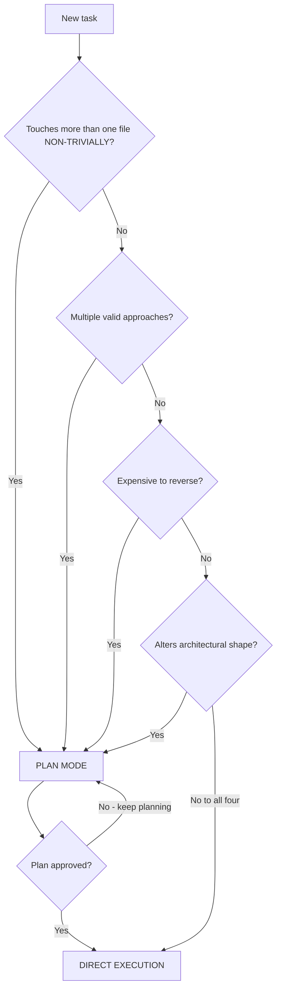
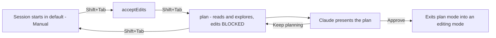
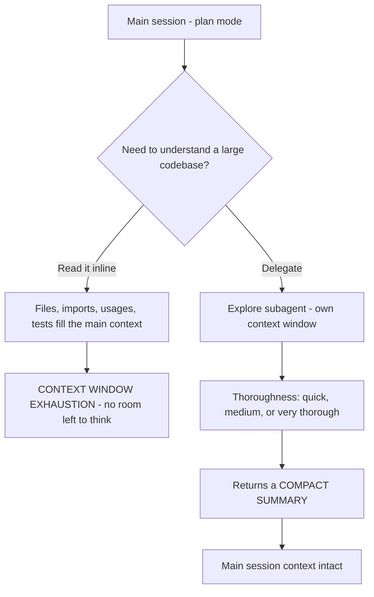

---
tags:
  - CCA-F
  - domain-3
  - plan-mode
  - iterative-refinement
  - youtube-course
date: 2026-08-04
status: done
domain: "3 of 5"
source: "Peace Of Code — Claude Certified Architect Ep 12"
---

# 🧭 EP12 — Plan Mode vs Execute

> [!NOTE] Exam Coverage
> Maps to **Domain 3 — Claude Code Configuration & Workflows**, task statements **3.4** (plan mode vs direct execution) and **3.5** (iterative refinement techniques). The context-exhaustion material also touches **Domain 5** task statement **5.4** (large codebase exploration) and **Domain 1** task statement **1.3** (subagent invocation). Covers the four plan-mode triggers, the plan → execute sequential workflow, the `Explore` subagent, model and effort switching, the three iterative-refinement patterns, and the interview pattern.

**Back to:** [[CCA-F Study Roadmap]] · **Domain note:** [[D3 - Claude Code Configuration & Workflows]] · **Deck:** [[EP12 - Flashcards]]
**Source:** [Peace Of Code — Ep 12 (51 min)](https://www.youtube.com/watch?v=q-n1cut5e7c) · Level: college / professional-certification · Question mix calibrated MCQ-heavy (40 / 40 / 20)
**Previous:** [[EP11 - Custom Slash Commands & Skills]]

---

## 1. Outline

- [1. Outline](#1-outline)
- [2. Key Terms](#2-key-terms)
- [3. Concept Summaries](#3-concept-summaries)
  - [3.1 The 40,000-Line Mistake](#31-the-40000-line-mistake)
  - [3.2 Direct Execution Is the Default](#32-direct-execution-is-the-default)
  - [3.3 Plan Mode as an Investigation Phase](#33-plan-mode-as-an-investigation-phase)
  - [3.4 The Decision Tree — Four Triggers](#34-the-decision-tree--four-triggers)
  - [3.5 Plan Is the Bridge, Not the Rival](#35-plan-is-the-bridge-not-the-rival)
  - [3.6 What Plan Mode Actually Is in Claude Code](#36-what-plan-mode-actually-is-in-claude-code)
  - [3.7 Switching Model and Effort Mid-Task](#37-switching-model-and-effort-mid-task)
  - [3.8 Context Window Exhaustion and the Explore Subagent](#38-context-window-exhaustion-and-the-explore-subagent)
  - [3.9 Iterative Refinement — Three Patterns](#39-iterative-refinement--three-patterns)
  - [3.10 The Interview Pattern](#310-the-interview-pattern)
  - [3.11 The Signal-to-Answer Mapping](#311-the-signal-to-answer-mapping)
- [4. Diagrams](#4-diagrams)
- [5. Worked Examples](#5-worked-examples)
- [6. Practice Questions](#6-practice-questions)
- [7. Cheat Sheet](#7-cheat-sheet)

---

## 2. Key Terms

| Term | Definition | Source |
|---|---|---|
| **Direct execution** | The default mode. You give Claude a task and it does it — no planning phase, no ceremony. Correct when *"the destination is known."* | [02:43] |
| **Plan mode** | An investigation phase **before any file is changed**: Claude reads broadly, identifies dependencies, weighs approaches, and presents a plan for your approval. | [04:45] |
| **Permission mode** | The Claude Code setting that decides how often Claude pauses for approval. `plan` is **one of six**: `default` (Manual), `acceptEdits`, `plan`, `auto`, `dontAsk`, `bypassPermissions`. | *(expansion — §3.6)* |
| **`Shift+Tab`** | Cycles permission modes in the CLI: `default` → `acceptEdits` → `plan`. Press again to leave plan mode **without** approving. | *(correction — §3.6)* |
| **`/plan`** | Prefixing a single prompt with `/plan` runs just that turn in plan mode. | *(expansion — §3.6)* |
| **`--permission-mode plan`** | Starts the session already in plan mode. `"defaultMode": "plan"` in `.claude/settings.json` makes it the project default. | *(expansion — §3.6)* |
| **Plan approval** | When the plan is ready Claude asks how to proceed. Approving **exits plan mode** and switches the session to an editing mode — the mechanical form of "plan then execute." | *(expansion — §3.6)* |
| **Expensive to reverse** | A plan-mode trigger. Without version control, undoing a bad multi-file change means *"spending tokens to just reverse your changes."* | [07:07] |
| **Alters architectural shape** | A plan-mode trigger. *"You can't blindly write code"* when a change needs an architectural decision. | [10:16] |
| **Context window exhaustion** | The failure where Claude fills its context with file contents during discovery and *"has not even started thinking what to do."* | [39:17] |
| **`Explore` subagent** | A **built-in** Claude Code subagent that searches and understands a codebase in its own context window and returns a compact summary — keeping discovery output out of the main session. | [39:50] · *(correction — §3.8)* |
| **Thoroughness level** | When delegating to `Explore`, Claude specifies **quick**, **medium**, or **very thorough**. | *(expansion — §3.8)* |
| **Iterative refinement** | Task statement 3.5. Not accepting the *"70% right"* first output — driving it toward correct through structured iteration. | [42:35] |
| **Feedback loop** | Claude produces output → you review → you give **specific** feedback → Claude revises. *"Make it better"* is useless feedback. | [43:58] |
| **Test-driven iteration** | Give Claude the tests first, let it generate code, run the tests, and feed **the failures** back. Machine-generated feedback, so *"there is no ambiguity about what success means."* | [44:58] |
| **Concrete examples** | Supply before/after pairs or the exact target format instead of prose. *"One concrete snippet beats a page of prose."* | [45:51] |
| **Interview pattern** | Invert the flow: brief Claude on the goal, then ask it *"before you start, ask me any clarifying questions you need."* Composable with plan mode — not a rival to it. | [47:04] |
| **`/model`** | Shows and changes the active model mid-session. The **left/right arrow keys adjust the effort slider** while a model is selected. | [36:27] · *(verified)* |
| **`/effort`** | Sets reasoning effort directly. Levels: `low`, `medium`, `high`, `xhigh`, `max`. Default is **`high`**. | *(correction — §3.7)* |
| **`ultrathink`** | The one keyword Claude Code recognises for deeper reasoning on a single turn, without changing the session's effort. `think`, `think hard`, and `think more` are **not** keywords. | *(expansion — §3.7)* |

---

## 3. Concept Summaries

### 3.1 The 40,000-Line Mistake

*Question: you type "refactor this into a microservice-based architecture" at a 40,000-line coupled Node.js monolith. Ten minutes later nothing compiles. What actually went wrong?*

Nothing went wrong with Claude. The host is careful about this and it is the whole lesson: *"Claude kind of did exactly what you asked."* The mistake was upstream of the model — a task that needed investigation was handed over as if it needed only execution.

The failure has a specific mechanism, and the host explains it better than most: in direct execution Claude *"will not kind of include all of the codebase at once, because it doesn't have that much context."* So it goes file by file — main controller, then a service it depends on, then that service's dependency — *"and simply it will keep on hopping, because it's a very large change."* Each hop commits an edit based on a local view. By the time a better global approach becomes visible, dozens of files already encode the worse one.

Then the second cost lands. Undoing it is not free: with version control you revert a commit, but otherwise *"Claude has to manually reverse those changes… you are just spending tokens to just reverse your changes."* You pay twice for the same work and end up where you started.

**In your own words:** Not a Claude failure — a mode-selection failure. File-by-file hopping commits early decisions on a partial view, and reversal costs tokens too.

*See PQ 1.*

---

### 3.2 Direct Execution Is the Default

*Question: what makes a task safe to hand over with no planning phase?*

The host's test is the one to memorise, because every example follows from it: **you already know what needs to happen** — the scope is clear, the output is predictable, and *"even if Claude gets it slightly wrong, fixing it is very cheap."* You know where the change landed, so you can find and fix it.

His examples all satisfy that test: writing unit tests for a class Claude already has context on; fixing a small bug where you can hand over the stack trace and the logs; updating config files; generating boilerplate.

The common thread he names is the load-bearing phrase: **the destination is known.** *"We know what the right answer looks like. It's just that we are lazy enough to not code"* — so the work is delegation, not design. There is nothing to decide, only something to type, and Claude types faster.

**In your own words:** Direct execution when the destination is known and a mistake is cheap to find and fix. The work is delegation, not design.

*See PQ 2.*

---

### 3.3 Plan Mode as an Investigation Phase

*Question: "make this code better." "Refactor this authentication system." Why do these break under direct execution?*

Because there is no known destination — there are several, and choosing between them is the actual work. The host's framing of what plan mode is doing is exactly right: it is Claude saying *"wait, before I touch anything, let me figure out what I'm actually dealing with."* An **investigation phase that happens before any code is written or any file changed.**

Four things happen in it, and they map cleanly to why the §3.1 failure can't recur: Claude **reads broadly** across the codebase to understand the current architecture (so no partial view), **identifies dependencies** (so no hopping), **considers multiple approaches and trade-offs** (so the better approach surfaces before edits, not after), and **presents the plan to you** (so the decision is yours).

He then handles the obvious objection well. Why not just write a very long, example-rich direct-execution prompt? *"The direct part will also work. But here's the catch"* — the constraint isn't your prompt's quality, it's the context window. A long prompt doesn't give Claude the whole codebase; it still discovers file by file. Plan mode changes *when* discovery happens relative to *when* edits happen. That is the whole difference.

His greenfield case is the least obvious and worth keeping. Starting a new app, you might reasonably say: nothing exists yet, so there's nothing to investigate — I'll scaffold and go. But planning first means Claude *"might suggest some better foundations for your application"* — more generic structure, fewer duplications, cleaner service boundaries. On an empty repo the thing being investigated is the requirements, not the code.

**In your own words:** Plan mode moves discovery ahead of edits. On a greenfield project the requirements are what gets investigated.

*See PQ 3, 4, 5.*

---

### 3.4 The Decision Tree — Four Triggers

*Question: what question do you ask yourself before starting?*

*"Do I need plan mode, or do I not need plan mode?"* Four triggers — **any one** is sufficient:

| Trigger | The lecture's test |
|---|---|
| **Touches more than one file non-trivially** | Multiple files *and* real ambiguity about the changes — not "go to this file and make that change" |
| **Multiple valid approaches** | You have an approach but suspect a better one exists. Claude presents options and you choose |
| **Expensive to reverse** | The §3.1 case: reversal costs tokens or you have no clean rollback |
| **Alters architectural shape** | *"In real-life scenarios also, you have to take the approval of your architect"* |

*"If all of these doesn't fall under your radar, guys, you would go with direct execution."* This matches [[D3 - Claude Code Configuration & Workflows]] § 3.4's table exactly — the vault note frames the same triggers as scenarios, including the "library migration affecting 45+ files" phrasing the exam tends to use.

> [!IMPORTANT] The trigger is ambiguity, not file count
> Read the first trigger carefully: **more than one file *non-trivially*.** A mechanical rename across forty files is one unambiguous decision applied forty times — direct execution handles it. A two-file change where the right split between those files is the open question is plan mode. The exam pairs a number with a word like *coupled*, *interdependent*, or *significant*; the number is scenery, the ambiguity word is the trigger.

The common mistake he names is the real one: reaching for direct execution *because it is easier to start.* It needs no decision-making, so *"you might think that it is easy, I'll keep on iterating, but unknowingly, you are spending too much tokens, and you are not being efficient."* Ten minutes of planning against an afternoon of untangling.

**In your own words:** Four triggers, any one sufficient — multi-file *and ambiguous*, multiple valid approaches, expensive to reverse, architectural. Otherwise direct execution.

*See PQ 6, 7, 13.*

---

### 3.5 Plan Is the Bridge, Not the Rival

*Question: plan mode or direct execution — which do you pick?*

Wrong question, and this is the single most exam-relevant reframe in the episode. *"These are not rivals… Plan is the bridge."*

You never stop at a plan: *"you would not just sit with the plan, right? You have to execute something."* So where plan mode applies, the workflow is **sequential**, not exclusive — plan first, approve the approach, *then* execute against it. Where plan mode doesn't apply, you execute directly. *"Wherever there is needed, insert the plan mode. Wherever it is not needed, go with the direct execution."*

That is also literally how the tool behaves, which makes the framing more than a slogan: approving a plan in Claude Code **exits plan mode and switches the session into an editing mode** (§3.6). The transition from planning to executing is a built-in step, not a separate decision you make later.

This kills a whole class of distractor answers. An option that presents the two as alternatives — "use plan mode *instead of* making changes," or "abandon planning and execute" — misreads the relationship. The right shape is always *plan → approve → execute*.

**In your own words:** Sequential, not exclusive. Plan mode is a phase you insert before execution, and approving the plan hands off to execution automatically.

*See PQ 8, 14.*

---

### 3.6 What Plan Mode Actually Is in Claude Code

*Question: how do you actually turn plan mode on?*

Here the demo and the exam part company, and it is worth being precise because the concepts transfer but none of the mechanics do.

> [!WARNING] The demo is not Claude Code — it is Cline
> The transcript's *"client"* extension is **Cline**, a third-party VS Code extension. Every mechanic shown in the demo is Cline's, not Claude Code's: the **Plan/Act toggle**, the *"toggle to act mode"* handoff, the thinking-token slider set to *"2,800 tokens"*, the *"auto approve mode"* checkbox, and the `$0.00` balance that turns out to be **Cline credits, billed separately from a Claude Pro subscription** — the host discovers this live and correctly diagnoses it: *"it is coming from Cline, a VS Code extension, not from your Claude Pro subscription. These are two separate things."* He then finishes the demo in the Claude Code terminal, which is the surface the exam tests.
> **Exam answer: plan mode is a Claude Code permission mode**, entered with `Shift+Tab`, a `/plan` prefix, or `--permission-mode plan`. There is no Plan/Act toggle and no thinking-token slider in Claude Code — depth is set with `/effort` (§3.7).
> Source: https://code.claude.com/docs/en/permission-modes

The verified mechanics:

- **Entering.** `Shift+Tab` cycles `default` → `acceptEdits` → `plan`. Prefix a single prompt with `/plan` to run just that turn in plan mode. Start the session in it with `claude --permission-mode plan`, or make it a project default with `"permissions": {"defaultMode": "plan"}` in `.claude/settings.json`.
- **Leaving without approving.** Press `Shift+Tab` again.
- **What it permits.** Officially, Claude *"reads files, runs shell commands to explore, and writes a plan, but does not edit your source."* Note that plan mode is **not** strictly read-only — exploratory commands are allowed; **edits** are what stay blocked until you approve.
- **Approving.** Claude presents the plan and asks how to proceed, offering to approve into auto mode or manual edit approval, refine in the browser, or keep planning. `Ctrl+G` opens the plan in your editor first. **Approving exits plan mode and switches the session to an editing mode** — §3.5's bridge, mechanised.

> [!WARNING] "Claude never does anything without your consent" — verified against official docs
> The lecture states this twice: *"Claude never does anything without your consent… At any point of time, you can just say no, and Claude will not do it."* As a **default-mode** description that's accurate, but it is not a property of the tool. Claude Code has **six** permission modes, and three of them act without per-action consent: `acceptEdits` auto-approves file edits and common filesystem commands, `auto` lets a classifier approve actions instead of you, and `bypassPermissions` skips checks entirely.
> The lecture contradicts itself within the same minute — the demo's own Cline session was *"in auto approve mode, so it is automatically getting approved."*
> **Exam answer: consent is a property of the permission mode, not of Claude.** Plan mode is the guardrail because it blocks edits; it is not a restatement of a universal rule. Real code: the sound half of the advice stands — review what Claude is doing.
> Source: https://code.claude.com/docs/en/permission-modes · consistent with [[D3 - Claude Code Configuration & Workflows]]

**In your own words:** `Shift+Tab` / `/plan` / `--permission-mode plan`. Exploration allowed, edits blocked, approval switches the session into editing. The demo's Plan/Act toggle is Cline's, not Claude Code's.

*See PQ 9, 10, 15.*

---

### 3.7 Switching Model and Effort Mid-Task

*Question: the plan is approved. Which model executes it?*

The host's answer is the practically useful one and the demo earns it: *"I don't think that you need Opus for everything."* He scaffolds the entire Angular + Express + SQLite Kanban app on **Sonnet** — and it works. *"All this was created, the whole project was created while being on the Sonnet model… I hadn't switched to Opus at all."*

Then the front end fails to start, and he prompts Sonnet to fix it. *"It was going in cycles… doing the same thing over and over again and getting stuck at that point."* That symptom is the signal, and recognising it is the transferable skill: **repeated identical attempts mean the model is under-powered for this specific step, not that the prompt is wrong.** He escalates model *and* effort, and it clears.

Both mechanics he shows are real. `/model` displays and changes the active model, and **the left/right arrow keys adjust the effort slider** while a model is selected — *"if you go to left, the effort will reduce. If you go to right, the effort will increase."* Verified.

> [!WARNING] Effort levels and the default — verified against official docs
> The lecture reads its starting effort as *"medium"*. Officially the levels are **`low`, `medium`, `high`, `xhigh`, `max`**, and the **default is `high`** on every model that supports effort (Opus 4.7 defaults to `xhigh`). Sonnet 4.6 — the demo's model — supports `low`/`medium`/`high`/`max` but **not** `xhigh`; setting a level a model doesn't support silently falls back to the highest supported level at or below it.
> The lecture also says *"I'm not at all at the max effort right now. I am working at the high effort"*, which is consistent with there being a level above `high`.
> **Exam answer: five levels, default `high`.** Effort is also settable with `/effort`, the `--effort` flag, `CLAUDE_CODE_EFFORT_LEVEL`, or `effortLevel` in settings.
> Source: https://code.claude.com/docs/en/model-config#adjust-effort-level

Two things the lecture doesn't reach, both cheap to remember: **`ultrathink`** anywhere in a prompt requests deeper reasoning for that turn only, without changing the session's effort — and it is the *only* recognised keyword, so `think hard` and `think more` are just prose. Effort can also be pinned per-unit-of-work via `effort` in **skill or subagent frontmatter**, which is how you keep an expensive verifier at high effort inside a cheap session. **(expansion)**

**In your own words:** Cheap model for scaffolding, escalate model and effort when it loops. `/model` plus arrow keys; five levels, default `high`.

*See PQ 11, 16.*

---

### 3.8 Context Window Exhaustion and the Explore Subagent

*Question: Claude is asked to understand a large system before planning a change. What breaks?*

The context window fills with discovery. Claude reads files, follows import chains, chases usages, reads the tests — *"and suddenly your context window is full of those file contents. And Claude has not even started thinking what to do. It's just reading and your context window is full."* That is **context window exhaustion**, and it is worth noticing that it bites hardest *during plan mode*, because plan mode's whole job is reading broadly.

The host's diagnosis of the usual non-fixes is sharp: people *"start with a new session and continue and they will hit it again if the codebase is really huge, or they will start with 1 million context and spend more money."* A bigger window and a fresh session both postpone the problem; neither removes the discovery cost from the main session.

The fix is delegation. Spin up a dedicated subagent whose only job is exploration: *"that subagent reads broadly, kind of forms an understanding, and then returns a compact summary back to the main session. So your main session context is intact."* That is exactly the coordinator/subagent pattern from [[EP02 - Multi-Agent Systems & Coordinator Patterns]], and the context-isolation principle in [[D5 - Context Management & Reliability]] § 5.4.

He then flags this as an exam fact, and he is right to: **"the `Explore` subagent prevents context window exhaustion."** Whenever a question says *context window exhaustion* or *large codebase discovery*, `Explore` is the answer.

> [!IMPORTANT] `Explore` is a named built-in subagent, not just a phrase in your prompt — verified against official docs
> The lecture says: *"It is not a command or something… you'll just basically have to put it in the prompt… There is nothing like special configurations, something you need to do."* The second half is right — no configuration is required — but the first half undersells it. `Explore` is a **built-in Claude Code subagent**, alongside `Plan` and `general-purpose`. Claude *"delegates to Explore when it needs to search or understand a codebase without making changes"*, on its own, and when it does it specifies a **thoroughness level**: `quick`, `medium`, or `very thorough`.
> Three behaviours worth knowing: `Explore` **inherits the main conversation's model** (capped at Opus on the Claude API) rather than always running on Haiku; `Explore` and `Plan` are the only subagents that **skip `CLAUDE.md` and git status**, to stay fast and cheap — so a rule that must reach it has to be restated in the delegating prompt; and both are **one-shot and cannot be resumed** (use `general-purpose` when you need to continue the work).
> **Exam answer: `Explore` subagent → prevents context window exhaustion during large-codebase discovery.** That mapping is what gets tested.
> Source: https://code.claude.com/docs/en/sub-agents · consistent with [[D3 - Claude Code Configuration & Workflows]] § 3.4 and [[D5 - Context Management & Reliability]] § 5.4

**In your own words:** Discovery output is the thing that exhausts context. `Explore` moves it into a separate window and returns a summary — a bigger context window only postpones the problem.

*See PQ 12.*

---

### 3.9 Iterative Refinement — Three Patterns

*Question: the first output is roughly 70% right. Now what?*

*"A lot of developers kind of leave the performance on the table"* — they get 70% and think *close enough*. *"If you can go to till that 99% mark, why do you stop at 70?"* Task statement 3.5 is about the craft of closing that gap, and the host says the three patterns are *"explicitly tested in the exam."*

**Feedback loop.** Claude produces output → you review → you give feedback → Claude revises. The keyword is **specific**: *"just telling 'make it better' is useless… make it better doesn't give Claude anything to work with."* His example is the right shape because it names a location and a desired behaviour: *"the error handling in the try-catch block on line number so-and-so needs to log the full error object."* Reviewable claim, actionable instruction.

**Test-driven iteration.** Give Claude the tests first, let it generate the code, run the tests, and feed **the failures** back. The reason this beats the feedback loop where it applies is the one he names: it is **machine-generated feedback**, so *"there is no ambiguity about what success means. Claude can iterate with high precision when it knows exactly which assertions need to pass."* You are not describing the target; the assertions are the target. And note the *failures* are the payload — sharing the test output, not a prose summary of it, is what makes it precise.

**Concrete examples.** For transformation tasks, show before and after. *"One concrete snippet beats a page of prose."* Need a particular JSON shape? Show the JSON. This is few-shot prompting applied to refinement, and it links forward to [[EP15 - Few-Shot Prompting]].

> [!TIP] The vault lists a slightly different three — and the difference is only bookkeeping
> [[D3 - Claude Code Configuration & Workflows]] § 3.5 lists **concrete examples, test-driven iteration, and the interview pattern**; the lecture lists **feedback loop, test-driven iteration, and concrete examples**, treating the interview pattern as a fourth idea. Two overlap; the fourth item differs.
> Nothing rides on the count. All four are refinement techniques, and the exam tests **which technique a scenario calls for**, not how many there are. Learn the trigger for each (§3.11) and the grouping is irrelevant. The vault note also adds a genuinely useful rule the lecture skips: **interacting issues go in one message** (fixes may interfere), **independent issues go one at a time**.

**In your own words:** Specific feedback beats "make it better"; test failures beat description; a snippet beats prose. Three ways to make the target unambiguous.

*See PQ 17, 18, 19.*

---

### 3.10 The Interview Pattern

*Question: you cannot write the perfect prompt for an open-ended task. What do you do instead?*

Invert the flow. Brief Claude on the high-level goal, then: *"before you start, ask me any clarifying questions you need."*

The host's justification is the one that makes it click, and it is counterintuitive on purpose: *"Claude often knows better than you do what information would most impact the particular output."* You can spend ten minutes writing an elaborate prompt and still miss the one detail that changes the design. Asking Claude what it needs delegates the *identification* of the gap, not just the work. His example: *"Build a REST API for user management. Before you write any code, ask me clarifying questions about requirements, constraints, or preferences that would significantly change your approach."*

He then pre-empts the confusion this reliably causes, and it matters for the exam: *"don't compare it with the plan mode, guys. That is different. You can use the interview pattern in the plan mode itself. This is about prompting."* Plan mode is **where Claude runs**; the interview pattern is **how you prompt**. Two independent axes — you might be in plan mode *and* using the interview pattern, so that the questions get answered before the plan is drafted and the plan comes out right the first time.

His exam trigger is precise and worth memorising verbatim: when a question asks about **reducing rework** or **improving first-pass quality** in open-ended implementations, the interview pattern is often the answer — as it is for *multiple possible interpretations* and *unclear scope*.

**In your own words:** Make Claude ask the questions. Orthogonal to plan mode, not an alternative — the exam tell is "reduce rework," "first-pass quality," or "unclear scope."

*See PQ 20.*

---

### 3.11 The Signal-to-Answer Mapping

*Question: what does the exam actually give you to pattern-match on?*

The closing cheat sheet is the most directly usable material in the episode:

| Question says | Answer |
|---|---|
| Large-scale refactor · hard to reverse · migrate · re-architect | **Plan mode** |
| Clear stack trace · obvious single-file fix · known destination | **Direct execution** |
| Context window filling · large codebase discovery | **`Explore` subagent** |
| Ambiguous requirements · unclear scope · reduce rework · first-pass quality | **Interview pattern** |
| Transformation task · inconsistent interpretation of prose | **Concrete examples** |
| Output is close but wrong in a specific, nameable way | **Feedback loop** — specific, located feedback |
| Need an unambiguous definition of "done" | **Test-driven iteration** — feed the failures back |

His worked signal is a good template: *"Extract DB queries from a 200-file monolith to an ORM."* Three triggers fire at once — many files, hard to reverse, architectural impact — so plan mode, and *"look for that particular option."* Note that no single trigger had to be decisive.

**In your own words:** Match the phrasing to the technique. Multiple triggers reinforce; you only need one.

*See PQ 13.*

---

## 4. Diagrams

*The four triggers. Any one is sufficient, and an approved plan feeds into execution — the two modes are sequential, never rivals.*

*Claude Code mechanics. Exploration is allowed in plan mode; only edits are blocked, and approval performs the handoff to execution.*

*Discovery output is what exhausts the context. `Explore` relocates it rather than shrinking it.*

---

## 5. Worked Examples

### Example 1 — The monolith migration question, option by option

**Task:** *"You are migrating a highly coupled Node.js monolith with significant interdependencies. What do you do?"*
**A.** Use plan mode to generate a phased strategy before making changes · **B.** Guess the dependencies and migrate one service at a time · **C.** Build extensive test suites for all services before any migration · **D.** Run an autonomous migration script without user input

1. **Count the triggers in the stem.** *(why: §3.4 — you only need one, but the exam usually plants several, and "coupled" plus "interdependencies" is the ambiguity signal that makes the file count matter.)* Many files ✓ · multiple valid decomposition boundaries ✓ · expensive to reverse ✓ · architectural ✓.
2. **Eliminate B on the verb.** *(why: "guess" is the direct opposite of plan mode's dependency-identification step.)* *"Why would you guess dependencies when you have Claude Code and plan mode?"*
3. **Eliminate D on the missing approval.** *(why: §3.5 — the plan→approve→execute shape requires the approval gate; "without user input" removes it.)*
4. **Recognise C as the near-miss, and why it's still wrong.** *(why: this is the distractor that costs marks — testing before migration is genuinely good practice, so it has to be rejected on a sharper basis than "bad idea.")* It isn't wrong because tests are bad; it's wrong because it puts the **test work first instead of the planning work**, on a codebase whose dependency structure is still unknown. The host's improvement is the giveaway: use plan mode to *"go through the existing test cases in plan mode, and plan out the next test suite"* — i.e. tests get **planned inside** the plan, not substituted for it. C is a step of A promoted to the whole answer.

**Answer: A.** Four triggers fire; A is the only option containing plan-mode-then-execute. C is a subordinate step of A, which is what makes it the strongest distractor.

---

### Example 2 — Costing the `Explore` subagent

**Task:** Understanding a subsystem requires reading $38$ files averaging $520$ tokens each. The session's window is $200{,}000$ tokens and the resident prompt already occupies $46{,}000$. `Explore` would return a $1{,}400$-token summary. Compare inline discovery against delegation.

1. **Cost the discovery.** *(why: establishes the payload both options move around — it does not disappear, it relocates.)*
   $$D = 38 \times 520 = 19{,}760 \text{ tokens}$$
2. **Read inline — headroom left for the actual work.** *(why: the failure in §3.8 is not "the window filled", it is "no room left to think".)*
   $$H_{\text{inline}} = 200{,}000 - 46{,}000 - 19{,}760 = 134{,}240 \text{ tokens}$$
3. **Delegate — only the summary lands in the main session.** *(why: the subagent's own window absorbs $D$; the main session pays $1{,}400$.)*
   $$H_{\text{Explore}} = 200{,}000 - 46{,}000 - 1{,}400 = 152{,}600 \text{ tokens}$$
4. **Express the reclaim, then check what it scales with.** *(why: the ratio is what generalises to the exam's "really huge codebase" framing.)*
   $$\frac{152{,}600 - 134{,}240}{134{,}240} = \frac{18{,}360}{134{,}240} = 0.137 = 13.7\%$$

**Answer:** $13.7\%$ more working headroom, and the reclaimed amount is $D - 1{,}400$ — it **scales with the size of the discovery**, which is why the technique matters exactly where the lecture says it does. Two caveats the arithmetic hides: reading $38$ files at $2{,}000$ tokens each ($76{,}000$) would leave inline discovery with $78{,}000$ against `Explore`'s unchanged $152{,}600$ — nearly double; and buying a $1$M-token window would raise both columns without changing the ratio, which is the host's point about *"spending more money"* on context you didn't need.

---

### Example 3 — Choosing mode, model, and effort across one build

**Task:** Scaffold a new Angular + Express + SQLite app, then fix a front-end startup failure the scaffold introduced. Choose the mode, model, and effort for each phase.

1. **Phase 1 — greenfield scaffold. Mode: plan.** *(why: §3.3 — "starting from scratch means nothing to investigate" is the trap; the requirements are what get investigated, and better foundations are cheap now and expensive later.)* Prompt for the folder structure, core modules, data models, and API endpoints, and say *don't write any code yet* — the host's own prompt shape.
2. **Model: Sonnet. Effort: `medium`.** *(why: scaffolding is largely mechanical and the framework CLI does much of it — "we don't want to spend too much tokens on just creating the blueprint." Note the effort choice is deliberate: the **default is `high`**, so `medium` is a downshift you have to make, not one you inherit.)*
3. **Approve the plan, then execute.** *(why: §3.5 — approving exits plan mode into an editing mode, so this is one continuous flow rather than a second decision.)* Sonnet completed the whole scaffold in the demo.
4. **Phase 2 — the front end fails to start. Try direct execution first.** *(why: §3.2 — a startup error with a stack trace is a known destination and cheap to fix. Reaching for plan mode here would be the mirror-image mistake.)*
5. **Watch for the loop signal, and escalate on it — not on elapsed time.** *(why: §3.7 — "going in cycles, doing the same thing over and over" is the diagnostic that the *model* is under-powered for this step. Retrying the same prompt harder is what wastes the afternoon.)* Escalate to Opus and raise effort to `high`.
6. **Reach for `ultrathink`, not a session change, if only one turn needs depth.** *(why: it requests deeper reasoning for that turn without disturbing the session's effort — and it is the only recognised keyword.)*

**Answer:** Plan + Sonnet + `medium` for the scaffold; direct execution for the fix, escalating to Opus + `high` on the looping signal. The two knobs are independent: **mode** answers *should Claude think before acting*, **model and effort** answer *how much capability this step needs*. The plan also has a documented limitation worth noting — the demo's back button didn't work, and *"the plan didn't specify that you have to also work on the back button."* Execution is faithful to the plan, so gaps in the plan become gaps in the app.

---

## 6. Practice Questions

**1.** A developer points Claude at a 40,000-line coupled monolith and asks for a microservice refactor. Ten minutes later imports are broken and no test passes. What is the root cause? *(§3.1)*

Answer

Mode selection, not model error — Claude did what was asked. In direct execution it can't hold the whole codebase in context, so it works file by file, committing edits based on a partial view and hopping dependency to dependency. Early decisions get encoded before a better global approach is visible.

**2.** State the single test that identifies a direct-execution task. *(§3.2 / Direct execution)*

Answer

**The destination is known** — you already know what needs to happen, the scope is clear, the output is predictable, and a mistake is cheap to locate and fix. The work is delegation rather than design.

**3.** Four things happen in plan mode before any file changes. Name them. *(§3.3 / Plan mode)*

Answer

Claude **reads broadly** across the codebase to understand the current architecture, **identifies dependencies**, **considers multiple approaches and trade-offs**, and **presents the plan** for your approval.

**4.** Why doesn't a very long, example-rich direct-execution prompt achieve the same result as plan mode? *(§3.3)*

Answer

Because the limit isn't your prompt's quality, it's the context window. However detailed the prompt, Claude still discovers the codebase file by file and commits edits as it goes. Plan mode changes *when* discovery happens relative to *when* edits happen.

**5.** You are starting a brand-new app. There is no existing code to investigate, so is plan mode pointless? *(§3.3)*

Answer

No. On a greenfield project the **requirements** are what get investigated. Given them up front, Claude can propose better foundations — a more generic structure, fewer duplications, cleaner service boundaries — which are cheap now and expensive to retrofit.

**6.** Name the four plan-mode triggers and say how many must fire. *(§3.4)*

Answer

Touches more than one file non-trivially · multiple valid approaches · expensive to reverse · alters architectural shape. **Any one is sufficient.** If none fire, use direct execution.

**7.** A mechanical variable rename spans 40 files. Plan mode or direct execution? *(§3.4)*

Answer

**Direct execution.** The trigger is more than one file *non-trivially* — 40 files is one unambiguous decision applied 40 times. File count without ambiguity isn't a trigger; the exam's real signal is a word like *coupled*, *interdependent*, or *significant* alongside the number.

**8.** "You must choose either plan mode or direct execution for a task." Why is this framing wrong? *(§3.5)*

Answer

They aren't rivals — plan is the **bridge**. You never stop at a plan, so where plan mode applies the workflow is sequential: plan → approve → execute. Where it doesn't apply, you execute directly. Any answer presenting them as alternatives misreads the relationship.

**9.** Give three ways to enter plan mode in Claude Code. *(§3.6 / `Shift+Tab`)*

Answer

Press `Shift+Tab` to cycle `default` → `acceptEdits` → `plan`; prefix a single prompt with `/plan`; or start the session with `claude --permission-mode plan`. `"permissions": {"defaultMode": "plan"}` in `.claude/settings.json` makes it a project default.

**10.** Is plan mode read-only? *(§3.6)*

Answer

**No.** Claude reads files *and runs shell commands to explore*, then writes a plan. What's blocked is **editing your source** — and only until you approve the plan. "Read-only" is a near-miss description; "no edits before approval" is accurate.

**11.** Claude keeps making the same failed attempt at a bug, over and over. What does that indicate and what do you change? *(§3.7)*

Answer

Looping on identical attempts means the **model is under-powered for that specific step** — not that the prompt is wrong. Escalate the model (Sonnet → Opus) and raise the effort level, rather than re-prompting harder.

**12.** A question mentions context window exhaustion during large-codebase discovery. What's the answer, and why isn't a 1M-token window? *(§3.8 / `Explore` subagent)*

Answer

The **`Explore` subagent** — it reads broadly in its own context window and returns a compact summary, keeping discovery output out of the main session. A bigger window (or a fresh session) only postpones the problem while costing more; it doesn't remove the discovery cost from the main session.

**13.** A team wants to extract DB queries from a 200-file monolith into an ORM. Which mode, and which triggers fire? *(§3.4 / §3.11)*

Answer

**Plan mode.** Three triggers fire together: many files to read, hard to reverse, and clear architectural impact. Only one was needed — multiple triggers reinforce the answer rather than being required.

**14.** What happens mechanically when you approve a plan in Claude Code? *(§3.6 / Plan approval)*

Answer

Approving **exits plan mode** and switches the session into an editing mode — auto mode or manual edit approval, depending on the option you pick. The plan→execute handoff is a built-in step, which is §3.5's "plan is the bridge" mechanised.

**15.** The demo shows a Plan/Act toggle and a thinking-token slider set to 2,800. Do these exist in Claude Code? *(§3.6)*

Answer

**No.** Those are Cline's — a third-party VS Code extension with its own separately-billed credits. Claude Code uses permission modes (`Shift+Tab` / `/plan` / `--permission-mode`) and sets reasoning depth with `/effort`, not a token slider.

**16.** Name the effort levels and the default. *(§3.7 / `/effort`)*

Answer

`low`, `medium`, `high`, `xhigh`, `max` — default **`high`** (Opus 4.7 defaults to `xhigh`). Set it with `/effort`, the left/right arrows inside `/model`, `--effort`, `CLAUDE_CODE_EFFORT_LEVEL`, or `effortLevel` in settings. A level the model doesn't support falls back to the highest supported one below it.

**17.** "Make it better" — why is this useless feedback, and what does the fix look like? *(§3.9 / Feedback loop)*

Answer

It gives Claude nothing to act on. Feedback must be **specific**: name the location and the desired behaviour — e.g. *"the error handling in the try-catch block on line 47 needs to log the full error object."* That's a reviewable claim and an actionable instruction.

**18.** Why is test-driven iteration more precise than the feedback loop where both apply? *(§3.9 / Test-driven iteration)*

Answer

Because the feedback is **machine-generated**, so there's no ambiguity about what success means. Claude knows exactly which assertions must pass. Note the payload is the **failures** — sharing the test output, not a prose summary of it.

**19.** Prose descriptions of a transformation keep getting interpreted inconsistently. Which technique fixes it? *(§3.9 / Concrete examples)*

Answer

**Concrete examples** — show a before/after pair or the exact target format. One concrete snippet beats a page of prose; if you need a particular JSON shape, show the JSON.

**20.** A colleague says the interview pattern is redundant if you're already using plan mode. Correct them. *(§3.10)*

Answer

They're independent axes: plan mode is **where Claude runs** (a permission mode); the interview pattern is **how you prompt**. Use both together — have Claude ask its questions first so the plan it then drafts is right the first time.

---

## 7. Cheat Sheet

| Cue | Note |
|---|---|
| Direct execution | Default. **Destination is known**, mistakes cheap to fix |
| Plan mode | Investigate **before** any edit: read broadly, map dependencies, weigh approaches, present plan |
| The four triggers | >1 file **non-trivially** · multiple valid approaches · expensive to reverse · architectural. **Any one suffices** |
| Plan is the bridge | Never rivals: **plan → approve → execute** |
| Enter plan mode | `Shift+Tab` · `/plan` prefix · `--permission-mode plan` · `defaultMode: "plan"` |
| Plan mode permits | Reads **and** exploratory commands. **Edits** blocked until approval |
| Approval | Exits plan mode into an editing mode. `Shift+Tab` again to leave unapproved |
| Permission modes | `default` · `acceptEdits` · `plan` · `auto` · `dontAsk` · `bypassPermissions` |
| `Explore` subagent | Built-in. Discovery in its own window → **compact summary**. Skips `CLAUDE.md`; one-shot |
| Model and effort | Cheap model to scaffold; escalate when it **loops**. Levels `low`–`max`, default **`high`** |
| Feedback loop | **Specific**, located feedback. "Make it better" is useless |
| Test-driven iteration | Tests first; feed **the failures** back |
| Concrete examples | Before/after snippet beats prose for transformations |
| Interview pattern | Claude asks *you* the questions. **Orthogonal** to plan mode |

**Top 5 terms:** plan mode · direct execution · `Explore` subagent · interview pattern · the four triggers

> [!WARNING] Exam traps
> ❌ Either/or framing — it is **plan → approve → execute**.
> ❌ Counting files instead of reading for ambiguity. 40 files, one rename → direct execution.
> ❌ "Bigger context window" for exhaustion → **`Explore` subagent**.
> ❌ Interview pattern vs plan mode — prompting vs permission mode, not alternatives.
> ❌ "Claude never acts without consent" — `acceptEdits`, `auto`, `bypassPermissions` do.
> ❌ Calling plan mode read-only. Commands run; **edits** are blocked.
> ✅ "Guess the dependencies" / "without user input" → eliminate on the verb.

> [!TIP] Transcription artifacts
> **"client" / "Clint" = Cline** — the VS Code extension in the demo; pervasive, and the one that matters (§3.6). **`{slash}` = `/`**. **"mess machine generated" = machine-generated** [45:36] · **"test suits" = test suites** · **"phase strategy" = phased** [12:10] · **"not frop, drop"** [22:35] is the host correcting his typing. Stutters and `>> [snorts] >>` are noise; the model narration at [36:39]–[37:12] is muddled, and nothing depends on it.

> **Synthesis:** One question decides the mode — *is the destination known?* If yes, direct execution; if any trigger fires, plan first and let approval hand off. The rest are separate axes on that decision: **where Claude runs** is the permission mode, **how much capability** is model and effort, **where discovery lands** is `Explore`, and **how you close the last 30%** is refinement — with the interview pattern extracting requirements before any of it. Keep the axes separate and every scenario resolves to naming one.

---

## ✅ Practice Checklist

- [ ] Can explain the file-by-file hopping mechanism behind the 40,000-line failure
- [ ] Can state the direct-execution test — "the destination is known" — and give three examples
- [ ] Can name all four plan-mode triggers and say that any one is sufficient
- [ ] Know that the first trigger is about **ambiguity**, not file count
- [ ] Can explain why a longer prompt doesn't substitute for plan mode
- [ ] Can argue for plan mode on a greenfield project
- [ ] Can state "plan is the bridge" and describe the plan → approve → execute shape
- [ ] Know three ways to enter plan mode in Claude Code, and how to leave without approving
- [ ] Know plan mode allows exploratory commands and blocks only edits
- [ ] Can name all six permission modes and which act without per-action consent
- [ ] Can name the `Explore` subagent as the answer to context window exhaustion, and say why a bigger window isn't
- [ ] Know `Explore` skips `CLAUDE.md` and is one-shot
- [ ] Know the five effort levels, the `high` default, and how to change effort
- [ ] Can recognise the looping signal as "escalate the model", not "re-prompt harder"
- [ ] Can name the three refinement patterns and the trigger phrasing for each
- [ ] Can explain why the interview pattern is orthogonal to plan mode
- [ ] Can map each exam phrasing in §3.11 to its technique

---

*Next: [[EP13 - Claude Code CI-CD Pipelines]]*
