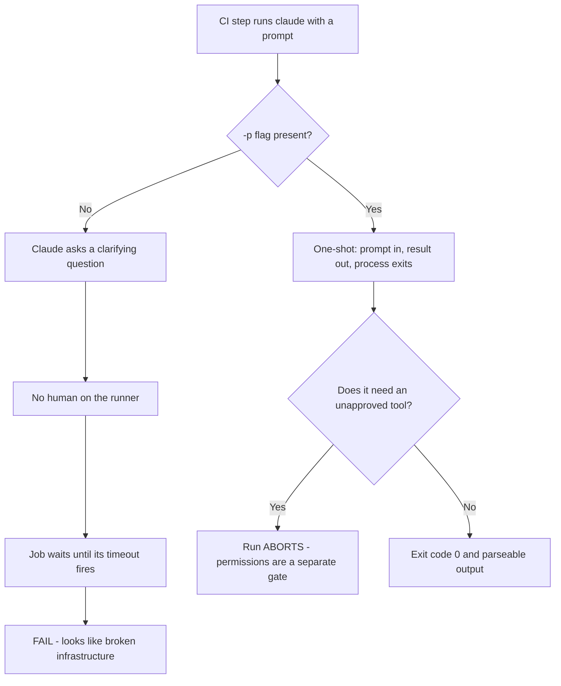
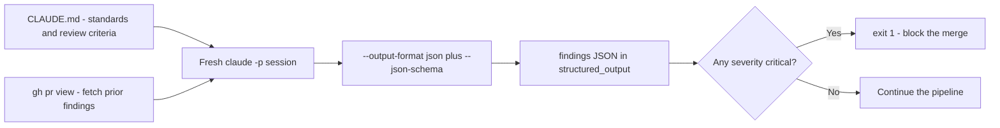
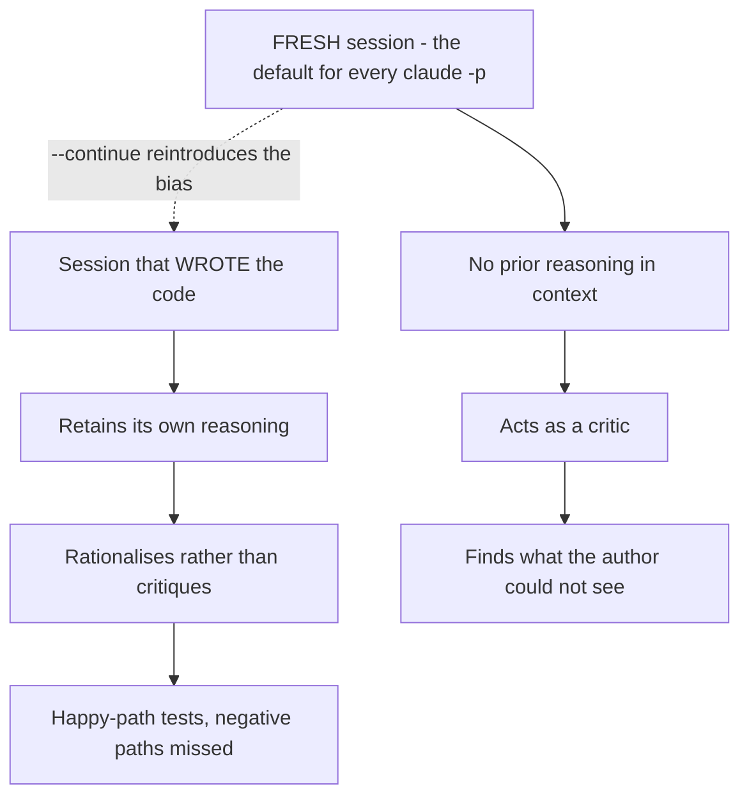

---
tags:
  - CCA-F
  - domain-3
  - ci-cd
  - structured-output
  - youtube-course
date: 2026-08-04
status: done
domain: "3 of 5"
source: "Peace Of Code — Claude Certified Architect Ep 13"
---

# ⚙️ EP13 — Claude Code CI/CD Pipelines

> [!NOTE] Exam Coverage
> Maps to **Domain 3 — Claude Code Configuration & Workflows**, task statement **3.6** (CI/CD pipeline integration), with the structured-output material touching **Domain 4** task statements **4.3** (JSON schemas) and **4.5** (batch processing), and session isolation touching **Domain 1** task statement **1.7** (session management). Covers the `-p` / `--print` flag and its fabricated distractors, `--output-format json` with `--json-schema`, session isolation for review, `CLAUDE.md` as pipeline context, review deduplication, and the production pipeline shape.

**Back to:** [[CCA-F Study Roadmap]] · **Domain note:** [[D3 - Claude Code Configuration & Workflows]] · **Deck:** [[EP13 - Flashcards]]
**Source:** [Peace Of Code — Ep 13 (31 min)](https://www.youtube.com/watch?v=GWCnDhgH840) · Level: college / professional-certification · Question mix calibrated MCQ-heavy (40 / 40 / 20)
**Previous:** [[EP12 - Plan Mode vs Execute]]

---

## 1. Outline

- [1. Outline](#1-outline)
- [2. Key Terms](#2-key-terms)
- [3. Concept Summaries](#3-concept-summaries)
  - [3.1 The Hang — Why Local Works and CI Doesn't](#31-the-hang--why-local-works-and-ci-doesnt)
  - [3.2 The -p Flag](#32-the--p-flag)
  - [3.3 Fabricated Flags](#33-fabricated-flags)
  - [3.4 Machine-Readable Output](#34-machine-readable-output)
  - [3.5 The --json-schema File-Path Trap](#35-the---json-schema-file-path-trap)
  - [3.6 What -p Does Not Solve](#36-what--p-does-not-solve)
  - [3.7 Session Isolation and the Psychology of Review](#37-session-isolation-and-the-psychology-of-review)
  - [3.8 CLAUDE.md as Institutional Memory](#38-claudemd-as-institutional-memory)
  - [3.9 The Deduplication Engine](#39-the-deduplication-engine)
  - [3.10 Standardizing Test Generation](#310-standardizing-test-generation)
  - [3.11 The Production Pipeline Architecture](#311-the-production-pipeline-architecture)
  - [3.12 When Not to Use the Batch API](#312-when-not-to-use-the-batch-api)
- [4. Diagrams](#4-diagrams)
- [5. Worked Examples](#5-worked-examples)
- [6. Practice Questions](#6-practice-questions)
- [7. Cheat Sheet](#7-cheat-sheet)

---

## 2. Key Terms

| Term | Definition | Source |
|---|---|---|
| **The hang** | A CI job that times out because Claude asked a clarifying question and *"there is no one to answer that question."* The integration isn't broken — a flag is missing. | [04:02] |
| **`-p` / `--print`** | Non-interactive mode. Claude takes the prompt, completes, prints, and exits. Short and long forms are identical. **The only** non-interactive flag. | [08:23] |
| **Fabricated flags** | `--headless`, `--ci`, `--batch`, `--non-interactive` — plausible-sounding distractors. **None exist.** | [08:57] · *(verified)* |
| **`--output-format`** | Controls the response shape: `text` (default), `json`, `stream-json`. | [13:40] · *(expansion)* |
| **`--json-schema`** | Enforces a JSON Schema on the output. **Takes an inline JSON string, not a file path.** | [13:59] · *(correction — §3.5)* |
| **`structured_output`** | The JSON response field holding the schema-conforming payload. The prose text lives in `result` — they are different fields. | *(expansion — §3.4)* |
| **`--bare`** | The documented **recommended mode for CI**. Skips auto-discovery of hooks, skills, plugins, MCP servers, auto memory, **and `CLAUDE.md`**. | *(correction — §3.8)* |
| **`--allowedTools`** | Pre-approves tools so they run without a permission prompt. Without it, a `-p` run **aborts** when it hits an unapproved tool. | *(expansion — §3.6)* |
| **`--max-turns`** | Caps agentic turns in print mode; exits with an error at the limit. The runaway-loop guard for CI. | *(expansion — §3.6)* |
| **Session isolation** | Running each pipeline stage as a **fresh** Claude session so a reviewer doesn't inherit the author's reasoning. *"Fresh eyes review better."* | [17:31] |
| **The psychology of review** | The host's framing: a developer rationalises their own code, so *"it will not critique the code"* — the same bias applies to a Claude session that wrote the code. | [16:22] |
| **Institutional memory anchor** | Using `CLAUDE.md` to carry standards, review criteria, security policy, and test conventions into every fresh CI session. | [19:09] |
| **Deduplication engine** | Fetching prior PR comments with `gh` and passing them into the fresh session so Claude *"will only review the new commits."* | [22:42] |
| **`gh pr view`** | The GitHub CLI call the pipeline uses to pull existing review comments into a file before invoking Claude. | [21:58] |
| **Exit-code gate** | Parsing the findings JSON with `jq` and calling `exit 1` on a critical severity to block the merge. | [28:12] |
| **Batch API** | Asynchronous processing, up to a **24-hour** window, **no latency SLA**. *"Never use for blocking workflows."* | [30:22] · *(verified)* |
| **`claude-code-action@v1`** | The official GitHub Action. Takes `prompt` and `claude_args` (raw CLI passthrough) rather than a hand-rolled `run:` step. | *(expansion — §3.11)* |

---

## 3. Concept Summaries

### 3.1 The Hang — Why Local Works and CI Doesn't

*Question: the same `claude` command reviews your tests perfectly on your laptop and times out in GitHub Actions. What changed?*

The audience changed. The host's diagnosis is exact and worth internalising because it generalises past this one flag: interacting with Claude is **conversational**, not one-shot. *"If the instruction is simple enough, then Claude will perform that instruction in one shot. But if it is complicated stuff… then Claude would probably ask you a follow-up question."*

Locally that's a feature — you're sitting there, so you answer. In CI *"there is no one to answer Claude's follow-up question."* Claude waits. The runner waits. Eventually the job's configured timeout fires, *"and all the further steps in the CI/CD pipeline will not work."*

The most useful thing he says about it is social rather than technical: *"the engineers blame the integration, but there is nothing wrong with the integration. It's just that you missed a particular flag."* The failure presents as an infrastructure problem — a timeout, a red X — and the cause is one character of configuration. That mismatch between symptom and cause is exactly what the exam builds scenarios on.

**In your own words:** Claude Code is conversational by default. CI has no human to answer, so the job waits out its timeout. The symptom looks like broken infrastructure; the cause is a missing flag.

*See PQ 1.*

---

### 3.2 The -p Flag

*Question: what turns a conversation into a one-shot command?*

`-p`, or its long form `--print`. *"The `-p` flag is for non-interactive mode for CI/CD."* Claude takes the prompt, does the work, prints the result, and exits — no turn waiting for you.

The host is right that the two forms are interchangeable: *"it works identically with the short form `-p` or the long form `--print`."* Verified — the docs describe it as *"print response without interactive mode."*

The shape in a workflow step is exactly what he shows:

```bash
claude -p "Review this PR for security issues"
```

One expansion worth having, because it's the natural CI pattern and the lecture doesn't reach it: **`-p` reads stdin**, so Claude composes like any other Unix filter. That is usually cleaner than shelling out to fetch the input inside the prompt — and it means Claude doesn't need Bash permission just to read the diff:

```bash
git diff main | claude -p "You are a typo linter. Report filename:line for each typo."
```

Exit status behaves normally too: **0 on success, non-zero on failure**, so a step can branch on it. **(expansion)**

**In your own words:** `-p` / `--print` makes the run one-shot: prompt in, result out, process exits. It reads stdin and sets a normal exit code, so it composes like any CLI tool.

*See PQ 2, 3.*

---

### 3.3 Fabricated Flags

*Question: the exam offers `--headless`, `--ci`, `--batch`, and `-p`. Which are real?*

Only `-p`. The host flags this as a deliberate trap and explains *why* it works: these are *"some of the very common kind of flags that we generally use for non-interactive… in curl commands or somewhere,"* so *"your head will go into that direction."* The distractors are drawn from your muscle memory of other tools, not from Claude Code.

His claim checks out exactly. Officially, **`--headless`, `--ci`, `--batch`, and `--non-interactive` do not exist** in the Claude Code CLI — an invalid flag is reported to stderr and the run never starts.

> [!IMPORTANT] Two names, one flag — and one more distractor the lecture misses
> `-p` and `--print` are the **only** non-interactive forms. The lecture names `--headless`, `--ci`, and `--batch`; the vault's [[D3 - Claude Code Configuration & Workflows]] § 3.6 flags a fourth that is arguably the most tempting of all — **`--non-interactive`**, which reads like the obvious name for the feature and does not exist either. Add it to your mental distractor list.
> Source: https://code.claude.com/docs/en/cli-reference

Note the word *headless* is not itself wrong — the official documentation page for this feature is titled around running Claude Code programmatically and the CLI's own docs use "headless" in prose. What doesn't exist is a **flag** by that name. An option reading "enable headless mode with `--headless`" is wrong on the flag, not on the vocabulary.

**In your own words:** `-p` / `--print` only. `--headless`, `--ci`, `--batch`, `--non-interactive` are all fabricated — they borrow credibility from other CLIs.

*See PQ 4.*

---

### 3.4 Machine-Readable Output

*Question: Claude finishes its step. The next step needs to act on the result. What breaks?*

Format. *"Default prose is great for humans. It is useless for pipelines or machines."*

The host's framing of the asymmetry is the right one: input is forgiving, output is not. You can hand Claude a raw log — *"you would pass it as a normal message because Claude is an LLM and it will understand."* But what comes back is prose *"unless you specify to respond in a specific format."* A downstream step trying to branch on `I found a bug on line 42 regarding the user authentication check` has nothing to parse.

Two flags fix it, and his advice to combine them is correct: *"combine `--output-format json` with `--json-schema` to strictly enforce output shape."* `--output-format` accepts `text` (the default), `json`, and `stream-json`; `--json-schema` constrains the payload to a schema.

> [!IMPORTANT] `result` and `structured_output` are different fields — expansion
> With `--output-format json` you get an envelope carrying session metadata (`session_id`, usage, `total_cost_usd`) plus the model's prose in **`result`**. Add `--json-schema` and the schema-conforming payload arrives in a **separate `structured_output`** field — it does not replace `result`.
> So a pipeline that does `jq -r '.result'` on a schema-constrained run gets the prose, not the structured findings. Parse **`.structured_output`**.
> Source: https://code.claude.com/docs/en/headless#get-structured-output

The severity/line/message/file shape he demonstrates is a good schema instinct — it gives the gate step something to test (`severity == "critical"`) rather than something to grep.

**In your own words:** Input can be prose; output can't. `--output-format json` gets an envelope, `--json-schema` constrains the payload — and the payload lands in `structured_output`, not `result`.

*See PQ 5, 6, 13.*

---

### 3.5 The --json-schema File-Path Trap

*Question: you keep your review schema in `review-schema.json`. How do you pass it?*

Not the way the demo does.

> [!WARNING] `--json-schema` takes inline JSON, not a file path — verified against official docs
> The lecture passes a filename: *"for that also you can give a particular file… `review-schema.json` for example."* Officially, `--json-schema` **takes an inline JSON string, not a file path**. `--json-schema review-schema.json` does not load the file — the literal string `review-schema.json` is not a valid JSON Schema, so from Claude Code v2.1.205 the command **exits with an error** (`Error: --json-schema is not a valid JSON Schema`). Before v2.1.205 it silently produced unstructured output, which is the nastier failure: a green pipeline emitting prose your gate step can't parse.
> **Exam answer: inline JSON string.** Real code: read the file yourself and interpolate it — `--json-schema "$(cat review-schema.json)"`.
> Source: https://code.claude.com/docs/en/cli-reference · consistent with [[D3 - Claude Code Configuration & Workflows]] § 3.6, which flags this as an exam trap — **the vault note is right and the video is not**

Two details that make this a better exam answer than "it's inline":

- **A `format` keyword is accepted but not enforced.** `"format": "email"` passes validation and is treated as an annotation only — Claude Code will not reject a non-email string on that basis. (Before v2.1.205 a schema containing `format` was rejected outright.)
- **The failure mode moved.** An invalid schema used to degrade silently; it now errors. Which behaviour you get depends on the CLI version, so "it will error" is only safe to assert for current versions.

**In your own words:** Inline JSON string, always. A bare filename isn't a schema — modern versions error, older ones silently drop to prose. Use `"$(cat schema.json)"`.

*See PQ 7, 14.*

---

### 3.6 What -p Does Not Solve

*Question: you added `-p` and the job still fails. What else is gating it?*

The lecture stops at `-p`, and this is the most consequential gap in the episode — a learner who follows it exactly will hit a second class of failure it never mentions.

`-p` removes the **conversational** pause. It does not remove the **permission** pause. Claude Code still asks before running most Bash commands or editing files, and in non-interactive mode there is nobody to approve — so the run **aborts** rather than completing. You have to grant permissions explicitly.

> [!IMPORTANT] `-p` prevents the hang, not the permission gate — expansion
> Three levers, in increasing order of scope:
> - **`--allowedTools`** pre-approves specific tools, using permission-rule syntax: `--allowedTools "Bash(git diff *),Read"`. Note the space before `*` — `Bash(git diff*)` would also match `git diff-index`.
> - **`--permission-mode dontAsk`** is the documented choice for *"locked-down CI runs"*: everything not covered by an allow rule or the read-only command set is auto-denied, so the session never waits.
> - **`--permission-mode acceptEdits`** lets Claude write files without prompting, but other shell commands still need an allow rule.
>
> A fourth flag matters just as much for CI: **`--max-turns`** caps agentic turns and exits with an error at the limit. Without it a confused agent can loop until the job's wall-clock timeout — the same red X as the original hang, from a different cause.
> Source: https://code.claude.com/docs/en/headless#auto-approve-tools · https://code.claude.com/docs/en/cli-reference

There is a neat interaction with §3.2's stdin pattern here. Piping the diff in (`git diff main | claude -p ...`) means Claude never needs Bash permission to *obtain* the diff — the permission surface shrinks because the data arrives as input rather than being fetched. Passing data in is both simpler and safer than granting tools to go get it.

**In your own words:** `-p` fixes the conversational wait. Tool permissions are a separate gate — grant them with `--allowedTools` or `--permission-mode dontAsk` — and `--max-turns` stops a runaway loop from timing the job out anyway.

*See PQ 8, 15.*

---

### 3.7 Session Isolation and the Psychology of Review

*Question: Claude wrote the module. Should Claude write its tests in the same session?*

No, and the host's analogy for why is the strongest teaching in the episode. Teams separate developers from testers not because developers *can't* test, but because *"whatever a developer develops… psychologically that person has it in mind that whatever I have developed is correct."* They test along the path they built. A tester arrives *"with a very fresh perspective"* and thinks of scenarios the author's mental model excludes.

A Claude session carries the same bias for a mechanical reason: it still has its own reasoning in context. *"Claude would be able to retain the reasoning used to write the code. It will rationalize the reason based on which it has written the code. And it will not critique the code."* His prediction of the failure shape is specific and correct — *"it might write all the happy path scenarios. It might ignore the negative path scenarios."* The code and the tests share an author, so they share a blind spot.

The fix is to break the context link: summarise what was built (he suggests the `Explore` subagent from [[EP12 - Plan Mode vs Execute]] § 3.8), exit, start fresh, and paste the summary in. *"In this fresh session, Claude will act like a critic… it doesn't have that context so it will kind of think like a tester."*

For pipelines this becomes a structural rule: build in one job, review in another, test in a third — *"that should be a new Claude session."*

> [!IMPORTANT] Isolation is the default — you have to opt out of it
> A fresh session per stage is what you get automatically: **every `claude -p` invocation starts a new session** unless you explicitly pass `--continue` (most recent conversation in this directory) or `--resume <session-id>`. So the lecture's advice describes the default rather than a configuration you must add.
> That inverts the practical warning: the risk in CI isn't failing to isolate, it's **accidentally chaining** by reaching for `--continue` to "give Claude context" — which reintroduces exactly the author bias §3.7 is about. When a later stage needs context, pass a **summary or artifact**, not the session. Capture the ID with `--output-format json | jq -r '.session_id'` only when continuity is genuinely wanted.
> Source: https://code.claude.com/docs/en/headless#continue-conversations

**In your own words:** A session that wrote the code rationalises it and tests the happy path. Fresh sessions review better — and fresh is the default, so the mistake to avoid is chaining with `--continue`.

*See PQ 9, 10.*

---

### 3.8 CLAUDE.md as Institutional Memory

*Question: if every CI stage is a fresh session with no memory, how does any stage know your standards?*

`CLAUDE.md`. The host calls it the institutional memory anchor, and the logic is clean: *"whenever you start a new session for each step in your CI/CD pipeline, this `CLAUDE.md` will be loaded. So at least even if you're not getting a summary out of the previous step, the new session… will get some context."*

What belongs in it for pipeline purposes: *"centralized code standards or review criteria, security policies, testing requirements."* This is the counterweight to §3.7 — isolation removes *episodic* memory (what happened last stage) but `CLAUDE.md` preserves *standing* memory (how we do things here). You want the first gone and the second kept.

The base claim is correct: a plain `claude -p` run loads the same context an interactive session would, `CLAUDE.md` included. But there is a large asterisk in exactly the setting this episode is about.

> [!IMPORTANT] `--bare` is the recommended CI mode — and it skips `CLAUDE.md` — verified against official docs
> Officially, `--bare` *"reduces startup time by skipping auto-discovery of hooks, skills, plugins, MCP servers, auto memory, and `CLAUDE.md`"*, and it is described as *"the recommended mode for scripted and SDK calls"* that **"will become the default for `-p` in a future release."** Its purpose is reproducibility: *"a hook in a teammate's `~/.claude` or an MCP server in the project's `.mcp.json` won't run."*
> So the lecture's strategy is correct for a plain `claude -p` today, and **silently stops working under the mode the docs recommend for CI** — and eventually under the default. Two further consequences: bare mode never reads OAuth credentials or the keychain, so it needs `ANTHROPIC_API_KEY`; and in bare mode Claude has only Bash, file read, and file edit.
> **The fix:** load your standards explicitly instead of relying on discovery — `--append-system-prompt-file ./ci-standards.md`, or `--settings` for configuration.
> **Exam answer: `CLAUDE.md` is the mechanism for carrying standards into fresh CI sessions** — that is what the syllabus tests. Real code: pair it with `--append-system-prompt-file` so the pipeline survives `--bare`.
> Source: https://code.claude.com/docs/en/headless#start-faster-with-bare-mode

**In your own words:** Isolation kills episodic memory; `CLAUDE.md` preserves standing memory. But `--bare` — the recommended CI mode, and the future default — skips it, so load standards explicitly.

*See PQ 11, 16.*

---

### 3.9 The Deduplication Engine

*Question: Claude reviewed the PR. You push two more commits. What does the next run do?*

Everything again. *"Claude doesn't remember in the new session what review I had given for that PR… Claude will re-review the entire PR and probably give the same comments that it has already given."*

This is the direct cost of §3.7's isolation, and it's worth seeing them as a matched pair rather than two tips: isolation is what makes the review *good*, and duplication is what isolation *costs*. You don't solve it by giving up isolation — you solve it by feeding the fresh session the right artifact.

The mechanism is a step before the Claude step. Use the GitHub CLI to pull the comments Claude already left, write them to a file, and pass that file's contents in as prior findings:

```bash
gh pr view "$PR" --json comments > prior-findings.txt
PRIOR="$(cat prior-findings.txt)"
claude -p "Review this PR. Existing findings already reported: $PRIOR. Report only new issues."
```

*"Now with the fresh session, it doesn't have to re-review the PR… It will only review the new commits or pushes that is happening."* The session is still clean of prior *reasoning* — it just knows which conclusions were already published. That distinction is the whole trick: you replay the **output**, never the **reasoning**.

The host flags this as near-certain exam content, and the phrasing he predicts is the tell: *"how would you make sure that Claude doesn't do the double work?"* Look for the option that fetches prior comments and passes them into a fresh session — not one that reuses the session.

**In your own words:** Isolation costs you memory of what was already reported. Fetch prior comments with `gh` and pass them in as context — replay the conclusions, not the reasoning.

*See PQ 12, 17.*

---

### 3.10 Standardizing Test Generation

*Question: "Generate tests for this class." What do you get?*

Whatever Claude thinks good tests look like. *"It has its own brain. It is the LLM, so it will think of its own way of doing things."* Generic tests — plausible, and wrong for your project.

The host's complaint about how people actually work is fair: *"nowadays we just open up a Claude session and just say 'Generate tests.' That's it. We are not even writing more lines as well… which is very vague because your project might be following different project standards."*

Documented in `CLAUDE.md`, the same request produces conforming output — *"it will enforce the exact structure, accurate mock patterns, and strict naming conventions."* His four categories are the right checklist: **naming patterns, structure, mocking rules, coverage targets.** Write them once and *"every automated test generation inherits these rules automatically."*

Notice this is §3.8's mechanism applied to a specific job, which is why it isn't a separate idea: the reason `CLAUDE.md` beats putting conventions in the prompt is that the pipeline has many prompts and one config. Standards written into a prompt drift per step; standards in `CLAUDE.md` apply to every step that loads it — subject to the same `--bare` caveat.

**In your own words:** Undocumented conventions get invented per run. Write naming, structure, mocking, and coverage into `CLAUDE.md` once and every generation step inherits them.

*See PQ 18.*

---

### 3.11 The Production Pipeline Architecture

*Question: assemble the whole thing. What are the stages?*

The host's architecture is sound and worth memorising as a sequence:

1. **`CLAUDE.md`** supplies project context and standards (§3.8)
2. **Fetch prior findings** with `gh` to prevent duplicate review (§3.9)
3. **Fresh session** so the review is genuinely critical (§3.7)
4. **`-p`** so the job doesn't hang (§3.2)
5. **`--output-format json` + `--json-schema`** so the result is parseable (§3.4)
6. **Act on the result** — parse with `jq`, `exit 1` on critical severity to block the merge (§3.11)

The gate step is the payoff and shows why the schema mattered: *"because we converted whatever Claude has found out into a proper schema, now this step can easily read it by using `jq`… if the severity is critical, then exit."* A non-zero exit fails the step and stops the workflow; if nothing is critical, *"this will not exit out the GitHub action and the other jobs will go on."*

> [!TIP] The official GitHub Action exists — expansion
> The lecture hand-rolls `claude -p` inside a `run:` step, which is valid and gives full control. Anthropic also ships **`anthropics/claude-code-action@v1`**, which takes a `prompt` input and passes CLI arguments straight through via `claude_args`:
> ```yaml
> - uses: anthropics/claude-code-action@v1
>   with:
>     anthropic_api_key: ${{ secrets.ANTHROPIC_API_KEY }}
>     prompt: "Review this PR for security issues"
>     claude_args: "--max-turns 5 --model claude-sonnet-5"
> ```
> It handles the GitHub App auth and `@claude` mention triggering; `claude_args` means everything in this episode still applies. Set up with `/install-github-app`. `--max-turns` defaults to 10 there.
> Source: https://code.claude.com/docs/en/github-actions

One security point the lecture doesn't make and the docs do: **never hardcode the API key** — use `${{ secrets.ANTHROPIC_API_KEY }}` and grant the workflow only the permissions it needs. **(expansion)**

**In your own words:** Context → dedup → fresh session → `-p` → schema → gate. The schema is what makes the last step a `jq` test instead of a grep.

*See PQ 19.*

---

### 3.12 When Not to Use the Batch API

*Question: your pre-merge check reviews 200 files. Batch API — cheaper, right?*

Cheaper and useless here. The host's exam drill is correct: the inappropriate CI use case for the Message Batches API is **blocking pre-merge checks**, because *"batches API has a 24-hour window with no latency SLA. Never use for blocking workflows."*

Verified: most batches complete within an hour, but the guaranteed window is **24 hours**, with a 50% cost reduction as the trade. Nothing in that contract promises your PR gate returns before the reviewer goes home.

The rule generalises cleanly, and [[D4 - Prompt Engineering & Structured Output]] § 4.5 states it the same way: **batch for latency-tolerant work** — overnight reports, weekly audits, nightly test generation — and **synchronous for anything a human or a pipeline is waiting on**. The discriminator in an exam stem is whether something *blocks*. "Nightly" and "weekly" mean batch; "pre-merge", "gate", and "on push" mean synchronous.

**In your own words:** Batch trades latency for 50% cost, guaranteed only within 24 hours. Anything blocking a merge must be synchronous.

*See PQ 20.*

---

## 4. Diagrams


*Two distinct CI failures. `-p` removes the conversational wait; only `--allowedTools` or `--permission-mode dontAsk` removes the permission wait.*


*The production shape. Every arrow into the session is context passed in, never a session resumed.*


*Why fresh eyes review better — and why `--continue` is the thing to avoid in a review stage.*

---

## 5. Worked Examples

### Example 1 — Repairing the demo's review command

**Task:** The pipeline step below is the lecture's, cleaned up. It runs green in older CLI versions but the merge gate never fires. Find and fix every defect.

```bash
claude -p "Review the PR. Prior findings: $PRIOR" \
  --output-format json \
  --json-schema review-schema.json > findings.json
jq -e '.result[] | select(.severity=="critical")' findings.json && exit 1
```

1. **`--json-schema review-schema.json` is the primary defect.** *(why: §3.5 — the flag takes an inline JSON string. The literal filename isn't a schema, so current versions error out and pre-v2.1.205 versions silently returned prose — which is why the gate "never fires" rather than crashing.)* Read the file yourself: `--json-schema "$(cat review-schema.json)"`.
2. **`.result` is the wrong field.** *(why: §3.4 — `result` holds the prose; the schema-conforming payload is in `structured_output`. Even with defect 1 fixed, this `jq` filter finds nothing.)* Use `.structured_output.findings[]`, matching your schema's shape.
3. **No tool permissions are granted.** *(why: §3.6 — `-p` stops the conversational hang, not the permission gate; a review that wants to read files aborts. Passing the diff via stdin would avoid the need entirely.)* Add `--allowedTools "Read,Bash(git diff *)"` or `--permission-mode dontAsk`.
4. **No turn cap.** *(why: §3.6 — without `--max-turns` a confused agent can loop to the job's wall-clock timeout, producing the same red X as the original bug.)*
5. **`&& exit 1` inverts on the empty case.** *(why: `jq -e` exits non-zero when the filter selects nothing, so `&&` runs `exit 1` only when a critical finding *is* present — correct here, but it also means a `jq` **parse error** exits 0 and lets a merge through. Test explicitly.)*

**Answer:**

```bash
claude -p "Review the PR. Prior findings: $PRIOR" \
  --output-format json \
  --json-schema "$(cat review-schema.json)" \
  --allowedTools "Read,Bash(git diff *)" \
  --max-turns 10 > findings.json

if jq -e '.structured_output.findings[] | select(.severity=="critical")' findings.json > /dev/null; then
  echo "Critical findings — blocking merge."
  exit 1
fi
```

The instructive part is that the original's worst behaviour was **passing**: on an older CLI, defects 1 and 2 combine into a gate that silently approves every PR. A merge gate that cannot fail is worse than no gate.

---

### Example 2 — Can a batch job serve the nightly audit?

**Task:** A compliance audit must be filed by 09:00 daily. The pipeline can submit no earlier than 22:00 the night before. Batch is 50% cheaper. Does it fit, and does the same reasoning hold for a pre-merge gate that must answer in 10 minutes?

1. **Compute the window available to the audit.** *(why: the batch contract is a guaranteed ceiling, so the only question is whether the ceiling fits inside the deadline.)*
   $$W_{\text{audit}} = 09{:}00 - 22{:}00_{\text{(prev day)}} = 11 \text{ hours}$$
2. **Compare against the guaranteed batch window.** *(why: §3.12 — most batches finish within an hour, but "most" is not a commitment; size against the 24-hour ceiling.)*
   $$W_{\text{audit}} = 11 \text{ h} < 24 \text{ h} \Rightarrow \text{does not fit the guarantee}$$
3. **Find the latest submission time that would fit.** *(why: turns "no" into an actionable constraint — this is the arithmetic D4 § 4.5 uses for SLA planning.)*
   $$T_{\text{submit}} \le 09{:}00 - 24\text{ h} = 09{:}00 \text{ the previous day}$$
4. **Now the pre-merge gate.** *(why: shows the rule isn't about the size of the margin but about whether anything is blocked.)*
   $$W_{\text{gate}} = 10 \text{ min} = 0.167 \text{ h} \lll 24 \text{ h}$$

**Answer:** Neither fits the guarantee, but for different reasons. The audit is **borderline**: 11 hours is comfortably above the typical completion time, so it will usually work and occasionally miss — submit by 09:00 the previous day to be contractually safe, or accept the risk knowingly. The gate is **categorically wrong**: it blocks a human, so no cost saving justifies an unbounded wait. That is the exam's discriminator — not the size of the window but whether something is **waiting on the answer**. "Nightly" and "weekly" suggest batch; "pre-merge", "gate", and "on push" rule it out.

---

### Example 3 — Structuring a three-stage pipeline

**Task:** Build → review → test-generation, all with Claude. Decide the session and context strategy for each stage.

1. **Stage 1 — build. Own `claude -p` invocation.** *(why: §3.7 — every `-p` run is a fresh session by default, so you get isolation for free; no flag needed.)*
2. **Emit a summary artifact, not a session ID.** *(why: §3.9 — later stages need the *conclusions*, not the reasoning. A summary file crosses the boundary; a resumed session drags the bias across with it.)*
3. **Stage 2 — review. Fresh session, prior findings passed in.** *(why: §3.7 gives the critical perspective, §3.9 stops it re-reporting what's already on the PR. Do **not** reach for `--continue` here — it would undo stage 1's isolation, which is the specific trap the default protects you from.)*
4. **Standards come from `CLAUDE.md`, plus `--append-system-prompt-file` if the runner uses `--bare`.** *(why: §3.8 — bare mode is the recommended CI mode and skips `CLAUDE.md` entirely, so relying on discovery alone is fragile.)*
5. **Stage 3 — test generation. Fresh again, conventions from config.** *(why: §3.10 — naming, structure, mocking, and coverage must come from `CLAUDE.md` rather than the prompt, so every stage inherits one source of truth.)*
6. **Gate on stage 2's structured output between 2 and 3.** *(why: §3.11 — parse `.structured_output` with `jq` and `exit 1` on critical, so the pipeline stops before spending tokens generating tests for code that won't merge.)*

**Answer:** Three independent `claude -p` invocations, no `--continue` anywhere. Context crosses stage boundaries as **artifacts** — a summary file, a prior-findings file, `CLAUDE.md` — never as session state. The rule of thumb: pass **what was concluded**, never **how it was concluded**. Ordering the gate before stage 3 is the cost optimisation — a blocked PR shouldn't pay for test generation.

---

## 6. Practice Questions

**1.** A `claude` command reviews tests correctly on a developer's laptop and times out in GitHub Actions. What is the cause? *(§3.1 / The hang)*

<details><summary>Answer</summary>

Claude Code is conversational by default. On a complex task it asks a clarifying question; in CI nobody answers, so the job sits until its timeout fires. The integration isn't broken — the `-p` flag is missing.
</details>

**2.** Which flag enables non-interactive mode, and is there a difference between its forms? *(§3.2 / `-p`)*

<details><summary>Answer</summary>

`-p` or `--print` — identical in behaviour. Claude takes the prompt, completes, prints, and exits without waiting for input.
</details>

**3.** Give two properties of `claude -p` that let it compose like a normal CLI tool. *(§3.2)*

<details><summary>Answer</summary>

It **reads stdin**, so you can pipe data in (`git diff main | claude -p "..."`), and it sets a **normal exit code** — 0 on success, non-zero on failure — so a script can branch on the status.
</details>

**4.** An exam option offers `--headless`, `--ci`, `--batch`, and `-p`. Which exist? *(§3.3 / Fabricated flags)*

<details><summary>Answer</summary>

**Only `-p`** (and its long form `--print`). `--headless`, `--ci`, and `--batch` do not exist — nor does `--non-interactive`, the fourth and most tempting distractor. They borrow credibility from other CLIs.
</details>

**5.** Why is prose output acceptable as pipeline *input* but not as pipeline *output*? *(§3.4)*

<details><summary>Answer</summary>

Claude is an LLM, so it parses a raw log fine on the way in. The next CI step is a script and can't branch on a sentence. The asymmetry is the point: input is forgiving, output must be structured.
</details>

**6.** Name the two flags that produce schema-conforming output, and what each contributes. *(§3.4)*

<details><summary>Answer</summary>

`--output-format json` returns a JSON envelope with the result and session metadata; `--json-schema` constrains the payload to a specific JSON Schema. Used together they give strictly-shaped, parseable output.
</details>

**7.** Your schema lives in `review-schema.json`. Is `--json-schema review-schema.json` correct? *(§3.5 / `--json-schema`)*

<details><summary>Answer</summary>

**No** — the flag takes an **inline JSON string**, not a file path. Current versions error with `--json-schema is not a valid JSON Schema`; before v2.1.205 they silently returned unstructured prose. Use `--json-schema "$(cat review-schema.json)"`.
</details>

**8.** You added `-p` and the job still fails — this time it aborts rather than hanging. Why? *(§3.6)*

<details><summary>Answer</summary>

`-p` removes the conversational wait, not the **permission** gate. Claude still needs approval for most Bash commands and file edits, and with nobody to approve, the run aborts. Grant access with `--allowedTools` or `--permission-mode dontAsk`.
</details>

**9.** Claude wrote a module. Why shouldn't the same session write its tests? *(§3.7 / Psychology of review)*

<details><summary>Answer</summary>

It still holds the reasoning it used to write the code, so it rationalises rather than critiques — typically producing happy-path tests and missing negative paths. Code and tests would share an author and therefore a blind spot.
</details>

**10.** Do you need a flag to get a fresh session for each CI stage? *(§3.7 / Session isolation)*

<details><summary>Answer</summary>

**No** — every `claude -p` invocation starts a new session by default. The risk runs the other way: reaching for `--continue` or `--resume` to "give Claude context" reintroduces the author bias. Pass a summary artifact instead.
</details>

**11.** If every CI stage is a fresh session, how do standards reach them? *(§3.8 / Institutional memory anchor)*

<details><summary>Answer</summary>

`CLAUDE.md` loads into each new session, carrying code standards, review criteria, security policies, and testing requirements. Isolation removes *episodic* memory of the last stage while `CLAUDE.md` preserves *standing* memory of how the project works.
</details>

**12.** Claude reviewed a PR; you push two more commits and the next run repeats every comment. What's the fix? *(§3.9 / Deduplication engine)*

<details><summary>Answer</summary>

Add a step before the Claude step that fetches existing PR comments (`gh pr view --json comments`) into a file, then pass those prior findings into the fresh session so it reports only new issues. Replay the **conclusions**, never the reasoning.
</details>

**13.** You run with `--json-schema` and parse `.result` with `jq`, but get prose. Why? *(§3.4 / `structured_output`)*

<details><summary>Answer</summary>

`result` holds the model's prose; the schema-conforming payload is in a separate **`structured_output`** field. Parse `.structured_output`.
</details>

**14.** What made the pre-v2.1.205 `--json-schema` failure mode more dangerous than an error? *(§3.5)*

<details><summary>Answer</summary>

It failed **silently** — an invalid schema produced unstructured output with no error, so the job went green while the gate step had nothing parseable to test. A merge gate that can't fail is worse than no gate.
</details>

**15.** Your CI agent occasionally loops until the job's wall-clock timeout. Which flag bounds it, and why isn't `-p` enough? *(§3.6 / `--max-turns`)*

<details><summary>Answer</summary>

`--max-turns` caps agentic turns and exits with an error at the limit. `-p` only removes the wait for human input — it places no bound on how many turns Claude takes on its own.
</details>

**16.** A CI runner uses `--bare` for reproducibility. What silently stops working, and what's the fix? *(§3.8 / `--bare`)*

<details><summary>Answer</summary>

`--bare` skips auto-discovery of hooks, skills, plugins, MCP servers, auto memory, **and `CLAUDE.md`** — so standards stop reaching the session. Load them explicitly with `--append-system-prompt-file`. Bare mode also doesn't read OAuth credentials, so set `ANTHROPIC_API_KEY`.
</details>

**17.** Isolation and deduplication seem to pull in opposite directions. Reconcile them. *(§3.7 / §3.9)*

<details><summary>Answer</summary>

Isolation is what makes review critical; duplication is what isolation costs. You don't resolve it by reusing the session — you pass the prior **findings** into a fresh one. The session stays clean of prior reasoning while knowing which conclusions were already published.
</details>

**18.** "Generate tests for this class" gives generic tests. What fixes it, and which four things must be documented? *(§3.10)*

<details><summary>Answer</summary>

Document conventions in `CLAUDE.md`: **naming patterns, structure, mocking rules, and coverage targets.** Every automated generation step then inherits them, instead of Claude inventing conventions per run.
</details>

**19.** List the six stages of the production pipeline architecture in order. *(§3.11)*

<details><summary>Answer</summary>

`CLAUDE.md` for context → fetch prior findings → fresh session → `-p` for non-interactive execution → `--output-format json` with `--json-schema` → act on the result (`jq`, `exit 1` on critical to block the merge).
</details>

**20.** Which CI use case is inappropriate for the Message Batches API, and what's the general rule? *(§3.12 / Batch API)*

<details><summary>Answer</summary>

**Blocking pre-merge checks** — batch guarantees only a 24-hour window with no latency SLA. Rule: batch for latency-tolerant work (nightly, weekly, overnight); synchronous for anything a human or pipeline is waiting on.
</details>

---

## 7. Cheat Sheet

| Cue | Note |
|---|---|
| The hang | Claude asks a question; nobody answers; job times out |
| `-p` / `--print` | **The only** non-interactive flag. Reads stdin, exits 0 on success |
| Fabricated flags | `--headless` · `--ci` · `--batch` · `--non-interactive` — **none exist** |
| `--output-format` | `text` (default) · `json` · `stream-json` |
| `--json-schema` | **Inline JSON, never a file path.** Use `"$(cat schema.json)"` |
| Output fields | Prose in `result`; schema payload in **`structured_output`** |
| Permissions | `-p` grants no tools. `--allowedTools`, or `--permission-mode dontAsk` |
| `--max-turns` | Caps agentic turns — the runaway-loop guard |
| Session isolation | **Default.** Every `claude -p` is new; `--continue` opts out |
| Psychology of review | An authoring session rationalises — misses negative paths |
| `CLAUDE.md` in CI | Carries standards into fresh sessions — **but `--bare` skips it** |
| `--bare` | Recommended CI mode, future `-p` default. Needs `ANTHROPIC_API_KEY` |
| Deduplication | `gh pr view` → prior findings → fresh session → new issues only |
| Test standards | Naming, structure, mocking, coverage — in `CLAUDE.md` |
| Merge gate | `jq` the findings; `exit 1` on critical |
| Batch API | 24-hour window, no latency SLA. **Never for blocking workflows** |

**Top 5 terms:** `-p` / `--print` · `--json-schema` (inline) · session isolation · deduplication · `--bare`

> [!WARNING] Exam traps
> ❌ `--headless`, `--ci`, `--batch`, `--non-interactive` — all fabricated.
> ❌ `--json-schema schema.json` — inline only; a filename errors or drops to prose.
> ❌ Parsing `.result` for schema output — it's in `.structured_output`.
> ❌ Assuming `-p` grants tool permissions. It doesn't; the run aborts.
> ❌ `--continue` to give a review stage context — restores the author bias.
> ❌ Batch API for a pre-merge gate — 24-hour window, no SLA.
> ✅ "Doesn't do double work" → prior PR comments into a fresh session.

> [!TIP] Transcription artifacts
> **"Cloud" / "claw" / "clot" = Claude**, and **"Cloud MD" / "claw. md" = `CLAUDE.md`** — pervasive. **`{hyphen}` = `-`** · **"CSCD" / "CICD" = CI/CD** · **"hyphen P tag" = the `-p` flag** · **"mug it up"** [23:23] means rote memorisation. The garbled *"HTML like artifact"* at [10:45] carries nothing.

> **Synthesis:** CI fails Claude in two places and `-p` fixes one. It removes the **conversational** wait; **permissions** are a separate gate (`--allowedTools` / `dontAsk`) and **turns** a third (`--max-turns`). Past that, every design choice follows from one fact: each `claude -p` is a fresh session. That default is the feature — fresh eyes review better — and its cost is amnesia, paid for by passing **artifacts** across stage boundaries: `CLAUDE.md` for standards, prior PR comments for what's reported, a summary for what was built. Never a resumed session. Make the output a schema so the gate is a `jq` test, and keep anything blocking a merge on the synchronous API.

---

## ✅ Practice Checklist

- [ ] Can explain why the same command works locally and hangs in CI
- [ ] Know `-p` / `--print` is the only non-interactive flag, and both forms are identical
- [ ] Can name all four fabricated distractors, including `--non-interactive`
- [ ] Know the three `--output-format` values
- [ ] Know `--json-schema` takes inline JSON and how to pass a file's contents
- [ ] Know schema output lands in `structured_output`, not `result`
- [ ] Can state that `-p` does not grant tool permissions, and name two ways to grant them
- [ ] Know `--max-turns` bounds runaway agentic loops
- [ ] Know fresh sessions are the default and `--continue` is the thing to avoid in review stages
- [ ] Can explain the psychology-of-review bias and the failure shape it produces
- [ ] Know what `CLAUDE.md` carries into CI sessions — and that `--bare` skips it
- [ ] Can describe the deduplication flow and why it doesn't undo isolation
- [ ] Can name the four test conventions to document in `CLAUDE.md`
- [ ] Can list the six production pipeline stages in order
- [ ] Can state the batch-API window and the blocking-workflow rule

---

*Next: [[EP14 - Prompt Engineering - Explicit Criteria & False Positives]]*
