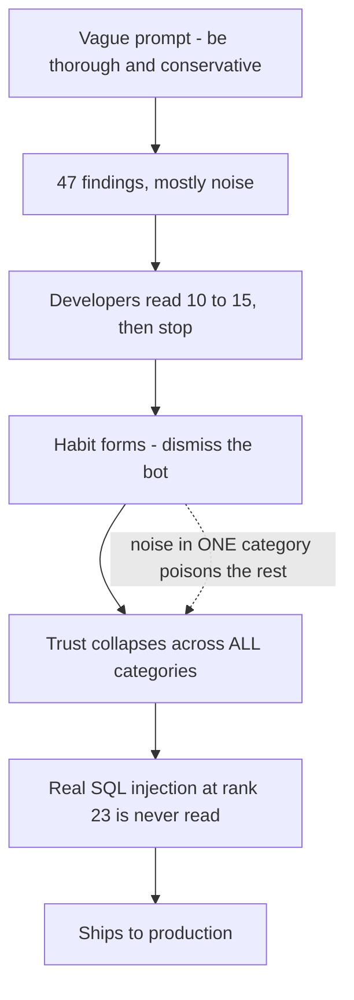
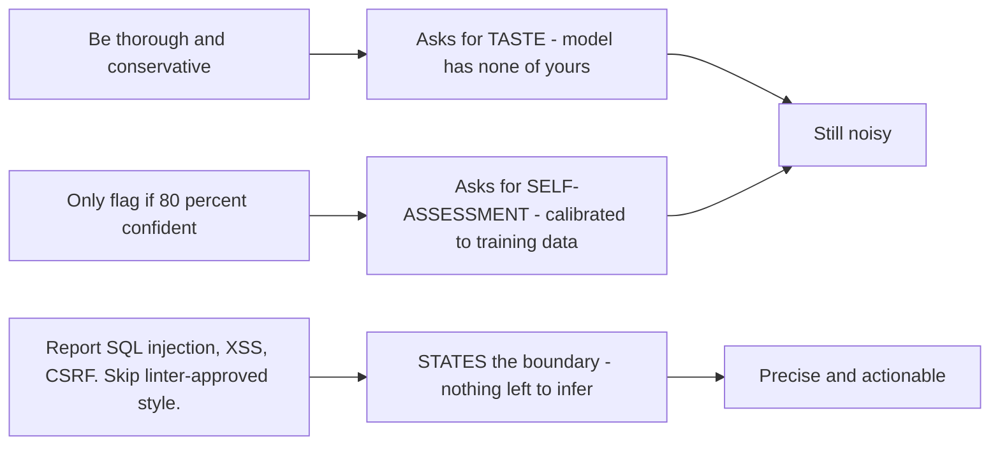
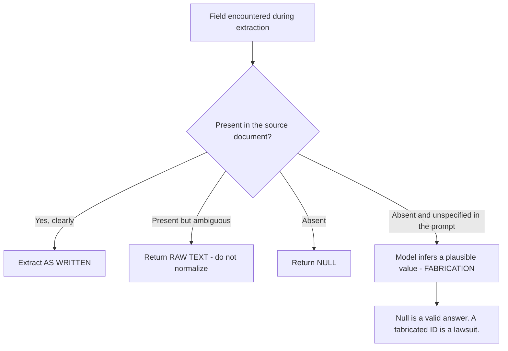

---
tags:
  - CCA-F
  - domain-4
  - prompt-engineering
  - false-positives
  - youtube-course
date: 2026-08-04
status: done
domain: "4 of 5"
source: "Peace Of Code — Claude Certified Architect Ep 14"
---

# 🎯 EP14 — Prompt Engineering: Explicit Criteria & False Positives

> [!NOTE] Exam Coverage
> Maps to **Domain 4 — Prompt Engineering & Structured Output**, task statement **4.1** (designing prompts with explicit criteria to reduce false positives), previewing **4.2** (few-shot prompting) and touching **4.3** (structured output) via the extraction scenario. Covers why vague adjectives and confidence thresholds fail, categorical criteria as the actual fix, explicit severity levels, disabling noisy categories, and fabrication in structured extraction.

**Back to:** [[CCA-F Study Roadmap]] · **Domain note:** [[D4 - Prompt Engineering & Structured Output]] · **Deck:** [[EP14 - Flashcards]]
**Source:** [Peace Of Code — Ep 14 (34 min)](https://www.youtube.com/watch?v=HqwULqy1egw) · Level: college / professional-certification · Question mix calibrated MCQ-heavy (40 / 40 / 20)
**Previous:** [[EP13 - Claude Code CI-CD Pipelines]]

---

## 1. Outline

- [1. Outline](#1-outline)
- [2. Key Terms](#2-key-terms)
- [3. Concept Summaries](#3-concept-summaries)
  - [3.1 The 47-Flag PR](#31-the-47-flag-pr)
  - [3.2 Trust Collapse Is Holistic](#32-trust-collapse-is-holistic)
  - [3.3 Why Vague Adjectives Fail](#33-why-vague-adjectives-fail)
  - [3.4 Why Confidence Thresholds Fail](#34-why-confidence-thresholds-fail)
  - [3.5 Stop Asking, Start Telling](#35-stop-asking-start-telling)
  - [3.6 Anatomy of a Categorical Prompt](#36-anatomy-of-a-categorical-prompt)
  - [3.7 Explicit Severity Levels](#37-explicit-severity-levels)
  - [3.8 Disabling Noisy Categories](#38-disabling-noisy-categories)
  - [3.9 Fabrication — the Extraction-Side False Positive](#39-fabrication--the-extraction-side-false-positive)
  - [3.10 Categorical Extraction Rules](#310-categorical-extraction-rules)
  - [3.11 Criteria First, Few-Shot Second](#311-criteria-first-few-shot-second)
- [4. Diagrams](#4-diagrams)
- [5. Worked Examples](#5-worked-examples)
- [6. Practice Questions](#6-practice-questions)
- [7. Cheat Sheet](#7-cheat-sheet)

---

## 2. Key Terms

| Term | Definition | Source |
|---|---|---|
| **False positive** | A flagged issue that isn't real — style opinions, linter-approved formatting, *"theoretical edge cases that will never trigger in production."* | [02:01] |
| **Alert fatigue** | The learned response to noise: developers *"open the PR review panel, see 50 items, and hit merge without reading a single line."* | [02:27] |
| **Trust collapse** | Losing developer trust in the reviewer entirely. *"Once they learn to dismiss the bot, they dismiss all of it."* | [09:22] |
| **Holistic trust** | Trust doesn't partition by category — *"you can't have 90% false positives in the style category and somehow still have developers trust the security category."* | [09:06] |
| **Vague instruction** | An adjective standing in for a rule: *"be thorough and conservative."* Reasonable-sounding, unactionable. | [06:41] |
| **Confidence threshold** | *"Only flag things you are 80% confident about."* Fails because model confidence isn't calibrated to your standards. | [13:15] |
| **Categorical criteria** | The fix: explicit **report** and **skip** lists. *"You don't ask the model to decide what matters. You tell."* | [15:40] |
| **Report list** | The named categories the model must flag — e.g. SQL injection, XSS, CSRF, race conditions, missing error handlers. | [19:05] |
| **Skip list** | The named categories it must never flag — linter-approved style, snake-case naming, sub-5 ms optimizations, nitpicks. | [19:58] |
| **Explicit severity levels** | Named tiers (`critical`, `high`, …) defined by **code examples**, not adjectives. | [23:43] |
| **Disabling noisy categories** | Turning a high-false-positive category off entirely rather than tightening its threshold, to rebuild trust in the rest. | [25:36] |
| **Fabrication** | The extraction-side false positive: the model fills a field *"that doesn't appear in the report"* from inference. | [29:01] |
| **Null-is-valid rule** | *"If absent, return null. If ambiguous, return raw text. Never fabricate."* *"Null is a valid answer. A fabricated ID is a lawsuit."* | [31:44] |
| **External knowledge restriction** | The documented technique behind that rule: instruct Claude to use **only** the provided documents, not its general knowledge. | *(expansion — §3.10)* |
| **Golden rule of clarity** | *"Show your prompt to a colleague with minimal context… If they'd be confused, Claude will be too."* | *(expansion — §3.3)* |
| **New-employee framing** | The official mental model: Claude is *"a brilliant but new employee who lacks context on your norms and workflows."* | *(expansion — §3.3)* |
| **Output format specification** | Stating the response shape in the prompt — *"output must be a JSON array of objects"* — because the default is prose. | [20:47] |

---

## 3. Concept Summaries

### 3.1 The 47-Flag PR

*Question: your Claude-powered reviewer flags 47 issues on every PR. Some are real. What actually goes wrong?*

Not the flagging — the reading. The host's scenario is worth following all the way through because the damage lands somewhere other than where the defect is.

Every PR comes back with roughly 47 issues: *"variable naming opinions, style suggestions that your linter even doesn't enforce, theoretical edge cases that will never ever trigger in production."* For two weeks developers dutifully read them. Then they learn the lesson the tool is teaching: *"Ignore this bot."* They open the panel, see 50 items, and merge.

Then the payload: *"one day a real SQL injection vulnerability slips through to production."* And the detail that makes the story precise rather than merely cautionary — the developer *did* read, just not far enough. *"The developer went through 10 or 15 flagged items, but that SQL injection came at number 23 in a list of 50. Nobody was reading anymore."*

So the reviewer **found the vulnerability**. Recall was fine. It was buried at rank 23 behind noise, and the human ran out of patience before reaching it. That reframes the whole problem: this is not a detection failure, it is a **precision** failure that converts into a detection failure at the human boundary. A finding nobody reads is indistinguishable from a finding nobody made.

**In your own words:** The reviewer found the SQL injection and buried it at #23. Precision failure, not detection failure — noise made a real finding unreadable.

*See PQ 1.*

---

### 3.2 Trust Collapse Is Holistic

*Question: your style category is 90% noise but security is accurate. Do developers still trust security?*

No, and this is the load-bearing insight of the episode. *"Trust doesn't work per category… you can't have 90% false positives in the style category and somehow still have developers trust the security category, because trust is holistic. Once they learn to dismiss the bot, they dismiss all of it."*

The consequence is that noise is not merely wasteful — it is **actively dangerous**. A bad category doesn't just fail to add value; it *subtracts* value from the good categories by teaching the dismissal habit that then applies to everything. The host is right to refuse to blame the developers: *"it's a waste of time to go through issues that are irrelevant… and you can't help it."*

His fable is the cry-wolf story (told with a tiger): a boy raises false alarms until *"eventually one day a real tiger came, and when he shouted for help nobody came."* The moral maps exactly — the cost of the false alarms was paid at the one moment the alarm was true.

This is why §3.8's remedy — deleting a whole category rather than tuning it — is rational rather than defeatist. If trust is holistic, a noisy category is a liability charged against your accurate ones, and removing the liability is a net gain even though it removes coverage too.

**In your own words:** Trust is all-or-nothing across categories. A noisy category doesn't just add nothing — it destroys trust in the accurate ones, which is why deleting it can be a net win.

*See PQ 2, 3.*

---

### 3.3 Why Vague Adjectives Fail

*Question: your system prompt says "be thorough and conservative in your analysis." Why doesn't that reduce noise?*

Because they're adjectives, not rules. The host's diagnosis is exactly right and generalises past code review: *"the model has no idea what conservative means in your context. Conservative relative to what? A security researcher, or a junior developer, or a team-specific linter configuration?"*

Crucially, the model does not fail or refuse — *"it produces everything."* Style comments, opinionated variable names, micro-optimizations, suggestions to use list comprehensions. It resolves the ambiguity by doing more, because thoroughness is the only part of the instruction it can act on unilaterally.

His attribution of responsibility is the part worth keeping: *"Claude is not responsible for the CI/CD framework. Your team is. Your team will lay out the guidelines and Claude should follow it."* Vagueness isn't a communication slip — it is an unintentional delegation of a decision that belongs to you.

The official framing sharpens rather than contradicts this, and is worth adopting because it explains *why* without blaming the model.

> [!IMPORTANT] The documented framing — a brilliant but new employee — expansion
> Anthropic's guidance is that Claude *"responds well to clear, explicit instructions,"* and: *"Think of Claude as a brilliant but new employee who lacks context on your norms and workflows. The more precisely you explain what you want, the better the result."* If you want above-and-beyond behaviour, *"explicitly request it rather than relying on the model to infer this from vague prompts."*
> The **golden rule** is the practical test the lecture doesn't give you: *"Show your prompt to a colleague with minimal context on the task and ask them to follow it. If they'd be confused, Claude will be too."* Apply it to "be conservative" and the failure is immediate — a new hire would ask *"conservative compared to what?"* and you would have to answer with a list. That list is your prompt.
> Source: https://platform.claude.com/docs/en/build-with-claude/prompt-engineering/claude-prompting-best-practices

**In your own words:** An adjective isn't a rule. The model can't calibrate "conservative" to your team, so it resolves ambiguity by flagging more. Test with the colleague rule.

*See PQ 4, 5.*

---

### 3.4 Why Confidence Thresholds Fail

*Question: "Only flag issues you're 80% confident about" sounds measurable. Why is it no better?*

Because the number is measured against the wrong thing. *"The model's confidence scores aren't calibrated to your project standards… Confidence is relative to the model's training distribution, not your codebase, not your team's definition of a real problem."*

The host's summary of the flaw is the sentence to remember: **"You're asking the model to judge its own judgment."** A threshold looks quantitative but inherits every problem of §3.3 — it still asks the model to supply the standard, just wrapped in a number. His human analogy lands: you don't ship on the developer's own assurance that the code works — *"that's why there are testers, because you don't trust the developer."*

> [!TIP] Separate the exam rule from the illustrative numbers
> The **rule** is exam-supported: [[D4 - Prompt Engineering & Structured Output]] § 4.1 states that general confidence-based filters *"fail to improve precision"* and that categorical criteria are what actually work. Learn that.
> The **mechanism** the lecture offers — that the model is "85% confident" about a naming issue because it appears thousands of times in training data but only "65% confident" about a SQL injection pattern — is a plausible illustration, not a measured finding. Treat the specific percentages as teaching props. The defensible claim is the general one: self-reported confidence is calibrated to the training distribution, not to your team's severity bar.

Notice both failed approaches share one shape, which is the real thing being tested: **both ask the model for a judgment you never specified.** "Be conservative" asks for taste; "80% confident" asks for self-assessment. Neither supplies the missing ingredient — your team's definition of what counts.

**In your own words:** A threshold is a vague instruction wearing a number. Model confidence tracks its training distribution, not your severity bar — you're asking it to judge its own judgment.

*See PQ 6, 7, 14.*

---

### 3.5 Stop Asking, Start Telling

*Question: if judgment instructions fail, what replaces them?*

A rule book. *"The fix isn't better judgment instructions. The fix is categorical criteria. You don't ask the model to decide what matters. You tell."*

The host's before/after pairs are the most directly usable material in the episode, because each shows an ask being converted into a rule:

| ❌ Asking for judgment | ✅ Giving a rule |
|---|---|
| "Be thorough and conservative" | "Report SQL injection, XSS, CSRF vulnerabilities" |
| "Flag issues you're confident about" | "Report missing error handlers in critical paths" |
| "Avoid nitpicky suggestions" | "Skip variable naming and snake-case conventions" |
| "Use your best judgment" | "Skip style not enforced by our linter" |

The transformation is mechanical once you see it: **every vague instruction hides a list you haven't written.** "Avoid nitpicky suggestions" presumes a shared definition of nitpicky; writing the list is what supplies it.

His closing framing is accurate about model behaviour: *"You're not asking the model to develop taste. You are giving it a rule book. And models are really, really good at following rules."* This matches [[D4 - Prompt Engineering & Structured Output]] § 4.1's table almost line for line — the vault note frames the same conversion as vague-vs-explicit.

**In your own words:** Every vague instruction conceals a list you haven't written. Categorical criteria is the act of writing it — report *these*, skip *those*.

*See PQ 8.*

---

### 3.6 Anatomy of a Categorical Prompt

*Question: what does the finished prompt actually look like?*

Four parts. The host walks through a reviewer prompt that *"replaces the vague 'be thorough and conservative,'"* and its structure is the template:

1. **Named report categories with contents** — `CRITICAL`: known security vulnerabilities (SQL injection, XSS, CSRF). `ERROR`: significant logic errors, missing error handlers in critical paths, race conditions in concurrency blocks. `SECURITY`: hard-coded credentials, weak encryption.
2. **An explicit skip list** — never report linter-approved formatting, snake-case naming, comment style; sub-5 ms performance optimizations and minor memory improvements; nitpicks that *"do not affect functionality or security."*
3. **Labels your team already uses** — *"the umbrella are the labels that your team kind of follows."* The taxonomy should match your triage process, not invent a new one.
4. **An output format** — *"output must be a JSON array of objects,"* because the default is prose and *"the next step in your CI/CD pipeline might need the data in a specific format."* That's [[EP13 - Claude Code CI-CD Pipelines]] § 3.4's point arriving from the prompt side.

Note the skip list carries thresholds *inside* named categories — "sub-5 ms" is a number, but it's scoped to performance rather than floated as a global confidence bar. That's the difference between a criterion and the §3.4 anti-pattern.

> [!TIP] "Never report X" versus the documented preference for positive instructions
> Anthropic's formatting guidance says to *"tell Claude what to do instead of what not to do"* — *"Do not use markdown"* is weaker than *"respond in flowing prose."* A skip list looks like the opposite.
> There is no real conflict: that guidance is about **response formatting**, where a prohibition leaves the desired shape unspecified. A skip list is a **scoping** rule, and it works precisely because it is paired with a report list — together they partition the space, so nothing is left to inference. The lecture's own failed example proves the distinction: *"avoid nitpicky suggestions"* is a bare prohibition with no list and fails; *"skip style not in our linter"* names the boundary and works.
> **Rule of thumb: a negative is fine when it names a category; it fails when it names a vibe.**
> Source: https://platform.claude.com/docs/en/build-with-claude/prompt-engineering/claude-prompting-best-practices

One structural expansion: the docs recommend **XML tags** to separate parts of a prompt so Claude can tell instructions from data. Wrapping the report list, skip list, and format block in tags makes a long criteria prompt more reliable than plain prose lists. **(expansion)**

**In your own words:** Named report categories + an explicit skip list + your team's labels + an output format. Negatives are fine when they name categories.

*See PQ 9, 15.*

---

### 3.7 Explicit Severity Levels

*Question: you defined severities in words. Why is that still not enough?*

Because words about severity are the same problem one level down. *"Don't describe severity in words alone. Show the model code examples of what each severity looks like."*

The claim to carry into the exam is comparative and the host states it plainly: **explicit severity criteria with code examples beat longer descriptions.** *"You can write a thousand-line prompt, which will not work much better — it might also confuse the LLM. But if you give specific examples based on specific severity levels, then you are doing a better job than that thousand-line prompt."* Length is not the axis; concreteness is.

This is exactly [[D4 - Prompt Engineering & Structured Output]] § 4.1's severity guidance — define each level with **concrete code examples**, not adjectives — and it's the bridge into [[EP15 - Few-Shot Prompting]], which the host repeatedly defers to.

The documentation supports the underlying mechanism, with parameters the lecture doesn't supply:

> [!IMPORTANT] What makes examples work — expansion
> Officially, *"examples are one of the most reliable ways to steer Claude's output format, tone, and structure."* Three properties matter, and a count:
> - **Relevant** — mirror your actual use case.
> - **Diverse** — cover edge cases and *"vary enough that Claude doesn't pick up unintended patterns."* A severity ladder illustrated only by SQL injection teaches "critical means SQL injection", not the severity concept.
> - **Structured** — wrap them in `<example>` tags so Claude can tell examples from instructions.
> - **Include 3–5 examples for best results.**
> Source: https://platform.claude.com/docs/en/build-with-claude/prompt-engineering/claude-prompting-best-practices

**In your own words:** Show code per severity tier rather than describing it. Concreteness beats length — 3–5 diverse examples outperform a thousand-line description.

*See PQ 10, 16.*

---

### 3.8 Disabling Noisy Categories

*Question: your performance category is 80% false positives and tightening the criteria hasn't helped. What now?*

Delete it. *"Sometimes the right move is to temporarily disable it entirely. Not fix it, but disable it."* Then *"rebuild trust with the categories that are working first. Then come back to the disabled category with better criteria and real examples."*

The host correctly predicts this feels wrong — *"people get confused because this is kind of like a negative way of doing things"* — and gives the justification: *"it is better to have something that is viable than to have something that is giving you false positives all the time."* Read alongside §3.2 it stops being counterintuitive: if trust is holistic, a noisy category is a tax on your accurate ones. Removing it raises the value of everything that remains.

The exam framing is a **paired** answer, which is what makes it testable:

> [!IMPORTANT] Disable the category — do not lower the threshold
> The lecture is explicit that the distractor is threshold-tuning: *"even if you reduce the threshold for that category which is causing more false positives, that also doesn't work, because it will still give you more false positives even if the threshold is less."* The reason follows from §3.4 — a threshold is not a criterion, so turning its dial doesn't change what the model considers reportable.
> **Exam answer: temporarily disable the problem category; do not lower its threshold.** Re-enable it later with better criteria and real examples.
> Consistent with [[D4 - Prompt Engineering & Structured Output]] § 4.1: *"Never keep a noisy category active — it poisons trust in accurate categories."*

**In your own words:** Disable the noisy category, don't tune its threshold — thresholds were never the mechanism. Rebuild trust on what works, then reintroduce with real criteria.

*See PQ 11, 17.*

---

### 3.9 Fabrication — the Extraction-Side False Positive

*Question: same failure, different arena. What does a false positive look like in a data-extraction pipeline?*

Invented data. *"It's not the wrong flags in a code review, it is fabricated data in the extraction pipeline."*

The scenario is an agent extracting records from medical reports, insurance documents, and financial filings — and it starts *"filling in the fields that aren't in the source document itself."* A patient ID that never appears in the report. A diagnosis code *"the model inferred from the context."* Most alarmingly, a **dosage** the document never stated.

The diagnosis is the same as §3.3's and the host names it correctly: *"the model is making judgment calls you didn't authorize. You said 'extract the structured data,' and the model filled gaps using its own judgment about what the record probably should contain. That's not a model failure, that's a prompt failure."*

That last sentence is the through-line of the whole episode. "Extract the structured data" is *this* domain's "be thorough" — an instruction that specifies the goal and leaves the edge case (what to do when a field is missing) to inference. The model doesn't hallucinate out of malice or defect; it fills a gap you left open.

And here the stakes change character. A style false positive costs attention. A fabricated dosage or patient ID costs something else: *"Null is a valid answer. A fabricated ID is a lawsuit."*

**In your own words:** Fabrication is the extraction-side false positive — the model filling a gap you left unspecified. Same root cause as vagueness, much higher stakes.

*See PQ 12, 18.*

---

### 3.10 Categorical Extraction Rules

*Question: what's the categorical criteria equivalent for extraction?*

The same shape — extract *these*, skip *those* — plus explicit handling for the three states a field can be in:

- **Always extract:** patient ID, ICD-10 codes — *"as written."*
- **Never fabricate.** *"If absent, return null. If ambiguous, return raw text."*
- **Skip:** secondary diagnosis, referring physician — but *"don't fabricate the data."*

The critical move is the middle line, because it closes the gap that §3.9 opened. It doesn't merely forbid fabrication — it **supplies the alternative behaviour** for every case where fabrication was the model's improvisation. "Never fabricate" alone would still leave the model needing something to emit for a missing field; `null` gives it one. That's the same lesson as §3.6's report/skip pairing: a prohibition works when it comes with the positive rule beside it.

> [!IMPORTANT] Two documented techniques behind the null rule — expansion
> Anthropic's hallucination guidance names both halves of what the lecture is doing:
> - **Allow Claude to say "I don't know."** *"Explicitly give Claude permission to admit uncertainty. This simple technique can drastically reduce false information."* `return null` is that permission in structured form — without it, the schema itself pressures the model to produce *something*.
> - **External knowledge restriction.** *"Explicitly instruct Claude to only use information from provided documents and not its general knowledge."* This is the direct fix for a diagnosis code *"inferred from the context."*
>
> Two more the lecture doesn't reach, both worth knowing for high-stakes extraction: **use direct quotes for factual grounding** (on long documents, have Claude extract verbatim quotes first, which is what "if ambiguous, return raw text" gestures at), and **verify with citations** — have Claude find a supporting quote for each extracted value and *retract anything it cannot support*.
> Source: https://platform.claude.com/docs/en/test-and-evaluate/strengthen-guardrails/reduce-hallucinations

**In your own words:** Extract / skip / never fabricate — and define what to emit instead: `null` if absent, raw text if ambiguous. A prohibition needs a positive rule beside it.

*See PQ 13, 19.*

---

### 3.11 Criteria First, Few-Shot Second

*Question: the exam asks for the most effective **first** step to reduce false positives. Few-shot examples are powerful. Are they the answer?*

No — and the host flags this as the trap precisely because few-shot is genuinely good. *"There will be an option which will point to categorical criteria — not confidence scores, not few-shot examples, not 'be conservative.' The first step is categorical criteria. How to improve it would be few-shot examples."*

The ordering has a reason worth understanding rather than memorising: examples **demonstrate** a standard, criteria **define** one. Few-shot examples of correctly-flagged issues still leave the model generalising a boundary from instances. Categorical criteria state the boundary outright. So examples sharpen a defined standard; they don't substitute for defining one. That's also why §3.7's severity work — criteria *plus* code examples — is the strong combination, and why the vault sequences these as § 4.1 then § 4.2.

The word to read carefully in the stem is **first**. A question asking how to *further improve* precision after criteria are in place has a different answer: few-shot examples, coming in [[EP15 - Few-Shot Prompting]].

**In your own words:** Criteria define the boundary; examples demonstrate it. Define first, demonstrate second — and read whether the stem says "first step" or "improve further."

*See PQ 20.*

---

## 4. Diagrams

*Trust collapse. The reviewer detected the vulnerability — precision failure converted it into a detection failure at the human boundary.*

*Both failed approaches ask the model for a judgment you never specified. Criteria supply it.*

*Every branch must be specified. The unspecified branch is where fabrication lives.*

---

## 5. Worked Examples

### Example 1 — Converting a vague reviewer prompt

**Task:** Rewrite `"Be thorough and conservative in your analysis. Only flag issues you're highly confident about. Avoid nitpicky suggestions."` into categorical criteria.

1. **Identify each ask-for-judgment clause.** *(why: §3.5 — the conversion is mechanical once you see that every vague instruction hides a list. Three clauses, three hidden lists.)* "Thorough" → no report list. "Highly confident" → §3.4's threshold. "Avoid nitpicky" → a bare prohibition naming a vibe, not a category.
2. **Write the report list as named categories with contents.** *(why: §3.6 — "SQL injection" is checkable against code; "security issue" is another adjective one level down.)* `CRITICAL`: SQL injection, XSS, CSRF. `ERROR`: missing error handlers in critical paths, race conditions in concurrency blocks.
3. **Convert "avoid nitpicky" into a named skip list.** *(why: §3.6 — a negative works when it names a category. "Skip style not enforced by our linter" is testable; "avoid nitpicky" isn't.)* Never report: linter-approved formatting, snake-case naming, sub-5 ms optimizations.
4. **Delete the confidence clause outright — do not replace it with a number.** *(why: §3.4 — lowering 80% to 60% would preserve the defect. Once the report list exists, the threshold has nothing left to do.)*
5. **Anchor each severity with a code example.** *(why: §3.7 — words about severity are the same problem one level down; 3–5 diverse examples beat a long description.)*
6. **Specify the output format.** *(why: §3.6 — the default is prose, and a downstream CI step can't branch on prose.)* "Output must be a JSON array of objects with `severity`, `file`, `line`, `message`."
7. **Apply the colleague test.** *(why: §3.3's golden rule is the cheapest check — a new hire who could execute this without asking a clarifying question means Claude can too.)*

**Answer:** Three vague clauses become a report list, a skip list, per-severity code examples, and an output contract. Note step 4 is a **deletion**: the most common half-fix is keeping the confidence threshold alongside new criteria, which reintroduces the ask-for-judgment the criteria just eliminated.

---

### Example 2 — Quantifying "we didn't create less aggressive reviewing"

**Task:** The vague prompt produced $47$ findings; the categorical prompt produced $3$, all real. Assume both runs surfaced the same $3$ genuine issues — the lecture confirms the SQL injection appeared in the before-list, at rank $23$. Show what actually changed.

1. **Precision before.** *(why: precision is the share of flags that are real — the quantity noise destroys.)*
   $$P_{\text{before}} = \frac{3}{47} = 0.064 = 6.4\%$$
2. **Precision after.** *(why: same 3 real findings, no noise around them.)*
   $$P_{\text{after}} = \frac{3}{3} = 1.00 = 100\%$$
3. **Recall, both runs.** *(why: this is the number that tests the host's claim — if recall fell, he'd merely have made the reviewer quieter.)*
   $$R_{\text{before}} = R_{\text{after}} = \frac{3}{3} = 100\%$$
4. **Effective recall — what a human who stops at item 15 actually receives.** *(why: §3.1 — the vulnerability was at rank 23, so the reviewer's output and the reviewer's *delivered* output are different things.)*
   $$R_{\text{eff, before}} = \frac{|\{\text{real findings ranked} \le 15\}|}{3} \le \frac{2}{3} = 66.7\%$$
   $$R_{\text{eff, after}} = \frac{3}{3} = 100\%$$

**Answer:** Precision rose from $6.4\%$ to $100\%$ with **recall unchanged at 100%** — which is precisely the host's *"we didn't create less aggressive reviewing, we created better-defined reviewing."* Step 4 is the one that matters: nominal recall was already perfect, but the finding at rank 23 was never delivered to a human who stopped at 15. Cutting noise raised *effective* recall without the reviewer detecting anything new. That is why precision work is security work, not tidiness.

---

### Example 3 — An extraction contract for a medical pipeline

**Task:** An agent extracts patient ID, ICD-10 diagnosis code, and dosage from scanned reports. It has been inventing patient IDs and inferring dosages. Write the contract.

1. **Name the always-extract fields and require verbatim capture.** *(why: §3.10 — "as written" blocks silent normalisation, which is fabrication with a smaller footprint.)* "Always extract: patient ID, ICD-10 codes — exactly as written in the document."
2. **Define the absent branch explicitly.** *(why: §3.9 — this is the unspecified branch the model was improvising into. `null` gives it something to emit.)* "If a field is absent, return `null`."
3. **Define the ambiguous branch separately.** *(why: absent and ambiguous are different states; collapsing them loses information a human reviewer needs.)* "If a value is ambiguous, return the raw text — do not normalize to the closest match."
4. **Add the external knowledge restriction.** *(why: §3.10 — the documented fix for a code "inferred from the context"; it closes inference from the model's general medical knowledge, which step 2 alone doesn't.)* "Use only information present in the provided document. Do not use general medical knowledge to complete any field."
5. **Require a supporting quote for every extracted value.** *(why: the documented citation technique — it makes each value auditable and gives the model an explicit retraction path.)* "For each extracted value, include the verbatim source sentence. If you cannot find one, return `null`."
6. **Never let dosage be inferred, under any branch.** *(why: §3.9's stakes asymmetry — a wrong style flag costs attention; a wrong dosage is categorically different.)* "Dosage: extract only if explicitly stated. Never infer from ranges, norms, or similar cases."

**Answer:** A three-state contract — extract as written / `null` if absent / raw text if ambiguous — reinforced by the external knowledge restriction and per-value citations. Steps 4 and 5 are what the lecture leaves out, and they matter most here: step 2 tells the model what to emit when it *notices* a gap, while step 4 stops it from filling one it doesn't notice, and step 5 makes both auditable after the fact.

---

## 6. Practice Questions

**1.** A reviewer flags 47 issues per PR and a real SQL injection reaches production. Was this a detection failure? *(§3.1)*

Answer

**No.** The reviewer detected it — it was ranked #23 in a 50-item list, and the developer stopped reading around item 15. It's a **precision** failure that converts into a detection failure at the human boundary. A finding nobody reads is indistinguishable from one nobody made.

**2.** Your style category is 90% false positives; your security category is accurate. Do developers still trust security findings? *(§3.2 / Holistic trust)*

Answer

**No.** Trust doesn't partition by category — once developers learn to dismiss the bot, they dismiss all of it. That's why a noisy category is actively dangerous rather than merely wasteful.

**3.** Why is deleting a whole review category a rational move rather than giving up coverage? *(§3.2 / §3.8)*

Answer

Because trust is holistic, a noisy category is a tax charged against your accurate ones. Removing it raises the delivered value of everything that remains, even though nominal coverage drops.

**4.** "Be thorough and conservative in your analysis." What does Claude actually do with this? *(§3.3 / Vague instruction)*

Answer

It produces everything — style comments, naming opinions, micro-optimizations. It can't calibrate "conservative" to your team, so it acts on the only part it can apply unilaterally: thoroughness.

**5.** State the golden rule for testing prompt clarity, and apply it to "be conservative." *(§3.3 / Golden rule)*

Answer

*Show the prompt to a colleague with minimal context and ask them to follow it — if they'd be confused, Claude will be too.* A new hire would immediately ask "conservative compared to what?", and the list you'd answer with **is** the prompt you should have written.

**6.** Why doesn't "only flag issues you're 80% confident about" improve precision? *(§3.4 / Confidence threshold)*

Answer

Model confidence is calibrated to its training distribution, not your codebase or your team's definition of a real problem. It's a vague instruction wearing a number — you're asking the model to judge its own judgment.

**7.** What do "be conservative" and "80% confident" have in common? *(§3.4)*

Answer

Both ask the model for a judgment you never specified — one for taste, one for self-assessment. Neither supplies the missing ingredient: your team's definition of what counts.

**8.** Convert "avoid nitpicky suggestions" into a categorical rule, and say what the conversion reveals. *(§3.5)*

Answer

"Skip style not enforced by our linter; skip variable naming and snake-case conventions." The conversion reveals the general principle: **every vague instruction hides a list you haven't written.** Writing it is what categorical criteria means.

**9.** Name the four components of a categorical criteria prompt. *(§3.6)*

Answer

Named **report** categories with their contents; an explicit **skip** list; **labels your team already uses** for triage; and an **output format** — e.g. "output must be a JSON array of objects," since the default is prose.

**10.** Anthropic's guidance says to define severity with code examples. How many, and what property matters most? *(§3.7)*

Answer

**3–5 examples.** They must be relevant, structured (wrapped in `<example>` tags), and above all **diverse** — enough variation that Claude doesn't pick up unintended patterns. A tier illustrated only by SQL injection teaches "critical means SQL injection," not the severity concept.

**11.** A category has 80% false positives and tightening its criteria hasn't helped. What's the fix, and what's the distractor? *(§3.8)*

Answer

**Temporarily disable the category.** The distractor is **lowering its threshold** — a threshold was never the mechanism, so turning its dial doesn't change what the model considers reportable. Re-enable later with better criteria and real examples.

**12.** An extraction agent invents a patient ID that isn't in the source. Is this a model failure? *(§3.9 / Fabrication)*

Answer

**No — a prompt failure.** "Extract the structured data" specifies the goal but not what to do when a field is missing, so the model fills the gap with its own judgment about what the record probably should contain.

**13.** Give the three-state rule for extraction fields. *(§3.10 / Null-is-valid rule)*

Answer

Present → extract **as written**. Absent → return **`null`**. Ambiguous → return the **raw text**, don't normalize to the closest match. Plus: never fabricate. "Null is a valid answer; a fabricated ID is a lawsuit."

**14.** The lecture says the model may be "85% confident about naming but 65% about SQL injection." How much weight should you give those numbers? *(§3.4)*

Answer

Treat them as illustration, not measurement — the specific percentages aren't a documented finding. The exam-supported claim is the general one: self-reported confidence tracks the training distribution, not your severity bar, so confidence filters don't improve precision.

**15.** Docs say "tell Claude what to do, not what not to do," yet categorical criteria include a "never report" list. Reconcile these. *(§3.6)*

Answer

That guidance targets **response formatting**, where a bare prohibition leaves the desired shape unspecified. A skip list is a **scoping** rule paired with a report list, so together they partition the space. The rule of thumb: a negative works when it names a **category**; it fails when it names a **vibe** ("avoid nitpicky").

**16.** Would a 1,000-line severity description outperform a short prompt with per-severity code examples? *(§3.7)*

Answer

**No** — and it may confuse the model. Concreteness is the axis, not length: explicit severity criteria with code examples beat longer prose descriptions.

**17.** Which two answers to a "noisy category" question are paired, and why is the wrong one tempting? *(§3.8)*

Answer

Right: **temporarily disable the category.** Wrong: **lower its threshold.** The distractor is tempting because it sounds like a measured, proportionate response — but thresholds aren't criteria, so a lower one still produces false positives.

**18.** Compare the stakes of a style false positive and an extraction fabrication. *(§3.9)*

Answer

A style false positive costs attention and erodes trust. A fabricated patient ID or dosage is a different category of harm entirely — the lecture's line is "null is a valid answer, a fabricated ID is a lawsuit." Same root cause, incomparable consequences.

**19.** Beyond "return null," name two documented techniques for preventing fabrication in extraction. *(§3.10)*

Answer

**External knowledge restriction** — instruct Claude to use only the provided documents, not its general knowledge — and **verification with citations**: require a supporting verbatim quote for each value, retracting anything it can't support. Both are official hallucination-reduction techniques.

**20.** An exam question asks the most effective **first** step to reduce false positives. Options include few-shot examples and categorical criteria. Which, and why? *(§3.11)*

Answer

**Categorical criteria.** Criteria *define* the boundary; examples *demonstrate* it — so examples sharpen a defined standard rather than substituting for one. Few-shot is the right answer to "how do I improve it further," which is why reading the word "first" matters.

---

## 7. Cheat Sheet

| Cue | Note |
|---|---|
| False positive | A flag that isn't real — style, linter-approved formatting, dead edge cases |
| The real damage | Precision failure → alert fatigue → the real finding goes unread |
| Trust is holistic | Noise in one category destroys trust in **all** categories |
| ❌ Vague adjective | "Be thorough and conservative" — can't be calibrated; flags more |
| ❌ Confidence threshold | "80% confident" — calibrated to training data, not your bar |
| ✅ Categorical criteria | Named **report** + **skip** lists. Every vague instruction hides this list |
| Prompt anatomy | Report categories · skip list · team labels · output format |
| Severity | Define with **code examples**, not adjectives. 3–5, diverse |
| Concreteness > length | Examples beat a 1,000-line description |
| Noisy category | **Disable it.** Do *not* lower the threshold |
| Negatives | Fine when they name a **category**; fail when they name a **vibe** |
| Fabrication | Extraction-side false positive — a gap you left unspecified |
| Extraction contract | As written · `null` if absent · raw text if ambiguous · never fabricate. Also: external-knowledge restriction, citations |
| Ordering | Criteria **first**; few-shot improves |

**Top 5 terms:** categorical criteria · trust collapse · confidence threshold (anti-pattern) · disabling noisy categories · the null-is-valid rule

> [!WARNING] Exam traps
> ❌ "Be conservative" / "be thorough" — adjectives aren't rules.
> ❌ "Only flag if N% confident" — a vague instruction wearing a number.
> ❌ Lowering a noisy category's threshold — disable the category instead.
> ❌ Few-shot as the **first** step — criteria define, examples demonstrate.
> ❌ Longer severity descriptions — concreteness beats length.
> ❌ "Extract the structured data" with no absent/ambiguous branch — invites fabrication.
> ✅ "Most effective first step to reduce false positives" → categorical criteria.

> [!TIP] Transcription artifacts
> **"claw. md" / "cloud" = `CLAUDE.md` / Claude** — pervasive. **"task collapse"** [08:32] = **trust collapse** · **"the secure severity levels"** [23:16] = *the severity levels* · **"Specificty"** = specificity · **"scenario number six"** [28:21] is a slide number. The tale at [09:51] is **the boy who cried wolf**, told with a tiger.

> **Synthesis:** Every failure here is the same one: **you left a decision unspecified and the model made it for you.** "Be thorough" leaves *what counts* open, so it flags everything; "80% confident" leaves *whose bar* open, so it uses its own; "extract the structured data" leaves *the missing-field case* open, so it invents one. The fix is identical — state the boundary: a report list, a skip list, code examples per severity, explicit branches for absent and ambiguous. In that order, because criteria **define** the standard and examples only **demonstrate** it. And a category you can't specify well enough to trust should be deleted — trust is holistic, so noise costs more than it contributes.

---

## ✅ Practice Checklist

- [ ] Can explain why the 47-flag PR is a precision failure, not a detection failure
- [ ] Can state that trust is holistic and why that makes noise actively dangerous
- [ ] Can explain why the model flags *more* when told to "be thorough and conservative"
- [ ] Know the golden rule (the colleague test) and can apply it to a vague prompt
- [ ] Can explain why confidence thresholds don't improve precision
- [ ] Can name the shared defect in "be conservative" and "80% confident"
- [ ] Can convert any vague instruction into a report/skip list
- [ ] Can name the four components of a categorical criteria prompt
- [ ] Know severity is defined with code examples, 3–5, diverse
- [ ] Know to disable a noisy category rather than lower its threshold — and why
- [ ] Can explain when a "never report" rule is fine and when it fails
- [ ] Can describe fabrication as the extraction-side false positive
- [ ] Can state the three-state extraction contract from memory
- [ ] Know the external knowledge restriction and the citation technique
- [ ] Can say why categorical criteria come before few-shot examples

---

*Next: [[EP15 - Few-Shot Prompting]]*
