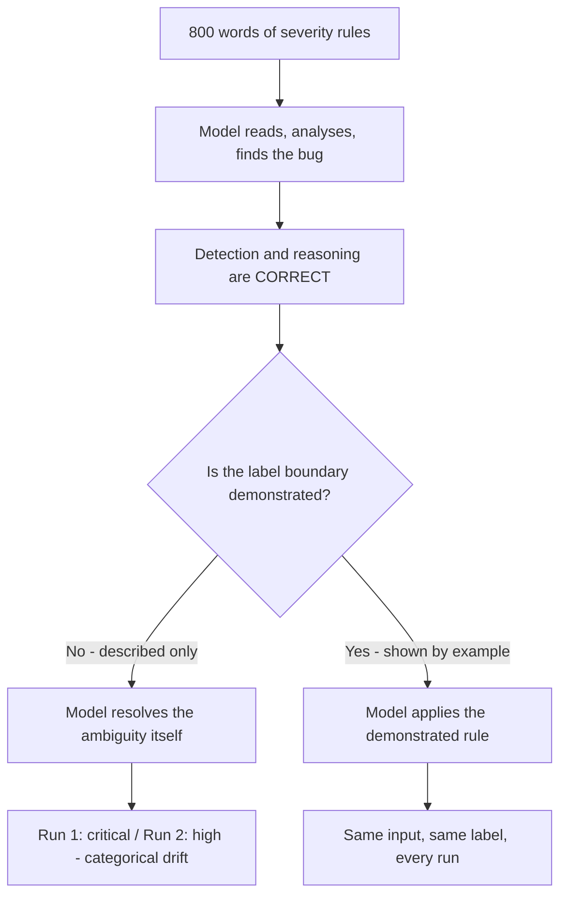
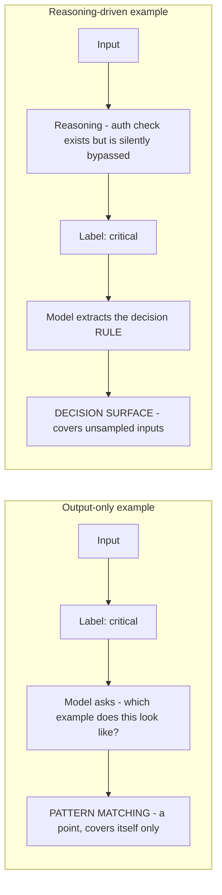
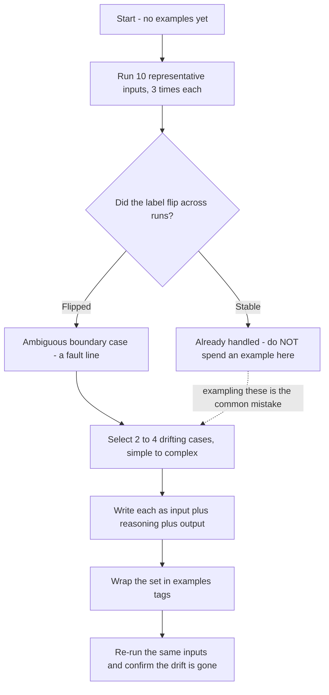

---
tags:
  - CCA-F
  - domain-4
  - prompt-engineering
  - few-shot
  - youtube-course
date: 2026-08-05
status: done
domain: "4 of 5"
source: "Peace Of Code — Claude Certified Architect Ep 15"
---

# 🎯 EP15 — Few-Shot Prompting

> [!NOTE] Exam Coverage
> Maps to **Domain 4 — Prompt Engineering & Structured Output**, task statement **4.2** (few-shot prompting for output consistency), building directly on **4.1** (explicit criteria, from [[EP14 - Prompt Engineering - Explicit Criteria & False Positives]]) and previewing **4.3** via the extraction scenario. Covers why instructions alone cap out, the input + reasoning + output example anatomy, the example-count question, targeting ambiguous boundary cases, and the tool-description-before-examples ordering.

**Back to:** [[CCA-F Study Roadmap]] · **Domain note:** [[D4 - Prompt Engineering & Structured Output]] · **Deck:** [[EP15 - Flashcards]]
**Source:** [Peace Of Code — Ep 15 (28 min)](https://www.youtube.com/watch?v=FbIcU6YFrhw) · Level: college / professional-certification · Question mix calibrated MCQ-heavy (40 / 40 / 20)
**Previous:** [[EP14 - Prompt Engineering - Explicit Criteria & False Positives]]

---

## 1. Outline

- [1. Outline](#1-outline)
- [2. Key Terms](#2-key-terms)
- [3. Concept Summaries](#3-concept-summaries)
  - [3.1 Instructions Describe, Examples Show](#31-instructions-describe-examples-show)
  - [3.2 The Instruction Ceiling](#32-the-instruction-ceiling)
  - [3.3 Calibration Against the Wrong Corpus](#33-calibration-against-the-wrong-corpus)
  - [3.4 Demonstration Beats Description](#34-demonstration-beats-description)
  - [3.5 Anatomy of an Example — Input, Reasoning, Output](#35-anatomy-of-an-example--input-reasoning-output)
  - [3.6 Why Output-Only Examples Fail](#36-why-output-only-examples-fail)
  - [3.7 The Geometry of Generalization](#37-the-geometry-of-generalization)
  - [3.8 How Many Examples — the Contested Number](#38-how-many-examples--the-contested-number)
  - [3.9 Targeting the Fault Lines](#39-targeting-the-fault-lines)
  - [3.10 Structural Drift and the Extraction Case](#310-structural-drift-and-the-extraction-case)
  - [3.11 The Escalation Boundary](#311-the-escalation-boundary)
  - [3.12 Why Lowering Temperature Is the Wrong Answer](#312-why-lowering-temperature-is-the-wrong-answer)
  - [3.13 Tool Descriptions First, Examples Second](#313-tool-descriptions-first-examples-second)
- [4. Diagrams](#4-diagrams)
- [5. Worked Examples](#5-worked-examples)
- [6. Practice Questions](#6-practice-questions)
- [7. Cheat Sheet](#7-cheat-sheet)

---

## 2. Key Terms

| Term | Definition | Source |
|---|---|---|
| **Few-shot prompting** | Embedding concrete input → output demonstrations in the prompt so the model *sees* the target behaviour rather than reading a description of it. Also called **multishot prompting** in Anthropic's docs. | [00:31] |
| **Categorical drift** | The same input receiving a *different label* across runs — "it might classify one thing as critical and one thing as high." Same reasoning, different bucket. | [03:12] |
| **Structural drift** | The same *content* arriving in a different document shape (table vs prose) and the model extracting it inconsistently as a result. | [18:28] |
| **The instruction ceiling** | The point past which more prose stops helping: *"adding more words create more surface area for ambiguity."* | [04:08] |
| **Ambiguity resolution** | What the model does with the gap you left: *"the model understands the task, but it resolves the ambiguity based on itself."* | [01:45] |
| **Wrong-corpus calibration** | Using a word your codebase doesn't use (`severe`) so the model calibrates *"against internet training data, not your specific code base."* | [04:36] |
| **Reasoning-driven example** | An example carrying **input + reasoning + output**, not just input + label. *"The output tells the model what… the reasoning tells the model how."* | [08:13] |
| **Output-only example** | Input → label with no reasoning. Produces *"pattern matching"* — the model asks *"which example does this look like?"* rather than applying a rule. | [09:06] |
| **Derivation vs answer** | *"The answer is specific, but the reason behind that answer is… generally general."* Reasoning is the part that transfers to novel inputs. | [11:05] |
| **Geometry of generalization** | Point → line → plane. An output-only example is a point; reasoning turns it into *"a general decision surface handling the full input space."* | [11:21] |
| **Overfitting (borrowed from ML)** | Too much familiar data, high training accuracy, brittle on deviation. The lecture's analogy for example-matching without reasoning. | [11:34] |
| **Context bloat** | Padding the prompt with examples past the point of usefulness — the lecture's stated cost of going over four. | [13:51] |
| **Fault line / ambiguous boundary case** | The input where the label flips between runs. The lecture's targeting rule: *"identify where the output flips, and example the drifting cases only."* | [15:09] |
| **Drift diagnostic** | *"Run 10 inputs 3x, find the drift"* — sample the same inputs repeatedly before writing examples, and let the disagreements pick your examples. | [15:09] |
| **`<example>` / `<examples>` tags** | The documented XML wrapper that separates demonstrations from instructions so Claude doesn't read an example as a command. Never mentioned in the lecture. | *(docs — §3.5)* |
| **Diversity requirement** | Anthropic's stated criterion: examples must *"cover edge cases and vary enough that Claude doesn't pick up unintended patterns."* | *(docs — §3.8)* |
| **`temperature`** | Sampling randomness. Not a consistency control — and **removed** (400 error) on current Claude models. | [23:11] |
| **Trigger-condition sequencing** | Fix the tool description before adding examples: *"Claude needs to know which tool to use first."* | [24:39] |

---

## 3. Concept Summaries

### 3.1 Instructions Describe, Examples Show

*Question: you wrote 800 words of severity rules, tested them, shipped them. Two weeks later the same code gets different labels. What did the prose fail to do?*

It failed to *show* anything. The host's framing is the whole episode in one line: *"instruction describe what you want… They don't show what it actually looks like."*

Trace the failure carefully, because the interesting part is what **doesn't** break. The model reads 400 lines of severity rules, analyses the code, and finds the bug. *"It has done the reasoning properly. It has found out the bug. It has found out what it is, but it might not give you the exact… label that you want."* Detection is fine. Analysis is fine. The **mapping from finding to label** is what wobbles.

That mapping is the part your prose described but never demonstrated. And where a description runs out, the model doesn't stop and ask — *"the model understands the task, but it resolves the ambiguity based on itself."* Every run resolves it independently, so every run can resolve it differently. That is why the symptom is *inconsistency across runs* rather than *wrongness*: there is no bug to fix, only an unspecified decision being re-made from scratch each time.

This is the same root cause as [[EP14 - Prompt Engineering - Explicit Criteria & False Positives]] §3.9's fabrication — an unspecified branch filled by inference — but one level up. EP14's fix (categorical criteria) says *what counts*. This episode's fix says *what the boundary between counts looks like*.

**In your own words:** The model finds the bug correctly and then labels it inconsistently, because prose described the label boundary without demonstrating it. Unspecified decisions get re-resolved every run.

*See PQ 1, 9.*

---

### 3.2 The Instruction Ceiling

*Question: EP14 said be specific and detailed. This episode says more words make it worse. Which is it?*

Both, and the reconciliation is the point. The host: *"adding more words create more surface area for ambiguity."* His example of the failure mode is a prompt written *"like an essay… with unrelevant information,"* and his prescription is: *"Your prompt should be very straightforward… like an instruction, like a command. Don't twist and turn your words."*

So the ceiling isn't on **precision** — it's on **prose as a delivery mechanism**. EP14's categorical criteria are short and testable ("report SQL injection; skip linter-approved style"); they add specificity without adding surface area. An 800-word narrative adds surface area without adding specificity. Length is a symptom, not the disease: the disease is trying to *describe* a boundary that can only be *shown*.

The lecture's second reason is more subtle and worth keeping: *"definitions cover imagine cases, code evolves leaving gaps for new patterns to fall through."* A written definition can only enumerate the cases you thought of at writing time. Code produces cases you didn't. So the ceiling isn't only about ambiguity today — it's about the definition going stale as the codebase moves under it, which is why the host says *"as code evolves, you have to work on your examples."*

> [!NOTE] The docs agree on the ordering, not on "prose is bad"
> Anthropic's guidance is clarity **first**, examples as the reinforcement: *"Examples are one of the most reliable ways to steer Claude's output format, tone, and structure."* Reliable *steering* of format and tone — not a replacement for stating the rule. Read alongside EP14 §3.11: criteria define the boundary, examples demonstrate it. Neither substitutes for the other.
> Source: https://platform.claude.com/docs/en/build-with-claude/prompt-engineering/claude-prompting-best-practices

**In your own words:** The ceiling is on prose, not on precision. Short categorical rules still help; sprawling narrative doesn't. And any written definition goes stale as the codebase produces cases it never enumerated.

*See PQ 2, 10.*

---

### 3.3 Calibration Against the Wrong Corpus

*Question: your prompt says "flag severe issues." Your codebase's labels are `critical`, `high`, `medium`. What breaks?*

The word `severe` isn't in your vocabulary, so the model reaches for someone else's. The host: words like `severe` *"calibrate against internet training data, not your specific code base."* Your labels are `critical`/`high`/`medium`; the model has no anchor for `severe` inside your system, so it anchors outside it — *"it might classify some of the bugs as severe… but in that case, it would should have been classified as critical."*

This is a sharper diagnosis than EP14's "adjectives aren't rules," and it names the mechanism. A vague adjective isn't merely *underspecified* — it is **specified against the wrong corpus**. The model does have a meaning for `severe`; it just learned that meaning from the internet rather than from your team. Vocabulary mismatch quietly imports a foreign standard.

The host's assignment of responsibility follows EP14's exactly: *"the LLM is doing its job, but not in the exact format that you need. You are the person who should be able to guide the particular LLM."*

**In your own words:** An off-vocabulary word isn't undefined — it's defined by the internet. Use your system's exact label names, then demonstrate the boundaries between them.

*See PQ 3.*

---

### 3.4 Demonstration Beats Description

*Question: why is watching a demonstration different in kind from reading a description?*

Because the description covers what someone thought to write down, and the demonstration carries everything else. The host's analogy is a workout: you can read *"a very lengthy article on that workout"* and understand the gist — *"okay, this is what I need, my hand raised, I need my legs to be in this position"* — but the video answers the questions the article never anticipated: *"At which exact position? How it should be positioned according to your back? According to your core?"*

That maps precisely onto §3.2's staleness problem. A prose definition transmits the cases the author enumerated. A demonstration transmits the *whole configuration* — including the details nobody thought to name. Which is exactly what you need when the boundary between `critical` and `high` is a thing your team recognises but has never successfully written down.

The host flags the exam framing explicitly: *"the exam claim is that few-shot examples are explicitly more effective than detailed prose."*

> [!IMPORTANT] Exam answer, with the real-code nuance
> **Exam answer: few-shot examples beat long prose passages.** Take it as stated. In real code the useful version is EP14 §3.11's ordering — criteria **first** to define the boundary, examples **second** to demonstrate it. If a stem asks for the most effective *first* step to reduce false positives, the answer is still categorical criteria; if it asks how to fix *inconsistent labelling* after criteria exist, it's few-shot examples. Read which failure the stem describes.
> Consistent with [[D4 - Prompt Engineering & Structured Output]] § 4.1–4.2.

**In your own words:** A description transmits what the author enumerated; a demonstration transmits everything, including what nobody could name. That's why examples beat prose on boundary judgements.

*See PQ 4, 11.*

---

### 3.5 Anatomy of an Example — Input, Reasoning, Output

*Question: what are the three parts of a well-formed few-shot example, and what does each part do?*

**Input → reasoning → output.** The host's split is crisp and worth memorising in his own words: *"the output tells the model what… the reasoning tells the model how."*

- **Input** — the case, in the shape it actually arrives in.
- **Reasoning** — why *this* case lands in *that* bucket. His CI/CD instance: *"authentication check exists, but is silently bypassed. Any request proceeds regardless of token validity."*
- **Output** — the label or structured result, in your exact vocabulary: `critical`.

The reasoning is the load-bearing element, and the rule is unconditional: *"Along with every example, you have to provide particular reasoning for that particular example."* Not the interesting ones. Every one.

The lecture stops at the anatomy. Two documented mechanics complete it, and both are exam-relevant.

> [!IMPORTANT] Wrap examples in `<example>` tags — the lecture never mentions this
> Anthropic's stated criteria for examples are three, not one. Examples must be:
> - **Relevant** — *"Mirror your actual use case closely."*
> - **Diverse** — *"Cover edge cases and vary enough that Claude doesn't pick up unintended patterns."*
> - **Structured** — *"Wrap examples in `<example>` tags (multiple examples in `<examples>` tags) so Claude can distinguish them from instructions."*
>
> The third is the one the lecture omits entirely, and it is a real failure mode: an unwrapped example sitting in the prompt body can be read as an *instruction* rather than a demonstration — so "classify this as critical" becomes a standing order instead of a sample. `<examples>` is the delimiter that prevents it, and the vault already lists it as exam-checkable.
> Source: https://platform.claude.com/docs/en/build-with-claude/prompt-engineering/claude-prompting-best-practices · consistent with [[D4 - Prompt Engineering & Structured Output]] § 4.2

> [!TIP] `<thinking>` tags inside examples — the documented form of the lecture's core claim — **(expansion)**
> The docs give the reasoning-driven example an explicit mechanism: *"Use `<thinking>` tags inside your few-shot examples to show Claude the reasoning pattern. It will generalize that style to its own extended thinking blocks."*
> That is the host's whole thesis, officially stated *and* extended: the reasoning you demonstrate doesn't just steer the label, it shapes how the model reasons on inputs you never showed it.
> Source: https://platform.claude.com/docs/en/build-with-claude/prompt-engineering/claude-prompting-best-practices

**In your own words:** Input, reasoning, output — output says *what*, reasoning says *how*, and reasoning is mandatory on every example. Wrap the set in `<examples>` so Claude reads demonstrations as demonstrations.

*See PQ 5, 6, 12.*

---

### 3.6 Why Output-Only Examples Fail

*Question: you give three input → label pairs, no reasoning. What does the model actually do with them?*

It matches instead of reasoning. The host: *"Model behavior, which example does this look like? It will automatically try to infer… And result is pattern matching."*

The failure has two faces, and the second is the dangerous one:

1. **Near-miss inputs get force-fitted** into the closest example, whether or not the rule applies.
2. **Genuinely novel inputs have nothing to match**, so the model improvises — *"if it doesn't match, then it will give you a error or… separate output."*

The tutoring analogy earns its place because it names the mechanism: don't hand a child worked answers and say *"this will come in the exam and you just mug up,"* because *"the child will try to compare those answers that you gave directly with the exam questions."* Rote answers cover only what was rehearsed. *"The child needs to understand how did you come to that particular solution."*

Then the line worth keeping verbatim: *"The answer is specific, but the reason behind that answer is… generally general."* Every example gives you exactly one answer. Its reasoning gives you a rule that reaches everything the reasoning covers. Output-only examples teach the specific and throw away the general — which is precisely the part you needed, since the failing cases are the ones you didn't enumerate.

**In your own words:** Output-only examples turn the model into a matcher. The answer transfers to one case; the reasoning transfers to every case it covers — and the cases you're failing are the ones you never listed.

*See PQ 7, 13.*

---

### 3.7 The Geometry of Generalization

*Question: what does adding reasoning do geometrically?*

It raises the dimension of what the example covers. The host's progression: a **point**, then *"a line, like… a model can project to new inputs along the axis,"* then *"a plane, a general decision surface handling the full input space."*

- **Point** — one input/label pair. Covers exactly itself.
- **Line** — a couple of examples suggesting a direction; the model can extrapolate along that axis only.
- **Plane** — reasoning that defines the *rule*, giving a surface that covers inputs on axes you never sampled.

He cashes this out with the machine-learning parallel, and it's apt: *"if you're over-fitting the model… you're giving it too much familiar data and your accuracy is like 95%, but still it is over-fitting."* High accuracy on the familiar, brittle the moment the input deviates. The rhyme is exact — output-only examples produce a system that scores well on cases resembling your examples and falls over on everything else.

The best line in the section is the one about self-imposed limits: without reasoning, *"you are kind of restricting your model to use its full capabilities."* The model can reason. Output-only examples instruct it not to, and it complies.

The payoff: *"the model extracts the underlying decision rule from the examples and applies it to the novel inputs."* **The decision rule is the deliverable.** Examples are just the medium.

**In your own words:** Point → line → plane. Output-only examples give points and invite overfitting; reasoning gives a decision surface that covers inputs you never sampled. The rule is the deliverable.

*See PQ 8, 14.*

---

### 3.8 How Many Examples — the Contested Number

*Question: the exam will ask how many few-shot examples are ideal. What's the answer — and what do the docs actually say?*

The lecture is unambiguous: **two to four.** *"There is a rule of two to four examples that you should follow in few-shot prompting."* His stated failure mode above four: *"you're kind of bloating the context. You are forcing the model to… do the example matching or the pattern matching which we are probably trying to avoid."* In the tips section he sharpens it to *"why five to eight fails? Triggers pattern matching, loads the context."*

The mechanism is coherent. More examples means more surface for the model to match against, and §3.6 established that matching is the behaviour you're trying to escape. But the docs put the number somewhere else, and the disagreement is genuine.

> [!WARNING] The example-count number — verified against official docs
> The lecture says **2–4** examples, and that *5–8 fails*. Officially: *"Include 3–5 examples for best results."* Note the overlap and the collision — **5 sits inside Anthropic's recommended range and inside the lecture's failure range.**
> **Exam answer: 2–4.** The course states it as an exam fact and the vault's `D4` note carries the same figure, so answer 2–4 on an MCQ. **Real code: 3–5**, per the docs.
> Practical reconciliation: **3–4 satisfies both.** If you have to pick one number to write into a real prompt, pick 3 or 4.
> Source: https://platform.claude.com/docs/en/build-with-claude/prompt-engineering/claude-prompting-best-practices · vault note [[D4 - Prompt Engineering & Structured Output]] § 4.2 updated with the documented figure on 2026-08-05

> [!IMPORTANT] The deeper correction: the lecture blames the count, the docs blame the diversity
> This matters more than the off-by-one. The lecture's whole explanation for why more examples hurt is *quantity* — six examples trigger pattern matching. Anthropic's diversity criterion locates the same failure somewhere else: examples must *"vary enough that Claude doesn't pick up unintended patterns."*
> **Unintended pattern-matching is caused by examples that are too similar, not by there being too many.** Four near-identical examples pattern-match worse than six well-spread ones. That reframes the rule usefully: the cap is a proxy for a diversity budget, and the lecture's own §3.9 advice — variety, complicated cases, fault lines — is the real control. He is right about the fix and wrong about why it works.
> Source: https://platform.claude.com/docs/en/build-with-claude/prompt-engineering/claude-prompting-best-practices

**In your own words:** Exam says 2–4; docs say 3–5; 3–4 satisfies both. And the real driver isn't count — it's diversity. Similar examples cause pattern matching at any count.

*See PQ 15, 16, 19.*

---

### 3.9 Targeting the Fault Lines

*Question: you've got budget for three examples. Which three cases?*

The ones that disagree with themselves. The host's diagnostic is the most practical thing in the episode: *"run 10 inputs 3x, find the drift, identify where the output flips, and example the drifting cases only."*

Sample the same inputs repeatedly **before** writing any examples. Inputs that get the same label every time are already handled — an example there spends budget confirming what works. Inputs whose label flips between runs are the ambiguous boundary cases, and those are the only ones worth an example.

His warning about the lazy alternative: *"you're exampling the obvious cases which… the LLM would be able to understand on its own. But you are not giving the cases like complicated cases."* And the self-directed version, which is the sharpest line in the episode: *"you're kind of practicing the same things that you already know, which you can already figure out. But the thing is you have to practice it on new things that you need to explore."*

He calls this *"the opposite of test-driven development,"* which is a loose fit — TDD writes the test first, this observes failure first — but the intent lands: **let the observed failures pick your examples, don't guess them.** The ordering guidance follows: *"You can start with a simple scenario and end… the fourth example might be a complicated scenario."*

This is also the operational answer to §3.8's diversity problem. Drift-selected examples are automatically spread across the boundary, because that's where drift lives. Pick your examples this way and the diversity criterion satisfies itself.

**In your own words:** Run the same inputs several times, find where the label flips, and example only those. Obvious cases waste budget; drift-selected cases are automatically diverse.

*See PQ 17, 20.*

---

### 3.10 Structural Drift and the Extraction Case

*Question: your extraction agent handles contracts. Some arrive as tables, some as prose. What's the fix?*

One example per document shape. This is the episode's second named scenario and the host flags it as exam material: *"this is one of the scenarios that will come in the exam."*

The task: extract **contract value**, **effective date**, and **payment terms**. The complication is that *"the content can be structured or unstructured. You cannot just kind of restrict someone to only supply you… structured content."*

Two examples, each with its reasoning:

| Example | Input shape | Reasoning | Effect |
|---|---|---|---|
| 1 | Structured table — `field`, `value`, `amount`, `start date`, `terms` | *"explicit table, values directly stated and no inference needed"* | Teaches: read the cells, don't interpret |
| 2 | Prose paragraph | *"no explicit table… contract value is stated in prose as $45,000… payment terms is stated as within 30 days"* | Teaches: same three fields, located by reading |

Notice what the reasoning is doing here, because it's *not* the same job as §3.5's severity case. There the reasoning justified a **label choice**. Here it names the **structure of the input** and how location works in it. Same anatomy, different content — reasoning explains whatever the hard part is. In classification the hard part is the boundary; in extraction it's the shape.

And this is the categorical/structural distinction the exam scenario title turns on: the CI/CD case drifts **categorically** (right finding, wrong bucket); the extraction case drifts **structurally** (right fields, wrong shape). Both are fixed by demonstration, but you enumerate different things — severity levels in one, document formats in the other.

> [!TIP] The half of the extraction problem this episode doesn't cover — **(expansion)**
> Two examples teach the model to find fields in both shapes. They don't tell it what to emit when a field **isn't there** — the fabrication branch from [[EP14 - Prompt Engineering - Explicit Criteria & False Positives]] §3.9–3.10. Pair the format examples with the three-state contract: extract as written · `null` if absent · raw text if ambiguous. The vault's `D4` § 4.2 makes this explicit for extraction — *"include examples of null/empty correct outputs (when a field simply isn't present)."* An example set that only ever demonstrates successful extraction teaches the model that extraction always succeeds.

**In your own words:** One example per document shape, each explaining where the values live. Categorical drift needs one example per label; structural drift needs one per format — and both need a null case.

*See PQ 18.*

---

### 3.11 The Escalation Boundary

*Question: the capstone support agent escalates inconsistently on borderline tickets. How many examples, and which?*

Two, straddling the line. The host's summary of the fix: *"fixing borderline escalation inconsistency required two targeted examples that straddle the ambiguous boundary line."*

The variables are severity of error and customer tenure, and the shape is a decision boundary: *"if it is repeated system failure, escalate… if it is a trusted customer description discrepancy, then resolve."* The agent's job is to sit on one side or the other, and the ambiguity is at the line.

The two examples from the capstone system prompt (*"You are a sub-agent in a customer support system"*), each with the reasoning verbatim:

- **Resolve directly** — *"My invoice shows an extra charge for the last month. I've been a customer for 4 years."* → *"billing discrepancy plus long tenure equals to high trust context… Amount not stated but likely small, goodwill resolution appropriate, no service failure involved."* → **Action:** apply $20 credit, apologise, close.
- **Escalate** — *"I've been charged three times for the same order and nobody has fixed this in 2 weeks."* → *"Repeated billing failure plus failed prior support contact, not a simple discrepancy."* → **Action:** escalate.

The pair is well built, and it's worth seeing *why*: both are billing complaints. They differ on exactly the two variables that decide the boundary — one-off vs repeated, and prior contact failed vs not. Holding the category fixed and varying only the deciding factors is what makes a pair *straddle* a boundary rather than just sit near it. That's §3.9's targeting rule applied, and it's the diversity criterion from §3.8 done correctly: varied where it matters, controlled everywhere else.

One more instruction from the prompt, easy to miss and worth keeping: *"Always state your reasoning before your action."* The examples don't just carry reasoning — they require the agent to produce it. Reasoning in, reasoning out.

> [!TIP] The host breaks his own rule on camera — and fixes it live
> At [26:29] he counts his capstone examples: *"So, I have four or five examples I have. Okay, my bad. Shouldn't have included five examples. I'm just going to remove this example."* Five, trimmed to four on air. Worth remembering as an honest illustration that the count is a guideline people miss in practice — and worth noting that five is inside Anthropic's documented 3–5 range (§3.8), so his "mistake" was arguably fine.

**In your own words:** Two examples that straddle the line, same category, differing only on the deciding variables. Hold everything else fixed so the reasoning isolates what actually decides.

*See PQ 20.*

---

### 3.12 Why Lowering Temperature Is the Wrong Answer

*Question: the same bug class gets different severities across runs. Someone suggests lowering temperature. Why doesn't that work?*

Because temperature governs *sampling*, not *judgement*. The host: *"here it controls the randomness, not… it just doesn't help the model in any kind of judgment."*

Lowering temperature makes the model more likely to pick its highest-probability continuation. If the model's probability mass is genuinely split between `critical` and `high` — because you never demonstrated the boundary — then low temperature makes it *consistently* pick whichever side happens to be marginally ahead. You have converted random wrongness into stable wrongness. The label distribution collapses; the ambiguity doesn't. Nothing has taught the model where your line is.

This is the same defect as EP14's confidence threshold: a knob that looks like a precision control but never supplies the missing judgement. Both are distractors precisely because they sound quantitative.

> [!WARNING] On current models, `temperature` isn't just wrong — it's a 400 error
> The exam distractor assumes `temperature` exists as a tunable. On the current Claude line it does not: **`temperature`, `top_p`, and `top_k` are removed on Claude Opus 5, Claude Fable 5, Claude Opus 4.8, and Opus 4.7 — sending any of them returns a 400.** Claude Sonnet 5 rejects non-default values the same way. They remain accepted on Opus 4.6 / Sonnet 4.6 and older.
> **Exam answer: "lower the temperature" is the wrong option because temperature controls randomness, not judgement.** Real code: on a current model the parameter isn't available at all — steer with prompting.
> Source: https://platform.claude.com/docs/en/about-claude/models/migration-guide

**In your own words:** Temperature controls randomness, not judgement. Lowering it converts random inconsistency into stable inconsistency — and on current models the parameter is gone entirely.

*See PQ 19.*

---

### 3.13 Tool Descriptions First, Examples Second

*Question: your agent has few-shot examples and still picks the wrong tool. What's the sequence?*

Description first. The host's rule and his reason: *"expand tool description first and add example second… Claude needs to know which tool to use first. If Claude doesn't know which tool to use first, then your few-shot examples that you have put there, it is practically useless."*

The dependency is worth stating plainly, because it explains why this is an *ordering* and not a preference. Few-shot examples shape behaviour **inside** a chosen path. Tool selection happens **before** that path is chosen. Examples demonstrating how to classify severity do nothing if the agent called the wrong tool and never reached the classification step. Fixing the second thing while the first is broken produces no measurable change — which is how teams end up concluding "few-shot didn't help."

He scopes it correctly too: *"If you're doing normal prompting, then obviously few-shot prompting is kind of the superior. But if you're working with agents and tools, make sure that the agent description is proper."* Plain prompting has no routing step, so the ordering doesn't apply.

> [!IMPORTANT] Confirmed by the docs — with one caveat the lecture doesn't reach
> Anthropic's tool-use guidance backs the ordering: detailed descriptions are the single most important factor in tool performance, and descriptions should be **prescriptive about *when* to call the tool**, not merely what it does — trigger conditions in the description measurably raise the should-call rate. Under-description, not under-exemplification, is the common tool-selection failure.
> **The caveat:** don't fix a description by putting few-shot examples *inside* it. Worked examples and dialogue turns in a tool description constrain the model's exploration and cost tokens on every single request, since descriptions ride along in every call. Make the description prescriptive and the parameters expressive — well-named enums carry intent — and keep demonstrations in the prompt or a skill.
> Source: https://platform.claude.com/docs/en/agents-and-tools/tool-use/overview · consistent with [[D2 - Tool Design & MCP Integration]] § 2.1 and [[EP06 - Tool Descriptions & Tool Misrouting]]

**In your own words:** Routing happens before behaviour, so a bad description makes examples unreachable. Fix the description first — and make it prescriptive about *when* to call, without stuffing examples into it.

*See PQ 20.*

---

## 4. Diagrams

*The failure is never detection. It is the undemonstrated mapping from finding to label, re-resolved from scratch on every run.*

*The answer is specific; the derivation is general. Reasoning is what turns a point into a plane.*

*Let observed drift pick your examples. Drift-selected cases are automatically diverse, which is the property that actually matters.*

---

## 5. Worked Examples

### Example 1 — Converting a prose severity spec into reasoning-driven examples

**Task:** A CI/CD reviewer prompt says: *"Classify issues by severity. Use your judgment about how severe each issue is. Be consistent."* Runs disagree on the same bugs. Rewrite it.

1. **Name the failure precisely before touching the prompt.** *(why: §3.1 — the model is finding the bugs correctly; only the finding→label mapping drifts. Rewriting the detection instructions would fix nothing.)* Symptom is categorical drift, not missed detections.
2. **Replace off-vocabulary words with your system's exact labels.** *(why: §3.3 — "severe" calibrates against internet training data; `critical`/`high`/`medium` are the only tokens your pipeline consumes.)* State the label set explicitly in the instruction line.
3. **Run the drift diagnostic before writing any example.** *(why: §3.9 — examples on stable cases spend budget confirming what already works. You need to know *which* boundary is soft.)* Ten representative findings, three runs each; record every label.
4. **Select the flipping cases only, ordered simple → complex.** *(why: §3.9 — drift marks the ambiguous boundary, and simple-to-complex ordering is the host's stated sequencing.)* Suppose `critical`/`high` flips and `medium` never does — then both examples belong on that one boundary.
5. **Write each as input + reasoning + output.** *(why: §3.5 — the output says *what*, the reasoning says *how*, and only the reasoning generalises to the cases you didn't sample.)*
   `critical`: *"Authentication check exists but is silently bypassed — any request proceeds regardless of token validity."*
   `high`: *"Missing error handler on a critical path — fails loudly and is caught in staging, but no auth boundary is crossed."*
6. **Wrap the set in `<examples>` tags.** *(why: §3.5 — undelimited examples can be read as standing instructions rather than demonstrations. This is the step the lecture omits entirely.)*
7. **Re-run the same ten inputs three times and confirm the flip is gone.** *(why: the diagnostic that selected the examples is also the test that verifies them — same inputs, same procedure, before and after.)*

**Answer:** Exact labels + drift-selected boundary cases + reasoning on every example + `<examples>` wrapper, verified by re-running the diagnostic. Step 3 is the one most people skip: without it you write examples for the cases you *imagine* are hard, which §3.9 identifies as the obvious cases the model already handles.

---

### Example 2 — Quantifying drift before and after

**Task:** Ten findings, three runs each. Before adding examples, seven findings return the same severity all three times; three flip. After adding two reasoning-driven examples on the `critical`/`high` boundary, all ten are stable. Show what changed, and what a naive metric would have missed.

1. **Define the consistency rate.** *(why: "inconsistent" needs a number before you can claim an improvement.)* With $n$ findings and $k$ runs each, let $s$ be the count of findings whose label is identical across all $k$ runs:
   $$C = \frac{s}{n}$$
2. **Consistency before.** *(why: three of ten flipped.)*
   $$C_{\text{before}} = \frac{7}{10} = 0.70 = 70\%$$
3. **Consistency after.** *(why: same ten inputs, same three runs — the comparison is only valid because the procedure is unchanged.)*
   $$C_{\text{after}} = \frac{10}{10} = 1.00 = 100\%$$
4. **Check what a single run would have reported.** *(why: this is the trap — drift is invisible without repetition.)* Any one run assigns a label to all ten findings, so a one-run audit reports $10/10$ labelled and looks perfectly healthy:
   $$C_{\text{apparent, }k=1} = \frac{10}{10} = 100\% \quad\text{for both before and after}$$
5. **Compute the per-finding flip probability being masked.** *(why: it sizes the production exposure the single-run view hides.)* Three of ten findings are unstable, so on any given run:
   $$P(\text{at least one finding mislabelled}) \ge \frac{3}{10} = 30\%$$
6. **Confirm the examples cost nothing in coverage.** *(why: §3.9 — the fix must not make the reviewer quieter, only more consistent; the same ten findings are detected before and after.)* Detection is $10/10$ throughout.

**Answer:** Consistency rose $70\% \to 100\%$ with detection unchanged. Step 4 is the point: $k=1$ reports 100% in **both** states, so the drift is undetectable without repeated sampling — which is exactly why §3.9's diagnostic runs each input three times. You cannot fix drift you never measured, and a single-run test will never show it to you.

---

### Example 3 — Two examples that straddle an escalation boundary

**Task:** A support sub-agent escalates inconsistently on billing complaints. Build the minimum example set.

1. **Identify the variables the boundary actually turns on.** *(why: §3.11 — the decision is a function of specific factors; examples that vary irrelevant things teach nothing about the line.)* Repetition of the failure, and whether prior support contact already failed. Tenure is context, not the deciding factor.
2. **Hold the category fixed across both examples.** *(why: §3.11 — both are billing complaints. If one were a login bug, the model could learn "billing → resolve" and never see the real boundary.)*
3. **Write the resolve side with its reasoning.** *(why: §3.5 — reasoning states which side of the line and why.)* *"My invoice shows an extra charge for the last month. I've been a customer for 4 years."* → *"Billing discrepancy plus long tenure equals high trust context; amount not stated but likely small; goodwill resolution appropriate; no service failure involved."* → **Action:** apply $20 credit, apologise, close.
4. **Write the escalate side, varying only the deciding factors.** *(why: §3.9 — a pair that differs on one axis isolates that axis; differing on five teaches nothing about which mattered.)* *"I've been charged three times for the same order and nobody has fixed this in 2 weeks."* → *"Repeated billing failure plus failed prior support contact; not a simple discrepancy."* → **Action:** escalate.
5. **Require reasoning in the agent's own output.** *(why: the capstone prompt says "Always state your reasoning before your action" — reasoning in the examples shapes the label; requiring it in the output makes each live decision auditable.)*
6. **Stop at two.** *(why: §3.8 — two is inside every recommended range, and a third example on the same boundary adds similarity, not diversity. Add a third only when the diagnostic surfaces a *different* fault line.)*

**Answer:** Two same-category examples differing only on repetition and prior-contact-failure, each carrying reasoning, plus a standing instruction to state reasoning before acting. Step 4 is the craft: *straddling* a boundary means controlling every variable except the deciding ones — a pair that differs in many ways sits near the line without ever locating it.

---

## 6. Practice Questions

**1.** A CI/CD reviewer gives the same bug different severities on different runs. Is this a detection failure? *(§3.1)*

Answer

**No.** The model finds the bug and reasons about it correctly every time — *"it has done the reasoning properly, it has found out the bug."* What drifts is the mapping from finding to label, which the prompt described but never demonstrated. Unspecified decisions get re-resolved independently on each run.

**2.** EP14 said be specific and detailed; EP15 says more words make it worse. Reconcile them. *(§3.2)*

Answer

The ceiling is on **prose as a delivery mechanism**, not on precision. Short categorical criteria ("report SQL injection; skip linter style") add specificity without ambiguity surface. An 800-word narrative adds surface without specificity. Boundaries that can't be written down have to be shown.

**3.** Your prompt says "flag severe issues"; your labels are `critical`/`high`/`medium`. What exactly goes wrong? *(§3.3)*

Answer

`severe` isn't in your vocabulary, so the model calibrates it *"against internet training data, not your specific code base."* The word isn't undefined — it's defined by the wrong corpus, which silently imports a foreign standard. Use your system's exact label tokens.

**4.** State the exam claim about few-shot versus detailed prose. *(§3.4)*

Answer

**Few-shot examples are explicitly more effective than detailed prose passages.** In real code, pair it with EP14's ordering: criteria define the boundary first, examples demonstrate it second.

**5.** Name the three parts of a well-formed few-shot example and what each contributes. *(§3.5 / Reasoning-driven example)*

Answer

**Input → reasoning → output.** *"The output tells the model what… the reasoning tells the model how."* Input is the case in its real shape; reasoning is why it lands in that bucket; output is the label in your exact vocabulary. Reasoning is required on **every** example, not just the hard ones.

**6.** What are Anthropic's three stated criteria for few-shot examples? *(§3.5 / docs)*

Answer

**Relevant** (mirror your actual use case closely), **diverse** (cover edge cases and vary enough that Claude doesn't pick up unintended patterns), and **structured** (wrap in `<example>` tags, multiple in `<examples>`). The lecture covers relevance and diversity but never mentions the XML wrapper.

**7.** You supply three input→label pairs with no reasoning. Describe the two failure modes. *(§3.6)*

Answer

Near-miss inputs get **force-fitted** into the closest example whether or not the rule applies; genuinely novel inputs have **nothing to match**, so the model improvises an error or an off-format output. Both follow from the model asking *"which example does this look like?"* instead of applying a rule.

**8.** Explain point → line → plane. *(§3.7 / Geometry of generalization)*

Answer

A **point** is one input/label pair covering only itself. A **line** is a couple of examples suggesting a direction the model can extrapolate along. A **plane** is a decision surface from demonstrated reasoning, covering *"the full input space"* — including axes you never sampled. Reasoning is what raises the dimension.

**9.** Why does the drift show up as *inconsistency* rather than as consistent wrongness? *(§3.1)*

Answer

Because there's no bug to be consistently wrong about — there's an unspecified decision. The model resolves the ambiguity itself, independently, on each run, so nothing carries the same resolution forward. Different runs land differently by construction.

**10.** Beyond ambiguity, why does the lecture say written definitions go stale? *(§3.2)*

Answer

*"Definitions cover imagine cases, code evolves leaving gaps for new patterns to fall through."* A definition can only enumerate the cases known at writing time; the codebase keeps producing new ones. Hence *"as code evolves, you have to work on your examples."*

**11.** Why does the workout analogy support examples over prose? *(§3.4)*

Answer

The article transmits what the author enumerated ("hand raised, legs in this position"); the video transmits the whole configuration, including what nobody thought to name — *"at which exact position? According to your back? According to your core?"* Boundary judgements live in exactly those unnamed details.

**12.** What concretely goes wrong if few-shot examples aren't wrapped in `<examples>` tags? *(§3.5 / docs)*

Answer

Claude can read a demonstration as an **instruction**. An unwrapped *"classify this as critical"* becomes a standing order rather than a sample. The tags are the delimiter that lets Claude *"distinguish them from instructions."*

**13.** Unpack *"the answer is specific, but the reason behind that answer is generally general."* *(§3.6)*

Answer

An example's label transfers to exactly one case; its reasoning transfers to every case the rule covers. Output-only examples teach the specific and discard the general — and the general is precisely what you need, because the failing inputs are the ones you never enumerated.

**14.** How is the ML overfitting analogy apt, and what does it predict? *(§3.7)*

Answer

Overfitting means high accuracy on familiar data and brittleness under deviation. Output-only examples produce the same profile: correct on inputs resembling your examples, unreliable on everything else. It predicts that adding *more similar* examples makes it worse, not better.

**15.** How many few-shot examples does the exam expect, and what do the official docs say? *(§3.8)*

Answer

**Exam answer: 2–4.** Official docs: *"Include 3–5 examples for best results."* The ranges overlap at 3–4 — pick 3 or 4 for real code and you satisfy both. Note that 5 sits inside Anthropic's recommended range and inside the lecture's stated failure range.

**16.** The lecture blames too many examples for pattern matching. What do the docs identify as the actual driver? *(§3.8)*

Answer

**Diversity, not count.** Examples must *"vary enough that Claude doesn't pick up unintended patterns"* — so four near-identical examples pattern-match worse than six well-spread ones. The count cap is a proxy for a diversity budget; the lecture's own fault-line targeting is the real control.

**17.** Describe the drift diagnostic and say why obvious cases are the wrong examples. *(§3.9)*

Answer

*"Run 10 inputs 3x, find the drift, identify where the output flips, and example the drifting cases only."* Stable cases are already handled, so an example there spends budget confirming what works — *"practicing the same things that you already know."* Only flipping cases mark the boundary.

**18.** An extraction agent gets contracts as tables and as prose. What's the fix, and how does its reasoning differ from a classification example's? *(§3.10)*

Answer

One example per document shape — table and prose — each extracting the same three fields. The reasoning names the **structure of the input and where values live** (*"explicit table, values directly stated, no inference needed"* vs *"no explicit table, contract value is stated in prose"*), rather than justifying a label choice. Classification reasoning explains a boundary; extraction reasoning explains a shape.

**19.** A CI/CD agent inconsistently assigns severity to the same bug class. Options: (a) add detailed prose definitions, (b) 2–4 targeted few-shot examples with reasoning, (c) lower the temperature, (d) add 6–8 examples. Pick and eliminate. *(§3.8 / §3.12 / Exam scenario)*

Answer

**(b).** (a) is the instruction ceiling — more prose is what already failed. (c) controls randomness, not judgement — it converts random inconsistency into *stable* inconsistency, and on current Claude models `temperature` returns a 400 anyway. (d) exceeds the range and, in the lecture's framing, triggers the pattern matching you're trying to escape.

**20.** An agent with good few-shot examples keeps calling the wrong tool. What is the sequence, and why is it an ordering rather than a preference? *(§3.13)*

Answer

**Expand the tool description first, add examples second.** Routing happens *before* behaviour: examples shape what happens inside a chosen path, so if the agent took the wrong path it never reaches them — *"practically useless."* Fixing the second thing while the first is broken shows no measurable change. Make the description prescriptive about *when* to call the tool; don't put the examples inside it.

---

## 7. Cheat Sheet

| Cue | Note |
|---|---|
| Core failure | Detection is fine; the **finding → label mapping** drifts |
| Categorical drift | Right finding, wrong bucket |
| Structural drift | Right fields, wrong document shape — table vs prose |
| Instruction ceiling | More prose = more ambiguity surface; definitions go stale |
| Wrong-corpus calibration | `severe` calibrates to internet data — use your exact labels |
| ✅ Example anatomy | **input + reasoning + output** — output = *what*, reasoning = *how* |
| Reasoning | Mandatory on **every** example |
| ❌ Output-only example | **Pattern matching** — a point, covers itself only |
| Generalization | Point → line → **plane**. The decision rule is the deliverable |
| Count | **Exam: 2–4** · **Docs: 3–5** · use 3–4 in real code |
| Real driver | **Diversity**, not count — similar examples match at any count |
| Targeting | Run 10 inputs ×3; example **only** the flips, simple → complex |
| Structure | Wrap in `<examples>` so demos aren't read as instructions |
| Extraction | One example per **document shape** + a `null` case |
| Escalation | **Two** examples straddling the line; vary only the deciding factors |
| ❌ Temperature | Randomness, not judgement — and a **400** on current models |
| Agents | **Tool description first** — routing precedes behaviour |

**Top 5 terms:** reasoning-driven example · instruction ceiling · pattern matching (anti-pattern) · ambiguous boundary case / fault line · geometry of generalization

> [!WARNING] Exam traps
> ❌ More prose definitions to fix inconsistency — that's the ceiling.
> ❌ Lowering `temperature` — randomness, not judgement.
> ❌ 6–8 examples — pattern matching and context bloat.
> ❌ Output-only examples — no rule, only matching.
> ❌ Exampling the obvious cases — target the flips instead.
> ❌ Examples before fixing a bad tool description — never reached.
> ✅ "How many few-shot examples?" → **2–4**.
> ✅ "Inconsistent severity, same bug class?" → **2–4 targeted examples with reasoning**.

> **Synthesis:** Every failure here is one thing: **the model reached a decision you described but never demonstrated, and decided it for you.** Prose has a ceiling because a description transmits only the cases its author enumerated — and the boundary between `critical` and `high` is exactly what your team recognises but has never written down. Examples show it instead, and reasoning is the load-bearing part: *the answer is specific but the derivation is general*, so an output-only example gives a point while a reasoned one gives a surface covering inputs you never sampled. Which examples? The ones the drift diagnostic picks — run inputs repeatedly and let the flips choose themselves. They mark the boundary, and they are automatically diverse, which the docs say is what actually prevents pattern matching. Answer **2–4** on the exam, write 3–4 in production, wrap them in `<examples>`, and fix the tool description first.

> [!TIP] Transcription artifacts
> **"civility levels"** [22:50] = **severity levels** — this is the exam-scenario stem. **"sweet space"** [14:48] = *sweet spot* · **"the derivative of the output"** [09:39] = the *derivation* (the host says outright he doesn't mean the calculus sense) · **"you're exampling the obvious cases"** [15:44] — "example" is used as a verb throughout · **"an essay of 500 characters"** [04:08] — he means words; the episode's numbers (800 words, 400 lines, 500 characters) are all illustrative, not rules.
> **Episode numbering is garbled on the slides.** At [03:47] the host corrects himself: *"this is not episode 13… we had studied about episode 14, and then we are studying few-shot examples in episode number 15."* The deck says 13. This is EP15; structured output is EP16.

---

## ✅ Practice Checklist

- [ ] Can explain why severity drift is a labelling failure, not a detection failure
- [ ] Can reconcile EP14's "be specific" with EP15's "more words make it worse"
- [ ] Can explain why an off-vocabulary word like `severe` is worse than no word at all
- [ ] Know the exam claim: few-shot examples beat detailed prose
- [ ] Can name the three parts of an example and what each contributes
- [ ] Know Anthropic's three example criteria — relevant, diverse, structured
- [ ] Can state what `<example>` / `<examples>` tags prevent
- [ ] Can describe both failure modes of output-only examples
- [ ] Can explain point → line → plane and why reasoning raises the dimension
- [ ] Know the example count: **2–4** for the exam, 3–5 per docs, 3–4 for real code
- [ ] Can explain why diversity, not count, drives unintended pattern matching
- [ ] Can run the drift diagnostic from memory and say why obvious cases are wrong examples
- [ ] Know the extraction pattern: one example per document shape, plus a null case
- [ ] Can build two examples that straddle an escalation boundary
- [ ] Can explain why lowering `temperature` doesn't fix inconsistency — and that it 400s on current models
- [ ] Know the ordering: tool description first, examples second, and why it's an ordering

---

*Next: [[EP16 - Structured Output & JSON Schema]]*
