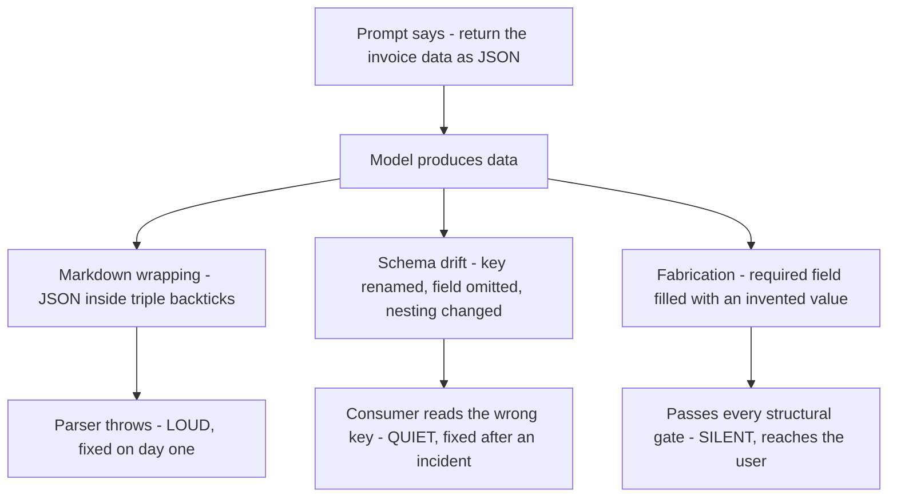
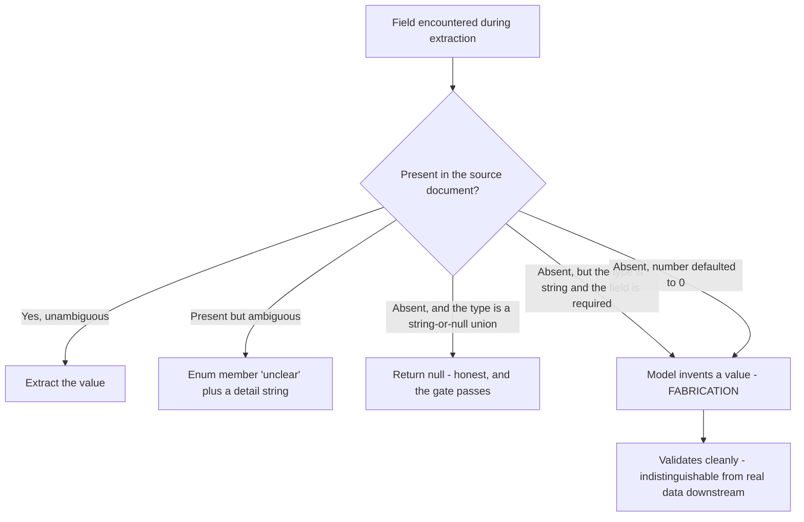
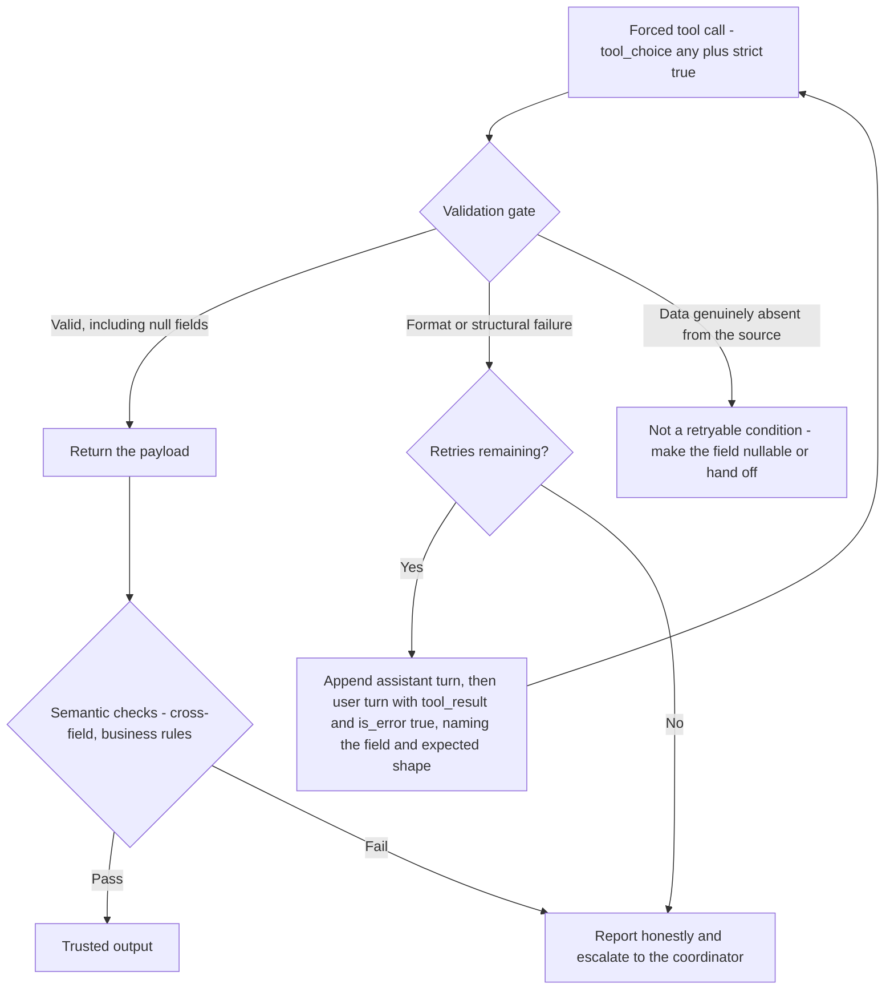

---
tags:
  - CCA-F
  - domain-4
  - prompt-engineering
  - structured-output
  - json-schema
  - tool-use
  - youtube-course
date: 2026-08-05
status: done
domain: "4 of 5"
source: "Peace Of Code — Claude Certified Architect Ep 16"
---

# 🧬 EP16 — Structured Output & JSON Schema

> [!NOTE] Exam Coverage
> Maps to **Domain 4 — Prompt Engineering & Structured Output**, task statements **4.3** (enforcing structured output via tool use and JSON schemas) and **4.4** (validation, retry, and feedback loops for extraction quality), building on **4.1**'s fabrication material. Covers why freeform "give me JSON" prompting breaks production pipelines, the fake-tool paradigm, all four `tool_choice` values, required-plus-nullable schema design, the syntax-versus-semantics boundary, the self-correcting retry loop, and the point at which retries must stop and hand off to a human.

**Back to:** [[CCA-F Study Roadmap]] · **Domain note:** [[D4 - Prompt Engineering & Structured Output]] · **Deck:** [[EP16 - Flashcards]]
**Source:** [Peace Of Code — Ep 16 (36 min)](https://www.youtube.com/watch?v=CaDaLn7DcQ0) · Level: college / professional-certification · Question mix calibrated MCQ-heavy (40 / 40 / 20)
**Previous:** [[EP15 - Few-Shot Prompting]]

---

## 1. Outline

- [1. Outline](#1-outline)
- [2. Key Terms](#2-key-terms)
- [3. Concept Summaries](#3-concept-summaries)
  - [3.1 Why Freeform Prompting Breaks Pipelines](#31-why-freeform-prompting-breaks-pipelines)
  - [3.2 The Fake Tool Paradigm](#32-the-fake-tool-paradigm)
  - [3.3 What the Schema Actually Guarantees](#33-what-the-schema-actually-guarantees)
  - [3.4 tool_choice — the Four Values](#34-tool_choice--the-four-values)
  - [3.5 Choosing Between any and a Named Tool](#35-choosing-between-any-and-a-named-tool)
  - [3.6 Required Plus Nullable — the Honest Escape Hatch](#36-required-plus-nullable--the-honest-escape-hatch)
  - [3.7 Syntax Versus Semantics](#37-syntax-versus-semantics)
  - [3.8 What a JSON Schema Cannot Express](#38-what-a-json-schema-cannot-express)
  - [3.9 The Self-Correcting Retry Loop](#39-the-self-correcting-retry-loop)
  - [3.10 Wiring the Feedback Turn Correctly](#310-wiring-the-feedback-turn-correctly)
  - [3.11 When the Retry Loop Must Stop](#311-when-the-retry-loop-must-stop)
  - [3.12 The Other Mechanism — Native Structured Outputs](#312-the-other-mechanism--native-structured-outputs)
- [4. Diagrams](#4-diagrams)
- [5. Worked Examples](#5-worked-examples)
- [6. Practice Questions](#6-practice-questions)
- [7. Cheat Sheet](#7-cheat-sheet)

---

## 2. Key Terms

| Term | Definition | Source |
|---|---|---|
| **Structured data extraction** | Pulling schema-conformant fields out of unstructured input. The host's framing: *"production grade extraction… in layman's terms it's just structured output from your agents."* | [01:15] |
| **Markdown wrapping** | The model returns JSON fenced in triple backticks. *"The parser hits a backtick instead of a bracket and throws a fatal syntax error."* Data correct, structure wrong. | [05:01] |
| **Schema drift** | *"Complex documents cause the model to omit optional fields, change key names or alter nesting structures."* The shape varies run to run. | [05:13] |
| **Fabrication of required fields** | The model invents a value because the schema says the field must be present. *"Even if the vendor name is not present in the data you supply… the model will understand okay the vendor name is not there, let's give a dummy vendor name."* | [10:24] |
| **Fake tool paradigm** | *"Define a tool that does nothing but accept a structured payload."* No business logic — *"its job is to enforce schema compliance on the output."* | [07:08] |
| **`input_schema`** | The JSON Schema on a tool definition that declares the object's `properties` and `required` fields. | [10:03] |
| **`strict`** | Tool-definition flag (`strict: true`) that turns the schema from a strong hint into a validated guarantee on tool inputs. Requires `additionalProperties: false` plus `required`. | *(expansion — §3.3)* |
| **`tool_choice`** | The **object** controlling whether and which tool Claude must call: `{"type": "auto"}`, `{"type": "any"}`, `{"type": "tool", "name": "..."}`, `{"type": "none"}`. | [13:42] |
| **`any`** | *"Claude has to use any one of the available tools… guarantees a tool use block in the response every single time."* | [16:08] |
| **Required plus nullable** | The field stays in `required` but its type admits `null`. *"The field is guaranteed to be present but null is an escape hatch."* JSON Schema form: `"type": ["string", "null"]`. | [18:58] |
| **Syntax error** | A structural or format failure — *"missing required fields, string instead of number, malformed JSON."* Fixed by strict schemas and tool-use enforcement. | [21:49] |
| **Semantic error** | A logical or interpretation failure — *"reading the wrong table row, confusing similar terms or hallucination of data."* Schema-valid but untrue. | [21:49] |
| **System boundary matrix** | The host's name for the syntax/semantic split: *"structural or format failure"* versus *"logical or interpretation failure."* | [21:23] |
| **Self-correcting retry loop** | Run extraction → validation gate → on format failure, append the error to the conversation and re-run. *"This feedback loop is only for correcting the formats."* | [23:54] |
| **Validation gate** | The check between extraction and success. *"It can be a simple if condition… inside a while loop."* Passes when the payload is structurally valid — including when a field is `null`. | [24:28] |
| **`tool_result` / `is_error`** | The content block that carries a tool's output — or its failure — back to the model. A failed validation is reported with `is_error: true`. | *(expansion — §3.10)* |
| **Targeted feedback** | *"Generic validation failed yields identical failures. Give specific target: invoice date must be in this format."* The error text must name the field and the expected shape. | [27:01] |
| **Human handoff** | Escalation once retries are exhausted or the data is genuinely absent — *"send a signal back to the coordinator saying okay I cannot handle it, please escalate."* | [33:36] |
| **`output_config.format`** | The Messages API parameter that constrains the **response** to a JSON Schema by constrained decoding — the second first-class structured-output mechanism. | *(expansion — §3.12)* |

---

## 3. Concept Summaries

### 3.1 Why Freeform Prompting Breaks Pipelines

*Question: your tools return correct data and your agent works fine in testing. Why does the pipeline still crash downstream?*

Because "correct" and "parseable" are different properties, and only one of them was ever specified. The host opens on the capstone customer-support agent from earlier episodes: the tools work, the hooks fire, the system prompt is tuned — *"our agent is working really fine."* The gap appears the moment output becomes input: *"what if I want to use those outputs that I get from those tools and I want to pass it on to a different sub agent."*

His diagnosis names three distinct failure modes, and they are worth keeping separate because they fail at different layers:

1. **Markdown wrapping** — the model helpfully fences its JSON. *"The parser hits a backtick instead of a bracket and throws a fatal syntax error."* His own gloss is the precise one: *"intellectually the data is correct but the way it is returning the data is not correct."* A crash at the parser.
2. **Schema drift** — *"complex documents cause the model to omit optional fields, change key names or alter nesting structures."* No crash necessarily; the consumer just silently reads the wrong key. *"Production reliability collapses."*
3. **Fabrication of required fields** — the model fills a gap rather than admitting it. This one doesn't fail at all, which is what makes it the worst of the three.

Notice the escalation. Markdown wrapping is loud and gets fixed on day one. Schema drift is quiet and gets fixed after an incident. Fabrication never announces itself — and the host reaches straight for the stakes: *"it might be personal information, it might be very critical information for a patient, for example, if you are working on an agent for a hospital."*

The through-line to [[EP14 - Prompt Engineering - Explicit Criteria & False Positives]] § 3.9 is exact: **the model is filling a branch you left unspecified.** "Return the invoice data as JSON" states the goal and leaves the missing-field case to inference — and inference, given a schema that says the field is mandatory, produces a plausible invention.

**In your own words:** Three failure modes at three depths — markdown wrapping crashes the parser, schema drift silently misroutes data, fabrication never fails at all. Only the first announces itself.

*See PQ 1, 2.*

---

### 3.2 The Fake Tool Paradigm

*Question: how do you make schema conformance a property the API enforces rather than something you ask for politely?*

Define a tool that does no work. The host's framing is the memorable one: *"define a tool that does nothing but accept a structured payload."* Walking through `extract_invoice_data` in the editor: *"this tool doesn't need to do anything real. Its job is to enforce schema compliance on the output."*

The conceptual leap he flags — correctly, because it trips people — is that this is not a function:

> *"This might not be a function at all, because till now whatever tools we have understood is just functions. And in this case it is nothing. It is just enforcing the schema on Claude."*

His five-functions-plus-one analogy makes the architecture concrete: five real tools return integers and strings; the sixth accepts a typed payload and exists purely so the boundary has a contract. Its `input_schema` declares `type: object`, the `properties` (`vendor_name`, `total_amount`, invoice date), and a `required` list.

Why this beats prompting is a change of enforcement layer, not a change of wording. Asking for JSON puts the constraint in the prompt, where the model may or may not honour it. Declaring a tool schema puts the constraint in the request, where the decoder is steered by it — the host's *"strongly typed contract."* His closing move is the payoff:

> [!TIP] Transcription artifact — the zero-parsing line
> [12:25] renders as *"zero passing read response. content0ero. input input and extract a pristine dictionary."* The intended line is: **zero-parsing — read `response.content[0].input` and extract a pristine dictionary.** No `json.loads`, no regex, no stripping fences: the tool input arrives as a parsed object. That is the whole return on the pattern, so it is worth un-garbling. ("Fake tool paradism" at [07:08] is likewise *paradigm*, and *"strongly type context"* at [13:42] is *strongly typed contract*.)

**In your own words:** A tool with no body, whose only job is to carry a typed payload. It moves schema enforcement from the prompt into the request, and you read `content[0].input` as an already-parsed dict.

*See PQ 3, 4, 13.*

---

### 3.3 What the Schema Actually Guarantees

*Question: the lecture says "the API enforces the exact schema before returning data." Is a `required` list enough to make that literally true?*

Not by itself — and this is the most consequential gap in the episode, because everything downstream (the validation gate, the retry loop) is sized to how strong the guarantee actually is.

> [!WARNING] "The API enforces the exact schema" needs `strict: true` — verified against official docs
> The lecture presents an `input_schema` with `properties` and `required` and describes the result as a hard contract: *"the API enforces the exact schema before returning data."* Officially, a plain `input_schema` steers the model strongly but is **not** a validated guarantee. The guarantee comes from **strict tool use**: set `strict: true` as a top-level field on the tool definition, and the schema must carry `additionalProperties: false` alongside `required`. With that, *"guarantees `tool_use.input` validates exactly."*
> **Exam answer: tool use with a JSON schema is the mechanism for structured output** — that framing is what the exam tests, and it is what [[D4 - Prompt Engineering & Structured Output]] § 4.3 records. **Real code: add `strict: true` and `additionalProperties: false`**, or the "contract" is a strong suggestion.
> Source: https://platform.claude.com/docs/en/build-with-claude/structured-outputs · consistent with [[D4 - Prompt Engineering & Structured Output]] § 4.3

Two properties of `strict` matter beyond the flag itself:

- **`additionalProperties: false` is mandatory, on every object.** Without it there is no closed set of keys, so "the exact schema" has no meaning — the model may add fields.
- **It validates names as well as inputs.** Strict tool use covers the tool name and the input parameters, which closes the sibling of schema drift: a call to a tool that doesn't exist.

And the strongest combination for an extraction boundary pairs it with §3.4's forcing flag: **`tool_choice: {"type": "any"}` plus `strict: true` guarantees both that a tool is called and that its input conforms.** The lecture supplies the first half and stops.

> [!IMPORTANT] Forced tool use suppresses the model's prose — expansion
> There is a documented side effect the lecture never mentions, and it explains *why* the fake-tool output is so clean: *"when you have `tool_choice` as `any` or `tool`, the API prefills the assistant message to force a tool to be used. This means that the models will not emit a natural language response or explanation before `tool_use` content blocks, even if explicitly asked to do so."*
> So forcing extraction is not merely a guarantee — it is a **trade**. You get a `tool_use` block with nothing around it, and you give up any commentary, caveat, or "I could not find the vendor name" note the model might otherwise have written. If your pipeline wants both the payload *and* an explanation, use `{"type": "auto"}` and ask for the tool in the user turn instead.
> Source: https://platform.claude.com/docs/en/agents-and-tools/tool-use/define-tools

**In your own words:** `required` alone is a strong hint. `strict: true` plus `additionalProperties: false` is the guarantee — and forcing a tool call also silences the model's prose, which is a trade, not a free win.

*See PQ 5, 14, 15.*

---

### 3.4 tool_choice — the Four Values

*Question: name all four values and say precisely what each guarantees.*

The host covers three and gestures at the fourth. All four are exam-checkable literals, and `tool_choice` is an **object**, not a bare string:

| Value | Guarantee | Architectural fit |
|---|---|---|
| `{"type": "auto"}` | Claude may call a tool or may answer in text. **Default when `tools` are provided.** | *"Unreliable for strict extraction pipelines; best for conversational agents."* |
| `{"type": "any"}` | Claude **must** call one of the provided tools — *"guarantees a tool use block in the response every single time."* | Multiple extraction schemas, input type unknown |
| `{"type": "tool", "name": "..."}` | Claude must call **that** tool. *"Maximum lockdown for single tool extraction systems."* | One fake tool; every invocation must produce the payload |
| `{"type": "none"}` | Claude **cannot** call any tool. Default when no `tools` are provided. | Force a text answer despite tools being available |

The host's objection to `auto` for extraction is the right one and generalises: *"you have a tool but Claude decides that I don't need this tool, but you actually need to execute that tool for that particular sub agent. In that case auto is very unreliable because you are leaving the decision to Claude."* An extraction boundary is not a place for model discretion — the payload is the point of the call.

Any of the four may also carry `"disable_parallel_tool_use": true`, which caps the response at one tool call. For a single-fake-tool extractor that is a sensible belt-and-braces setting: it removes the possibility of two competing payloads in one response. **(expansion)**

> [!TIP] Transcription artifact — the `any`/`auto` comparison
> [16:03] reads *"Next comes any. It's just the opposite not the opposite of claude."* He is mid-self-correction: `any` is **not** the opposite of `auto` — it is `auto` with the "may decline" branch removed. Both let Claude pick *which* tool; only `auto` lets it pick *whether*.

**In your own words:** `auto` = may call (default with tools). `any` = must call one. `tool` = must call this one. `none` = must not call (default with no tools). It's an object, and `auto`'s discretion is exactly what an extraction boundary can't afford.

*See PQ 6, 7, 16.*

---

### 3.5 Choosing Between any and a Named Tool

*Question: your extractor has exactly one fake tool. Does `any` or a named tool matter?*

With one tool, they are equivalent — both produce that tool's `tool_use` block every time. The distinction only bites once the `tools` array holds more than one entry, and the host raises the objection himself:

> *"It might also execute a tool that is wrong, right? And it makes sense, because you will specify a lot of tools… and you give the tool choice as any, then it might execute any of the tools that you supply."*

His answer is to make selection reliable — *"you have to make the tool selection really really efficient… by providing proper descriptions, by providing proper tool names and few shot examples"* — which is precisely [[EP06 - Tool Descriptions & Tool Misrouting]]'s material arriving from the extraction side. That is correct but incomplete, because there is a second answer he then supplies: *"if you know that Claude will have to execute a tool every time then you can go with a specific type of tool."*

So the decision rule is about **whether the schema is knowable in advance**:

- **One schema, always the same** → name the tool. Nothing is left to selection, so no amount of description quality matters.
- **Several schemas, input type unknown at request time** (invoice versus receipt versus purchase order) → `any`, plus the description work, because *choosing* is genuine work you want the model to do.

The vault records the same split from the other direction: [[D4 - Prompt Engineering & Structured Output]] § 4.3's typical patterns give *"multiple extraction schemas exist, document type unknown → `{"type": "any"}`"* and a forced specific tool when a particular extraction must run first. Same rule, different worked example.

The exam trap lives in the flashcard line the host closes on: *"tool choice any is the switch that guarantees execution."* True — but so does `{"type": "tool", "name": ...}`. If a stem describes a single-tool extractor and offers both, read for which one the stem's wording actually pins down.

**In your own words:** With one tool they're equivalent. `any` when the input type — and therefore the schema — isn't known until runtime; a named tool when it is. `any` also inherits every tool-selection risk from D2.

*See PQ 8, 17.*

---

### 3.6 Required Plus Nullable — the Honest Escape Hatch

*Question: `vendor_name` is in `required` and typed `string`. The document doesn't contain it. What does the model do, and what should you have written?*

It invents one. The host is precise about the mechanism: *"whenever you say that this field is required, the model understands that okay, those fields I need to fill at any cost. So in that case fabrication of data happens."* The schema itself created the pressure — you asked for a guarantee the source cannot support, so the model manufactured one.

The fix keeps the presence guarantee and widens the type:

> *"If you say that okay the type is string and you specify it as null, in that case it is a required field nonetheless but it is nullable… the field is guaranteed to be present but null is an escape hatch. If the model doesn't find any reliable data it will just fill it with null, and that is better than fabricating the data."*

That distinction — **present but null** versus **absent** — is the load-bearing one, and it's why removing the field is the wrong fix. Drop `vendor_name` from `required` and a consumer can no longer tell "we looked and it wasn't there" from "this extractor doesn't produce that field." Keep it required and nullable and the answer is unambiguous. This is [[EP14 - Prompt Engineering - Explicit Criteria & False Positives]] § 3.10's null-is-valid rule expressed in schema rather than prose: a prohibition works when it ships with the positive alternative beside it.

The precise syntax is worth memorising, because the lecture only describes it in words:

```json
{
  "type": "object",
  "properties": {
    "vendor_name":  { "type": ["string", "null"] },
    "total_amount": { "type": ["number", "null"] },
    "invoice_date": { "type": ["string", "null"] },
    "tax_id":       { "type": ["string", "null"] }
  },
  "required": ["vendor_name", "total_amount", "invoice_date", "tax_id"],
  "additionalProperties": false
}
```

A union type in `type` — not a `nullable: true` key, which is OpenAPI, not JSON Schema. This matches [[D4 - Prompt Engineering & Structured Output]] § 4.3's `"order_id": {"type": ["string", "null"]}` exactly.

> [!WARNING] "For numbers you can specify a default value like zero" — this is fabrication
> At [26:40] the host says: *"For string it can be null. For object it can be null. Maybe for numbers you can specify a default value like zero or something like that."* Structurally he is right — `0` satisfies `"type": "number"` and the validation gate will pass it.
> **But it violates the very thesis of the lesson.** `0` is not "unknown"; it is a *number the document did not contain*. A `total_amount` of `0` for a missing total is a fabricated value that is now indistinguishable from a genuine zero-value invoice, and it will pass every downstream check on its way to a ledger. The whole point of `null` is that it cannot be mistaken for data.
> **Exam answer and real code agree here: use `["number", "null"]`.** Reserve numeric defaults for fields where zero is genuinely the semantic identity (a count of line items on an empty invoice), never as a stand-in for absence.
> Consistent with [[D4 - Prompt Engineering & Structured Output]] § 4.3: *"Use optional (nullable) fields when the source may not contain the data — prevents fabrication."*

One more design tool the lecture doesn't reach: for fields whose value is *present but ambiguous*, add an `"unclear"` or `"other"` member to an `enum` rather than forcing a guess between real categories, and pair it with a free-text detail field. That gives you three distinguishable states — confident value, explicitly unclear, absent — instead of two. **(expansion; see [[D4 - Prompt Engineering & Structured Output]] § 4.3)**

**In your own words:** `required` plus a `["string", "null"]` union keeps the presence guarantee and removes the pressure to invent. Present-but-null ≠ absent. Never default a missing number to `0` — that's fabrication that validates.

*See PQ 9, 10, 18.*

---

### 3.7 Syntax Versus Semantics

*Question: your extractor passes JSON Schema validation 100% of the time and still ships wrong numbers to customers. What kind of error is that, and what fixes it?*

A semantic error, and no amount of schema work touches it. The host's statement of the boundary is the sentence to carry into the exam:

> *"The strict JSON schema guarantees your output is structurally flawless. It guarantees nothing about the truth of the data."*

His example is exactly the one the exam uses: *"if the model extracts the due date when you ask for the invoice date, your parser accepts it but your data is factually wrong."* Both values are strings, both are dates, both satisfy the schema. The type system cannot see the difference because the difference isn't structural — it's a wrong *reading* of the document.

The consequence he draws is the dangerous part: *"the next sub agent or the pre-processor might get structurally correct data and it might not throw any errors, but the end user might see wrong data."* A schema-valid falsehood travels **further** than malformed JSON, because every gate it passes is a gate that only checks shape.

His matrix, with the fixes:

| | Syntax / structural | Semantic / interpretation |
|---|---|---|
| **Examples** | Missing required fields, string instead of number, malformed JSON | Reading the wrong table row, confusing similar terms, hallucinated data |
| **What fixes it** | Strict JSON schemas, tool-use enforcement, the fake tool | Business-logic validation, cross-field consistency checks, human review |
| **When it's caught** | At the parser or validation gate | Only by a rule that knows what the values *mean* — or by a person |

The `PostToolUse` hook is the natural home for the semantic half, as the host notes: *"you might want to validate the data in the post tool hook."* That is [[EP05 - PreToolUse, PostToolUse Hooks & Task Decomposition]]'s deterministic-gate argument applied to truth rather than safety — and it matters because a hook is code, so it can compute things a schema cannot.

This maps cleanly onto [[D4 - Prompt Engineering & Structured Output]] § 4.3's exam rule: *"strict schemas prevent syntax errors but do NOT prevent semantic errors (e.g., line items that don't sum to total, values in wrong fields)."*

**In your own words:** Schemas guarantee shape, never truth. A schema-valid wrong value passes every structural gate and reaches the user — so semantic checks must be business logic, not schema.

*See PQ 11, 12.*

---

### 3.8 What a JSON Schema Cannot Express

*Question: why can't you just tighten the schema until it catches semantic errors too?*

Because the schema language deliberately doesn't reach that far — and knowing the exact boundary turns §3.7 from a slogan into an engineering rule.

> [!IMPORTANT] The constraints structured-output schemas do not support — expansion
> Officially unsupported in structured-output and strict-tool schemas:
> - **Numerical constraints** — `minimum`, `maximum`, `multipleOf`
> - **String constraints** — `minLength`, `maxLength`
> - **Recursive schemas**, external `$ref`, complex types inside `enum`
> - Array constraints beyond a `minItems` of 0 or 1
> - `additionalProperties` set to anything other than `false`
>
> Unsupported constraints are **stripped** from the schema sent to the model and appended to the field descriptions as prose instead; the SDK then validates the response against your original schema client-side. So a `minimum: 0` is not a decoding constraint — it becomes a hint plus a post-hoc check.
> Source: https://platform.claude.com/docs/en/build-with-claude/structured-outputs

Read that list next to §3.7 and the boundary stops being philosophical. `"total_amount must be greater than zero"` is not expressible as an enforced schema rule. Neither is `"invoice_date must not be in the future"`, nor `"line items must sum to total"`. Every one of those is a *semantic* rule by the docs' own division of labour — which is precisely why the host's fix for semantic errors is **business logic**, not a stricter schema.

Two practical consequences:

1. **Your validation gate is doing real work that the schema cannot do.** It is not a redundant belt over the schema's braces; it owns an entire category of checks the schema has no vocabulary for.
2. **`additionalProperties: false` is the one constraint you must always add** — it is required for strict mode (§3.3), and it is the only one on this list that isn't optional.

**In your own words:** Schemas can't express ranges, lengths, or cross-field arithmetic — those get stripped to prose hints. So "add business logic" isn't advice, it's the only place those checks can live.

*See PQ 12, 18.*

---

### 3.9 The Self-Correcting Retry Loop

*Question: extraction came back in the wrong date format. What does the loop do — and what must it never do?*

It re-runs with the error attached, and it must never try to conjure missing data. The host repeats this warning more than any other line in the episode, and says why: *"keep in mind the exam will test you again and again."*

The shape:

1. **Run the extraction** — forced tool call, schema-shaped payload.
2. **Validation gate** — *"a simple if condition… inside a while loop"* checking structural validity plus your own business rules.
3. **On pass, return.** Crucially, `null` passes: *"name is there, age is there, occupation is not there but it is null. In that case this validation gate will pass because it is in the specific format."*
4. **On format failure, feed the error back** and re-run, up to `max_retries` (his example uses 2).

The bound matters and is your call: *"the max retries is two. You can specify the number of retries as well, it is completely your own logic. The concept is the feedback loop, but the logic that you write is your own logic."*

The feedback must be **targeted**, and his reasoning is the memorable part: *"generic validation failed yields identical failures."* Re-running with `"validation failed"` gives the model no new information, so it makes the same choice again and you burn all your retries on identical output. *"Give specific target: invoice date must be in this format"* — name the field, state the expected shape, quote what was received.

> [!IMPORTANT] The exam's favourite trap on this loop
> The host scripts the question almost verbatim: your retry loop fails on every attempt, and the document genuinely lacks `tax_id`.
> - ❌ **"Prompt the model to look harder" / "make the model generate the data"** — *"you cannot prompt the model to look harder for information that doesn't exist."* Picking this instructs a hallucination.
> - ❌ **"Increase `max_retries`"** — *"more retries will never find the missing data."*
> - ❌ **"Remove the field from the schema"** — *"removing the field loses presence guarantees"* (§3.6).
> - ✅ **Change the field's type to `["string", "null"]`.** The loop stops failing and nothing is invented.
> Consistent with [[D4 - Prompt Engineering & Structured Output]] § 4.4: *"Retries are ineffective when the required information simply doesn't exist in the source document. This is a fundamental limitation, not a formatting issue."*

The one-line version the host lands on: **"Retries are format correctors. They are not data generators."**

**In your own words:** Run → validate → on *format* failure re-run with a field-specific error, bounded by your own retry cap. `null` passes the gate. Absent data is not a retryable condition.

*See PQ 12, 13, 14, 17.*

---

### 3.10 Wiring the Feedback Turn Correctly

*Question: the loop is right conceptually. Is the message sequence in the lecture's code complete?*

No — and this is the second correction, because a half-wired feedback turn produces API errors rather than corrections.

> [!WARNING] The feedback turn needs a `user` turn with `tool_result`, not just an `assistant` turn — verified against official docs
> The lecture describes only half the round trip: *"append it to the assistant response so it will maintain the conversation integrity… role is assistant, content is response content."* Echoing the assistant turn is correct and necessary — it preserves the `tool_use` block. But it is **step one of two**.
> Officially, a tool call is answered by a **`user` message containing a `tool_result` block** whose `tool_use_id` matches the `tool_use` block being answered. A failure is reported on that block with `is_error: true` and the error text as its content. And the constraint that makes this non-optional: **every `tool_use` block must have a matching `tool_result`** — a follow-up request that leaves one unanswered is rejected.
> **Exam answer: append the error to the conversation and re-run** — the loop concept is what's tested, and the lecture has that right. **Real code: two appends, assistant then user/`tool_result`/`is_error: true`.**
> Source: https://platform.claude.com/docs/en/agents-and-tools/tool-use/define-tools · consistent with [[D4 - Prompt Engineering & Structured Output]] § 4.4

The corrected turn, with the targeted message from §3.9 as the payload:

```python
messages.append({"role": "assistant", "content": response.content})   # keeps the tool_use block
messages.append({
    "role": "user",
    "content": [{
        "type": "tool_result",
        "tool_use_id": block.id,                     # must match the tool_use block
        "is_error": True,
        "content": (
            "Validation failed. invoice_date must be ISO 8601 (YYYY-MM-DD); "
            "received '03/14/26'. Re-extract with the corrected format. "
            "If a value is absent from the document, return null — do not infer it."
        ),
    }],
})
```

Three details earn their place. The `tool_use_id` is what binds error to call — without it the model doesn't know which of several calls failed. The `is_error: True` flag marks this as a failure rather than a successful result the model should treat as data. And the closing sentence re-states the null rule inside the feedback itself, because a retry prompt that only says *"this failed, fix it"* applies pressure in exactly the direction §3.6 warns about: the fastest way to make an error go away is to fill the field with something.

> [!TIP] Transcription artifacts in the code walkthrough
> [27:23] has *"the feedback payer payload"* — **payload**. [09:46] names the tool `extract info data` where the schema is `extract_invoice_data`; the properties list at [10:03] reads *"invoice data"* but the semantic example at [20:40] contrasts invoice **date** against due date, so the field is `invoice_date`. And [17:48]'s *"this hush and trap"* is the slide title *the hidden trap*.

**In your own words:** Two appends, not one: echo the assistant turn to keep `tool_use`, then a `user` turn with a matching `tool_result` and `is_error: true`. Unanswered `tool_use` blocks are rejected — and restate the null rule in the error text.

*See PQ 15, 16.*

---

### 3.11 When the Retry Loop Must Stop

*Question: retries are exhausted and the field is still empty. What is the correct architectural response?*

Stop, report honestly, escalate. The host is clear that this is a design decision, not a failure of the loop: *"if the data is missing, clearly say that that is not an error for the feedback loop… you can return the output saying okay this is the error that we received but we can't do much more with it because it is not a structural problem. The actual data only is missing."*

Two follow-ons he names:

- **Fix the input, not the loop.** *"The human should fix it maybe with the correct data in the document, or whatever the data is supplied to the agent should be correct, you know, sanitized."* The defect is upstream of the extractor; retrying downstream cannot reach it.
- **Escalate through the coordinator.** *"Once you know if there are persistent failures or it has reached the threshold of the maximum retries… just send a signal back to the coordinator saying okay I cannot handle it, please escalate."* This is [[EP02 - Multi-Agent Systems & Coordinator Patterns]]'s escalation path and previews [[EP20 - When AI Needs a Human]] — a subagent that cannot complete its contract reports upward rather than degrading silently.

The host's own capstone assembly is a clean four-part answer to the exam's scenario question, and it's worth holding as a unit because each part covers a different failure mode:

| Layer | Mechanism | Failure it addresses |
|---|---|---|
| Schema | Required + nullable fields | Fabrication |
| Protocol | `tool_choice` forcing a tool call | Model declining to produce a payload |
| Semantics | Cross-field and business-rule checks in a hook | Schema-valid falsehood |
| Recovery | Targeted, bounded retry loop → human handoff | Format errors, then genuine absence |

*(Transcription note: "personal failures" at [33:36] is* persistent *failures.)*

**In your own words:** Absent data isn't a loop failure — return the honest error, escalate to the coordinator, and fix the input. Schema / protocol / semantics / recovery are four layers against four different failures.

*See PQ 17, 18.*

---

### 3.12 The Other Mechanism — Native Structured Outputs

*Question: the lecture calls tool use "the apex structured output mechanism." Is it the only one?*

No. There are now two first-class mechanisms, and the docs frame them as complementary rather than ranked.

> [!WARNING] "Tool use is *the* apex mechanism" — incomplete, verified against official docs
> The lecture's closing flashcard is *"tool use for JSON schema is the apex structured output mechanism… discard prompt based JSON."* The second half is right — plain "respond in JSON" carries no guarantees. The first half is now incomplete.
> Officially there are **two** features, and they answer different questions: **JSON outputs** (`output_config.format` with `type: "json_schema"`) constrain **Claude's response** by constrained decoding — what Claude *says*; **strict tool use** (`strict: true`) validates **tool parameters** — how Claude *calls your functions*. The docs are explicit that these *"solve different problems and work together,"* and recommend using both in agentic workflows. They do **not** rank tool use above `output_config.format`.
> **Exam answer: tool use with a JSON schema** — that is the mechanism the exam names for enforced structured output, and it is what [[D4 - Prompt Engineering & Structured Output]] § 4.3 records as the exam rule. **Real code: pick by what you're constraining** — `output_config.format` when you want the *reply itself* to be a JSON object, `strict: true` tool use when you want a *tool call's inputs* guaranteed, both when an agent does both.
> Source: https://platform.claude.com/docs/en/build-with-claude/structured-outputs

The shape, since the parameter name is the exam-checkable part:

```python
response = client.messages.create(
    model="claude-opus-5",
    max_tokens=1024,
    messages=[{"role": "user", "content": document}],
    output_config={
        "format": {
            "type": "json_schema",
            "schema": {
                "type": "object",
                "properties": {"vendor_name": {"type": ["string", "null"]}},
                "required": ["vendor_name"],
                "additionalProperties": False,
            },
        }
    },
)
```

Two migration facts worth carrying, both already recorded in [[D4 - Prompt Engineering & Structured Output]] § 4.3:

- The parameter is `output_config.format`. The older top-level **`output_format` is deprecated** — a stale name is a plausible distractor.
- **Assistant prefilling is gone** on current models. The classic hack for forcing JSON — end the messages array with `{"role": "assistant", "content": "{"}` so the model has no choice but to continue an object — now returns a 400. Structured outputs and tool use are the replacements. This strengthens the lecture's *"discard prompt based JSON"* considerably: the fallback trick people reached for isn't merely unreliable now, it's rejected. **(expansion)**

One caveat that keeps §3.7 intact across both mechanisms: constrained decoding guarantees the response is *"always valid, type safe, reliable"* — and says nothing about whether the values are true. Swapping tool use for `output_config.format` buys you nothing semantically. The syntax/semantics boundary is a property of schemas as such, not of which schema-enforcement mechanism you picked.

**In your own words:** Two mechanisms: `output_config.format` constrains the response, `strict: true` constrains tool inputs. Exam says tool use; real code picks by target, often both. Neither buys truth.

*See PQ 4, 5, 11.*

---

## 4. Diagrams


*Three failure modes at three depths. The one that never raises an error is the one that ships.*


*Required-plus-nullable removes the pressure that produces fabrication. Defaulting a missing number to zero re-creates it.*


*The gate has two exits that look alike and aren't: a format failure is retryable, absent data never is.*

---

## 5. Worked Examples

### Example 1 — Building the extraction contract

**Task:** An agent extracts `vendor_name`, `total_amount`, `invoice_date`, and `tax_id` from scanned invoices. It has been inventing vendor names, and roughly 15% of documents carry no tax ID at all. Write the tool definition and the request parameters.

1. **Define a tool with no body.** *(why: §3.2 — the tool exists only to carry a typed payload; putting the constraint in the request rather than the prompt is the entire mechanism.)* `name: "extract_invoice_data"`, description: *"Extract structured invoice information from the supplied document."*
2. **Type every field as a union with `null`, and keep all four in `required`.** *(why: §3.6 — this is what removes the pressure to invent, while preserving the presence guarantee that tells a consumer "we looked and it wasn't there.")* `"tax_id": {"type": ["string", "null"]}`, and the same for the other three.
3. **Do not default `total_amount` to `0`.** *(why: §3.6's warning — `0` validates, and then cannot be distinguished from a genuine zero total. Use `["number", "null"]`.)*
4. **Add `additionalProperties: false`.** *(why: §3.3 — mandatory for strict mode, and without it "the exact schema" has no closed key set, so drift can still add fields.)*
5. **Set `strict: true` on the tool definition.** *(why: §3.3 — this is what converts the schema from a strong hint into a validated guarantee on names and inputs. The lecture omits it.)*
6. **Set `tool_choice` to `{"type": "tool", "name": "extract_invoice_data"}`.** *(why: §3.5 — one tool, one known schema, so nothing is left to selection. `any` would be equivalent here but buys nothing.)*
7. **Add `"disable_parallel_tool_use": true`.** *(why: §3.4 — caps the response at one call, so there is never a second competing payload to reconcile.)*
8. **Accept that you lose the prose.** *(why: §3.3 — forcing a tool call prefills the assistant turn, so no explanation precedes the `tool_use` block. If you need a "couldn't find the vendor" note, it has to be a schema field, not commentary.)*

**Answer:** A bodiless tool with four `["<type>", "null"]` fields all marked required, `additionalProperties: false`, `strict: true`, a named `tool_choice`, and parallel use disabled. Steps 4–5 are the ones the lecture leaves out and they are what makes the "strongly typed contract" literally true; step 8 is the cost, and it's why any "we couldn't determine this" signal must be modelled as data rather than left to prose.

---

### Example 2 — Diagnosing three failing extractions

**Task:** Three tickets land. Classify each and give the fix.

**(a)** *"Parser crashes: `Unexpected token ` in JSON at position 0`."*

1. **Read the failure layer.** *(why: §3.1 — a crash *at the parser* means the bytes never formed JSON, so this is structural.)* The token is a backtick: markdown wrapping.
2. **Fix at the mechanism, not the prompt.** *(why: §3.2 — "please don't use code fences" is another polite request. A forced tool call returns `content[0].input` as a parsed object, so there is no text to fence.)*

**Answer (a):** Syntax error. Move to forced tool use; the fenced-JSON failure mode disappears entirely because you stop parsing text.

**(b)** *"Schema validation passes on every document. Finance reports that ~2% of `total_amount` values don't match the invoice."*

1. **Note what passed.** *(why: §3.7 — 100% schema pass plus wrong values is the definition of a semantic error; the value is a well-typed number that happens to be the wrong number.)*
2. **Reject the schema and retry options.** *(why: §3.7/§3.9 — a stricter schema still can't see which table row was read, and a retry re-runs the same misreading.)*
3. **Add cross-field arithmetic in a `PostToolUse` hook.** *(why: §3.8 — `sum(line_items) == total_amount` is not expressible as an enforced schema constraint, so it can only live in code.)* Emit `calculated_total` and a `conflict_detected` flag alongside `stated_total`.

**Answer (b):** Semantic error. Business-logic validation with cross-field consistency checks — not a stricter schema, not more retries.

**(c)** *"Retry loop hits max attempts on ~15% of documents. Log shows `tax_id: missing` every time."*

1. **Ask whether the data exists.** *(why: §3.9 — this is the exam's scripted trap, and the discriminator is always source availability.)* It doesn't; those invoices have no tax ID.
2. **Cross off "look harder" and "more retries."** *(why: §3.9 — retries are format correctors; neither can manufacture absent information.)*
3. **Cross off removing the field.** *(why: §3.6 — that loses the presence guarantee and collapses "absent" into "not extracted.")*
4. **Change the type to `["string", "null"]`.** *(why: §3.6 — the gate now passes on `null`, and the 15% are honestly marked rather than invented.)*

**Answer (c):** Not an error condition at all — a schema that over-promised. Make the field nullable; the loop stops failing and nothing is fabricated.

---

### Example 3 — Retry economics and the cost of generic feedback

**Task:** $1{,}000$ documents/day. $8\%$ fail the validation gate on the first attempt: $5\%$ are format errors, $3\%$ are genuinely missing `tax_id`. `max_retries = 2`. Targeted feedback fixes a format error with probability $p = 0.9$ per attempt; generic feedback fixes it with $p = 0.1$. Compare total extraction calls and residual failures.

1. **Baseline calls.** *(why: every document costs one call before any retry logic runs.)*
   $$N_0 = 1000$$
2. **Documents entering the retry path.** *(why: §3.9 — the gate routes both failure classes into the loop, and the loop cannot tell them apart until it has burned attempts.)*
   $$N_{\text{fail}} = 1000 \times 0.08 = 80 \quad (50 \text{ format}, 30 \text{ absent})$$
3. **Targeted feedback — format errors surviving each round.** *(why: §3.9 — naming the field and expected shape gives the model new information, so each attempt is close to independent.)*
   $$50 \times (1 - 0.9) = 5 \text{ after attempt 1}, \qquad 5 \times 0.1 = 0.5 \text{ after attempt 2}$$
4. **Generic feedback — the same population.** *(why: §3.9 — *"generic validation failed yields identical failures."* With no new information the model largely repeats itself, so $p$ collapses.)*
   $$50 \times 0.9 = 45 \text{ after attempt 1}, \qquad 45 \times 0.9 = 40.5 \text{ after attempt 2}$$
5. **The 30 absent-data documents.** *(why: §3.9 — $p = 0$ regardless of feedback quality. They consume both retries and fail anyway.)*
   $$30 \text{ documents} \times 2 \text{ retries} = 60 \text{ wasted calls/day}$$
6. **Total calls, targeted.** *(why: retries are per surviving failure, so round 2 is smaller than round 1.)*
   $$1000 + \underbrace{80}_{\text{retry 1}} + \underbrace{(5 + 30)}_{\text{retry 2}} = 1115$$
7. **Total calls, generic.**
   $$1000 + 80 + (45 + 30) = 1155$$
8. **Residual failures reaching human handoff.**
   $$\text{targeted} \approx 0.5 + 30 \approx 31 \qquad \text{generic} \approx 40.5 + 30 \approx 71$$

**Answer:** Targeted feedback costs $\approx 3.5\%$ fewer calls and leaves $\approx 31$ documents for a human instead of $\approx 71$ — a $56\%$ reduction in escalations, from nothing but writing *"invoice_date must be ISO 8601, received '03/14/26'"* instead of *"validation failed."* Step 5 is the more important line, though: making `tax_id` nullable removes $30$ documents from the retry path entirely, eliminating $60$ wasted calls/day **and** $30$ of the $31$ remaining escalations. **Schema design beats retry tuning** — the loop's cheapest improvement is having fewer things enter it.

---

## 6. Practice Questions

**1.** Name the three ways freeform "return JSON" prompting breaks a production pipeline, and say which is most dangerous. *(§3.1)*

<details><summary>Answer</summary>

**Markdown wrapping** (JSON in triple backticks — the parser hits a backtick instead of a bracket), **schema drift** (omitted fields, renamed keys, altered nesting), and **fabrication of required fields**. Fabrication is most dangerous because it is the only one that raises no error — it passes every structural gate and reaches the user as plausible false data.
</details>

**2.** A model returns correct invoice figures wrapped in a markdown code fence. Is the data wrong? *(§3.1)*

<details><summary>Answer</summary>

No — *"intellectually the data is correct but the way it is returning the data is not correct."* This is purely structural. It's the *loud* failure mode: it crashes immediately and gets fixed on day one, unlike drift or fabrication.
</details>

**3.** What is a "fake tool" and what does it do? *(§3.2)*

<details><summary>Answer</summary>

A tool with no business logic whose only purpose is to enforce schema compliance on the output — *"define a tool that does nothing but accept a structured payload."* It may not be a function at all; it exists so the boundary has a typed contract.
</details>

**4.** Why does declaring a tool schema beat writing "respond in this JSON format" in the prompt? *(§3.2 / §3.12)*

<details><summary>Answer</summary>

It changes the **enforcement layer**. A prompt instruction is a request the model may or may not honour; a tool schema is part of the request and steers decoding. The payoff is zero-parsing: you read `response.content[0].input` as an already-parsed dict — no `json.loads`, no regex, no stripping fences.
</details>

**5.** Your fake tool has `properties` and a `required` list. Is the schema now guaranteed? *(§3.3)*

<details><summary>Answer</summary>

**No.** A plain `input_schema` steers strongly but isn't validated. The guarantee needs **`strict: true`** on the tool definition plus **`additionalProperties: false`** in the schema — then `tool_use.input` is validated to conform exactly, names included. The lecture's "the API enforces the exact schema" describes strict mode without naming it.
</details>

**6.** List all four `tool_choice` values with what each guarantees, and give the two defaults. *(§3.4)*

<details><summary>Answer</summary>

`{"type": "auto"}` — may call a tool or answer in text; **default when `tools` are provided**. `{"type": "any"}` — must call one of the tools. `{"type": "tool", "name": "..."}` — must call that specific tool. `{"type": "none"}` — cannot call any tool; **default when no `tools` are provided**. It's an object, never a bare string.
</details>

**7.** Why is `auto` the wrong choice for a strict extraction pipeline? *(§3.4)*

<details><summary>Answer</summary>

Because it leaves the decision to Claude, which may answer in text instead of producing the payload the next stage requires. An extraction boundary has no room for model discretion — the payload *is* the point of the call. `auto` fits conversational agents.
</details>

**8.** Your extractor has exactly one fake tool. Does `any` differ from naming that tool? *(§3.5)*

<details><summary>Answer</summary>

**No — with one tool they're equivalent;** both guarantee that tool's `tool_use` block. The difference appears with multiple tools: `any` lets Claude pick, so it inherits every tool-misrouting risk. Use `any` when the document type — and therefore the schema — isn't known until runtime; name the tool when it is.
</details>

**9.** Why does marking a field `required` with type `string` cause fabrication? *(§3.6)*

<details><summary>Answer</summary>

Because the schema tells the model the field *must* have a value: *"those fields I need to fill at any cost."* When the source has nothing, the only way to satisfy the schema is to invent something. The schema itself created the pressure.
</details>

**10.** Give the exact JSON Schema syntax for "required but may be null," and say why removing the field instead is worse. *(§3.6)*

<details><summary>Answer</summary>

`"vendor_name": {"type": ["string", "null"]}` with `vendor_name` still listed in `required` — a **union type**, not a `nullable: true` key (that's OpenAPI). Removing the field loses the **presence guarantee**: a consumer can no longer distinguish "we looked and it wasn't there" from "this extractor doesn't produce that field."
</details>

**11.** An extraction system passes JSON Schema validation 100% of the time yet occasionally reports wrong monetary amounts because the model read the wrong table row. What is the architectural fix? *(§3.7)*

<details><summary>Answer</summary>

**Add semantic validation — business-rule checks and cross-field consistency.** The schema is satisfied, so this is a semantic (interpretation) error. *"Stricter schemas or more retries cannot fix the interpretation."* Any option pointing at the schema or the retry loop is a distractor.
</details>

**12.** Why can't you tighten the schema until it catches semantic errors? *(§3.8)*

<details><summary>Answer</summary>

Because structured-output schemas don't support numerical constraints (`minimum`, `maximum`, `multipleOf`), string constraints (`minLength`, `maxLength`), recursion, or cross-field arithmetic. Unsupported constraints are **stripped** and appended to field descriptions as prose, then validated client-side. So "total > 0" or "line items sum to total" can only live in business logic — that's why the fix in PQ 11 is code, not schema.
</details>

**13.** In the self-correcting retry loop, `occupation` is missing but present as `null`. Does the validation gate pass? *(§3.9)*

<details><summary>Answer</summary>

**Yes.** *"Name is there, age is there, occupation is not there but it is null. In that case this validation gate will pass because it is in the specific format."* `null` is a structurally valid value — that is precisely what makes it an honest escape hatch rather than a failure.
</details>

**14.** An extraction pipeline fails validation on every retry. The documents genuinely lack the required `tax_id` field. Give the correct response and the three distractors. *(§3.9)*

<details><summary>Answer</summary>

**Correct: change `tax_id` to `["string", "null"]`.** Distractors: *prompt the model to look harder / generate the data* (instructs a hallucination), *increase `max_retries`* (*"more retries will never find the missing data"*), and *remove the field from the schema* (loses the presence guarantee). Retries are **format correctors, not data generators.**
</details>

**15.** The lecture's retry code appends `{"role": "assistant", "content": response.content}` and re-sends. What's missing? *(§3.10)*

<details><summary>Answer</summary>

The **`user` turn carrying a `tool_result` block** with a matching `tool_use_id` and `is_error: true`. Echoing the assistant turn preserves the `tool_use` block but is only half the round trip — **every `tool_use` block must have a matching `tool_result`**, or the follow-up request is rejected.
</details>

**16.** Why does generic "validation failed" feedback waste your entire retry budget? *(§3.9 / §3.10)*

<details><summary>Answer</summary>

*"Generic validation failed yields identical failures."* With no new information the model makes the same choice again, so each retry reproduces the original output. Targeted feedback names the field, states the expected format, and quotes what was received — and should restate the null rule, so "fix this" isn't read as "fill it in."
</details>

**17.** Retries are exhausted and the field is still empty. What is the correct architectural response? *(§3.11)*

<details><summary>Answer</summary>

Stop retrying, return an honest error stating the data is absent rather than malformed, and **escalate to the coordinator** — *"I cannot handle it, please escalate."* The real fix is upstream: sanitize or correct the source document. Retrying downstream cannot reach an input defect.
</details>

**18.** Name the four layers of the exam's extraction architecture and the failure each addresses. *(§3.11)*

<details><summary>Answer</summary>

**Schema** — required + nullable fields → fabrication. **Protocol** — `tool_choice` forcing a tool call → the model declining to produce a payload. **Semantics** — cross-field and business-rule checks → schema-valid falsehood. **Recovery** — targeted, bounded retry loop then human handoff → format errors, then genuine absence. Four layers because they catch four different failures; none substitutes for another.
</details>

---

## 7. Cheat Sheet

| Cue | Note |
|---|---|
| Freeform JSON fails 3 ways | Wrapping (loud) · drift (quiet) · fabrication (silent) |
| Fake tool | Bodiless tool carrying a typed payload; read `content[0].input` |
| Hard guarantee | `strict: true` **+** `additionalProperties: false`. `required` alone is a hint |
| `tool_choice` | Object. `auto` may (default w/ tools) · `any` must call one · `tool` must call *this* · `none` cannot |
| Strongest extractor | `any` **+** `strict: true` = tool called *and* input conforms |
| Forcing suppresses prose | `any`/`tool` prefill the assistant turn — no text before `tool_use` |
| Anti-fabrication | `"type": ["string", "null"]`, field stays in `required` |
| Present-null ≠ absent | Removing the field loses the presence guarantee |
| ❌ Missing number → `0` | Validates, then reads as data. Use `["number", "null"]` |
| Syntax vs semantics | Schema guarantees **shape**, never **truth** |
| Schemas can't express | `minimum`, `minLength`, recursion, cross-field sums → business logic |
| Retry loop | Format corrector, **not** a data generator |
| Feedback turn | assistant echo **+** `user`/`tool_result`/`tool_use_id`/`is_error: true` |
| Targeted feedback | Generic "validation failed" yields identical failures |
| Absent data | Not retryable → nullable field, or escalate |
| Other mechanism | `output_config.format` constrains the *response*; `strict` the *tool inputs* |

**Top 5 terms:** fake tool paradigm · `tool_choice` (four values) · required-plus-nullable · syntax vs semantic errors · self-correcting retry loop

> [!WARNING] Exam traps
> ❌ "Look harder" / "generate the data" — instructs a hallucination.
> ❌ More retries for absent data — retries never manufacture information.
> ❌ Remove the field — loses the presence guarantee; make it nullable.
> ❌ Stricter schema or more retries for a *semantic* error — neither sees a misread row.
> ❌ `auto` for strict extraction — Claude may answer in text. And `tool_choice` is an object.
> ✅ Schema-valid 100% but wrong values → **semantic validation, cross-field checks.**
> ✅ Fails every retry, data absent → **make the field `["string", "null"]`.**

> **Synthesis:** Every failure here is a **contract you didn't write, or wrote too strongly.** Freeform prompting writes none, so the model picks the shape — and fences it, drifts it, or fills its gaps. A schema of mandatory non-nullable fields writes one the source can't honour, so the model fabricates to satisfy it; `["string", "null"]` is the contract that admits ignorance. Tool use plus `strict: true` moves enforcement from prose into the request; the retry loop repairs the one thing a contract can *express* — shape. What it cannot express is truth: no schema says a number is the *right* number, because ranges and cross-field sums aren't in the language — which is why the four layers don't collapse into each other. And the limit the exam tests hardest: **retries correct format; they cannot manifest absent information.** When the data isn't there, the honest output is `null` and a human.

> [!TIP] Transcription artifacts
> **"zero passing… content0ero"** [12:25] = *zero-parsing — read `response.content[0].input`* · **"fake tool paradism"** [07:08] = *paradigm* · **"strongly type context"** [13:42] = *strongly typed contract* · **"hush and trap"** [17:48] = *the hidden trap* · **"feedback payer payload"** [27:23] = *payload* · **"wrong monitored amounts"** [34:07] = *monetary* · **"personal failures"** [33:36] = *persistent* · **"extract info data"** [09:46] = `extract_invoice_data` · **"invoice data"** in the properties list [10:03] = `invoice_date` (the semantic example at [20:40] contrasts invoice *date* with due date) · **"claw" / "clot" / "cloud"** = Claude. The `any`-vs-`auto` line at [16:03] is a garbled self-correction: `any` is *not* the opposite of `auto`. TOC drift: the "Required and Nullable" material actually runs [17:48]–[19:15], well before its listed [23:00].

---

## ✅ Practice Checklist

- [ ] Can name the three freeform-JSON failure modes and say why fabrication is worst
- [ ] Can explain what a fake tool is and why it's not a function
- [ ] Can state the zero-parsing payoff — `response.content[0].input`
- [ ] Know that `strict: true` + `additionalProperties: false` is what makes the schema a guarantee
- [ ] Can list all four `tool_choice` values, their guarantees, and both defaults
- [ ] Know `tool_choice` is an object, not a string
- [ ] Can explain why `auto` is unreliable for extraction
- [ ] Can say when `any` beats a named tool, and when they're equivalent
- [ ] Know that forcing a tool call suppresses the model's prose
- [ ] Can write required-plus-nullable in exact JSON Schema syntax from memory
- [ ] Can explain why present-but-null ≠ absent, and why removing the field is worse
- [ ] Know that defaulting a missing number to `0` is fabrication
- [ ] Can distinguish syntax from semantic errors and give the fix for each
- [ ] Know which constraints a schema cannot express, and where those checks belong
- [ ] Can trace the retry loop and state that `null` passes the gate
- [ ] Can write the feedback turn correctly — assistant echo + `user`/`tool_result`/`is_error`
- [ ] Can explain why generic feedback burns the retry budget
- [ ] Can recite "retries are format correctors, not data generators"
- [ ] Know the correct response when data is genuinely absent
- [ ] Can name the four architecture layers and the failure each addresses
- [ ] Know `output_config.format` exists and what it constrains versus `strict` tool use

---

*Next: [[EP17 - Batch API & Multi-Pass Review]]*
