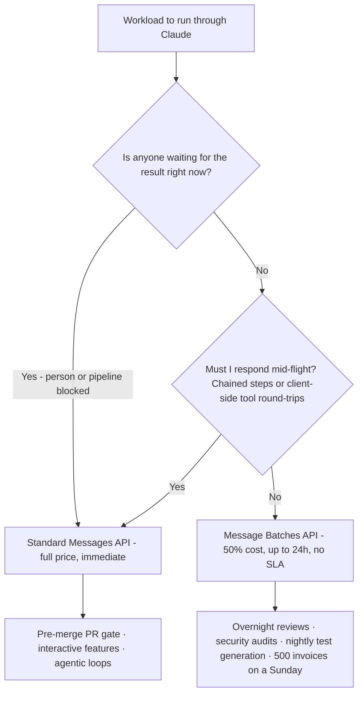
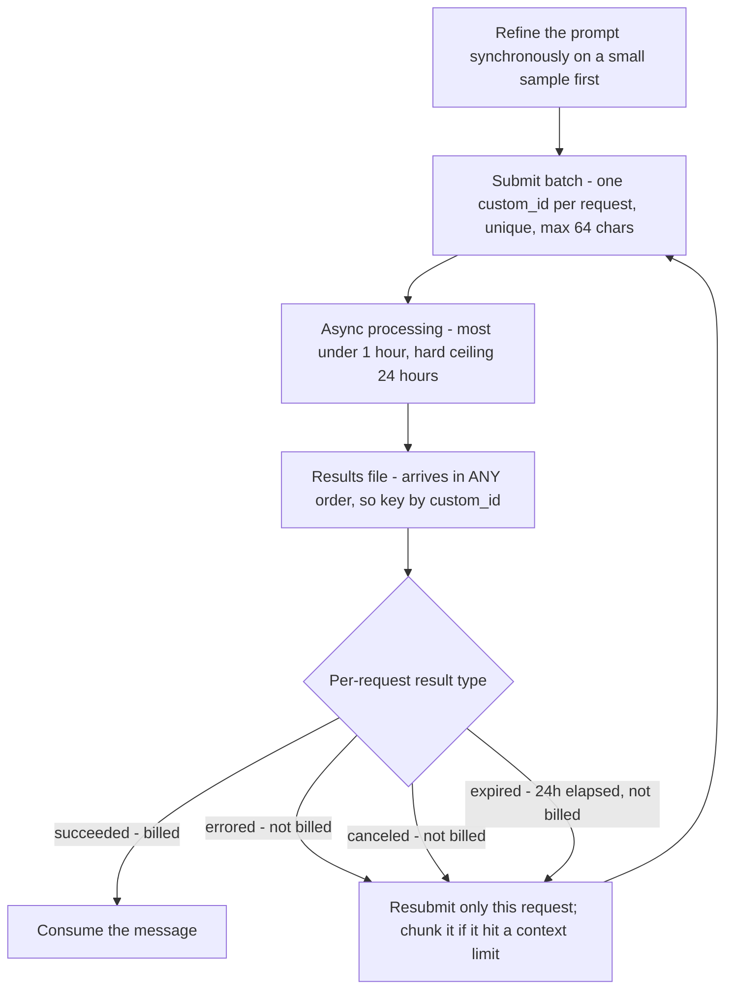
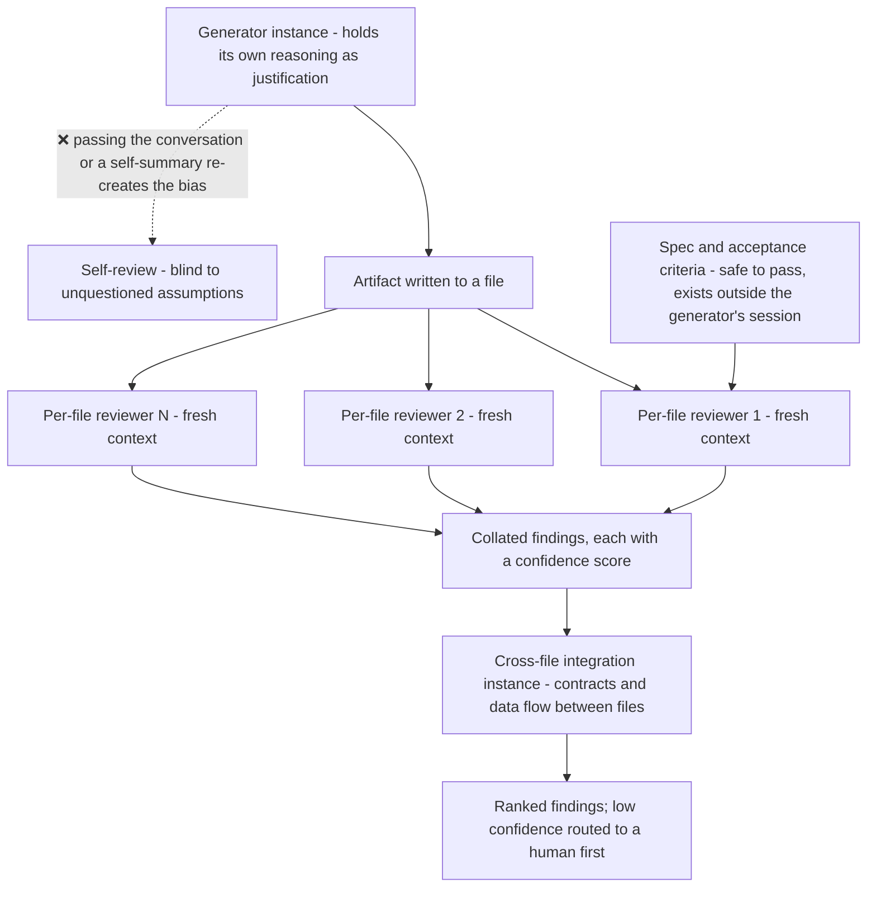

---
tags:
  - CCA-F
  - domain-4
  - batch-processing
  - code-review
  - multi-instance
  - youtube-course
date: 2026-08-05
status: done
domain: "4 of 5"
source: "Peace Of Code — Claude Certified Architect Ep 17"
---

# 📦 EP17 — Batch API & Multi-Pass Review

> [!NOTE] Exam Coverage
> Maps to **Domain 4 — Prompt Engineering & Structured Output**, task statements **4.5** (batch processing strategies) and **4.6** (multi-instance and multi-pass review architectures) — the two statements that close out Module 4. Covers the Message Batches API's cost/latency trade, the batch-versus-standard decision rule, `custom_id` correlation, what batch genuinely cannot do, why self-review by the same instance fails, independent review instances, and the per-file-then-cross-file review architecture.

**Back to:** [[CCA-F Study Roadmap]] · **Domain note:** [[D4 - Prompt Engineering & Structured Output]] · **Deck:** [[EP17 - Flashcards]]
**Source:** [Peace Of Code — Ep 17 (34 min)](https://www.youtube.com/watch?v=BXs7QoLQxX0) · Level: college / professional-certification · Question mix calibrated MCQ-heavy (40 / 40 / 20)
**Previous:** [[EP16 - Structured Output & JSON Schema]]

---

## 1. Outline

- [1. Outline](#1-outline)
- [2. Key Terms](#2-key-terms)
- [3. Concept Summaries](#3-concept-summaries)
  - [3.1 The Cost Problem — Who Is Actually Waiting](#31-the-cost-problem--who-is-actually-waiting)
  - [3.2 The Message Batches API](#32-the-message-batches-api)
  - [3.3 What Batch Actually Cannot Do](#33-what-batch-actually-cannot-do)
  - [3.4 The Batch Decision Rule](#34-the-batch-decision-rule)
  - [3.5 custom_id — Correlation, Not Convenience](#35-custom_id--correlation-not-convenience)
  - [3.6 Limits, Result Types, and Expiry](#36-limits-result-types-and-expiry)
  - [3.7 Designing Around the No-Iteration Constraint](#37-designing-around-the-no-iteration-constraint)
  - [3.8 The Self-Review Trap](#38-the-self-review-trap)
  - [3.9 Independent Review Instances](#39-independent-review-instances)
  - [3.10 The Summary Shortcut and Its Hazard](#310-the-summary-shortcut-and-its-hazard)
  - [3.11 Multi-Pass Architecture — Depth Then Breadth](#311-multi-pass-architecture--depth-then-breadth)
  - [3.12 The Two-Pipeline Synthesis](#312-the-two-pipeline-synthesis)
- [4. Diagrams](#4-diagrams)
- [5. Worked Examples](#5-worked-examples)
- [6. Practice Questions](#6-practice-questions)
- [7. Cheat Sheet](#7-cheat-sheet)

---

## 2. Key Terms

| Term | Definition | Source |
|---|---|---|
| **Message Batches API** | Asynchronous bulk endpoint: submit many Messages requests, collect results later, at **50% of standard pricing**. *"Same model, same output quality, just slash it by 50%."* | [02:25] |
| **The 50% dilemma** | The host's name for the trade. *"The dilemma is you have to wait. That is the thing."* Cost is bought with latency tolerance. | [03:07] |
| **Processing window** | Results are available when all requests finish **or after 24 hours, whichever comes first**. Most batches complete in **under 1 hour**. | [08:14] |
| **No latency SLA** | There is no guaranteed delivery time inside the window. *"It might get processed in 10 minutes, it might get processed in 23 hours 59 minutes."* | [09:48] |
| **`custom_id`** | The unique per-request identifier used to correlate a result back to its request. Required, `^[a-zA-Z0-9_-]{1,64}$`. | [14:24] |
| **Out-of-order results** | Batch results *"can be returned in any order"* and may not match submission order — the reason `custom_id` is mandatory rather than convenient. | *(expansion — §3.5)* |
| **Result types** | Every request ends as `succeeded`, `errored`, `canceled`, or `expired`. You are **not billed** for the last three. | *(expansion — §3.6)* |
| **`expired`** | The 24-hour window elapsed before the request reached the model. Under heavy demand *"you may see more requests expiring."* | *(expansion — §3.6)* |
| **Blocking workflow** | A pipeline or person is actively waiting on the result — a pre-merge PR gate, an interactive feature. The disqualifying condition for batch. | [19:30] |
| **The batch decision rule** | Two questions: *"is anyone waiting for the result right now?"* and *"does this need multiple back and forth turns with tools?"* Either yes → standard API. | [10:56] |
| **Self-review trap** | *"A Claude instance reviewing its own output retains its original conversation history and reasoning context."* Same session ⇒ biased review. | [20:46] |
| **Independent review instance** | A fresh session with no generation context. *"Instance A writes the code… instance B is in a separate session, and it reviews them."* | [22:58] |
| **Attention dilution** | Why one instance reviewing many files fails: reviewing 10+ files at once produces shallow and contradictory findings. | *(expansion — §3.11)* |
| **Per-file pass (depth)** | Parallel independent instances, each reviewing one file deeply — *"deep focus on style, bugs, and security."* | [25:26] |
| **Cross-file pass (breadth)** | A synthesizing instance over the collated findings, checking *"if the authentication service with the cart service is working or not."* | [26:00] |
| **`confidence` field** | Emitted alongside each finding to enable **calibrated review routing** — low-confidence findings go to a human first. | *(expansion — §3.11)* |
| **Sample-set refinement** | Refine the prompt synchronously on a small sample *before* submitting a large batch, because you cannot iterate mid-batch. | *(expansion — §3.7)* |

---

## 3. Concept Summaries

### 3.1 The Cost Problem — Who Is Actually Waiting

*Question: your CI pipeline reviews every PR with Claude at full price. What question determines whether you're overpaying?*

Not "how much does this cost" but **"who is waiting for it."** The host's framing of the scenario is the useful part, because it locates the waste precisely:

> *"Half of them are opened at the end of the day and no one's looking at them like tomorrow morning… all your tests and reviews are all generated real time, but nobody is having a look at it."*

His second example sharpens it — a *"nightly test generation pipeline"* that writes tests for every file changed that week: *"you are paying full price and nobody is waiting around for those results in real time."* The QA who reads them arrives tomorrow.

That is the whole insight of the first half of the episode. **Latency you don't need is latency you're paying for.** Real-time delivery is a premium feature, and the host's restaurant analogy earns its place: standard messaging is ordering at a restaurant — *"the kitchen makes it right now, and you get it fast… you're paying full price because you're getting immediate attention."* The Batches API is a catering order placed in advance, made when the kitchen has spare capacity.

The mechanism behind the discount is capacity smoothing, and the host states it correctly: *"Anthropic processes them when there is spare capacity, because you are flexible on the timing, so you get a generous 50% discount."* You are not buying a cheaper model or a worse answer — the model and output quality are identical. You are selling your scheduling flexibility back to the provider.

**In your own words:** The question isn't cost, it's who's waiting. Real-time is a premium you pay on every call; batch is a 50% refund for giving up scheduling control on work nobody is watching.

*See PQ 1, 2.*

---

### 3.2 The Message Batches API

*Question: what exactly do you submit, and what do you get back?*

A list of independent Messages requests, each tagged with a `custom_id`, processed asynchronously. Three properties are the exam-checkable core, and the host names all three:

| Property | Value |
|---|---|
| **Cost** | 50% of standard API pricing on all token usage |
| **Window** | Results when all requests finish, **or after 24 hours, whichever first** |
| **Latency SLA** | None — no guaranteed delivery time inside the window |

The host is careful about what "up to 24 hours" means, and the care is warranted because the phrase invites two opposite misreadings:

> *"It might get processed in 10 minutes, it might get processed in 12 hours, it might get processed in 23 hours 59 minutes. So that is the maximum time it will take, not more than that. Don't think that it is going to take a week or something."*

Correct — 24 hours is a ceiling, not an estimate. But the ceiling is not the typical case either, and that matters for capacity planning:

> [!IMPORTANT] Plan for 24 hours; expect under one — expansion
> Officially: *"The system processes each batch as fast as possible, with most batches completing within 1 hour."* The 24-hour figure is the **expiry boundary**, not the expected latency.
> Both numbers are load-bearing and they answer different questions. **Design** against 24 hours — that's the worst case your SLA math must absorb (§3.7). **Expect** under an hour — that's what your dashboards should show, so a batch still running at hour six is a signal, not business as usual. Note the docs' caveat too: under high demand *"processing may be slowed down… you may see more requests expiring after 24 hours."*
> Source: https://platform.claude.com/docs/en/build-with-claude/batch-processing

The submission model is fire-and-forget, which the host captures well: *"you send a ton of messages at once and then you forget, basically. Now, when it comes back, that's it."* That property — not any missing feature — is what drives the decision rule in §3.4.

**In your own words:** Submit N independent requests, each with a `custom_id`, get results within 24 hours at half price and no SLA. Design for 24 hours, expect under one.

*See PQ 3, 4, 5.*

---

### 3.3 What Batch Actually Cannot Do

*Question: the lecture says batch is "single-turn only, no multi-turn tools." Is that right?*

No — and this is the episode's central factual error, repeated in the summary slide. The vault already records the correct position, and official docs confirm the vault.

> [!WARNING] "Batch supports single-turn only / no multi-turn tool calling" — the lecture is wrong; docs confirm the vault
> The lecture states it repeatedly: *"Tool calling, multi-turn is supported. But it only supports single-turn"* [09:59], and in the closing quick-reference: *"batch API tools single turn only, no multi-turn tools"* [33:04].
> Officially, **tool use and multi-turn conversations are both explicitly supported inside a batch request.** The docs' *"What can be batched"* list reads: *"Almost any request you can make to the Messages API can be included in a batch. This includes: Vision · **Tool use, including all server tools** (web search, web fetch, code execution, MCP connectors, advisor, and tool search) · System messages · **Multi-turn conversations** · Extended thinking · Most beta features."*
> The complete set of **unsupported** parameters is short and specific: `stream: true`, `speed` (fast mode), `store` / `previous_thread_event_id` (threads), `cache_hint` / `context_hint`, `max_tokens: 0`, and `research_preview_2026_02`. Tool use is not among them.
> **Exam answer: multi-turn conversations and tool use ARE supported in batch.** Real code: the same. What you cannot do is drive an **interactive, client-executed** tool round-trip — and that's a property of *any* single Messages call, not a batch-specific gap.
> Source: https://platform.claude.com/docs/en/build-with-claude/batch-processing · consistent with [[D4 - Prompt Engineering & Structured Output]] § 4.5, which already flags exactly this

So what *is* the real constraint? It's architectural, not a feature gap — and it's worth stating precisely because the lecture's **conclusion** is right even though its **reason** is wrong:

- A **server-side** tool (web search, code execution) runs inside the server's own loop during the request. Batch handles this fine — the request goes in, the loop runs, the finished answer comes out.
- A **client-executed** tool requires a round trip: the model returns a `tool_use` block, *your* code runs the function, and you send a `tool_result` back in a **new API request**. Batch is fire-and-forget: you submit, you cannot inject anything mid-flight, and each request yields exactly one result.

That's why an agentic loop with client-side tools can't be *driven* by a batch submission — not because batch "lacks tool support," but because you're not there to answer it. The host's own example is the right one for the right reason: *"your agent or your sub-agent does multiple tool calls and it needs the results of the tool immediately… the agentic loop always works on the mechanism of feedback."* The loop needs a participant; batch has no participant.

Two things the lecture gets right and one bonus:

- **Streaming genuinely isn't supported.** The transcript garbles it — *"Streaming is supported is not supported"* [10:36] — but the conclusion is correct, and the docs give the reason: *"Batch results come back as a single file, not a stream."* The Python SDK encodes it in the type name: batch params are `MessageCreateParamsNonStreaming`.
- **No SLA** — correct.
- **Batch is not merely a weaker sync API.** *"Extended output is available on the Message Batches API only, not the synchronous Messages API."* There is at least one capability batch has that sync doesn't. **(expansion)**

**In your own words:** Tool use and multi-turn *are* supported — the lecture is wrong. The real limit is that you can't answer a client-side tool call mid-flight, because batch is fire-and-forget. Streaming is genuinely out.

*See PQ 6, 7, 15.*

---

### 3.4 The Batch Decision Rule

*Question: two questions that settle 90% of exam items on this. What are they?*

The host offers exactly that framing — *"a simple rule of thumb to answer 90% of the exam questions"* — and the two questions are:

1. **Is anyone waiting for the result right now?** If yes → standard API.
2. **Does this need multiple back-and-forth turns with tools?** If yes → standard API.

Only if both are *no* does batch apply. His worked reasoning on the first is the one the exam dramatises:

> *"Your CI/CD single run cannot run for 23 hours, right? That doesn't make sense… your GitHub Actions will time out in that time."*

That's the anti-pattern in its canonical form, and he scripts the exam question almost verbatim: reviews currently **block the PR merge**, and a developer proposes batch to cut cost. *"The concern is batch API has no guaranteed delivery."* A blocking gate plus an unbounded-within-24h wait is a broken pipeline, and no amount of savings redeems it.

The second question needs restating in light of §3.3, because the lecture's phrasing bakes in the error. Read it as: **does completing this task require *me* to respond mid-flight?** Chained CI steps where one step's output feeds the next, and agentic loops with client-side tools, both qualify — not because batch can't call tools, but because batch can't wait for you.

Good batch fits, from the lecture: *"overnight code review reports, security audits, nightly test generation, processing 500 invoices on a Sunday."* The common shape is that each unit of work is **independent** and **nobody is blocked**.

> [!TIP] The exam plants the word "real time" as a decoy
> The host flags this on his own sample question: *"Pipeline extracts sentiment topics from 2,000 customer feedback forms weekly in real time. Team wants to reduce cost using a nightly batch. Each form is independent. No tools are needed."*
> *"The thing that will confuse you is this real time."* The phrase describes how forms are **collected**, not when they must be **processed**. The decisive signals are *nightly batch*, *each form is independent*, and *no tools needed* — an excellent fit. Read what the words attach to, not just whether they appear.

**In your own words:** Is anyone waiting? Does it need me mid-flight? Either yes → standard. Both no → batch. And "real time" in a stem often describes collection, not processing.

*See PQ 8, 9, 16, 17.*

---

### 3.5 custom_id — Correlation, Not Convenience

*Question: why is `custom_id` required rather than merely helpful?*

Because **results come back in an arbitrary order** — a fact the lecture never states, and the actual reason positional matching is impossible.

The host's analogy is sound as far as it goes: a shipment full of parcels needs an address per parcel, *"because the address is always unique for a particular person."* And his exam tip is correct: *"if a question asks about correlating batch request response pairs, the answer is always `custom_id`."* But the mechanism is left implicit, and the mechanism is what makes it non-negotiable:

> [!IMPORTANT] Results may not match input order — this is why `custom_id` is mandatory
> Officially: *"Batch results can be returned in any order, and may not match the ordering of requests when the batch was created… To correctly match results with their corresponding requests, always use the `custom_id` field."* The docs' own example returns the second request's result before the first.
> So `custom_id` is not a labelling nicety you could skip by tracking positions — **there is no position to track.** Any code that zips a results array against a submitted-requests array is broken, and will be *intermittently* broken, which is worse.
> Format: required, unique within the batch, `^[a-zA-Z0-9_-]{1,64}$`.
> Source: https://platform.claude.com/docs/en/build-with-claude/batch-processing · consistent with [[D4 - Prompt Engineering & Structured Output]] § 4.5

> [!WARNING] "That batch will have one customer ID" — `custom_id` is per request, not per batch
> At [15:17] the host describes a nightly submission of code files and says *"that will have one customer ID,"* then a second submission of `.java` files for test generation as another. He self-corrects moments later — *"each of this request will be associated with a particular customer ID"* [15:54] — but the first framing is a real conceptual error worth naming, because it inverts the granularity.
> **One `custom_id` per request, unique within the batch.** The batch itself already has a server-assigned ID (`msgbatch_…`) that you poll with; `custom_id` exists at the request level precisely so you can demultiplex the results file.

On the UUID advice, the lecture's guidance is right but its reason isn't. He says not to use random UUIDs because *"it might get lost or you might get confused."* A UUID correlates perfectly well provided you persist the mapping — correctness isn't the issue. The docs give the real justification: *"Use meaningful `custom_id` values to easily match results with requests, since order is not guaranteed."* It's an **operability** argument. A results file keyed `pr-4127-src-auth-service-ts-v3` is debuggable at 3am; one keyed `f47ac10b-58cc-…` requires a database round trip to interpret. His concrete suggestions — PR number, file path, version — are good ones.

**In your own words:** Results arrive in any order, so there is no position to match on — `custom_id` is the only correlation key. One per request, unique, ≤64 chars. Meaningful IDs are about debuggability, not correctness.

*See PQ 10, 11, 18.*

---

### 3.6 Limits, Result Types, and Expiry

*Question: the batch came back. Every request "completed." Did they all succeed?*

No — "processing ended" and "succeeded" are different states, and the lecture never covers the difference. This is the operational half of batch and it's fair exam territory.

> [!IMPORTANT] Four result types, and what you're billed for — expansion
> Every request in a batch ends in exactly one of these:
>
> | Type | Meaning | Billed? |
> |---|---|---|
> | `succeeded` | Request completed; includes the message result | Yes |
> | `errored` | Invalid request or internal server error; no message created | **No** |
> | `canceled` | You canceled the batch before this request reached the model | **No** |
> | `expired` | The **24-hour window elapsed** before this request reached the model | **No** |
>
> `request_counts` on the batch object gives the tally across all four. The billing asymmetry is worth remembering: a batch that half-expires costs you only what actually ran.
> Source: https://platform.claude.com/docs/en/build-with-claude/batch-processing

`expired` deserves attention because it's the failure mode unique to batch and it interacts with load: *"processing may be slowed down based on current demand and your request volume. In that case, you may see more requests expiring after 24 hours."* So the 24-hour ceiling isn't only a latency bound — under contention it's a **partial-failure bound**. A pipeline that submits 100,000 requests and assumes 100,000 results will eventually be wrong.

The remaining limits, none of which the lecture states (it says only *"up to thousands, or more than that"*): **(expansion)**

- **100,000 requests or 256 MB** per batch, whichever is reached first
- **Results available for 29 days** after creation; afterwards the batch is still viewable but results aren't downloadable
- **Workspace-scoped** — you see batches created within your API key's workspace
- **`max_tokens` must be ≥ 1**; `max_tokens: 0` (cache pre-warming) is rejected inside a batch
- **Prompt caching works but is best-effort** — because requests process concurrently and in any order, cache hits are not guaranteed

[[D4 - Prompt Engineering & Structured Output]] § 4.5 supplies the recovery procedure: identify failures by `custom_id`, **resubmit only the failed requests** rather than the whole batch, and if a request failed on a context limit, chunk that document before resubmitting. Note how this closes the loop with §3.5 — resubmitting selectively is only possible *because* `custom_id` tells you which ones failed.

**In your own words:** Four end states — `succeeded`, `errored`, `canceled`, `expired` — and you're only billed for the first. `expired` means the 24h window ran out, and gets more likely under load. Resubmit only the failures, keyed by `custom_id`.

*See PQ 12, 18.*

---

### 3.7 Designing Around the No-Iteration Constraint

*Question: you can't refine a prompt mid-batch. So when do you refine it?*

Before. Synchronously. On a sample.

The host establishes the constraint clearly — *"you send a ton of messages at once and then you forget… you can't interact it again and again in a loop"* — but doesn't draw the design consequence. [[D4 - Prompt Engineering & Structured Output]] § 4.5 does, and it's the natural pairing:

> **Run prompt refinement on a sample set first** before batch-processing large volumes — maximize first-pass success rate, because iterative resubmission is what costs you.

The economics make this sharper than it first appears. A 50% discount on a batch you have to run twice is a **25% premium** over getting it right once synchronously. The discount rewards preparation and punishes guessing, so the workflow inverts relative to interactive development: iterate on 20 documents at full price until the output is clean, *then* submit 20,000 at half price. Everything EP16 taught about schema design and validation gates is load-bearing here, because a batch gives you exactly one attempt per request. **(expansion, building on § 4.5)**

The second design consequence is scheduling, and D4 § 4.5 gives the pattern the exam uses:

> **SLA calculation:** a 30-hour SLA with a 24-hour batch window means you must submit within **6-hour** windows — $30 - 24 = 6$ hours of maximum tolerable delay before the batch starts.

That arithmetic is the whole trick, and it generalises: **your submission cadence must be your SLA minus the full 24-hour window**, never minus the expected completion time. Budgeting against "most batches finish in an hour" is how you build a pipeline that meets its SLA on a quiet Tuesday and breaches it under load — precisely the condition §3.6 warns raises expiry rates. Worked in full as Example 1.

**In your own words:** One attempt per request means refine before you submit — sample synchronously, then batch. And schedule against the 24-hour ceiling, never the typical hour.

*See PQ 13, 14.*

---

### 3.8 The Self-Review Trap

*Question: you ask the instance that wrote the code to review it carefully. Why doesn't that work?*

Because carefulness isn't the missing ingredient — **independence** is. The host's statement of the mechanism is precise and matches the vault:

> *"A Claude instance reviewing its own output retains its original conversation history and reasoning context."*

The reasoning that produced the code is still in context, and it reads as justification. The instance doesn't merely remember its decisions; it remembers *why they were right*. Asking it to check its work invites it to re-derive the same conclusions from the same premises.

His developer/QA analogy carries the point well, and his example is a good one because it's a class of bug self-review structurally misses:

> *"The developer might miss some things because he has the reasoning that he has written the best code… which is why we have separate QAs. So which kind of do some reasoning that the birth date cannot be in negative numbers, but the developer is allowing negative numbers."*

A negative birth date is not a coding error — it's an *unquestioned assumption*. The author never considered the input because their model of the problem excluded it, and that model is exactly what persists in session context. A reviewer without the model asks the question naturally.

> [!IMPORTANT] What does *not* fix self-review bias
> [[D4 - Prompt Engineering & Structured Output]] § 4.6 lists the distractors explicitly, and they are the wrong answers on this exam item:
> - ❌ Adding *"review your own work carefully"* instructions
> - ❌ Extended thinking — more reasoning from the same premises
> - ✅ An **independent review instance** with no prior reasoning context
>
> The host reaches the same place: *"the answer involves splitting the review into independent instances, not prompting the same instance to review more carefully or double-check this work."* Note that extended thinking is the subtler distractor and the lecture doesn't mention it — deeper reasoning over a biased context produces a more thoroughly argued blind spot, not a fixed one.

**In your own words:** The generator keeps its reasoning in context, where it functions as justification. The gap is unquestioned assumptions, and neither "be careful" nor extended thinking reaches them — only a fresh context does.

*See PQ 4, 5, 6.*

---

### 3.9 Independent Review Instances

*Question: what does the fix actually look like?*

Two sessions, one artifact between them. *"Instance A writes the code, it outputs it into a file, and then instance B is in a separate session, and it reviews them."*

The essential detail is that the handoff is **the artifact, not the conversation**. Instance B reads the file. It does not inherit A's messages, A's justifications, or A's framing of what the problem was. The host describes the result exactly: *"when you start a new session, it will basically start fresh. It doesn't know anything about your code or whatever it has implemented… it will review your code with a fresh mind."*

That is the same architectural move as [[EP03 - Subagent Context Passing & Session Management]]'s context isolation, applied to review rather than delegation: the value of the second instance *is* its ignorance. Anything you do to reduce that ignorance reduces the review's worth — which is what makes §3.10's cost optimization delicate.

**In your own words:** Generator writes to a file; a separate session reviews the file. The handoff is the artifact, never the conversation — the reviewer's ignorance is the feature.

*See PQ 5, 6, 7.*

---

### 3.10 The Summary Shortcut and Its Hazard

*Question: fresh sessions re-read everything and cost tokens. Can you seed the reviewer with a summary instead?*

Yes — but *which* summary decides whether you've optimized the pattern or defeated it. The host poses this as an exercise, and it's a good one:

> *"You previously told us do not start unnecessary sessions, it will cost you a lot. Yes, you are right… But what can you do to reduce costs in this case?… Maybe you can use some kind of summarization or compact or some kind of explore sub agent."*

The instinct is sound — [[EP18 - Why AI Agents Forget (Context Engineering)]] territory, and a summarizer subagent is a real tool. But there's a hazard the lecture doesn't flag:

> [!IMPORTANT] Summarize the requirements, not the generator's reasoning
> If the **generator** produces the summary, its reasoning bias travels into the reviewer inside that summary — and you have reconstructed the self-review trap through a side channel. A summary that says *"handles all date edge cases correctly"* pre-answers the exact question §3.8's negative-birth-date reviewer was supposed to ask.
> The host's own analogy points the right way and his mechanism points the wrong way. He says: *"The developer has the complete nitty-gritty on how the code is developed. But instead, the QA has complete functional knowledge."* Exactly — a QA is briefed on **what the feature is supposed to do**, not on how the developer feels about their implementation.
> **Safe:** the spec, requirements, ticket, acceptance criteria, and the artifact itself — all things that exist independently of the generator's session. **Unsafe:** the generator's narrative of its own work, its self-assessment, or a compaction of its reasoning trace.
> Consistent with [[D4 - Prompt Engineering & Structured Output]] § 4.6's *"no prior reasoning context."*

Read that way, the cost saving survives: you're not paying the reviewer to rediscover the requirements, you're just refusing to pay it to inherit an opinion. The cheapest correct brief is the one a human QA gets — here's what it should do, here's what was built, go.

**In your own words:** Seed the reviewer with the spec and the artifact — never with the generator's account of its own work, which smuggles the bias back in. Brief it like a QA, not like a handover.

*See PQ 7, 8.*

---

### 3.11 Multi-Pass Architecture — Depth Then Breadth

*Question: one instance reviewing a 40-file PR gives shallow feedback and misses cross-file bugs. What replaces it?*

Two passes: parallel per-file instances, then one integration instance over the collated findings.

**Pass 1 — per-file (depth).** Independent instances in parallel, each with *"deep focus on style, bugs, and security"* on a single file. Parallelism is a cost/latency win, but the reason for splitting is quality:

> [!IMPORTANT] Why splitting works — attention dilution — expansion
> [[D4 - Prompt Engineering & Structured Output]] § 4.6: *"Reviewing 10+ files simultaneously causes attention dilution and contradictory findings. Splitting maintains focus."*
> This is the mechanism the lecture leaves out, and it matters because it explains why the fix is *architectural*. Shallow feedback on a 40-file diff is not an instruction-following failure — a single context holding 40 files has finite attention to distribute, so "be more thorough" cannot buy depth it has no room for. Splitting is what creates the room. Compare EP14 § 3.3: vague instructions don't fix a structural problem.

**Pass 2 — cross-file (breadth).** One instance receives all findings and checks whether the pieces work as a whole. The host's example is the clearest thing in this section: an auth service and a cart service each have their own unit tests, but *"the integration test will make sure that the authentication service with the cart service is working or not, because if a user is not authenticated, the user should not be able to add the products to the cart."* Per-file review cannot see that contract — it lives between files.

> [!IMPORTANT] Settle the depth/breadth mapping — the host waffles on it
> He assigns the labels three times and admits confusion: *"This is the breadth and this is the depth"* [27:36], then *"per file reviews gives you depth, cross file reviews gives you breadth"* [28:04], then *"per file passes plus cross-file integration will give you both breadth and depth or depth and breadth. Yeah, might get confused a little bit here"* [33:38].
> **The correct mapping is per-file = depth, cross-file = breadth.** Per-file goes *deep* into one unit; cross-file spans *broadly* across many. The section title *"Depth Then Breadth"* is right, and so is his own exam sample answer: *"split into independent per file instances for **depth** followed by an integration pass for cross-file **breadth**"* [32:22]. Trust the title and the sample answer, not the ad-libbed slide pointing.
> Consistent with [[D4 - Prompt Engineering & Structured Output]] § 4.6 — Pass 1 per-file local analysis, Pass 2 cross-file integration.

His human analogy closes it: an architect reviewing a PR *"will check if individual files are correct, and they will check, okay, this whole feature as a feature has been integrated or not."*

One refinement the lecture doesn't reach, which makes the two-pass output actionable rather than just voluminous:

> [!IMPORTANT] Emit `confidence` per finding for calibrated routing — expansion
> [[D4 - Prompt Engineering & Structured Output]] § 4.6 recommends attaching a `confidence` score (and brief `reasoning`) to each finding, then **routing low-confidence findings to human review first**.
> This matters most in a multi-pass design, because pass 1 produces findings from N instances with no shared bar. A confidence field gives pass 2 something to rank and dedupe on, and gives you a triage lever that isn't "read all 200 findings." It's the structured-output discipline from EP16 applied to review output — and it pairs with EP14's precision argument: the goal was never more findings, it was findings a human will actually read.

**In your own words:** Per-file parallel instances for depth, then one integration instance for breadth. Splitting fixes attention dilution, which instructions can't. Add `confidence` so pass 2 can rank.

*See PQ 9, 10, 11, 17.*

---

### 3.12 The Two-Pipeline Synthesis

*Question: assemble both halves of the episode into one architecture.*

Two pipelines, differing only in API choice — and the choice follows from §3.4's decision rule, not from preference.

| | **PR pipeline** | **Nightly pipeline** |
|---|---|---|
| Trigger | PR opened or updated | Midnight cron |
| Work | Multi-pass review — per-file, then cross-file | Test generation, full-codebase security audit, doc generation |
| Blocked? | Yes — the merge gate waits | No — read tomorrow |
| API | **Standard** | **Batch** |
| Trade | Results in minutes, higher cost | 50% cost, ≤24h, no SLA |

The host's own summary of what stays constant across both is the line to keep: *"every review instance across both pipelines is an independent instance. No self-review anywhere."* Independence is orthogonal to batch-versus-standard. Batch is a **latency/cost** decision; independent instances are a **correctness** decision. A nightly batch audit still needs fresh reviewer sessions, and a blocking PR gate still can't self-review.

He also notes the PR pipeline must be standard for a second reason beyond blocking: it *"includes prior review findings in the new prompts to avoid duplicate comments,"* which means a step consumes a previous step's output — the chained-dependency case from §3.4. He points to the CI/CD episode for detail; that's [[EP13 - Claude Code CI-CD Pipelines]] (he guesses *"episode number 11 or 12, I don't remember"*).

**In your own words:** Same review architecture, two API choices. Batch/standard is a latency decision; independent instances is a correctness decision. Neither substitutes for the other.

*See PQ 16, 17, 18.*

---

## 4. Diagrams

*The two-question rule. Either "yes" disqualifies batch; both "no" and it fits.*

*The batch lifecycle. Out-of-order results are why `custom_id` is mandatory, and why selective resubmission is possible.*

*Depth then breadth. Every reviewer starts clean, and only generator-independent context crosses the boundary.*

---

## 5. Worked Examples

### Example 1 — Submission cadence under an SLA

**Task:** Compliance requires every uploaded contract to be analysed within **30 hours** of upload. You want batch pricing. How often must you submit, and what happens if you size the cadence against typical completion time instead?

1. **Identify the guaranteed-worst-case processing time.** *(why: §3.2 — the 24-hour figure is the expiry boundary, the only number the provider commits to. "Most batches complete within 1 hour" is an expectation, not a guarantee.)*
   $$T_{\text{process}}^{\max} = 24 \text{ hours}$$
2. **Solve for the maximum tolerable pre-submission delay.** *(why: §3.7 — a document uploaded just after a batch closes waits the full cadence interval before processing even begins.)*
   $$T_{\text{wait}}^{\max} = \text{SLA} - T_{\text{process}}^{\max} = 30 - 24 = 6 \text{ hours}$$
3. **Set the cadence.** *(why: worst case is upload-just-missed-the-cutoff, so the interval itself is the maximum wait.)* Submit every **6 hours** — four batches a day.
4. **Test the naive alternative.** *(why: §3.6 — this is the failure that only appears under load, which is the worst kind.)* Budgeting against a 1-hour expectation gives $30 - 1 = 29$ hours, so you'd submit daily. A batch that takes its full 24 hours then delivers at $24 + 24 = 48$ hours.
   $$48 \text{ hours} > 30 \text{ hours} \quad \Rightarrow \quad \text{SLA breached}$$
5. **Note the compounding risk.** *(why: §3.6 — under high demand more requests expire at the 24-hour mark, so the slow case and the partial-failure case arrive together.)* The daily-cadence design breaches exactly when contention is highest.

**Answer:** Submit every **6 hours** ($\text{SLA} - 24\text{h}$). The trap in step 4 is sizing against expected rather than guaranteed latency: it passes every test on a quiet day and breaches under load, when expiry risk also peaks. **Always subtract the full 24-hour window.**

---

### Example 2 — Classifying five workloads

**Task:** Batch or standard? Apply the two-question rule to each.

1. **Pre-merge PR review that blocks the merge.** *(why: §3.4 — question 1 is an immediate yes; the pipeline is the thing waiting.)* → **Standard.** A GitHub Actions run cannot sit for 23 hours.
2. **Nightly test generation for every file changed this week.** *(why: §3.4 — nobody reads them until morning, each file is independent, no mid-flight response needed.)* → **Batch.** The canonical fit.
3. **An agent loop calling client-side tools and acting on each result.** *(why: §3.3 — not because batch lacks tool support, which it has, but because the loop needs *you* to return `tool_result`s and batch is fire-and-forget.)* → **Standard.**
4. **2,000 weekly feedback forms, collected in real time, processed on a nightly batch, independent, no tools.** *(why: §3.4's decoy — "real time" attaches to collection; the processing signals are "nightly," "independent," "no tools.")* → **Batch.** 50% on 2,000 requests.
5. **One request that uses server-side web search to research a topic, results needed tomorrow.** *(why: §3.3 — server-side tools run inside the server's own loop during the request, and the docs list tool use as batchable. Nobody is waiting.)* → **Batch.** A workload most people wrongly exclude because of the "no tools in batch" myth.

**Answer:** Standard for 1 and 3; batch for 2, 4, and 5. Item 5 is the discriminator: getting it right requires knowing §3.3's correction — server-side tool use is fully batchable, and only an *interactive client-side* round trip forces standard.

---

### Example 3 — Cost of getting the prompt wrong

**Task:** 20,000 documents to extract. Standard pricing would be \$400. Compare (a) submitting straight to batch with an unrefined prompt that yields a 70% first-pass success rate, versus (b) refining on a 20-document sample synchronously first, reaching 98%.

1. **Baseline batch cost at 50%.** *(why: §3.2 — the discount applies to all token usage.)*
   $$C_{\text{batch}} = 400 \times 0.5 = \$200$$
2. **Path (a), first pass.** *(why: you pay for everything submitted, whether or not the output is usable.)*
   $$C_{a,1} = \$200, \qquad \text{usable} = 14{,}000, \qquad \text{to redo} = 6{,}000$$
3. **Path (a), resubmission.** *(why: §3.6 — resubmit only the failures, keyed by `custom_id`.)*
   $$C_{a,2} = 200 \times \tfrac{6000}{20000} = \$60 \quad\Rightarrow\quad C_a = 200 + 60 = \$260$$
4. **Add the second 24-hour window.** *(why: §3.7 — a redo isn't just money, it's another full window, which may breach an SLA sized for one.)* Wall-clock to completion doubles to up to 48 hours.
5. **Path (b), sample refinement cost.** *(why: refinement must be synchronous — you need the iteration batch can't give you.)*
   $$C_{b,\text{sample}} = 400 \times \tfrac{20}{20000} = \$0.40 \text{ per pass} \times 5 \text{ passes} \approx \$2$$
6. **Path (b), total.** *(why: 98% first-pass leaves 400 documents to redo.)*
   $$C_b = 2 + 200 + \left(200 \times \tfrac{400}{20000}\right) = 2 + 200 + 4 = \$206$$

**Answer:** \$260 and up to 48 hours versus \$206 and one window — refinement pays for itself roughly $27\times$ over. The general result is the one to carry: **a 50% discount on work you run twice is a 25% premium over running it once at full price.** Because batch gives you exactly one attempt per request, the discount rewards preparation and punishes guessing, which is why §3.7's sample-set step is architecture rather than hygiene.

---

## 6. Practice Questions

**1.** What are the Batch API's three defining characteristics? *(§3.2)*

Answer

**50% cost savings**, a processing window of up to **24 hours** (results when all complete or at 24h, whichever first), and **no latency SLA** — no guaranteed delivery time inside the window.

**2.** The discount isn't a cheaper model. What are you actually selling? *(§3.1)*

Answer

**Scheduling flexibility.** Same model, same output quality — Anthropic processes the work when spare capacity exists. Real-time delivery is the premium feature; giving it up is what earns the 50%.

**3.** "Up to 24 hours" — is that the expected completion time? *(§3.2)*

Answer

**No — it's the ceiling and the expiry boundary.** Most batches complete in **under 1 hour**. Design your SLA math against 24 hours; expect under one operationally. Under heavy demand, more requests expire at the 24-hour mark.

**4.** Why does asking the generating instance to "review your work carefully" fail? *(§3.8)*

Answer

Because it **retains its original conversation history and reasoning context**, where that reasoning functions as justification. The gap is *unquestioned assumptions* — the model never considered the input its framing excluded — and re-reading with the same framing can't surface them.

**5.** Name the two non-solutions and the one solution to self-review bias. *(§3.8)*

Answer

❌ "Review your own work carefully" instructions. ❌ **Extended thinking** — deeper reasoning from the same premises yields a better-argued blind spot. ✅ An **independent review instance** in a fresh session with no prior reasoning context.

**6.** Instance A wrote the code. What exactly crosses to instance B? *(§3.9)*

Answer

**The artifact — the file.** Not A's conversation, justifications, or framing. B's value *is* its ignorance of how the code came to be; anything that reduces that ignorance reduces the review's worth.

**7.** To cut cost you seed the reviewer with a summary. Which summary is safe and which defeats the pattern? *(§3.10)*

Answer

**Safe:** the spec, requirements, acceptance criteria, and the artifact — things that exist independently of the generator's session. **Unsafe:** the generator's narrative or self-assessment of its own work, which smuggles its reasoning bias in through a side channel. Brief it like a QA: what it should do, what was built, go.

**8.** State the two questions of the batch decision rule. *(§3.4)*

Answer

(1) **Is anyone waiting for the result right now?** (2) **Does completing this require me to respond mid-flight** — chained pipeline steps, or client-side tool round-trips? Either "yes" → standard API. Both "no" → batch.

**9.** A single instance reviews a 40-file PR and gives shallow feedback. Why won't "be more thorough" fix it? *(§3.11)*

Answer

Because it's **attention dilution**, not an instruction-following failure. A context holding 40 files has finite attention to distribute, producing shallow and contradictory findings. Splitting into per-file passes creates the room that no instruction can.

**10.** In multi-pass review, which pass gives depth and which gives breadth? *(§3.11)*

Answer

**Per-file = depth** (deep into one unit); **cross-file integration = breadth** (spanning many). The lecture waffles on this out loud — trust the section title "Depth Then Breadth" and its own sample answer.

**11.** What class of bug can only the cross-file pass catch? *(§3.11)*

Answer

Contracts *between* files — data flow, interface consistency, dependency issues. The lecture's example: auth and cart services each pass their own unit tests, but only an integration view catches that an unauthenticated user can add to the cart. The bug lives in no single file.

**12.** A batch reports processing ended. Name the four possible per-request result types and which are billed. *(§3.6)*

Answer

`succeeded` (**billed**), `errored`, `canceled`, and `expired` — the last three are **not billed**. `request_counts` tallies all four. "Processing ended" is not "all succeeded."

**13.** You can't refine a prompt mid-batch. What's the design consequence? *(§3.7)*

Answer

**Refine synchronously on a small sample first, then submit the large batch.** You get one attempt per request, so first-pass success rate is the thing to optimize — a 50% discount on work you run twice is a **25% premium** over running it once at full price.

**14.** Compliance requires analysis within 30 hours and you want batch pricing. How often must you submit? *(§3.7)*

Answer

Every **6 hours** — $\text{SLA} - 24\text{h} = 30 - 24 = 6$. Subtract the full guaranteed window, never the typical completion time: a daily cadence plus a 24-hour run delivers at 48 hours and breaches, exactly when load is highest.

**15.** The lecture says batch is "single-turn only, no multi-turn tool calling." Is that correct? *(§3.3)*

Answer

**No.** Docs list **tool use (including all server tools)** and **multi-turn conversations** as batchable — *"almost any request you can make to the Messages API."* The unsupported set is `stream`, `speed`, `store`/`previous_thread_event_id`, `cache_hint`/`context_hint`, `max_tokens: 0`, `research_preview_2026_02`. The real limit is that batch is fire-and-forget, so you can't answer a **client-executed** tool call mid-flight — true of any single Messages call.

**16.** Reviews currently block PR merge. A developer proposes batch to cut cost. What's the primary concern? *(§3.4)*

Answer

**No guaranteed delivery time on a blocking gate.** The batch may return in 2 minutes or in 23 hours 59 minutes; a CI run can't wait, so the job times out. Cost savings never redeem a broken gate.

**17.** "Pipeline extracts sentiment from 2,000 feedback forms weekly in real time. Team wants a nightly batch. Each form is independent. No tools needed." Batch or standard? *(§3.4)*

Answer

**Batch — an excellent fit.** "Real time" is a decoy describing how forms are *collected*, not when they must be *processed*. The decisive signals are *nightly*, *independent*, and *no tools*: non-blocking, single-turn, 50% savings on 2,000 requests.

**18.** Why is `custom_id` mandatory rather than just convenient, and at what granularity does it apply? *(§3.5)*

Answer

Because **results can be returned in any order** and may not match submission order — there is no position to match on, so zipping arrays is intermittently wrong. **One `custom_id` per request** (not per batch), unique within the batch, `^[a-zA-Z0-9_-]{1,64}$`. Meaningful values like `pr-4127-auth-ts-v3` are for debuggability; a UUID also correlates correctly if you persist the mapping.

---

## 7. Cheat Sheet

| Cue | Note |
|---|---|
| Batch three facts | 50% cost · ≤24h window · no latency SLA |
| 24h vs 1h | 24h = ceiling & expiry; most finish under 1h. Design for 24 |
| ✅ Batch supports | Tool use incl. **all server tools** · multi-turn · vision · thinking |
| ❌ Batch rejects | `stream` · `speed` · `store` · cache/context hints · `max_tokens: 0` |
| Real limit | Fire-and-forget — can't answer a **client-side** tool call mid-flight |
| Decision rule | Anyone waiting? Need me mid-flight? Either yes → standard |
| "Real time" decoy | Often describes *collection*, not processing |
| `custom_id` | Per **request**, unique, `^[a-zA-Z0-9_-]{1,64}$`. Mandatory because results arrive in **any order** |
| Result types | `succeeded` (billed) · `errored` · `canceled` · `expired` — last three unbilled |
| `expired` | 24h elapsed before the model saw it; likelier under load |
| Other limits | 100k requests or 256 MB · results kept 29 days · workspace-scoped |
| Failure recovery | Resubmit **only** failures by `custom_id`; chunk if context-limited |
| Before batching | Refine on a **sample** first — one attempt per request |
| SLA math | Cadence = SLA **− 24h**, never − expected time |
| Self-review fails | Keeps generation reasoning as justification; misses unquestioned assumptions |
| Not the fix | ❌ "review carefully" ❌ extended thinking · ✅ independent instance |
| Handoff | The **artifact** + spec — never the generator's self-summary |
| Multi-pass | Per-file = **depth** · cross-file = **breadth**. Splitting cures attention dilution |
| Orthogonal axes | Batch/standard = latency · independent instances = correctness |

**Top 5 terms:** Message Batches API · `custom_id` · blocking workflow · self-review trap · multi-pass depth-then-breadth

> [!WARNING] Exam traps
> ❌ "Batch doesn't support tool use / multi-turn" — **it does.**
> ❌ Batch for a blocking gate, or matching results by array position.
> ❌ One `custom_id` per batch — it's per **request**.
> ❌ "Review carefully" or extended thinking for self-review bias — use a separate instance.
> ✅ Correlating batch requests to responses → **`custom_id`**, always.
> ✅ Shallow multi-file review → **per-file depth + cross-file breadth.**

> **Synthesis:** Both halves trade one resource for another, and the exam tests which resource is on the table. Batch trades **latency for cost** — identical model and output, 50% off for scheduling control — so the only question is *who is waiting*, and the only thing genuinely surrendered is answering mid-flight, not tool use. Multi-pass review trades **context for objectivity**: the reviewer's ignorance is the asset, which is why the handoff is the artifact and why a generator-written summary quietly undoes the design. The axes are independent — no nightly discount excuses a self-review. What links them is that both failures are **architectural**: you cannot instruct a blocking pipeline into tolerating 24 hours, and you cannot instruct a biased context into objectivity. You restructure, or you don't fix it.

> [!TIP] Transcription artifacts
> **"Tool calling, multi-turn is supported. But it only supports single-turn"** [09:59] — self-contradictory *and* factually wrong; see §3.3 · **"when comes to standard messages API… there is no guaranteed delivery time, it can take up to 24 hours"** [09:02] — he's reading the **batch** column while saying *standard* · **"Streaming is supported is not supported"** [10:36] = *not* supported (correct) · **"message patches API"** [19:47] = *batches* · **"customer ID"** throughout = `custom_id` · **"co- collate"** = *collate* · **"Cloud"/"clot"** = Claude · **"SQS in AWS Lambda, sorry, in AWS"** [18:15] — self-correction; SQS uses message-group IDs · **"episode number 11 or 12, I don't remember"** [29:23] — the CI/CD lecture is **[[EP13 - Claude Code CI-CD Pipelines]]** · **"breadth and depth or depth and breadth… might get confused a little bit here"** [33:38] — settled in §3.11.

> [!NOTE] Confirmed — the 20% figure is correct
> At [03:48] the host states Domain 4 is *"20% of the exam."* **Verified 2026-08-25** against the official exam guide v1.0: Domain 4 (Prompt Engineering & Structured Output) is **20%**, joint-second with Domain 3. Full weighting — D1 27% · D2 18% · D3 20% · D4 20% · D5 15% — is transcribed in [[Official Exam Blueprint]] § 2. Safe to allocate revision time against it.

---

## ✅ Practice Checklist

- [ ] Can state the Batch API's three defining characteristics from memory
- [ ] Can explain what the 50% discount actually buys and what you sell for it
- [ ] Know 24h is the ceiling/expiry and most batches finish under 1 hour
- [ ] Know that **tool use and multi-turn conversations ARE supported** in batch
- [ ] Can name the parameters batch actually rejects, `stream` included
- [ ] Can explain the real limitation — fire-and-forget, no client-side round trip
- [ ] Can apply the two-question decision rule to an unseen workload
- [ ] Can spot "real time" used as a decoy for collection rather than processing
- [ ] Know `custom_id` is per request, unique, and its character format
- [ ] Can explain **why** it's mandatory — results arrive in any order
- [ ] Can name the four result types and which three aren't billed
- [ ] Know what `expired` means and when it becomes more likely
- [ ] Know the 100k/256 MB, 29-day, and `max_tokens ≥ 1` limits
- [ ] Can describe selective resubmission by `custom_id`
- [ ] Can explain why prompt refinement happens on a sample *before* batching
- [ ] Can compute a submission cadence from an SLA and the 24h window
- [ ] Can explain the self-review trap in terms of retained reasoning context
- [ ] Know extended thinking does **not** fix self-review bias
- [ ] Can say what crosses from generator to reviewer, and what must not
- [ ] Can map per-file → depth and cross-file → breadth without hesitating
- [ ] Can explain attention dilution as the reason splitting works
- [ ] Know the `confidence` field pattern for calibrated review routing
- [ ] Can explain why batch/standard and independent instances are orthogonal

---

*Next: [[EP18 - Why AI Agents Forget (Context Engineering)]]*
