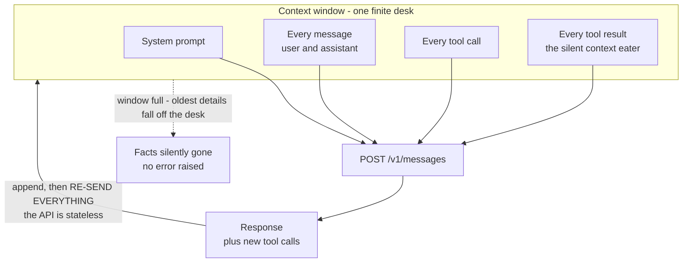
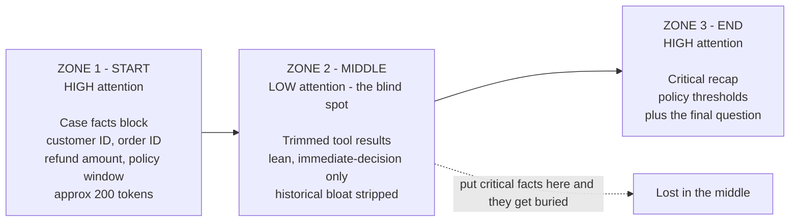
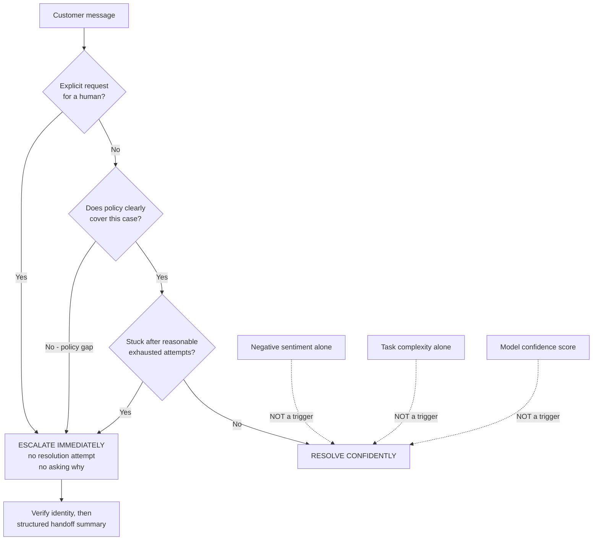

---
tags:
  - CCA-F
  - domain-5
  - context-management
  - escalation
  - reliability
  - hooks
  - youtube-course
date: 2026-08-05
status: done
domain: "5 of 5"
source: "Peace Of Code — Claude Certified Architect Ep 18"
---

# 🧠 EP18 — Why AI Agents Forget (Context Engineering)

> [!NOTE] Exam Coverage
> Maps to **Domain 5 — Context Management & Reliability**, task statements **5.1** (managing conversation context across long interactions) and **5.2** (escalation and ambiguity resolution), with a working dependency on **Domain 1**, task statement **1.5** (hooks) for the trimming mechanism. Covers the context window as working memory, why the Messages API being stateless makes context management architectural rather than optional, progressive summarization as a *reliability* failure, the attention U-curve, tool-result accumulation, the persistent case-facts block, the trim-at-the-hook-layer rule, the three-zone prompt layout, and the three valid versus three invalid escalation triggers.

**Back to:** [[CCA-F Study Roadmap]] · **Domain note:** [[D5 - Context Management & Reliability]] · **Deck:** [[EP18 - Flashcards]]
**Source:** [Peace Of Code — Ep 18 (43 min)](https://www.youtube.com/watch?v=7kaJdZ7veDs) · Level: college / professional-certification · Question mix calibrated MCQ-heavy (40 / 40 / 20)
**Previous:** [[EP17 - Batch API & Multi-Pass Review]]

---

## 1. Outline

- [1. Outline](#1-outline)
- [2. Key Terms](#2-key-terms)
- [3. Concept Summaries](#3-concept-summaries)
  - [3.1 The Context Window as Working Memory](#31-the-context-window-as-working-memory)
  - [3.2 The Stateless API and Why Context Management Is Architectural](#32-the-stateless-api-and-why-context-management-is-architectural)
  - [3.3 Progressive Summarization as a Reliability Failure](#33-progressive-summarization-as-a-reliability-failure)
  - [3.4 The Attention U-Curve](#34-the-attention-u-curve)
  - [3.5 Tool Results — The Silent Context Eater](#35-tool-results--the-silent-context-eater)
  - [3.6 The Case Facts Block](#36-the-case-facts-block)
  - [3.7 Trim First, Then Pass](#37-trim-first-then-pass)
  - [3.8 Structure Matters — The Three Zones](#38-structure-matters--the-three-zones)
  - [3.9 When to Escalate to a Human](#39-when-to-escalate-to-a-human)
  - [3.10 What Must Not Trigger Escalation](#310-what-must-not-trigger-escalation)
  - [3.11 The Golden Rule and the Decision Framework](#311-the-golden-rule-and-the-decision-framework)
- [4. Diagrams](#4-diagrams)
- [5. Worked Examples](#5-worked-examples)
- [6. Practice Questions](#6-practice-questions)
- [7. Cheat Sheet](#7-cheat-sheet)

---

## 2. Key Terms

| Term | Definition | Source |
|---|---|---|
| **Context window** | The agent's working memory — everything Claude can see simultaneously: system prompt, every message, every tool call, every tool result. Measured in tokens. | [03:30] |
| **The desk analogy** | The instructor's mental model: the context window is a work desk. Everything on it is immediately accessible; when it fills, things fall off the edge and effectively cease to exist. | [03:44] |
| **Stateless API** | The Messages API keeps no server-side memory. Every call re-sends the full conversation from scratch, so *"context management is architecturally required."* | [06:34] |
| **The memory problem** | The failure this episode fixes: an agent quotes a wrong refund amount not from a calculation error but because the detail fell out of context 20 messages ago. | [01:12] |
| **Progressive summarization** | Condensing conversation history into summaries as the window fills. Great for token economy, lossy for precision. | [07:33] |
| **Lazy summary** | The anti-pattern: *"customer reported delivery and product issues requesting a refund"* — no customer ID, no order number, no amount. | [09:35] |
| **Reliability failure mode** | The exam framing for summarization loss. Dropping numbers, dates, or policy thresholds is **not** an efficiency issue — it is a reliability failure. | [10:48] |
| **Attention U-curve** | LLMs attend most strongly to the **start** and **end** of a long input and least to the middle. | [11:45] |
| **Lost in the middle** | The consequence: facts buried in the middle section may be deprioritized or missed entirely. | [11:42] |
| **Attention blind spot** | The instructor's name for the middle zone — where low-value content belongs *on purpose*. | [13:31] |
| **Silent context eater** | Tool results. Each is individually reasonable; blindly appended across many loop iterations they dominate the window. | [16:26] |
| **Case facts block** | A compact, structured, always-fresh record of the transactional facts — customer ID, order ID, item, refund amount, order date, policy window — injected at the **top** of every prompt, **outside** summarized history. | [20:32] |
| **The four rules of the case facts block** | **Top placement** (highest-attention zone) · **always fresh** (updated as the conversation grows) · **verified only** (confirmed tool data) · **compact** (~200 tokens). | [24:07] |
| **`PostToolUse`** | The hook that fires after a tool succeeds but before the next model call — where verbose tool output is normalized or replaced. See [[EP05 - PreToolUse, PostToolUse Hooks & Task Decomposition]]. | [19:52] |
| **`updatedToolOutput`** | The `PostToolUse` field that **replaces** the tool's result before Claude sees it. `additionalContext` appends instead. | *(correction — §3.7)* |
| **Trim-then-pass** | The ordering rule: shrink verbose tool output **at the hook layer, before it accumulates.** Cleaning up an already-bloated context is a failed strategy. | [25:35] |
| **Three-zone prompt layout** | Case facts at the **start** · trimmed tool results in the **middle** · critical recap plus the final question at the **end**. | [26:00] |
| **Explicit human request** | Escalation trigger 1. The customer asks for a person. Escalate immediately, no questions, no resolution attempt. | [28:57] |
| **Policy gap** | Escalation trigger 2. The situation is not clearly covered by available policy, or combines conditions no single policy addresses. | [29:32] |
| **Agent stuck** | Escalation trigger 3. Genuine inability to progress after reasonable, exhausted attempts. | [30:13] |
| **The golden rule** | *"I need a human"* → escalate immediately. Do not try to resolve, do not ask why they want a human. | [34:32] |
| **Invalid triggers** | The three exam traps: **negative sentiment alone**, **task complexity alone**, **model confidence scores**. | [31:15] |
| **Confidence miscalibration** | Why self-reported confidence is not an escalation gate: the model can be 95% confident and wrong, or 60% confident and right. | [33:56] |

---

## 3. Concept Summaries

### 3.1 The Context Window as Working Memory

*Question: what does an agent actually "forget," and why does it happen without any error?*

Nothing errors because nothing broke. The instructor's opening scenario is a customer support agent that passes testing, ships, and three weeks later quotes a customer the wrong refund amount — *"not because it made a calculation error… it kind of forgot what the amount was."* Twenty messages into a long conversation, the early details *"just kind of poof, disappeared."*

The mental model is a desk. Everything on it is immediately reachable — you want a pen, it is there. But the desk has a size limit, and when it fills, things get pushed off the edge. The instructor extends the analogy usefully: *"if something got you had a blue pen on your desk, and it fell off… after some time you even forget that I had a blue pen at all."* That is the shape of the failure. The agent does not report a gap; it reasons confidently over what remains.

Four things sit on that desk, and **all of it counts**:

| On the desk | What it is |
|---|---|
| **System prompt** | Claude's standing instructions and persona |
| **Every message** | The full user ↔ assistant back-and-forth of the agentic loop |
| **Every tool call** | The `tool_use` blocks the model emitted |
| **Every tool result** | The `tool_result` blocks you appended back |

The desk's size is measured in **tokens**.

> [!WARNING] The context window is a property of the **model**, not of a subscription tier — verified against official docs
> The lecture says: *"If you take the pro subscription, your desk is small. If you go for a max subscription, then your desk will be very large."* That is the wrong axis for the exam, which tests the **API**, where there is no subscription at all.
>
> Officially, the base window is set by the model — 200K tokens on Claude Haiku 4.5, and **1M tokens** on the current Opus and Sonnet generations. Where plans *do* matter is the **extended-context option in Claude Code**, and even there the framing is access, not size:
>
> | Plan | Opus with 1M context | Sonnet 4.6 with 1M context |
> |---|---|---|
> | Max, Team, Enterprise | Included with subscription | Requires usage credits |
> | Pro | Requires usage credits | Requires usage credits |
> | **API and pay-as-you-go** | **Full access** | **Full access** |
>
> ❌ "Pro has a smaller context window than Max"
> ✅ The model sets the window; plans gate *access to the 1M extended-context option in Claude Code*, and API callers have full access
>
> **Exam answer: the window is a model property.** Real code: the same — select the window with a `[1m]` model variant where applicable, not with a subscription.
> Source: [Model configuration → Extended context](https://code.claude.com/docs/en/model-config#extended-context) · [Context window sizes by model](https://platform.claude.com/docs/en/build-with-claude/context-windows)

**In your own words:** The desk analogy is right; the sizing story is not. Everything in the loop shares one finite window, and what slides off is gone without a warning.

*See PQ 1, 9.*

---

### 3.2 The Stateless API and Why Context Management Is Architectural

*Question: why can't the platform just remember for you?*

Because there is nothing on the server to remember with. The instructor flags this as an explicit exam callout: *"Claude API is stateless. You send the full conversation from scratch on every API call. There is no server-side memory… no persistent sessions. Context management is architecturally required."*

> [!IMPORTANT] Verified — and this is the load-bearing fact of the whole episode
> The official SDK guidance states it in the same terms: *"The API is stateless — send the full conversation history each time."* Consecutive same-role messages are allowed, the first message must be `user`, and the whole array goes up on every request.
> Source: [Claude API — Multi-Turn Conversations](https://platform.claude.com/docs/en/api/messages) · consistent with [[D5 - Context Management & Reliability]] §5.1, which records the same rule as *"always pass the complete conversation history."*

Statelessness is what turns "the agent forgot" from a mysterious model defect into an ordinary engineering problem with your name on it. If the transcript you send does not contain the refund amount, the model cannot know it — not because it is careless, but because you did not send it.

It also has a cost consequence the lecture skips, and it makes the token math in §3.5 much worse than presented: because you re-send everything each turn, tool results from iteration 1 are paid for again in iterations 2, 3, 4, … See Worked Example 1.

> [!TIP] The platform has since grown three server-side context mechanisms **(expansion)**
> The lecture's "there is no server-side memory" is true of the plain Messages API, and remains the exam answer. Current platform features add options *on top* of it, and they map neatly onto this episode's problems:
>
> | Mechanism | What it does | Which lecture problem it addresses |
> |---|---|---|
> | **Context editing** — `clear_tool_uses_20250919`, beta `context-management-2025-06-27` | Server-side, **clears the oldest tool results** before the prompt reaches Claude, replacing each with placeholder text. Knobs: `trigger`, `keep`, `clear_at_least`, `exclude_tools`, `clear_tool_inputs` | §3.5 tool-result accumulation — the platform-native version of trim-then-pass |
> | **Compaction** — `compact_20260112`, beta `compact-2026-01-12` | Server-side **summarizes** earlier history into a `compaction` block you must pass back | §3.3 progressive summarization — same precision risk, hence the case-facts block |
> | **Memory tool** — `memory_20250818` | Client-executed; Claude reads and writes files that **persist across sessions** | §3.6 case facts — a durable home for facts that must outlive one conversation |
>
> Note the distinction the exam could test: context editing **clears** and keeps the conversation structure; compaction **summarizes** and replaces the history. Your client keeps the full unmodified history either way.
> Source: [Context editing](https://platform.claude.com/docs/en/build-with-claude/context-editing) · [Compaction](https://platform.claude.com/docs/en/build-with-claude/compaction)

**In your own words:** No server-side memory means memory is your architecture. If it is not in the array you send, it does not exist.

*See PQ 2, 10.*

---

### 3.3 Progressive Summarization as a Reliability Failure

*Question: summarization is the obvious fix for a full window. Why is it dangerous in a production support agent?*

Because *"summaries lose precision,"* and precision is exactly what a transactional agent needs. The instructor draws a sharp line between two use cases:

- In a **Claude Code session**, `/compact` produces a generalized summary — *"this is the code I had written and these are the changes you need to make."* Good enough; the work is qualitative.
- In a **production support agent**, the model needs to know *which* customer, *which* refund, *which* order. *"Some customer refund had happened, but which customer refund had happened? That might not be part of the summary."*

His paired example is the cleanest thing in the segment:

> ❌ **Lazy summary:** *"Customer reported delivery and product issues requesting a refund."*
> ✅ **Good summary:** *Order #12345 · wireless earphones · $149 · delivered 3 days late.*

Same event. The first one obliterated the order number needed to process the refund and the exact dollar amount owed.

> [!IMPORTANT] The exam framing — memorize the category, not just the example
> *"Progressive summarization that loses numerical values, specific dates, or policy-critical thresholds is a **reliability failure mode**. It's not an efficiency issue."*
>
> This is a deliberate reframing and it is the likely exam hinge. If a stem offers "an efficiency/cost trade-off" and "a reliability failure," the answer is **reliability**. You gave up correctness to save tokens, and the instructor is emphatic about the priority order: *"here our problem is to save the token — that is secondary. The main problem is that your memory is going out of hand."*
>
> Corroborated independently by [[D5 - Context Management & Reliability]] §5.1, which lists the at-risk categories as numerical values, specific dates and timestamps, order/customer/reference IDs, and **customer-stated expectations** — that fourth one the video never mentions.

The four categories of information that summarization destroys first:

1. **Numerical values** — amounts, percentages, measurements
2. **Specific dates** and timestamps
3. **Identifiers** — customer ID, order ID, reference numbers
4. **Policy-critical thresholds** — the $500 authorization ceiling, the 30-day return window

**In your own words:** Summaries keep the story and drop the facts. In a transactional agent the facts *are* the job, so summarization trades reliability for tokens — the wrong trade.

*See PQ 3, 11.*

---

### 3.4 The Attention U-Curve

*Question: does it matter **where** in the prompt a fact appears?*

Yes, and the instructor takes a deliberate long pause before this one because *"people don't actually give too much attention to"* it. Large language models attend most strongly to the **beginning** and the **end** of a long input, and least to the **middle**.

His analogy is a newspaper: the front page carries the facts that frame everything, the middle pages carry ads and filler, and the back carries sports — the part you deliberately turn to. Attention has the same shape.

The practical consequence: *"if you put a lot of important facts in the mid section, then those facts might get buried."* Put the customer ID and refund amount in the middle and the model may not process them — or will spend effort hunting for them.

> [!IMPORTANT] Verified, and the vault adds a number the video does not
> [[D5 - Context Management & Reliability]] §5.1 records the same effect — *"models reliably process information at the beginning and end of long inputs, but may omit or deprioritize findings from the middle"* — plus three mitigations, one of which is quantified: place key findings at the beginning, use **explicit section headers** to organize detail, and put **long documents at the top with the query at the bottom** for up to a **30% quality improvement**.
>
> The section-headers mitigation is worth keeping: structure makes the middle zone navigable even when attention is low there.

The instructor's key insight is that the blind spot is a **resource**, not just a hazard: *"it's not that you have to leave this area blank. You can put some tool result calls or some low-requirement things over here."* You are not deleting data — you are **arranging** it so attention lands where the stakes are.

> [!TIP] Facts-first is also cache-first **(expansion)**
> Prompt caching is a **prefix match**: any byte change invalidates everything after it, and render order is `tools` → `system` → `messages`. So the same layout the U-curve wants — stable, high-value content early; volatile content late — is exactly what maximizes cache hits. One caveat that cuts against a naive reading of §3.6: a case-facts block that is *"always fresh"* changes every turn, so putting it at the very front of the prompt would invalidate the cached prefix behind it. Keep the frozen system prompt as the cached prefix and inject the changing case facts **after** it, at the top of the message history.
> Source: [Prompt caching](https://platform.claude.com/docs/en/build-with-claude/prompt-caching)

**In your own words:** Attention is U-shaped. Facts at the top, filler in the trough, the ask at the bottom — and the trough is where cheap content is supposed to live.

*See PQ 4, 12.*

---

### 3.5 Tool Results — The Silent Context Eater

*Question: where does the window actually go in a tool-heavy agent?*

Into tool results, quietly. The instructor's framing is that the mistake is not calling tools — that is necessary — but *"blindly appending whatever tool message you get at every step."*

His per-tool estimates for the customer support agent:

| Tool | Tokens to process the full result |
|---|---|
| `get_customer` | ~400 |
| `look_up_order` | ~350 |
| `check_policy` | ~600 |
| `shipping_history` | (unstated) |
| **Per iteration, all tools** | **~2,000–2,500** |

Twenty iterations at that rate is *"40,000 to 50,000 tokens, just 10 to 20 times"* — and, as he notes, *"in a production system it will be called much more than 20 times."*

> [!WARNING] The lecture's arithmetic is a **floor**, not the real cost — and statelessness is why
> Because the API is stateless (§3.2), iteration *k* re-sends every earlier tool result as input tokens. The cost is not linear in the number of iterations; it is **quadratic**. With $T$ tokens of tool results added per iteration over $N$ iterations, total input tokens processed is:
>
> $$\sum_{k=1}^{N} kT \;=\; T\cdot\frac{N(N+1)}{2}$$
>
> At $T = 2500$ and $N = 20$: the lecture's figure is $2500 \times 20 = 50{,}000$; the actual processed total is $2500 \times 210 = 525{,}000$ — over **10×** higher. This does not weaken the lecture's point; it strengthens it, and it explains why trimming has to happen *before accumulation* (§3.7) rather than after. Prompt caching is what makes the re-send affordable in practice, not free.
> Consistent with [[D5 - Context Management & Reliability]] §5.1: *"tool results accumulate in context and consume tokens disproportionately to their relevance."*

The instructor then poses the segment's question as a pop quiz — *"any other concept that we had discussed which might help here?"* — and answers it with hooks: **`PostToolUse`** to filter what a tool returned, **`PreToolUse`** to sanitize before a tool is called.

> [!WARNING] `PreToolUse` cannot filter a tool's **output** — verified against official docs
> The lecture says: *"The answer is the use of pre-tool use hooks. Right? Or sorry, post-tool use hooks. **Both you can use.**"* — then describes using either one to extract the fields you need from a tool result. That conflates two hooks with opposite positions in the loop.
>
> | Hook | Fires | Sees | Can change |
> |---|---|---|---|
> | **`PreToolUse`** | **Before** the tool runs | `tool_name`, `tool_input` | The tool's **input**, via `updatedInput`; plus `permissionDecision` — `"allow"` / `"deny"` / `"ask"` / `"defer"` |
> | **`PostToolUse`** | **After** the tool succeeds, **before** the next model call | The tool's result | The tool's **output** — `updatedToolOutput` replaces it, `additionalContext` appends to it |
>
> ❌ Using `PreToolUse` to trim a tool result — the result does not exist yet
> ✅ **`PostToolUse` + `updatedToolOutput`** to trim results; `PreToolUse` + `updatedInput` to sanitize or validate what goes *into* the tool
>
> **Exam answer: `PostToolUse` for output trimming.** Real code: the same. (`updatedMCPToolOutput` is the older MCP-only field and is deprecated.) A `tool_use_id` correlates the two events for one call.
> Source: [Hooks in the SDK](https://code.claude.com/docs/en/agent-sdk/hooks) → *Outputs* · consistent with [[EP05 - PreToolUse, PostToolUse Hooks & Task Decomposition]] §3.4 and [[D1 - Agentic Architecture & Orchestration]] §1.5

The lecture's own description of `PreToolUse` — *"double check the data or sanitize the data before even the tool gets called"* — is exactly right. The error is only in offering it as an alternative for output trimming.

**In your own words:** Tool results are the biggest and quietest consumer of the window, and statelessness multiplies them. Trim on the way out of the tool, not on the way in.

*See PQ 5, 10, 13.*

---

### 3.6 The Case Facts Block

*Question: if summaries cannot be trusted with the facts, where do the facts live?*

In a small structured object that never gets summarized. The instructor shows it as a model entity holding exactly what a support case needs:

```python
@dataclass
class CaseFacts:
    customer_id: str        # "C-88221"
    order_id: str           # "12345"
    item: str               # "wireless earphones"
    refund_amount: float    # 149.00
    order_date: str         # "2026-06-12"
    policy_window_days: int # 30
```

The population mechanism is deliberately unglamorous. When `look_up_order` or `process_refund` returns a verbose summarized string, a `PostToolUse` hook extracts the fields into the object — *"you can have a regex over there which will just extract the information. You don't even have to use AI over there."* Then, when you build the next prompt, *"you actually send only the required things that are necessary."*

**The four rules of the case-facts block**, which the instructor calls the rules of the evidence board:

| Rule | What it means | Why |
|---|---|---|
| **Top placement** | Always in the highest-attention zone | §3.4 — critical facts must not sit in the blind spot |
| **Always fresh** | Dynamically updated as the conversation grows | A stale fact is worse than a missing one |
| **Verified only** | Confirmed tool data, not model inference | Prevents hallucinated facts being promoted to ground truth |
| **Compact** | Distilled to roughly **200 tokens** | It rides in *every* prompt; bloat here is paid repeatedly |

> [!IMPORTANT] The exam callout, stated almost verbatim in the vault
> *"Extracting transactional facts into a persistent case facts block is the ultimate remedy for summarization loss and the lost-in-the-middle effect."*
>
> [[D5 - Context Management & Reliability]] §5.1 records the same prescription independently — *"extract transactional facts into a persistent case facts block included in every prompt, **outside** summarized history"* — and shows the rendered form:
>
> ```
> CASE FACTS:
> - Customer ID: C-88221
> - Order #: 12345
> - Reported: 2026-06-12
> - Claimed amount: $149.99
> - Return status: approved
> ---
> [Conversation summary below — may be condensed]
> ```
>
> Note the `---` divider: the facts are *structurally* separated from the summarizable region. That is the whole idea. The block solves both problems at once — it beats summarization loss because it is never summarized, and it beats lost-in-the-middle because it is never in the middle.

**In your own words:** One small, verified, always-current fact sheet, stapled to the front of every prompt and exempt from summarization. Everything else may be condensed.

*See PQ 6, 14.*

---

### 3.7 Trim First, Then Pass

*Question: when do you shrink the data — and does the timing actually matter?*

It matters more than the technique. The pipeline the instructor draws:

```
raw tool output (~400 tokens)
        ↓
   PostToolUse hook  →  filter, drop the noise
        ↓
   case facts block  (~200 tokens)
        ↓
    agent context
```

> [!IMPORTANT] The exam rule, and the sentence to memorize
> *"Trim verbose tool outputs **before they accumulate**, at the hook layer. Cleaning up context after it is already bloated is a **failed strategy**."*
>
> The distinction is between an **architectural** fix (a hook that runs on every tool result, forever) and a **remedial** one (compacting a window that already lost precision). Once a 400-token blob has been appended, three things have already happened that no later cleanup undoes: you paid the tokens, you paid them again on every subsequent stateless re-send (§3.5), and any summarization pass now runs over noise it may prefer to your facts.
>
> [[D5 - Context Management & Reliability]] §5.1 gives the concrete shape: *"an order lookup returns 40+ fields → keep only the 5 return-relevant fields,"* done via `PostToolUse` hooks.

The mechanism, precisely, from §3.5's correction: return `updatedToolOutput` to **replace** the result the model will see, or `additionalContext` to **append** to it. Return `{}` to pass through unchanged — and per [[EP05 - PreToolUse, PostToolUse Hooks & Task Decomposition]] §3.4, a hook should be a pass-through for every tool it does not care about.

> [!WARNING] Unverified — the "95%" figure
> The summary card claims *"trim tool results via post-tool-use hooks cuts 95% of the bloat."* No official source states a 95% reduction, and the real number depends entirely on how verbose your tools are. Treat it as the instructor's illustration of magnitude, not a fact to reproduce on an exam. The **defensible** claim is the vault's: a 40-field payload reduced to the 5 relevant fields.
> Confirm against the official study guide before repeating the number.

**In your own words:** Filter at the hook, before the append. Post-hoc compaction is damage control, not a design.

*See PQ 5, 15.*

---

### 3.8 Structure Matters — The Three Zones

*Question: what does a well-laid-out agent prompt look like?*

Three zones, mapped straight onto the U-curve:

| Zone | Contents | Why here |
|---|---|---|
| **Start** — peak attention | **Case facts block** | Critical identifiers and amounts must be seen |
| **Middle** — the low-attention valley | **Trimmed tool results** — *"lean, relevant to the immediate decision only, stripped of historical bloat"* | Necessary but low-stakes; deliberately parked in the blind spot |
| **End** — peak attention | **Critical recap + the final question** | Policy lines like *"refunds must be processed within 30 days"* and the actual ask |

The instructor's advice on memorizing it is worth repeating: *"Wait, don't memorize it — just remember it. We as humans also kind of do the same thing."* Lead with the facts, bury the appendix, close with the question. It is how a well-written brief works.

Note what the middle zone is *not*: empty. Trimmed tool results still belong in the prompt — they are what the model reasons over. The point is that after §3.7 they are already lean, so parking them in the valley costs little.

**In your own words:** Facts at the top, evidence in the middle, the ask at the bottom. Attention and layout should agree.

*See PQ 12.*

---

### 3.9 When to Escalate to a Human

*Question: the second half of the episode. When should an autonomous agent stop trying?*

On exactly three triggers. The instructor motivates it with a complaint most people share: *"even when I explicitly tell connect me to a human support agent, still they don't do that… that is not the way it should be designed."*

| # | Trigger | What it looks like | Required response |
|---|---|---|---|
| 1 | **Explicit human request** | *"Connect me to an agent," "let me talk to someone real"* | Escalate **immediately** — no questions asked |
| 2 | **Policy gap or exception** | Not clearly covered by policy, or combines conditions each policy covers only separately | Escalate — *"when there is no clear policy authorization, a human needs to make the call"* |
| 3 | **Agent stuck** | Genuine inability to progress after reasonable, exhausted attempts; stuck in a loop | Escalate |

The connective tissue between the episode's two halves is stated up front and is worth carrying into the exam: *"an agent that can't keep its memory straight can't make good escalation decisions."* An agent that lost the order amount cannot tell whether the case falls inside policy — so it cannot correctly classify trigger 2 either. Context management is a **precondition** for correct escalation, not a separate topic.

> [!IMPORTANT] All three triggers corroborated by the vault
> [[D5 - Context Management & Reliability]] §5.2 lists the same set: explicit human request → escalate immediately with no investigation first; policy ambiguous or silent → escalate (*"policy gap, not just complexity"*); unable to make meaningful progress → escalate. It adds a fourth row the video only implies — **complex but resolvable → offer to resolve first, escalate only if the customer reiterates.**

> [!WARNING] Unverified — the "20 or 30 retries" figure
> On trigger 3 the instructor says *"you can have 20 or 30 retries, for example, and then still if the agent is not able to complete it…"* No official guidance supports a 20–30 attempt ceiling, and it sits badly beside two things the vault already records: the SDK's default `max_retries` is **2**, and using an **iteration cap as a primary stop condition** is the anti-pattern from [[EP01 - Agentic Loops & stop_reason]].
>
> The exam-safe formulation is the vault's, which is about *state* rather than a count: escalate when the agent **cannot make meaningful progress**. A retry ceiling is one way to *detect* that; it is not the criterion.

Getting escalation right also means handing over properly. The video stops at *"escalated, ticket ID is this one"*; [[D5 - Context Management & Reliability]] §5.2 supplies the piece it omits — a **structured handoff summary**, because *"human agents receiving escalated cases often lack access to the conversation transcript."* Verified customer ID, root cause, amount at stake, what was attempted, recommended action. This is the case-facts block doing its second job.

**In your own words:** Three triggers: they asked, policy is silent, or you are stuck. And the handoff carries the facts, because the human cannot see your transcript.

*See PQ 7, 16, 18.*

---

### 3.10 What Must Not Trigger Escalation

*Question: which plausible-sounding escalation signals are exam traps?*

Three, and the instructor labels them as traps explicitly: *"these are the exam traps. And these are the anti-patterns."*

**1. Negative sentiment alone.** The customer is in all caps with exclamation marks and is *"clearly upset"* — but *"the things that they are asking clearly falls in the policy and it can be clearly handled by the agent."* Frustration is a tone, not a complexity signal. The carve-out matters: if the customer says *"I have no faith that the bot will be able to help me, I need human support,"* that is no longer sentiment — it is trigger 1.

**2. Task complexity alone.** A complicated request whose tool calls all resolve and whose conditions all match is still the agent's job. His analogy: a student sees a long exam question, gets intimidated by its length, and skips it without reading — *"that is not the correct way."* Complexity becomes trigger 3 only when the agent actually gets stuck attempting it.

**3. Model confidence scores.** The most easily neglected one. *"I'm 70% confident that this is the correct refund amount"* — do not gate on it, *"because Claude's self-reported confidence is not calibrated to actual accuracy in a reliable, measurable way. So it can say 95% confident and can be wrong… and it can be 60% confident, and it can be right."*

> [!WARNING] The three invalid triggers — the highest-yield trap set in this episode
> ❌ **Sentiment** — frustrated tone ≠ case complexity
> ❌ **Complexity** — hard ≠ out of scope
> ❌ **Self-reported confidence** — uncalibrated to accuracy
> ✅ Branch only on the three explicit conditions in §3.9, expressed as **explicit business rules**, ideally with few-shot examples in the system prompt
>
> [[D5 - Context Management & Reliability]] §5.2 records sentiment and confidence as *"unreliable proxies"* independently, and §5.5 supplies the deeper reason confidence needs care: routing thresholds should be calibrated against **labeled validation sets**, because a model's "0.7" corresponds to different real accuracies for different fields. Self-reported confidence is not worthless — it is just not an escalation gate on its own.

The instructor's closing line on this is the one to carry in: *"escalation is not a fallback for hard problems."*

**In your own words:** Angry is not a trigger. Hard is not a trigger. "70% sure" is not a trigger. Only asked, gap, or stuck.

*See PQ 7, 19, 20.*

---

### 3.11 The Golden Rule and the Decision Framework

*Question: a customer explicitly asks for a person. What is the agent allowed to do first?*

Nothing. Escalate. *"Do not try to resolve it. Do not ask why they want a human. All these questions should not be asked. It should directly escalate."*

The full decision framework, in order:

1. **Explicit human request?** → escalate immediately.
2. **Does policy clearly cover this?** → **No** → policy gap → escalate. **Yes** → continue.
3. **Is the agent stuck after exhausting reasonable attempts?** → **Yes** → escalate. **No** → keep working, resolve confidently.

The instructor garbles step 2 on camera and corrects himself mid-sentence (see the artifacts note); the corrected logic is above — *"if the policy doesn't cover it, then there is some gap, so escalate it."*

The live demo shows both halves working. Scenario 1: a $750 refund against a $500 authorization ceiling — *"I cannot process this refund directly. The order amount of $750 exceeds the 500 authorization"* → handed off. That is a **policy gap** surfacing as an authority limit, and note the ordering: the agent still **verified the customer and the order first** — *"it cannot just hand over to a human without verifying the customer."* Scenario 2: *"I don't want to deal with a bot. Connect me to a real human agent"* → escalated with a ticket ID, no resolution attempt.

The handoff tool's description is itself a teaching artifact, and the instructor connects it back to [[EP06 - Tool Descriptions & Tool Misrouting]]: *"Hand the conversation off to a human support agent. Call this immediately when the customer explicitly asks to speak to a human, to a manager, or to a real person… Also call this when a request exceeds your authority."* The **description** is what encodes the escalation policy for the model to act on.

> [!IMPORTANT] The exam question the instructor promises will appear
> Sarah's order is confirmed damaged and confirmed late. She is highly frustrated. She says: *"I've been dealing with this long enough. I just want to speak to an actual person now."* What should the agent do?
>
> ✅ **Transfer to a human immediately, without attempting further resolution.**
>
> The distractors are all trap answers built out of §3.10: attempt one more resolution step, ask Sarah *why* she prefers a human, offer a self-service portal. The confirmed damage and confirmed late delivery are deliberate noise — they mean the case *is* resolvable, which is exactly what does **not** matter once the request is explicit.

**In your own words:** Explicit request beats everything, including your ability to solve the problem. Verify identity, then hand off with the facts.

*See PQ 8, 17.*

---

## 4. Diagrams

### 4.1 What fills the window, and why statelessness compounds it



*Every arrow back into the window is paid for again on the next call. That loop is why trimming has to happen before the append, not after.*

### 4.2 The attention U-curve and the three-zone layout



*The valley is a resource, not a hazard — low-stakes content belongs there deliberately.*

### 4.3 Escalation decision framework



*The three dotted arrows are the exam traps. They route to "resolve," never to "escalate."*

---

## 5. Worked Examples

### Example 1 — Size the tool-result problem honestly

**Problem:** A support agent calls four tools per iteration, whose results cost roughly $400 + 350 + 600 + 150 = 1500$ tokens raw, rounded by the instructor to a $2000$–$2500$ band once message overhead is included. The loop runs $20$ iterations. Compute the lecture's figure and the true cost, then say which one justifies hook-layer trimming.

1. **Take the lecture's per-iteration band.** $T \approx 2500$ tokens of tool results appended per iteration.
   *(The instructor's own estimate; the exact number matters less than the order of magnitude.)*
2. **Compute the lecture's linear figure.** $2500 \times 20 = 50{,}000$ tokens.
   *(This is the number he quotes — "40,000 to 50,000 tokens." It treats each iteration's results as paid for once.)*
3. **Apply statelessness.** Every call re-sends the whole history, so iteration $k$ carries the results of iterations $1 \ldots k$. Iteration $k$ therefore costs $kT$ input tokens of tool results.
   *(§3.2 — there is no server-side memory, so nothing is retained between calls.)*
4. **Sum the series.**
   $$\sum_{k=1}^{20} 2500k \;=\; 2500 \cdot \frac{20 \times 21}{2} \;=\; 2500 \times 210 \;=\; 525{,}000$$
5. **Compare.** $525{,}000 / 50{,}000 = 10.5$ — over an order of magnitude worse than the linear estimate.
   *(And the growth is quadratic in $N$, so doubling the loop length roughly quadruples the cost.)*
6. **Locate the leverage.** A trim that cuts $T$ from $2500$ to $500$ does not save $2000 \times 20 = 40{,}000$; it saves $2000 \times 210 = 420{,}000$. The saving is multiplied by every future re-send — which is precisely why §3.7 insists on trimming *before accumulation*.

**Answer:** The lecture's $50{,}000$ is a floor. Because the API is stateless, the real figure is $T \cdot N(N+1)/2 = 525{,}000$, and trimming at the `PostToolUse` layer saves tokens once per iteration *for every iteration that follows*. That compounding is the actual argument for trim-then-pass.

---

### Example 2 — Diagnose and fix a forgetting agent

**Problem:** A support agent handles multi-issue cases. Twenty messages in, it quotes a customer $199 instead of the correct $149 refund. Logs show the refund calculation is correct wherever the amount is present, and a summarization pass ran at message 12. Diagnose and design the fix.

1. **Rule out the calculation.** The arithmetic is right whenever the input is right, so this is not a logic bug.
   *(§3.1 — the instructor's whole framing: "it did not make a calculation error… it forgot.")*
2. **Locate the loss at the summarization boundary.** The summary at message 12 condensed *"customer reported delivery and product issues requesting a refund"* — the $149 figure and order number are gone.
   *(§3.3 — numerical values and identifiers are the first casualties of a lazy summary.)*
3. **Name the failure category correctly.** This is a **reliability failure mode**, not an efficiency issue.
   *(§3.3 — the exam framing. Choosing "efficiency" on a stem like this is the trap.)*
4. **Introduce a case-facts block** carrying `customer_id`, `order_id`, `item`, `refund_amount`, `order_date`, `policy_window_days`.
   *(§3.6 — the transactional facts get their own home, structurally outside the summarizable region.)*
5. **Populate it from verified tool data via a `PostToolUse` hook** — regex extraction is sufficient; no model call needed.
   *(§3.6 — "verified only" means confirmed tool output, never model inference, so a hallucinated amount can never be promoted to a fact.)*
6. **Place it at the top of the message history, after the frozen system prompt.** Top of the prompt for attention; after the cached prefix so the always-fresh block does not invalidate the cache.
   *(§3.4 + §3.8 — highest-attention zone, and the caching caveat.)*
7. **Cap it at roughly 200 tokens.** It rides in every prompt, so bloat here is paid on every turn.
   *(§3.6 rule 4 — and §3.5's compounding makes that repetition expensive.)*
8. **Verify the fix survives the boundary.** Re-run past message 12 and confirm the amount is still exact.
   *(The block only works if it is genuinely exempt from the summarization pass — the `---` divider in D5's rendering.)*

**Answer:** Root cause is progressive summarization destroying a numerical value — a reliability failure. Fix: a compact, verified, always-fresh case-facts block populated by a `PostToolUse` hook and injected at the top of every prompt, outside summarized history.

---

### Example 3 — Route four escalation scenarios

**Problem:** For each, decide escalate or resolve, and name the trigger or the trap.

**(a) Customer writes in all caps with three exclamation marks about a late delivery. The return is 8 days old against a 30-day window and the refund is $89 against a $500 ceiling.**

1. **Check trigger 1.** No request for a human.
2. **Check trigger 2.** Policy covers it cleanly — inside the window, under the ceiling.
3. **Check trigger 3.** No indication the agent is stuck.
4. **Identify what is actually present:** negative sentiment, and nothing else.
   *(§3.10 trap 1 — "frustrated tone ≠ case complexity.")*

**Answer (a):** **Resolve.** Sentiment alone is an invalid trigger.

**(b) The same customer adds: "I have no faith a bot can help me. Get me a human."**

1. **Re-check trigger 1.** Now explicitly present.
2. **Stop evaluating.** Resolvability has become irrelevant.
   *(§3.11 golden rule — do not attempt resolution, do not ask why.)*
3. **Verify identity, then hand off** with a structured summary.
   *(§3.11 demo — the agent verified customer and order before handing over; D5 §5.2 supplies the handoff shape.)*

**Answer (b):** **Escalate immediately** — trigger 1. The frustration did not change the answer; the explicit request did.

**(c) A case combines a warranty claim and a shipping-damage claim. Each policy covers its own scenario; neither addresses the combination.**

1. **Check trigger 1.** Absent.
2. **Check trigger 2.** *"The case combines conditions that each policy covers separately, but nothing addresses them together."* — the definition of a policy gap.
3. **Resist the complexity read.** It is not being escalated for being hard; it is escalated for lacking authorization.
   *(§3.10 trap 2 — complexity alone is invalid, so the distinction has to be policy coverage.)*

**Answer (c):** **Escalate** — trigger 2, policy gap. A human holds the authority no policy grants.

**(d) The agent computes a refund and reports internally: "I am 68% confident this is the correct amount." Policy clearly covers the case.**

1. **Check all three triggers.** None present.
2. **Recognise the trap.** Self-reported confidence is not calibrated to accuracy — 95% can be wrong, 60% can be right.
   *(§3.10 trap 3.)*
3. **Note the legitimate alternative.** If confidence is to be used at all, thresholds must be calibrated against labeled validation sets — a quality-review mechanism, not an escalation gate.
   *(D5 §5.5 — confidence has a role, just not this one.)*

**Answer (d):** **Resolve.** Model confidence is an invalid escalation trigger.

---

## 6. Practice Questions

1. Name the four things that occupy the context window. *(§3.1 / Term: context window)*

   <details><summary>Answer</summary>
   The <strong>system prompt</strong>, <strong>every message</strong> in the conversation, <strong>every tool call</strong>, and <strong>every tool result</strong>. All of it counts against the same token budget — "it all sits on the same desk."
   </details>

2. What does it mean that the Claude API is stateless, and what follows from it? *(§3.2 / Term: stateless API)*

   <details><summary>Answer</summary>
   You <strong>send the full conversation from scratch on every API call</strong> — there is no server-side memory and no persistent sessions. It follows that <strong>context management is architecturally required</strong>: if a fact is not in the array you send, the model cannot know it.
   </details>

3. Progressive summarization drops a refund amount and an order date. What kind of failure is that? *(§3.3 / Term: reliability failure mode)*

   <details><summary>Answer</summary>
   A <strong>reliability failure mode</strong> — explicitly <em>not</em> an efficiency issue. Losing numerical values, specific dates, or policy-critical thresholds trades correctness for tokens.
   </details>

4. State the attention U-curve, name the zone to avoid for critical facts, and give the three mitigations. *(§3.4 / Term: attention U-curve)*

   <details><summary>Answer</summary>
   Models attend most strongly to the <strong>beginning</strong> and <strong>end</strong> of a long input and least to the <strong>middle</strong> — critical facts must never sit in that "lost in the middle" blind spot. Mitigations: (1) place <strong>key findings at the beginning</strong>, (2) use <strong>explicit section headers</strong> to organize detail, (3) put <strong>long documents at the top with the query at the bottom</strong> — up to a 30% quality improvement.
   </details>

5. Which hook trims a verbose tool result, which field replaces the output, and when does that hook fire? *(§3.5, §3.7 / Term: `updatedToolOutput`)*

   <details><summary>Answer</summary>
   <strong><code>PostToolUse</code></strong>, using <strong><code>updatedToolOutput</code></strong> to <em>replace</em> the result before Claude sees it (<code>additionalContext</code> <em>appends</em> instead). It fires after the tool <strong>succeeds</strong> but before the <strong>next model call</strong> — "post" relative to the tool, not the model, which is why it can rewrite what lands in context.
   </details>

6. List the six fields of the lecture's case-facts model and the four rules governing the block. *(§3.6 / Term: case facts block)*

   <details><summary>Answer</summary>
   Fields: <code>customer_id</code>, <code>order_id</code>, <code>item</code>, <code>refund_amount</code>, <code>order_date</code>, <code>policy_window_days</code>. Rules: <strong>top placement</strong> (highest-attention zone) · <strong>always fresh</strong> (dynamically updated) · <strong>verified only</strong> (confirmed tool data) · <strong>compact</strong> (~200 tokens).
   </details>

7. Name the three valid escalation triggers and the three invalid ones. *(§3.9, §3.10 / Term: invalid triggers)*

   <details><summary>Answer</summary>
   <strong>Valid:</strong> explicit human request · policy gap or exception · agent stuck (genuine inability to progress). <strong>Invalid:</strong> negative sentiment alone · task complexity alone · model confidence scores.
   </details>

8. What is the golden rule of escalation, and what two actions does it forbid? *(§3.11 / Term: the golden rule)*

   <details><summary>Answer</summary>
   When the customer explicitly asks for a human, <strong>escalate immediately</strong>. Forbidden: <strong>attempting to resolve the issue first</strong>, and <strong>asking why they want a human</strong>.
   </details>

9. Why does an agent that "forgot" produce no error message? *(§3.1 / Comprehension)*

   <details><summary>Answer</summary>
   Because nothing failed. Content that falls out of the window simply is not in the input, so the model reasons confidently over what remains and returns a well-formed but wrong answer. The instructor's blue-pen extension makes the point: eventually you forget the pen existed at all — there is nothing left to signal an absence.
   </details>

10. Explain why statelessness makes the tool-result problem worse than a per-iteration token count suggests. *(§3.2, §3.5 / Comprehension)*

    <details><summary>Answer</summary>
    Because every call re-sends the entire history, iteration <em>k</em> pays for the tool results of iterations 1…<em>k</em>. Cost grows <strong>quadratically</strong> rather than linearly — for 20 iterations at 2,500 tokens each, roughly 525,000 processed input tokens rather than 50,000. Trimming therefore saves tokens once per iteration <em>for every iteration that follows</em>.
    </details>

11. Why is a "lazy summary" worse than no summary for a transactional agent? *(§3.3 / Comprehension)*

    <details><summary>Answer</summary>
    It is <strong>confidently incomplete</strong>. "Customer reported delivery and product issues requesting a refund" reads like adequate context, so nothing prompts a re-lookup — but the order number needed to process the refund and the exact amount owed are gone. The agent proceeds on a summary that looks sufficient and is not.
    </details>

12. The instructor says the attention blind spot need not be left blank. What belongs there, and why is that not a contradiction? *(§3.4, §3.8 / Comprehension)*

    <details><summary>Answer</summary>
    <strong>Trimmed tool results and other low-priority content</strong> — the middle zone of the three-zone layout. It is not a contradiction because the goal is <em>arranging</em> data by stakes, not deleting it: nothing is lost, and low-attention content is placed where low attention costs least. The valley is a resource.
    </details>

13. Why can a `PreToolUse` hook not be used to trim a tool result, and what is it for instead? *(§3.5 / Comprehension)*

    <details><summary>Answer</summary>
    Because it fires <strong>before the tool executes</strong> — the result does not exist yet. It receives <code>tool_name</code> and <code>tool_input</code>, and can rewrite the <strong>input</strong> via <code>updatedInput</code> or gate the call via <code>permissionDecision</code> ("allow" / "deny" / "ask" / "defer"). Use it to <strong>sanitize or validate what goes into a tool</strong>; use <code>PostToolUse</code> to trim what comes out.
    </details>

14. How does one case-facts block solve two different problems at once? *(§3.6 / Comprehension)*

    <details><summary>Answer</summary>
    It defeats <strong>summarization loss</strong> because it lives outside the summarized history and is never condensed, and it defeats <strong>lost-in-the-middle</strong> because it is always placed in the top attention zone. That is why the instructor calls it "the ultimate remedy" for both.
    </details>

15. Why does trimming at the hook layer beat compacting a bloated window, given both reduce tokens? *(§3.7 / Comprehension)*

    <details><summary>Answer</summary>
    One is <strong>architectural</strong>, the other <strong>remedial</strong>. A hook runs on every tool result forever, so bloat never enters. Compaction runs after three irreversible things have happened: you paid the tokens, you paid them again on every re-send, and the summarizer now has to choose between your facts and accumulated noise.
    </details>

16. Why does the instructor say the two halves of this episode are connected? *(§3.9 / Comprehension)*

    <details><summary>Answer</summary>
    Because <strong>"an agent that can't keep its memory straight can't make good escalation decisions."</strong> Classifying a policy gap requires knowing the order amount, the date, and the applicable threshold — precisely the facts summarization destroys. Context management is a <strong>precondition</strong> for correct escalation, not a separate topic.
    </details>

17. Sarah's order is confirmed damaged and confirmed late. She is highly frustrated and says: "I've been dealing with this long enough. I just want to speak to an actual person now." What should the agent do, and why are the other options wrong? *(§3.11 / Application)*

    <details><summary>Answer</summary>
    <strong>Transfer to a human immediately, without attempting further resolution.</strong> The explicit request is trigger 1 and overrides everything. The distractors each rehearse a trap: "attempt one more resolution step" ignores the golden rule; "ask Sarah why she prefers a human" is explicitly forbidden; "offer the self-service portal" substitutes automation for the thing she asked for. The confirmed damage and late delivery are deliberate noise — they prove the case <em>is</em> resolvable, which is exactly what stops mattering once the request is explicit.
    </details>

18. A $750 refund arrives at an agent with a $500 authorization ceiling. Which trigger fires, and what must the agent do before handing off? *(§3.9, §3.11 / Application)*

    <details><summary>Answer</summary>
    <strong>Trigger 2 — policy gap</strong>, surfacing as an authority limit: no policy authorizes this agent to approve $750. Before handing off it must still <strong>verify the customer and the order</strong> — "it cannot just hand over to a human without verifying the customer" — and then compile a <strong>structured handoff summary</strong> (verified ID, root cause, amount at stake, what was attempted, recommended action), because the human receiving it usually cannot see the transcript.
    </details>

19. An agent escalates whenever its self-reported confidence drops below 80%. Give two independent reasons this design is wrong. *(§3.10 / Application)*

    <details><summary>Answer</summary>
    (1) <strong>Confidence is not calibrated to accuracy</strong> — the model can report 95% and be wrong, or 60% and be right, so the gate fires on the wrong cases in both directions. (2) <strong>It is not one of the three valid triggers</strong>; escalation must branch on explicit business rules (asked / gap / stuck), not on a model-generated number. If confidence is used at all, thresholds belong to a human-review workflow and must be calibrated against labeled validation sets.
    </details>

20. A case is genuinely complex — many tool calls, several conditions — but every condition matches and every tool resolves. Escalate or resolve, and what would change the answer? *(§3.10 / Application)*

    <details><summary>Answer</summary>
    <strong>Resolve.</strong> Task complexity alone is an invalid trigger — "the agent is intelligent enough to handle it." Two things would change the answer: the agent actually <strong>getting stuck</strong> while attempting it (trigger 3 — "that is a separate scenario"), or the customer <strong>explicitly asking for a human</strong> (trigger 1).
    </details>

---

## 7. Cheat Sheet

| Cue | Note |
|---|---|
| Window holds | System prompt · messages · tool calls · tool results. **All counts** |
| Window size set by | The **model** (200K–1M), never a subscription |
| API statelessness | **No server-side memory** → context management is *architectural* |
| Summarization loss | Numbers · dates · IDs · thresholds. **Reliability failure, not efficiency** |
| Lazy vs good summary | ❌ "reported issues" · ✅ Order #12345 · $149 · 3 days late |
| Attention U-curve | Strong at **start** and **end**, weak in the **middle** |
| Middle zone is for | Trimmed tool results — the blind spot is a *resource* |
| Silent context eater | **Tool results** — statelessness makes the total **quadratic** |
| **Case facts block** | **Top · always fresh · verified only · ~200 tokens**, *outside* summaries |
| Case facts beats | Summarization loss **and** lost-in-the-middle, at once |
| Trim where | **`PostToolUse` + `updatedToolOutput`** (replaces) · `additionalContext` (appends) |
| Trim when | **Before it accumulates.** Post-hoc cleanup **fails** |
| `PreToolUse` is for | The **input** — `updatedInput`, `permissionDecision`. **Never** output |
| Three zones | Case facts → trimmed tool results → recap + final question |
| **Escalate on** | **Explicit human request · policy gap · agent stuck** |
| **Never escalate on** | **Sentiment · complexity · confidence scores** |
| Golden rule | "I need a human" → escalate **now**. No resolving, no asking why |
| Before handing off | Verify identity, then a **structured handoff summary** |
| Server-side options | Context editing **clears** · compaction **summarizes** · memory tool **persists** |

**Top 5 terms:** case facts block · reliability failure mode · attention U-curve · `updatedToolOutput` · invalid escalation triggers.

> [!WARNING] The five headline exam traps
> ❌ Summarization loss as an **efficiency** problem → it is a **reliability failure mode**
> ❌ Critical facts in the prompt's **middle** → buried
> ❌ **Cleaning up** bloat instead of trimming at the hook → failed strategy
> ❌ Escalating on **sentiment, complexity, or confidence** → only asked / gap / stuck
> ❌ **Investigating first** on an explicit human request → escalate immediately

> **Synthesis:** Both halves follow from one fact — the API remembers nothing, so you rebuild every prompt. Forgetting is therefore an *engineering* outcome, decided by **what** you keep (verified facts, never a lazy summary, trimmed at the hook before they accumulate) and **where** you put it (facts at the top, evidence in the attention valley, the ask at the bottom). Escalation applies the same discipline to the loop's exit: branch on checkable conditions — they asked, policy is silent, you are stuck — never on how the customer sounds, how hard the task looks, or how sure the model claims to be. One failure mode underlies both: an agent acting confidently on information it never had.

---

## ✅ Practice Checklist

- [ ] I can name all four occupants of the context window without prompting
- [ ] I answer "what sets the context window size?" with *the model*, not a subscription tier
- [ ] I can state the statelessness rule and explain why it makes context management architectural
- [ ] I classify summarization loss as a **reliability** failure, reflexively
- [ ] I can list the four information categories summarization destroys first
- [ ] I can produce a lazy-vs-good summary pair from memory
- [ ] I can draw the attention U-curve and name what belongs in each zone
- [ ] I know the middle zone is for trimmed tool results, not for nothing
- [ ] I can write the case-facts model and recite its four rules
- [ ] I can explain how the case-facts block defeats two failure modes at once
- [ ] I say `PostToolUse` + `updatedToolOutput` for trimming, and never `PreToolUse`
- [ ] I know `PreToolUse` handles the tool's *input* — `updatedInput`, `permissionDecision`
- [ ] I can state the trim-before-accumulation rule and why post-hoc cleanup fails
- [ ] I can name the three valid escalation triggers in order
- [ ] I can name the three invalid triggers and rebut each one
- [ ] I know the golden rule and the two actions it forbids
- [ ] I know a handoff needs a structured summary because the human lacks the transcript
- [ ] I can distinguish context editing (clears) from compaction (summarizes)

---

> [!TIP] Transcription artifacts in this episode's captions
> The auto-generated captions mangle several terms. Don't second-guess yourself during video review:
> - **"Cloud"** → *Claude* (pervasive — e.g. *"the cloud will not be able to know"* [10:29], *"Claude Claude code session"* [08:22])
> - **"the silent context data"** [16:29] → *the silent context **eater*** — the section title on screen
> - **"attention you curve"** [13:31] → *attention **U**-curve*
> - **"this compact"** [08:00] → the `/compact` command
> - **"a pojo or a model entity"** [20:45] → the host means a plain data class; in Python that is a `dataclass`, not a POJO
> - **"the four rules of evidence board"** [24:07] → *the four rules of **the** evidence board* — his name for the case-facts block
> - **"Critical recap plus four plus final question"** [26:26] → garbled; the slide reads *critical recap + final question*
> - **"agent equal"** [35:45] → *agentic loop*
> - **"few short examples"** [39:09] → *few-**shot** examples* (EP15's topic)
> - **"full proof"** [36:52] → *foolproof*
> - **"run sub agent"** [38:58] → the host's own `run_sub_agent` function, i.e. the agentic loop from earlier episodes
> - **Self-correction at [35:53 → 36:06]:** he states the policy branch backwards — *"Does policy clearly cover this? If no, resolve autonomously"* — then corrects himself on camera: *"I just told, I got confused over here. If the policy doesn't cover it, then there is some gap, so escalate it."* The corrected logic is the one in §3.11.
> - **Question numbering** [41:40]: he says *"sample question number three"* with no questions one or two shown. Numbering is simply wrong, not a missing segment.
> - **"Sarah's order 45678 12 months in highly frustrated. Damage confirmed."** [41:40] → garbled reading of the slide's order number and elapsed time; the load-bearing details are *damage confirmed*, *late delivery confirmed*, and the explicit request for a person.

---

*Next: [[EP19 - Subagent Error Propagation & Context Management]]*
