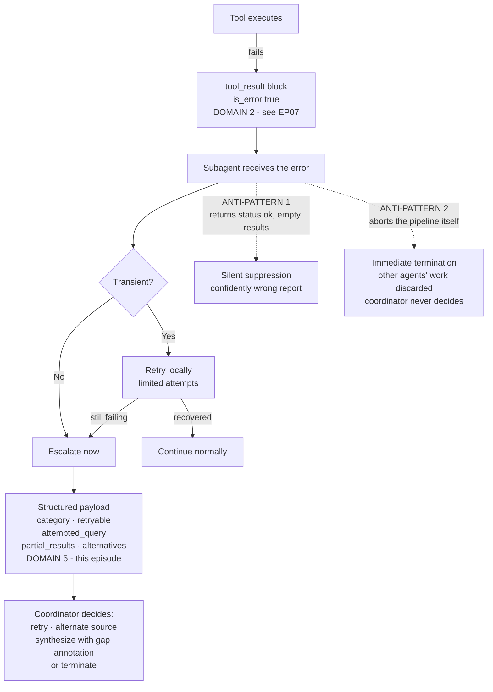
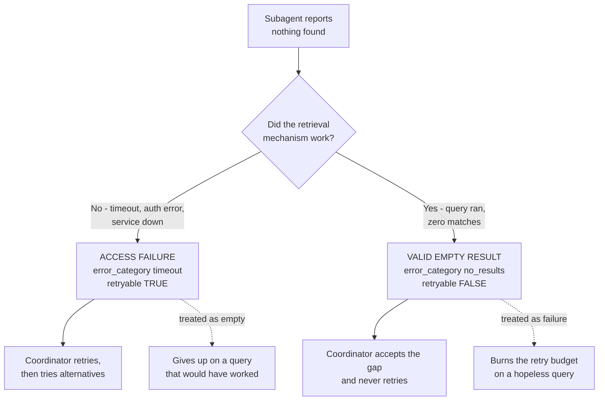
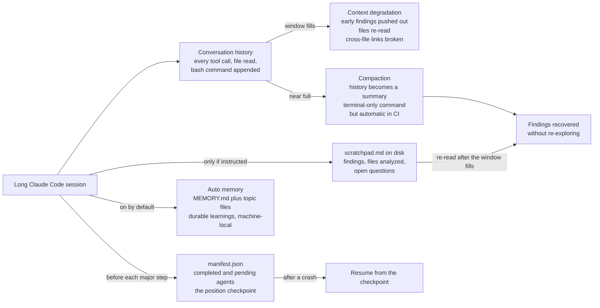

---
tags:
  - CCA-F
  - domain-5
  - error-propagation
  - context-management
  - reliability
  - multi-agent
  - youtube-course
date: 2026-08-05
status: done
domain: "5 of 5"
source: "Peace Of Code — Claude Certified Architect Ep 19"
---

# 🔇 EP19 — Subagent Error Propagation & Context Management

> [!NOTE] Exam Coverage
> Maps to **Domain 5 — Context Management & Reliability**, task statements **5.3** (error propagation strategies across multi-agent systems) and **5.4** (context management in large codebase exploration). Covers the silent-failure mode, why subagent → coordinator propagation is a different problem from tool → agent propagation, the four ingredients of a recovery-ready error, partial results and alternatives, the access-failure versus valid-empty-result distinction, the two exam-trap anti-patterns, local recovery before escalation, and the three persistence mechanisms for long sessions — scratchpad files, `/compact`, and the session manifest.

**Back to:** [[CCA-F Study Roadmap]] · **Domain note:** [[D5 - Context Management & Reliability]] · **Deck:** [[EP19 - Flashcards]]
**Source:** [Peace Of Code — Ep 19 (42 min)](https://www.youtube.com/watch?v=MqnElZw6NYk) · Level: college / professional-certification · Question mix calibrated MCQ-heavy (40 / 40 / 20)
**Previous:** [[EP18 - Why AI Agents Forget (Context Engineering)]]

---

## 1. Outline

- [1. Outline](#1-outline)
- [2. Key Terms](#2-key-terms)
- [3. Concept Summaries](#3-concept-summaries)
  - [3.1 The Silent Failure Mode and Two Levels of Propagation](#31-the-silent-failure-mode-and-two-levels-of-propagation)
  - [3.2 Why Vague Errors Paralyze Coordinators](#32-why-vague-errors-paralyze-coordinators)
  - [3.3 The Four Ingredients of a Recovery-Ready Error](#33-the-four-ingredients-of-a-recovery-ready-error)
  - [3.4 Partial Results and Alternatives](#34-partial-results-and-alternatives)
  - [3.5 Access Failure vs Valid Empty Result](#35-access-failure-vs-valid-empty-result)
  - [3.6 Two Anti-Patterns — Silent Suppression and Immediate Termination](#36-two-anti-patterns--silent-suppression-and-immediate-termination)
  - [3.7 Local Recovery First, Then Escalate](#37-local-recovery-first-then-escalate)
  - [3.8 Context Degradation in Long Sessions](#38-context-degradation-in-long-sessions)
  - [3.9 Scratchpad Files](#39-scratchpad-files)
  - [3.10 The compact Command and Its CI-CD Limit](#310-the-compact-command-and-its-ci-cd-limit)
  - [3.11 The Manifest File and Crash Recovery](#311-the-manifest-file-and-crash-recovery)
  - [3.12 The Three Layers of a Silence-Proof System](#312-the-three-layers-of-a-silence-proof-system)
- [4. Diagrams](#4-diagrams)
- [5. Worked Examples](#5-worked-examples)
- [6. Practice Questions](#6-practice-questions)
- [7. Cheat Sheet](#7-cheat-sheet)

---

## 2. Key Terms

| Term | Definition | Source |
|---|---|---|
| **Silent failure** | The episode's opening scenario: an overnight multi-agent job produces *"no error, no output, no report — just dead silence."* The sneakiest agentic failure mode because there is nothing to debug. | [02:34] |
| **Two levels of propagation** | **Tool → agent** (Domain 2, covered in [[EP07 - Agent Error Handling & tool_choice]]) versus **subagent → coordinator** (Domain 5, this episode). Same discipline, different hop. | [04:44] |
| **Generic error** | `{"error": "operation failed"}`. Tells the coordinator nothing, so it either dies silently or guesses. The thing the exam wants you to reject. | [07:50] |
| **Structured error context** | An error payload carrying metadata the coordinator can branch on. The lecture's minimum: category, retryable, attempted query, partial results + alternatives. | [08:14] |
| **`error_category`** | What *kind* of failure — timeout, permission, invalid input, policy violation, no results. **The field that enables the retryable decision.** | [08:41] |
| **`retryable`** | The single most important Boolean in the payload. `true` → the coordinator retries; `false` → retrying can never help. | [09:18] |
| **`attempted_query`** | What the subagent was trying to do when it broke. Lets the coordinator understand the gap rather than guess at it. | [09:40] |
| **`partial_results`** | Data collected before the failure. *"A failing agent might have retrieved three out of five documents… the data is still valuable."* The most overlooked field. | [11:29] |
| **`alternatives`** | Other sources or approaches to try **if the retry also fails**. Gives the coordinator a second move. | [14:29] |
| **`is_error`** | The flag that says a failure occurred at all. A real Messages API field on `tool_result` blocks; in a subagent payload it is your own convention — see §3.3. | [13:38] |
| **Access failure** | The retrieval mechanism broke — network timeout, auth error, service down. The library database is down. **`retryable: true`.** | [17:30] |
| **Valid empty result** | The query succeeded and genuinely matched nothing. The library database works; the book does not exist. **`retryable: false`.** | [16:58] |
| **Silent suppression** | Anti-pattern 1. The subagent catches an exception and returns `status: "ok"` with empty results, so the coordinator sees expected emptiness. *"Produces confidently wrong reports."* | [19:21] |
| **Immediate termination** | Anti-pattern 2. One subagent failure aborts the whole pipeline, discarding every other subagent's completed work and denying the coordinator any decision. | [21:39] |
| **Local recovery** | A subagent retries transient failures itself — *"like a junior developer trying to fix the error before going to the architect"* — and escalates only when local options are exhausted. | [23:25] |
| **Transient error** | Timeouts and intermittent network issues — the class worth retrying locally. | [23:39] |
| **Context degradation** | In a long Claude Code session, early findings get pushed out, already-read files get re-read, and cross-file connections break. | [25:36] |
| **Scratchpad file** | A plain `.md` or `.json` file where Claude Code records key findings **on disk instead of in conversation history**, and re-reads to recover after the window fills. | [29:49] |
| **The scratchpad catch** | Claude Code will not create a `scratchpad.md` unprompted — you must ask for it in the prompt, in `CLAUDE.md`, or in your agent code. | [31:15] |
| **`/compact`** | Replaces conversation history with a summary to free context. Terminal-only. | [34:58] |
| **Session manifest** | A JSON checkpoint at a fixed, predictable path recording current state before each major step, so a crashed run resumes from the checkpoint rather than from zero. *"Think of it like a Git commit."* | [38:01] |
| **Three layers** | **Error layer** (structured propagation) · **context layer** (scratchpad + compact) · **recovery layer** (manifest). Combined, they make silent failure impossible. | [41:02] |

---

## 3. Concept Summaries

### 3.1 The Silent Failure Mode and Two Levels of Propagation

*Question: what exactly is the failure this episode fixes, and why is it worse than a crash?*

Because a crash tells you something. The instructor's scenario: you start a multi-agent research job at 11 p.m., expecting a full analysis report by morning. You wake up, check the terminal, and find *"no error, no output, no report. It's just dead silence."* Did it finish? Did it fail? *"There is not a bug you can Google."*

A crash gives you a stack trace and a line number. Silence gives you nothing, and it is produced by a *system that was designed to be quiet about failure* — which is why the fix is architectural rather than a matter of better logging.

The episode's second framing move is to separate two hops that look like one topic:

| Hop | Domain | Where it was covered | What signals failure |
|---|---|---|---|
| **Tool → agent** | **Domain 2** (tool design) | [[EP07 - Agent Error Handling & tool_choice]] | The `tool_result` block's **`is_error`** flag, plus error categories and retry logic — written from the *tool developer's* perspective |
| **Subagent → coordinator** | **Domain 5** (context & reliability) | **This episode** | A structured payload the subagent returns as its final message |

> [!IMPORTANT] The domain split the lecture states is correct
> *"That particular topic comes under domain number two and this one comes under domain number five, that is context and reliability."* Verified against the vault's domain map: `is_error` and tool error responses are **D2 §2.2**; error propagation across multi-agent systems is **D5 §5.3**. If an exam stem is about a *tool* returning failure, you are in D2. If it is about a *subagent* reporting to a *coordinator*, you are in D5. Same discipline, different exam objective.

The hierarchy matters because recovery happens at each level in turn: *"the tool will propagate the error to the sub agent… now the sub agent might retry locally or try some other tools. Now the sub agent execution also failed. Now it has to propagate the error back to coordinator."* Escalation is level by level, never a jump — which is §3.7.

**In your own words:** Silence is the worst failure because nothing points at it. And a subagent reporting to a coordinator is a different exam objective from a tool reporting to an agent, even though the technique rhymes.

*See PQ 1, 9.*

---

### 3.2 Why Vague Errors Paralyze Coordinators

*Question: what does a coordinator actually lose when it receives `"operation failed"`?*

Its ability to choose. The instructor's analogy is a contractor sent to fix an office renovation who comes back and says *"things didn't work out"* — no photos, no explanation. *"Should you send them back? Should you call one more contractor? Should you go and fix it yourself? You don't know."*

With no context the coordinator has exactly two moves, and both are bad: **silently kill the process** (producing the dead-silence scenario from §3.1) or **guess**. Contrast the informative version: the contractor says *"the raw materials are not enough to carry out this job."* Now there is an obvious action — order more materials.

The two payload shapes side by side:

```json
// ❌ Generic — the coordinator learns nothing
{ "error": "operation failed" }
```

```json
// ✅ Structured — every field maps to a coordinator decision
{
  "is_error": true,
  "error_category": "timeout",
  "retryable": true,
  "attempted_query": "Q3 revenue",
  "partial_results": ["doc_A", "doc_B"],
  "alternatives": ["sec_filings_db", "internal_reports_db"],
  "description": "Web search timed out after 30 seconds"
}
```

> [!IMPORTANT] Corroborated by the vault, which adds the missing "why"
> [[D5 - Context Management & Reliability]] §5.3 records the same rule and states the mechanism precisely: *"Generic errors ('search unavailable') hide context from the coordinator. The coordinator needs failure type + attempted query + partial results + retry history to make intelligent recovery decisions (retry, use alternate source, synthesize with gap annotation)."*
>
> Note that third option — **synthesize with a gap annotation**. It is the one the video never mentions and it is the most exam-relevant, because it is what lets a run *finish* rather than fail: the coordinator ships the report with "Section B: data unavailable" rather than returning nothing. D5's *Synthesis with Coverage Annotations* pattern is the completion of this idea.

**In your own words:** A vague error does not just lose information, it removes the coordinator's ability to act. Each field you add buys back one decision.

*See PQ 2, 10, 17.*

---

### 3.3 The Four Ingredients of a Recovery-Ready Error

*Question: what is the minimum a subagent must return when it gives up?*

Four things, and the instructor is explicit that these are a floor, not a ceiling — *"at least the four ingredients."*

| # | Ingredient | What it answers | What the coordinator does with it |
|---|---|---|---|
| 1 | **`error_category`** | What kind of failure — timeout, permission, invalid input, policy violation, no results | Selects a recovery strategy; **this is the field that makes the `retryable` decision possible** |
| 2 | **`retryable`** | Can retrying ever help? | Retry, or skip straight to alternatives. *"The single most important Boolean"* |
| 3 | **`attempted_query`** | What was it doing when it broke? | Understands the gap; can re-issue a corrected version |
| 4 | **`partial_results` + `alternatives`** | What did we get, and what else could work? | Keeps the salvage, then has a fallback if retry fails |

The instructor's rule for each: *"each ingredient should be concrete on its own. It should not be vague."* A category of `"error"` or an attempted query of `"the search"` fails that test.

> [!WARNING] `is_error` is a real API field — but not in this payload — verified against official docs
> The lecture shows `is_error` at the top of a **subagent's** return value and calls it *"obviously the most important part."* Two different things are being conflated:
>
> | | Where it lives | What it is |
> |---|---|---|
> | **`is_error`** | On a **`tool_result`** content block in the Messages API: `{"type": "tool_result", "tool_use_id": "...", "content": "...", "is_error": true}` | A **defined API field**. This is the D2, tool → agent hop |
> | A subagent's error payload | The subagent's **final message**, which returns to the coordinator as the spawn tool's result | **Your own JSON schema.** No field names are API-defined here — [[D5 - Context Management & Reliability]] §5.3 uses `"status": "error"` and `"failure_type"` |
>
> ❌ Assuming `is_error` / `error_category` / `retryable` are SDK-defined fields at the subagent level
> ✅ They are a **convention you design**; only `is_error` on `tool_result` is API-defined
>
> **Exam answer: know `is_error` as the tool-level flag, and know the subagent payload by its *ingredients* rather than exact key names.** A stem testing key names will be testing `tool_result.is_error`; a stem testing subagent propagation will be testing whether the payload carries category, retryability, attempt, and salvage.
> Source: [Tool use — handling errors](https://platform.claude.com/docs/en/agents-and-tools/tool-use/overview) · consistent with [[D2 - Tool Design & MCP Integration]] §2.2

The vault's version of the payload is worth learning alongside the lecture's, because it adds retry history — which tells the coordinator *how hard the subagent already tried* and prevents a duplicate retry budget:

```json
{
  "status": "error",
  "failure_type": "transient_timeout",
  "attempted_query": "SELECT * FROM orders WHERE customer_id=C88221",
  "partial_results": ["..."],
  "retry_attempted": true,
  "retry_count": 3,
  "alternative_approaches": ["try read replica", "try cached data"]
}
```

**In your own words:** Category, retryability, what it tried, what it salvaged plus what else to try. Four ingredients, each concrete, each buying one coordinator decision.

*See PQ 3, 11, 17.*

---

### 3.4 Partial Results and Alternatives

*Question: why does the instructor single out `partial_results` as the field the exam will test?*

Because it is the one most people leave out. *"The results field is very underrated over here, and it's often very overlooked."*

His example: a subagent tasked with retrieving five documents fails after three. Those three are still real, still valid, still expensive to have obtained. Discarding them because the task did not fully complete throws away work and forces the coordinator to start over. His analogy is a manager and a report: *"you weren't able to figure out what is happening, but you were able to do something partially. Then the manager is kind of happy that you did something and helps you out for the next part."*

The coordinator's reading of the field is precise: *"keeps doc A and doc B and it doesn't discard them. It just focuses on what we have missed."* Partial results convert a failed subagent call into a **narrowed** one.

`alternatives` is the second-order move, and the ordering is what makes it useful:

1. `retryable: true` → the coordinator **retries** the same approach.
2. Retry also fails → **now** the coordinator reads `alternatives` and switches source — the SEC-filings database, the internal-reports database.

*"So the coordinator understands, okay, I tried retry, but now that the retry is also not working, then let's try out some alternative suggested."* Without `alternatives` the coordinator's options end when the retry budget does.

> [!TIP] Partial results are also what enable a run to finish **(expansion)**
> Pair this with D5's *Synthesis with Coverage Annotations*: the coordinator that holds partial results can produce a report marked
> `Section B (gap — data unavailable): search agent timed out; coverage incomplete`
> instead of returning nothing. That is the concrete escape from the episode's opening dead-silence scenario — partial results plus honest gap annotation beat both silence and a confidently complete-looking report.

**In your own words:** A partial success is not a failure. Return what you got, name what is missing, and suggest where else to look — the coordinator then narrows rather than restarts.

*See PQ 4, 12, 18.*

---

### 3.5 Access Failure vs Valid Empty Result

*Question: two subagents both report "nothing found." Should the coordinator retry?*

It depends entirely on **which kind of nothing** — and the instructor flags this as the tricky exam scenario. His library analogy is the clearest framing in the episode:

| Librarian says | Meaning | Category | `retryable` |
|---|---|---|---|
| *"The database is down — come back later"* | The **retrieval mechanism** broke | **Access failure** — network timeout, auth error, service down | **`true`** |
| *"The book doesn't exist"* (database working) | The query **succeeded** and matched nothing | **Valid empty result** | **`false`** |

Both *sound* like "I found nothing." Only one can be fixed by asking again.

The cost of conflating them runs in both directions, which is the part worth memorizing: *"if you treat both the same, your coordinator kind of wastes time retrying queries that will never return results. And when it does that, it kind of gives up on the queries that would have worked on a second attempt."* You burn the retry budget on the hopeless case and therefore have none left for the recoverable one.

The mapping in payload terms:

```
error_category: "timeout"     → retryable: true      (access failure)
error_category: "no_results"  → retryable: false     (valid empty result)
```

> [!IMPORTANT] This is a named exam trap in the vault, independently recorded
> [[D5 - Context Management & Reliability]] §5.3 carries it under *"Critical Distinction (Exam Trap!)"*: *"Access failure → something went wrong retrieving data → coordinator should consider retry/escalation. Valid empty result → query succeeded, no matching data exists → coordinator should NOT retry. Conflating these wastes retry attempts on valid empty results."*
>
> The instructor's closing line names the mechanism exactly right: **"the `error_category` field is what enables this distinction."** Without a category, `retryable` is a guess.

**In your own words:** "Nothing found" is two different answers. The mechanism broke → retry. The answer is genuinely empty → never retry. The category field is what tells them apart.

*See PQ 5, 13, 19.*

---

### 3.6 Two Anti-Patterns — Silent Suppression and Immediate Termination

*Question: which two error-handling shapes appear as exam distractors?*

**Anti-pattern 1 — silent suppression.** The subagent catches an exception and returns success anyway:

```python
# ❌ The exception is swallowed; the coordinator sees a normal empty result
try:
    results = search(query)
except Exception:
    return {"status": "ok", "results": []}
```

The instructor connects it straight back to §3.5, which is what makes it dangerous rather than merely sloppy: this failure **disguises itself as a valid empty result**. *"The coordinator will think that, okay, nothing has happened. This is the expected result. So it will do nothing."* His librarian version is sharp — what if the librarian simply searched badly, and the book *is* there? You walk away believing it does not exist.

> [!WARNING] Why this is the worst of the two
> *"This produces confidently wrong reports and it is the worst kind of failure. And you don't even know that you did something wrong."* Silent suppression is how the opening dead-silence scenario becomes something worse than silence: a **complete-looking report built on a gap nobody knows about**. Immediate termination at least fails loudly.

**Anti-pattern 2 — immediate termination.** One subagent's failure aborts everything:

```python
# ❌ One subagent's failure discards every other subagent's completed work
except Exception as e:
    abort_pipeline(e)
```

Two distinct harms: *"all the work done by other sub agent is thrown down the garbage,"* and *"the coordinator itself never gets to make a decision."* The second is the design error — the subagent has usurped a decision that is not its to make.

The fix is an authority rule: **only the coordinator may terminate the pipeline.** A subagent's job is to report; the coordinator's job is to decide, and terminating may well be the right decision — just not the subagent's to take.

> [!IMPORTANT] The lecture's suggested enforcement mechanism is real — verified
> *"You can control that by using some kind of safety mechanism like a hook."* Verified: an Agent SDK hook returns a top-level **`continue`** field (`continue_` in Python) that *"determines whether the agent keeps running after this hook."* So termination authority genuinely can be enforced in the hook layer rather than requested in a prompt — the same probabilistic-versus-deterministic argument as [[EP05 - PreToolUse, PostToolUse Hooks & Task Decomposition]] §3.1.
> Source: [Hooks in the SDK](https://code.claude.com/docs/en/agent-sdk/hooks) → *Outputs*

[[D5 - Context Management & Reliability]] §5.3 lists **three** anti-patterns rather than two — the lecture's two plus *"return generic 'operation failed'"*, which this episode treats as its own topic in §3.2. Same content, different partitioning.

**In your own words:** Never lie about success, and never let a worker kill the pipeline. Suppression produces confident wrong answers; termination throws away good work and steals the coordinator's decision.

*See PQ 6, 14, 20.*

---

### 3.7 Local Recovery First, Then Escalate

*Question: should a subagent escalate the moment something fails?*

No — it should try to fix it first. The instructor's framing: *"like a junior developer trying to fix the error before going to the architect."*

The rule is keyed to error class:

| Failure | Local action before escalating |
|---|---|
| **Transient** — timeout, intermittent network | **Retry locally** a limited number of times |
| **Wrong format** | Adjust the query and re-issue |
| **Source down** | Try the backup source |
| **All local options exhausted** | **Escalate to the coordinator** with a structured payload |

The last row is the definition of "exhausted": *"if it has exhausted all the tools, all the available things, then escalate to the coordinator."* Escalation is not a first resort, and it is not a fallback for difficulty — it is what happens when the subagent has genuinely run out of moves.

> [!IMPORTANT] Corroborated, and the vault adds the non-transient branch
> [[D5 - Context Management & Reliability]] §5.3's *Local Recovery Pattern* flowchart adds the case the lecture skips: a **non-transient** error should **propagate immediately** with structured context rather than being retried at all. Retrying a permission error or an invalid-input error is pure waste — the same reasoning as `retryable: false` in §3.5.
>
> So the complete rule has two branches, not one: **transient → retry locally, then escalate; non-transient → escalate now.**

This also explains why `retry_count` belongs in the payload (§3.3). Without it the coordinator cannot tell a subagent that tried three times from one that tried zero, and may spend its own budget repeating work.

**In your own words:** Retry what is worth retrying, locally, then hand up a structured report. Escalate immediately when retrying cannot possibly help.

*See PQ 7, 15.*

---

### 3.8 Context Degradation in Long Sessions

*Question: the episode switches from multi-agent code to Claude Code sessions. What is the failure there?*

Quiet forgetting. Every tool call, every file read, every bash command, every `grep` *"gets appended to the conversation history."* Hours in, the window is stuffed with raw output and Claude Code *"keeps running, but somehow it is quietly forgetting findings early in the session."*

The instructor names three distinct symptoms, and they are worth separating because the fixes differ:

1. **Early findings get pushed out** of the window entirely.
2. **Already-read files get re-read** — *"you're spending additional tokens that you don't need."*
3. **Cross-file connections break** — when several files depend on each other, *"this kind of connections get disconnected"* because they are no longer all in context simultaneously.

The third is the subtlest and the most damaging for architecture work: individual facts survive, but the *relationships* between them do not.

His cost note is fair and worth keeping: throwing a bigger model at it is not a fix — *"let's go with Opus 4.8 max effort and do everything. You will run out of context in 15 minutes."* The techniques let you use a **cheaper model successfully** rather than an expensive model briefly.

> [!TIP] Two accurate reframings of this section **(expansion)**
> - Symptom 3 is the **lost-in-the-middle** effect from [[EP18 - Why AI Agents Forget (Context Engineering)]] §3.4 seen from a different angle: cross-file relationships are exactly the kind of content that ends up in the low-attention middle of a long transcript.
> - Symptom 2 has a *native* mitigation the video does not mention: `/context` shows what is currently consuming context, so you can see re-reads accumulating instead of inferring them.
> Source: [Manage sessions → Manage context within a session](https://code.claude.com/docs/en/sessions)

**In your own words:** Long sessions lose early findings, re-read files they already read, and quietly drop the connections between files. Three symptoms, three fixes.

*See PQ 8, 16.*

---

### 3.9 Scratchpad Files

*Question: how do findings outlive the context window?*

By living on disk instead of in the transcript. A scratchpad is *"a plain markdown or a JSON file"* — nothing exotic — into which Claude Code writes its key findings as it explores. *"It will not record it in the conversation history, but in an actual file."* When the window fills and old findings drop out, Claude Code re-reads the scratchpad *"to recover what matters instantly"* rather than re-exploring the codebase.

The contents, per the instructor's example file: key findings, services examined, files analyzed, open questions. His analogy is a detective's case notebook — write the evidence down, re-read it, reconstruct the picture.

**The catch, which is the exam-relevant part:** *"Claude Code will not automatically create scratch files on its own. You need to trigger this particular action."* Three trigger points depending on where you are running:

| Context | How to trigger it |
|---|---|
| **Interactive session** | Say so in the prompt — *"as you go through, maintain your findings in the `scratchpad.md` file"* |
| **Automated CI/CD** | Put the instruction in **`CLAUDE.md`**, which loads at the start of every session, since you cannot prompt in real time |
| **Programmatic agent** | Code it into the subagent's own instructions in the agentic loop |

> [!WARNING] Claude Code *does* persist findings on its own now — auto memory, on by default
> The lecture's *"Claude Code will not automatically create scratch files on its own"* is correct about a file literally named `scratchpad.md`, but its broader implication — that Claude never writes findings to disk unprompted — is out of date.
>
> **Auto memory is enabled by default.** Claude writes its own notes across sessions: *"build commands, debugging insights, architecture notes, code style preferences."* Storage is `~/.claude/projects/<project>/memory/`, with a `MEMORY.md` index plus topic files; the **first 200 lines or 25KB** of `MEMORY.md` loads at the start of every session, and topic files are read on demand. Toggle via `/memory`, the `autoMemoryEnabled` setting, or `CLAUDE_CODE_DISABLE_AUTO_MEMORY=1`.
>
> The two are **not** interchangeable, and the distinction is the useful part:
>
> | | Auto memory | Scratchpad file |
> |---|---|---|
> | Who writes it | Claude, unprompted | Claude, because you asked |
> | What it holds | Durable **learnings and patterns** it judges reusable | A **working log of this exploration** |
> | Scope | Per repository, **machine-local**, across sessions | Wherever you put it; commit it if you want |
> | Loaded | First 200 lines / 25KB every session | Only when Claude re-reads it |
>
> ❌ "Claude Code never persists anything unless told to"
> ✅ Auto memory persists *learnings* by default; a scratchpad is still needed for a *per-session exploration log*, which auto memory is not designed to be
>
> **Exam answer: the scratchpad technique as taught** — it is what [[D5 - Context Management & Reliability]] §5.4 documents, and the exam predates the feature. Real code: expect auto memory to already be running, and note `--bare` disables it in CI.
> Source: [How Claude remembers your project → Auto memory](https://code.claude.com/docs/en/memory)

> [!TIP] On the lecture's "keep everything in the `.claude` folder" advice
> Sound as a convention — a fixed, predictable path saves Claude from hunting, which is the instructor's actual point and a good one. But note it is a **convention, not a documented requirement**, and auto memory deliberately does *not* follow it: it lives under `~/.claude/projects/<project>/memory/`, outside the repo and machine-local, so it is never committed.

**In your own words:** Findings on disk survive a window that findings in the transcript do not. Claude will not start a scratchpad unprompted — ask in the prompt, in `CLAUDE.md`, or in code.

*See PQ 8, 16, 20.*

---

### 3.10 The compact Command and Its CI-CD Limit

*Question: what does `/compact` do, and what is the exam claim about pipelines?*

`/compact` *"compresses the conversation history into a summary"* so the session has room to keep working. You can type it, and Claude Code also runs it automatically as the window approaches full.

> [!IMPORTANT] The lecture's exam answer is right — its reasoning and its implication are not
> The claim: *"if in the exam it comes that you can run compact command in your CI/CD pipeline, then you cannot do that. So the answer is always no."*
>
> **The literal claim is verified.** `/compact` is **terminal-only** and is not available in non-interactive `-p` mode. Some built-in commands *do* work in `-p` (user-invoked skills and custom commands expand in the prompt string; `/model`, `/effort`, `/config` take arguments), but `/compact` is not among them.
>
> **The reasoning is wrong.** The lecture says it fails because *"it is a command that you type, so you cannot pass it as a header or a parameter."* But custom commands and skills *are* passed exactly that way in `-p` mode. `/compact` is unavailable because it is classified terminal-only, not because commands as a category cannot be passed.
>
> **The implication is wrong, and this is what matters in practice.** "You cannot compact in CI" is false: **automatic compaction still runs in non-interactive sessions**, and its threshold is configurable by environment variable — `CLAUDE_CODE_AUTO_COMPACT_WINDOW` — which is exactly the mechanism a pipeline *can* use.
>
> ❌ "Context cannot be compacted in a CI/CD pipeline"
> ✅ "**The `/compact` command** cannot be invoked in a CI/CD pipeline; automatic compaction still happens, and you tune it with `CLAUDE_CODE_AUTO_COMPACT_WINDOW`"
>
> **Exam answer: no, you cannot run `/compact` in a pipeline** — the lecture's answer stands. Real code: rely on auto-compaction and set the window.
> Source: [Non-interactive mode](https://code.claude.com/docs/en/headless) · [Slash commands](https://code.claude.com/docs/en/commands) · [Context window → Set the auto-compact window](https://code.claude.com/docs/en/context-window)

> [!WARNING] The "90%" threshold is approximate, not the documented mechanism
> The lecture says auto-compaction fires *"when you are reaching like 90% of your context window."* Officially the trigger is a **configurable token count**, not a fixed percentage: set it with `/autocompact <size>` (accepting 100K–1M) or `CLAUDE_CODE_AUTO_COMPACT_WINDOW`. Defaults are model-dependent — a 1M-window Sonnet 5 session auto-compacts at about **967K tokens**, and models running with a 200K window compact at the 200K boundary. "Somewhere near full" is the right intuition; 90% is not a number to reproduce.
> Source: [Context window → Set the auto-compact window](https://code.claude.com/docs/en/context-window)

What survives compaction is worth knowing alongside this, and connects to §3.9: project-root `CLAUDE.md` is **re-read from disk and re-injected** after `/compact`, so a scratchpad instruction living there survives. Instructions given only in conversation do not. Per [[D5 - Context Management & Reliability]] §5.4, invoked skills are re-injected truncated to roughly 5,000 tokens each, oldest dropped first, and the `PreCompact` hook lets you inspect or customize what is preserved.

**In your own words:** `/compact` summarizes history to free room. You cannot type it in a pipeline — but compaction still happens there automatically, and the threshold is an environment variable.

*See PQ 10, 18.*

---

### 3.11 The Manifest File and Crash Recovery

*Question: a four-hour exploration dies halfway through. What gets you back?*

The instructor's answer is a **session manifest**: before every major step, Claude Code writes its current state to a JSON file at *"a known, predictable, fixed location."* Restart, point at the manifest, and *"it picks up exactly where it had left off."* His analogy: *"think of it like a Git commit"* — checkpoint before risky or expensive work, roll back to the last checkpoint when something goes wrong.

His scratchpad-versus-manifest distinction is the right one: the scratchpad records **what was learned** (files read, findings, open questions); the manifest records **where you were** (which steps are done, which are pending). Findings versus position.

The vault's shape for it, from [[D5 - Context Management & Reliability]] §5.4:

```json
{
  "session_id": "refactor-auth-2026-06-16",
  "completed_agents": ["auth-explorer", "test-finder"],
  "pending_agents": ["refactor-planner"],
  "key_findings": {
    "auth_entry": "src/auth/index.ts",
    "jwt_bug": "src/auth/tokens.ts:47"
  }
}
```

> [!WARNING] A crashed session does **not** start from zero — verified against official docs
> The lecture's premise is that losing the terminal loses the work: *"without persistent state, you are restarting from absolute zero,"* and *"you cannot directly continue from a particular checkpoint without using a manifest file."*
>
> Officially, **sessions are saved continuously to disk as you work**, precisely so you can return after an exit. Two native mechanisms already cover the crash case:
>
> | Mechanism | What it restores |
> |---|---|
> | **`claude --continue`** | The most recent session in the current directory. `--resume <name-or-id>` targets a specific one; bare `--resume` opens a picker |
> | **Checkpointing** (`/rewind`) | Rewinds **code and conversation** to an earlier point — the actual native version of the lecture's Git-commit analogy |
>
> A resumed session restores *"the full history, including tool calls and results"*, plus the model, agent, and permission mode. Transcripts live at `~/.claude/projects/<project>/<session-id>.jsonl`.
>
> ❌ "A closed terminal means restarting from absolute zero"
> ✅ `--continue` / `--resume` restore the session; `/rewind` checkpoints code and conversation
>
> **So what is a manifest actually for?** Two things `--resume` genuinely does not give you, and this is the steelman worth carrying into the exam:
> 1. **Multi-agent workflow state** — which subagents completed and which are pending is *your* orchestration state, not conversation history. Nothing in the session transcript exposes it as a resumable checkpoint.
> 2. **Portability across processes** — a manifest is a plain file any process can read. Sessions are scoped to a project directory, are **machine-local**, and sessions created by `claude -p` do not even appear in the picker (resumable only by explicit ID).
>
> **Exam answer: the manifest pattern as taught** — it is D5 §5.4's *Structured State Persistence for Crash Recovery*, and it is the right answer for a long-running **multi-agent workflow**. Just do not carry the false premise: for a plain interactive session, `--resume` is the answer.
> Source: [Manage sessions](https://code.claude.com/docs/en/sessions) · [Checkpointing](https://code.claude.com/docs/en/checkpointing)

> [!TIP] The two halves of this episode meet on resume **(expansion)**
> Resuming a session that has been idle over an hour and exceeds 100,000 tokens offers three choices, and they are exactly the trade-off this episode is about: **resume from summary** (runs `/compact` immediately — cheaper per later request, but whatever the summary drops is gone), **resume full as-is** (every detail, cost scaling with size), or stop asking. This is §3.10's compaction trade-off surfacing as a recovery decision.
> Source: [Manage sessions → Resume from a summary](https://code.claude.com/docs/en/sessions)

**In your own words:** The manifest is a checkpoint of *position*, the scratchpad a record of *findings*. Sessions already persist on their own — the manifest earns its place for multi-agent workflow state, not for basic crash recovery.

*See PQ 16, 19, 20.*

---

### 3.12 The Three Layers of a Silence-Proof System

*Question: how do the halves of this episode combine?*

Into three layers, each closing a different route to silence:

| Layer | Mechanism | Silence it prevents |
|---|---|---|
| **Error layer** | Structured propagation — category, `retryable`, `attempted_query`, `partial_results`, `alternatives` | A subagent failing without the coordinator knowing what or why |
| **Context layer** | Scratchpad files written continuously to disk, plus compaction | Findings vanishing from the window with no trace they existed |
| **Recovery layer** | Session manifest checkpoints | A crash discarding hours of work with nothing to resume from |

*"If you kind of mix all of them, you would have a foolproof system."*

The through-line is that all three replace an **implicit** assumption with an **explicit** artifact. The error layer replaces "it probably worked" with a payload. The context layer replaces "it probably remembers" with a file. The recovery layer replaces "it probably survived" with a checkpoint. Silence is what you get when a system's success and failure paths are indistinguishable — and each layer makes one of them legible.

**In your own words:** Error layer, context layer, recovery layer. Each converts something the system was assuming into something it wrote down.

*See PQ 9, 15.*

---

## 4. Diagrams

### 4.1 Two levels of propagation, and where silence gets in



*The solid path is the design. The two dotted paths are the exam distractors — and the only actor allowed to terminate is the coordinator at the bottom.*

### 4.2 Which kind of "nothing found"



*Conflating the two costs you in both directions — the error category field is what tells them apart.*

### 4.3 Where findings live as a session grows



*Three deliberate artifacts plus one automatic one. The scratchpad and manifest exist only because you asked; auto memory runs unless you disable it.*

---

## 5. Worked Examples

### Example 1 — Turn a paralyzing error into a recovery-ready one

**Problem:** A web-search subagent inside a research pipeline returns `{"error": "search unavailable"}` after a 30-second timeout, having already retrieved two of five target documents and retried twice locally. The coordinator halts the whole run. Rewrite the payload and state what the coordinator now does with each field.

1. **Name what the coordinator cannot determine.** From `"search unavailable"` it cannot tell whether the failure is transient, nor whether any results exist.
   *(§3.2 — this is the exam question the instructor poses verbatim at [24:52]; the answer is to redesign the payload, not to retry blindly.)*
2. **Add `error_category`.** `"timeout"`.
   *(§3.5 — the category is what makes the retryable decision possible; without it `retryable` is a guess.)*
3. **Add `retryable: true`.** A timeout is an access failure — the mechanism broke, not the answer.
   *(§3.5 — contrast `"no_results"`, which would be `false`.)*
4. **Add `attempted_query`.** `"Q3 revenue"` — what it was doing when it broke.
   *(§3.3 — lets the coordinator re-issue a corrected version instead of reconstructing intent.)*
5. **Add `partial_results`.** `["doc_A", "doc_B"]` — the two documents already retrieved.
   *(§3.4 — the coordinator keeps these and narrows the task to the missing three rather than restarting.)*
6. **Add `alternatives`.** `["sec_filings_db", "internal_reports_db"]` — where to go if the retry also fails.
   *(§3.4 — alternatives are the second-order move, read only after retry is exhausted.)*
7. **Add retry history.** `retry_attempted: true`, `retry_count: 2`.
   *(§3.7 — tells the coordinator the subagent already spent two attempts, so it does not silently duplicate the budget. This is the vault's field, not the lecture's.)*
8. **Keep the pipeline alive.** The subagent returns and stops; it does not abort.
   *(§3.6 anti-pattern 2 — only the coordinator may terminate.)*

**Answer:** The subagent returns `{is_error: true, error_category: "timeout", retryable: true, attempted_query: "Q3 revenue", partial_results: ["doc_A","doc_B"], alternatives: ["sec_filings_db","internal_reports_db"], retry_attempted: true, retry_count: 2}`. The coordinator now retries the two missing documents; if that fails it switches to the SEC-filings database; if that also fails it synthesizes a report with an explicit coverage gap — and at no point does it stop knowing why.

---

### Example 2 — Set `retryable` correctly, and price the cost of getting it wrong

**Problem:** Four subagents report back. Classify each and set `retryable`. Then, assuming a retry budget of $R = 6$ attempts per run at $t = 30$ seconds each, compute the wall-clock cost of misclassifying every valid empty result as an access failure.

1. **"Auth token rejected by the vendor API."** The mechanism failed — the query never really ran.
   *(§3.5 — auth error is one of the instructor's named access-failure examples.)*
   → **Access failure**, `error_category: "permission"`, `retryable: true` *(retry after refreshing the credential; retry alone will not help if the token is simply invalid — which is why the category, not just the Boolean, is what the coordinator reads).*
2. **"Query ran against the index; zero documents matched."** The mechanism worked.
   *(§3.5 — the librarian's "the book doesn't exist," with a working database.)*
   → **Valid empty result**, `error_category: "no_results"`, `retryable: false`.
3. **"Connection to the read replica timed out after 30s."** Classic transient.
   *(§3.7 — the class worth retrying locally before escalating at all.)*
   → **Access failure**, `retryable: true`.
4. **"Caught an exception, returning `status: ok` with `results: []`."** Not a classification problem — a **reporting** problem.
   *(§3.6 anti-pattern 1 — this is silent suppression masquerading as case 2, which is precisely why it is dangerous.)*
   → Reject the payload. The subagent must report `is_error: true` with a real category.
5. **Price the misclassification.** If every valid empty result is treated as retryable, each one consumes the full budget for nothing:
   $$T_{\text{wasted}} = R \times t = 6 \times 30\ \text{s} = 180\ \text{s}$$
6. **Price the second-order harm, which is the larger one.** The budget is now spent, so a *genuinely* recoverable access failure arriving later in the same run gets **zero** attempts — the instructor's point that you *"give up on the queries that would have worked on a second attempt."* With $k$ empty results misclassified ahead of it, the recoverable query receives
   $$\max\!\left(0,\; R - k \times R\right) = 0 \quad \text{for all } k \geq 1$$
   attempts — a single misclassification is enough to starve it.

**Answer:** Cases 1 and 3 are access failures (`retryable: true`); case 2 is a valid empty result (`retryable: false`); case 4 is silent suppression and must be fixed at the source. Misclassifying case 2 wastes 180 s of retry budget *and* starves every later recoverable failure of attempts — the harm is not the wasted time but the retry that never happens.

---

### Example 3 — Design persistence for a four-hour exploration

**Problem:** Claude Code must map a large monorepo over roughly four hours, in CI, on a cheaper model. It must survive the window filling, must not re-read files, and must survive the runner being killed. Choose the mechanisms and say what each one covers.

1. **Expect auto memory to be running already.** It is on by default and persists durable learnings to `~/.claude/projects/<project>/memory/`.
   *(§3.9 — but it is machine-local and holds learnings, not a per-run exploration log, so on a fresh CI runner it starts empty. It is not the answer here.)*
2. **Check whether `--bare` is in the invocation.** If it is, auto memory and `CLAUDE.md` are both skipped.
   *(This is the trap for CI specifically: the mechanism you were relying on may be disabled by the flag that makes CI reproducible.)*
3. **Add a scratchpad instruction to `CLAUDE.md`, not the prompt.** In CI there is no interactive turn in which to ask.
   *(§3.9 — `CLAUDE.md` loads at the start of every session, which is exactly the property needed here.)*
4. **Rely on automatic compaction rather than `/compact`.** The command is terminal-only.
   *(§3.10 — and set the threshold with `CLAUDE_CODE_AUTO_COMPACT_WINDOW`, which is available to a pipeline.)*
5. **Confirm the scratchpad instruction survives compaction.** Project-root `CLAUDE.md` is re-read from disk and re-injected after a compaction pass.
   *(§3.10 — an instruction given only in a prompt would not survive, which is a second reason it belongs in `CLAUDE.md`.)*
6. **Write a manifest before each major step**, at a fixed path, recording completed and pending phases plus key findings.
   *(§3.11 — this is the position checkpoint. Note the scratchpad covers findings and the manifest covers position; you want both.)*
7. **On restart, point at the manifest and give a one-line summary of prior work.** The instructor's own recipe — combine the manifest with a short recap.
   *(§3.11 — and per [[EP03 - Subagent Context Passing & Session Management]] §3.10, frame injected prior findings as *hypotheses to validate*, since the codebase may have moved.)*
8. **Know the fallback you did not have to build.** For an interactive session, `--continue` / `--resume` would already restore full history including tool results, and `/rewind` checkpoints code and conversation.
   *(§3.11 — the manifest earns its place here because this is a *multi-phase workflow in CI*, where sessions created by `claude -p` are resumable only by explicit ID and workflow position is not in the transcript at all.)*

**Answer:** Put the scratchpad instruction in `CLAUDE.md` (not the prompt), let auto-compaction handle the window with the threshold set by environment variable, and write a manifest checkpoint before each phase. Scratchpad covers findings, manifest covers position, compaction covers the window. Verify `--bare` is not silently disabling `CLAUDE.md`, and treat any injected prior findings as hypotheses rather than facts.

---

## 6. Practice Questions

1. What makes the "silent failure" the sneakiest agentic failure mode? *(§3.1 / Term: silent failure)*

   <details><summary>Answer</summary>
   There is nothing to debug — <strong>no error, no output, no report, just silence</strong>. A crash yields a stack trace; silence yields nothing, and it is produced by a system designed to be quiet about failure, so the fix is architectural rather than better logging.
   </details>

2. Name the two levels of error propagation and the domain each belongs to. *(§3.1 / Term: two levels of propagation)*

   <details><summary>Answer</summary>
   <strong>Tool → agent</strong> is <strong>Domain 2</strong> (tool design; the <code>tool_result</code> <code>is_error</code> flag). <strong>Subagent → coordinator</strong> is <strong>Domain 5</strong> (context and reliability) and is this episode's subject.
   </details>

3. List the four ingredients of a recovery-ready error response. *(§3.3 / Term: structured error context)*

   <details><summary>Answer</summary>
   <strong><code>error_category</code></strong> (what kind of failure) · <strong><code>retryable</code></strong> (can retrying help) · <strong><code>attempted_query</code></strong> (what it was doing when it broke) · <strong><code>partial_results</code> + <code>alternatives</code></strong> (what was salvaged, and what else to try). Each must be concrete on its own.
   </details>

4. Distinguish an access failure from a valid empty result, and give the `retryable` value for each. *(§3.5 / Term: access failure)*

   <details><summary>Answer</summary>
   <strong>Access failure</strong> — the retrieval mechanism broke (network timeout, auth error, service down): <strong><code>retryable: true</code></strong>. <strong>Valid empty result</strong> — the query succeeded and genuinely matched nothing: <strong><code>retryable: false</code></strong>.
   </details>

5. Name the two error anti-patterns the instructor flags as exam distractors. *(§3.6 / Term: silent suppression)*

   <details><summary>Answer</summary>
   <strong>Silent suppression</strong> — catching an exception and returning <code>status: "ok"</code> with empty results. <strong>Immediate termination</strong> — one subagent's failure aborting the entire pipeline.
   </details>

6. State the local-recovery rule, including the branch the lecture omits. *(§3.7 / Term: local recovery)*

   <details><summary>Answer</summary>
   <strong>Transient errors</strong> (timeouts, intermittent network) → <strong>retry locally</strong> a limited number of times, then escalate with structured context once local options are exhausted. The omitted branch: <strong>non-transient errors propagate immediately</strong> — retrying a permission or invalid-input error is pure waste.
   </details>

7. Name the three symptoms of context degradation in a long session. *(§3.8 / Term: context degradation)*

   <details><summary>Answer</summary>
   (1) <strong>Early findings pushed out</strong> of the window. (2) <strong>Already-read files re-read</strong>, spending tokens unnecessarily. (3) <strong>Cross-file connections broken</strong>, because dependent files are no longer all in context at once.
   </details>

8. Name the three layers of a silence-proof system and the mechanism in each. *(§3.12 / Term: three layers)*

   <details><summary>Answer</summary>
   <strong>Error layer</strong> — structured error propagation. <strong>Context layer</strong> — scratchpad files plus compaction. <strong>Recovery layer</strong> — the session manifest.
   </details>

9. Why does a generic error leave a coordinator with only two bad options, and what are they? *(§3.2 / Comprehension)*

   <details><summary>Answer</summary>
   Because <code>"operation failed"</code> carries no basis for a decision. The coordinator can only <strong>silently kill the process</strong> (producing the dead-silence scenario) or <strong>guess</strong>. Every field added to the payload buys back one real decision — retry, switch source, or synthesize with a gap annotation.
   </details>

10. Explain why `partial_results` is described as the most overlooked field, and what the coordinator does with it. *(§3.4 / Comprehension)*

    <details><summary>Answer</summary>
    Because a failed task feels like it produced nothing — but a subagent that retrieved three of five documents produced three real, expensively obtained documents. The coordinator <strong>keeps them and narrows the task to what is missing</strong> rather than restarting. It also enables finishing the run with an explicit coverage gap instead of returning nothing.
    </details>

11. Why is conflating access failure with valid empty result costly in *both* directions? *(§3.5 / Comprehension)*

    <details><summary>Answer</summary>
    Treating an empty result as retryable <strong>burns the retry budget on a query that can never succeed</strong>; treating an access failure as empty <strong>gives up on a query that would have worked on a second attempt</strong>. Because the budget is shared, one misclassification starves the other case.
    </details>

12. Why is silent suppression worse than immediate termination? *(§3.6 / Comprehension)*

    <details><summary>Answer</summary>
    Because it <strong>disguises a failure as a valid empty result</strong>, so the coordinator concludes nothing went wrong and does nothing. The output is a <strong>confidently wrong, complete-looking report</strong> with a gap nobody knows about. Immediate termination at least fails loudly.
    </details>

13. The lecture says only the coordinator may terminate the pipeline. What is the design error in a subagent that terminates, and how can the rule be enforced? *(§3.6 / Comprehension)*

    <details><summary>Answer</summary>
    The subagent has <strong>usurped a decision that is not its to make</strong> — and it discards every other subagent's completed work on the way out. Terminating may well be correct, but only the coordinator has the whole picture. Enforcement: an SDK hook's top-level <strong><code>continue</code></strong> field (<code>continue_</code> in Python) determines whether the agent keeps running, making this a deterministic control rather than a prompt request.
    </details>

14. Claude Code will not create a `scratchpad.md` unprompted. Give the three trigger points and say which one CI requires. *(§3.9 / Comprehension)*

    <details><summary>Answer</summary>
    (1) <strong>The prompt</strong>, in an interactive session. (2) <strong><code>CLAUDE.md</code></strong>, which loads at the start of every session. (3) <strong>Agent code</strong>, for a programmatic loop. <strong>CI requires <code>CLAUDE.md</code></strong>, because there is no interactive turn in which to ask — and it has the bonus property of surviving compaction, since project-root <code>CLAUDE.md</code> is re-read from disk and re-injected.
    </details>

15. How does auto memory differ from a scratchpad file, and why does the scratchpad technique still matter? *(§3.9 / Comprehension)*

    <details><summary>Answer</summary>
    <strong>Auto memory</strong> is written by Claude unprompted, holds durable <strong>learnings and patterns</strong>, is per-repository and machine-local, and loads its <code>MEMORY.md</code> index (first 200 lines / 25KB) every session. A <strong>scratchpad</strong> is written because you asked and is a <strong>working log of one exploration</strong>. Auto memory is not designed to be a per-session exploration log, so the scratchpad still fills a real gap — and <code>--bare</code> disables auto memory in CI.
    </details>

16. What does a manifest file give you that `--continue` / `--resume` does not? *(§3.11 / Comprehension)*

    <details><summary>Answer</summary>
    Two things. (1) <strong>Multi-agent workflow state</strong> — which subagents completed and which are pending is your orchestration state, not conversation history, so nothing in the transcript exposes it as a resumable checkpoint. (2) <strong>Portability</strong> — a manifest is a plain file any process can read, whereas sessions are scoped to a project directory, machine-local, and <code>claude -p</code> sessions are resumable only by explicit ID. Note the lecture's premise is wrong: sessions <em>are</em> saved continuously, so a closed terminal does not mean starting from zero.
    </details>

17. A web-search subagent returns a generic `search unavailable` status. The coordinator cannot tell whether the failure is transient or whether partial results exist. What is the most effective action, and why are the alternatives wrong? *(§3.2, §3.6 / Application)*

    <details><summary>Answer</summary>
    <strong>Redesign the subagent to return structured error context.</strong> The distractors are each a known anti-pattern: <strong>retry blindly</strong> has no basis for deciding whether retrying can help; <strong>terminate the pipeline</strong> is immediate termination and discards other agents' work; <strong>return empty results</strong> is silent suppression. Fixing the coordinator cannot help — the information was never sent.
    </details>

18. A subagent times out after retrieving two of five documents, having retried twice. Write the payload and trace the coordinator's decision sequence. *(§3.3, §3.4 / Application)*

    <details><summary>Answer</summary>
    <code>{is_error: true, error_category: "timeout", retryable: true, attempted_query: "Q3 revenue", partial_results: ["doc_A","doc_B"], alternatives: ["sec_filings_db","internal_reports_db"], retry_attempted: true, retry_count: 2}</code>. Sequence: keep doc A and doc B and <strong>narrow the task to the three missing documents</strong> → because <code>retryable</code> is true, <strong>retry</strong> → if the retry fails, <strong>switch to the first alternative source</strong> → if that fails, <strong>synthesize with an explicit coverage gap</strong>. <code>retry_count</code> stops it duplicating the two attempts already spent.
    </details>

19. You need context compaction inside a CI/CD pipeline. What can and cannot be done? *(§3.10 / Application)*

    <details><summary>Answer</summary>
    <strong>You cannot invoke <code>/compact</code></strong> — it is terminal-only and unavailable in non-interactive <code>-p</code> mode. <strong>You can rely on automatic compaction</strong>, which still runs in non-interactive sessions, and tune its threshold with the <strong><code>CLAUDE_CODE_AUTO_COMPACT_WINDOW</code></strong> environment variable. So "no compaction in CI" is false; only the typed command is unavailable.
    </details>

20. A four-hour CI exploration must survive the window filling, avoid re-reading files, and survive the runner being killed. Name the mechanism for each requirement and the one flag that could silently break your plan. *(§3.9, §3.10, §3.11 / Application)*

    <details><summary>Answer</summary>
    <strong>Window filling</strong> → automatic compaction, threshold via <code>CLAUDE_CODE_AUTO_COMPACT_WINDOW</code>. <strong>Avoid re-reading</strong> → a scratchpad file, instructed in <strong><code>CLAUDE.md</code></strong> since CI has no interactive prompt. <strong>Runner killed</strong> → a <strong>manifest</strong> checkpoint written before each phase, at a fixed path. The flag that breaks it: <strong><code>--bare</code></strong>, which skips <code>CLAUDE.md</code> and auto memory — so the scratchpad instruction never loads.
    </details>

---

## 7. Cheat Sheet

| Cue | Note |
|---|---|
| Silent failure | No error, no output, no report — nothing to debug |
| Two levels | Tool → agent = **D2** (`is_error`) · subagent → coordinator = **D5** |
| Generic error | `"operation failed"` → coordinator can only die or guess |
| **4 ingredients** | **`error_category` · `retryable` · `attempted_query` · `partial_results` + `alternatives`** |
| Key Boolean | **`retryable`** — but `error_category` makes it decidable |
| Most overlooked | **`partial_results`** — 3 of 5 docs is still 3. Narrow, don't restart |
| `alternatives` fire | Only after the **retry failed** |
| Vault adds | `retry_attempted` · `retry_count` → no duplicate budgets |
| **Access failure** | Mechanism broke — timeout, auth, down → **`retryable: true`** |
| **Valid empty result** | Query ran, zero matches → **`retryable: false`** |
| Conflating them | Wastes budget on hopeless queries **and** starves recoverable ones |
| **Anti-pattern 1** | **Silent suppression** — `status: ok` on an exception |
| **Anti-pattern 2** | **Immediate termination** — discards others' work, steals the decision |
| Termination authority | **Coordinator only.** Enforce with a hook's `continue` |
| Local recovery | Transient → retry then escalate · **non-transient → escalate now** |
| Context degradation | Findings pushed out · files re-read · **cross-file links broken** |
| Scratchpad | Findings on **disk**. **Won't start unprompted** — prompt · **`CLAUDE.md`** (CI) · code |
| Auto memory | **On by default** — `MEMORY.md`, 200 lines / 25KB. `--bare` skips it |
| `/compact` in CI | **Command: no.** **Auto-compaction: yes** — `CLAUDE_CODE_AUTO_COMPACT_WINDOW` |
| Manifest vs scratchpad | Manifest = **position** · scratchpad = **findings** |
| Crash recovery | Sessions persist — `--continue` / `--resume`, plus `/rewind` |
| Three layers | **Error** · **context** · **recovery** |

**Top 5 terms:** access failure vs valid empty result · `partial_results` · silent suppression · immediate termination · session manifest.

> [!WARNING] The five headline exam traps
> ❌ Retrying a **valid empty result** → `retryable: false`
> ❌ **`status: ok`** on a caught exception → silent suppression, the worst failure
> ❌ Letting a **subagent terminate** → coordinator only
> ❌ **Discarding partial results** → narrow, don't restart
> ❌ "No `/compact` in CI" ≠ "**no compaction** in CI" → auto-compaction runs

> **Synthesis:** Every failure here is a system that cannot tell you what it does not know. A subagent reporting `"operation failed"`, one reporting `ok` over a swallowed exception, and a session quietly dropping early findings are one defect in three costumes: the success and failure paths have become indistinguishable. The three layers make each legible — a structured payload turns a dead end into a decision, a scratchpad turns a fading finding into a file, a manifest turns a lost run into a checkpoint. The unifying rule: **whoever discovers a problem is rarely entitled to resolve it.**

---

## ✅ Practice Checklist

- [ ] I can describe the silent-failure scenario and say why it beats a crash for difficulty
- [ ] I can place tool → agent in D2 and subagent → coordinator in D5 without hesitating
- [ ] I can list the four ingredients of a recovery-ready error from memory
- [ ] I know `error_category` is what makes `retryable` decidable, not the other way round
- [ ] I know `is_error` is the API field on `tool_result`, and the subagent payload is my own schema
- [ ] I can explain what a coordinator does with `partial_results`
- [ ] I know `alternatives` are read only after a retry has failed
- [ ] I can classify access failure vs valid empty result and set `retryable` correctly
- [ ] I can state the two-directional cost of conflating those two
- [ ] I can name both anti-patterns and say which is worse, and why
- [ ] I know only the coordinator may terminate, and that a hook's `continue` field enforces it
- [ ] I know the local-recovery rule *and* that non-transient errors escalate immediately
- [ ] I can name the three symptoms of context degradation
- [ ] I know a scratchpad must be triggered, and that `CLAUDE.md` is the CI trigger
- [ ] I can distinguish auto memory from a scratchpad file
- [ ] I know `/compact` is terminal-only but auto-compaction runs in CI
- [ ] I can distinguish the manifest (position) from the scratchpad (findings)
- [ ] I know sessions persist automatically, so a manifest is for workflow state, not basic recovery

---

> [!TIP] Transcription artifacts in this episode's captions
> The auto-generated captions mangle several terms — one of them a field name you need to get right:
> - **"retrievable"** → **`retryable`** (pervasive and important — the host says *"retrievable is true"* throughout, meaning the `retryable` field. Nothing is being *retrieved*)
> - **"Cloud Code" / "cloud code" / "cloud.md" / "Cloud Session"** → *Claude Code* / `CLAUDE.md` (pervasive)
> - **"Vague Vs Structure Errors"** (chapter title) → *Vague vs **Structured** Errors*
> - **"SEC filings TB internal reports TB"** [14:22] → *…**DB*** — the two alternative databases
> - **"attempted Q3 revenue"** [08:08] → `attempted_query: "Q3 revenue"`
> - **"agent tick loop"** [33:52] → *agentic loop*
> - **"scratch file" / "scratch.md"** [31:05, 34:23] → `scratchpad.md`
> - **"CCD pipeline"** [36:30] → *CI/CD pipeline*
> - **"Opus 4. 8"** [28:35] → *Opus 4.8*
> - **"junior dev developer"** [23:41] → *junior developer*
> - **"dick- distinction"** [18:55] → *distinction* (mid-word stumble)
> - **"foolproof"** vs **"full proof"** [00:30, 40:50] → *foolproof* throughout
> - **Episode cross-references:** the host is unsure at [03:20] — *"episode number six, seven, I don't remember"* — then settles on seven at [09:30] and [23:19]. Seven is correct: [[EP07 - Agent Error Handling & tool_choice]] covers tool-level error handling and `tool_choice`.
> - **"the previous episode"** [13:15, 22:35] refers to the human-escalation handoff, which is [[EP18 - Why AI Agents Forget (Context Engineering)]] §3.11 — correct.

---

*Next: [[EP20 - When AI Needs a Human]]*
