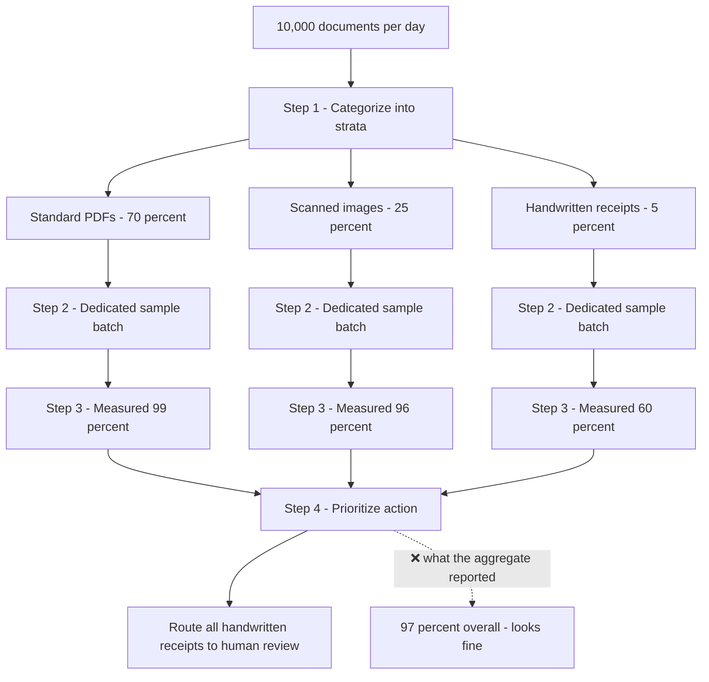
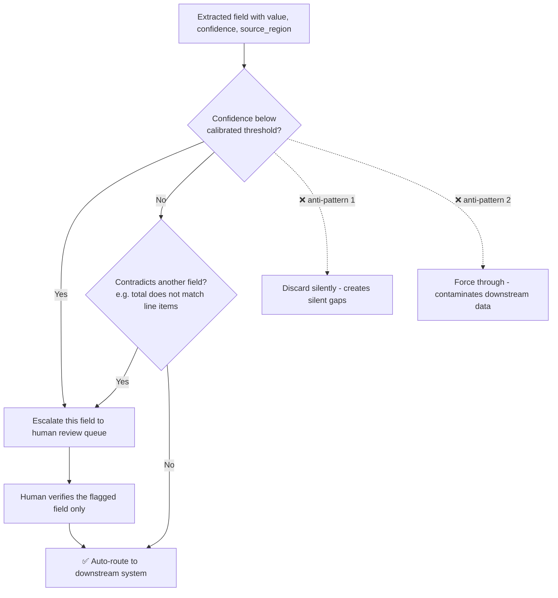
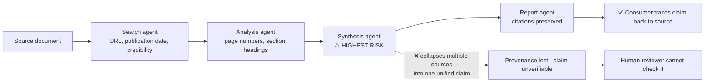

---
tags:
  - CCA-F
  - domain-5
  - human-review
  - provenance
  - reliability
  - structured-output
  - youtube-course
date: 2026-08-05
status: done
domain: "5 of 5"
source: "Peace Of Code — Claude Certified Architect Ep 20"
---

# 🧑‍⚖️ EP20 — When AI Needs a Human

> [!NOTE] Exam Coverage
> Maps to **Domain 5 — Context Management & Reliability**, task statements **5.5** (human review workflows and confidence calibration) and **5.6** (information provenance and multi-source synthesis). Covers the aggregate-accuracy trap, why high-volume categories dominate an average, stratified random sampling as the diagnostic, field-level confidence and its calibration against labeled validation sets, the two routing triggers, the two discard/force-through anti-patterns, claim-source mappings across agent boundaries, the conflicting-sources rule, temporal metadata, and why the synthesis agent is the highest-risk hop in a research pipeline. This is the **final episode of the core syllabus** — the host announces a bonus exam-walkthrough episode at the close.

**Back to:** [[CCA-F Study Roadmap]] · **Domain note:** [[D5 - Context Management & Reliability]] · **Deck:** [[EP20 - Flashcards]]
**Source:** [Peace Of Code — Ep 20 (51 min)](https://www.youtube.com/watch?v=tsIxzFg76Nw) · Level: college / professional-certification · Question mix calibrated MCQ-heavy (40 / 40 / 20)
**Previous:** [[EP19 - Subagent Error Propagation & Context Management]]

---

## 1. Outline

- [1. Outline](#1-outline)
- [2. Key Terms](#2-key-terms)
- [3. Concept Summaries](#3-concept-summaries)
  - [3.1 The Aggregate Accuracy Trap](#31-the-aggregate-accuracy-trap)
  - [3.2 Why High Volume Hides Systematic Failure](#32-why-high-volume-hides-systematic-failure)
  - [3.3 Stratified Sampling — The Four Steps](#33-stratified-sampling--the-four-steps)
  - [3.4 Confidence Lives at the Field Level](#34-confidence-lives-at-the-field-level)
  - [3.5 Calibration and Why the API Gives You Nothing](#35-calibration-and-why-the-api-gives-you-nothing)
  - [3.6 The Two Routing Triggers](#36-the-two-routing-triggers)
  - [3.7 The Two Anti-Patterns — Discard Silently and Force Through](#37-the-two-anti-patterns--discard-silently-and-force-through)
  - [3.8 The Attribution Problem and Claim-Source Mappings](#38-the-attribution-problem-and-claim-source-mappings)
  - [3.9 Conflicting Sources — Annotate Both, Pick Neither](#39-conflicting-sources--annotate-both-pick-neither)
  - [3.10 Temporal Data — Publication Date and Collection Date](#310-temporal-data--publication-date-and-collection-date)
  - [3.11 Provenance Across Agent Boundaries](#311-provenance-across-agent-boundaries)
  - [3.12 Scenario 6 — The Full Extraction Pipeline](#312-scenario-6--the-full-extraction-pipeline)
- [4. Diagrams](#4-diagrams)
- [5. Worked Examples](#5-worked-examples)
- [6. Practice Questions](#6-practice-questions)
- [7. Cheat Sheet](#7-cheat-sheet)

---

## 2. Key Terms

| Term | Definition | Source |
|---|---|---|
| **Aggregate accuracy trap** | A single headline accuracy number that masks a much worse rate inside one category. The episode's opener: *"this 97% overall accuracy kind of mask that 60% accuracy where it actually mattered."* | [03:56] |
| **Systematic failure** | The AI is *consistently* wrong on one document category — not random noise, not scattered outliers. *"Your system only is failing… that's why it's a systematic failure and we cannot ignore it."* The distinction that makes it worth fixing rather than tolerating. | [08:22] |
| **Low-volume, high-stakes category** | A category that is a tiny fraction of throughput but carries most of the consequence — handwritten receipts are *"100% of your high-stakes exceptions."* Volume and importance are independent axes. | [03:27] |
| **Stratum / strata** | A logical bucket of documents sharing a type — standard PDFs, scans, handwritten receipts, multi-language contracts. *"These are your strata… your buckets or funnels."* | [11:40] |
| **Stratified random sampling** | Categorize into strata, pull a representative sample from **each** stratum, measure accuracy **per category**. *"The correct architectural answer to identify failing document types efficiently."* | [14:30] |
| **Field-level confidence** | A confidence score attached to each extracted field, not to the document. *"Confidence lives at the field level, not the document level."* | [16:06] |
| **Source region** | Where in the document a field was read from — `"top right header"`, `"bottom table row 12"`. Travels with the value and the confidence score. | [17:49] |
| **Labeled validation set** | Real examples where the ground truth is already known, used to calibrate what a given confidence number actually means. *"Without calibration, a model's raw self-reported confidence is just a guess."* | [19:49] |
| **Confidence threshold** | The cutoff below which a field is escalated — the episode floats 0.75 / 0.80 / 0.85. Set **per field**, and per field *type*, not globally. | [22:02] |
| **Contradictory fields** | The second routing trigger: extracted values that disagree internally — a total that does not match the sum of line items, a future-dated invoice. *"The document is internally inconsistent, and it must be flagged."* | [22:59] |
| **Discard silently** | Anti-pattern 1. Dropping low-confidence fields, which *"creates silent gaps in your database"* — downstream consumers cannot tell a missing field from an absent one. | [23:54] |
| **Force through** | Anti-pattern 2. Passing low-confidence extractions downstream unflagged, which *"contaminates your downstream data"* with no audit trail and no review. | [24:39] |
| **Attribution loss** | The failure mode of summarization: agents *"have a dangerous habit — they lose their sources."* By the time a claim reaches the report, nobody can say which paper it came from. | [25:52] |
| **Claim-source mapping** | A structured object binding a claim to its origin — document, section, publication date, confidence. *"Every fact carries its passport."* Built in EP03; this episode is about whether it **survives** the whole pipeline. | [28:04] |
| **Information provenance** | The property that every final claim can be traced back to a source document. In a multi-agent pipeline it is *"everyone's responsibility"* — every hop must preserve it. | [41:49] |
| **Conflicting values** | Two credible sources giving different numbers for the same quantity. The rule: *"annotate both and pick neither"* — surface the conflict to the coordinator, escalate to a human if unresolved. | [34:21] |
| **Publication date** | When the underlying data was originally published or measured. Tells you how fresh the research is. | [36:08] |
| **Collection date** | When *your* agent actually retrieved it. Distinct from publication date; both are required. | [36:23] |
| **Temporal misinterpretation** | Treating a stale fact as current. *"A fact from 2019 is not a 2024 fact."* The fix is *"a structural schema change, not prompt engineering or retry logic."* | [38:30] |
| **Synthesis agent** | The hop that merges claims from multiple upstream agents — *"the highest risk point for provenance loss,"* because collapsing several sourced claims into one unified statement is exactly where source tags get dropped. | [45:00] |

---

## 3. Concept Summaries

### 3.1 The Aggregate Accuracy Trap

*Question: your extraction system tested at 97% accuracy and shipped. Months later finance says the quarterly numbers don't add up. What went wrong, given that the 97% was measured honestly?*

Nothing went wrong with the measurement. The 97% was real — it was just the **wrong statistic**. The system was near-perfect on standard invoices, which are the overwhelming majority of the volume, and was running at roughly **60% on handwritten receipts**, which are a small slice of throughput but, in the host's framing, *"100% of your high-stakes exceptions."*

The structural point is that an average is a volume-weighted quantity, so it reports on whatever you process most of. It is not a summary of *how the system behaves* — it is a summary of *how the system behaves on your typical document*. Those are different questions, and the exam tests whether you know it.

The hospital analogy makes it concrete: a 95% overall recovery rate is a blend of routine checkups and cardiac surgery. Nobody choosing a cardiac surgeon looks at the hospital's overall number. *"You need to know where failures are clustering, not just the average."*

> [!IMPORTANT] The exam's framing of this trap
> High aggregate accuracy is **never** sufficient evidence that a category is safe to automate. Before reducing human review for *any* category, validate accuracy **for that category specifically**. Consistent with [[D5 - Context Management & Reliability]] §5.5 — *"Always break down accuracy by document type and field before reducing human review."*

**In your own words:** an aggregate accuracy number answers "how do we do on average," which is a question nobody actually has. The question you have is "how do we do on the documents where being wrong is expensive," and the average is structurally incapable of answering it.

*See PQ 7, 13.*

---

### 3.2 Why High Volume Hides Systematic Failure

*Question: three separate forces make this trap dangerous rather than merely inaccurate. What are they?*

The episode names them in sequence, and they compound:

| Force | What it does |
|---|---|
| **High volume dominates the average** | *"If 90% of your documents are simple PDFs and your AI nails those, the average looks great."* The majority category's accuracy *is*, near enough, the headline number. |
| **Critical categories are low volume** | *"Critical categories are often low volume, but high stakes."* The categories most worth checking contribute least to the metric, so they are the ones the metric is worst at reporting. |
| **Errors on outlier types compound over time** | The failure is not scattered noise. *"You are consistently wrong about it for that particular document category — that is a systematic failure."* Bad records accumulate in the database, and every downstream consumer inherits them. |

The middle row is the one that gets underweighted. It is not a coincidence that the low-volume categories are the high-stakes ones — the same properties that make a document unusual (handwritten, non-standard, exception-path) are what make it both rare *and* consequential. Volume and importance are **anti-correlated** in exactly the cases that matter.

> [!TIP] Noise versus systematic failure — the exam distinction
> Random errors scattered across all categories are tolerable and expected at any accuracy below 100%. Errors **clustered in one category** are a design defect: the system has a blind spot it will hit every single time that document type arrives. Distractor answers that say *"errors are statistically expected at 96%"* are trading on you not making this distinction — see the quiz at [47:16].

**In your own words:** the average is loudest where you need it quietest. The categories that dominate the number are the ones you already handle, and the categories that barely register are the ones failing consistently.

*See PQ 7, 13.*

---

### 3.3 Stratified Sampling — The Four Steps

*Question: you cannot review 10,000 documents a day. How do you find the failing category without reviewing everything?*

You review **the right ones**. The car-factory analogy: a manufacturer does not inspect every car, it inspects a sample from every assembly line, every shift, every model — so when one batch spikes on defects, they catch it fast and can pull the whole line.

The episode's four steps:

1. **Categorize** — split incoming documents into distinct logical buckets (strata): standard PDFs, scans, handwritten receipts, multi-language contracts.
2. **Sample per stratum** — pull a representative sample from **each** category. The critical clause: *"even though it is just 5% of your entire volume, they get their own dedicated sample batch."* The rare category was failing precisely *"because it was not sampled."*
3. **Review and measure specifically** — human reviewers check each batch. Output is **accuracy by category**, not one overall average. *"Now you can actually see where things are breaking."*
4. **Prioritize action** — act on findings immediately. *"If handwritten forms have 60% accuracy, route all of them to human reviewers. Don't just wait for the aggregate number to improve."*

Step 2 is where the whole method lives. Sampling in proportion to volume would give the 5% category 5% of your review effort — enough to keep the aggregate honest, but not enough to produce a reliable per-category accuracy estimate for it. Giving the rare stratum a **dedicated batch** deliberately oversamples it, buying statistical power exactly where the aggregate has none.

> [!TIP] Allocation is the nuance the exam rarely tests, but you should know it
> [[D5 - Context Management & Reliability]] §5.5 says to sample *"proportionally by document type and field category"*; the lecture describes a *dedicated batch per category regardless of volume*. Both are stratified random sampling — they differ only in **allocation** (proportional vs. equal/oversampled). Proportional allocation preserves the aggregate; equal allocation maximizes per-category detection power, which is the diagnostic goal here. **The exam answer is "stratified random sampling" either way** — no CCA-F question turns on the allocation scheme. **(expansion)**

> [!IMPORTANT] Exam callout — the exact phrasing
> *"Stratified random sampling measures error rates without reviewing everything. This is the correct architectural answer to identify failing document types efficiently."* [14:30] Maximum diagnostic signal for minimum review effort. When a stem describes a category-specific failure hidden by a good aggregate, this is the answer.

**In your own words:** stratified sampling converts one useless number into one number per category, at a fraction of the cost of full review. The rare category gets its own sample *because* it is rare — that is the entire point, not an inefficiency.

*See PQ 1, 13.*

---

### 3.4 Confidence Lives at the Field Level

*Question: your agent extracts eight fields from an invoice and one of them is an unreadable handwritten address. What is wrong with asking "is this document correct?"*

It has no answer. A document is valid only if its fields are valid, so document-level confidence is an aggregate over fields — and aggregates hide minorities, which is the same defect as §3.1 one level down. *"Instead of 'is this document correct?', you ask 'is this specific field correct?'"*

The weather-forecast analogy: *"80% chance of rain tomorrow"* is nearly useless. A forecast that says 80% in the north, 20% in the south, temperature 30–40°C on the east coast is actionable, because the precision is attached to the specific claim.

The episode's worked extraction:

| Field | Value | Confidence | Source region | Action |
|---|---|---|---|---|
| `invoice_number` | `INV-2024-8891` | `0.97` | top right header | auto-route |
| `amount` | `4250.00` | `0.91` | bottom table, row 12 | auto-route |
| `vendor_address` | *(unreadable string)* | `0.63` | handwritten section | **flag for human** |

Only `vendor_address` is escalated. *"The human doesn't need to check the invoice or the total amount. The human will only check this particular address."* That is the payoff: field-level scoring turns "review this document" into "review this one field," which is the difference between a review queue you can staff and one you cannot.

Note that **`source_region` travels alongside the confidence score**. Together they answer both questions a reviewer has: *how sure are we*, and *where do I look to check*.

**In your own words:** document-level confidence commits the aggregate-accuracy trap at the level of a single record. Score each field, and the review queue collapses from documents to fields.

*See PQ 8, 13.*

---

### 3.5 Calibration and Why the API Gives You Nothing

*Question: the model emitted `0.63`. What does that number actually mean?*

By itself, nothing. *"Without calibration, a model's raw self-reported confidence is just a guess."* The fix is to **calibrate against labeled validation sets** — real examples where you already know the ground truth — and derive empirically what accuracy a `0.63` corresponds to *for that field type*. A `0.7` on an invoice number and a `0.7` on a handwritten address do not mean the same thing.

Calibration is also what sets the threshold. You do not pick `0.85` because it sounds reasonable; you pick it because your labeled set shows that below `0.85`, this field type's error rate exceeds what the business can absorb.

> [!IMPORTANT] There is no confidence score in the Claude API — verified against official docs
> The lecture never claims otherwise, but it is easy to assume one exists. **The Messages API response exposes no `logprobs`, token probabilities, or confidence field of any kind** — the response object carries `id`, `type`, `role`, `content`, `model`, `stop_reason`, `stop_details`, `stop_sequence`, `usage`, and `container`, and nothing probabilistic. A confidence score is therefore **a field the model writes into your own JSON schema**, which is exactly why it is self-reported and exactly why calibration against ground truth is mandatory rather than optional.
> Source: https://platform.claude.com/docs/en/api/messages · consistent with [[D5 - Context Management & Reliability]] §5.5 **(expansion)**

> [!WARNING] `confidence` can be required, but its range cannot be schema-enforced — verified against official docs
> The lecture says confidence and source region are *"required fields in the JSON schema, not optional"* [39:25]. That is correct: structured outputs support `required` and `additionalProperties: false`. But **numerical constraints are not supported** — `minimum`, `maximum`, and `multipleOf` are all rejected by the structured-outputs grammar. You cannot make the API guarantee `0.0 ≤ confidence ≤ 1.0`. The Python, TypeScript, Ruby, and PHP SDKs strip these constraints from the schema they send and then validate the response against your original schema **client-side**.
> **Exam answer: required fields in the schema.** Real code: required in the schema, range validated in your own code.
> Source: https://platform.claude.com/docs/en/build-with-claude/structured-outputs.md · see [[EP16 - Structured Output & JSON Schema]]

> [!WARNING] Does D5 §5.2 not say confidence scores are unreliable? — the two rules are about different things
> [[D5 - Context Management & Reliability]] §5.2 lists *"self-reported confidence scores"* as an **unreliable escalation trigger**, and §5.5 makes low field confidence a **valid routing trigger**. Both are correct, and an exam question can be built on the collision. The discriminators:
> - **§5.2** — *uncalibrated* confidence used as a proxy for **case complexity** in a conversational support agent. Model confidence ≠ how hard a case is. ❌
> - **§5.5** — *calibrated* field confidence used as a measure of **extraction accuracy** in a document pipeline, with the threshold derived from a labeled validation set. ✅
>
> The word **"calibrated"** is the tell, along with what the score is being used to predict. If a stem offers "route on the model's confidence" with no mention of calibration or ground truth, that is the §5.2 distractor.

**In your own words:** the model's number is an opinion until a labeled dataset turns it into a measurement. Calibration is what converts a self-report into a threshold you can defend.

*See PQ 6, 15.*

---

### 3.6 The Two Routing Triggers

*Question: what two conditions send a record to the human review queue?*

The autopilot analogy sets the frame: the autopilot flies most of the flight flawlessly, which does not mean the captain has no job — it means the captain's job is the **exceptions**. Thunderstorms, low visibility, turbulence, a difficult landing. The system knows when to hand control back.

| # | Trigger | What it looks like |
|---|---|---|
| **1** | **Low confidence** | Any field's calibrated confidence falls below its threshold. *"That record goes to the human review queue."* |
| **2** | **Contradictory fields** | Extracted values disagree with each other — a total that does not match the sum of line items, a date in the future. The data is present but internally inconsistent, so it is **not reliable**. |

Trigger 2 is worth dwelling on because it catches a case trigger 1 structurally cannot. A model can be *confidently wrong*: every individual field reads cleanly, every score is above threshold, and the record is still nonsense because the fields do not cohere. Confidence is a per-field property; consistency is a **cross-field** property. You need both checks, because neither implies the other.

The disposition matters as much as the trigger: *"It is not discarded. It is not hallucinated by the AI — it is escalated to the human."* Escalation preserves the record. That is what separates it from both anti-patterns in §3.7.

**In your own words:** low confidence catches "I couldn't read this"; contradictory fields catches "I read this fine and it still can't be true." A pipeline with only the first check ships confident nonsense.

*See PQ 2, 9.*

---

### 3.7 The Two Anti-Patterns — Discard Silently and Force Through

*Question: two wrong dispositions for a low-confidence field. What does each break, and why is neither an acceptable shortcut?*

They are opposite errors that share one defect — **both destroy the signal that something needed attention.**

❌ **Anti-pattern 1 — discard silently.** Drop the low-confidence field. *"It creates silent gaps in your database. The downstream systems won't know they're working with incomplete information."* The episode's chain: one subagent extracts and quietly drops the weak fields; the next subagent, which builds meaningful output from that data, never receives them — and has no way to know they ever existed. A missing field and a dropped field look identical downstream.

❌ **Anti-pattern 2 — force through.** Pass the low-confidence value along unflagged. *"That hallucinated data is being passed from one sub agent to another sub agent or to another downstream system… no audit, no human review."* The value looks exactly as authoritative as a `0.97` field.

✅ **Correct: escalate, preserving the record.** Route the specific field to human review. Nothing is lost, nothing is silently trusted, and there is an audit trail.

> [!WARNING] Both anti-patterns appear as exam distractors — verified against the lecture's own callout
> *"You kind of make sure that you are not going for that option where it says discard those low confidence fields"* [24:39]. Any answer choice that drops or silently accepts a low-confidence extraction is wrong, regardless of how efficient it sounds. Consistent with the anti-pattern framing in [[D5 - Context Management & Reliability]] §5.3 and the silent-suppression discussion in [[EP19 - Subagent Error Propagation & Context Management]].

The kinship with EP19 is worth naming: silent suppression there (a subagent returning `status: "ok"` over a caught exception) and discard-silently here are the same defect at different layers — **a system that cannot distinguish "we have no data" from "we had bad data and threw it away."**

**In your own words:** discarding loses the value; forcing through loses the warning. Escalation is the only disposition that keeps both.

*See PQ 3, 12.*

---

### 3.8 The Attribution Problem and Claim-Source Mappings

*Question: a three-agent research pipeline outputs "adoption rates increased 47% year over year." Where did that number come from?*

Nobody knows, and that is the whole problem. Agent 1 reads 50 academic papers and extracts statistics. Agent 2 synthesizes findings into a summary. Agent 3 writes the report. Somewhere along that chain the number stopped being *"McKinsey's 2024 figure for enterprise adoption"* and became *"47%."* *"Which paper, which methodology, which source? We don't know."*

The failure is intrinsic to summarization: condensing text is precisely the operation that strips the qualifying clause carrying the attribution. Agents *"have a dangerous habit — they lose their sources."*

The fix is the **claim-source mapping** — the passport analogy: *"Every claim travels with a source attached to it. Like a passport at every border crossing, the passport doesn't disappear."* The episode's shape:

```json
{
  "claim": "Adoption rate increased 47% year over year",
  "source_document": "McKinsey AI Adoption Report 2024.pdf",
  "section": "Enterprise Adoption Trends",
  "publication_date": "2024-06-01",
  "collection_date": "2024-11-14",
  "confidence": 0.92
}
```

The callback matters: this pattern was **built in EP03** in the context of passing context between agents. *"Episode three was about sending those claim source mappings correctly. This episode is about what happens when those claim source mappings survive — and when they don't."* See [[EP03 - Subagent Context Passing & Session Management]].

And the consequence when they don't survive: the claim *"becomes unverifiable — not just for your coordinator, but for the human reviewer."* The human asks *"where did this 47% come from? I need to check the source"* and there is no answer. **A claim without provenance cannot be reviewed, which means the human-review workflow of §3.6 silently stops working.** The two halves of this episode are one system.

> [!IMPORTANT] The API's Citations feature is not the answer here — verified against official docs
> The Claude API has a native **Citations** feature (`citations: {"enabled": true}` on a `document` block) that returns `cited_text`, `document_index`, `document_title`, and a `char_location` or `page_location` — genuinely a claim-source mapping, produced by the API rather than by your prompt.
> **But citations and structured outputs are mutually exclusive.** Enabling citations on any document while also sending `output_config.format` returns a **400**, *"because citations require interleaving citation blocks with text output, which is incompatible with the strict JSON schema constraints of structured outputs."*
> So in the extraction pipeline this episode describes — which requires a strict JSON schema with required `confidence` and `source_region` fields — **claim-source mappings must be fields you define in your own schema**, exactly as the lecture teaches. Citations is the right tool for a cited *prose* answer over documents; it is not available to you once you have committed to structured output.
> Source: https://platform.claude.com/docs/en/build-with-claude/citations.md · consistent with [[D5 - Context Management & Reliability]] §5.6 **(expansion)**

**In your own words:** summarization is a source-destroying operation, so attribution has to be carried as structured data that survives it rather than as prose the next agent might paraphrase away. Lose the mapping and you have not just lost a citation — you have disabled human review.

*See PQ 15.*

---

### 3.9 Conflicting Sources — Annotate Both, Pick Neither

*Question: one report says the 2024 market is \$12B; another says \$18B. What does the agent do?*

The episode enumerates the wrong answers first, and they are the distractors:

| ❌ Wrong | Why |
|---|---|
| Pick the highest (\$18B) | Arbitrary. Encodes a bias with no justification. |
| Pick the lowest (\$12B) | Arbitrary in the other direction. |
| Average them (\$15B) | *"That is also hallucinated information."* \$15B appears in no source. You have manufactured a number and given it the authority of two. |

✅ **Correct: annotate both findings with their respective sources, and surface the conflict to the coordinator.** *"This value came from this source and this value came from this source."* If the coordinator cannot resolve it with the methods available, it **escalates to a human**, who decides which source is valid.

The average is the trap worth internalizing, because it *feels* like the balanced, defensible choice. It is the worst of the three: the two source values are each defensible with a citation, while \$15B is a synthetic figure that cannot be traced to anything. It fabricates data while looking like caution.

Often the "conflict" is not a conflict at all — the episode's own example notes a differing **methodology** (serviceable obtainable market vs. total market). Annotating both with sources is what makes that visible; averaging destroys the evidence that would have explained the gap. *"That is how a good research assistant operates… they will not fabricate information."*

> [!IMPORTANT] Consistent with the vault, and with the temporal rule
> [[D5 - Context Management & Reliability]] §5.6 states the same rule and adds the resolution hint: include collection and publication dates so you can rule out a **temporal** discrepancy — two "conflicting" figures measured a year apart are not in conflict at all. §3.10 is what makes that check possible.

**In your own words:** with conflicting sources the agent's job is to *report the disagreement*, not resolve it. Averaging is not neutrality — it is inventing a third number that no source supports.

*See PQ 10.*

---

### 3.10 Temporal Data — Publication Date and Collection Date

*Question: "average loan processing time is 12 days." True or false?*

Unanswerable without a date. It was true in 2019, when the pipeline included manual steps; today it might be 3 days. *"A fact from 2019 is not a 2024 fact… data has an expiration date."* (The milk analogy: past the best-by date, it does not matter that it smells fine.)

The fix is **two mandatory date fields in every structured output**:

| Field | Answers | Why it is separate |
|---|---|---|
| **`publication_date`** | When was this originally published or measured? | Tells you how fresh the underlying research is. |
| **`collection_date`** | When did your agent actually retrieve it? | Tells you how stale *your copy* is. A 2024 paper fetched two years ago may have been revised or retracted. |

Both are needed because they can diverge in either direction, and each answers a question the other cannot.

> [!IMPORTANT] The exam callout — and the distractor pair it rules out
> *"Require publication and collection dates in structured outputs to prevent temporal misinterpretation. The fix is a **structural schema change**, not prompt engineering or retry logic."* [38:30]
> Both rejected options are stated explicitly in the lecture as wrong answers. If the stem is about stale or contradictory-across-time data, the answer is **mandatory date fields in the schema** — never "improve the prompt," never "add a retry."

*"Don't make dates optional."* Optional means absent whenever the model is unsure, which is precisely when you need them. And the payoff is downstream: *"if you are a database engineer and you filter on the dates… you would have the source of truth of data."* Making the fields required is what makes that query possible at all.

**In your own words:** an undated fact is an unfalsifiable one. Two required date fields make staleness a queryable property of the record instead of an assumption in someone's head.

*See PQ 4, 14.*

---

### 3.11 Provenance Across Agent Boundaries

*Question: in a four-agent research pipeline, which hop is most likely to lose attribution — and why that one?*

The pipeline: **search agent → analysis agent → synthesis agent → report agent.** The goal is *"verifiable research where every final claim traces back to a source document."* Each hop has an obligation:

| Agent | Must preserve | Risk |
|---|---|---|
| **Search** | URL, publication date, domain credibility with every claim | *"Often the first place attribution gets dropped."* If it never leaves here, nothing downstream can recover it. |
| **Analysis** | Page numbers, section headings, document metadata forwarded from search | Must emit *both* extracted content and the metadata it arrived with — not one or the other. |
| **Synthesis** | **All source tags, on every claim, while merging** | **Highest risk.** Merging is where mappings get crossed or collapsed. |
| **Report** | Every citation from synthesis, in a traceable structure | Consumer must be able to trace any claim back to the search agent's source. |

The synthesis agent is the answer, and the reason is structural rather than incidental. It is **the only agent whose job is to combine claims from multiple sources.** Search and analysis handle one document at a time — forwarding metadata is copying. Synthesis receives several claim-source mappings and must produce one coherent output, and the natural way to do that is to *"collapse multiple sources into one unified claim."* That collapse is the loss. The other risk is mismatching: *"it should not get confused, mix and match this particular source with that particular claim."*

> [!IMPORTANT] Exam callout — memorize this one
> *"The synthesis agent is the highest risk point for provenance loss, and it explicitly requires source tags in its **instance prompt** and **output schema**."* [45:00] Note **both** mechanisms: the prompt tells it to preserve tags, the schema makes an output without them invalid. The prompt alone is a request; the schema is enforcement. Consistent with [[D5 - Context Management & Reliability]] §5.6 — *"the structured mapping must survive each synthesis step, not just the first."*

> [!TIP] Transcription artifact — "governance loss"
> At [45:00] the captions render this as *"the synthesis agent is the highest risk point for **governance** loss."* The word is **provenance**. Governance is an unrelated concept and would send you looking for the wrong answer entirely.

**In your own words:** provenance is a chain, and a chain fails at the link doing the most work. Search and analysis forward metadata; synthesis *merges* claims, which is the one operation that structurally tempts an agent to drop the source tags.

*See PQ 5, 11.*

---

### 3.12 Scenario 6 — The Full Extraction Pipeline

*Question: assemble everything into one structured-extraction architecture. What are the layers?*

The episode's closing synthesis names five, and they map to the whole lesson:

1. **Extraction with field-level confidence** — each field carries a `confidence` score and a `source_region`. *"Both are required fields in the JSON schema, not optional."*
2. **Stratified sampling** — documents categorized (standard PDFs, scans, handwritten receipts); each category sampled *"even if the volume is small"*; accuracy tracked and reported **by category**.
3. **Routing logic** — threshold-based. Low confidence or contradictory data → coordinator → human reviewer.
4. **Temporal metadata** — mandatory publication and collection dates on every record.
5. **Provenance** — claim-source mappings maintained through every hop.

The host's summary of what a production research or extraction system must have: *"extraction, quality, routing, and provenance."*

What makes this a coherent architecture rather than five good ideas is that each layer covers a different failure mode of the same underlying defect — **the system knowing something the humans downstream do not.** Field confidence exposes uncertainty the model would otherwise hide. Stratified sampling exposes failure the aggregate would otherwise hide. Routing makes exposed uncertainty actionable instead of decorative. Provenance and dates make a claim checkable *after* it leaves the pipeline. Drop any one and a category of silent wrongness reopens.

That is also the thread running through the whole of Domain 5, and the reason this is the final episode: [[EP19 - Subagent Error Propagation & Context Management]] made failures legible to the **coordinator**; this episode makes them legible to the **human**.

**In your own words:** five layers, one principle — never let the system be more certain in its output than it was in its evidence.

*See PQ 13, 14, 15.*

---

## 4. Diagrams


*Stratified sampling turns one misleading number into one number per category — the 5% stratum gets its own batch precisely because it is small.*


*The two routing triggers and the two anti-patterns — escalation is the only disposition that loses neither the value nor the warning.*


*Provenance is everyone's responsibility, but synthesis is the hop that merges — and merging is where source tags get dropped.*

---

## 5. Worked Examples

### Example 1 — Reconstructing the hidden category rate

The quiz scenario: 10,000 documents/day, **96% overall accuracy**, persistent errors reported in **legal contracts**, which are **5% of volume** and run at **60% accuracy**. What is the accuracy on everything else?

**Step 1.** Write the aggregate as a volume-weighted average of the strata.
*(why: the headline number is not a property of the system — it is a weighted blend, so it can be decomposed.)*

$$A_{\text{overall}} = w_{\text{legal}} \cdot A_{\text{legal}} + w_{\text{other}} \cdot A_{\text{other}}$$

**Step 2.** Substitute the known values.
*(why: three of the four quantities are given; the fourth is what the aggregate was hiding.)*

$$0.96 = (0.05)(0.60) + (0.95) \cdot A_{\text{other}}$$

**Step 3.** Solve for $A_{\text{other}}$.

$$A_{\text{other}} = \frac{0.96 - 0.03}{0.95} = \frac{0.93}{0.95} \approx 0.9789$$

**Step 4.** Convert to error counts, which is what the business actually feels.
*(why: percentages understate the concentration; counts make it visible.)*

$$\text{legal errors} = 500 \times 0.40 = 200 \qquad \text{total errors} = 10{,}000 \times 0.04 = 400$$

**Answer:** everything else runs at **≈ 97.9%**, and legal contracts at **60%**. **5% of the volume produces 50% of all errors** — 200 of 400 bad records a day. The aggregate reports 96% and says nothing about either fact.

---

### Example 2 — How much can fixing the worst category move the headline number?

Same system. Suppose you fix legal contracts completely, from 60% to 95%. What does the aggregate become?

**Step 1.** Recompute with the improved stratum.
*(why: to test whether the aggregate is even capable of registering the fix.)*

$$A_{\text{overall}}' = (0.05)(0.95) + (0.95)(0.9789) = 0.0475 + 0.9300 = 0.9775$$

**Step 2.** Compare.

$$\Delta = 97.75\% - 96.00\% = 1.75 \text{ percentage points}$$

**Answer:** eliminating **88% of the errors in your worst category** moves the headline number by **1.75 points** — plausibly inside normal measurement noise. This is the deeper reason aggregate metrics fail: they cannot *detect* the problem, and they cannot *credit* the fix. Per-category accuracy reporting is not a refinement of the aggregate; it is the only instrument that shows the work.

---

### Example 3 — What a field-level threshold does to reviewer workload

An invoice has **8 extracted fields**. Calibration shows each field independently clears its threshold with probability **0.97**. How much human review does this generate?

**Step 1.** Probability that a document passes with no field flagged.
*(why: fields are independent, so the document-level pass rate is the product.)*

$$P(\text{clean}) = 0.97^{8} \approx 0.7837$$

**Step 2.** Fraction of documents touching a human.

$$1 - 0.7837 = 0.2163 \approx 21.6\%$$

**Step 3.** Expected **fields** reviewed per document — the number that actually sets staffing.
*(why: reviewers check flagged fields, not whole documents. This is the payoff of §3.4.)*

$$E[\text{flagged fields}] = 8 \times 0.03 = 0.24$$

**Answer:** about **21.6% of documents** trigger a review, but a reviewer reads only **0.24 fields per document** — roughly **one field per four documents**. Under document-level confidence, that same 21.6% would arrive as *whole documents* to re-check, eight fields at a time: $8 \times 0.2163 \approx 1.73$ fields per document, **a ~7× larger review surface** for identical detection. Field-level scoring is what makes the human-in-the-loop economically viable at all.

---

## 6. Practice Questions

**PQ 1.** *(Recall)* Complete the exam callout: *"Stratified random sampling measures error rates ______."*

<details><summary>Answer</summary>

**Without reviewing everything.** It is *"the correct architectural answer to identify failing document types efficiently"* — maximum diagnostic signal for minimum review effort. *(§3.3 / Stratified random sampling)*
</details>

**PQ 2.** *(Recall)* Name the two triggers that send a record to the human review queue.

<details><summary>Answer</summary>

**(1) Low confidence** — a field's calibrated confidence falls below its threshold. **(2) Contradictory fields** — extracted values disagree internally (total ≠ sum of line items, a future date). *(§3.6 / Contradictory fields)*
</details>

**PQ 3.** *(Recall)* Name the two anti-patterns for handling a low-confidence extracted field.

<details><summary>Answer</summary>

**Discard silently** (creates silent gaps downstream) and **force through** (contaminates downstream data with no audit or review). The correct action is to **escalate the field**, which preserves the record. *(§3.7 / Discard silently, Force through)*
</details>

**PQ 4.** *(Recall)* Which two date fields must appear in structured outputs, and what does each record?

<details><summary>Answer</summary>

**`publication_date`** — when the data was originally published or measured. **`collection_date`** — when your agent actually retrieved it. Both required, never optional. *(§3.10 / Publication date, Collection date)*
</details>

**PQ 5.** *(Recall)* Which agent in a search → analysis → synthesis → report pipeline is the highest-risk point for provenance loss, and what two mechanisms enforce source tags there?

<details><summary>Answer</summary>

The **synthesis agent**. Source tags must be required in **its instance prompt** *and* **its output schema** — the prompt requests preservation, the schema makes an output without tags invalid. *(§3.11 / Synthesis agent)*
</details>

**PQ 6.** *(Recall)* What must field-level confidence be calibrated against?

<details><summary>Answer</summary>

**Labeled validation sets** — real examples where the ground truth is already known. Without calibration a model's raw self-reported confidence is just a guess. *(§3.5 / Labeled validation set)*
</details>

**PQ 7.** *(Comprehension)* Why does high volume in one category make an aggregate accuracy metric structurally unable to report on a rare category?

<details><summary>Answer</summary>

An average is **volume-weighted**, so the majority category's accuracy effectively *is* the headline number. A rare category contributes in proportion to its share — so a catastrophic rate inside a 5% stratum barely perturbs the aggregate. The trap compounds because critical categories are typically the low-volume ones, meaning the metric is worst exactly where accuracy matters most. *(§3.1, §3.2)*
</details>

**PQ 8.** *(Comprehension)* Why is document-level confidence the same mistake as aggregate accuracy, one level down?

<details><summary>Answer</summary>

Both are aggregates, and aggregates hide minorities. A document score blends eight fields, so one unreadable field is diluted by seven clean ones — the same way one failing document category is diluted by the bulk of the volume. Scoring per field also collapses the review unit from a document to a field, which is what makes the human queue affordable. *(§3.4)*
</details>

**PQ 9.** *(Comprehension)* A record has every field above its confidence threshold, yet the extraction is wrong. Which trigger catches it, and why can the other one never catch it?

<details><summary>Answer</summary>

**Contradictory fields.** Confidence is a **per-field** property — the model can be confidently wrong about each value individually. Consistency is a **cross-field** property that no per-field score can express. Neither check implies the other, which is why both are required. *(§3.6)*
</details>

**PQ 10.** *(Comprehension)* Two credible sources report the 2024 market at \$12B and \$18B. Why is averaging to \$15B worse than picking one arbitrarily?

<details><summary>Answer</summary>

Both source values are traceable to a citation; **\$15B appears in no source** — it is fabricated data wearing the authority of two sources. Averaging also destroys the evidence of disagreement, which often reflects a methodology difference (e.g. serviceable obtainable market vs. total market) or a temporal gap that a human could have resolved. Correct: **annotate both with their sources, pick neither, surface the conflict.** *(§3.9)*
</details>

**PQ 11.** *(Comprehension)* Why is the synthesis agent riskier than the search or analysis agents, given all three must preserve provenance?

<details><summary>Answer</summary>

Search and analysis handle **one source at a time**, so preserving provenance is copying metadata forward. Synthesis is the only hop whose job is to **merge claims from multiple sources**, and the natural way to merge is to collapse several sourced claims into one unified statement — which is precisely the operation that drops or crosses source tags. The risk is structural to its function, not incidental. *(§3.11)*
</details>

**PQ 12.** *(Comprehension)* Discarding a low-confidence field and forcing it through look like opposite mistakes. What single defect do they share?

<details><summary>Answer</summary>

**Both destroy the signal that something needed attention.** Discarding loses the value and leaves a gap indistinguishable from genuinely absent data; forcing through keeps the value but strips the warning, so it looks as authoritative as a high-confidence field. Escalation is the only disposition that preserves both the data and the flag. *(§3.7)*
</details>

**PQ 13.** *(Application)* A pipeline processes 10,000 documents/day at 96% overall accuracy. Document-level confidence is above 80% and records auto-route downstream, yet persistent errors are reported specifically in legal contracts. What is the most likely root cause?

<details><summary>Answer</summary>

**Document-level confidence is masking category-specific failures; the system requires stratified sampling.** The distractors and why each fails:
- *"The global 0.80 threshold is too low"* — ❌ the defect is **document-level** vs. field-level scoring, not the threshold value.
- *"Errors are statistically expected at 96%"* — ❌ errors **clustered in one category** are systematic failure, not noise.
- *"Needs more few-shot examples"* — ❌ this is a data-categorization and confidence-measurement problem, **not a prompt-engineering problem**.

*(§3.1, §3.3, §3.4 — the episode's own quiz at [47:16])*
</details>

**PQ 14.** *(Application)* A research agent feeds an ERP system. Records are internally contradictory: some show a 12-day loan processing time, others 3 days. Prompt tuning and retry logic have not helped. What is the fix?

<details><summary>Answer</summary>

**A structural schema change: require `publication_date` and `collection_date` on every record.** The values are not in conflict — they are measurements from different years, and without dates that is invisible. The lecture names both attempted fixes as wrong answers: *"the fix is a structural schema change, not prompt engineering or retry logic."* Mandatory dates also let a database engineer filter on time and recover the source of truth. *(§3.10)*
</details>

**PQ 15.** *(Application)* Your extraction pipeline uses `output_config.format` with a strict JSON schema requiring `confidence` and `source_region` per field. A teammate proposes enabling the Claude API's Citations feature on the source documents to get attribution "for free." What happens, and what should you do?

<details><summary>Answer</summary>

**The request returns a 400.** Citations and structured outputs are **incompatible** — citations interleave citation blocks with text output, which cannot coexist with strict JSON-schema constraints. Build claim-source mappings as **fields in your own schema** (`source_document`, `section`, `source_region`, `publication_date`, `collection_date`), exactly as the episode teaches. Citations is the right tool for cited *prose* answers over documents, not for a schema-constrained extraction pipeline. Note also that `required` is enforceable in the schema but `minimum`/`maximum` are not — validate the 0–1 range on `confidence` in your own code. *(§3.5, §3.8 — verified against official docs)*
</details>

---

## 7. Cheat Sheet

| Cue | Note |
|---|---|
| Aggregate accuracy | Volume-weighted → reports on your **typical** document, not your **risky** one |
| 97% masks 60% | High volume dominates; critical categories are low volume; errors compound |
| Noise vs systematic | Scattered = tolerable · **clustered in one category** = design defect |
| Stratified sampling | Categorize → sample **each** stratum → measure **by category** → act |
| Rare stratum | Gets its **own dedicated batch** — it failed *because* it wasn't sampled |
| Confidence level | **Field**, never document |
| Field payload | `value` + `confidence` + `source_region` |
| Calibration | Against **labeled validation sets** — uncalibrated confidence is a guess |
| No API confidence | Messages API has **no logprobs** — confidence is a field *you* schema |
| Schema limits | `required` ✅ · `minimum`/`maximum` ❌ — validate range client-side |
| Two triggers | Low confidence · contradictory fields |
| Two anti-patterns | ❌ discard silently · ❌ force through → ✅ **escalate** |
| Attribution loss | Summarization strips sources — mappings must be **structured** |
| Conflicting sources | **Annotate both, pick neither** — never average |
| Temporal fix | `publication_date` + `collection_date`, **required** — schema change, not prompting |
| Highest-risk hop | **Synthesis agent** — instance prompt **and** output schema |
| Citations vs structured output | Mutually exclusive → **400** |

**Top 5 terms:** stratified random sampling · field-level confidence · labeled validation set · claim-source mapping · temporal misinterpretation.

> [!WARNING] The five headline exam traps
> ❌ Treating a good **aggregate** as evidence a category is safe to automate
> ❌ **Document-level** confidence where the answer is **field-level**
> ❌ **Discarding** or **forcing through** a low-confidence field instead of escalating
> ❌ **Averaging** conflicting sources — a fabricated number with borrowed authority
> ❌ Answering a stale-data stem with **prompt engineering or retry logic** instead of **required date fields**

> **Synthesis:** Every failure in this episode is a system that is more certain in its output than it was in its evidence. A 97% headline over a 60% stratum, a document score over an unreadable field, a discarded low-confidence value, a \$15B average of \$12B and \$18B, an undated 2019 statistic, a synthesized claim with its source tag dropped — each is the same act of laundering uncertainty into confidence, at a different layer. The five layers of scenario 6 are five places to refuse that laundering: field confidence keeps the doubt attached to the value, stratified sampling keeps it attached to the category, routing turns it into a decision, and provenance plus dates keep it checkable after the pipeline is done with it. **The unifying rule: the human can only review what the system was honest enough to flag — and can only verify what it was disciplined enough to cite.**

---

## ✅ Practice Checklist

- [ ] I can explain why an aggregate is structurally incapable of reporting on a rare category
- [ ] I can name the three compounding forces — volume dominance, low-volume/high-stakes, error compounding
- [ ] I can distinguish random noise from systematic failure and say why only one is a design defect
- [ ] I can list the four steps of stratified sampling in order
- [ ] I know the rare stratum gets a **dedicated** sample batch, and why that is the point rather than an inefficiency
- [ ] I can state the exam callout verbatim: stratified random sampling measures error rates without reviewing everything
- [ ] I know confidence lives at the **field** level, and can explain why document-level repeats the aggregate trap
- [ ] I know `source_region` travels with `confidence`, and what question each answers for a reviewer
- [ ] I know confidence must be calibrated against **labeled validation sets**
- [ ] I know the Messages API exposes no `logprobs` — confidence is a field the model writes into my schema
- [ ] I know `required` is schema-enforceable but `minimum`/`maximum` are not
- [ ] I can reconcile D5 §5.2 ("confidence is an unreliable trigger") with §5.5 ("route on low confidence")
- [ ] I can name both routing triggers and explain why confidence alone cannot catch contradiction
- [ ] I can name both anti-patterns and state the single defect they share
- [ ] I can explain why summarization is intrinsically a source-destroying operation
- [ ] I know a claim without provenance disables human review, not just citation
- [ ] I know the conflicting-sources rule and why **averaging** is worse than picking arbitrarily
- [ ] I know `publication_date` and `collection_date` are both required, and what each answers
- [ ] I know the temporal fix is a **schema change** — not prompt engineering, not retry logic
- [ ] I can name the synthesis agent as the highest-risk hop and say **why** its function makes it so
- [ ] I know source tags belong in the synthesis agent's **instance prompt and output schema**
- [ ] I know Citations and structured outputs cannot be combined
- [ ] I can list the five layers of scenario 6 from memory

---

> [!TIP] Transcription artifacts in this episode's captions
> The auto-generated captions mangle several terms — the first is the one that could cost you an answer:
> - **"governance loss"** [45:00] → **provenance loss** (the exam callout for the synthesis agent — *governance* is an unrelated concept)
> - **"field of truth"** [15:24] → *source of truth* (the host self-corrects a beat later)
> - **"auto rotates the downstream systems"** [45:56] → *auto-**routes** to the downstream systems*
> - **"end cap ratings"** [10:28] → *NCAP ratings* (Euro NCAP vehicle safety ratings, in the car-factory analogy)
> - **"the metal methodology"** [32:03] → *the methodology*
> - **"47% attribution rate"** [30:02] → *adoption rate* (the running example is adoption, not attribution — though the topic *is* attribution, which makes the slip easy to miss)
> - **"increased by 47 year you know over year"** [26:58] → *increased 47% **year over year***
> - **"receipts"** [03:02] → the host jokes about their own pronunciation of *receipts*; nothing technical is at stake
> - **"strata or strata"** [11:40] → the host is unsure of the plural; **stratum** (singular) / **strata** (plural) is correct
> - **"provenance provenance"** [41:43] and **"prov- provenance"** [41:21] → stutters, not two different terms
> - **Episode cross-reference:** the host asks you to guess which episode covered claim-source mappings [26:16], then confirms **episode three** at [28:04] — correct: [[EP03 - Subagent Context Passing & Session Management]]

---

*Next: [[Bonus - Exam Questions Solved & Exam Traps]]*
